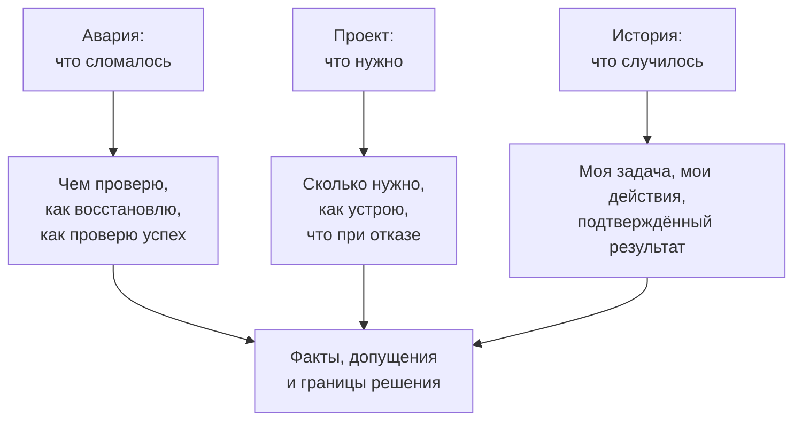
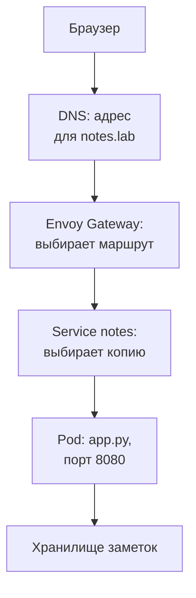
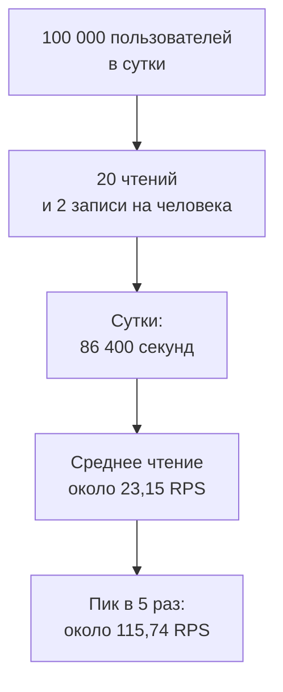
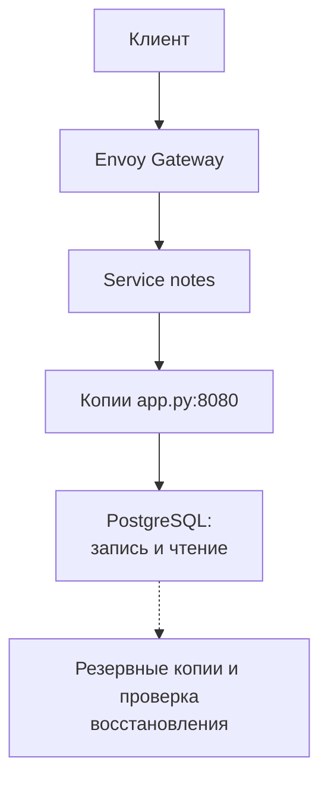

## Зачем это нужно

Мок-собеседование (mock interview) это тренировочное собеседование, на котором можно остановиться, разобрать ответ и попробовать снова. Как репетиция выступления перед другом, оно помогает заметить непонятные места до настоящего разговора с работодателем. Репетиция не предсказывает все вопросы, но без неё пробелы часто обнаруживаются уже на собеседовании.

Уровень middle обычно предполагает, что ты самостоятельно решаешь знакомые рабочие задачи и понимаешь, когда нужна помощь. Представь мастера, которому поручают ремонт целиком: он выбирает порядок действий и предупреждает, если нужна помощь другого специалиста. В IT названия уровней у компаний отличаются. Урок тренирует рассуждение, но прохождение курса само по себе не заменяет рабочий опыт.

Представь вопрос: «После обновления “Заметки” перестали открываться. Что сделаешь?» Ты уже знаешь несколько команд. Теперь нужно объяснить, какую выберешь первой, что ожидаешь увидеть и как результат изменит твои действия. Это пригодится и на собеседовании, и при настоящей поломке.

**Шаг проекта:** ты используешь работающие «Заметки» для учебной аварии, возвращаешь исходные настройки и собираешь из своего опыта проверяемые истории. Затем проектируешь возможное развитие сервиса на бумаге. Код `app.py` и версию образа менять не нужно. Образ (image) это готовый пакет файлов для запуска приложения в изолированной среде, контейнере (container); вспомни [урок о Dockerfile](../04-docker/02-dockerfile.md).

## Что нужно знать

Если термин из списка пока непонятен, вернись к указанному уроку. Ниже мы напомним значения, но не повторим установку всего стенда.

- [Собеседование junior](07-mock-interview-junior.md): junior это начальный уровень, на котором человек решает ограниченные задачи с помощью более опытных коллег. Здесь понадобятся объяснение базовых понятий и проверка ответов.
- [Учебное дежурство](01-oncall-drill.md): как оценивать влияние аварии и восстанавливать сервис.
- [Постмортем и runbook](02-postmortem-runbook.md): постмортем (postmortem) это разбор причин аварии и мер против повторения; runbook это пошаговая инструкция восстановления. Понадобится умение составлять оба документа.
- [Бэкапы и ёмкость](03-backup-dr-capacity.md): бэкап (backup) это сохранённая копия данных для восстановления, ёмкость (capacity) это объём работы, который выдерживает система при заданном качестве. Понадобятся проверка сохранности данных и расчёт потребности в ресурсах.
- [Распределённые системы](04-distributed-building-blocks.md): зачем нужны копии данных и разделение нагрузки.
- [Безопасность проекта](05-security-review.md): как ограничивать доступ и обращаться с паролями.
- [Kubernetes](../05-kubernetes/01-why-k8s-cluster.md) управляет запуском приложений на группе машин. В [уроке о Service и DNS](../05-kubernetes/03-services-dns.md) Service давал группе копий приложения постоянный адрес, а DNS переводил имя сервиса в этот адрес. [Пробы и выкатка](../05-kubernetes/07-probes-resources-rollouts.md) это проверки здоровья приложения и замена его версии; вместе с [диагностикой Kubernetes](../05-kubernetes/13-k8s-troubleshooting.md) они помогут проследить путь запроса.
- [Наблюдаемость и SLO](../08-observability/01-observability-slo.md): наблюдаемость (observability) позволяет понять состояние сервиса по измерениям и сообщениям о его работе. SLO (service level objective) это численная цель качества за выбранный период, например доля успешных чтений за месяц. Понадобится умение сопоставлять цель с результатом.

Для команд понадобятся Python 3 из [первого урока с приложением](../01-linux/01-first-server-shell.md) и локальный кластер из [урока 5.1](../05-kubernetes/01-why-k8s-cluster.md). Кластер (cluster) это группа машин, которой Kubernetes управляет как общей площадкой для приложений. Контейнер (container) это изолированная среда запуска программы из [урока 4.1](../04-docker/01-containers-idea.md). Инструмент kind из урока 5.1 запускает учебные машины кластера в таких контейнерах на твоём компьютере.

## Картина целиком

Собеседование похоже на разговор с мастером о протекающей крыше. Хороший мастер сначала узнаёт, где течёт и когда началось, затем предлагает временно защитить комнату и объясняет, как найдёт повреждение. Он не начинает со списка всех инструментов в мастерской. Аналогия ограничена: в IT наблюдения часто получают командами, а проверка сама иногда влияет на систему.

Три типа вопросов используют один порядок мысли:



Проектирование системы (system design) это выбор частей сервиса и способов их соединения под конкретные требования (requirements), то есть условия, которые система должна выполнять. Как при планировании кухни, ты сначала выясняешь число жильцов и нужную технику, затем выбираешь расположение мебели: без условий легко получить красивую, но неудобную схему. У сервиса вместо мебели есть программы и хранилища, а условия включают скорость ответа и сохранность данных; подробно разберём ниже. Тебе не нужно угадывать единственную схему. Нужно показать, почему твой вариант подходит, какую цену за него платишь и какие предположения ещё предстоит проверить.

## Теория

### Ответ как цепочка решений

На собеседовании собеседник видит только то, что ты произносишь. Если ты молча понял причину и сказал «исправлю настройки», он не узнает, на чём основан вывод. Поэтому хороший ответ содержит условия, проверку и следующий шаг. Такая структура помогает и тебе: ты замечаешь места, где пока просто угадываешь.

Аналогия: рецепт сообщает последовательность действий, а список продуктов только перечисляет возможности. Однако расследование не бывает готовым рецептом на все случаи. Новое наблюдение может изменить следующий шаг. Твоя задача состоит в том, чтобы объяснить этот переход, а не заучить неизменный порядок команд.

Начни с уточнения задачи. «Не открывается» может означать ошибку у одного человека, медленный ответ у всех или исчезнувшую заметку. Спроси, какой адрес проверяют, что видит пользователь, когда началось и какие изменения были перед этим. Если данных нет, явно предложи допущение (assumption), то есть условие, которое временно считаешь верным: «Буду считать, что проблема у всех и началась после обновления». Это как рассчитывать время поездки, предполагая, что пробок нет: можно составить план, но при новых сведениях его придётся изменить. Явное допущение позволяет продолжить разговор и показывает собеседнику, от какого условия зависит ответ; оно не заменяет наблюдение.

Дальше назови проверку и возможные развилки. Например: «Посмотрю готовность копий приложения. Если они готовы, проверю, выбирает ли Service эти копии. Если не готовы, посмотрю причину неудачной проверки готовности». Service это объект Kubernetes, который даёт группе копий приложения постоянное имя и адрес; подробнее в [уроке 5.3](../05-kubernetes/03-services-dns.md).

Закончить нужно критерием успеха: пользователь снова может прочитать и сохранить заметку, а не просто «команда выполнилась». Ответ можно начать за минуту, затем углубить по просьбе собеседника. Если сразу рассказывать обо всём курсе, теряется связь между условием и решением.

Разберём пример. вопрос «Нужно десять копий приложения?» превращается в три уточнения. Какова нагрузка? Сколько выдерживает одна копия при нужной скорости ответа? Что произойдёт при отказе одной машины? Без этих данных число десять не обосновано. Оно может оказаться и недостаточным, и расточительным.

> **Прикинь сам:** тебя спросили: «Нужно десять копий приложения?». С чего начать?
{: .predict}

С уточнений: какая нагрузка, сколько выдерживает одна копия и что будет при отказе машины. Без них число десять не обосновано.

> **Проверь понимание:** ты не работал с инструментом из вопроса. Как продолжить разговор?

<details markdown="1">
<summary>Ответ</summary>

Скажи, что не использовал его, уточни задачу и предложи порядок проверки на знакомых принципах. Например: «Не настраивал этот балансировщик, но сначала проверил бы, есть ли у него доступные получатели запросов». Балансировщик распределяет запросы между получателями. Не приписывай себе опыт, которого нет.

</details>

Осторожно: слово «зависит» принимают за полный ответ. Оно становится полезным только вместе с критерием: «Если упираемся в приложение, добавление копий может помочь; если все копии ждут одну перегруженную базу, сначала исследую базу».

> **Главное:** хороший ответ содержит уточнение задачи, проверку с развилками и критерий успеха.
{: .key}

Применим это к разбору аварии: сначала отделим факты от гипотез.

### Факт и гипотеза при разборе аварии

Инцидент (incident) это событие, которое нарушает нормальную работу сервиса; вспомни [учебное дежурство](01-oncall-drill.md). При инциденте легко принять первое объяснение за доказанную причину. Гипотеза (hypothesis) это проверяемое предположение о причине из [урока 10.7](07-mock-interview-junior.md). Факт это наблюдение: ответ запроса, строка журнала или значение измерения. Журнал (log) хранит сообщения программы о событиях; напоминание в [уроке о диагностике](../05-kubernetes/13-k8s-troubleshooting.md).

Аналогия: лампа не светится. Это факт. «Перегорела лампочка» это гипотеза, потому что мог отключиться автомат. Если заменить лампочку и свет не появится, гипотеза ослабнет. В сервисе всё сложнее: могут одновременно существовать две поломки, а состояние меняется во время проверки.

Проверяй путь запроса по границам компонентов. Запрос HTTP это сообщение клиента серверу с просьбой выполнить действие, например показать заметки. Клиентом может быть браузер. DNS переводит имя `notes.lab` в сетевой адрес. Повторить основы можно в [уроке о DNS](../02-network/03-dns.md) и [уроке об HTTP](../02-network/04-http.md).



Проверяй путь по границам: ошибка на входе и пустой Service указывают на разные звенья.

Gateway API это набор объектов Kubernetes для описания входа и маршрутов запросов. Envoy Gateway реализует эти правила; подробнее в [уроке 5.4](../05-kubernetes/04-ingress-gateway.md). Pod (под) это единица запуска Kubernetes с одним или несколькими контейнерами; [урок 5.2](../05-kubernetes/02-pods-deployments.md). Порт (port) это номер сетевой «двери», на которой приложение принимает подключения; напоминание в [уроке об HTTP](../02-network/04-http.md).

Метка (label) это пара «имя: значение» на объекте. Селектор (selector) это условие выбора подов по меткам. Пространство имён (namespace) это именованная область объектов кластера, здесь `notes`. Service ищет подходящие поды в своей области; эти понятия ты использовал в [уроке 5.3](../05-kubernetes/03-services-dns.md).

Разберём пример. на входе получен `503`, все поды готовы, но у Service нет адресов получателей. Код `503` означает, что сервер сейчас не может обслужить запрос. Эти факты делают ошибку выбора подов вероятнее, чем падение процесса `app.py`. Процесс (process) это запущенная программа из [урока 1.4](../01-linux/04-processes-signals.md). Сравнение меток подов с условием выбора Service подтвердит или опровергнет гипотезу. Один код ответа сам по себе причину не доказывает.

Если адреса есть, проверяй их готовность и доступность. Код `502` означает некорректный ответ от следующего сервера, `504` означает, что посредник не дождался ответа. Они указывают направление поиска, но не заменяют проверку.

> **Прикинь сам:** Service пуст, а поды готовы. Доказано ли, что у подов неверные метки?
{: .predict}

Нет: возможно, неверен selector самого Service. Сравни обе стороны и проверь namespace.

Осторожно: «после релиза» превращают в «из-за релиза». Релиз (release) это выпуск версии приложения или настроек из [урока о выкатке](../05-kubernetes/07-probes-resources-rollouts.md). Совпадение по времени полезно для первой гипотезы. Подтверждением могут стать различия настроек и исчезновение проблемы после возврата прежнего значения.

> **Главное:** факт это наблюдение, гипотеза это проверяемое предположение, а «после релиза» не равно «из-за релиза».
{: .key}

Причина найдена не сразу, а пользователи ждать не могут: нужна митигация.

### Митигация, откат и подтверждение восстановления

Митигация (mitigation) это уменьшение ущерба, даже если полная причина ещё не установлена. Исправление причины устраняет механизм поломки. Разница нужна, потому что пользователи не могут ждать часового расследования. В [уроке 10.1](01-oncall-drill.md) ты уже разделял эти задачи.

Аналогия: при протечке перекрывают воду, затем меняют повреждённую трубу. Перекрытие останавливает ущерб, но оставляет дом без воды. В сервисе тоже важно учитывать побочный эффект: отключение записи сохраняет чтение, но пользователь пока не может создать заметку.

Сначала оцени влияние: какие операции не работают, у скольких пользователей и как долго. Затем выбери действие с понятным эффектом. Откат (rollback) возвращает прежнюю версию приложения или настройки; вспомни [урок о выкатке](../05-kubernetes/07-probes-resources-rollouts.md). Он подходит, когда проблема связана с недавним изменением и прежнее состояние остаётся совместимым с данными. Если доказана опечатка в selector, исправление одного поля может быть проще отката всего релиза.

Разберём пример. в 14:00 изменили настройку, в 14:02 запросы начали возвращать ошибки. В 14:05 ты вернул прежнее значение, в 14:06 чтение снова работает. Время от начала нарушения до восстановления: `14:06 - 14:02 = 4 минуты`. Время расследования после 14:06 сюда не входит. Зафиксируй, что восстановлено: чтение, запись, все пользователи или только часть.

Перед широким откатом уточни, менялась ли структура базы. Миграция (migration) это изменение её структуры, например добавление столбца. Если новая версия удалила столбец, который читает старая, возврат старого приложения создаст новую ошибку. Безопаснее заранее делать совместимые изменения: добавить новое поле, обновить приложение, а удалить старое позднее. Подробнее в [уроке о PostgreSQL](../05-kubernetes/05-storage-statefulset-postgres.md).

После действия проверь пользовательскую операцию и состояние системы. Проверка `/readyz` показывает готовность приложения, но не доказывает, что внешние маршруты работают и запись действительно сохраняется. Сохранение и повторное чтение тестовой заметки дают дополнительное свидетельство. Не выдавай один успешный запрос за доказательство устойчивой работы под нагрузкой.

> **Прикинь сам:** в 14:02 начались ошибки, в 14:06 после отката чтение заработало. Сколько длилось нарушение чтения?
{: .predict}

`14:06 - 14:02 = 4 минуты`. Время расследования после 14:06 сюда не входит.

> **Проверь понимание:** можно ли откатить приложение сразу после удаления используемого им столбца?

<details markdown="1">
<summary>Ответ</summary>

Не без проверки совместимости. Старая версия может обращаться к отсутствующему столбцу. Нужен заранее подготовленный план восстановления, который учитывает приложение и данные.

</details>

Осторожно: перезапуск называют исправлением. Он может временно помочь, но без объяснения причины ошибка вернётся. Перед действием сохрани доступные наблюдения, если это не задерживает срочное восстановление. Затем запиши итог в [постмортем](02-postmortem-runbook.md), разбор причин и предотвращения повторения.

> **Главное:** митигация уменьшает ущерб до выяснения причины, а восстановление подтверждают пользовательской операцией.
{: .key}

Чтобы не говорить «стало хуже», нужны измерения.

### Метрики: как заменить «стало хуже» измерением

Метрика (metric) это числовое измерение, которое собирают во времени: число запросов, доля ошибок, длительность ответа. Она нужна, чтобы сравнивать состояние до и после изменения. Наблюдаемость (observability) это возможность понимать состояние системы по таким измерениям и сообщениям о её работе; [урок 8.1](../08-observability/01-observability-slo.md).

Аналогия: градусник позволяет отличить «кажется, жарко» от температуры 38,5 °C. Но один градусник не объясняет причину болезни. Так же график процессора показывает нагрузку, но не доказывает, почему запросы замедлились. CPU (центральный процессор) выполняет инструкции программы; вспомни [урок о ресурсах машины](../01-linux/05-disk-memory-cpu.md). Высокая загрузка может быть нормальной работой или симптомом проблемы.

Для ответа про «Заметки» сначала выбери пользовательскую операцию и период. Например, рассматриваем чтение `/notes` за пять минут. Получено 2000 запросов, из них 80 закончились серверной ошибкой. Доля ошибок: `80 / 2000 = 0,04`, или `0,04 × 100 = 4%`. Нельзя сравнить это с «80 ошибками вчера», не зная вчерашнее число запросов.

Задержка (latency) это время ожидания ответа. Среднее значение может скрыть небольшую группу очень медленных запросов. Перцентиль (percentile) p99 это граница, в которую укладываются примерно 99% измерений; вспомни [урок о наблюдаемости](../08-observability/01-observability-slo.md). В упрощённом примере отсортируй 100 длительностей от меньшей к большей: 99-я позиция иллюстрирует p99, а самая медленная остаётся за границей. Реальные инструменты могут вычислять границу с приближением.

Разберём пример. до обновления p99 чтения был 200 мс, после стал 800 мс. Миллисекунда (мс) это тысячная секунды. Ухудшение в `800 / 200 = 4` раза. Если согласованная цель требует 99% чтений быстрее 300 мс, проблема есть даже при отсутствии ошибок. Затем проверяй, изменились ли нагрузка, обработка запроса или ожидание хранилища.

SLI (service level indicator) это выбранный показатель качества, например доля успешных чтений; вместе с SLO ты разбирал его в [уроке 8.1](../08-observability/01-observability-slo.md). SLO (service level objective) это его целевое значение за оговорённый период. При цели 99,9% успешных запросов и миллионе запросов допустимы `1 000 000 × 0,001 = 1000` неуспешных. Это бюджет ошибок (error budget), допустимое число неуспешных операций из того же урока. Он считается по выбранному показателю; нельзя автоматически превращать его в минуты простоя.

> **Прикинь сам:** ошибок нет, но p99 вырос с 200 до 800 мс. Релиз безопасен?
{: .predict}

Нет, если цель по задержке нарушена: качество ухудшилось даже без серверных ошибок. Рост в `800 / 200 = 4` раза.

Осторожно: цель принимают за результат измерения. «Мы хотим 99,9%» ещё не означает «мы достигли 99,9%». Для доказательства нужны период, правила подсчёта и данные. Отсутствие данных тоже стоит назвать вслух.

> **Главное:** метрика сравнивается до и после изменения, а цель SLO не равна результату измерения.
{: .key}

Теперь проектирование: сначала требования, потом схема.

### Требования перед проектированием

Проектирование начинается с договорённости о задаче. Требования (requirements) это условия, которым должна соответствовать система. Без них можно построить дорогую схему, которая отлично принимает запросы, но теряет важные заметки. Вопросы о требованиях показывают, что ты понимаешь назначение сервиса.

Аналогия: перед строительством дома выясняют число жильцов, климат и бюджет. Нарисовать десять этажей можно сразу, но это не решает задачу семьи из двух человек. В IT дополнительно приходится учитывать изменчивость нагрузки и данных: сегодняшняя оценка может перестать подходить через год.

Функциональные требования (functional requirements) описывают действия пользователя: создать заметку, прочитать свои заметки, изменить текст. В примере с домом это возможность готовить еду на кухне: указание, что именно можно делать. Нефункциональные требования (non-functional requirements) описывают условия работы: допустимую задержку, объём данных, ограничения доступа, поведение при отказе. В доме это, например, допустимый уровень шума вытяжки: готовить можно, но пользоваться кухней должно быть удобно. В сервисе условия проверяют измерениями и испытаниями, а не ощущениями жильца. Оба вида нужны: без первого можно построить систему без нужной операции, без второго оставить её непригодной при реальной нагрузке. Быстрое чтение чужих приватных заметок не считается правильной работой.

Разберём пример. тебе предложили «Заметки на миллион пользователей». Сначала уточни, зарегистрированные это пользователи или активные за сутки. Затем выясни число чтений и записей, размер заметки, срок хранения, допустимость потери последних изменений и время восстановления. Эти вопросы дают разные численные ограничения, которые дальше можно проверить.

Две цели восстановления напомнят [урок 10.3](03-backup-dr-capacity.md). RPO (recovery point objective) это допустимая потеря данных, выраженная временем. При RPO 15 минут потеря последних двух часов неприемлема. RTO (recovery time objective) это допустимое время возврата сервиса в работу. При RTO один час недостаточно просто найти резервную копию: нужно уложить восстановление и проверку в час.

Резервная копия (backup) хранит отдельный сохранённый вариант данных. Представь копию на 12:00 и поломку в 12:40. Если других сохранённых изменений нет, потенциально теряются 40 минут записей. Если восстановление началось в 12:45 и сервис готов в 13:15, сама процедура заняла 30 минут, а нарушение работы длилось 35 минут. Уточни, от какого события команда считает RTO, и не скрывай время до начала процедуры.

Запиши допущения рядом со схемой: «100 тысяч активных пользователей в сутки; пик в пять раз выше среднего; допустима потеря не более 15 минут записей». Если собеседник меняет условие, пересчитай решение. Это нормальная часть разговора.

> **Прикинь сам:** копии базы делают раз в два часа. Гарантирует ли это RPO 15 минут?
{: .predict}

Нет: без отдельного сохранения изменений между копиями потеря может приблизиться к двум часам.

Осторожно: реплику и резервную копию. Реплика (replica) получает изменения исходной базы, поэтому может быстро повторить случайное удаление. Копия позволяет вернуть прежний момент. Их роли различаются; наличие одной защиты не отменяет другую.

> **Главное:** проектирование начинается с функциональных и нефункциональных требований, RPO и RTO, а допущения записывают рядом со схемой.
{: .key}

Требования известны. Переведём их в числа: оценим нагрузку.

### Оценка нагрузки с единицами и допущениями

Оценка нагрузки нужна, чтобы выбрать отправную точку и понять, что измерять. RPS (requests per second) это число запросов в секунду из [урока о ёмкости](03-backup-dr-capacity.md). Само число пользователей не сообщает RPS: человек может открыть приложение один раз или отправлять запрос каждую секунду.

Аналогия: пропускную способность столовой определяет число посетителей в час и сложность заказов. Сто быстрых заказов и сто сложных требуют разных ресурсов. Так же одинаковый RPS чтения небольшого текста и тяжёлого поиска не означает одинаковую нагрузку на базу.

Возьмём условие для проектирования будущих «Заметок»: 100 000 активных пользователей в сутки, каждый делает 20 чтений и 2 записи. Сутки содержат `24 × 60 × 60 = 86 400` секунд. Чтений за сутки: `100 000 × 20 = 2 000 000`. Среднее: `2 000 000 / 86 400 ≈ 23,15 RPS`. Записей: `100 000 × 2 = 200 000`, среднее: `200 000 / 86 400 ≈ 2,31 RPS`.



Каждая стрелка это допущение или единица, которую нужно назвать вслух.

Предположим пик в пять раз выше среднего. Тогда чтение достигает `2 000 000 / 86 400 × 5 ≈ 115,74 RPS`, запись `200 000 / 86 400 × 5 ≈ 11,57 RPS`. Результаты посчитаны без промежуточного округления. Коэффициент пять задан условием, а не универсальным законом. На настоящем сервисе его нужно получить из истории нагрузки.

Разберём хранение. считаем, что каждая запись создаёт новую заметку размером 2 кБ, где для этой оценки 1 кБ равен 1000 байтам. Байты измеряют объём данных. За год без удалений получим `200 000 × 365 = 73 000 000` заметок. Их текст займёт `73 000 000 × 2000 = 146 000 000 000` байт, или 146 ГБ при 1 ГБ равном миллиарду байт. Обновление существующей заметки даст другую оценку роста.

Это только текст. Индекс (index) это вспомогательная структура базы для быстрого поиска из [урока об основах PostgreSQL](../04-docker/04-sql-postgres-basics.md); он тоже занимает место. Добавятся служебные поля, журнал изменений и резервные копии. Поэтому 146 ГБ нельзя сразу превратить в размер диска. Для начала обозначь составляющие, затем измерь их на тестовых данных.

Средняя нагрузка также не равна числу одновременно выполняемых запросов. При устойчивых 100 RPS и среднем ожидании 0,2 секунды получается примерно `100 × 0,2 = 20` запросов в работе одновременно. Если ожидание растёт до 2 секунд, получится уже около 200. Это помогает понять, почему замедление зависимости увеличивает потребность в ресурсах.

> **Прикинь сам:** 100 000 пользователей по 20 чтений в сутки. Сколько это в среднем RPS?
{: .predict}

`100 000 × 20 / 86 400 ≈ 23,15 RPS`. Пик в пять раз выше даёт около 115,74 RPS, коэффициент задан условием.

> **Проверь понимание:** среднее равно 25 RPS. Можно ли выбрать систему, рассчитанную ровно на 25 RPS?

<details markdown="1">
<summary>Ответ</summary>

Этого недостаточно. Нужно учитывать пики, время ответа, рост данных и потерю части ресурсов при отказе. Саму способность обслужить выбранную нагрузку подтверждают испытанием.

</details>

Осторожно: арифметическую оценку принимают за доказательство производительности. Из 116 чтений в секунду не следует, что любая база их выдержит. Нужно испытать конкретные запросы, данные и машину. Нагрузочный тест (load test) создаёт заданный поток запросов и измеряет поведение системы; [урок о ёмкости](03-backup-dr-capacity.md).

> **Главное:** оценка идёт с единицами и допущениями, а арифметика не заменяет нагрузочного испытания.
{: .key}

Числа есть. Теперь соберём схему и назовём цену каждого компонента.

### Архитектура и цена дополнительного компонента

Архитектура (architecture) описывает части системы, их связи и ответственность. Это как план дома, на котором видны комнаты, проходы и назначение каждого помещения; в сервисе такой план помогает понять путь запроса и место поломки. План описывает устройство, но сам по себе не доказывает, что дом прочный или сервис выдержит нагрузку.

Компромисс (trade-off) это выигрыш в одном свойстве ценой другого. Например, большая кладовка даёт больше места для вещей, но уменьшает жилую комнату при той же площади квартиры. В сервисе тоже нужно назвать цену выбора, иначе предложение «добавим ещё один компонент» выглядит бесплатным улучшением, хотя компонент придётся настраивать, обновлять и восстанавливать. В отличие от квартиры, часть ресурсов сервиса можно докупить, но это меняет расходы.

Аналогия: второй кассир уменьшает очередь, но не ускоряет единственного повара. В приложении добавление копий тоже помогает только до следующего ограничения. Узкое место (bottleneck) это часть, которая ограничивает общую скорость. Найди его измерением, прежде чем увеличивать всё подряд.

Начальная схема развития «Заметок» может выглядеть так:



Пунктир показывает отдельный контур защиты данных: он не участвует в обработке запроса, но нужен при потере данных.

PostgreSQL это сервер базы данных, который хранит записи и отвечает на запросы к ним; [урок 5.5](../05-kubernetes/05-storage-statefulset-postgres.md). В учебном проекте `app.py` на стандартном модуле Python `http.server` принимает запросы `/healthz`, `/readyz`, `/metrics`, `/notes`. `/metrics` отдаёт измерения для наблюдения. Здесь ты проектируешь развитие существующего сервиса, а не обещаешь, что его учебная реализация уже выдерживает рассчитанный пик.

Для нескольких копий важно общее хранилище. Если каждая пишет собственный локальный файл, пользователь может сохранить заметку через одну копию и не увидеть её через другую. Контейнеры не превращают отдельные файлы в общие данные. При варианте с PostgreSQL копии приложения обращаются к одной согласованной точке записи.

Разберём пример. тест показывает, что приложение использует весь процессор, а база отвечает быстро. Дополнительная копия приложения может помочь, если есть свободные ресурсы для её запуска. Если каждая копия ждёт один медленный запрос базы, увеличение числа копий способно усилить перегрузку. Сначала выясни причину ожидания и проверь способ поиска данных.

Число копий должно учитывать отказ. Допустим, испытание одной копии на выбранной машине показало предел 80 чтений в секунду при нужном времени ответа. Для расчёта округлим ранее полученный пик 115,74 до 116 чтений в секунду. Две копии дают расчётные `2 × 80 = 160` чтений в секунду: при нормальной работе этого хватает. После потери одной остаётся `1 × 80 = 80`, а `80 < 116`: ожидаемый пик уже не помещается. Для переноса того же пика после потери одной копии понадобится хотя бы три: `(3 - 1) × 80 = 160`. Запись и нагрузку базы нужно проверить отдельно. Число 80 здесь условное, это не измеренная производительность учебных «Заметок».

Этот расчёт предполагает, что копии не мешают друг другу и запросы распределяются достаточно равномерно. Если все они используют один занятый процессор, суммарная скорость не станет втрое выше. Если три копии находятся на одной машине, её отказ уберёт все три сразу. Как с тремя кассами в одном магазине: закрытие всего здания прекращает работу каждой. Поэтому после арифметики проверь размещение, общие зависимости и работу при исключении одной машины. Назови и границу вывода: три копии могут быть отправной точкой испытания, но ещё не обещанием выдержать пик при отказе.

Кеш (cache) хранит временную копию результата ради быстрого повторного чтения. За это приходится решать, когда копия устарела. Реплика для чтения уменьшает нагрузку на основную базу, но может отставать: сразу после записи пользователь рискует увидеть старый текст. Шардирование (sharding) делит данные между несколькими базами и усложняет поиск и перенос данных. Эти варианты разобраны в [уроке 10.4](04-distributed-building-blocks.md).

> **Прикинь сам:** один под выдерживает 80 чтений в секунду, пик 116. Хватит двух копий?
{: .predict}

Две копии дают 160, но при отказе одной остаётся 80, меньше 116. Нужна третья или другой расчёт.

> **Проверь понимание:** чтений в сто раз больше записей. Доказано ли, что первым нужен кеш?

<details markdown="1">
<summary>Ответ</summary>

Нет. Чтения могут быть дешёвыми, а редкие записи очень тяжёлыми. Нужно измерить стоимость операций и выяснить, повторяются ли результаты чтения и допустима ли их временная устарелость.

</details>

Осторожно: «простая схема» принимается за отказ обсуждать рост. Сильный ответ называет следующий шаг и его условие: «Начну без кеша. Если измерения покажут повторяющиеся дорогие чтения, проверю кеширование и допустимость устаревших ответов». Так решение остаётся простым, но имеет план развития.

> **Главное:** каждый добавленный компонент имеет цену, а узкое место находят измерением до того, как масштабировать.
{: .key}

Схема должна объяснять и поведение при отказе.

### Отказы и безопасное обновление

Схема должна объяснять поведение при отказе, а не только при нормальной работе. Доступность (availability) описывает возможность пользоваться сервисом по выбранному критерию. Две копии приложения на одной машине могут пережить падение одного процесса, но обе пропадут при отказе машины. Число копий без знания их размещения мало говорит о защите.

Аналогия: два запасных ключа в одном потерянном рюкзаке не дают независимой страховки. Однако в IT даже разные машины могут зависеть от общей сети или хранилища. Зона доступности (availability zone) это отдельная площадка облака с частью независимой инфраструктуры; [урок об облаке](../06-cloud/index.md). Разнесение по зонам уменьшает некоторые общие риски, но не исправляет ошибку, одновременно выпущенную на все копии.

Пройди по схеме и задай один вопрос каждой части: «Что увидит пользователь, если она перестанет работать?» Для отказа одной копии приложения ожидается переход запросов к другим готовым копиям, если им хватает ресурсов. Для отказа основной базы нужен отдельно продуманный способ восстановления записи. Наличие реплики не доказывает, что переключение происходит автоматически и без потерь.

Разберём обновление. Deployment это объект Kubernetes, который поддерживает нужное число подов и заменяет их при изменении описания; [урок 5.2](../05-kubernetes/02-pods-deployments.md). При последовательной замене (rolling update) запускается новая копия, затем после её готовности убирается старая. Это вариант с дополнительной копией на время обновления из [урока 5.7](../05-kubernetes/07-probes-resources-rollouts.md). При нехватке ресурсов новая копия может не запуститься. При неверной проверке готовности она может получить запросы раньше, чем способна их обработать.

Проверка готовности (readiness probe) периодически выясняет, можно ли отправлять приложению обычные запросы. Для «Заметок» используется `/readyz`. Проверка жизнеспособности (liveness probe) выясняет, не требуется ли перезапуск зависшего приложения; используется `/healthz`. Переменная окружения (environment variable) это именованная настройка, переданная программе при запуске; вспомни [урок об оболочке](../01-linux/06-bash-basics.md). `READY_FAIL` включает искусственную неготовность. Если readiness не проходит, это само по себе не перезапускает контейнер. Под может быть `Running`, то есть запущенным, но `0/1` готовым. Подробности в [уроке о пробах](../05-kubernetes/07-probes-resources-rollouts.md).

EndpointSlice это объект со списком адресов получателей Service и признаками их готовности из [урока 5.3](../05-kubernetes/03-services-dns.md). Он помогает различить отсутствие подходящих подов и наличие неготовых. Если ни один под не подходит под selector, адресов нет. При неготовности адреса могут оставаться в списке с `ready: false`. Краткий список адресов без признаков готовности нельзя считать доказательством здоровья сервиса.

> **Прикинь сам:** две копии приложения работают на одной машине. Защищены ли они от её отказа?
{: .predict}

Нет: нужно независимое размещение и достаточная ёмкость оставшихся машин.

Осторожно: успешное применение описания считают успешным релизом. Оно подтверждает, что Kubernetes принял изменение. Нужно дождаться готовности и проверить внешнюю пользовательскую операцию. Для версии используй явный тег вида `ghcr.io/<user>/notes:0.4.1`, где `<user>` заменяется владельцем образа, либо фактическую более новую версию проекта. Тег это имя версии образа, готового пакета для запуска контейнера. Тег `latest` не даёт ясной привязки; [урок 5.2](../05-kubernetes/02-pods-deployments.md).

> **Главное:** для каждой части схемы задают вопрос «что увидит пользователь при её отказе», а релиз подтверждают готовностью и внешним запросом.
{: .key}

Остался последний тип вопросов: поведенческий.

### История STAR и честная граница опыта

Поведенческий вопрос выясняет, как ты принимал решения, взаимодействовал с людьми и учился на ошибках. Формат STAR помогает отделить контекст от твоего участия: Situation (ситуация), Task (задача), Action (действие), Result (результат). Без этой структуры рассказ легко превращается в «мы всё исправили», и слушатель не понимает, что сделал именно ты.

Аналогия: сосед спрашивает, как ты починил протекающий кран. Ему легче понять рассказ «под краном появилась лужа; нужно было остановить течь; я перекрыл воду и заменил прокладку; после открытия воды течи не было», чем «купил прокладку, сходил за ключом, всё починил». STAR так же связывает условия, цель, действие и результат. Но история о сервисе может включать работу многих людей: важно объяснить собственный выбор, что было неизвестно и когда ты привлёк помощь.

Сначала обозначь границу опыта: «Это учебная авария на моём локальном стенде». Затем назови задачу и наблюдения. В действии покажи свой выбор между вариантами. Результат привяжи к доказательству: запись времени, успешное чтение заметки, сохранённая инструкция восстановления (runbook). Не нужно придумывать проценты улучшения, если раньше их не измерял; [урок о runbook](02-postmortem-runbook.md).

Разберём пример с условными временами. «На учебном стенде я намеренно изменил selector Service. Хотел найти причину недоступности без перезапуска приложения. Сравнил готовность подов, список адресов и selector, затем восстановил исходное условие выбора. Через три минуты адреса вернулись и внешний запрос прошёл. Я дописал в инструкцию проверку selector перед перезапуском». Три минуты становятся твоим результатом только после собственного измерения.

Разложим пример по четырём частям:

- **S, ситуация:** поломка создана намеренно на учебном стенде. Собеседник понимает условия и не принимает этот опыт за аварию у настоящих пользователей.
- **T, задача:** найти причину недоступности без перезапуска. Это цель, по которой можно оценить выбор действий.
- **A, действие:** сравнить готовность, адреса и условие выбора. Готовые поды при пустом списке адресов направили поиск к выбору получателей; так видно, почему ты проверил настройки Service.
- **R, результат:** адреса вернулись, внешний запрос прошёл, инструкция дополнена. Первые два наблюдения подтверждают восстановление, третье показывает, что ты сохранил вывод для следующего случая.

Если не записывал время, убери «через три минуты» и оставь проверенный результат. Если работали вдвоём, уточни: «Напарник проверил входной маршрут, я сравнил selector и метки». Это даёт слушателю возможность оценить твою часть работы. Перечень инструментов без связи с наблюдениями не заменяет часть A.

Если спрашивают о конфликте с коллегой, а у тебя такого опыта нет, скажи это. Можно привести настоящее разногласие в совместной учёбе или другой работе, если оно было, и объяснить способ договориться. Если реального примера нет, отдели рассуждение: «Коммерческого опыта такого спора у меня пока нет. В предложенной ситуации я бы уточнил срочность, риск и наличие человека для восстановления». Это ответ на ситуацию, а не выдуманная история.

Для вопроса о релизе вечером полезно обсудить совместную цель: доставить изменение без неприемлемого ущерба. Если есть срочное исправление и проверенный откат, ожидание до понедельника тоже имеет цену. Если изменение несрочное, а поддержки нет, перенос может быть разумным. День недели сам по себе не решает вопрос.

> **Прикинь сам:** можно ли назвать учебное восстановление опытом поддержки настоящих пользователей?
{: .predict}

Нет: назови его учебным и покажи реальные действия и результаты.

Осторожно: отсутствие опыта считают поводом признаться в выдуманной ошибке. Честное «не было такого случая» нормально. Дополни его знакомым примером или планом изучения. При этом «не знаю» без попытки понять задачу не помогает показать способ мышления.

> **Главное:** STAR связывает ситуацию, задачу, твоё действие и подтверждённый результат, а границу опыта называют честно.
{: .key}

Теории достаточно. В практике ты проведёшь проектирование за 40 минут и пробное интервью.

## Практика

### Задание 1. Пройди проектирование «Заметок» за 40 минут

Возьми лист бумаги и таймер. Условие: 100 тысяч активных пользователей в сутки, 20 чтений и 2 создания заметки на человека, текст 2 кБ, пик в пять раз выше среднего. Цели для обсуждения: 99,9% успешных чтений за месяц, p99 чтения до 300 мс, RPO 15 минут, RTO один час. Это условие упражнения, а не измеренные свойства твоего проекта.

| Время | Что подготовить | Как проверить себя |
|---|---|---|
| 0-5 минут | Действия пользователя, допущения, цели | Отличены активные пользователи от зарегистрированных |
| 5-10 минут | Нагрузка и рост данных | У каждого числа есть единица и вычисление |
| 10-20 минут | Начальная схема | У каждой части есть задача |
| 20-30 минут | Узкое место и один вариант развития | Названы измерение и цена изменения |
| 30-35 минут | Отказ приложения и базы | Объяснены последствия для чтения и записи |
| 35-40 минут | Обновление, откат, проверка восстановления | Указан пользовательский критерий успеха |

Сначала посчитай сам, затем проверь арифметику Python. `python3` запускает интерпретатор, `-` заставляет читать программу из стандартного ввода. `<<'PY'` передаёт строки до отдельной строки `PY` без подстановок оболочки. Оболочка (shell) это программа, которая разбирает введённые команды. Присваивание `=` сохраняет значение под именем; `*` умножает, `/` делит. `print` выводит результат, `round(..., 2)` округляет до двух знаков.

```bash
python3 - <<'PY'
# Условие упражнения: каждый пользователь создаёт две новые заметки в сутки.
users = 100_000
seconds = 24 * 60 * 60
reads = users * 20 / seconds
writes = users * 2 / seconds
print("Среднее чтение, RPS:", round(reads, 2))
print("Средняя запись, RPS:", round(writes, 2))
print("Пик чтения, RPS:", round(reads * 5, 2))
print("Пик записи, RPS:", round(writes * 5, 2))
# Считаем только текст, без индексов и резервных копий.
print("Текст за год, ГБ:", users * 2 * 365 * 2000 / 1_000_000_000)
PY
```

Ожидаемый вывод:

```text
Среднее чтение, RPS: 23.15
Средняя запись, RPS: 2.31
Пик чтения, RPS: 115.74
Пик записи, RPS: 11.57
Текст за год, ГБ: 146.0
```

**Как читать вывод:** первые две строки показывают среднюю частоту операций. Следующие две учитывают заданный пик. Последняя показывает рост текста при ежедневном создании новых заметок. Числа не доказывают, что выбранная машина справится: в схеме нужен пункт «проверить нагрузочным тестом».

После схемы произнеси решение вслух за две минуты. Пример начала: «Использую общее хранилище для всех копий приложения. Начну без кеша, потому что пока нет измерения дорогих повторных чтений. Проверю пик на данных, близких к ожидаемым, включая отказ одной копии». Затем объясни, чем подтвердить цели восстановления.

**Типичные ошибки:** `python3: command not found` означает, что интерпретатор не установлен или не найден оболочкой: выполни установку из указанного урока о приложении. `SyntaxError: invalid syntax` обычно означает ошибку в скопированной программе: проверь кавычки, операторы и отдельную завершающую строку `PY`. Если терминал продолжает ждать ввод, убедись, что `PY` написано без отступа.

### Задание 2. Сделай ответ проверяемым

Перепиши три слабых ответа. Для каждого нужны уточнение, гипотеза, проверка, действие и условие, при котором действие поможет.

| Вопрос | Слабый ответ | Что должно появиться |
|---|---|---|
| После обновления чтение медленное | «Добавлю копии» | p99, сравнение нагрузки, проверка узкого места |
| Поды запущены, сайт недоступен | «Удалю поды» | Готовность, selector, адреса Service, внешний запрос |
| Как защитишь данные? | «Есть реплика» | RPO, RTO, копии, проверка восстановления |

Для первого вопроса возможен ответ: «Уточню, насколько выросло время ответа и какие операции затронуты. Сравню p99 и нагрузку до обновления и после него. Если задержка связана с приложением, проверю возврат предыдущей совместимой версии. Если ожидание в базе, добавление копий может усилить нагрузку. Успех проверю по чтению заметок и целевому времени ответа».

Сначала отметь в своём ответе факты. Затем отдельно подпиши предположения. Если нет реальных измерений, используй условные числа и прямо назови их условными. Результат задания: три ответа по пять-семь предложений, которые можно проверить, а не просто оценить по уверенности голоса.

**Типичные ошибки:** ответ «нужно больше ресурсов» без указания измерения оставляет причину неизвестной. Исправь его развилкой: что должно наблюдаться, чтобы увеличение ресурсов помогло? Ответ «сделаю откат» без проверки совместимости данных тоже неполон. Допиши условия, при которых старое приложение сможет работать с текущей базой.

### Задание 3. Собери истории и проведи пробное интервью

Подготовь три карточки STAR из учебного проекта: диагностика аварии, восстановление копии и исправление настройки безопасности. Для каждой запиши исходную ситуацию, свою задачу, действия с причиной выбора и результат с доказательством. При отсутствии измеренного времени используй проверяемый итог: «Восстановленная заметка совпала с исходной».

Возьми десять вопросов из раздела ниже. На каждый дай короткий ответ без подсказки, затем открой разбор. Поставь себе четыре отдельные отметки: уточнил условия; предложил проверку; объяснил цену решения; назвал критерий успеха. Для вопроса об опыте последняя отметка означает подтверждённый результат. Запиши два самых слабых места и ссылки на уроки для повторения.

Если нет напарника, запиши голос на телефоне. При повторном прослушивании проверь не красоту речи, а переходы: почему после этого наблюдения следует именно это действие? Результат тренировки: три карточки и список конкретных пробелов. Одна репетиция не подтверждает готовность к любой вакансии, но показывает, что повторять дальше.

**Типичные ошибки:** переписать чужой результат как собственный или запомнить текст ответа без понимания развилок. Возьми своё действие из проекта и попроси напарника изменить одно условие вопроса. Если решение осталось тем же, проверь, действительно ли новое условие ничего не меняет.

## Сломай и почини

### Подготовь работающий стенд

Ты намеренно изменишь selector Service `notes`, сохранишь исходное значение и вернёшь его. Работай в локальном `kind-notes`, namespace `notes`, на установке «Заметок» из [уроков 5.3](../05-kubernetes/03-services-dns.md) и [5.7](../05-kubernetes/07-probes-resources-rollouts.md). Вход через `notes.lab` настраивается в [уроке 5.4](../05-kubernetes/04-ingress-gateway.md).

Если этим Service уже управляет Flux, программа, возвращающая настройки из Git, используй учебную установку без такого управления из темы 5. Git хранит историю изменений файлов; ты использовал его в теме 3. GitOps это подход, при котором желаемые настройки хранят в Git, а контроллер приводит систему к ним. Контроллер (controller) это программа, которая сравнивает желаемое состояние с фактическим и исправляет расхождения. Иначе Flux может отменить поломку до диагностики; напоминание в [уроке о GitOps](../09-secrets-gitops/03-gitops-flux.md). Здесь не требуется менять рабочие настройки GitOps.

`kubectl` обращается к Kubernetes. `--context=kind-notes` явно выбирает локальный кластер, `-n notes` ограничивает область поиска. `get pods` перечисляет поды, `-l app.kubernetes.io/name=notes` выбирает поды по метке, `--show-labels` показывает метки. `get svc notes -o wide` показывает расширенные сведения о Service; `svc` сокращает `service`.

```bash
kubectl --context=kind-notes get pods -n notes -l app.kubernetes.io/name=notes --show-labels
kubectl --context=kind-notes get svc notes -n notes -o wide
```

Пример вывода для одной копии:

```text
NAME                     READY   STATUS    RESTARTS   AGE   LABELS
notes-6b7d5c9c8f-abcde    1/1     Running   0          10m   app.kubernetes.io/name=notes,pod-template-hash=6b7d5c9c8f

NAME    TYPE        CLUSTER-IP     EXTERNAL-IP   PORT(S)    AGE   SELECTOR
notes   ClusterIP   10.96.120.10   <none>        8080/TCP   10m   app.kubernetes.io/name=notes
```

**Как читать вывод:** `NAME` это имя объекта, `READY 1/1` означает один готовый контейнер из одного, `Running` означает запущенный под. `RESTARTS` считает перезапуски, `AGE` показывает возраст. `LABELS` содержит признаки пода; дополнительная метка с hash обозначает вариант описания пода. У Service `TYPE ClusterIP` означает внутренний адрес кластера, `CLUSTER-IP` содержит его значение. `EXTERNAL-IP <none>` здесь нормален: внешний вход обеспечивает Gateway. `PORT(S)` содержит порт и транспорт TCP, способ передачи данных с установлением соединения. `SELECTOR` должен совпадать с метками приложения. Имена, адреса, число копий и возраст у тебя будут другими.

Проверь вход. `curl` отправляет запрос, `-i` включает заголовки ответа, `--max-time 5` ограничивает ожидание пятью секундами. Путь `/readyz` запрашивает готовность, порт приложения за входом остаётся 8080.

```bash
curl -i --max-time 5 http://notes.lab/readyz
```

Ожидается ответ с такой строкой состояния; остальные заголовки и тело зависят от версии:

```text
HTTP/1.1 200 OK
```

**Как читать вывод:** `HTTP/1.1` это версия протокола, `200` означает успешный ответ, `OK` поясняет код словами. Если до поломки нет `200` или поды не готовы, сначала восстанови стенд по связанным урокам. Иначе ты смешаешь новую поломку с прежней.

### Сохрани настройки и нарушь выбор подов

Все следующие команды выполняй в одном окне терминала. Сначала сохрани точный selector, чтобы не угадывать его при восстановлении.

`-o json` выводит объект в JSON, формате записи структурированных данных. `|` передаёт вывод первой команды на вход второй. `python3 -c` выполняет программу в кавычках; `import` подключает стандартные модули `json` и `sys`. `json.load(sys.stdin)` читает объект со стандартного ввода, `["spec"]["selector"]` выбирает из него selector. `json.dumps` превращает подготовленную структуру обратно в текст.

Здесь создаётся операция `replace` для пути `/spec/selector`. Квадратные скобки снаружи обозначают список операций, фигурные скобки внутри описывают одну операцию. `$(...)` подставляет результат команды, а присваивание сохраняет его в переменной оболочки `selector_restore`. Двойные кавычки при выводе сохраняют текст целиком. `printf` выводит значение по формату: `%s` означает текст, `\n` переводит строку. Длинная строка выполняется одной командой, хотя на экране может переноситься.

```bash
selector_restore=$(kubectl --context=kind-notes get svc notes -n notes -o json | python3 -c 'import json, sys; s = json.load(sys.stdin)["spec"]["selector"]; print(json.dumps([{"op": "replace", "path": "/spec/selector", "value": s}]))')
printf '%s\n' "$selector_restore"
```

Пример результата:

```text
[{"op": "replace", "path": "/spec/selector", "value": {"app.kubernetes.io/name": "notes"}}]
```

**Как читать вывод:** `op` задаёт замену, `path` указывает поле, `value` хранит исходный selector. У твоего Service он может содержать несколько меток, они все должны сохраниться. Если команда завершилась ошибкой или значение пустое, не продолжай. Скопируй напечатанную операцию восстановления в свои записи до поломки.

Теперь `patch svc notes` изменит Service. `--type=json` задаёт список точных операций, `-p` передаёт его текст. Замени весь selector на метку, которой нет у подов: `app.kubernetes.io/name=interview-broken`. Одинарные кавычки сохраняют JSON без подстановок оболочки.

```bash
kubectl --context=kind-notes patch svc notes -n notes --type=json -p='[{"op":"replace","path":"/spec/selector","value":{"app.kubernetes.io/name":"interview-broken"}}]'
```

Ожидаемый вывод:

```text
service/notes patched
```

**Как читать вывод:** Kubernetes принял изменение Service. Строка ничего не говорит о доступности сайта. Предскажи: должны ли теперь перезапуститься поды? Проверь запросом `curl` из предыдущего шага. После обновления маршрутов возможен `503`, другой код ошибки или тайм-аут. Тайм-аут (timeout) означает, что ожидание закончилось раньше, чем получен ответ. Зафиксируй фактический симптом, не подгоняй его под заранее выбранный код.

### Найди причину и верни исходное состояние

Повтори команды просмотра подов и Service. Затем посмотри адреса. `get endpointslices` перечисляет EndpointSlice, а `-l kubernetes.io/service-name=notes` выбирает списки именно этого Service.

```bash
kubectl --context=kind-notes get endpointslices -n notes -l kubernetes.io/service-name=notes
```

Один из возможных результатов:

```text
NAME          ADDRESSTYPE   PORTS   ENDPOINTS   AGE
notes-xyz12   IPv4          8080    <none>      12m
```

**Как читать вывод:** `NAME` это имя списка, `ADDRESSTYPE IPv4` это формат адресов, `PORTS` показывает порт получателя. `ENDPOINTS <none>` означает отсутствие адресов в этом списке. Иногда вместо строки выводится `No resources found in notes namespace.`: соответствующего списка пока нет. Изменение распространяется не мгновенно; подожди несколько секунд и повтори проверку.

Сопоставь три наблюдения: поды остались готовыми; selector стал `interview-broken`; адресов за Service нет. Значит, Service перестал выбирать существующие поды. Перезапуск `app.py` не изменит условие выбора.

Верни сохранённую операцию: `-p "$selector_restore"` передаёт весь исходный selector. Здесь восстанавливается именно поле Service. Откат Deployment, описания приложения, это поле не исправит.

```bash
kubectl --context=kind-notes patch svc notes -n notes --type=json -p "$selector_restore"
```

Ожидается та же строка `service/notes patched`. **Как читать вывод:** поле принято, теперь нужно проверить эффект. Повтори просмотр EndpointSlice: должны вернуться адреса. Повтори внешний запрос `/readyz`: ожидается `200`.

Для проверки чтения используй тот же `curl -i --max-time 5`, поменяв путь на `/notes`. У тебя уже разобраны все части команды:

```bash
curl -i --max-time 5 http://notes.lab/notes
```

Пример строки состояния и тела, заголовки между ними здесь опущены:

```text
HTTP/1.1 200 OK

[{"id": 1, "text": "учебная заметка", "created_at": "2026-09-30T12:00:00+00:00"}]
```

**Как читать вывод:** `200` подтверждает успешное чтение через входной маршрут. Тело содержит список заметок: `id` это номер, `text` это текст, `created_at` это время создания. Содержимое зависит от твоих записей. Этот запрос не создаёт заметку. Сохрани тестовую запись способом из [первого урока с приложением](../01-linux/01-first-server-shell.md), отправляя запрос через `http://notes.lab/notes`, затем повтори чтение и найди её. Способ записи через HTTP одинаков для файлового хранилища и базы. Время восстановления считай до успешной проверки, а не до строки `patched`.

**Типичные ошибки:** `error: context "kind-notes" does not exist` означает отсутствие настроенного контекста: вернись к установке кластера в уроке 5.1. `Error from server (NotFound): services "notes" not found` означает, что Service не установлен в выбранной области: выполни шаги урока 5.3. `curl: (6) Could not resolve host: notes.lab` указывает на настройку имени, а не selector; исправь её по уроку 5.4. `curl: (28) Operation timed out` означает превышение пяти секунд ожидания, но сам по себе не доказывает причину.

Если потерял окно терминала и переменную, передай `-p` сохранённую в записях операцию, заключив её в одинарные кавычки. Если нет и записи, возьми исходный selector из описания Service в проекте `~/notes`, настроенного в теме 5. Не угадывай метки по памяти. Если поломка исчезает сама, проверь, не возвращает ли настройки контроллер GitOps.

Закончить упражнение нужно объяснением: какое поле нарушило путь запроса, какие наблюдения это подтвердили, почему перезапуск не помог бы и как проверено восстановление. Из этого получится твоя карточка STAR.

## ИИ в помощь

Нейросеть годится как партнёр для репетиции проектирования и историй STAR, но считает уверенно и с ошибками и охотно придумывает опыт, которого у тебя не было. Общие правила: [ИИ-помощник](../../load-tester/ai.md).

**Задача:** провести интервью по проектированию.

```text
Ты интервьюер на позицию middle DevOps. Дай задачу «спроектируй сервис заметок на 100 000 активных пользователей в сутки».
Задавай по одному уточнению: требования, нагрузка, хранение, отказы, обновление. Не решай за меня, после ответа
указывай, какое допущение или цена компонента я не назвал.
```
{: .wrap}

**Проверь ответ:** сверь замечания с разделом о требованиях и компромиссах. Типичная ошибка: нейросеть соглашается с любой схемой и не спрашивает цену дополнительного компонента.

**Задача:** проверить арифметику оценки нагрузки.

```text
Условие: <число> активных пользователей в сутки, <N> чтений и <M> записей на человека, пик в <K> раз выше среднего.
Посчитай средний и пиковый RPS и объём данных за год при заметке <X> кБ. Покажи каждое действие и единицы.
```
{: .wrap}

**Проверь ответ:** пересчитай сам с калькулятором: сутки это 86 400 секунд. Типичная ошибка: нейросеть путает среднее с пиком и теряет единицы (кБ и ГБ, секунды и миллисекунды).

**Задача:** оформить историю в формате STAR.

```text
Вот мой рассказ об учебной аварии: <вставь текст>. Разложи на S, T, A, R. Отметь места, где я сказал «мы» вместо «я»,
и числа без доказательства. Предложи формулировки, не добавляя фактов, которых в рассказе нет.
```
{: .wrap}

**Проверь ответ:** убери всё, чего ты не делал и не измерял. Типичная ошибка: нейросеть дописывает проценты улучшения и опыт настоящих пользователей.

## Словарик урока

| Термин | Простыми словами |
|---|---|
| Mock interview | Репетиция собеседования с разбором ответа |
| Middle | Название уровня самостоятельности; требования зависят от компании |
| Junior | Начальный уровень, на котором решают ограниченные задачи с помощью коллег |
| System design | Выбор частей системы под конкретную задачу |
| Допущение (assumption) | Условие, которое пока считаешь верным и явно называешь |
| Инцидент (incident) | Нарушение нормальной работы сервиса |
| Гипотеза (hypothesis) | Предположение, которое можно проверить |
| Журнал (log), процесс (process) | Сообщения программы о событиях и сама запущенная программа |
| HTTP, DNS | Правила обмена запросами и ответами и перевод имени в сетевой адрес |
| Kubernetes, кластер (cluster) | Система управления приложениями и её площадка из машин |
| kind | Инструмент для локального учебного кластера в контейнерах |
| Контейнер (container), Pod | Изолированная среда запуска и единица Kubernetes, содержащая контейнеры |
| Namespace | Именованная область объектов кластера, здесь `notes` |
| Service, балансировщик (load balancer) | Адрес группы подов и распределитель запросов между получателями |
| Метка (label), selector | Признак объекта и условие отбора по признакам |
| Gateway API, Envoy Gateway | Правила входных маршрутов и программа, которая их реализует |
| EndpointSlice | Список адресов получателей Service с признаками готовности |
| Митигация (mitigation) | Действие, уменьшающее ущерб сейчас |
| Релиз (release), откат (rollback) | Выпуск изменения и возврат прежнего варианта |
| Миграция (migration) | Изменение структуры базы данных |
| Постмортем (postmortem), runbook | Разбор случившегося и инструкция действий |
| Метрика (metric), наблюдаемость (observability) | Измерение во времени и возможность понять состояние системы |
| CPU | Процессор, выполняющий инструкции программы |
| Задержка (latency), p99 | Время ответа и граница примерно для 99% измерений |
| SLI, SLO | Показатель качества и цель для него за выбранный период |
| Бюджет ошибок (error budget) | Допустимое количество неуспешных операций по выбранной цели |
| Требования (requirements) | Действия и свойства, которым должна соответствовать система |
| Функциональные требования (functional requirements) | Какие действия система позволяет выполнить, например создать заметку |
| Нефункциональные требования (non-functional requirements) | В каких условиях и с каким качеством выполняются действия, например за какое время |
| RPO, RTO | Допустимая потеря данных во времени и срок восстановления работы |
| Резервная копия (backup), реплика (replica) | Сохранённый вариант для восстановления и копия, получающая изменения |
| RPS | Количество запросов за секунду |
| Ёмкость (capacity) | Объём работы, который система выдерживает при заданном качестве |
| Индекс (index), нагрузочный тест (load test) | Структура для поиска в базе и испытание с заданным потоком запросов |
| Архитектура (architecture), компромисс (trade-off) | Связи частей системы и выигрыш с определённой ценой |
| Узкое место (bottleneck) | Часть системы, которая ограничивает общую скорость |
| PostgreSQL | Сервер базы данных для хранения и обработки записей |
| Кеш (cache), шардирование (sharding) | Временная копия для быстрого чтения и разделение данных между базами |
| Доступность (availability), зона доступности | Возможность пользоваться сервисом и отдельная площадка облака |
| Deployment, rolling update | Управление копиями приложения и их последовательная замена |
| Readiness, liveness | Проверки возможности принимать запросы и необходимости перезапуска |
| Переменная окружения, образ, тег | Настройка при запуске, пакет для контейнера и имя его версии |
| STAR | Ситуация, задача, действие, результат |
| Оболочка (shell), JSON | Программа разбора команд и формат структурированных данных |
| Порт, TCP | Номер сетевой «двери» и способ передачи данных с установлением соединения |
| Тайм-аут (timeout) | Предел времени ожидания ответа |
| GitOps, Flux | Возврат настроек системы к описанию в Git и программа, выполняющая это |
| Контроллер (controller) | Программа, возвращающая фактическое состояние к желаемому |

## Вопросы с собеседований

Раздел для повторения: ответь вслух, потом открой ответ. Короткие вопросы с пометкой `[на скорость]` тренируй на время: ответ за 30 секунд.



## Проверено на версиях

Редакция: сентябрь 2026. Арифметический пример использует стандартные возможности Python 3.13 без дополнительных библиотек. Команды рассчитаны на учебный стек из [урока 5.1](../05-kubernetes/01-why-k8s-cluster.md): kind v0.33.0, Kubernetes v1.37.1, kubectl v1.37.1. Вход повторяет настройку Envoy Gateway v1.9.2 из [урока 5.4](../05-kubernetes/04-ingress-gateway.md).

Это версии стенда курса, а не утверждение о выполнении учебной аварии в каждом окружении. Для упражнения нужен твой уже работающий образ «Заметок» с явным тегом и готовыми пробами; обновлять его ради урока не требуется. Имена подов и сетевые адреса в выводе иллюстративные. Перед поломкой обязательно проверь исходный успешный ответ.

## Итог урока: ты умеешь

- [ ] Уточнять задачу и явно называть допущения.
- [ ] Отличать факт от гипотезы и объяснять выбор проверки.
- [ ] Разделять уменьшение ущерба, исправление причины и проверку восстановления.
- [ ] Считать среднюю и пиковую нагрузку с единицами измерения.
- [ ] Обосновывать схему «Заметок» и цену её усложнения.
- [ ] Обсуждать отказы, сохранность данных и ограничения отката.
- [ ] Находить ошибку selector без перезапуска приложения и возвращать исходную настройку.
- [ ] Рассказывать историю STAR с проверяемым результатом, честно обозначая учебный опыт.
- [ ] Выбирать темы для повторения по пробному собеседованию.

**Дальше:** [Карта курса](../index.md). Для самостоятельной работы выбери [задание по мониторингу](../tasks/monitoring.md) или [задание SRE](../tasks/sre.md), работе над надёжностью сервиса.
