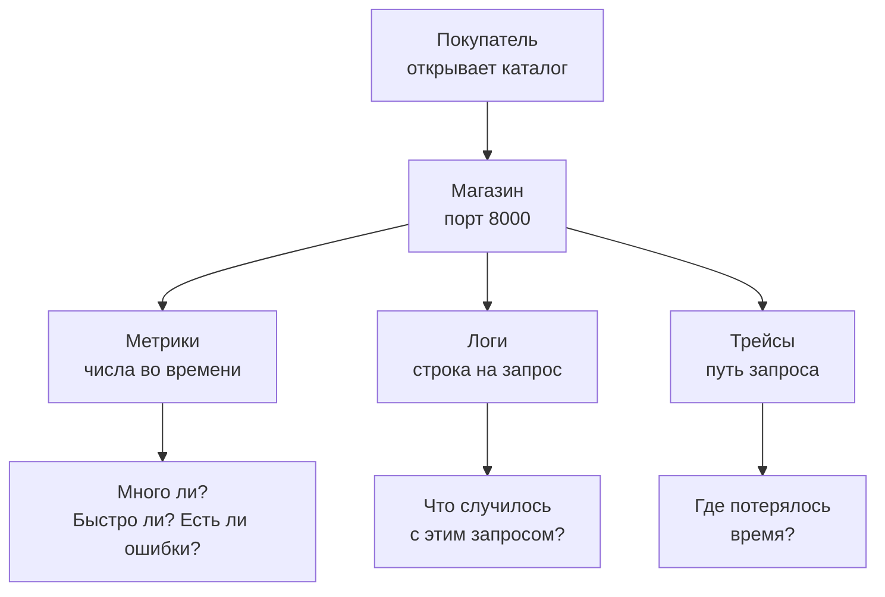
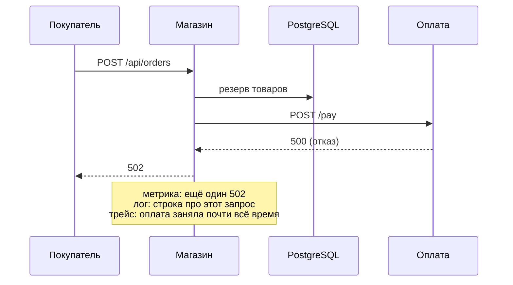
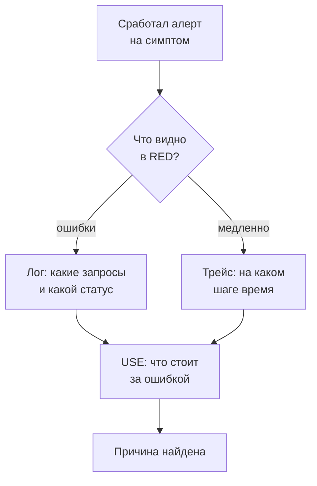
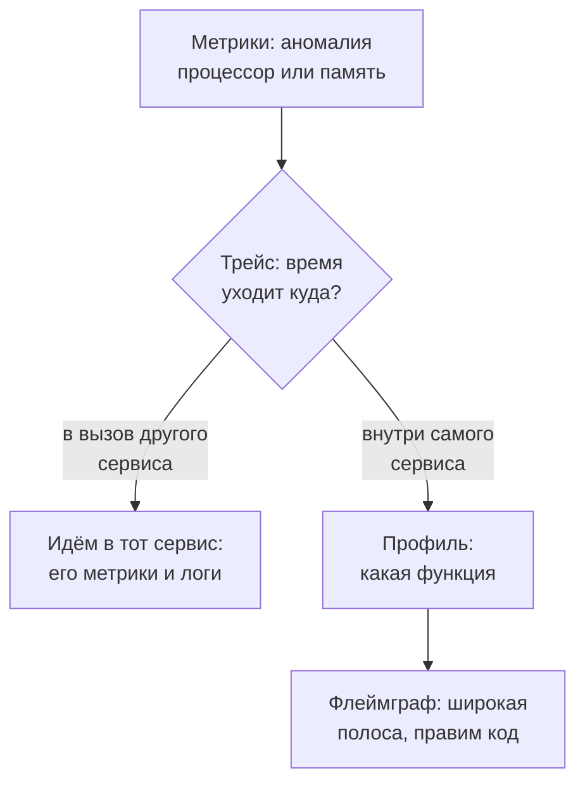

## Зачем это нужно

Ты вышел на первую неделю в команду интернет-магазина. В прошлом году на распродаже сайт упал, и на разборе честно сказали: «Мы не знали почему». Тебе поручили поставить приборы, чтобы в этом году знать. Я буду рядом как опытный коллега.

Начну с истории, которую знает каждый, кто дежурил. В понедельник приходит сообщение: «сайт тормозит». Я открыл график загрузки процессора (CPU: микросхема, которая выполняет все вычисления машины, как мозг компьютера). Там спокойные 40%. Я развёл руками и ответил: «У нас всё нормально». Через час выяснилось, что у покупателей зависает оплата: сервис оплаты отвечал по десять секунд, а процессор при этом скучал. Мы оба были правы и оба не понимали друг друга: я смотрел на машину, а покупатель смотрел на свой заказ. С тех пор я начинаю не с прибора, а с вопроса: что в этот момент чувствует человек на той стороне?

Весь курс про то, как ответить на этот вопрос цифрами. Сегодня ты поднимешь стенд (учебную копию магазина, на которой можно ломать без последствий) и посмотришь на один запрос тремя способами.

Шаг проекта: ты заводишь репозиторий `~/monitoring-lab` (репозиторий это папка, за которой git хранит историю изменений) и кладёшь туда `signals.md`: заметку о том, как один запрос выглядит в логе, в метриках и в трейсе.

## Что нужно знать

- Терминал, `curl` и `grep`: [load-tester, урок 1.4](../../load-tester/01-linux/04-network-cli.md) или [DevOps, урок 1.2](../../devops/01-linux/02-text-pipes.md). `jq`: [load-tester, урок 1.1](../../load-tester/01-linux/01-workstation-terminal.md).
- Запуск проекта командами `docker compose up -d` и `down`: [load-tester, урок 5.3](../../load-tester/05-docker/03-compose-shop.md) или [DevOps, тема 4](../../devops/04-docker/index.md).
- HTTP: у каждого ответа сервера есть трёхзначный код. `2xx` значит «успех», `4xx` «ошибка в запросе клиента», `5xx` «сломался сервер».
- Git в объёме трёх команд (`init`, `add`, `commit`): [load-tester, урок 3.1](../../load-tester/03-git/01-git-basics.md).

## Картина целиком

Представь автомобиль. На приборной панели горят лампочки: «двигатель», «масло», «аккумулятор». Каждая отвечает на вопрос, который кто-то придумал заранее. Но однажды машина начинает странно дёргаться, а лампочки зелёные. Тогда механик подключает диагностику, читает журнал ошибок и смотрит, что творилось с каждым узлом. Лампочки это мониторинг, диагностика это наблюдаемость (умение разобраться в неожиданном по подробным данным).



На схеме сервис один, а данных о нём три вида, и каждый отвечает на свой вопрос. В теории ниже пройдём по схеме сверху вниз, а потом выберем из тысяч чисел те немногие, с которых стоит начинать.

## Теория

### Мониторинг и наблюдаемость

Сервис ломается ночью, и о поломке ты узнаёшь от покупателя на следующий день. Хуже того, когда ты уже знаешь, что сломалось, но не можешь понять почему. Это две разные беды, и лечатся они двумя разными вещами.

Вернёмся к автомобилю. **Мониторинг** (monitoring) это приборная панель: заранее придуманные вопросы и лампочки на них. «Жив ли процесс?», «Сколько свободно места на диске?», «Доля ошибок выше пяти процентов?». Ты заранее знаешь, что может сломаться, и заранее рисуешь для этого индикатор. **Наблюдаемость** (observability) это диагностика: способность ответить на вопрос, которого ты не предусмотрел. «Почему у покупателей из одного города заказы тормозят только по вечерам?». Для такого вопроса нет лампочки, зато есть подробные данные, по которым можно копать вглубь. Аналогия ломается в одном месте: механик приезжает после поломки, а система наблюдения работает постоянно и хранит историю, чтобы можно было вернуться на день назад.

Вот как это выглядит на нашем магазине. Алерт (автоматическое сообщение «что-то не так») «доля ошибок выше 5%» это мониторинг: он сказал, что плохо. Дальше ты открываешь данные и видишь, что все ошибки на одном маршруте `/api/orders`, а запрос ждёт оплату десять секунд. Это уже наблюдаемость: ты нашёл причину, хотя никто заранее не рисовал лампочку «оплата тормозит».

Осторожно: наблюдаемость не «новое слово для мониторинга» и не набор программ. Можно поставить Prometheus и Grafana (об их работе позже, в теме 2) и всё равно ничего не увидеть, если сервис отдаёт мало данных и без деталей. Наблюдаемость это свойство сервиса, а программы лишь помогают её использовать.

> **Главное:** мониторинг отвечает на заранее заданные вопросы, наблюдаемость позволяет задать новый вопрос и получить ответ по данным, которые сервис уже отдаёт.
{: .key}

Откуда берутся эти данные? Их три вида, и у каждого своя сила.

### Три сигнала: метрики, логи, трейсы

Алерт сказал: «5% ошибок». Но какой именно запрос ломается, число не скажет. А строка о сломанном запросе не скажет, много ли таких. Одного вида данных мало, поэтому их три, и вместе их называют **сигналами** (telemetry, телеметрия: данные, которые сервис отправляет о самом себе).

Лучше всего это видно на примере больницы. Приборы у кровати показывают пульс и температуру: одно число каждого вида раз в минуту, легко сравнить с нормой. Это **метрики** (metrics). Медсестра ведёт записи: «14:05, дали лекарство, жалуется на головокружение». Это **логи** (logs): каждое событие отдельной строкой, с подробностями. Маршрутный лист «приёмная, рентген, палата» с временем на каждом этапе это **трейс** (trace, трассировка): путь одного пациента через все кабинеты. Аналогия ломается в одном месте. В больнице записи ведёт человек, а в сервисе программы сами пишут тысячи записей в секунду, и хранить всё подробно очень дорого.

Теперь то же самое в «Магазине». Метрика это число, меняющееся со временем: например, `http_requests_total`, сколько запросов обработано с запуска. Мало места, легко складывать, удобно рисовать и строить алерты, но про конкретный запрос она ничего не знает. Лог это строка о событии. «Магазин» пишет её на каждый запрос, и в ней есть метод, путь, код ответа, время и номер запроса. Лог хорошо отвечает «что случилось с этим запросом», но по миллиону строк общую картину глазами не увидеть. Трейс это путь запроса по частям системы: сам запрос, SQL-запрос к базе данных, вызов сервиса оплаты, и у каждого шага своё время. Он отвечает «где ушло время».



На схеме один заказ, который не прошёл. Метрика просто выросла на единицу, лог оставил подробную строку, а трейс покажет, что основное время ушло на вызов оплаты. Одно и то же событие, три взгляда.

Теперь тот же сбой по-настоящему. Оплата отказывает в семи случаях из десяти (`fail_rate` 0.7, задержка 300 мс), с 14:06 по 14:15 по часам стенда. Начнём с метрики.

<div class="viz" data-viz="mon-panel" data-title='Запросы магазина по кодам ответа' data-query='sum by (status) (rate(http_requests_total[1m]))' data-x='["14:00","14:01","14:02","14:03","14:04","14:05","14:06","14:07","14:08","14:09","14:10","14:11","14:12","14:13","14:14","14:15","14:16","14:17","14:18","14:19","14:20"]' data-series='[{"name":"200","values":[14.1,14.0,13.9,13.6,14.2,13.8,13.5,13.9,14.5,14.0,14.4,14.1,13.5,14.4,14.3,13.4,13.6,14.5,13.7,14.2,13.8],"color":"green"},{"name":"201","values":[4.48,4.65,4.55,4.28,4.51,4.6,3.31,3.33,3.26,3.55,3.71,3.59,3.57,3.26,3.38,3.47,4.4,4.39,4.27,4.74,4.49],"color":"blue"},{"name":"404","values":[0.37,0.32,0.29,0.26,0.3,0.26,0.22,0.31,0.24,0.38,0.38,0.23,0.25,0.24,0.37,0.37,0.34,0.25,0.3,0.33,0.27],"color":"yellow"},{"name":"502","values":[0.0,0.0,0.0,0.0,0.0,0.0,0.99,1.11,1.0,1.04,1.04,1.16,1.1,1.05,0.99,0.99,0.0,0.0,0.0,0.0,0.0],"color":"red"}]' data-unit='req/s' data-stack='true' data-annotations='[{"at":"14:06","text":"оплата: delay 300 мс, fail_rate 0.7"},{"at":"14:16","text":"оплата возвращена в норму"}]' data-explain='Каждая полоса это один код ответа, высота всего графика это все запросы в секунду. С 14:06 к синим «заказ создан» добавляется красная полоса 502: оплата отказывает.' data-try='Наведи на любую минуту после 14:06: в подсказке видно, сколько запросов в секунду получили 201 и сколько 502.'></div>

Смотри на красную полосу `502`: до 14:06 её нет, потом она появляется и держится десять минут, а после возвращения оплаты в норму исчезает. Метрика отвечает «что и сколько», но не говорит, какие это были заказы.

Теперь лог: строки заказов за эту же минуту сбоя.

<div class="viz" data-viz="mon-logs" data-title='Лог магазина: заказы во время сбоя' data-query='{service="shop"} | json | route="/api/orders"' data-lines='[{"ts":"2026-10-04 14:12:09.874","level":"error","labels":{"service":"shop","container":"shop-shop-1","level":"ERROR"},"line":"{\"ts\": \"2026-10-04T14:12:09.874123+00:00\", \"level\": \"ERROR\", \"msg\": \"Запрос завершён\", \"method\": \"POST\", \"route\": \"/api/orders\", \"path\": \"/api/orders\", \"status\": 502, \"duration_ms\": 1262.37, \"request_id\": \"4ef27e9589c6948f6d30c01c3f252edc\", \"trace_id\": \"7c1e5a9b3d4f4e2a8b6c0d1f9e8a7b65\", \"user_id\": 17, \"error\": \"payment failed\"}"},{"ts":"2026-10-04 14:12:08.903","level":"info","labels":{"service":"shop","container":"shop-shop-1","level":"INFO"},"line":"{\"ts\": \"2026-10-04T14:12:08.903123+00:00\", \"level\": \"INFO\", \"msg\": \"Запрос завершён\", \"method\": \"POST\", \"route\": \"/api/orders\", \"path\": \"/api/orders\", \"status\": 201, \"duration_ms\": 337.82, \"request_id\": \"87ff4adfa36d0840164709ab7f3f386d\", \"trace_id\": \"9a422eb14ab2f2d0f0cc022238daceee\", \"user_id\": 402}"},{"ts":"2026-10-04 14:12:07.655","level":"warn","labels":{"service":"shop","container":"shop-shop-1","level":"WARNING"},"line":"{\"ts\": \"2026-10-04T14:12:07.655123+00:00\", \"level\": \"WARNING\", \"msg\": \"Запрос завершён\", \"method\": \"POST\", \"route\": \"/api/orders\", \"path\": \"/api/orders\", \"status\": 201, \"duration_ms\": 1214.09, \"request_id\": \"0cd566647b5aa666347428c3dd46c036\", \"trace_id\": \"2092f073ff80b9465aef7ac86d66c7a6\", \"user_id\": 88}"},{"ts":"2026-10-04 14:12:06.130","level":"info","labels":{"service":"shop","container":"shop-shop-1","level":"INFO"},"line":"{\"ts\": \"2026-10-04T14:12:06.130123+00:00\", \"level\": \"INFO\", \"msg\": \"Запрос завершён\", \"method\": \"POST\", \"route\": \"/api/orders\", \"path\": \"/api/orders\", \"status\": 201, \"duration_ms\": 641.55, \"request_id\": \"bb3a62f301f46536559314e23acedbd6\", \"trace_id\": \"44fb12853ef86dcfaea21818b904ce60\", \"user_id\": 951}"},{"ts":"2026-10-04 14:12:04.201","level":"error","labels":{"service":"shop","container":"shop-shop-1","level":"ERROR"},"line":"{\"ts\": \"2026-10-04T14:12:04.201123+00:00\", \"level\": \"ERROR\", \"msg\": \"Запрос завершён\", \"method\": \"POST\", \"route\": \"/api/orders\", \"path\": \"/api/orders\", \"status\": 502, \"duration_ms\": 1191.64, \"request_id\": \"b0165debbc6530a2c6a8835c4abd5c65\", \"trace_id\": \"87413e3b266f850f1578b5c72dc4ee60\", \"user_id\": 233, \"error\": \"payment failed\"}"},{"ts":"2026-10-04 14:12:02.774","level":"info","labels":{"service":"shop","container":"shop-shop-1","level":"INFO"},"line":"{\"ts\": \"2026-10-04T14:12:02.774123+00:00\", \"level\": \"INFO\", \"msg\": \"Запрос завершён\", \"method\": \"POST\", \"route\": \"/api/orders\", \"path\": \"/api/orders\", \"status\": 201, \"duration_ms\": 347.1, \"request_id\": \"2a9f30b1789a6c52cf63c03378ec16c0\", \"trace_id\": \"caea63367c29a80b21ead8f062d15a4f\", \"user_id\": 12}"}]' data-highlight='"status": 502' data-explain='Те же заказы, но по одному: у каждого своя строка со статусом и временем. Красные строки это 502, жёлтая это заказ, который прошёл, но шёл дольше секунды.' data-try='Раскрой строку с ошибкой: в полях видны trace_id, user_id и error, по ним потом находят трейс и покупателя.'></div>

Первым делом смотри на красные строки и на колонку `duration_ms` внутри них: 502 приходит не быстро, а через 1,2 секунды, значит магазин что-то ждал. Поле `trace_id` красной строки ведёт в трейс.

И наконец трейс, один из этих заказов с `trace_id`, начинающимся на `7c1e5a9b`.

<div class="viz" data-viz="mon-trace" data-title='Трейс заказа, который закончился 502' data-trace-id='7c1e5a9b3d4f4e2a8b6c0d1f9e8a7b65' data-spans='[{"id":"a1","parent":null,"service":"shop","name":"POST /api/orders","start":0,"dur":1262,"status":"error","attrs":{"http.method":"POST","http.route":"/api/orders","http.status_code":502}},{"id":"a2","parent":"a1","service":"shop","name":"GET","start":1,"dur":1.5,"status":"ok","attrs":{"db.system":"redis"}},{"id":"a3","parent":"a1","service":"shop","name":"HGETALL","start":3,"dur":1.2,"status":"ok","attrs":{"db.system":"redis"}},{"id":"a4","parent":"a1","service":"shop","name":"DEL","start":4.5,"dur":0.9,"status":"ok","attrs":{"db.system":"redis"}},{"id":"a5","parent":"a1","service":"shop","name":"db.pool.getconn","start":6,"dur":0.4,"status":"ok","attrs":{}},{"id":"a6","parent":"a1","service":"shop","name":"SELECT","start":6.8,"dur":4.1,"status":"ok","attrs":{"db.system":"postgresql"}},{"id":"a7","parent":"a1","service":"shop","name":"INSERT","start":11,"dur":2.2,"status":"ok","attrs":{"db.system":"postgresql"}},{"id":"a8","parent":"a1","service":"shop","name":"INSERT","start":13.4,"dur":1.0,"status":"ok","attrs":{"db.system":"postgresql"}},{"id":"a9","parent":"a1","service":"shop","name":"UPDATE","start":14.6,"dur":1.4,"status":"ok","attrs":{"db.system":"postgresql"}},{"id":"c1","parent":"a1","service":"shop","name":"POST","start":16.5,"dur":311,"status":"error","attrs":{"http.url":"http://payment:8001/pay","http.status_code":500,"попытка":1}},{"id":"p1","parent":"c1","service":"payment","name":"POST /pay","start":18.0,"dur":306,"status":"error","attrs":{"http.status_code":500}},{"id":"c2","parent":"a1","service":"shop","name":"POST","start":328.0,"dur":276,"status":"error","attrs":{"http.url":"http://payment:8001/pay","http.status_code":500,"попытка":2}},{"id":"p2","parent":"c2","service":"payment","name":"POST /pay","start":329.5,"dur":271,"status":"error","attrs":{"http.status_code":500}},{"id":"c3","parent":"a1","service":"shop","name":"POST","start":604.5,"dur":342,"status":"error","attrs":{"http.url":"http://payment:8001/pay","http.status_code":500,"попытка":3}},{"id":"p3","parent":"c3","service":"payment","name":"POST /pay","start":606.0,"dur":337,"status":"error","attrs":{"http.status_code":500}},{"id":"c4","parent":"a1","service":"shop","name":"POST","start":947.0,"dur":295,"status":"error","attrs":{"http.url":"http://payment:8001/pay","http.status_code":500,"попытка":4}},{"id":"p4","parent":"c4","service":"payment","name":"POST /pay","start":948.5,"dur":290,"status":"error","attrs":{"http.status_code":500}},{"id":"a10","parent":"a1","service":"shop","name":"HINCRBY","start":1246.5,"dur":1.5,"status":"ok","attrs":{"db.system":"redis"}}]' data-focus='c3' data-explain='Корневая полоса это весь заказ, под ней по очереди четыре красных вызова оплаты: магазин пробует снова и снова без пауз. Всё остальное (Redis, SQL) занимает несколько миллисекунд.' data-try='Наведи на самую длинную красную полосу и сравни её время с остальными: вся беда в оплате, а не в базе.'></div>

Здесь видно то, чего не было ни в метрике, ни в логе: время уходит не в базу и не в Redis, а в четыре подряд вызова оплаты по 300 миллисекунд. Метрика сказала «когда», лог «какие запросы», трейс «где».

> **Прикинь сам:** ты хочешь узнать, почему именно заказ покупателя номер 17 в пятницу вечером ждал оплату восемь секунд. С какого сигнала начнёшь?
{: .predict}

С лога и трейса. Метрика покажет только общую картину («оплата стала медленнее у всех»), а конкретный запрос в ней растворился в сумме. Лог подскажет, что в нём было, а трейс покажет, на каком шаге пропало время.

Осторожно: «логи и есть мониторинг» (так часто говорят). Логи нужны для деталей, но по ним неудобно смотреть общую картину и строить алерты. Метрики для этого подходят гораздо лучше. А ещё метрики дёшевы: ста тысячам запросов соответствует сто тысяч строк лога, а метрика остаётся одним числом. Обратная сторона дешевизны: детали в числе теряются.

> **Главное:** метрики показывают, что и сколько (общая картина), логи объясняют конкретное событие, трейсы показывают, где потерялось время.
{: .key}

Тип данных выбрали. Но чисел, которые можно мерить, тысячи. Какие брать первыми?

### Четыре золотых сигнала

На странице метрик «Магазина» десятки чисел, а в реальной системе их тысячи. Если наблюдать за всеми сразу, не увидишь ничего. Нужен короткий список того, что действительно говорит о здоровье сервиса. Такой список описали инженеры Google в книге «Site Reliability Engineering» (2016), и его называют **четырьмя золотыми сигналами** (golden signals). Почему именно эти четыре? Каждый отвечает на отдельный вопрос, а вместе они покрывают все способы, которыми сервис плох: медленно, много, сломано, на пределе.

Представь кафе. Гость спрашивает, как быстро принесли заказ (это **задержка**). Владелец считает, сколько гостей обслужили за вечер (**трафик**), сколько блюд вернули на кухню (**ошибки**) и не переполнен ли зал, из-за чего гости стоят в очереди (**насыщение**). Температура холодильника никого не волнует, пока еда свежая. Теперь то же по порядку для сервиса.

1. **Задержка** (latency): сколько занимает запрос, как «быстро принесли заказ». Считают отдельно для успешных и ошибочных запросов, потому что быстрая ошибка не должна «улучшать» картину.
2. **Трафик** (traffic): сколько запросов приходит, обычно «в секунду», как гости за вечер.
3. **Ошибки** (errors): какая доля запросов закончилась неудачно, как блюда, вернувшиеся на кухню.
4. **Насыщение** (saturation): насколько заполнен самый дефицитный ресурс, как переполненный зал. Это очередь, пул соединений с базой, диск. Насыщение предупреждает заранее: очередь растёт, а пользователи ещё ничего не заметили.

Для «Магазина» это выглядит так: задержка это сколько миллисекунд отвечает `GET /api/products`, трафик это сколько таких запросов в секунду, ошибки это доля ответов `5xx`, а насыщение это число запросов, которые ждут свободное соединение с базой. Пул соединений (набор заранее открытых соединений с базой, которые выдают запросам по очереди) у «Магазина» маленький, и когда он кончается, запросы встают в очередь.

Вот как выглядят эти четыре сигнала на дашборде, сначала в норме, потом во время сбоя.

<div class="viz" data-viz="mon-stat" data-title='Магазин: оплата в норме (14:04)' data-stats='[{"title":"Запросы","value":19.0,"unit":"req/s","color":"green","spark":[18.9,19.0,18.7,18.1,19.0],"sub":"трафик"},{"title":"Ошибки 5xx","value":0.0,"unit":"%","color":"green","spark":[0.0,0.0,0.0,0.0,0.0],"sub":"доля ответов"},{"title":"Заказы p95","value":117,"unit":"ms","color":"green","spark":[118,117,120,117,117],"sub":"задержка"},{"title":"Ждут соединения","value":0,"color":"green","spark":[0,0,0,0,0],"sub":"насыщение пула"}]' data-explain='Четыре карточки верха дашборда: трафик, ошибки, задержка и насыщение. Зелёный цвет значит «в норме».'></div>

<div class="viz" data-viz="mon-stat" data-title='Магазин: оплата ломается (14:12)' data-stats='[{"title":"Запросы","value":18.4,"unit":"req/s","color":"green","spark":[18.1,19.0,18.7,18.0,18.6,19.0,19.0,19.5,19.1,18.4],"sub":"трафик"},{"title":"Ошибки 5xx","value":6.0,"unit":"%","color":"red","spark":[0.0,0.0,0.0,5.5,6.0,5.3,5.5,5.3,6.1,6.0],"sub":"доля ответов"},{"title":"Заказы p95","value":1206,"unit":"ms","color":"red","spark":[117,117,111,1224,1266,1206,1243,1295,1245,1206],"sub":"задержка"},{"title":"Ждут соединения","value":2,"color":"orange","spark":[0,0,0,2,2,1,2,2,2,2],"sub":"насыщение пула"}]' data-explain='Те же четыре карточки через восемь минут после начала сбоя. Трафик прежний, зато ошибки, задержка и очередь за соединением изменились.'></div>

Смотри на цвет карточек, а не на числа: зелёные «Запросы» говорят, что покупатели приходят как обычно, красные «Ошибки» и «Заказы p95» показывают, что им плохо. Это та же картина, что в истории про «сайт тормозит»: сервер здоров, страдает конкретный путь.

А вот задержка заказов по времени, с теми же отметками начала и конца сбоя.

<div class="viz" data-viz="mon-panel" data-title='Задержка заказов: p50, p95, p99' data-query='histogram_quantile(0.95, sum by (le) (rate(http_request_duration_seconds_bucket{route="/api/orders"}[1m])))' data-x='["14:00","14:01","14:02","14:03","14:04","14:05","14:06","14:07","14:08","14:09","14:10","14:11","14:12","14:13","14:14","14:15","14:16","14:17","14:18","14:19","14:20"]' data-series='[{"name":"p50","values":[92,89,94,87,94,90,645,606,647,652,637,602,641,621,606,609,88,87,97,93,87],"color":"green"},{"name":"p95","values":[118,117,120,117,117,111,1224,1266,1206,1243,1295,1245,1206,1261,1291,1268,114,114,111,112,120],"color":"orange"},{"name":"p99","values":[137,128,137,134,131,140,1401,1330,1346,1336,1292,1291,1334,1327,1396,1321,136,134,128,126,126],"color":"red"}]' data-unit='ms' data-annotations='[{"at":"14:06","text":"оплата: delay 300 мс, fail_rate 0.7"},{"at":"14:16","text":"оплата возвращена в норму"}]' data-explain='Три линии показывают, как быстро отвечают заказы: половина, девять из десяти и почти все. С 14:06 они уходят вверх в разы, а в 14:16 возвращаются.' data-try='Сравни p50 и p99 после 14:06: даже медианный заказ стал медленнее, а не только самые невезучие.'></div>

На графике сначала ровная линия около ста миллисекунд, потом ступенька вверх и обратно. Начинай с p95: он честнее среднего, потому что показывает, как отвечают заказы тем, кому повезло меньше всех.

> **Прикинь сам:** покупатели жалуются, что каталог открывается долго, а ошибок нет, и запросов приходит столько же, сколько вчера. Какой из четырёх сигналов изменился?
{: .predict}

Задержка. Трафик прежний, ошибок нет. Если копать дальше, причина, скорее всего, в насыщении: например, очередь за соединениями с базой. Так сигналы подсказывают, куда смотреть дальше.

Четыре сигнала это минимум, а не полный список. Если сервис хранит данные, к ним добавляют целостность (записанное потом читается и не потеряно), но с этого не начинают.

> **Главное:** задержка, трафик, ошибки и насыщение: с этих четырёх чисел начинай наблюдение за любым сервисом, который отвечает пользователям.
{: .key}

Из этого списка выросли две сокращённые схемы, которые на собеседованиях спрашивают на каждом шагу.

### RED и USE: два коротких списка

Четыре сигнала всё равно нужно разложить по полочкам: что считаем для сервиса, а что для железа. Для этого придумали две короткие схемы. Первая звучит как «красный» (**RED**): Rate, Errors, Duration («скорость запросов, ошибки, длительность»). Это для всего, что отвечает на запросы: Rate (сколько запросов в секунду), Errors (какая доля ответов с ошибкой), Duration (сколько времени занимает ответ). Вторая звучит как «используй» (**USE**): Utilization, Saturation, Errors («занятость, очередь, ошибки»). Это для ресурсов: процессор, память, диск, пул соединений. Utilization (занятость: какую долю времени ресурс занят), Saturation (очередь: сколько работы ждёт, пока ресурс освободится), Errors (ошибки самого ресурса, например сбой чтения диска).

Слово Errors стоит в обоих методах, но это разное: в RED это ответы сервиса с ошибкой, в USE ошибки самого устройства или ресурса (сбой чтения диска).

| Метод | Что мерим | Пример в «Магазине» |
|---|---|---|
| RED (сервисы) | Rate, Errors (ответы с ошибкой), Duration | запросов в секунду, доля `5xx`, время ответа |
| USE (ресурсы) | Utilization, Saturation, Errors (ошибки ресурса) | занятость пула, очередь за соединением, сбои диска |

Почему два метода, а не один? RED смотрит на сервис глазами покупателя: получил ли он ответ и как быстро. USE смотрит на железо глазами инженера: чем занят ресурс и не стоит ли перед ним очередь. Начинай всегда с RED. Если покупателю хорошо, то процессор на 90% не повод будить человека ночью. К USE переходят, когда RED показал проблему и нужно найти причину. В моей истории про «сайт тормозит» процессор в 40% ничего не значил: покупатель процессор не видит, а узкое место было во внешнем сервисе оплаты. Я начал с USE и пропустил RED.

Вот USE на нашем сбое. Пул это ресурс, и его занятость с очередью видны прямо на графике.

<div class="viz" data-viz="mon-panel" data-title='Пул соединений с базой' data-query='shop_db_pool_available и shop_db_pool_waiting' data-x='["14:00","14:01","14:02","14:03","14:04","14:05","14:06","14:07","14:08","14:09","14:10","14:11","14:12","14:13","14:14","14:15","14:16","14:17","14:18","14:19","14:20"]' data-series='[{"name":"shop_db_pool_available (свободно)","values":[5,4,4,5,4,5,0,1,1,1,0,2,2,0,2,2,4,4,5,4,4],"color":"green"},{"name":"shop_db_pool_waiting (ждут)","values":[0,0,0,0,0,0,2,2,1,2,2,2,2,3,0,2,0,0,0,0,0],"color":"red"}]' data-unit='' data-annotations='[{"at":"14:06","text":"оплата: delay 300 мс, fail_rate 0.7"},{"at":"14:16","text":"оплата возвращена в норму"}]' data-explain='Зелёная линия это свободные соединения из пяти, красная это запросы, которые стоят в очереди за соединением. Пока красная на нуле, пул справляется.' data-try='Найди минуты, где зелёная линия падает к нулю, а красная выше нуля: там заказы уже ждут очереди, не дойдя до базы.'></div>

Во время сбоя заказы держат соединения с базой, пока ждут оплату, и свободных остаётся мало, а в очереди появляются ожидающие. Это насыщение: оно выросло не из-за процессора, а потому что оплата тормозит и держит соединения. Чтобы дойти до него, нужно было сначала увидеть симптом в RED, а потом заглянуть в USE.

> **Проверь понимание:** к какому методу относятся «доля ответов 5xx» и «число запросов, ждущих соединение с базой»?

<details markdown="1">
<summary>Ответ</summary>

Доля `5xx` это Errors из RED (сервис глазами покупателя). Число запросов, ждущих соединение, это Saturation из USE: пул соединений здесь ресурс, перед которым выстроилась очередь.

</details>

> **Главное:** RED мерит сервис (запросы, ошибки, время), USE мерит ресурс (занятость, очередь, ошибки), а начинать нужно с RED.
{: .key}

Осталось понять, на какие числа вешать тревогу, а какие оставить для расследования.

### Симптом и причина

Среди чисел на панели одни говорят «покупателям плохо», а другие «машине тяжело». Проблемы начинаются, когда мы будим человека ночью из-за второго.

Автомобильная сигнализация, которая срабатывает от каждого проезжающего грузовика, через неделю перестаёт кого-либо будить: все привыкли и не слышат. Угон пропустят. С мониторингом то же самое. **Симптом** (symptom) это то, что чувствует покупатель: ошибки, медленные ответы, недоступность. **Причина** (cause) это то, из-за чего это случилось: процессор, диск, очередь к базе, упавший сервис оплаты. Правило простое: тревогу (алерт) настраивай на симптом, а причину показывай на дашборде (экране с графиками) и ищи, когда уже проснулся.

Пример на «Магазине». Алерт «процессор выше 80% одну минуту» сработал ночью: пачка запросов быстро отработалась, покупатели ничего не заметили, а тебя разбудили зря. Алерт «доля `5xx` выше 5% пять минут»: покупатели получают ошибки прямо сейчас, и действие нужно. Первое число это причина (возможная), второе симптом.

Как алерт на симптом живёт во времени, видно на нашем сбое. Условие «доля `5xx` выше 5%» держится две минуты, прежде чем сработать (`for: 2m` в правиле стенда).

<div class="viz" data-viz="mon-alert" data-title='Алерт на симптом: доля 5xx' data-x='["14:00","14:01","14:02","14:03","14:04","14:05","14:06","14:07","14:08","14:09","14:10","14:11","14:12","14:13","14:14","14:15","14:16","14:17","14:18","14:19","14:20"]' data-values='[0.0,0.0,0.0,0.0,0.0,0.0,5.5,6.0,5.3,5.5,5.3,6.1,6.0,5.5,5.2,5.4,0.0,0.0,0.0,0.0,0.0]' data-unit='%' data-threshold='5' data-for='2' data-name='ShopHighErrorRate' data-group-wait='1' data-explain='Серая полоса значит «всё хорошо», жёлтая «условие уже выполняется, но ждём два интервала», красная «алерт сработал». Состояния считаются из данных графика, а не нарисованы руками.'></div>

Смотри на жёлтый кусок: условие уже выполнено, но алерт ещё не сработал, чтобы одна случайная минута не разбудила дежурного. Красный участок начинается только когда симптом удержался, и заканчивается, когда оплату вернули в норму.



Схема показывает порядок расследования. Начинаем с симптома, уточняем его логом или трейсом и только потом смотрим на ресурсы. У исключения есть своё имя: причина, у которой есть прогноз до симптома, тоже достойна алерта (например, «диск заполнится через 4 часа»). Но «диск занят на 70%» ночью будить не должно: такое значение может держаться месяцами.

> **Прикинь сам:** алерт «диск занят на 70%» сработал в 3 часа ночи. Что человек сделает, когда проснётся?
{: .predict}

Скорее всего, ничего: смысла будить не было. Хороший вопрос перед созданием любого алерта: «что человек сделает, когда он придёт?». Если ничего, это не алерт, а строка на дашборде или задача на утро.

> **Проверь понимание:** какой из двух алертов лучше для ночного дежурства: «CPU выше 80% в течение минуты» или «доля `5xx` выше 5% в течение 5 минут»? Почему?

<details markdown="1">
<summary>Ответ</summary>

Второй. Он описывает симптом: покупатели прямо сейчас получают ошибки. Первый может сработать от обычной пачки запросов, не причинив пользователям никакого вреда, и приучить дежурного не доверять тревогам.

</details>

> **Главное:** будить человека должен симптом, который чувствует покупатель, а причины ищут уже по дашбордам, логам и трейсам.
{: .key}

Алерт сработал и ты проснулся. Дальше стоит решить, как быстро действовать, а для этого нужно понять, насколько всё плохо.

### Серьёзность: стабильно или ухудшается

Врач скорой, приехав на вызов, первым делом не ищет диагноз. Он смотрит, сколько пострадавших, насколько тяжело и держится ли состояние ровным или быстро падает. От ответа зависит, торопиться ли и рисковать ли сложным вмешательством. С сервисом то же: «что сломалось» можно выяснять потом, а «насколько это плохо» нужно знать сразу.

Для этого берут те же четыре сигнала и смотрят на них с тремя вопросами. **Сколько пользователей затронуто**: доля ошибок и доля медленных запросов, а не число строк в логе. **Что именно не работает**: сломанный каталог неприятен, сломанный заказ стоит денег. **Стабильно или ухудшается**: ситуацию называют стабильной, если плохое число держится на одном уровне (например, 5% ошибок уже десять минут), и ухудшающейся, если оно растёт от замера к замеру. Другой пример стабильности: p99 (время, дольше которого отвечает один запрос из ста) выше цели, но p95 (дольше которого отвечает один из двадцати) ровный: страдают единицы.

Разница меняет действия. Стабильная проблема даёт время: можно прочитать лог, открыть трейс, спокойно найти причину. Растущая времени не даёт: сначала нужно остановить рост, например откатить последнюю выкатку, а причину искать потом. И чем рискованнее действие, тем серьёзнее должна быть проблема, чтобы на него идти: порядок действий разберём в [уроке 5.1](../05-reliability/01-incidents.md).

Вот два сбоя оплаты на одной панели. В обоих с 14:06 оплата отказывает в семи случаях из десяти. Во втором в 14:10 её отказ становится полным (`fail_rate` 1.0).

<div class="viz" data-viz="mon-panel" data-title='Доля ответов 5xx: два сбоя оплаты' data-query='100 * sum(rate(http_requests_total{status=~"5.."}[1m])) / sum(rate(http_requests_total[1m]))' data-x='["14:00","14:01","14:02","14:03","14:04","14:05","14:06","14:07","14:08","14:09","14:10","14:11","14:12","14:13","14:14","14:15","14:16","14:17","14:18","14:19","14:20"]' data-series='[{"name":"сбой А: стабильно","values":[0.0,0.0,0.0,0.0,0.0,0.0,5.5,6.0,5.3,5.5,5.3,6.1,6.0,5.5,5.2,5.4,0.0,0.0,0.0,0.0,0.0],"color":"orange"},{"name":"сбой Б: ухудшается","values":[0.0,0.0,0.0,0.0,0.0,0.0,5.5,6.0,5.3,5.5,15.3,15.8,15.8,15.0,15.6,15.9,0.0,0.0,0.0,0.0,0.0],"color":"red"}]' data-unit='%' data-thresholds='[{"value":5,"color":"red","label":"порог алерта 5%"}]' data-annotations='[{"at":"14:06","text":"оплата: fail_rate 0.7"},{"at":"14:10","text":"сбой Б: fail_rate 1.0"},{"at":"14:16","text":"оплата в норме"}]' data-explain='Две линии это два разных сбоя. Оранжевая держится на одном уровне около 5-6%, красная после 14:10 вырастает втрое. Первый можно изучать спокойно, второй нужно останавливать.' data-try='Наведи на 14:09 и 14:11: до 14:10 обе линии неразличимы, и только динамика показывает, какой сбой хуже.'></div>

Смотри на 14:09: обе линии лежат рядом, и по одному числу сбои не отличить. Разошлись они только во времени, поэтому для оценки серьёзности на дашборде нужен график, а не одно большое число.

> **Прикинь сам:** алерт сработал, ошибок 8%. Пять минут назад было 8%, десять минут назад тоже 8%. Стоит ли немедленно откатывать выкатку?
{: .predict}

Не обязательно. Ситуация стабильная: затронут примерно один запрос из двенадцати, число не растёт. Есть время открыть лог и трейс и найти причину, а откат (рискованное действие) оставить на случай, если станет хуже или причина окажется в выкатке.

Осторожно: «стабильно» не значит «безвредно». Пять процентов ошибок на заказах, держащиеся час, это сотни потерянных покупок. Стабильность говорит о том, сколько у тебя времени на разбор, а не о том, нужно ли чинить.

> **Главное:** оценить серьёзность значит посмотреть, сколько пользователей и какая функция затронуты и растёт ли плохое число: стабильную проблему изучают, растущую сначала останавливают.
{: .key}

Сигналы и график показывают, что именно плохо. Иногда они же показывают, что дальше без нового инструмента не пройти.

### Профилирование: четвёртый столп

Бывает так. Метрики говорят, что процессор сервиса вырос с 40% до 70%, хотя запросов столько же. Трейс показывает, что почти всё время запрос проводит внутри самого магазина, а не в ожидании базы или оплаты. В логе тишина. Три сигнала дошли до границы: они говорят «виноват этот сервис», но не говорят, какая его часть.

Тут помогает **профилирование** (profiling), четвёртый столп наблюдаемости рядом с метриками, логами и трейсами. Представь, что за поваром на кухне весь вечер ходит человек с секундомером и записывает, на какую операцию сколько минут ушло. Профиль делает то же с программой: через равные промежутки смотрит, какую функцию она сейчас выполняет, и по тысячам таких снимков считает, куда уходит процессорное время и память. Результат рисуют как **флеймграф** (flame graph, «график-пламя»): каждая функция это полоска, чем она шире, тем больше времени в ней проведено, а вложенные вызовы стоят над ней. Широкая полоса сразу показывает, что оптимизировать.

Способов снять профиль несколько. У языков есть свои встроенные инструменты, например `pprof` у Go: сервис сам отдаёт профиль по запросу. **eBPF** (механизм ядра Linux, который позволяет подключиться к работающей программе и посмотреть, что она делает, без правки её кода и перезапуска) снимает профили со всей машины сразу. **Непрерывное профилирование** (continuous profiling, например Pyroscope) снимает их постоянно с малой частотой и хранит, как метрики: когда аномалия уже прошла, можно открыть профиль того самого получаса.

Когда его включать? Не первым. Профиль отвечает на вопрос «где в коде», и задавать его имеет смысл, когда сигналы уже привели в один сервис: рост процессора или памяти без роста трафика, подозрение на утечку памяти, медленный ответ, который трейс не объясняет вызовами других сервисов. Профилирование добавляет небольшую, но ненулевую нагрузку, поэтому его включают по поводу, а не «на всякий случай» везде и навсегда. На нашем стенде профайлера нет, поэтому здесь только идея, практики не будет.



Схема показывает место профилирования в расследовании: оно идёт после метрик и трейса, когда стало ясно, что причина внутри сервиса.

> **Прикинь сам:** после выкатки заказы стали медленнее. Трейс показывает, что на вызов оплаты уходит 90% времени. Нужно ли включать профилирование магазина?
{: .predict}

Нет. Время уходит в ожидание другого сервиса, а не в код магазина: профиль покажет в нём лишь «ждём ответа». Идти нужно в оплату: смотреть её метрики, логи и трейсы.

> **Главное:** профилирование отвечает «какая функция в коде тратит время и память» и включается, когда метрики и трейс уже привели в один сервис, а не вместо них.
{: .key}

Остался один термин, который встретится в первой же практике: метки.

### Метки и кардинальность: слово на будущее

Через урок, в 2.1, ты будешь читать метрики «Магазина», и почти в каждой есть метки, поэтому слово пригодится сразу. Метрика «ошибок 17» мало что говорит: каких, где, на каком маршруте? Чтобы число можно было разрезать на группы, к нему добавляют **метки** (labels): пары «имя=значение» в фигурных скобках. Например, `http_requests_total{method="GET",route="/api/products",status="200"}` это счётчик запросов именно для чтения каталога с ответом 200, а у заказов с ответом 502 будет свой счётчик.

Цена за удобство такая. Каждая уникальная комбинация значений меток это отдельный ряд чисел, который хранилище ведёт отдельно. Число таких комбинаций называют **кардинальностью** (cardinality). Метка `route` с десятком маршрутов безопасна. Метка `user_id` при тысяче покупателей даст тысячу рядов вместо одного, а при миллионе мониторинг упадёт от нехватки памяти. Поэтому в метки кладут только значения с небольшим конечным набором (метод, шаблон маршрута, код ответа), а подробности вроде номера пользователя оставляют логам. Подробно это будет в теме 2, в уроке про Prometheus.

> **Главное:** у метки должно быть небольшое число значений: метод и маршрут да, номер пользователя нет.
{: .key}

Теория закончилась. Теперь посмотрим на всё это на живом стенде.

## Практика

Все файлы урока складывай в `~/monitoring-lab`. Нагрузку и любые поломки делай только на своём локальном стенде.

### 1. Подними стенд «Магазин»

Стенд это учебный интернет-магазин из нескольких контейнеров: сам магазин (сервис `shop`, порт 8000), оплата, база данных PostgreSQL, Redis (быстрое хранилище для корзин и сессий) и набор приборов наблюдения. Приборы оформлены как **профиль** (profile) Docker Compose: дополнительные сервисы, которые не стартуют, пока их явно не попросишь флагом `--profile monitoring`.

```bash
git clone https://github.com/distinguished-sre/learning.git ~/learning
cd ~/learning/load-tester/project/shop
cp .env.example .env
docker compose --profile monitoring up -d --build --wait --wait-timeout 300
curl -s localhost:8000/readyz
```

`git clone` скачивает репозиторий со стендом в `~/learning`. `cp .env.example .env` создаёт файл настроек из образца. `docker compose ... up -d --build --wait` собирает образ магазина (`--build`), запускает всё в фоне (`-d`) и ждёт, пока у каждого контейнера пройдёт проверка здоровья (`--wait`, не дольше `--wait-timeout 300` секунд). `/readyz` проверяет связь с PostgreSQL и Redis.

Первый запуск займёт несколько минут: скачиваются образы и создаётся база.

Ответ `{"status":"ready"}` значит, что магазин видит базу и Redis. Если пришло `{"detail":{"unavailable":["postgres"]}}`, база ещё не поднялась: подожди.

**Типичные ошибки:**

- `curl: (7) Failed to connect to localhost port 8000`: стенд ещё не поднялся. Посмотри `docker compose --profile monitoring ps`.

### 2. Заведи репозиторий monitoring-lab

В этой папке будет жить всё, что ты сделаешь в курсе: заметки, запросы, дашборды, правила.

```bash
mkdir -p ~/monitoring-lab/01-basics
cd ~/monitoring-lab
git init
printf '# monitoring-lab\n\nМои заметки и файлы курса «Мониторинг и SRE».\n' > README.md
git add README.md
git commit -m "init: репозиторий курса"
```

`git init` превращает папку в репозиторий, `git add` готовит файл к сохранению, `git commit -m` сохраняет первый снимок с пояснением.

**Что должно получиться:**

```text
[main (root-commit) 3f2a1c9] init: репозиторий курса
 1 file changed, 3 insertions(+)
 create mode 100644 README.md
```

**Типичные ошибки:**

- `Author identity unknown`: git не знает, кто ты. Задай `git config --global user.name` и `user.email`, повтори коммит.

### 3. Один запрос тремя глазами

Отправим магазину один запрос с номером в заголовке `X-Request-ID` (магазин пишет его в лог) и найдём след в трёх местах.

```bash
curl -si -H 'X-Request-ID: lab-0001' localhost:8000/api/products/42
```

`-i` добавляет в вывод заголовки ответа, `-H` добавляет заголовок к запросу.

**Что должно получиться** (содержимое карточки у тебя другое, часть заголовков опущена):

```text
HTTP/1.1 200 OK
x-request-id: lab-0001

{"id":42,"name":"...","price":...,"category_id":...,"stock":...}
```

**Как читать вывод:** `200` это ответ покупателю, в `x-request-id` магазин вернул наш номер, тело это JSON с карточкой товара.

**Глаз первый: лог.** Каждый запрос магазин записывает одной JSON-строкой в стандартный вывод контейнера, а Docker собирает такие строки. Достанем нашу:

```bash
cd ~/learning/load-tester/project/shop
docker compose logs shop --no-log-prefix | grep lab-0001
```

`--no-log-prefix` убирает название контейнера перед строкой, `grep` оставляет строки с нашим номером.

**Что должно получиться** (время, длительность и `trace_id` у тебя будут другими):

```text
{"ts": "2026-10-04T09:12:31.482913+00:00", "level": "INFO", "msg": "Запрос завершён", "method": "GET", "route": "/api/products/{id}", "path": "/api/products/42", "status": 200, "duration_ms": 6.41, "request_id": "lab-0001", "trace_id": "b3a6c5f0e4d24a7e9a1f0c2d8e7b6a54"}
```

**Как читать вывод:** `level` важность (ERROR для ответов 5xx), `route` шаблон пути (все карточки товаров попадают в `/api/products/{id}`), `status` код ответа, `duration_ms` длительность в миллисекундах. `request_id` это наш номер, а `trace_id` номер трейса: по нему лог связан с третьим глазом.

В Grafana Explore та же строка выглядит так.

<div class="viz" data-viz="mon-logs" data-title='Explore: запрос lab-0001' data-query='{service="shop"} |= "lab-0001"' data-lines='[{"ts":"2026-10-04 09:12:31.482","level":"info","labels":{"service":"shop","container":"shop-shop-1","level":"INFO"},"line":"{\"ts\": \"2026-10-04T09:12:31.482913+00:00\", \"level\": \"INFO\", \"msg\": \"Запрос завершён\", \"method\": \"GET\", \"route\": \"/api/products/{id}\", \"path\": \"/api/products/42\", \"status\": 200, \"duration_ms\": 6.41, \"request_id\": \"lab-0001\", \"trace_id\": \"b3a6c5f0e4d24a7e9a1f0c2d8e7b6a54\"}"}]' data-highlight='lab-0001' data-explain='Одна строка лога для нашего запроса. Подсвечен номер, который мы сами передали в заголовке.' data-try='Раскрой строку: поля показаны таблицей, среди них trace_id для перехода в трейс.'></div>

Смотри на подсвеченный `lab-0001`, это наш номер, и на `duration_ms`: 6,41 мс совпадает с суммой в метрике.

**Глаз второй: метрика.** Тот же запрос посчитан в `/metrics`: так называется страница, на которой сервис выдаёт свои числа обычным текстом. Заглянем в неё:

```bash
curl -s localhost:8000/metrics | grep -F 'route="/api/products/{id}"' | grep -E '^http_requests_total|_count|_sum'
```

`grep -F` ищет текст как есть, второй `grep -E` оставляет счётчик запросов, число замеров времени и их сумму.

**Что должно получиться** (порядок строк и числа у тебя могут отличаться, если ты уже ходил по этому маршруту):

```text
http_requests_total{method="GET",route="/api/products/{id}",status="200"} 1.0
http_request_duration_seconds_count{method="GET",route="/api/products/{id}"} 1.0
http_request_duration_seconds_sum{method="GET",route="/api/products/{id}"} 0.00641
```

**Как читать вывод:** в первой строке имя, метки и значение: «один ответ 200». В третьей суммарное время: 0,00641 с это те же 6,41 мс из лога. Лог помнит запрос поимённо, метрика только прибавила единицу к счёту.

**Глаз третий: трейс, мельком.** Трейсы собирают отдельные программы (Alloy принимает, Tempo хранит, подробно в теме 4), а смотрят их в Grafana, программе с графиками и данными из хранилищ. Открой `http://localhost:3000` (вход не нужен), слева Explore, источник Tempo, вставь `trace_id` из лога и нажми Run query. Если поле принимает только запрос, введи `{ resource.service.name = "shop" }` и открой самый свежий трейс.

**Что должно получиться:** диаграмма из горизонтальных полос, «водопад». Сверху длинная полоса самого запроса `GET /api/products/{id}`, под ней короткие полосы с обращениями к PostgreSQL. Время каждой полосы подписано.

**Как читать вывод:** ширина полосы это время шага, вложенные полосы идут внутри родителя.

Вот как этот трейс выглядит в Grafana.

<div class="viz" data-viz="mon-trace" data-title='Трейс запроса lab-0001' data-trace-id='b3a6c5f0e4d24a7e9a1f0c2d8e7b6a54' data-spans='[{"id":"s1","parent":null,"service":"shop","name":"GET /api/products/{id}","start":0,"dur":6.41,"status":"ok","attrs":{"http.method":"GET","http.route":"/api/products/{id}","http.status_code":200}},{"id":"s2","parent":"s1","service":"shop","name":"db.pool.getconn","start":0.4,"dur":0.3,"status":"ok","attrs":{}},{"id":"s3","parent":"s1","service":"shop","name":"SELECT","start":0.9,"dur":4.2,"status":"ok","attrs":{"db.system":"postgresql"}}]' data-focus='s3' data-explain='Корневая полоса это весь запрос, внутри неё короткие шаги: взять соединение из пула и выполнить SELECT. Здоровый трейс выглядит коротким и без красного.' data-try='Наведи на SELECT: он занимает большую часть корня, и это нормально для чтения карточки из базы.'></div>

Сначала посмотри на ширину полос: SELECT занимает почти всё время запроса. Это здоровая картина, к ней и будем сравнивать, когда сломаем оплату.

**Типичные ошибки:**

- `grep` ничего не нашёл: лог ещё не доехал или номер неверный. Повтори `curl` и команду, проверь, что ты в `~/learning/load-tester/project/shop`.
- В Grafana в Tempo пусто: трейсы уходят пакетами раз в секунду-две, а хранилище принимает их с небольшой задержкой. Подожди 10 секунд и обнови. 


<div class="viz" data-viz="flow" data-steps='[{"title":"Один запрос","text":"`curl -H \"X-Request-ID: lab-0001\" .../api/products/42`: ты задал номер сам."},{"title":"Лог","text":"Строка JSON с `status`, `duration_ms`, `request_id`, `trace_id`: подробность про этот запрос."},{"title":"Метрика","text":"`http_requests_total` выросла на 1, `_sum` прибавила время: общий счёт без деталей."},{"title":"Трейс","text":"Водопад из шагов запроса: сам запрос и обращения к PostgreSQL."},{"title":"Связь","text":"`trace_id` из лога ведёт в трейс, а `route` и `status` совпадают с метками метрики."}]'></div>

### 4. Разложи метрики по RED и USE

Сгенерируем движение и посмотрим список метрик магазина:

```bash
for i in 1 2 3 4 5; do curl -s -o /dev/null localhost:8000/api/products; done
curl -s localhost:8000/metrics | grep '^# TYPE'
```

Цикл пять раз запрашивает каталог, `grep` оставляет строки с типом метрики: счётчик (`counter`, только растёт), `gauge` (ходит вверх и вниз, как стрелка спидометра) или `histogram` (счётчики по диапазонам времени).

**Что должно получиться** (минимум, остальные строки зависят от того, что уже происходило):

```text
# TYPE http_requests_total counter
# TYPE http_request_duration_seconds histogram
# TYPE http_requests_in_progress gauge
# TYPE shop_db_pool_size gauge
# TYPE shop_db_pool_available gauge
# TYPE shop_db_pool_waiting gauge
# TYPE shop_db_connection_wait_seconds histogram
```

**Как читать вывод:** `http_*` это запросы покупателей, `shop_db_pool_*` состояние пула соединений с базой (всего, свободно, ждут), а последняя метрика хранит, как долго запросы ждали соединение.

Распредели семь метрик выше по RED и USE и подпиши букву (Rate, Errors, Duration, Utilization, Saturation). Подсказка: `shop_db_pool_waiting` это очередь запросов за ресурсом, то есть Saturation из USE.

**Что должно получиться** (своя формулировка допустима, ориентир такой):

```text
RED:  http_requests_total (Rate; с меткой status=5xx это Errors)
      http_request_duration_seconds (Duration)
USE:  shop_db_pool_size, shop_db_pool_available (Utilization пула: занято = size - available)
      shop_db_pool_waiting (Saturation пула)
      shop_db_connection_wait_seconds (Saturation: как долго стоят в очереди)
      http_requests_in_progress (запросов в работе: ранний признак насыщения)
```

**Типичные ошибки:**

- Всё записано под RED, потому что «это же метрики магазина»: RED относится только к тому, что видит покупатель (запросы, ошибки, время). Пул соединений это ресурс внутри магазина, и ему место в USE.
### 5. Запиши наблюдения и сохрани

Создай `~/monitoring-lab/01-basics/signals.md`: адрес запроса и номер `lab-0001`, таблица «сигнал | что я увидел | какой вопрос закрывает» из трёх строк, раздел «RED и USE» с твоей раскладкой и две строки про симптом и причину. Сохрани файл в историю:

```bash
cd ~/monitoring-lab
git add 01-basics/signals.md
git commit -m "docs: один запрос тремя сигналами"
git log --oneline
```

`git log --oneline` покажет два коммита: твой и `init`.

## Сломай и почини

Сломаем ситуацию, когда все лампочки зелёные, а покупатели не могут оплатить. Сначала прочитай симптом, выпиши гипотезы и только потом открывай проверки.

### Симптом

Оплата отвечает отказом в семи случаях из десяти, а `/healthz` магазина отдаёт 200, процессор и память в норме.

```bash
curl -fsS localhost:8001/admin/config -H 'Content-Type: application/json' -d '{"delay_ms":300,"fail_rate":0.7}'
TOKEN=$(curl -fsS localhost:8000/api/login -H 'Content-Type: application/json' -d '{"email":"user0001@shop.lab","password":"password"}' | jq -r .token)
for i in $(seq 1 10); do
  curl -s -o /dev/null -H "Authorization: Bearer $TOKEN" -H 'Content-Type: application/json' localhost:8000/api/cart/items -d '{"product_id":1,"qty":1}'
  curl -s -o /dev/null -w '%{http_code} %{time_total}\n' -X POST -H "Authorization: Bearer $TOKEN" localhost:8000/api/orders
done
curl -s localhost:8000/healthz
```

Порт 8001 это сервис оплаты, `/admin/config` меняет его поведение на лету (задержка 300 мс, 70% отказов). Цикл десять раз кладёт товар в корзину и оформляет заказ, `-w` печатает код ответа и время.

**Что получится:** десять строк «код время» (часть `201`, несколько `502` дольше остальных) и в конце `{"status":"ok"}`.

**Как читать вывод:** `/healthz` проверяет только что процесс жив, а среди заказов есть `502`, заметно дольше остальных: магазин повторяет попытки оплаты без паузы.

### Гипотезы

1. База данных упала.
2. Процессору магазина не хватает ресурсов.
3. Оплата отвечает отказами, и это видно по симптому, а не по лампочкам железа.

### Проверки

Посмотри на ту же поломку тремя сигналами: что говорит метрика, что говорит лог.

```bash
curl -s localhost:8000/metrics | grep -E '^http_requests_total.*orders|^shop_payment_requests_total'
cd ~/learning/load-tester/project/shop
docker compose logs shop --no-log-prefix | grep '"status": 502' | tail -n 1
```

**Что получится:**

```text
http_requests_total{method="POST",route="/api/orders",status="201"} 8.0
http_requests_total{method="POST",route="/api/orders",status="502"} 2.0
shop_payment_requests_total{result="ok"} 8.0
shop_payment_requests_total{result="error"} 18.0
{"ts": "...", "level": "ERROR", "msg": "Запрос завершён", "method": "POST", "route": "/api/orders", "status": 502, "duration_ms": 1507.3, "request_id": "...", "trace_id": "...", "user_id": 1, "error": "payment failed"}
```

**Как читать вывод:** серия `502` на `/api/orders` растёт, у оплаты попыток `error` больше, чем `ok` (магазин повторяет попытки: одна ошибка заказа это до четырёх неудачных попыток), а в логе `error: "payment failed"` прямо называет причину.

Тот же запрос в интерфейсе Prometheus на вкладке Table даёт две строки.

<div class="viz" data-viz="mon-table" data-title='Prometheus, вкладка Table' data-query='shop_payment_requests_total' data-columns='["__name__","result","Value"]' data-rows='[["shop_payment_requests_total","ok","8"],["shop_payment_requests_total","error","18"]]' data-explain='Результат запроса, как его показывает вкладка Table: по строке на ряд. Попыток оплаты с ошибкой больше, чем удачных.'></div>

Смотри на колонку `Value`: ошибок 18 против 8 удачных попыток, хотя заказов 8 прошло и 2 провалились. Разница в том, что неудачный заказ делает до четырёх попыток.

### Исправление

<details markdown="1">
<summary>Разбор</summary>

Верна гипотеза 3. Симптом (`502` на `/api/orders`, RED: Errors) был виден в метрике с первой минуты, причину назвал лог (`payment failed`). База отвечает (гипотеза 1 неверна), процессор ни при чём (гипотеза 2). `/healthz` был зелёным всё время: проверка «процесс жив» не говорит, довольны ли покупатели. Поэтому алерт ставят на симптом.

Верни оплату в норму и убедись, что заказы снова проходят:

```bash
curl -fsS localhost:8001/admin/config -H 'Content-Type: application/json' -d '{"delay_ms":50,"fail_rate":0}'
```

После этого новые заказы снова отвечают `201`, а серия `status="502"` перестаёт расти (счётчик остаётся на достигнутом значении, он только растёт).

</details>

## ИИ в помощь

Нейросеть помогает разложить метрики по методам, но путает RED и USE. Общие правила: [ИИ-помощник](../../load-tester/ai.md).

**Задача:** разложить метрики по RED и USE.

```text
Вот список метрик сервиса интернет-магазина: http_requests_total (счётчик запросов с метками method, route, status), http_request_duration_seconds (гистограмма времени ответа), http_requests_in_progress (запросов в работе), shop_db_pool_available (свободных соединений в пуле с базой), shop_db_pool_waiting (запросов, ждущих соединение).
Разложи их по методам RED и USE. Для каждой метрики напиши букву (Rate, Errors, Duration, Utilization, Saturation) и одной фразой объясни, почему.
```
{: .wrap}

**Проверь ответ:** сверь с таблицей в практике. Типичная ошибка нейросетей: относят пул соединений к RED, потому что «это метрика магазина». RED мерит то, что видит покупатель, а пул это ресурс внутри.

**Задача:** отличить симптом от причины.

```text
Три алерта магазина: (1) CPU выше 80% одну минуту; (2) доля ответов 5xx выше 5% пять минут; (3) диск занят на 70%. Для каждого скажи: симптом или причина, будить ли ночью, и что сделает человек, когда придёт.
```
{: .wrap}

**Проверь ответ:** симптомом должно быть названо только второе правило. Типичная ошибка: нейросеть соглашается, что «CPU 80%» стоит ночной тревоги.

> Не принимай готовое: сначала разложи метрики сам (практика 4), потом сравнивай с нейросетью.
{: .ai}

## Словарик урока

| Термин | Простыми словами |
|---|---|
| Наблюдаемость (observability) | Умение ответить на вопрос, которого не ждали, по подробным данным сервиса |
| Золотые сигналы | Задержка, трафик, ошибки, насыщение: минимум для любого сервиса |
| RED | Rate, Errors, Duration: метод для сервисов, которые отвечают на запросы |
| USE | Utilization, Saturation, Errors: метод для ресурсов (процессор, пул, диск) |
| Метка (label) | Пара «имя=значение» в метрике, делящая число на группы |
| Кардинальность (cardinality) | Число уникальных комбинаций значений меток |
| Симптом и причина | Что чувствует покупатель и из-за чего это случилось |
| Стабильная и ухудшающаяся проблема | Плохое число держится на уровне или растёт: от этого зависит, торопиться ли |
| Профилирование (profiling) | Замер, какие функции кода тратят процессорное время и память |
| Флеймграф (flame graph) | График профиля: чем шире полоса функции, тем больше времени в ней |
| eBPF | Механизм ядра Linux: смотреть на работающую программу без правки кода и перезапуска |

## Вопросы с собеседований

Раздел для повторения: ответь вслух, потом открой ответ. Короткие вопросы с пометкой `[на скорость]` тренируй на время: ответ за 30 секунд.



## Проверено на версиях

Стенд «Магазин» из `load-tester/project/shop`: Docker Compose v2, Prometheus 3.15, Grafana 13.2, Loki 3.7, Tempo 2.10, Alloy 1.20, `jq` 1.7. Октябрь 2026.

## Итог урока: ты умеешь

- [ ] Объяснить разницу между мониторингом и наблюдаемостью на примере «Магазина».
- [ ] Перечислить четыре золотых сигнала и применить их к сервису.
- [ ] Разложить метрики по RED и USE и объяснить, почему начинать нужно с RED.
- [ ] Отличить симптом от причины и выбрать, на что вешать ночной алерт.
- [ ] Оценить серьёзность по сигналам (сколько затронуто, стабильно ли) и сказать, когда нужно профилирование.

## Где это применить

- [DevOps, урок 8.1: наблюдаемость и цели надёжности](../../devops/08-observability/01-observability-slo.md): тот же материал на сервисе «Заметки» с `awk` по access-логу nginx.
- [load-tester, урок 7.1: метрики и Prometheus](../../load-tester/07-observability/01-metrics-prometheus.md): как числа из `/metrics` попадают в хранилище и каких бывает четыре типа.

Дальше: [урок 1.2. SLI, SLO и бюджет ошибок: почему не среднее](02-sli-slo.md), где «хорошо работает» превратится в число, цель и допустимую долю сбоев.
