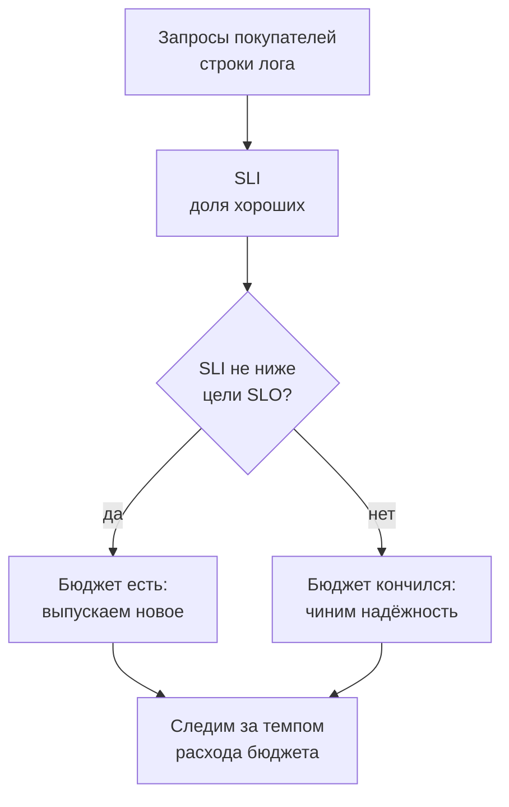
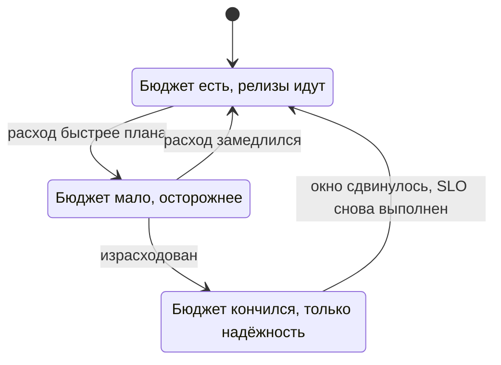

## Зачем это нужно

Продолжаем первую неделю в магазине. В пятницу менеджер подходит к тебе с простым вопросом: «Наш сайт достаточно надёжен перед распродажей?» Ты открываешь приборы, видишь графики, но на вопрос «достаточно ли» они не отвечают. Одному человеку «надёжно» значит «открывается», другому «открывается быстро», третьему «заказ не теряется». Пока не договорились, о чём речь, разговор превращается в спор мнений: «у нас всё зелёное» против «клиенты жалуются».

Такой спор я видел на разборе: дежурный показывал ровные 120 мс средней задержки, а покупатели писали, что заказ «висит». Девять запросов из десяти отвечали за десяток миллисекунд, а каждый шестой заказ тянулся больше секунды, и среднее смешало их в «норму». Мерить надо то, что чувствует покупатель.

Сегодня ты научишься делать то же самое по шагам. Сначала выбрать число, которое честно измеряет «хорошо» (его называют SLI: доля запросов, которые прошли хорошо, как оценка за контрольную). Потом поставить для него цель (SLO: проходной балл). Потом посчитать бюджет ошибок: сколько плохих запросов можно себе позволить, не провалив цель, как лимит карманных денег на неделю. Пока бюджет есть, команда смело выпускает новое. Когда кончился, она сначала чинит надёжность. Всё это ты посчитаешь на настоящих логах «Магазина» командами `jq`, `awk` и `sort`: установки новых инструментов не потребуется.

Шаг проекта: в репозитории `~/monitoring-lab` появится `slo.md`: что считаем хорошим запросом, цель на 30 дней, бюджет ошибок и цифры, которые ты сам вытащил из логов стенда.

## Что нужно знать

- Три сигнала, RED и симптом против причины: [урок 1.1](01-signals.md). Репозиторий `~/monitoring-lab` и стенд с профилем `monitoring` оттуда же.
- Конвейеры и разбор текста: `awk` (программа для разбора текста по колонкам), `sort`, `uniq`, `cut`: [load-tester, урок 1.2](../../load-tester/01-linux/02-text-logs.md) или [DevOps, урок 1.2](../../devops/01-linux/02-text-pipes.md). `jq` (разбор JSON) установлен в уроке 1.1 load-tester.
- Запуск стенда `docker compose --profile monitoring up -d`: [урок 1.1](01-signals.md), практика 1.

## Картина целиком

Выбираем событие (запрос покупателя) и решаем, какое из них хорошее. Делим хорошие на все и получаем число (SLI). Сравниваем с целью (SLO). Разница между целью и стопроцентной надёжностью это бюджет ошибок, и от того, остался он или кончился, зависит решение команды.



На схеме решение завязано на цифру, которую заранее приняли все. Спор «надёжность или новые функции» превращается в вопрос «осталось ли что-то в бюджете». Ниже мы пройдём по схеме по порядку, а потом сделаем всё на логах «Магазина».

## Теория

### SLI: как превратить «хорошо» в число

«Сервис работает нормально»: что это значит? Один скажет «отвечает», другой «отвечает быстро», третий «не теряет заказы». Чтобы не спорить, качество записывают числом.

Вспомни школьную оценку. «Ты хорошо знаешь предмет» это мнение. «Ты решил 18 задач из 20» это число, которое можно сравнить с прошлым разом. **SLI** (Service Level Indicator, индикатор уровня сервиса) это число, которое измеряет качество так, как его чувствует пользователь. Почти всегда его записывают как долю хороших событий:

```text
SLI = хорошие события / все события * 100%
```

Вы сами определяете, что событие и что в нём «хорошее». Событие: запрос покупателя. Хороший запрос для доступности: ответ с кодом меньше 500. Хороший запрос для задержки: быстрее порога, например 300 миллисекунд. Из этих двух определений получаются два индикатора: доступность и задержка.

Теперь пример на «Магазине». За час пришло 10 000 запросов, из них 260 получили ответ 500 или 502. Хороших 10 000 минус 260 равно 9 740. SLI доступности равен 9 740 делить на 10 000, то есть 0,974, или 97,4%.

> **Прикинь сам:** из 2 000 запросов 30 вернули 503, 50 вернули 404, остальные 200. Чему равен SLI доступности, если 404 ошибкой не считаем?
{: .predict}

Плохих только 30 (код 503). Хороших 2 000 минус 30 равно 1 970. SLI равен 1 970 делить на 2 000, то есть 98,5%. Если бы 404 тоже считали плохими, плохих стало бы 80, а SLI упал бы до 96%. Разница в полтора процента возникла не из-за сервиса, а из-за определения.

Осторожно: что считать ошибкой, нужно договориться заранее и записать. Ответ `404` («такого нет») и `400` («запрос кривой») это ошибка клиента: сервис отработал правильно. Обычно плохими считают только `5xx`. Служебные запросы (`/healthz`, `/readyz`, `/metrics`) в SLI покупателей не входят: их делают проверки и программы, а не люди. Мы скоро увидим, почему это важно.

> **Главное:** SLI это доля хороших событий из всех, а «хорошее» определяют заранее и записывают в документ.
{: .key}

Число есть. Но что считать событием, если у нас нет «хороших» и «плохих» запросов в готовом виде? Откуда их брать?

### Лог «Магазина»: откуда берутся цифры для SLI

Чтобы посчитать долю хороших запросов, кто-то должен был записать каждый запрос. Если записей нет, считать нечего. Поэтому первые данные для SLI почти всегда берут из журнала, который у сервиса уже есть и ничего не стоит.

Это как журнал вахтёра: кто вошёл, когда, к кому, сколько пробыл. Чтобы узнать, сколько посетителей ушло недовольными, не нужна новая система, достаточно прочитать журнал и посчитать. «Магазин» ведёт такой журнал сам: на каждый обработанный запрос пишет одну строку JSON в стандартный вывод контейнера. JSON это текстовый формат «ключ: значение», в котором программам удобно искать поля по имени, а не по номеру колонки.

```text
{"ts": "2026-10-04T09:12:31.482913+00:00", "level": "INFO", "msg": "Запрос завершён", "method": "GET", "route": "/api/products/{id}", "path": "/api/products/42", "status": 200, "duration_ms": 6.41, "request_id": "lab-0001", "trace_id": "b3a6c5f0e4d24a7e9a1f0c2d8e7b6a54"}
```

Для двух SLI нам нужны три поля. `status` (код ответа) решает, хороший ли запрос для доступности: 500 и выше это плохой. `duration_ms` (сколько миллисекунд длился запрос) решает, хороший ли он для задержки: дольше порога это плохой. `route` (шаблон пути) позволяет отделить служебные запросы от запросов покупателей и разложить цифры по частям магазина. Один запрос может быть плохим сразу по двум индикаторам: заказ, который ответил `502` через полторы секунды, провалил и доступность, и задержку.

Теперь первая ловушка. В этом же журнале лежат строки о проверках: каждые 5 секунд Docker спрашивает `/healthz`, а мониторинг приходит за числами на `/metrics`. Они быстрые, всегда с кодом 200, и их много. Если не отфильтровать, они «разбавят» статистику хорошими запросами, и доступность покажется выше, чем есть на самом деле. Покажу на числах в практике.

Вторая ловушка. Лог видит только запросы, которые дошли до сервиса. Если сервис упал целиком или сломалась сеть до него, в журнале тишина, и по нему доступность выглядит как 100%: ни одной ошибки, потому что ни одного запроса. Поэтому вторым источником делают проверку снаружи, которая сама ходит на сайт: её мы настроим в теме 2.

> **Главное:** первые данные для SLI берут из лога запросов: `status` и `duration_ms`, но служебные пути вычитают, а полную тишину лог не покажет.
{: .key}

Теперь, когда у нас есть число, возникает вопрос: достаточно ли оно хорошо?

### SLO и окно: цель для SLI

97,4%: это нормально или ужас? Само число этого не говорит. Нужна цель, с которой его сравнивают. Как норма на экзамене: «для зачёта нужно не меньше 15 задач из 20».

**SLO** (Service Level Objective, целевой уровень) это цель для SLI за окно времени. Например: «доля запросов без `5xx` не меньше 99% за скользящие 30 дней». **Окно** (window) обязательно: без него непонятно, за какой период считать. За всю историю сервиса один плохой день растворится в годах хороших, а за одну минуту единственная ошибка даст «0% доступности». «Скользящее» окно значит, что оно сдвигается каждую минуту и всегда покрывает «последние 30 дней от сейчас», а не «с первого по тридцатое». Тогда плохой день не «исчезает» в полночь первого числа.

На нашем примере: SLI 97,4%, цель 99%. Цель не выполнена. В запросах: при 10 000 запросах допустимо не больше 1%, то есть 100 плохих, а реально их было 260. Реальность хуже цели в 2,6 раза.

Почему не поставить 100%? Потому что 100% не бывает: ломаются железо, сеть, выкатываются обновления, а каждая следующая девятка в цифре стоит непропорционально дороже. Цель выбирают как компромисс между надёжностью, скоростью выпуска нового и деньгами.

Осторожно: путают SLO и SLA. SLO это внутренняя цель команды. SLA это обещание клиенту, и о нём чуть ниже.

> **Главное:** SLO это цель для SLI за окно времени, и без окна цифра ничего не значит.
{: .key}

Из цели следует очень практичная вещь: запас, который можно тратить.

### Бюджет ошибок

Если цель 99%, то остальные 1% можно «потратить». Это меняет разговор с разработчиками: вместо «никаких сбоев» получается «сбои разрешены до такой границы, и пока мы в границе, выпускаем новое смело». Бюджет как карманные деньги на неделю: пока они есть, можно рискнуть и купить интересное (выпустить смелый релиз), когда кончились, ждёшь следующей недели.

**Бюджет ошибок** (error budget) равен 100% минус SLO. Его выражают двумя способами: в запросах (1% от числа запросов за окно) и в минутах простоя (1% от времени окна). Считаем для SLO 99% за 30 дней. В 30 днях 30 × 24 × 60 = 43 200 минут, значит бюджет это 43 200 × 0,01 = 432 минуты, или 7,2 часа. В запросах: если за 30 дней приходит миллион запросов, бюджет это 10 000 плохих.



Схема показывает, что бюджет это состояние, которое меняется со временем. Пока он есть, релизы идут как обычно. Когда он кончился, команда замораживает релизы (кроме исправлений надёжности) и занимается устойчивостью. Так спор «надёжность или новые функции» решается цифрой, которую приняли заранее.

> **Прикинь сам:** SLO 99,9% за 30 дней, сервис получает 2 000 000 запросов. Сколько запросов может провалиться, не нарушив SLO? Если за первые 3 дня ушло 1 500, то это много или мало?
{: .predict}

Бюджет равен 0,1% от 2 000 000, то есть 2 000 запросов. За 3 дня из 30 (десятая часть срока) ушло 1 500 из 2 000, то есть три четверти бюджета. Это слишком быстро: при таком темпе бюджет кончится на четвёртом дне. Как измерять скорость расхода (её называют burn rate), разберём позже, в прикладных курсах.

Осторожно: цель не в том, чтобы бюджет остался нетронутым. Если он всегда полный, SLO слишком мягкий или команда боится рисковать.

> **Главное:** бюджет ошибок это 100% минус SLO: сколько плохого можно себе позволить, и от его остатка зависит, выпускать новое или чинить.
{: .key}

Бюджет внутри команды. А что обещать клиентам?

### SLA и «девятки»

Курьерская служба обещает доставить за два дня: это обещание, за нарушение которого вернут деньги. Внутри у неё цель строже: «стараемся за день», чтобы был запас. Здесь та же логика, что у SLO и SLA.

**SLA** (Service Level Agreement, соглашение об уровне сервиса) это обещание клиенту в договоре, у которого есть последствия: возврат денег, штраф. Внутренний SLO строже SLA, иначе ты нарушишь договор раньше, чем успеешь среагировать. Доступность принято называть «девятками» (nines): 99% это «две девятки», 99,9% «три девятки». Каждая следующая девятка уменьшает допустимый простой в десять раз.

| SLO за 30 дней | Бюджет простоя |
|---|---|
| 99% | 432 минуты (7,2 часа) |
| 99,5% | 216 минут (3,6 часа) |
| 99,9% | 43,2 минуты |
| 99,99% | 4,32 минуты |

Как получены числа: 43 200 минут умножить на допустимую долю простоя. Для 99,99% она равна 0,0001, значит 43 200 × 0,0001 = 4,32 минуты.

<div class="viz" data-viz="chart" data-type="bar" data-x="99%,99.5%,99.9%,99.99%" data-x-label="SLO за 30 дней" data-y-label="минут простоя" data-unit="мин" data-explain="Каждая следующая девятка уменьшает бюджет простоя примерно в десять раз: с 432 минут до 4,3 минуты." data-series='[{"name":"Бюджет простоя, мин","values":[432,216,43.2,4.32]}]'></div>

Что здесь видно: между двумя и четырьмя девятками разница в сто раз. 4,32 минуты в месяц меньше, чем одна перезагрузка сервера после обновления. Человек, которому пришёл алерт, за такое время даже не успеет открыть ноутбук. Поэтому каждая следующая девятка требует не «поработать получше», а другой архитектуры (несколько серверов, автоматическое переключение, тренировки отказов) и стоит на порядок дороже.

> **Прикинь сам:** менеджер просит поставить SLO 99,99%, «чтобы мы были круче конкурентов». Магазин работает на одном сервере. Реально ли это?
{: .predict}

Нет. Бюджет 4,32 минуты в месяц меньше, чем одна перезагрузка, а сеть, диск и хост отказывают независимо от качества кода. Предложи SLO 99%, посчитай цену перехода к 99,9% (второй сервер, переключение) и пусть бизнес решает, нужны ли лишние девятки.

> **Главное:** SLA это обещание клиенту с последствиями, SLO строже и внутренний, а каждая девятка уменьшает бюджет простоя в десять раз и стоит заметно дороже.
{: .key}

Но предел надёжности задаёт не только твой код.

### Составной SLA: девятки перемножаются

Покупатель оформляет заказ, и запрос проходит через цепочку: сам магазин, база данных, Redis (хранилище корзины) и сервис оплаты. У каждого звена своя доступность. Что получится у цепочки в целом?

Это гирлянда старого образца: лампочки включены последовательно, и если перегорит одна, не горит вся гирлянда. Чем больше лампочек, тем выше шанс, что хоть одна сломается. Для компонентов, нужных **все сразу**, доступности перемножаются. Для параллельных копий (работает, пока жива хотя бы одна) перемножаются **недоступности**.

Посчитаем путь заказа. Пусть магазин и оплата доступны на 99,9%, база и Redis на 99,95%. Переводим в доли: 0,999, 0,9995, 0,9995 и 0,999. Умножаем: 0,999 × 0,9995 × 0,9995 × 0,999 = 0,9970. Это 99,70%, то есть 43 200 × (1 минус 0,997) = 129 минут простоя за 30 дней, хотя каждое звено по отдельности выглядит хорошо.

Добавим вторую копию магазина. Обе упадут одновременно с вероятностью 0,001 × 0,001 = 0,000001, значит пара доступна на 0,999999. Цепочка станет 0,999999 × 0,9995 × 0,9995 × 0,999 = 0,9980, то есть 99,80% (86 минут простоя). Стало лучше, но выше самого слабого одиночного звена (оплата, 99,9%) не поднимется никогда.

Обрати внимание: каталог оплату не зовёт. У него цепочка короче (магазин и база: 0,999 × 0,9995 = 99,85%), поэтому и обещать по каталогу можно больше, чем по заказам. Вот почему у разных путей пользователя бывают разные SLI.

Осторожно: расчёт предполагает независимые отказы. Две копии в одной стойке падают вместе, и реальные цифры хуже.

> **Главное:** для звеньев цепочки доступности перемножаются, поэтому итог всегда хуже самого слабого, а резервировать надо все звенья, а не одно.
{: .key}

Мы разобрались с доступностью. Теперь о том, как мерить скорость.

### Квантили: почему не среднее

Покупатель ждёт ответа. Сколько ждут «обычно»? Среднее скрывает самых недовольных. Представь очередь в кассе: 95 человек ждали по минуте, пятеро по 30 минут. Среднее время ожидания около 2,5 минут: «нормально». Но пятеро злы, и они напишут отзывы.

Поэтому для времени ответа берут не среднее, а **квантиль** (percentile, процентиль). Выстрой все времена по возрастанию и возьми то, что стоит на нужной позиции. Квантиль **p95** это значение, быстрее которого отвечает 95% запросов. **p50** это медиана: половина запросов быстрее, половина медленнее. **p99** показывает «хвост» (tail latency): самых медленных из ста. Для SLI задержки формулируют так: «не менее 95% запросов быстрее 300 мс». Это то же самое, что «p95 меньше 300 мс».

Посчитаем на очереди: 100 запросов, 95 ответили за 50 мс, пять за 5 000 мс. Среднее равно (95 × 50 + 5 × 5 000) / 100 = (4 750 + 25 000) / 100 = 297,5 мс: выглядит нормально. p95 стоит на 95-й позиции от начала: 50 мс. p99 на 99-й позиции: 5 000 мс. Среднее около 300 мс, а каждый двадцатый ждёт 5 секунд.

<div class="viz" data-viz="percentiles" data-slow="5" data-slow-ms="2000"></div>

На виджете смотри на разрыв между средним и p99: пока медленных запросов мало, среднее почти не двигается, а хвост уходит вверх. Именно поэтому в целях и алертах смотрят на квантили, а среднее оставляют для общей картины.

<details markdown="1">
<summary>Для любопытных: почему квантили не усредняют</summary>

Среднее из p95 двух серверов не равно общему p95: у одного 10 запросов, у другого 10 000, вклад несравним. Поэтому Prometheus (программа, которая собирает числа сервисов, тема 2) хранит гистограммы: сколько запросов уложилось в каждую «корзину» времени, а квантиль считает из корзин. У «Магазина» есть корзина 0,3 секунды, ровно под наш порог.

</details>

> **Главное:** среднее прячет медленных, а квантили (p95, p99) показывают, как долго ждут самые недовольные, поэтому в SLO задержки берут долю быстрее порога.
{: .key}

Осталось решить, на что смотреть, чтобы вовремя узнавать о боли.

### Алерты на боль пользователя

Ночной звонок должен значить «нужно действие человека прямо сейчас». Если он звонит зря, люди перестают на него реагировать. Мы разбирали это в уроке 1.1: тревога на симптом, а не на причину. Теперь у нас есть число, на которое её можно повесить.

Хороший алерт привязывают к SLI и бюджету. «Доля `5xx` выше 5% пять минут»: покупатели получают ошибки прямо сейчас. Лучше всего алерт привязывают к скорости расхода бюджета (её называют burn rate): если бюджет тратится в десять раз быстрее плана, пора будить. Сама техника разобрана в прикладных курсах, ссылки в конце урока.

Перед созданием алерта спроси: «что человек сделает, когда придёт?». Если ничего, это строка на дашборде.

Осторожно: у алерта должно быть достаточно трафика и окна. Одна ошибка из 20 запросов за минуту даёт 5% и ничего не доказывает, такой алерт будет шуметь.

> **Главное:** алерт будит человека, когда бюджет ошибок горит слишком быстро, а не когда одна цифра на секунду вышла за линию.
{: .key}

И последнее: почему вообще цель выбирают от покупателя, а не от железа.

Теория закончилась. Дальше считаем настоящие логи.

## Практика

Все файлы кладём в `~/monitoring-lab/01-basics`. Нагрузку и поломки делаем только на своём локальном стенде. Стенд должен быть запущен с профилем `monitoring`, как в уроке 1.1.

### 1. Набери трафик и сломай оплату

Нам нужны данные, в которых есть и хорошее, и плохое. Сделаем два шага: заведём скрипт трафика и сломаем оплату наполовину, чтобы часть заказов не проходила.

Создай `~/monitoring-lab/01-basics/traffic.sh` и сделай его исполняемым:

```bash
mkdir -p ~/monitoring-lab/01-basics/data
cd ~/monitoring-lab/01-basics
cat > traffic.sh <<'EOF'
#!/usr/bin/env bash
# Трафик на локальный «Магазин»: каталог, карточки, иногда заказ.
# Использование: ./traffic.sh [число итераций]
set -u
BASE=${BASE:-http://localhost:8000}
N=${1:-150}
TOKEN=$(curl -fsS "$BASE/api/login" -H 'Content-Type: application/json' \
  -d '{"email":"user0001@shop.lab","password":"password"}' | jq -r .token)
[ -n "$TOKEN" ] || { echo "не удалось войти: запущен ли стенд?"; exit 1; }
for i in $(seq 1 "$N"); do
  curl -s -o /dev/null "$BASE/api/products?size=20"
  curl -s -o /dev/null "$BASE/api/products/$((RANDOM % 10000 + 1))"
  if (( i % 10 == 0 )); then
    curl -s -o /dev/null "$BASE/api/products/99999999"   # такого товара нет: 404
  fi
  if (( i % 2 == 0 )); then
    curl -s -o /dev/null "$BASE/api/cart/items" -H "Authorization: Bearer $TOKEN" \
      -H 'Content-Type: application/json' -d "{\"product_id\":$((RANDOM % 10000 + 1)),\"qty\":1}"
    curl -s -o /dev/null -X POST "$BASE/api/orders" -H "Authorization: Bearer $TOKEN"
  fi
done
echo "готово: $N итераций"
EOF
chmod +x traffic.sh
```

Разберём скрипт. `cat > traffic.sh <<'EOF' ... EOF` записывает всё между метками в файл, кавычки вокруг `EOF` запрещают оболочке подставлять переменные заранее. `set -u` останавливает скрипт при обращении к неизвестной переменной. Первая команда с `curl` входит как `user0001` и достаёт токен (временный пропуск покупателя) через `jq -r .token`. Дальше в цикле каждую итерацию скрипт открывает каталог и случайную карточку товара. `$RANDOM` даёт случайное число, `% 10000 + 1` превращает его в номер товара от 1 до 10 000. Каждую десятую итерацию просит несуществующий товар (получает `404`). Каждую вторую кладёт товар в корзину и оформляет заказ, а `-X POST` выбирает метод запроса.

Теперь сломаем оплату. Порт 8001 это сервис оплаты, а `/admin/config` меняет его поведение на лету: задержку в миллисекундах и долю отказов от 0 до 1.

```bash
curl -fsS localhost:8001/admin/config -H 'Content-Type: application/json' -d '{"delay_ms":300,"fail_rate":0.6}'
./traffic.sh 150
```

Скрипт идёт около двух минут. Магазин при отказе оплаты пробует ещё три раза, и только после четырёх неудач отвечает `502`. Поэтому не каждый отказ оплаты становится ошибкой заказа.

**Что должно получиться:**

```text
{"delay_ms":300,"fail_rate":0.6}
готово: 150 итераций
```

**Как читать вывод:** первая строка это ответ оплаты с новыми настройками. Вторая говорит, что скрипт отработал. Результатов трафика пока не видно: они лежат в логе.

**Типичные ошибки:**

- `curl: (7) Failed to connect to localhost port 8001 after 0 ms: Couldn't connect to server`: стенд не запущен. Выполни команду запуска из практики 1 урока 1.1.
- `не удалось войти: запущен ли стенд?`: токен не получен, магазин не отвечает или ещё поднимается. Проверь `curl -s localhost:8000/readyz`.

### 2. Достань запросы из лога

Логи магазина лежат в Docker. Сохраним их в файл и вытащим только строки о запросах.

```bash
cd ~/learning/load-tester/project/shop
docker compose logs shop --no-log-prefix > ~/monitoring-lab/01-basics/data/shop.log
cd ~/monitoring-lab/01-basics
jq -R -c 'fromjson? | select(type == "object" and .msg == "Запрос завершён")' data/shop.log > data/requests.jsonl
wc -l data/requests.jsonl
jq -r .route data/requests.jsonl | sort | uniq -c | sort -rn
```

Разбор. `docker compose logs shop --no-log-prefix` выдаёт всё, что сервис написал в вывод, без названия контейнера в начале строк. Не все строки там JSON: при старте uvicorn (сервер, на котором работает магазин) пишет обычные строки вроде `INFO:     Started server process [1]`. Поэтому `jq -R` читает вход как обычный текст (`-R`, raw), `fromjson?` пробует разобрать строку как JSON и молча пропускает неудавшиеся (вопросительный знак глотает ошибку), а `select(...)` оставляет только объекты с нашим сообщением. Ключ `-c` печатает каждый объект одной строкой. Дальше `jq -r .route` достаёт поле `route` у каждой строки, `sort | uniq -c` считает одинаковые, а `sort -rn` ставит самые частые вверх.

**Что должно получиться** (числа зависят от того, сколько стенд проработал, у тебя будут другие):

```text
946 data/requests.jsonl
 240 /metrics
 240 /healthz
 165 /api/products/{id}
 150 /api/products
  75 /api/orders
  75 /api/cart/items
   1 /api/login
```

**Как читать вывод:** первая строка это число строк о запросах. Дальше по маршрутам. Видишь странное: `/metrics` и `/healthz` по 240 штук, больше, чем любой маршрут покупателей. Это проверки: Docker и мониторинг приходят за 20 минут работы стенда по 240 раз. Они в статистику покупателей не входят. Остальное это трафик скрипта: карточки товаров в `/api/products/{id}` включают и те 15 запросов, что вернули `404`.

**Типичные ошибки:**

- `jq: error (at <stdin>:1): Cannot index string with string "msg"`: убрана проверка `type == "object"` или забыт ключ `-R`. Повтори команду точно как выше.
- `no configuration file provided: not found`: ты не в каталоге `~/learning/load-tester/project/shop`.

Теперь оставим только запросы покупателей и вытащим три поля: код, время, маршрут.

```bash
jq -r 'select(.route != "/healthz" and .route != "/readyz" and .route != "/metrics") | [.status, .duration_ms, .route] | @tsv' data/requests.jsonl > data/user-requests.tsv
head -3 data/user-requests.tsv
wc -l data/user-requests.tsv
```

Здесь `select(...)` отбрасывает три служебных маршрута, а `[.status, .duration_ms, .route] | @tsv` печатает три поля через символ табуляции (TSV: «значения через табуляцию»). Такой формат легко читает `awk`.

**Что должно получиться:**

```text
200	306.22	/api/login
200	17.97	/api/products
200	6.64	/api/products/{id}
466 data/user-requests.tsv
```

**Как читать вывод:** в каждой строке код, время в миллисекундах и маршрут. Строк 466: 946 минус 480 служебных. Это и есть «события» для SLI: запросы покупателей.

### 3. Доступность из лога

Посчитаем долю запросов без `5xx` и посмотрим, где именно ошибки.

```bash
awk -F'\t' '{n++; if ($1 >= 500) bad++} END {printf "всего=%d плохих=%d доступность=%.3f%%\n", n, bad, 100 * (n - bad) / n}' data/user-requests.tsv
awk -F'\t' '{n[$3]++; if ($1 >= 500) b[$3]++} END {for (r in n) printf "%-20s %4d %3d\n", r, n[r], b[r]}' data/user-requests.tsv | sort -k2 -nr
cut -f1 data/user-requests.tsv | sort | uniq -c | sort -rn
```

Разбор. `awk -F'\t'` делит строку по табуляции, `$1` это код. `n++` считает все строки, `if ($1 >= 500) bad++` считает плохие, блок `END{...}` печатает итог после последней строки. Во второй команде `n[$3]++` это массив-счётчик по маршруту: ключ маршрут, значение сколько раз он встретился. `for (r in n)` печатает пары, а `sort -k2 -nr` сортирует по второй колонке в обратном числовом порядке. Третья команда считает коды: `cut -f1` берёт первую колонку.

**Что должно получиться** (случайность оплаты сделает твои числа другими):

```text
всего=466 плохих=8 доступность=98.283%
/api/products/{id}    165   0
/api/products         150   0
/api/orders            75   8
/api/cart/items        75   0
/api/login              1   0
 301 200
 142 201
  15 404
   8 502
```

**Как читать вывод:** в первой строке уже готовый SLI: 458 хороших из 466, доступность 98,283%. Во второй группе видно, что весь вред собрал `/api/orders`: 8 из 75 заказов (около 11%) закончились ошибкой, а каталог ни одной. Общая цифра 98,3% скрывает: заказы страдают сильно, остальное идеально. Третья группа показывает коды: 15 ответов `404` (запросы к несуществующему товару) мы ошибками не считаем.

> **Прикинь сам:** SLO доступности 99%. Выполнено ли оно на этом логе? Сколько плохих запросов допустимо на 466 запросов?
{: .predict}

Нет. Допустимо 1% от 466, то есть около 4,66, а плохих 8. Цель нарушена. Для наглядности: расход бюджета равен 8 / 4,66, то есть примерно 172%.

**Типичные ошибки:**

- `awk: division by zero`: файл `user-requests.tsv` пуст. Проверь, что шаг 2 дал строки.

### 4. Задержка: среднее против p95

Теперь про скорость. Сделаем маленький помощник, который читает числа и печатает среднее и квантили, чтобы не писать формулу каждый раз. Создай `~/monitoring-lab/01-basics/pctl.sh`:

```bash
cat > pctl.sh <<'EOF'
#!/usr/bin/env bash
# Читает числа из stdin (по одному на строку), печатает среднее и квантили.
sort -n | awk '
  function q(p,   i) { i = NR * p; if (i > int(i)) i = int(i) + 1; return a[i] }
  { a[NR] = $1; s += $1 }
  END { printf "n=%d avg=%.1f p50=%s p95=%s p99=%s\n", NR, s / NR, q(0.5), q(0.95), q(0.99) }'
EOF
chmod +x pctl.sh
cut -f2 data/user-requests.tsv | ./pctl.sh
```

Разбор. `sort -n` сортирует числа по значению (без `-n` сортировка идёт как текст, и `10` окажется раньше `9`). `awk` складывает отсортированные числа в массив `a` по порядку (`NR` это номер текущей строки) и копит сумму `s` для среднего. Функция `q(p)` находит позицию квантиля: для p95 это 95% от числа строк, округлённые вверх, и берёт значение на ней. `cut -f2` берёт вторую колонку, время.

**Что должно получиться:**

```text
n=466 avg=118.4 p50=14.14 p95=910.79 p99=1243.71
```

**Как читать вывод:** среднее 118 мс выглядит неплохо, и p50 вообще 14 мс. Но p95 равно 911 мс, то есть каждый двадцатый покупатель ждал почти секунду, а p99 и вовсе 1,2 секунды. Среднее не показало проблемы, квантиль показал.

Теперь разложим по маршрутам, чтобы понять, кто тянет хвост:

```bash
for r in "/api/products" "/api/products/{id}" "/api/cart/items" "/api/orders"; do
  printf '%-20s ' "$r"
  awk -F'\t' -v r="$r" '$3 == r {print $2}' data/user-requests.tsv | ./pctl.sh
done
awk -F'\t' '$2 <= 300 {ok++} END {printf "все запросы быстрее 300 мс: %d из %d, %.2f%%\n", ok, NR, 100 * ok / NR}' data/user-requests.tsv
awk -F'\t' '$3 ~ /^\/api\/products/ {n++; if ($2 <= 300) ok++} END {printf "каталог быстрее 300 мс: %d из %d, %.2f%%\n", ok, n, 100 * ok / n}' data/user-requests.tsv
```

`-v r="$r"` передаёт переменную оболочки в `awk`, `$3 ~ /^\/api\/products/` выбирает маршруты по началу пути (`~` это «подходит под шаблон»).

**Что должно получиться:**

```text
/api/products        n=150 avg=17.4 p50=16.5 p95=27.03 p99=27.79
/api/products/{id}   n=165 avg=5.5 p50=5.44 p95=8.56 p99=8.89
/api/cart/items      n=75 avg=19.0 p50=18.44 p95=29.5 p99=29.93
/api/orders          n=75 avg=665.8 p50=627.34 p95=1246.61 p99=1301.91
все запросы быстрее 300 мс: 395 из 466, 84.76%
каталог быстрее 300 мс: 315 из 315, 100.00%
```

**Как читать вывод:** каталог отвечает за десятки миллисекунд, а заказы в среднем за 666 мс: оплата стоит 300 мс на каждую попытку, а попыток может быть до четырёх. Общий SLI «быстрее 300 мс» выходит 84,8%, цель 95% не выполнена. Но если считать только каталог, всё идеально: 100%. Отсюда практический вывод: SLI задержки нужно ставить отдельно на каталог и на заказ, а не общий на всё.

> **Прикинь сам:** цель «95% запросов каталога быстрее 300 мс». Выполнена ли она? А цель «95% всех запросов быстрее 300 мс»?
{: .predict}

Первая выполнена с запасом: 100%. Вторая нет: 84,8%. Один и тот же магазин, одни и те же данные, а вывод разный: потому и важно заранее записать, для какого пути считаем.

> Нейросеть можно попросить объяснить результат `awk`, но числа из твоего лога она не видит: вставь вывод целиком и проверь её арифметику вручную.
{: .ai}

**Типичные ошибки:**

- `p95` пустой: в колонке 2 не числа. Проверь `head -3 data/user-requests.tsv`.

### 5. Бюджет ошибок и составной SLA

Переведём цель в числа и посчитаем цепочку.

```bash
for slo in 99 99.5 99.9 99.99; do
  # бюджет = (100 - SLO)% от 43200 минут в 30 днях
  echo "SLO $slo% -> бюджет $(echo "scale=2; (100 - $slo) * 43200 / 100" | bc) мин"
done
python3 -c "
chain = 0.999 * 0.9995 * 0.9995 * 0.999          # заказ: магазин, PostgreSQL, Redis, оплата
spare = (1 - 0.001 ** 2) * 0.9995 * 0.9995 * 0.999  # две копии магазина
catalog = 0.999 * 0.9995                          # каталог: магазин и PostgreSQL
for name, a in (('заказ, одна копия', chain), ('заказ, две копии', spare), ('каталог', catalog)):
    print(f'{name:18} {a*100:.3f}%  простой {43200*(1-a):.1f} мин')
"
```

Разбор. Цикл `for ... do ... done` повторяет тело для каждого SLO, `echo ... | bc` отдаёт выражение калькулятору (`scale=2` это две цифры после точки), `python3 -c "..."` запускает короткую программу из строки.

**Что должно получиться:**

```text
SLO 99% -> бюджет 432.00 мин
SLO 99.5% -> бюджет 216.00 мин
SLO 99.9% -> бюджет 43.20 мин
SLO 99.99% -> бюджет 4.32 мин
заказ, одна копия  99.700%  простой 129.5 мин
заказ, две копии   99.800%  простой 86.4 мин
каталог            99.850%  простой 64.8 мин
```

**Как читать вывод:** первые четыре строки повторяют таблицу. Заказ с одной копией магазина получается 99,70%, то есть цель 99,9% (43 минуты) на нём невозможна, а 99% (432 минуты) вполне достижима. Вторая копия вернула 43 минуты, но выше 99,9% оплаты цепочка не поднимется. Каталог надёжнее заказа, потому что оплату не зовёт.

**Типичные ошибки:**

- `bash: bc: command not found`: нет калькулятора. В Ubuntu `sudo apt install bc`, на Mac он уже есть.

### 6. Шаг проекта: slo.md

Зафиксируем решение в репозитории, чтобы через полгода другой человек понял, когда «Магазин» достаточно надёжен. Создай `~/monitoring-lab/slo.md`. Числа из логов подставь свои.

```markdown
# SLO сервиса «Магазин»

Окно: скользящие 30 дней. Пользователь: покупатель, который ходит на `/api/*`.
Источник данных: JSON-лог сервиса `shop` (поля `status`, `duration_ms`, `route`).
Служебные пути `/healthz`, `/readyz`, `/metrics` в SLI не входят: это не покупатели.

## SLI

| SLI | Что считаем | Хорошее событие |
|---|---|---|
| Доступность | доля запросов покупателей без ошибки сервера | код ответа меньше 500 (404 и другие 4xx не считаем плохими) |
| Задержка каталога | доля запросов к `/api/products*` и `/api/categories` | быстрее 300 мс |

## SLO

Доступность 99%, задержка каталога 95% быстрее 300 мс (за 30 дней).

## Бюджет ошибок

Доступность 99% за 30 дней: 1% от 43200 минут, то есть 432 минуты.
В запросах: 1% от их числа (на миллион запросов допустимо 10000 плохих).

## Что показал лог стенда (сломанная оплата, учебный прогон)

- Доступность 98.283% (8 плохих из 466): цель не выполнена, все ошибки на `/api/orders` (8 из 75).
- Задержка каталога 100% быстрее 300 мс, все запросы вместе 84.76%.

## Что делаем при исчерпании бюджета

Замораживаем релизы, кроме исправлений надёжности, до восстановления SLO.
```

Сохрани и верни оплату в норму:

```bash
curl -fsS localhost:8001/admin/config -H 'Content-Type: application/json' -d '{"delay_ms":50,"fail_rate":0}'
cd ~/monitoring-lab
echo '01-basics/data/' >> .gitignore
git add slo.md .gitignore 01-basics/traffic.sh 01-basics/pctl.sh
git commit -m "docs: SLI и SLO для Магазина, скрипты трафика и квантилей"
git log --oneline | head -3
```

`.gitignore` исключает каталог `data` (логи большие и воспроизводимы).

**Что должно получиться:**

```text
{"delay_ms":50,"fail_rate":0.0}
c4d9e02 docs: SLI и SLO для Магазина, скрипты трафика и квантилей
8e1b7d4 docs: один запрос тремя сигналами
3f2a1c9 init: репозиторий курса
```

**Как читать вывод:** первая строка подтверждает, что оплата вернулась в норму, дальше история коммитов: хеши у тебя будут другие. Если сверху видишь свой коммит, шаг выполнен.

**Типичные ошибки:**

- `fatal: pathspec '01-basics/traffic.sh' did not match any files`: файла нет там, где ожидается. Проверь `ls ~/monitoring-lab/01-basics`.

## Сломай и почини

В этом уроке сломаем не сервис, а подсчёт. Ты показываешь менеджеру доступность, а он спрашивает: «Почему у вас 99,15%, а поддержка жалуется?» Сначала прочитай симптом, запиши гипотезы и только потом смотри проверки.

### Симптом

Дежурный посчитал доступность по всем строкам лога, не отбрасывая служебные запросы. Получилось 99,15%, цель 99% выполнена. А поддержка получила жалобы на заказы.

```bash
cd ~/monitoring-lab/01-basics
jq -s '{total: length, bad: (map(select(.status >= 500)) | length)} | .avail = (100 * (.total - .bad) / .total)' data/requests.jsonl
```

Здесь `jq -s` («slurp») читает весь файл как один массив, `map(select(...))` оставляет плохие запросы, последний фильтр добавляет поле `avail`.

**Что получится:**

```text
{
  "total": 946,
  "bad": 8,
  "avail": 99.15433403805497
}
```

**Как читать вывод:** 946 запросов, 8 плохих, доступность 99,154%. Цель в 99% выполнена, всё зелёное. Но в практике 3 ты получил 98,283% для тех же 8 плохих из 466, и цель нарушена.

### Гипотезы

1. В логе мало данных, и цифра шумит.
2. В подсчёт попали 480 служебных запросов (`/healthz` и `/metrics`), которые всегда успешны и «разбавили» статистику.
3. Покупатели жалуются зря: заказов мало, и ошибки случайны.

### Проверки

Сравни два подсчёта: все строки и только запросы покупателей.

```bash
jq -r .route data/requests.jsonl | sort | uniq -c | sort -rn | head -3
awk -F'\t' '{n++; if ($1 >= 500) bad++} END {printf "покупатели: %.3f%%\n", 100 * (n - bad) / n}' data/user-requests.tsv
```

**Что получится:**

```text
 240 /metrics
 240 /healthz
 165 /api/products/{id}
покупатели: 98.283%
```

**Как читать вывод:** два самых частых «маршрута» это проверки, и они составляют половину лога. Все 480 служебных запросов успешны, поэтому делитель вырос с 466 до 946, а число плохих осталось 8. Доля плохих упала почти вдвое (с 1,72% до 0,85%), и цель «стала» выполненной.

### Исправление

<details markdown="1">
<summary>Разбор</summary>

Верна гипотеза 2. Данных достаточно (гипотеза 1 неверна), а жалобы настоящие: заказы падают в 11% случаев (гипотеза 3 неверна). Служебные запросы это не покупатели, и в SLI они не входят. Правильный подсчёт отфильтровывает `/healthz`, `/readyz` и `/metrics` до расчёта, как в практике 2.

Мораль шире: «что считаем событием» это часть определения SLI, его записывают в `slo.md`. Особенно опасна ошибка в тихие ночные часы: покупателей мало, проверки разбавляют цифру сильнее.

</details>

## ИИ в помощь

Нейросеть хорошо считает бюджеты и объясняет термины, но путает SLO с SLA и ошибается в арифметике процентов. Общие правила: [ИИ-помощник](../../load-tester/ai.md).

**Задача:** проверить расчёт бюджета ошибок.

```text
У сервиса SLO доступности 99,5% за скользящие 30 дней, трафик 3 000 000 запросов за 30 дней.
Посчитай бюджет ошибок в запросах и в минутах простоя. Покажи вычисления по шагам.
Если за 5 дней уже провалилось 6 000 запросов, какую долю бюджета это составляет и укладываемся ли мы в график расходования?
```
{: .wrap}

**Проверь ответ:** пересчитай сам. Бюджет в запросах: 0,5% от 3 000 000 равно 15 000, в минутах 0,005 × 43 200 = 216. За 5 из 30 дней (шестая часть срока) допустимо потратить около 2 500 запросов, а потрачено 6 000, это 40% бюджета: сгорание идёт слишком быстро. Типичная ошибка нейросетей: путают 0,5% и 0,005 или считают бюджет от 100% трафика вместо трафика окна.

> Сначала посчитай сам на бумаге, потом спрашивай нейросеть: если ответы разошлись, правильный тот, где ты видишь все шаги.
{: .ai}

**Задача:** найти слабое место в определении SLI.

```text
Вот определение SLI интернет-магазина: «доля запросов с ответом 200 за минуту». Назови три проблемы этого определения (подумай про коды 201 и 404, служебные запросы и ночной трафик) и предложи исправленный вариант.
```
{: .wrap}

**Проверь ответ:** в хорошем ответе `201` и `204` считаются успехом, `404` не ошибка сервиса, служебные пути вычитаются, минутное окно шумит на малом трафике. Типичная ошибка нейросетей: считать ошибкой всё, что не `200`.

## Словарик урока

| Термин | Простыми словами |
|---|---|
| SLI | Число, которое измеряет качество для пользователя, обычно доля хороших событий |
| SLO | Цель для SLI за окно времени, например 99% за 30 дней |
| SLA | Обещание клиенту в договоре, у которого есть последствия: возврат денег, штраф |
| Окно (window) | Период, за который считают SLI и сравнивают с SLO, обычно скользящие 30 дней |
| Бюджет ошибок (error budget) | 100% минус SLO: сколько плохого можно позволить, не нарушив цель |
| Составной SLA | Доступность цепочки компонентов: у последовательных звеньев доступности перемножаются |
| Квантиль (percentile) | Значение, быстрее которого отвечает заданная доля запросов: p95 это 95% |
| p99 | Значение, быстрее которого отвечает 99% запросов; показывает «хвост» |
| Хвост задержки (tail latency) | Самые медленные запросы, которые среднее скрывает |
| Burn rate | Скорость расхода бюджета ошибок: во сколько раз быстрее плана он тратится |
| Служебные запросы | Запросы проверок и мониторинга (`/healthz`, `/readyz`, `/metrics`), не покупателей |

## Вопросы с собеседований

Раздел для повторения: ответь вслух, потом открой ответ. Короткие вопросы с пометкой `[на скорость]` тренируй на время: ответ за 30 секунд.



## Проверено на версиях

Стенд «Магазин» из `load-tester/project/shop` (сервис `shop` на `python:3.14.8-slim`), Docker Compose v2, `jq` 1.7, `awk` (BSD и GNU), `bc`, Python 3.12+. Октябрь 2026.

## Итог урока: ты умеешь

- [ ] Объяснить, чем SLI, SLO и SLA отличаются, и записать SLI как долю хороших событий.
- [ ] Определить, что в SLI считается плохим событием, и вычесть служебные запросы.
- [ ] Посчитать бюджет ошибок для SLO и в запросах, и в минутах простоя за 30 дней.
- [ ] Посчитать доступность цепочки компонентов и эффект резервирования.
- [ ] Объяснить, почему среднее прячет проблему и что показывают p50, p95 и p99.
- [ ] Записать SLI, SLO и бюджет в `slo.md` и сохранить в репозитории.

## Где это применить

- [DevOps, урок 8.1: наблюдаемость, три сигнала, SLI и SLO](../../devops/08-observability/01-observability-slo.md): те же понятия на сервисе «Заметки» с access-логом nginx.
- [DevOps, урок 8.11: паттерны надёжности и burn rate](../../devops/08-observability/11-reliability-patterns-burn-rate.md): как скорость расхода бюджета превращается в алерты.
- [load-tester, урок 8.4: профиль нагрузки и SLO](../../load-tester/08-perf-theory/04-load-profile-slo.md): как SLO задаёт критерии нагрузочного теста.
- [load-tester, урок 7.6: алерты, Alertmanager и первый инцидент](../../load-tester/07-observability/06-alerts-incidents.md): как привязать тревогу к симптому и разобрать учебный инцидент.

Дальше: тема 2, урок 2.1. Метрики и Prometheus: там числа из `/metrics` начнут сохраняться во времени, и твои подсчёты по логам превратятся в запросы к хранилищу.
