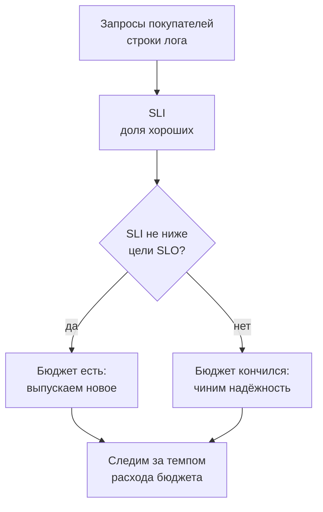
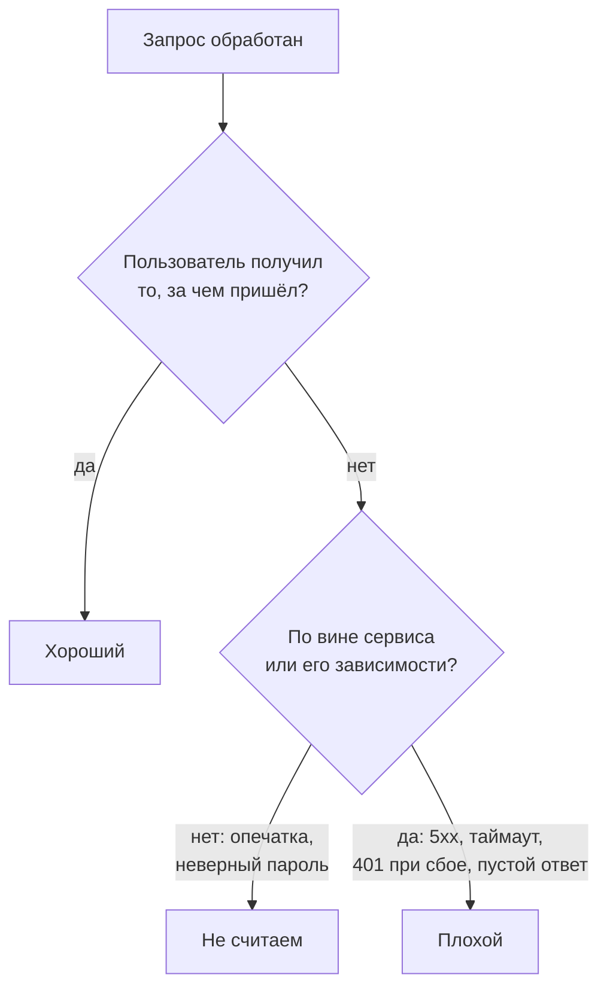
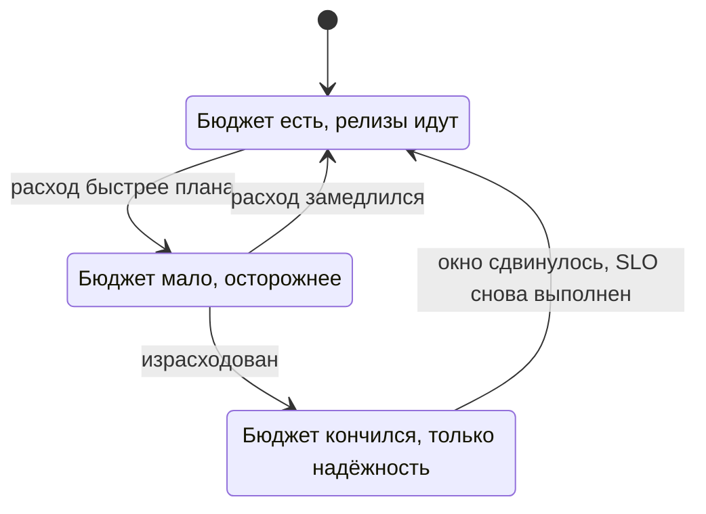

## Зачем это нужно

Продолжаем первую неделю в магазине. Менеджер спрашивает: «Наш сайт достаточно надёжен перед распродажей?» Одному «надёжно» значит «открывается», другому «открывается быстро», третьему «заказ не теряется». Пока не договорились, о чём речь, разговор превращается в спор мнений: «у нас всё зелёное» против «клиенты жалуются».

Такой спор я видел на разборе: дежурный показывал ровные 120 мс средней задержки, а покупатели писали, что заказ «висит». Девять запросов из десяти отвечали за десяток миллисекунд, а каждый шестой заказ тянулся больше секунды. Мерить надо то, что чувствует покупатель.

Сегодня ты выберешь число, которое честно измеряет «хорошо» (показатель, как оценка за контрольную), поставишь для него цель (проходной балл) и посчитаешь, сколько плохого можно себе позволить (лимит, как карманные деньги на неделю). Названия этих трёх вещей разберём в теории. Всё это на настоящих логах «Магазина» командами `jq`, `awk` и `sort`.

Шаг проекта: в репозитории `~/monitoring-lab` появится `slo.md`: что считаем хорошим запросом, цель на 30 дней, допустимая доля плохого и цифры, которые ты сам вытащил из логов стенда.

## Что нужно знать

- Три сигнала, RED и симптом против причины: [урок 1.1](01-signals.md). Репозиторий `~/monitoring-lab` и стенд с профилем `monitoring` оттуда же.
- Конвейеры и разбор текста: `awk` (программа для разбора текста по колонкам), `sort`, `uniq`, `cut`: [load-tester, урок 1.2](../../load-tester/01-linux/02-text-logs.md) или [DevOps, урок 1.2](../../devops/01-linux/02-text-pipes.md). `jq` (разбор JSON) установлен в уроке 1.1 load-tester.
- Запуск стенда `docker compose --profile monitoring up -d`: [урок 1.1](01-signals.md), практика 1.

## Картина целиком

Выбираем событие (запрос покупателя) и решаем, какое из них хорошее. Делим хорошие на все и получаем число (SLI). Сравниваем с целью (SLO). Разница между целью и стопроцентной надёжностью это бюджет ошибок, и от того, остался он или кончился, зависит решение команды.



На схеме решение завязано на цифру, которую заранее приняли все: спор «надёжность или новые функции» превращается в вопрос «осталось ли что-то в бюджете».

## Теория

### SLI: как превратить «хорошо» в число

«Сервис работает нормально»: что это значит? Один скажет «отвечает», другой «отвечает быстро», третий «не теряет заказы». Чтобы не спорить, качество записывают числом.

Вспомни школьную оценку. «Ты хорошо знаешь предмет» это мнение. «Ты решил 18 задач из 20» это число, которое можно сравнить с прошлым разом. **SLI** (Service Level Indicator, индикатор уровня сервиса) это число, которое измеряет качество так, как его чувствует пользователь. Почти всегда его записывают как долю хороших событий:

```text
SLI = хорошие события / все события * 100%
```

Вы сами определяете, что событие и что в нём «хорошее». Событие: запрос покупателя. Хороший запрос для доступности: ответ с кодом меньше 500. Хороший запрос для задержки: быстрее порога, например 300 миллисекунд. Из этих двух определений получаются два индикатора: доступность и задержка.

Теперь пример на «Магазине». За час пришло 10 000 запросов, из них 260 получили ответ 500 или 502. Хороших 10 000 минус 260 равно 9 740. SLI доступности равен 9 740 делить на 10 000, то есть 0,974, или 97,4%.

> **Прикинь сам:** из 2 000 запросов 30 вернули 503, 50 вернули 404, остальные 200. Чему равен SLI доступности, если 404 ошибкой не считаем?
{: .predict}

Плохих только 30 (код 503). Хороших 2 000 минус 30 равно 1 970. SLI равен 1 970 делить на 2 000, то есть 98,5%. Если бы 404 тоже считали плохими, плохих стало бы 80, а SLI упал бы до 96%. Разница в полтора процента возникла не из-за сервиса, а из-за определения.

Осторожно: что считать ошибкой, нужно договориться заранее и записать. Ответ `404` («такого нет») и `400` («запрос кривой») это ошибка клиента: сервис отработал правильно. Обычно плохими считают `5xx`, а ещё несколько случаев, когда отказ виден пользователю (о них отдельный раздел ниже). Служебные запросы (`/healthz`, `/readyz`, `/metrics`) в SLI покупателей не входят: их делают проверки и программы, а не люди. Мы скоро увидим, почему это важно.

> **Главное:** SLI это доля хороших событий из всех, а «хорошее» определяют заранее и записывают в документ.
{: .key}

Число есть. Но что считать событием, если у нас нет «хороших» и «плохих» запросов в готовом виде? Откуда их брать?

### Лог «Магазина»: откуда берутся цифры для SLI

Чтобы посчитать долю хороших запросов, кто-то должен был записать каждый запрос. Если записей нет, считать нечего. Поэтому первые данные для SLI почти всегда берут из журнала, который у сервиса уже есть и ничего не стоит.

Это как журнал вахтёра: кто вошёл, когда, к кому, сколько пробыл. Чтобы узнать, сколько посетителей ушло недовольными, не нужна новая система, достаточно прочитать журнал и посчитать. «Магазин» ведёт такой журнал сам: на каждый обработанный запрос пишет одну строку JSON в стандартный вывод контейнера. JSON это текстовый формат «ключ: значение», в котором программам удобно искать поля по имени, а не по номеру колонки.

```text
{"ts": "2026-10-04T09:12:31.482913+00:00", "level": "INFO", "msg": "Запрос завершён", "method": "GET", "route": "/api/products/{id}", "path": "/api/products/42", "status": 200, "duration_ms": 6.41, "request_id": "lab-0001", "trace_id": "b3a6c5f0e4d24a7e9a1f0c2d8e7b6a54"}
```

Для двух SLI нужны три поля. `status` решает, хороший ли запрос для доступности (500 и выше плохой), `duration_ms` для задержки (дольше порога плохой), `route` отделяет служебные запросы от покупательских. Один запрос бывает плохим по обоим индикаторам: заказ с `502` через полторы секунды.

Вот как эти строки выглядят в Grafana Explore, где их читают глазами.

<div class="viz" data-viz="mon-logs" data-title='Explore: журнал магазина' data-query='{service="shop"}' data-lines='[{"ts":"2026-10-04 14:05:12.480","level":"error","labels":{"service":"shop","container":"shop-shop-1","level":"ERROR"},"line":"{\"ts\": \"2026-10-04T14:05:12.480412+00:00\", \"level\": \"ERROR\", \"msg\": \"Запрос завершён\", \"method\": \"POST\", \"route\": \"/api/orders\", \"path\": \"/api/orders\", \"status\": 502, \"duration_ms\": 1523.41, \"request_id\": \"5d1a1d89dc59bc09dd22eb3dc167c03e\", \"trace_id\": \"470e53b2781a5d1089d6531aa85c9488\", \"user_id\": 1, \"error\": \"payment failed\"}"},{"ts":"2026-10-04 14:05:12.213","level":"info","labels":{"service":"shop","container":"shop-shop-1","level":"INFO"},"line":"{\"ts\": \"2026-10-04T14:05:12.213412+00:00\", \"level\": \"INFO\", \"msg\": \"Запрос завершён\", \"method\": \"GET\", \"route\": \"/metrics\", \"path\": \"/metrics\", \"status\": 200, \"duration_ms\": 9.87, \"request_id\": \"650cb5ab6e1246316d34e13f49ff2b38\"}"},{"ts":"2026-10-04 14:05:11.960","level":"info","labels":{"service":"shop","container":"shop-shop-1","level":"INFO"},"line":"{\"ts\": \"2026-10-04T14:05:11.960412+00:00\", \"level\": \"INFO\", \"msg\": \"Запрос завершён\", \"method\": \"GET\", \"route\": \"/api/products/{id}\", \"path\": \"/api/products/8123\", \"status\": 200, \"duration_ms\": 6.64, \"request_id\": \"305b2a35d85126b368f25083f6cb3517\"}"},{"ts":"2026-10-04 14:05:11.470","level":"info","labels":{"service":"shop","container":"shop-shop-1","level":"INFO"},"line":"{\"ts\": \"2026-10-04T14:05:11.470412+00:00\", \"level\": \"INFO\", \"msg\": \"Запрос завершён\", \"method\": \"GET\", \"route\": \"/healthz\", \"path\": \"/healthz\", \"status\": 200, \"duration_ms\": 1.12, \"request_id\": \"c166fc1de87738255a10f581f0806e7e\"}"},{"ts":"2026-10-04 14:05:10.802","level":"info","labels":{"service":"shop","container":"shop-shop-1","level":"INFO"},"line":"{\"ts\": \"2026-10-04T14:05:10.802412+00:00\", \"level\": \"INFO\", \"msg\": \"Запрос завершён\", \"method\": \"POST\", \"route\": \"/api/orders\", \"path\": \"/api/orders\", \"status\": 201, \"duration_ms\": 642.8, \"request_id\": \"7146b0a031232589adaa17a907713a90\", \"trace_id\": \"d4ba80c35b886885bff46fca2c6521ca\", \"user_id\": 1}"},{"ts":"2026-10-04 14:05:10.101","level":"info","labels":{"service":"shop","container":"shop-shop-1","level":"INFO"},"line":"{\"ts\": \"2026-10-04T14:05:10.101412+00:00\", \"level\": \"INFO\", \"msg\": \"Запрос завершён\", \"method\": \"GET\", \"route\": \"/api/products\", \"path\": \"/api/products\", \"status\": 200, \"duration_ms\": 17.97, \"request_id\": \"a33ea55f9dcb4c977b1e8624794e1874\"}"}]' data-highlight='status' data-explain='Шесть подряд идущих строк: покупатели и служебные проверки вперемешку. У каждой есть route, status и duration_ms, из них считаются оба SLI.' data-try='Найди строки, которые не относятся к покупателям (/healthz и /metrics): их придётся вычесть из подсчёта.'></div>

Первым делом найди `route`: из шести строк две относятся к проверкам (`/metrics` и `/healthz`), остальные четыре это покупатели. Потом посмотри на `status` и `duration_ms` красной строки: ответ 502 пришёл через полторы секунды, то есть запрос плохой сразу для обоих индикаторов.

Теперь первая ловушка. В этом же журнале лежат строки о проверках: каждые 5 секунд Docker спрашивает `/healthz`, а мониторинг приходит за числами на `/metrics`. Это `/healthz`, `/readyz` и `/metrics`: они быстрые, всегда с кодом 200, и их много. Если не отфильтровать, они «разбавят» статистику хорошими запросами, и доступность покажется выше, чем есть на самом деле. Как их отфильтровать и сколько они весят, увидишь в [шаге 2 практики](#2-достань-запросы-из-лога).

Вторая ловушка. Лог видит только запросы, которые дошли до сервиса. Если сервис упал целиком или сломалась сеть до него, в журнале тишина, и по нему доступность выглядит как 100%: ни одной ошибки, потому что ни одного запроса. Поэтому вторым источником делают проверку снаружи, которая сама ходит на сайт: её мы настроим в теме 2.

> **Главное:** первые данные для SLI берут из лога запросов: `status` и `duration_ms`, но служебные пути вычитают, а полную тишину лог не покажет.
{: .key}

Но сначала уточним, что именно в этом логе считать плохим: от определения зависит, какую цифру мы увидим.

### Что считать плохим: ошибки глазами пользователя

Представь, что хранилище сессий «Магазина» (Redis, там лежат токены вошедших покупателей) потеряло данные при перезапуске. Каждый вошедший покупатель открывает корзину, а магазин честно отвечает `401`: «токен не найден». Ни одной `5xx` в логе нет, SLI доступности по правилу «плохие только `5xx`» показывает 100%, а покупатели не могут ничего купить. Цифра зелёная, сервис сломан.

Поэтому правило точнее, чем «считай `5xx`»: в SLI попадает **всё, что пользователь видит как отказ по нашей вине**, каким бы кодом это ни называлось. `401` и `403` не из-за пользователя, а из-за сбоя нашей зависимости (потеряли сессии, лёг внешний сервис входа): плохие. Запрос, который покупатель не дождался и ушёл, плохой, даже если сервис потом ответил `200`: человек этого ответа не увидел. Ответ `200` с телом «ошибка» или с пустой корзиной вместо настоящей тоже плохой. Для таймаутов есть ещё одна тонкость: то, что в логе сервиса выглядит как успешный запрос, в логе балансировщика (программы, которая раздаёт запросы между копиями сервиса) может быть `499` или `504`.

А вот `404` на опечатку в адресе, `400` на кривой запрос и `401` на неверный пароль это ошибки самого пользователя: сервис отработал правильно, в SLI они не входят. Как отличить «неверный пароль» от «сессии пропали»? По причине и по динамике: у `401` есть текст причины, а доля отказов входа резко выросла, хотя трафик не менялся.



Схема показывает два вопроса вместо одного. Сначала «получил ли человек результат», потом «чья это вина»: только отказ по нашей вине уходит в плохие.

> **Прикинь сам:** при сбое Redis `/api/orders` вернул `401` 300 покупателям из 10 000. Обычно `401` на заказах почти нет. Считать их плохими?
{: .predict}

Да. Пользователи вошли с правильным токеном и получили отказ, виновата наша зависимость. Если бы `401` держались на привычном фоне (люди вводят старые пароли), их не считали бы. Сигнал здесь не в самом коде, а в его резком росте.

Осторожно: чем шире определение «плохого», тем сложнее его считать. Таймауты и пустые `200` в логе сервиса не видны, их ловит проверка снаружи или метрики балансировщика. Начни с кодов, а недостающее добавляй по мере того, как жалобы расходятся с цифрой.

> **Главное:** в SLI попадает всё, что пользователь видит как отказ по нашей вине: не только `5xx`, но и `401`/`403` при сбое зависимости, таймауты, пустые ответы. Ошибки самого пользователя не считаем.
{: .key}

Теперь, когда у нас есть число, возникает вопрос: достаточно ли оно хорошо?

### SLO и окно: цель для SLI

97,4%: это нормально или ужас? Само число этого не говорит. Нужна цель, с которой его сравнивают. Как норма на экзамене: «для зачёта нужно не меньше 15 задач из 20».

**SLO** (Service Level Objective, целевой уровень) это цель для SLI за окно времени. Например: «доля запросов без `5xx` не меньше 99% за скользящие 30 дней». **Окно** (window) обязательно: без него непонятно, за какой период считать. За всю историю сервиса один плохой день растворится в годах хороших, а за одну минуту единственная ошибка даст «0% доступности». «Скользящее» окно сдвигает не человек, а сам расчёт: каждую минуту система заново считает SLI по последним 30 дням. Окно «с первого по тридцатое» обнуляется в полночь первого числа, и плохой день внезапно исчезает.

```text
сегодня 31 числа:  [  2 ........................ 31 ]   плохой день 5-го внутри
сегодня 1 числа:   [  3 ........................  1 ]   день 2 вышел, новый вошёл
```

На нашем примере: SLI 97,4%, цель 99%. Цель не выполнена. В запросах: при 10 000 запросах допустимо не больше 1%, то есть 100 плохих, а реально их было 260. Реальность хуже цели в 2,6 раза.

Так число и цель выглядят на графике, пока в магазине ломается и чинится оплата.

<div class="viz" data-viz="mon-panel" data-title='SLI доступности' data-query='100 * (1 - sli:http_error_ratio:rate5m)' data-x='["14:00","14:01","14:02","14:03","14:04","14:05","14:06","14:07","14:08","14:09","14:10","14:11","14:12","14:13","14:14","14:15"]' data-series='[{"name":"доступность, %","values":[100.0,100.0,100.0,100.0,99.63,99.31,98.97,98.67,98.31,98.3,98.65,98.94,99.33,99.68,100.0,100.0],"color":"blue"}]' data-unit='%' data-thresholds='[{"value":99,"color":"red","label":"SLO 99%"}]' data-annotations='[{"at":"14:04","text":"оплата: fail_rate 0.6"},{"at":"14:10","text":"оплата возвращена"}]' data-explain='Линия это доля запросов без 5xx за последние пять минут, красная пунктирная это цель SLO. Пока линия выше пунктира, цель выполняется.' data-try='Найди минуты, где линия ушла под красный пунктир, и посмотри, сколько времени после возвращения оплаты она туда возвращается.'></div>

Смотри на красный пунктир: пока линия выше него, цель выполняется, а ниже начинает расходоваться бюджет. Линия падает не мгновенно и не мгновенно возвращается, потому что считается за окно в пять минут: сбой «размазывается» по окну.

Почему не поставить 100%? Потому что 100% не бывает: ломаются железо, сеть, выкатываются обновления, а каждая следующая девятка в цифре (99,9% это «три девятки», подробнее в разделе про SLA и «девятки» ниже) стоит непропорционально дороже. Цель выбирают как компромисс между надёжностью, скоростью выпуска нового и деньгами.

Осторожно: путают SLO и SLA. SLO это внутренняя цель команды. SLA это обещание клиенту, и о нём чуть ниже.

> **Главное:** SLO это цель для SLI за окно времени, и без окна цифра ничего не значит.
{: .key}

Из цели следует очень практичная вещь: запас, который можно тратить.

### Бюджет ошибок

Если цель 99%, то остальные 1% можно «потратить». Разработчики это команда, которая выпускает новые версии магазина, и их главный вопрос: «можно ли выкатывать». Бюджет меняет этот разговор: вместо «никаких сбоев» получается «сбои разрешены до такой границы, и пока мы в границе, выпускаем новое смело, а когда бюджет кончился, сначала чиним». Бюджет как карманные деньги на неделю: пока они есть, можно рискнуть и купить интересное (выпустить смелый релиз), когда кончились, ждёшь следующей недели.

**Бюджет ошибок** (error budget) равен 100% минус SLO. Его выражают двумя способами: в запросах (1% от числа запросов за окно) и в минутах простоя (1% от времени окна). Считаем для SLO 99% за 30 дней. Сначала узнаем длину окна в минутах: 30 дней × 24 часа × 60 минут = 43 200 минут. Значит бюджет это 43 200 × 0,01 = 432 минуты, или 7,2 часа. Общая формула: бюджет в минутах равен длине окна, умноженной на допустимую долю плохого (100% минус SLO). Для SLO 99,9%: 43 200 × 0,001 = 43,2 минуты. В запросах: если за 30 дней приходит миллион запросов, бюджет это 10 000 плохих.



Схема показывает, что бюджет это состояние, которое меняется со временем. Пока он есть, релизы идут как обычно. Когда он кончился, команда замораживает релизы (кроме исправлений надёжности) и занимается устойчивостью. Так спор «надёжность или новые функции» решается цифрой, которую приняли заранее.

Вот как это выглядит на графике бюджета за месяц, для SLO 99%.

<div class="viz" data-viz="mon-panel" data-title='Остаток бюджета ошибок за 30 дней' data-x='["1","2","3","4","5","6","7","8","9","10","11","12","13","14","15","16","17","18","19","20","21","22","23","24","25","26","27","28","29","30"]' data-query='100 * (1 - (sum(increase(http_requests_total{status=~"5.."}[30d])) / sum(increase(http_requests_total[30d]))) / 0.01)' data-series='[{"name":"обычный месяц","values":[98.1,96.2,94.3,92.4,90.5,88.6,86.7,84.8,82.9,81.0,79.1,77.2,75.3,73.4,71.5,69.6,67.7,65.8,63.9,62.0,60.1,58.2,56.3,54.4,52.5,50.6,48.7,46.8,44.9,43.0],"color":"green"},{"name":"месяц с неделей сбоев оплаты","values":[98.1,96.2,94.3,92.4,90.5,88.6,86.7,84.8,82.9,81.0,79.1,63,49,36,24,14,6,-1,-2.9,-4.8,-6.7,-8.6,-10.5,-12.4,-14.3,-16.2,-18.1,-20.0,-21.9,-23.8],"color":"red"}]' data-unit='%' data-thresholds='[{"value":0,"color":"red","label":"бюджет кончился"}]' data-annotations='[{"at":"12","text":"сбой оплаты"}]' data-explain='Остаток бюджета ошибок в процентах от месячного. Зелёная линия плавно тает: небольшие сбои расходуют его по чуть-чуть. Красная после сбоя падает круто и уходит под ноль.' data-try='Найди день, когда красная линия пересекает ноль: с этого дня релизы замораживают и занимаются только надёжностью.'></div>

Смотри на наклон. Зелёная линия снижается ровно: бюджет тратится по плану, релизы идут. Красная после дня 12 падает за неделю до нуля, и именно этот наклон, а не само значение, говорит команде «пора остановиться».

> **Прикинь сам:** SLO 99,9% за 30 дней, сервис получает 2 000 000 запросов. Сколько запросов может провалиться, не нарушив SLO? Если за первые 3 дня ушло 1 500, то это много или мало?
{: .predict}

Бюджет равен 0,1% от 2 000 000, то есть 2 000 запросов. За 3 дня из 30 (десятая часть срока) ушло 1 500 из 2 000, то есть три четверти бюджета. Это слишком быстро: при таком темпе бюджет кончится на четвёртом дне. Как измерять скорость расхода (её называют burn rate), разберём позже, в прикладных курсах.

Осторожно: цель не в том, чтобы бюджет остался нетронутым. Если он всегда полный, SLO слишком мягкий или команда боится рисковать.

> **Главное:** бюджет ошибок это 100% минус SLO: сколько плохого можно себе позволить, и от его остатка зависит, выпускать новое или чинить.
{: .key}

Бюджет сам по себе только цифра. Чтобы он менял поведение команды, нужно заранее договориться, что происходит, когда он тает.

### Политика бюджета ошибок

Карманные деньги работают, если родители и ребёнок заранее договорились: «до половины можно тратить свободно, когда осталось меньше четверти, покупаем только нужное, когда кончились, ждём понедельника». Если договариваться в тот день, когда деньги кончились, получится ссора. С бюджетом ошибок то же самое.

**Политика бюджета ошибок** (error budget policy) это короткий документ, который команда разработки и SRE подписывают заранее: какой остаток что значит и что за этим следует. Обычно это три состояния, те самые, что на схеме выше. Бюджета достаточно: релизы идут как обычно. Бюджета мало: выкатывают небольшими порциями и с планом отката. Бюджет кончился: замораживают всё, кроме исправлений надёжности и безопасности, пока SLO снова не выполняется. Пороги («мало» это меньше половины или меньше четверти?) команда выбирает сама.

Вот три момента «плохого» месяца из графика выше, как их видит дашборд.

<div class="viz" data-viz="mon-stat" data-title='Остаток бюджета ошибок: три дня месяца со сбоем оплаты' data-stats='[{"title":"День 11","value":79,"unit":"%","color":"green","sub":"бюджета есть: релизы идут"},{"title":"День 15","value":24,"unit":"%","color":"orange","sub":"мало: малые релизы, с откатом"},{"title":"День 18","value":-1,"unit":"%","color":"red","sub":"кончился: только надёжность"}]' data-explain='Одна и та же метрика, остаток бюджета, в три разные недели месяца со сбоем оплаты. Цвет и подпись показывают, какое правило политики действует.' data-try='Сверь числа с красной линией на графике бюджета выше: день 11, день 15 и день 18 лежат на ней.'></div>

Смотри на подписи под числами: каждая карточка сразу говорит, что можно делать сегодня. Именно ради этого политику записывают: никто не спорит, «можно ли выкатывать», достаточно взглянуть на цвет.

Осторожно: политика не наказание разработчиков. Она нужна, чтобы SRE не приходилось каждый раз «запрещать»: он ссылается на правило, которое подписали обе стороны. Подробно, с пороговыми ступенями и связью с канареечными релизами и откатом, разберём в [уроке 5.4](../05-reliability/04-changes-dr.md#бюджет-ошибок-и-политика-что-делать-когда-он-кончился).

> **Главное:** политика бюджета ошибок это заранее подписанное правило, что делает команда при «достаточно, мало, кончился»: оно заменяет спор в момент кризиса договором.
{: .key}

Бюджет внутри команды. А что обещать клиентам?

### SLA и «девятки»

Курьерская служба обещает доставить за два дня: это обещание, за нарушение которого вернут деньги. Внутри у неё цель строже: «стараемся за день», чтобы был запас. Здесь та же логика, что у SLO и SLA.

**SLA** (Service Level Agreement, соглашение об уровне сервиса) это обещание клиенту в договоре, у которого есть последствия: возврат денег, штраф. Внутренний SLO строже SLA (SLA «мягче»), иначе ты нарушишь договор раньше, чем успеешь среагировать. Например, в договоре обещано 99,5% (бюджет 216 минут), а внутренняя цель 99,9% (43,2 минуты): разница в 172,8 минуты это запас, за который команда успевает заметить и починить, пока клиент ещё ничего не потерял, а юридических последствий нет. Доступность принято называть «девятками» (nines): 99% это «две девятки», 99,9% «три девятки». Каждая следующая девятка уменьшает допустимый простой в десять раз.

Для «Магазина» реалистична строка 99,5% (216 минут): 99,9% потребует дежурства круглые сутки, а 99% оставит слишком много простоя в распродажу.

| SLO за 30 дней | Бюджет простоя |
|---|---|
| 99% | 432 минуты (7,2 часа) |
| 99,5% | 216 минут (3,6 часа) |
| 99,9% | 43,2 минуты |
| 99,99% | 4,32 минуты |

Как получены числа: 43 200 минут умножить на допустимую долю простоя. Для 99,99% она равна 0,0001, значит 43 200 × 0,0001 = 4,32 минуты.

<div class="viz" data-viz="chart" data-type="bar" data-x="99%,99.5%,99.9%,99.99%" data-x-label="SLO за 30 дней" data-y-label="минут простоя" data-unit="мин" data-explain="Каждая следующая девятка уменьшает бюджет простоя примерно в десять раз: с 432 минут до 4,3 минуты." data-series='[{"name":"Бюджет простоя, мин","values":[432,216,43.2,4.32]}]'></div>

Что здесь видно: между двумя и четырьмя девятками разница в сто раз. 4,32 минуты в месяц меньше, чем одна перезагрузка сервера после обновления. Человек, которому пришёл алерт, за такое время даже не успеет открыть ноутбук. Поэтому каждая следующая девятка требует не «поработать получше», а другой архитектуры (несколько серверов, автоматическое переключение, тренировки отказов) и стоит на порядок дороже.

> **Прикинь сам:** менеджер просит поставить SLO 99,99%, «чтобы мы были круче конкурентов». Магазин работает на одном сервере. Реально ли это?
{: .predict}

Нет. Бюджет 4,32 минуты в месяц меньше, чем одна перезагрузка, а сеть, диск и хост отказывают независимо от качества кода. Предложи SLO 99%, посчитай цену перехода к 99,9% (второй сервер, переключение) и пусть бизнес решает, нужны ли лишние девятки.

> **Главное:** SLA это обещание клиенту с последствиями, SLO строже и внутренний, а каждая девятка уменьшает бюджет простоя в десять раз и стоит заметно дороже.
{: .key}

Но предел надёжности задаёт не только твой код.

### Составной SLA: девятки перемножаются

Покупатель оформляет заказ, и запрос проходит через цепочку: сам магазин, база данных, Redis (хранилище корзины) и сервис оплаты. У каждого звена своя доступность. Что получится у цепочки в целом?

Это гирлянда старого образца: лампочки включены последовательно, и если перегорит одна, не горит вся гирлянда. Чем больше лампочек, тем выше шанс, что хоть одна сломается. Для компонентов, нужных **все сразу**, доступности перемножаются. Для параллельных копий (работает, пока жива хотя бы одна) перемножаются **недоступности**.

Посчитаем путь заказа. Пусть магазин и оплата доступны на 99,9%, база и Redis на 99,95%. На практике у каждого компонента берут свою долю успешных запросов за месяц из его SLI, здесь числа выдуманы для примера. Переводим в доли: 0,999, 0,9995, 0,9995 и 0,999. Умножаем: 0,999 × 0,9995 × 0,9995 × 0,999 = 0,9970. Это 99,70%, то есть 43 200 × (1 минус 0,997) = 129 минут простоя за 30 дней, хотя каждое звено по отдельности выглядит хорошо.

Добавим вторую копию магазина. Обе упадут одновременно с вероятностью 0,001 × 0,001 = 0,000001, значит пара доступна на 0,999999. Цепочка станет 0,999999 × 0,9995 × 0,9995 × 0,999 = 0,9980, то есть 99,80% (86 минут простоя). Стало лучше, но выше самого слабого одиночного звена (оплата, 99,9%) не поднимется никогда.

Обрати внимание: каталог оплату не зовёт. У него цепочка короче (магазин и база: 0,999 × 0,9995 = 99,85%), поэтому и обещать по каталогу можно больше, чем по заказам. Вот почему у разных путей пользователя бывают разные SLI.

Осторожно: расчёт предполагает независимые отказы. Две копии в одной стойке падают вместе, и реальные цифры хуже.

> **Главное:** для звеньев цепочки доступности перемножаются, поэтому итог всегда хуже самого слабого, а резервировать надо все звенья, а не одно.
{: .key}

Мы разобрались с доступностью. Теперь о том, как мерить скорость.

### Квантили: почему не среднее

Покупатель ждёт ответа. Сколько ждут «обычно»? Среднее скрывает самых недовольных. Представь очередь в кассе: 95 человек ждали по минуте, пятеро по 30 минут. Среднее время ожидания около 2,5 минут: «нормально». Но пятеро злы, и они напишут отзывы.

Поэтому для времени ответа берут не среднее, а **квантиль** (percentile, процентиль). Выстрой все времена по возрастанию и возьми то, что стоит на нужной позиции. Квантиль **p95** это значение, быстрее которого отвечает 95% запросов. **p50** это медиана: половина запросов быстрее, половина медленнее. **p99** показывает «хвост» (tail latency): самых медленных из ста. Для SLI задержки формулируют так: «не менее 95% запросов быстрее 300 мс». Это то же самое, что «p95 меньше 300 мс».

Посчитаем на очереди: 100 запросов, 95 ответили за 50 мс, пять за 5 000 мс. Среднее равно (95 × 50 + 5 × 5 000) / 100 = (4 750 + 25 000) / 100 = 297,5 мс: выглядит нормально. p95 стоит на 95-й позиции от начала: 50 мс. p99 на 99-й позиции: 5 000 мс. Среднее около 300 мс, а каждый двадцатый ждёт 5 секунд.

<div class="viz" data-viz="percentiles" data-slow="5" data-slow-ms="2000"></div>

На виджете смотри на разрыв между средним и p99: пока медленных запросов мало, среднее почти не двигается, а хвост уходит вверх. Именно поэтому в целях и алертах смотрят на квантили, а среднее оставляют для общей картины.

То же самое на графике, для сбоя оплаты. Среднее и p95 считаются по одним и тем же запросам.

<div class="viz" data-viz="mon-panel" data-title='Задержка всех запросов покупателей' data-x='["14:00","14:01","14:02","14:03","14:04","14:05","14:06","14:07","14:08","14:09","14:10","14:11","14:12","14:13","14:14","14:15"]' data-query='histogram_quantile(0.95, sum by (le) (rate(http_request_duration_seconds_bucket[1m])))' data-series='[{"name":"среднее","values":[13.4,13.9,14.4,14.3,125,113,123,114,120,123,13.2,12.6,12.9,12.9,12.5,15.3],"color":"blue"},{"name":"p50","values":[10.0,11.6,11.3,10.6,13.6,13.8,13.4,14.1,13.4,13.7,10.8,11.2,11.4,10.8,10.9,11.0],"color":"green"},{"name":"p95","values":[91,93,90,93,897,938,934,920,909,943,92,94,99,98,100,92],"color":"orange"},{"name":"p99","values":[122,128,135,131,1246,1246,1268,1247,1225,1248,132,132,124,124,123,122],"color":"red"}]' data-unit='ms' data-thresholds='[{"value":300,"color":"red","label":"порог SLI 300 мс"}]' data-annotations='[{"at":"14:04","text":"оплата: delay 300 мс, fail_rate 0.6"},{"at":"14:10","text":"оплата возвращена"}]' data-explain='Четыре линии для одних и тех же запросов. Среднее (синяя) и медиана p50 (зелёная) остаются низко, а p95 и p99 уходят далеко выше порога 300 мс.' data-try='Сравни синюю линию среднего с оранжевой p95 в 14:06: среднее выглядит терпимо, а каждый двадцатый покупатель ждёт почти секунду.'></div>

Сначала посмотри на синюю линию: около 120 мс, ничего страшного. Потом на оранжевую: около 900 мс, в три раза выше порога SLI. Среднее скрыло проблему, квантиль показал её.

<details markdown="1">
<summary>Для любопытных: почему квантили не усредняют</summary>

Среднее из p95 двух серверов не равно общему p95: у одного 10 запросов, у другого 10 000, вклад несравним. Поэтому Prometheus (программа, которая собирает числа сервисов, тема 2) хранит гистограммы: сколько запросов уложилось в каждую «корзину» времени, а квантиль считает из корзин. У «Магазина» есть корзина 0,3 секунды, ровно под наш порог.

</details>

> **Главное:** среднее прячет медленных, а квантили (p95, p99) показывают, как долго ждут самые недовольные, поэтому в SLO задержки берут долю быстрее порога.
{: .key}

Осталось решить, на что смотреть, чтобы вовремя узнавать о боли.

### Алерты на боль пользователя

Ночной звонок должен значить «нужно действие человека прямо сейчас». Если он звонит зря, люди перестают на него реагировать. Мы разбирали это в уроке 1.1: тревога на симптом, а не на причину. Теперь у нас есть число, на которое её можно повесить.

Хороший алерт привязывают к SLI и бюджету. «Доля `5xx` выше 5% пять минут»: покупатели получают ошибки прямо сейчас. Лучше всего алерт привязывают к скорости расхода бюджета (её называют burn rate): если бюджет тратится в десять раз быстрее плана, пора будить. Сама техника разобрана в прикладных курсах, ссылки в конце урока.

Перед созданием алерта спроси: «что человек сделает, когда придёт?». Если ничего, это строка на дашборде.

Как такой алерт живёт на настоящих данных: оплата перестала отвечать совсем, и заказы заканчиваются `502`. На стенде алерт `ShopHighErrorRate` ждёт две минуты.

<div class="viz" data-viz="mon-alert" data-title='Алерт на симптом: доля 5xx' data-x='["14:00","14:01","14:02","14:03","14:04","14:05","14:06","14:07","14:08","14:09","14:10","14:11","14:12","14:13","14:14","14:15","14:16","14:17","14:18","14:19","14:20"]' data-values='[0.0,0.0,0.0,0.0,0.0,0.0,15.6,15.9,15.0,14.8,16.0,15.3,15.8,15.8,0.0,0.0,0.0,0.0,0.0,0.0,0.0]' data-unit='%' data-threshold='5' data-for='2' data-name='ShopHighErrorRate' data-group-wait='1' data-explain='Оплата перестала отвечать вообще (fail_rate 1.0), и каждый заказ заканчивается 502. Серая полоса «всё хорошо», жёлтая «условие выполняется, ждём два интервала», красная «алерт сработал».'></div>

Смотри на жёлтый участок: условие уже выполнено, но дежурного ещё не будят, чтобы случайная минута не подняла тревогу. Красный участок, а затем отметка уведомления, начинаются только когда сбой удержался, и заканчиваются, когда оплату вернули.

Осторожно: у алерта должно быть достаточно трафика и окна. Одна ошибка из 20 запросов за минуту даёт 5% и ничего не доказывает, такой алерт будет шуметь.

> **Главное:** алерт будит человека, когда бюджет ошибок горит слишком быстро, а не когда одна цифра на секунду вышла за линию.
{: .key}

И последнее: почему вообще цель выбирают от покупателя, а не от железа.

Теория закончилась. Дальше считаем настоящие логи.

## Практика

Все файлы кладём в `~/monitoring-lab/01-basics`. Нагрузку и поломки делаем только на своём локальном стенде. Стенд должен быть запущен с профилем `monitoring`, как в уроке 1.1.

### 1. Набери трафик и сломай оплату

Нужны данные с хорошим и плохим: заведём скрипт трафика и сломаем оплату наполовину.

Создай `~/monitoring-lab/01-basics/traffic.sh`:

```bash
mkdir -p ~/monitoring-lab/01-basics/data
cd ~/monitoring-lab/01-basics
cat > traffic.sh <<'EOF'
#!/usr/bin/env bash
# Трафик на локальный «Магазин»: каталог, карточки, иногда заказ.
# Использование: ./traffic.sh [число итераций]
set -u
BASE=${BASE:-http://localhost:8000}
N=${1:-150}
TOKEN=$(curl -fsS "$BASE/api/login" -H 'Content-Type: application/json' \
  -d '{"email":"user0001@shop.lab","password":"password"}' | jq -r .token)
[ -n "$TOKEN" ] || { echo "не удалось войти: запущен ли стенд?"; exit 1; }
for i in $(seq 1 "$N"); do
  curl -s -o /dev/null "$BASE/api/products?size=20"
  curl -s -o /dev/null "$BASE/api/products/$((RANDOM % 10000 + 1))"
  if (( i % 10 == 0 )); then
    curl -s -o /dev/null "$BASE/api/products/99999999"   # такого товара нет: 404
  fi
  if (( i % 2 == 0 )); then
    curl -s -o /dev/null "$BASE/api/cart/items" -H "Authorization: Bearer $TOKEN" \
      -H 'Content-Type: application/json' -d "{\"product_id\":$((RANDOM % 10000 + 1)),\"qty\":1}"
    curl -s -o /dev/null -X POST "$BASE/api/orders" -H "Authorization: Bearer $TOKEN"
  fi
done
echo "готово: $N итераций"
EOF
chmod +x traffic.sh
```

Скрипт входит как `user0001` и берёт токен (временный пропуск покупателя), а в цикле открывает каталог и случайную карточку (`$RANDOM`), каждую десятую итерацию просит несуществующий товар (`404`), каждую вторую кладёт товар в корзину и оформляет заказ (`-X POST`).

Порт 8001 это сервис оплаты, `/admin/config` меняет его поведение на лету.

```bash
curl -fsS localhost:8001/admin/config -H 'Content-Type: application/json' -d '{"delay_ms":300,"fail_rate":0.6}'
./traffic.sh 150
```

Скрипт идёт около двух минут. После отказа оплаты магазин пробует ещё три раза и только потом отвечает `502`.

**Что должно получиться:**

```text
{"delay_ms":300.0,"fail_rate":0.6}
готово: 150 итераций
```

**Типичные ошибки:**

- `curl: (7) Failed to connect to localhost port 8001 after 0 ms: Couldn't connect to server`: стенд не запущен. Выполни команду запуска из практики 1 урока 1.1.
- `не удалось войти: запущен ли стенд?`: токен не получен, магазин не отвечает или ещё поднимается. Проверь `curl -s localhost:8000/readyz`.

### 2. Достань запросы из лога

Сохраним логи в файл и вытащим строки о запросах.

```bash
cd ~/learning/load-tester/project/shop
docker compose logs shop --no-log-prefix > ~/monitoring-lab/01-basics/data/shop.log
cd ~/monitoring-lab/01-basics
jq -R -c 'fromjson? | select(type == "object" and .msg == "Запрос завершён")' data/shop.log > data/requests.jsonl
wc -l data/requests.jsonl
jq -r .route data/requests.jsonl | sort | uniq -c | sort -rn
```

Не все строки лога JSON (uvicorn при старте пишет обычный текст), поэтому `jq -R` читает вход как текст, `fromjson?` молча пропускает неразобранное, а `select(...)` оставляет сообщения о запросах. Дальше `sort | uniq -c | sort -rn` считает маршруты по частоте.

**Что должно получиться** (числа зависят от того, сколько стенд проработал, у тебя будут другие):

```text
946 data/requests.jsonl
 240 /metrics
 240 /healthz
 165 /api/products/{id}
 150 /api/products
  75 /api/orders
  75 /api/cart/items
   1 /api/login
```

**Как читать вывод:** `/metrics` и `/healthz` по 240 штук, больше любого маршрута покупателей: это проверки Docker и мониторинга, в статистику покупателей они не входят. `/api/products/{id}` включает 15 запросов с `404`.

**Типичные ошибки:**

- `jq: error (at <stdin>:1): Cannot index string with string "msg"`: убрана проверка `type == "object"` или забыт ключ `-R`. Повтори команду точно как выше.

Оставим запросы покупателей и три поля: код, время, маршрут.

```bash
jq -r 'select(.route != "/healthz" and .route != "/readyz" and .route != "/metrics") | [.status, .duration_ms, .route] | @tsv' data/requests.jsonl > data/user-requests.tsv
head -3 data/user-requests.tsv
wc -l data/user-requests.tsv
```

`select(...)` отбрасывает служебные маршруты (`/healthz`, `/readyz`, `/metrics`: фильтр из теории), `@tsv` печатает поля через табуляцию.

**Что должно получиться:**

```text
200	306.22	/api/login
200	17.97	/api/products
200	6.64	/api/products/{id}
466 data/user-requests.tsv
```

**Как читать вывод:** 466 = 946 минус 480 служебных: это «события» для SLI.

### 3. Доступность из лога

Посчитаем долю запросов без `5xx` и посмотрим, где именно ошибки.

```bash
awk -F'\t' '{n++; if ($1 >= 500) bad++} END {printf "всего=%d плохих=%d доступность=%.3f%%\n", n, bad, 100 * (n - bad) / n}' data/user-requests.tsv
awk -F'\t' '{n[$3]++; if ($1 >= 500) b[$3]++} END {for (r in n) printf "%-20s %4d %3d\n", r, n[r], b[r]}' data/user-requests.tsv | sort -k2 -nr
cut -f1 data/user-requests.tsv | sort | uniq -c | sort -rn
```

`awk -F'\t'` делит строку по табуляции, `$1` это код, `n++` считает все строки, `bad++` плохие, `END{...}` печатает итог. `n[$3]++` это счётчик по маршруту.

**Что должно получиться** (случайность оплаты сделает твои числа другими):

```text
всего=466 плохих=8 доступность=98.283%
/api/products/{id}    165   0
/api/products         150   0
/api/orders            75   8
/api/cart/items        75   0
/api/login              1   0
 301 200
 142 201
  15 404
   8 502
```

**Как читать вывод:** SLI уже готов: 458 хороших из 466, 98,283%. Весь вред на `/api/orders` (8 из 75, около 11%), а общая цифра это скрывает. 15 ответов `404` ошибками не считаем.

Те же числа в виде карточек, как их показал бы дашборд.

<div class="viz" data-viz="mon-stat" data-title='SLI доступности на логе' data-stats='[{"title":"SLI доступности","value":98.283,"unit":"%","color":"red","sub":"цель 99%"},{"title":"Плохих запросов","value":8,"color":"orange","sub":"из 466 (5xx)"},{"title":"Допустимо плохих","value":4.66,"color":"green","sub":"1% от 466"},{"title":"Расход бюджета","value":172,"unit":"%","color":"red","sub":"8 / 4,66"}]' data-explain='Четыре числа из практики: сам индикатор, сколько плохих запросов случилось, сколько допускала цель и во сколько раз мы её превысили.'></div>

Красный цвет у SLI и расхода бюджета: цель нарушена. Расход 172% значит, что мы потратили бюджет в 1,7 раза больше, чем допускала цель.

Те же заказы можно увидеть и в метриках Prometheus, на вкладке Table.

<div class="viz" data-viz="mon-table" data-title='Prometheus, вкладка Table' data-query='http_requests_total{route="/api/orders"}' data-columns='["method","route","status","Value"]' data-rows='[["POST","/api/orders","201","67"],["POST","/api/orders","502","8"]]' data-explain='Те же заказы из логов, но в метриках: два ряда, по одному на код ответа. Сумма 67 и 8 равна 75 заказам.'></div>

Смотри на пару строк: 8 ошибок из 75 заказов, то есть те же 10,7%, что мы нашли `awk` в логе. Метрика и лог сошлись, потому что считают одни и те же запросы.

> **Прикинь сам:** SLO доступности 99%. Выполнено ли оно на этом логе? Сколько плохих запросов допустимо на 466 запросов?
{: .predict}

Нет. Допустимо 1% от 466, то есть около 4,66, а плохих 8. Цель нарушена. Для наглядности: расход бюджета равен 8 / 4,66, то есть примерно 172%.

**Типичные ошибки:**

- `awk: division by zero`: `user-requests.tsv` пуст, повтори шаг 2.

### 4. Задержка: среднее против p95

Помощник `pctl.sh` печатает среднее и квантили:

```bash
cat > pctl.sh <<'EOF'
#!/usr/bin/env bash
# Читает числа из stdin (по одному на строку), печатает среднее и квантили.
sort -n | awk '
  function q(p,   i) { i = NR * p; if (i > int(i)) i = int(i) + 1; return a[i] }
  { a[NR] = $1; s += $1 }
  END { printf "n=%d avg=%.1f p50=%s p95=%s p99=%s\n", NR, s / NR, q(0.5), q(0.95), q(0.99) }'
EOF
chmod +x pctl.sh
cut -f2 data/user-requests.tsv | ./pctl.sh
```

`sort -n` сортирует по значению, `awk` складывает числа в массив `a` и копит сумму `s`, а `q(p)` берёт значение на позиции p от числа строк (округление вверх).

**Что должно получиться:**

```text
n=466 avg=118.4 p50=14.14 p95=910.79 p99=1243.71
```

**Как читать вывод:** среднее 118 мс выглядит неплохо, и p50 вообще 14 мс. Но p95 равно 911 мс, то есть каждый двадцатый покупатель ждал почти секунду, а p99 и вовсе 1,2 секунды. Среднее не показало проблемы, квантиль показал.

По маршрутам:

```bash
for r in "/api/products" "/api/products/{id}" "/api/cart/items" "/api/orders"; do
  printf '%-20s ' "$r"
  awk -F'\t' -v r="$r" '$3 == r {print $2}' data/user-requests.tsv | ./pctl.sh
done
awk -F'\t' '$2 <= 300 {ok++} END {printf "все запросы быстрее 300 мс: %d из %d, %.2f%%\n", ok, NR, 100 * ok / NR}' data/user-requests.tsv
awk -F'\t' '$3 ~ /^\/api\/products/ {n++; if ($2 <= 300) ok++} END {printf "каталог быстрее 300 мс: %d из %d, %.2f%%\n", ok, n, 100 * ok / n}' data/user-requests.tsv
```

**Что должно получиться:**

```text
/api/products        n=150 avg=17.4 p50=16.5 p95=27.03 p99=27.79
/api/products/{id}   n=165 avg=5.5 p50=5.44 p95=8.56 p99=8.89
/api/cart/items      n=75 avg=19.0 p50=18.44 p95=29.5 p99=29.93
/api/orders          n=75 avg=665.8 p50=627.34 p95=1246.61 p99=1301.91
все запросы быстрее 300 мс: 395 из 466, 84.76%
каталог быстрее 300 мс: 315 из 315, 100.00%
```

**Как читать вывод:** заказы в среднем 666 мс: оплата стоит 300 мс на попытку, а попыток до четырёх. Общий SLI «быстрее 300 мс» 84,8%, цель 95% не выполнена, а по каталогу 100%. Поэтому SLI задержки ставят отдельно на каталог и на заказ.

Вот как выглядит один из этих медленных заказов, который всё-таки прошёл.

<div class="viz" data-viz="mon-trace" data-title='Трейс заказа, который прошёл с третьей попытки' data-trace-id='e4a9f6d2b8c14a3f9d7e2b5c1a0f8e63' data-spans='[{"id":"a1","parent":null,"service":"shop","name":"POST /api/orders","start":0,"dur":939,"status":"ok","attrs":{"http.method":"POST","http.route":"/api/orders","http.status_code":201}},{"id":"a2","parent":"a1","service":"shop","name":"GET","start":1,"dur":1.5,"status":"ok","attrs":{"db.system":"redis"}},{"id":"a3","parent":"a1","service":"shop","name":"HGETALL","start":3,"dur":1.2,"status":"ok","attrs":{"db.system":"redis"}},{"id":"a4","parent":"a1","service":"shop","name":"DEL","start":4.5,"dur":0.9,"status":"ok","attrs":{"db.system":"redis"}},{"id":"a5","parent":"a1","service":"shop","name":"db.pool.getconn","start":6,"dur":0.4,"status":"ok","attrs":{}},{"id":"a6","parent":"a1","service":"shop","name":"SELECT","start":6.8,"dur":4.1,"status":"ok","attrs":{"db.system":"postgresql"}},{"id":"a7","parent":"a1","service":"shop","name":"INSERT","start":11,"dur":2.2,"status":"ok","attrs":{"db.system":"postgresql"}},{"id":"a8","parent":"a1","service":"shop","name":"INSERT","start":13.4,"dur":1.0,"status":"ok","attrs":{"db.system":"postgresql"}},{"id":"a9","parent":"a1","service":"shop","name":"UPDATE","start":14.6,"dur":1.4,"status":"ok","attrs":{"db.system":"postgresql"}},{"id":"c1","parent":"a1","service":"shop","name":"POST","start":16.5,"dur":298,"status":"error","attrs":{"http.status_code":500,"попытка":1}},{"id":"p1","parent":"c1","service":"payment","name":"POST /pay","start":18,"dur":293,"status":"error","attrs":{"http.status_code":500}},{"id":"c2","parent":"a1","service":"shop","name":"POST","start":315,"dur":331,"status":"error","attrs":{"http.status_code":500,"попытка":2}},{"id":"p2","parent":"c2","service":"payment","name":"POST /pay","start":316.5,"dur":326,"status":"error","attrs":{"http.status_code":500}},{"id":"c3","parent":"a1","service":"shop","name":"POST","start":646.5,"dur":289,"status":"ok","attrs":{"http.status_code":200,"попытка":3}},{"id":"p3","parent":"c3","service":"payment","name":"POST /pay","start":648,"dur":284,"status":"ok","attrs":{"http.status_code":200}}]' data-focus='c2' data-explain='Заказ закончился успешно (201), но две первые попытки оплаты красные: оплата ответила отказом. Каждая попытка занимает около трёхсот миллисекунд.' data-try='Сложи длительности трёх полос POST: они дают почти всё время заказа, а SQL и Redis занимают меньше двадцати миллисекунд.'></div>

Сначала найди красные полосы: две неудачные попытки оплаты. Заказ получил `201`, и для SLI доступности он хороший, но для SLI задержки уже плохой: покупатель ждал почти секунду. Один и тот же запрос бывает хорошим по одному индикатору и плохим по другому.

> **Прикинь сам:** цель «95% запросов каталога быстрее 300 мс». Выполнена ли она? А цель «95% всех запросов быстрее 300 мс»?
{: .predict}

Первая выполнена с запасом: 100%. Вторая нет: 84,8%. Один и тот же магазин, одни и те же данные, а вывод разный: потому и важно заранее записать, для какого пути считаем.

**Типичные ошибки:**

- `p95` пустой: во второй колонке не числа, проверь `head -3 data/user-requests.tsv`.

### 5. Бюджет ошибок и составной SLA

Переведём цель в числа и посчитаем цепочку:

```bash
for slo in 99 99.5 99.9 99.99; do
  # бюджет = (100 - SLO)% от 43200 минут в 30 днях
  echo "SLO $slo% -> бюджет $(echo "scale=2; (100 - $slo) * 43200 / 100" | bc) мин"
done
python3 -c "
chain = 0.999 * 0.9995 * 0.9995 * 0.999          # заказ: магазин, PostgreSQL, Redis, оплата
spare = (1 - 0.001 ** 2) * 0.9995 * 0.9995 * 0.999  # две копии магазина
catalog = 0.999 * 0.9995                          # каталог: магазин и PostgreSQL
for name, a in (('заказ, одна копия', chain), ('заказ, две копии', spare), ('каталог', catalog)):
    print(f'{name:18} {a*100:.3f}%  простой {43200*(1-a):.1f} мин')
"
```

**Что должно получиться:**

```text
SLO 99% -> бюджет 432.00 мин
SLO 99.5% -> бюджет 216.00 мин
SLO 99.9% -> бюджет 43.20 мин
SLO 99.99% -> бюджет 4.32 мин
заказ, одна копия  99.700%  простой 129.5 мин
заказ, две копии   99.800%  простой 86.4 мин
каталог            99.850%  простой 64.8 мин
```

**Как читать вывод:** первые четыре строки повторяют таблицу. Заказ с одной копией магазина получается 99,70%, то есть цель 99,9% (43 минуты) на нём невозможна, а 99% (432 минуты) вполне достижима. Вторая копия вернула 43 минуты, но выше 99,9% оплаты цепочка не поднимется. Каталог надёжнее заказа, потому что оплату не зовёт.

**Типичные ошибки:**

- `bc: command not found`: поставь `bc` (в Ubuntu `sudo apt install bc`).

### 6. Шаг проекта: slo.md

Зафиксируем решение в `~/monitoring-lab/slo.md`, числа подставь свои.

```markdown
# SLO сервиса «Магазин»

Окно: скользящие 30 дней. Пользователь: покупатель, который ходит на `/api/*`.
Источник данных: JSON-лог сервиса `shop` (поля `status`, `duration_ms`, `route`).
Служебные пути `/healthz`, `/readyz`, `/metrics` в SLI не входят: это не покупатели.

## SLI

| SLI | Что считаем | Хорошее событие |
|---|---|---|
| Доступность | доля запросов покупателей без ошибки сервера | код ответа меньше 500 (404 и другие 4xx не считаем плохими) |
| Задержка каталога | доля запросов к `/api/products*` и `/api/categories` | быстрее 300 мс |

## SLO

Доступность 99%, задержка каталога 95% быстрее 300 мс (за 30 дней).

## Бюджет ошибок

Доступность 99% за 30 дней: 1% от 43200 минут, то есть 432 минуты.
В запросах: 1% от их числа (на миллион запросов допустимо 10000 плохих).

## Что делаем при исчерпании бюджета
При исчерпании замораживаем релизы, кроме исправлений надёжности.
```

Сохрани и верни оплату в норму:

```bash
curl -fsS localhost:8001/admin/config -H 'Content-Type: application/json' -d '{"delay_ms":50,"fail_rate":0}'
cd ~/monitoring-lab
echo '01-basics/data/' >> .gitignore
git add slo.md .gitignore 01-basics/traffic.sh 01-basics/pctl.sh
git commit -m "docs: SLI и SLO для Магазина, скрипты трафика и квантилей"
git log --oneline | head -3
```

**Что должно получиться:**

```text
{"delay_ms":50.0,"fail_rate":0.0}
c4d9e02 docs: SLI и SLO для Магазина, скрипты трафика и квантилей
8e1b7d4 docs: один запрос тремя сигналами
3f2a1c9 init: репозиторий курса
```

**Типичные ошибки:**

- `fatal: pathspec ... did not match`: проверь `ls ~/monitoring-lab/01-basics`.

## Сломай и почини

Сломаем подсчёт: менеджер спрашивает, почему у вас 99,15%, а поддержка жалуется. Сначала симптом и гипотезы, потом проверки.

### Симптом

Дежурный посчитал доступность по всем строкам лога, не отбрасывая служебные запросы. Получилось 99,15%, цель 99% выполнена. А поддержка получила жалобы на заказы.

```bash
cd ~/monitoring-lab/01-basics
jq -s '{total: length, bad: (map(select(.status >= 500)) | length)} | .avail = (100 * (.total - .bad) / .total)' data/requests.jsonl
```

**Что получится:**

```text
{
  "total": 946,
  "bad": 8,
  "avail": 99.15433403805497
}
```

**Как читать вывод:** 946 запросов, 8 плохих, 99,154%: цель выполнена, но в практике 3 те же 8 плохих из 466 дали 98,283%.

### Гипотезы

1. В логе мало данных, и цифра шумит.
2. В подсчёт попали 480 служебных запросов (`/healthz` и `/metrics`), которые всегда успешны и «разбавили» статистику.
3. Покупатели жалуются зря: заказов мало, и ошибки случайны.

### Проверки

Сравни два подсчёта: все строки и только запросы покупателей.

```bash
jq -r .route data/requests.jsonl | sort | uniq -c | sort -rn | head -3
awk -F'\t' '{n++; if ($1 >= 500) bad++} END {printf "покупатели: %.3f%%\n", 100 * (n - bad) / n}' data/user-requests.tsv
```

**Что получится:**

```text
 240 /metrics
 240 /healthz
 165 /api/products/{id}
покупатели: 98.283%
```

**Как читать вывод:** проверки составляют половину лога: делитель вырос с 466 до 946, а плохих осталось 8, и цель «стала» выполненной.

Вот те самые «разбавляющие» строки в Explore, отдельно от покупателей.

<div class="viz" data-viz="mon-logs" data-title='Служебные запросы в журнале' data-query='{service="shop"} | json | route=~"/healthz|/metrics"' data-lines='[{"ts":"2026-10-04 14:05:20.011","level":"info","labels":{"service":"shop","container":"shop-shop-1","level":"INFO"},"line":"{\"ts\": \"2026-10-04T14:05:20.011412+00:00\", \"level\": \"INFO\", \"msg\": \"Запрос завершён\", \"method\": \"GET\", \"route\": \"/metrics\", \"path\": \"/metrics\", \"status\": 200, \"duration_ms\": 8.9, \"request_id\": \"a7513b20dad37d81a84ac30b25e0ecd2\"}"},{"ts":"2026-10-04 14:05:18.452","level":"info","labels":{"service":"shop","container":"shop-shop-1","level":"INFO"},"line":"{\"ts\": \"2026-10-04T14:05:18.452412+00:00\", \"level\": \"INFO\", \"msg\": \"Запрос завершён\", \"method\": \"GET\", \"route\": \"/healthz\", \"path\": \"/healthz\", \"status\": 200, \"duration_ms\": 1.1, \"request_id\": \"b0fc6935931e6ac5e7520368df89b8b9\"}"},{"ts":"2026-10-04 14:05:15.013","level":"info","labels":{"service":"shop","container":"shop-shop-1","level":"INFO"},"line":"{\"ts\": \"2026-10-04T14:05:15.013412+00:00\", \"level\": \"INFO\", \"msg\": \"Запрос завершён\", \"method\": \"GET\", \"route\": \"/metrics\", \"path\": \"/metrics\", \"status\": 200, \"duration_ms\": 9.4, \"request_id\": \"2f746dc428b0ef6064910f3b737bd548\"}"},{"ts":"2026-10-04 14:05:13.440","level":"info","labels":{"service":"shop","container":"shop-shop-1","level":"INFO"},"line":"{\"ts\": \"2026-10-04T14:05:13.440412+00:00\", \"level\": \"INFO\", \"msg\": \"Запрос завершён\", \"method\": \"GET\", \"route\": \"/healthz\", \"path\": \"/healthz\", \"status\": 200, \"duration_ms\": 1.2, \"request_id\": \"7fd3b484397bb829c76644a84271f933\"}"},{"ts":"2026-10-04 14:05:10.012","level":"info","labels":{"service":"shop","container":"shop-shop-1","level":"INFO"},"line":"{\"ts\": \"2026-10-04T14:05:10.012412+00:00\", \"level\": \"INFO\", \"msg\": \"Запрос завершён\", \"method\": \"GET\", \"route\": \"/metrics\", \"path\": \"/metrics\", \"status\": 200, \"duration_ms\": 8.7, \"request_id\": \"d200fed475a81a521e7b748a12009cc3\"}"},{"ts":"2026-10-04 14:05:08.431","level":"info","labels":{"service":"shop","container":"shop-shop-1","level":"INFO"},"line":"{\"ts\": \"2026-10-04T14:05:08.431412+00:00\", \"level\": \"INFO\", \"msg\": \"Запрос завершён\", \"method\": \"GET\", \"route\": \"/healthz\", \"path\": \"/healthz\", \"status\": 200, \"duration_ms\": 1.0, \"request_id\": \"bd3b3fbc674391ca8b38ab828ba9d53f\"}"}]' data-highlight='route' data-explain='Только строки проверок. Каждые пять секунд приходят по одной строке с /metrics и /healthz, и все они с кодом 200.' data-try='Посчитай, сколько таких строк набегает за минуту: каждая из них попадёт в «хорошие» запросы, если не вычесть служебные.'></div>

Смотри на время: проверки идут каждые пять секунд, как часы, и все с кодом 200 и коротким временем. Для статистики это лишние хорошие запросы, которые покупатели не делали.

### Исправление

<details markdown="1">
<summary>Разбор</summary>

Верна гипотеза 2. Данных достаточно (гипотеза 1 неверна), а жалобы настоящие: заказы падают в 11% случаев (гипотеза 3 неверна). Служебные запросы это не покупатели, и в SLI они не входят. Правильный подсчёт отфильтровывает `/healthz`, `/readyz` и `/metrics` до расчёта, как в практике 2.

Мораль: «что считаем событием» это часть определения SLI, его записывают в `slo.md`.
</details>

## ИИ в помощь

Нейросеть хорошо считает бюджеты и объясняет термины, но путает SLO с SLA и ошибается в арифметике процентов. Общие правила: [ИИ-помощник](../../load-tester/ai.md).

**Задача:** проверить расчёт бюджета ошибок.

```text
У сервиса SLO доступности 99,5% за скользящие 30 дней, трафик 3 000 000 запросов за 30 дней.
Посчитай бюджет ошибок в запросах и в минутах простоя. Покажи вычисления по шагам.
Если за 5 дней уже провалилось 6 000 запросов, какую долю бюджета это составляет и укладываемся ли мы в график расходования?
```
{: .wrap}

**Проверь ответ:** пересчитай сам. Бюджет в запросах: 0,5% от 3 000 000 равно 15 000, в минутах 0,005 × 43 200 = 216. За 5 из 30 дней (шестая часть срока) допустимо потратить около 2 500 запросов, а потрачено 6 000, это 40% бюджета: сгорание идёт слишком быстро. Типичная ошибка нейросетей: путают 0,5% и 0,005 или считают бюджет от 100% трафика вместо трафика окна.

> Сначала посчитай сам на бумаге, потом спрашивай нейросеть: если ответы разошлись, правильный тот, где ты видишь все шаги.
{: .ai}

**Задача:** найти слабое место в определении SLI.

```text
Вот определение SLI интернет-магазина: «доля запросов с ответом 200 за минуту». Назови три проблемы этого определения (подумай про коды 201 и 404, служебные запросы и ночной трафик) и предложи исправленный вариант.
```
{: .wrap}

**Проверь ответ:** в хорошем ответе `201` и `204` считаются успехом, `404` не ошибка сервиса, служебные пути вычитаются, минутное окно шумит на малом трафике. Типичная ошибка нейросетей: считать ошибкой всё, что не `200`.

**Задача:** объяснить бюджет человеку без техники.

```text
Объясни продуктовому менеджеру интернет-магазина, что такое бюджет ошибок при SLO 99,5%, в пяти предложениях и без слов «SLI» и «квантиль». Приведи пример, когда бюджет позволяет выпустить релиз, и когда нет.
```
{: .wrap}

**Проверь ответ:** в тексте должны быть 216 минут (или 0,5% запросов) и правило «бюджет кончился: сначала чиним, потом выпускаем». Типичная ошибка нейросетей: называют бюджет «допустимым числом инцидентов» вместо доли времени или запросов.

## Словарик урока

| Термин | Простыми словами |
|---|---|
| SLI | Число, которое измеряет качество для пользователя, обычно доля хороших событий |
| SLO | Цель для SLI за окно времени, например 99% за 30 дней |
| SLA | Обещание клиенту в договоре, у которого есть последствия: возврат денег, штраф |
| Окно (window) | Период, за который считают SLI и сравнивают с SLO, обычно скользящие 30 дней |
| Бюджет ошибок (error budget) | 100% минус SLO: сколько плохого можно позволить, не нарушив цель |
| Составной SLA | Доступность цепочки компонентов: у последовательных звеньев доступности перемножаются |
| Квантиль (percentile) | Значение, быстрее которого отвечает заданная доля запросов: p95 это 95% |
| Служебные запросы | Запросы проверок и мониторинга (`/healthz`, `/readyz`, `/metrics`), не покупателей |
| Ошибка глазами пользователя | Любой отказ, который человек видит по нашей вине (`5xx`, `401` при сбое зависимости, таймаут), а не только код `5xx` |
| Политика бюджета ошибок | Заранее подписанное правило: что делает команда, когда бюджета достаточно, мало и когда он кончился |

## Вопросы с собеседований

Раздел для повторения: ответь вслух, потом открой ответ. Короткие вопросы с пометкой `[на скорость]` тренируй на время: ответ за 30 секунд.



## Проверено на версиях

Стенд «Магазин» из `load-tester/project/shop` (сервис `shop` на `python:3.14.8-slim`), Docker Compose v2, `jq` 1.7, `awk` (BSD и GNU), `bc`, Python 3.12+. Октябрь 2026.

## Итог урока: ты умеешь

- [ ] Определить, что в SLI считается плохим событием (не только `5xx`), и вычесть служебные запросы.
- [ ] Посчитать бюджет ошибок для SLO и в запросах, и в минутах простоя за 30 дней.
- [ ] Объяснить, почему среднее прячет проблему и что показывают p50, p95 и p99.
- [ ] Объяснить, чем SLA отличается от SLO и что записывает политика бюджета ошибок.
- [ ] Записать SLI, SLO и бюджет в `slo.md` и сохранить в репозитории.

## Где это применить

- [DevOps, урок 8.1: наблюдаемость, три сигнала, SLI и SLO](../../devops/08-observability/01-observability-slo.md): те же понятия на сервисе «Заметки» с access-логом nginx.
- [load-tester, урок 8.4: профиль нагрузки и SLO](../../load-tester/08-perf-theory/04-load-profile-slo.md): как SLO задаёт критерии нагрузочного теста.

Дальше: тема 2, урок 2.1. Метрики и Prometheus: там числа из `/metrics` начнут сохраняться во времени, и твои подсчёты по логам превратятся в запросы к хранилищу.
