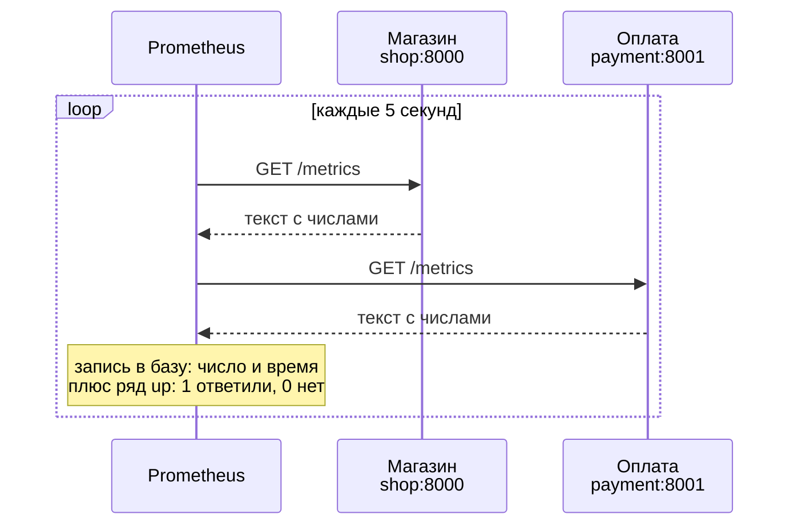
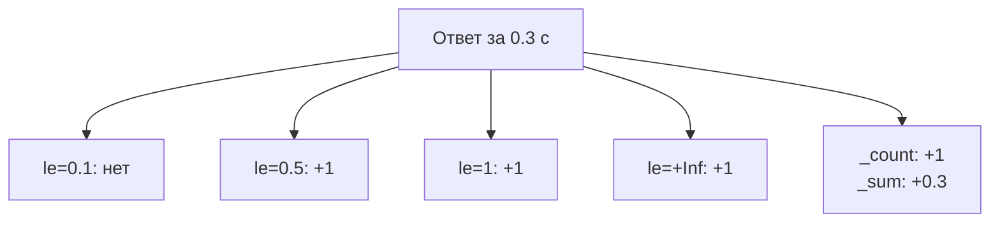

## Зачем это нужно

В первой теме ты увидел, что один запрос оставляет три следа: строку в логе, число в метриках и водопад в трейсе. Ты даже заглянул в `/metrics` и прочитал оттуда пару строк, но пока как гость: откуда эти числа берутся, куда они потом едут и как отличить хороший набор метрик от плохого, мы не разбирали. Сегодня разберём.

Начну с истории. Мой коллега как-то сказал на планёрке: «Я смотрю на график запросов, он растёт, значит, дела идут». На графике была не скорость запросов, а их общее количество с момента запуска. Оно растёт всегда, даже когда магазин лежит и принимает по одному запросу в час.

Он полгода смотрел на «растущую» линию и не понимал, почему она не реагирует на аварии. Дело было в том, что он не знал, какого вида число перед ним. С метриками так всегда: вид числа определяет, что с ним можно делать.

Prometheus это программа, которая каждые несколько секунд обходит все сервисы, забирает у них текущие числа и записывает их вместе со временем. Представь тетрадь наблюдений, куда лаборант регулярно вписывает показания приборов: потом по ней можно спросить «что было вчера в три часа ночи». Без такой тетради остаётся помнить по ощущениям.

Шаг проекта: ты заводишь в `~/monitoring-lab/02-metrics/` файл `metrics-catalog.md`: каталог метрик «Магазина», где у каждой записано имя, тип, метки и вопрос, на который она отвечает. Этот каталог пригодится в уроке 2.2, когда на метриках начнём писать запросы, и в теме 3, когда будем рисовать по ним графики.

## Что нужно знать

- Терминал, `curl`, `grep`: [load-tester, урок 1.4](../../load-tester/01-linux/04-network-cli.md) или [DevOps, урок 1.2](../../devops/01-linux/02-text-pipes.md). Для разбора JSON нужен `jq`: установка в [load-tester, уроке 1.1](../../load-tester/01-linux/01-workstation-terminal.md).
- Запуск проекта через `docker compose`: [load-tester, урок 5.3](../../load-tester/05-docker/03-compose-shop.md) или [DevOps, тема 4](../../devops/04-docker/index.md).
- [Урок 1.1](../01-basics/01-signals.md): три сигнала, RED и USE, краткое знакомство с метками. Метрика это число, которое меняется со временем.
- [Урок 1.2](../01-basics/02-sli-slo.md): SLI и SLO. Сегодня ты узнаешь, какие именно числа нужны, чтобы их посчитать.
- Репозиторий `~/monitoring-lab` из урока 1.1 и работающий стенд «Магазин» с профилем `monitoring`.

## Картина целиком

Представь учителя, который каждые пять секунд обходит класс с журналом. Ученики ничего не рассылают сами: у каждого на парте лежит листок с текущими цифрами («решено 12 задач, 3 с ошибкой»). Учитель подходит, списывает цифры в журнал вместе со временем и идёт дальше.

Если ученик не ответил, в журнале появляется отметка «нет на месте». Потом по журналу видно, как цифры менялись в течение урока.

Учитель это **Prometheus**. Листок на парте это страница `/metrics` (обычный адрес в сети, по которому программа отдаёт текст с текущими числами). Ученики это источники метрик (позже назовём их целями), а журнал это база временных рядов, то есть хранилище, которое устроено под записи вида «в такое-то время было такое-то число».



На схеме ходит только Prometheus: он спрашивает, сервисы отвечают. Такой способ, когда забирают сами, а не ждут, пока пришлют, называют по-английски pull («тянуть»). Ниже разберём, зачем это придумали, как выглядит ответ, какие бывают виды чисел и почему на метках можно разориться.

## Теория

### Pull-модель: Prometheus сам ходит за метриками

Есть два способа донести числа до мониторинга. Первый: сервис сам отправляет их на сервер, как курьер, который приносит отчёт в офис. По-английски это push («толкать»).

Второй: сервер сам приходит и забирает, как учитель с журналом. Это pull. Prometheus выбрал pull, и вот почему.

Допустим, сервис упал. При push отчёт просто не приходит, и непонятно: всё хорошо и нечего сообщать, или курьер сломал ногу. При pull ответ получается сам собой: учитель подошёл к парте, а ученик молчит, значит что-то не так.

Как это устроено по шагам. Раз в **интервал сбора** (на нашем стенде 5 секунд, в настройках он называется `scrape_interval`) Prometheus берёт список адресов из своего файла настроек. Как этот список выглядит, покажу ниже, в разделе про конфиг. К каждому адресу он делает обычный HTTP-запрос `GET /metrics`, ровно такой, какой делает `curl`. Один такой обход одного адреса называют скрейпом (по-английски scrape, «соскрести»): сходил, забрал числа.

В ответе приходит текст, Prometheus его разбирает и записывает каждое число в базу с текущим временем. А ещё он сам, не спрашивая приложение, записывает про цель метрику `up`: 1, если скрейп удался, и 0, если нет (таймаут, отказ соединения, ответ не 200, битый текст).

Три слова, которые путают чаще всего. **Цель** это один адрес, например `shop:8000`. **Задача** это название группы однотипных целей, например `shop` для всех копий магазина.

**Экземпляр** это конкретный адрес внутри задачи. В интерфейсе они называются по-английски `target`, `job` и `instance`. Prometheus добавляет `job` и `instance` к каждому числу как метки, чтобы потом было видно, откуда оно пришло.

Разберём на цифрах. В 12:00:00 Prometheus спросил `shop:8000/metrics` и получил ответ 200. В базу легли `up{job="shop",instance="shop:8000"} = 1` и все метрики магазина. В 12:00:05 магазин завис и не ответил за 5 секунд (это `scrape_timeout`, предел ожидания: на стенде он равен интервалу).

В базу ляжет только `up{...} = 0`. Больше от магазина не придёт ничего, и на графике `up` это видно сразу. Если же упал сам Prometheus, дырка будет в тетради, а не в магазине: пока он не работал, никто не записывал числа. Приложению не пришлось учиться «слать пульс»: молчание само стало сигналом.

<div class="viz" data-viz="obs-scrape" data-interval="5"></div>

На виджете видно главное отличие чисел разных видов: счётчик не теряет события между снимками, а датчик (gauge) теряет короткие всплески, если они случились между двумя обходами.

Доказательство «приходят за данными» лежит прямо в логе магазина.

<div class="viz" data-viz="mon-logs" data-title='Кто приходит на /metrics' data-query='{service="shop"} | json | route="/metrics"' data-lines='[{"ts":"2026-10-04 14:02:55.100","level":"info","labels":{"service":"shop","container":"shop-shop-1","level":"INFO"},"line":"{\"ts\": \"2026-10-04T14:02:55.100318+00:00\", \"level\": \"INFO\", \"msg\": \"Запрос завершён\", \"method\": \"GET\", \"route\": \"/metrics\", \"path\": \"/metrics\", \"status\": 200, \"duration_ms\": 9.21, \"request_id\": \"78f5afe929d9f1d8a731a962b3a78a0b\"}"},{"ts":"2026-10-04 14:02:50.101","level":"info","labels":{"service":"shop","container":"shop-shop-1","level":"INFO"},"line":"{\"ts\": \"2026-10-04T14:02:50.101318+00:00\", \"level\": \"INFO\", \"msg\": \"Запрос завершён\", \"method\": \"GET\", \"route\": \"/metrics\", \"path\": \"/metrics\", \"status\": 200, \"duration_ms\": 9.07, \"request_id\": \"9cc531b32423a01d8b66cefbe9f20fcc\"}"},{"ts":"2026-10-04 14:02:45.102","level":"info","labels":{"service":"shop","container":"shop-shop-1","level":"INFO"},"line":"{\"ts\": \"2026-10-04T14:02:45.102318+00:00\", \"level\": \"INFO\", \"msg\": \"Запрос завершён\", \"method\": \"GET\", \"route\": \"/metrics\", \"path\": \"/metrics\", \"status\": 200, \"duration_ms\": 9.77, \"request_id\": \"b370ea5ff129e8dd8ffc0caa535a95bd\"}"},{"ts":"2026-10-04 14:02:40.103","level":"info","labels":{"service":"shop","container":"shop-shop-1","level":"INFO"},"line":"{\"ts\": \"2026-10-04T14:02:40.103318+00:00\", \"level\": \"INFO\", \"msg\": \"Запрос завершён\", \"method\": \"GET\", \"route\": \"/metrics\", \"path\": \"/metrics\", \"status\": 200, \"duration_ms\": 8.8, \"request_id\": \"ab107f2823666220db04d024e10673ab\"}"},{"ts":"2026-10-04 14:02:35.104","level":"info","labels":{"service":"shop","container":"shop-shop-1","level":"INFO"},"line":"{\"ts\": \"2026-10-04T14:02:35.104318+00:00\", \"level\": \"INFO\", \"msg\": \"Запрос завершён\", \"method\": \"GET\", \"route\": \"/metrics\", \"path\": \"/metrics\", \"status\": 200, \"duration_ms\": 7.77, \"request_id\": \"f9000f9aa4a3acfe86264835d44feea7\"}"},{"ts":"2026-10-04 14:02:30.105","level":"info","labels":{"service":"shop","container":"shop-shop-1","level":"INFO"},"line":"{\"ts\": \"2026-10-04T14:02:30.105318+00:00\", \"level\": \"INFO\", \"msg\": \"Запрос завершён\", \"method\": \"GET\", \"route\": \"/metrics\", \"path\": \"/metrics\", \"status\": 200, \"duration_ms\": 7.52, \"request_id\": \"024a5b8790fec987195c0b236ca7c174\"}"}]' data-highlight='/metrics' data-explain='Лог самого магазина: каждые пять секунд к нему приходит запрос на /metrics. Магазин ничего не отправляет, его опрашивает Prometheus.' data-try='Посмотри на время соседних строк: интервал ровно пять секунд, как scrape_interval в настройках Prometheus.'></div>

Смотри на метки времени: интервал между строками одинаковый, и это не покупатели, а Prometheus. Каждый такой приход становится одной точкой на графике.

А вот результат самого простого запроса к Prometheus, `up`, во вкладке Table.

<div class="viz" data-viz="mon-table" data-title='Prometheus, вкладка Table' data-query='up' data-columns='["instance","job","Value"]' data-rows='[["shop:8000","shop","1"],["payment:8001","payment","1"],["node-exporter:9100","node","1"],["cadvisor:8080","cadvisor","1"],["postgres-exporter:9187","postgres","1"],["localhost:9090","prometheus","1"],["alertmanager:9093","alertmanager","1"],["alloy:12345","alloy","1"]]' data-explain='Результат запроса up: по строке на каждую цель. Единица значит, что последний сбор прошёл успешно.' data-try='Сначала посчитай строки (их 8, по числу job в конфиге), потом проверь, что везде 1.'></div>

Сначала посмотри, сколько строк: по одной на каждый источник из конфига. Единица в колонке `Value` значит «последний сбор удался».

> **Прикинь сам:** сервис перестал отвечать. Что в Prometheus покажет это быстрее всего и почему это не надо программировать в самом сервисе?
{: .predict}

Метрика `up` этой цели станет 0. Её создаёт сам Prometheus по итогам каждого скрейпа, а зависшее приложение просто не ответит на запрос, и это тоже даст `up = 0`.

Осторожно: `up = 1` не значит «магазин здоров». Он значит только «`/metrics` ответил и текст разобрался». Магазин может прекрасно отдавать метрики и при этом возвращать покупателям ошибки. Здоровье для покупателя меряют RED из [урока 1.1](../01-basics/01-signals.md): запросами, ошибками и временем.

> **Главное:** Prometheus сам приходит за числами раз в интервал сбора, а тишина цели превращается в `up = 0` без единой строки кода в приложении.
{: .key}

Мы сказали «текст с числами». Теперь посмотрим, как он устроен.

### Формат /metrics: имя, метки, значение

Prometheus и приложение должны договориться, как записывать числа. Договорились о простом тексте, который читает и человек: его открывают через `curl` и видят глазами. Это главный инструмент отладки: когда с метриками что-то не так, первым делом смотрят, что реально отдаёт `/metrics`.

Ответ состоит из строк трёх видов. Вот фрагмент из «Магазина» (числа у тебя будут другими):

```text
# HELP http_requests_total Multiprocess metric
# TYPE http_requests_total counter
http_requests_total{method="GET",route="/api/products",status="200"} 412.0
http_requests_total{method="POST",route="/api/orders",status="502"} 3.0
```

Строки с решёткой отвечают на вопросы «что это» (`HELP`, описание для людей) и «какого вида» (`TYPE`). Дальше идут сами числа: **имя** (`http_requests_total`), **метки** в фигурных скобках (пары `имя="значение"` через запятую) и **значение**. Магазин считает метрики в нескольких процессах и склеивает их библиотекой, поэтому вместо описания у него стоит служебное «Multiprocess metric»: это особенность склейки, а не ошибка.

Одно имя с разными наборами меток это разные **временные ряды** (series). Ряд это последовательность пар «момент времени, число» для одного имени и одного набора меток. Строки `{method="GET",route="/api/products",status="200"}` и `{method="POST",route="/api/orders",status="502"}` относятся к разным рядам: их считают и хранят по отдельности.

Аналогия с тетрадью: метрика это название прибора («термометр»), а ряд это страница этого прибора для одной комнаты. Одна строка на странице («в 12:00 было 21 градус») называется **сэмплом**. По-английски sample, «проба»: слово встретится в служебных метриках ниже.

Ряды растут во времени. Раз в 5 секунд Prometheus добавляет в каждый ряд по одной новой строке, то есть сэмплу. Метрика с двумя рядами за минуту наберёт 2 × 12 = 24 сэмпла. Если Prometheus не работал час, на графике будет дыра, хотя магазин всё это время исправно считал: в `/metrics` лежит только **текущее** состояние, а историю строит Prometheus, регулярно записывая эти текущие числа.

> **Проверь понимание:** в `/metrics` три строки: `x_total{status="200"} 10`, `x_total{status="500"} 2` и `y_seconds 0.4`. Сколько здесь метрик, рядов и сэмплов за один скрейп?

<details markdown="1">
<summary>Ответ</summary>

Метрик две (`x_total` и `y_seconds`), рядов три (у `x_total` два набора меток), сэмплов за один скрейп три: по одному новому на каждый ряд.

</details>

> **Главное:** строка `/metrics` это имя, метки и значение; ряд это имя с набором меток; сэмпл это одна точка ряда во времени.
{: .key}

Число в строке может вести себя по-разному: только расти или ходить вверх и вниз. Это и есть вид метрики.

### Counter и gauge: растёт только вперёд или ходит вверх и вниз

Вернусь к рассказу про коллегу. Он смотрел на число «запросов всего» и ждал, что оно упадёт при аварии. Оно упасть не могло по своей природе, и если бы он знал о двух видах чисел, понял бы это за минуту. В машине есть два прибора.

Одометр показывает пройденный путь и только растёт. Спидометр показывает скорость сейчас и ходит вверх и вниз. У Prometheus те же два вида.

**Счётчик** это одометр: число только растёт, а при перезапуске процесса сбрасывается в ноль. Так считают «сколько всего случилось»: запросов, заказов, ошибок. В Prometheus его называют по-английски counter, это слово стоит в строке `# TYPE`. **Датчик** это спидометр, по-английски gauge: значение идёт вверх и вниз, важно то, что есть прямо сейчас. Так меряют «сколько сейчас»: запросов в работе, соединений в пуле, памяти.

Правило выбора простое. Если число при нормальной работе может уменьшиться, это gauge. Если оно только накапливается, это counter. Посмотрим на стенд.

`http_requests_total` это counter: запросов стало больше и меньше не станет. `http_requests_in_progress` это gauge: запросов в работе сейчас, их то три, то ноль. `shop_db_pool_waiting` тоже gauge: сколько запросов прямо сейчас ждут соединения с базой. `shop_orders_created_total` counter: заказов всего.

Вот два датчика магазина на графике, во время сбоя оплаты.

<div class="viz" data-viz="mon-panel" data-title='Датчики: запросы в работе и ожидающие пула' data-query='http_requests_in_progress и shop_db_pool_waiting' data-x='["14:00","14:01","14:02","14:03","14:04","14:05","14:06","14:07","14:08","14:09","14:10","14:11","14:12","14:13","14:14","14:15"]' data-series='[{"name":"http_requests_in_progress","values":[2,3,2,3,8,6,7,7,8,6,3,3,3,3,2,3],"color":"blue"},{"name":"shop_db_pool_waiting","values":[0,0,0,0,2,2,2,2,1,3,0,0,0,0,0,0],"color":"red"}]' data-unit='' data-annotations='[{"at":"14:04","text":"оплата: delay 300 мс, fail_rate 0.6"},{"at":"14:10","text":"оплата возвращена"}]' data-explain='Это gauge: значение растёт и падает. Синяя линия это запросы, которые идут прямо сейчас, красная это ожидающие соединения с базой.' data-try='Сравни линии до 14:04 и после: gauge возвращается в норму сам, это разница с счётчиком, который только растёт.'></div>

Смотри на то, как значения поднимаются и опускаются: gauge показывает «сейчас», а не «всего». Красная линия на нуле значит, что очереди за соединением нет.

Теперь главное про counter. Само число почти бесполезно: «запросов всего 1 000 000» непонятно, за день это или за год. Интересна **скорость роста**: «сейчас 12 запросов в секунду».

Если в 12:00:00 счётчик показывал 1000, а в 12:01:00 стал 1720, скорость это (1720 − 1000) / 60 = 12 запросов в секунду. Эту разницу за время Prometheus считает функцией `rate()`, её разберём в уроке 2.2. А пока запомни, что она умеет обращаться и со сбросом: если счётчик упал с 1720 до 15 после перезапуска магазина, `rate` поймёт, что процесс стартовал заново, и не запишет «минус 1705 запросов».

Поэтому график «запросов всего» на аварию не реагирует: он показывает накопленное, а не происходящее сейчас. Коллега смотрел на правильное число не тем способом.

Вот как это выглядит на одном и том же счётчике, сначала сырым.

<div class="viz" data-viz="mon-panel" data-title='Счётчик: http_requests_total' data-query='sum(http_requests_total)' data-x='["14:00","14:01","14:02","14:03","14:04","14:05","14:06","14:07","14:08","14:09","14:10","14:11","14:12","14:13","14:14","14:15"]' data-series='[{"name":"всего запросов","values":[1743,2434,3131,3812,4504,5214,5932,6625,793,1535,2221,2910,3632,4386,5141,5867],"color":"blue"}]' data-unit='' data-annotations='[{"at":"14:08","text":"перезапуск shop: счётчик обнулился"},{"at":"14:04","text":"оплата: delay 300 мс, fail_rate 0.6"}]' data-explain='Счётчик только растёт. Единственное место, где линия падает, это перезапуск контейнера: счёт начался заново с нуля.' data-try='Найди точку 14:08: падение не значит, что запросов стало меньше, это просто сброс.'></div>

Смотри на то, как линия идёт вверх лесенкой и один раз обрывается: это перезапуск, а не пропавшие запросы. Теперь тот же счётчик, пропущенный через `rate()`.

<div class="viz" data-viz="mon-panel" data-title='Скорость: rate(http_requests_total[1m])' data-query='sum(rate(http_requests_total[1m]))' data-x='["14:00","14:01","14:02","14:03","14:04","14:05","14:06","14:07","14:08","14:09","14:10","14:11","14:12","14:13","14:14","14:15"]' data-series='[{"name":"запросов в секунду","values":[12.4,11.5,11.6,11.3,11.5,11.8,12.0,11.6,11.9,12.4,11.4,11.5,12.0,12.6,12.6,12.1],"color":"green"}]' data-unit='req/s' data-explain='Тот же счётчик, но через rate(): видна скорость, а не накопленное. Сброс счётчика rate() учитывает, поэтому провала нет.' data-try='Сравни с графиком выше: на месте падения здесь ровная линия около 12 запросов в секунду.'></div>

Здесь нет ни роста, ни обрыва: `rate()` сам вычитает сброс и показывает скорость. Именно такой график годится для алертов.

> **Прикинь сам:** метрика `shop_orders_created_total` была 340, а через минуту стала 5. Что произошло: заказы отменили или что-то другое?
{: .predict}

Скорее всего, магазин перезапустили: счётчик живёт в памяти процесса и обнуляется на старте. Отменённые заказы не могут уменьшить counter, он по определению только растёт.

Осторожно: путают counter и gauge. Типичная ошибка новичка: завести gauge «число ошибок» и уменьшать его, когда ошибка исправлена. Тогда пропадает история, потому что ошибки случились, и этого не изменить. Накопленное считай counter, а текущее состояние gauge.

> **Главное:** counter только растёт и сбрасывается при перезапуске, по нему считают скорость; gauge ходит вверх и вниз, по нему смотрят текущее значение.
{: .key}

Для времени ответа ни counter, ни gauge не подходят: нужно не одно число, а целое распределение.

### Histogram: время ответа корзинами

Среднее время ответа почти ничего не говорит, и [урок 1.2](../01-basics/02-sli-slo.md) показал почему: девять быстрых запросов и один на десять секунд дадут среднее около секунды, а страдает один покупатель из десяти. Нужно знать, сколько запросов уложились в какое время. Для этого придумали **гистограмму** (histogram): набор счётчиков по диапазонам, как таблица «сколько поездок заняли до 10 минут, до 30, до часа».

Устроена она так. Ты заранее выбираешь границы корзин (по-английски buckets): у магазина их 12, от 5 миллисекунд до 10 секунд, и среди них есть корзина 0.3 секунды, о ней ниже. Каждый ответ «кладётся» во все корзины, которым он подходит по времени.

Гистограмма даёт три вида рядов. `имя_bucket{le="0.5"}` считает, сколько ответов оказались **не больше** 0.5 секунды (`le` значит «less or equal», меньше или равно). `имя_count` считает, сколько всего было ответов.

`имя_sum` хранит сумму всех времён. Корзины накопительные (в документации их зовут кумулятивными): в `le="0.5"` входит всё, что уже попало в `le="0.1"`. Последняя корзина `le="+Inf"` (бесконечность) вмещает вообще всё и потому равна `_count`.

Разберём на четырёх запросах. Допустим, магазин ответил за 0.05, 0.3, 0.3 и 2.0 секунды, а корзин у нас три: 0.1, 0.5 и 1.

| Время ответа | `le="0.1"` | `le="0.5"` | `le="1"` | `le="+Inf"` |
|---|---|---|---|---|
| 0.05 | да | да | да | да |
| 0.3 | нет | да | да | да |
| 0.3 | нет | да | да | да |
| 2.0 | нет | нет | нет | да |
| **Итого** | 1 | 3 | 3 | 4 |

`_count` равен 4, `_sum` равен 0.05 + 0.3 + 0.3 + 2.0 = 2.65. Среднее это `_sum / _count` = 2.65 / 4 = 0.6625 секунды. Теперь видно то, чего среднее не покажет: три запроса из четырёх уложились в полсекунды, и один оказался медленнее секунды.



Один ответ увеличивает сразу несколько счётчиков: все корзины, в которые он «помещается», а также общий счёт и сумму. Поэтому из гистограммы потом можно оценить любой процентиль, о чём пойдёт речь в 2.2.

Вот как выглядят корзины одной гистограммы.

<div class="viz" data-viz="mon-table" data-title='Prometheus, вкладка Table' data-query='http_request_duration_seconds_bucket{route="/api/products"}' data-columns='["route","le","Value"]' data-rows='[["/api/products","0.005","0"],["/api/products","0.01","2"],["/api/products","0.025","9"],["/api/products","0.05","10"],["/api/products","0.1","10"],["/api/products","0.25","10"],["/api/products","0.5","10"],["/api/products","1","10"],["/api/products","5","10"],["/api/products","+Inf","10"]]' data-highlight-col='Value' data-explain='Корзины гистограммы для 10 запросов каталога. Каждая корзина считает запросы не дольше своего le, поэтому числа только растут вниз по таблице.' data-try='Найди первую корзину, где набралось все 10: так видно, что все запросы уложились в 25 мс.'></div>

Смотри на колонку `le` сверху вниз: значение растёт, пока не доходит до 10, и дальше стоит. Последняя корзина `+Inf` всегда равна общему числу запросов.

> **Прикинь сам:** в гистограмме `_bucket{le="0.5"} 30`, `_bucket{le="1"} 30`, `_count 34`. Что можно сказать о четырёх запросах?
{: .predict}

Тридцать запросов уложились в полсекунды, а четыре оказались медленнее секунды (34 минус 30, они попали только в `+Inf`). Между 0.5 и 1 секундой запросов не было, потому что `le="1"` не больше `le="0.5"`.

Осторожно: корзины выбирают заранее и под свои задержки. Если первая корзина 100 мс, а все ответы по 20 мс, то любой процентиль окажется «где-то внутри первой корзины», и оценка будет грубой. Поэтому у магазина столько мелких корзин, и поэтому есть корзина 0.3: под порог 300 мс из SLO каталога урока 1.2.

Есть ещё четвёртый вид, summary (сводка): процентили в нём считает само приложение, и складывать их между копиями сервиса нельзя. Поэтому в новом коде почти всегда берут histogram.

> **Главное:** гистограмма хранит корзины «не больше такого-то времени» плюс счёт и сумму; из неё считают процентили и долю быстрых запросов.
{: .key}

Каждая корзина это отдельный ряд, и чем больше меток и корзин, тем больше рядов. Об этом следующий раздел.

### Метки и кардинальность: сколько рядов получится

В [уроке 1.1](../01-basics/01-signals.md) ты уже слышал про метки: пары «имя=значение», которые режут одно число на группы. Добавлю, чем это грозит. Склад: «500 коробок» скучно, «200 красных и 300 синих» уже полезнее, «красных маленьких 50, красных больших 150…» ещё подробнее, но и строк в таблице больше. Каждая новая колонка умножает число строк.

Каждая уникальная комбинация значений всех меток это отдельный ряд, и Prometheus хранит его в памяти. Сколько получилось рядов, называют кардинальностью (по-английски cardinality). Зачем это тебе: каждый график и каждый запрос перебирают ряды, поэтому чем их больше, тем медленнее открывается дашборд и тем больше памяти нужно Prometheus.

Прикинем для магазина. У `http_requests_total` три метки: `method` (GET и POST, но не все комбинации реальны), `route` (около 12 шаблонов маршрутов и `other`) и `status` (200, 201, 400, 404, 409, 502 и так далее). Реально встречается несколько десятков комбинаций, этого хватает с запасом.

А вот гистограмма `http_request_duration_seconds` с метками `method` и `route` даёт для каждой пары 12 корзин, `+Inf`, `_sum` и `_count`: 15 рядов. Десять пар «метод плюс маршрут» это 150 рядов. Гистограмма самая дорогая метрика магазина.

<div class="viz" data-viz="chart" data-type="bar" data-title="Сколько рядов занимает метрика (оценка для стенда)" data-x="duration,requests,db_wait,pay_dur,pool" data-series='[{"name":"рядов","values":[150,35,15,15,3]}]' data-x-label="метрика (сокращённо)" data-y-label="рядов" data-explain="duration это http_request_duration_seconds: 10 пар метод и маршрут по 15 рядов. requests это http_requests_total: несколько десятков комбинаций. db_wait и pay_dur это гистограммы без меток: по 15 рядов. pool это три gauge пула соединений."></div>

Гистограмма с метками съедает основную часть памяти, а число рядов растёт умножением: добавил метку с десятью значениями, и рядов стало в десять раз больше.

Теперь опасный случай. Положим в метку что-то неограниченное: номер пользователя, номер заказа, сырой адрес `/api/products/17`. Рядов станет столько, сколько значений встретится, и дальше Prometheus не потянет: он держит свежие ряды в оперативной памяти и при взрыве числа рядов падает по OOM (нехватка памяти: система убивает процесс). Это называют **взрывом кардинальности**.

Магазин от этого защищён, причём сразу в двух местах. Первое: в метку `route` попадает не сырой путь, а **шаблон** маршрута из кода (`/api/products/{id}`), поэтому все 10 000 карточек товаров дают одну серию. Второе: путь, которого в коде нет, превращается в `other`. Если кто-то просканирует сайт тысячей случайных адресов, рядов не прибавится.

> **Прикинь сам:** разработчик хочет добавить в `http_requests_total` метку `user_id`, чтобы видеть самых активных покупателей. У нас 1000 пользователей, из них заказывают 200. Что ответишь?
{: .predict}

Нельзя. Каждый покупатель умножит число рядов: если сейчас их 35, при 200 активных пользователях станет до 7000, а при росте магазина до 100 000 пользователей получится взрыв. Самых активных покупателей ищут в логах (там `user_id` уже есть), а метрика остаётся с небольшим конечным набором меток.

Вот что произошло бы, если бы мы всё-таки добавили эту метку. Это воображаемый сценарий, на стенде так не сделано.

<div class="viz" data-viz="mon-panel" data-title='Что было бы: метка user_id' data-query='scrape_samples_scraped{job="shop"}' data-x='["10","50","100","150","200"]' data-series='[{"name":"ряды без user_id","values":[192,192,192,192,192],"color":"green"},{"name":"ряды с user_id (гипотеза)","values":[960,3500,5200,6300,7000],"color":"red"}]' data-unit='' data-annotations='[{"at":"100","text":"число активных покупателей: 100"}]' data-explain='Подпись по горизонтали: сколько покупателей онлайн. Зелёная линия это как есть сейчас, красная показывает, что было бы, если бы мы добавили метку user_id. Так на стенде не бывает: график иллюстративный.' data-try='Сравни высоту красной и зелёной линий на 200 покупателях: рядов стало в десятки раз больше.'></div>

Смотри на то, как красная линия уходит вверх вместе с покупателями, а зелёная остаётся на месте. Число рядов определяет память и скорость Prometheus, и поэтому метки с уникальными значениями запрещены.

Осторожно: метки метрик должны быть скучными. Для логов и трейсов подробности полезны, для метрик вредны. Хорошая метка принимает десяток значений и не растёт со временем: метод, шаблон маршрута, код ответа, результат оплаты (`ok`, `error`, `timeout`).

> **Проверь понимание:** метрика с метками `method` (3 значения) и `status` (4 значения), все комбинации встречались. Сколько рядов и сколько сэмплов добавится за один скрейп?

<details markdown="1">
<summary>Ответ</summary>

3 × 4 = 12 рядов. В каждый добавляется по одному сэмплу, значит 12 сэмплов за скрейп.

</details>

> **Главное:** у метки должно быть небольшое конечное число значений; номер пользователя, заказа и сырой адрес в метки не кладут.
{: .key}

Как называть метрики и метки, чтобы через полгода в них не запутаться?

### Имена и единицы: договорённости Prometheus

Через полгода метрик будут сотни, и по имени должно быть понятно, что это и в чём измерено. В Prometheus есть договорённости, которые помогают не путаться и не ошибиться на порядок.

Имя начинается с префикса проекта или области: `shop_db_pool_size`, `payment_requests_total`. Счётчик заканчивается на `_total`: `http_requests_total`. Единицу измерения пишут в имени и берут базовую: секунды, а не миллисекунды, байты, а не мегабайты: `http_request_duration_seconds`. Имя описывает, что измеряют, а не как это потом посчитают: «доля ошибок» не метрика, её считают запросом из двух счётчиков.

Проверь на примере. Метрика `request_time_ms` нарушает два правила: нет префикса и единица не базовая. Правильно: `shop_http_request_duration_seconds`.

Когда в Grafana увидишь значение 0.25, не придётся гадать, секунды это или миллисекунды. Смешанные единицы дают ошибку на порядок, которую трудно заметить.

Заметь, что у самого магазина префикса `shop_` нет у `http_requests_total`: так принято для метрик HTTP, их делает типовая библиотека, и имена одинаковы у любого сервиса. Свои, бизнесовые метрики магазина с префиксом `shop_`: заказы, пул, оплата.

> **Проверь понимание:** как назвать счётчик числа отправленных писем?

<details markdown="1">
<summary>Ответ</summary>

`shop_emails_sent_total`: префикс проекта, что считаем и суффикс `_total`, потому что это counter.

</details>

> **Главное:** имя содержит префикс, смысл, базовую единицу и `_total` у счётчиков.
{: .key}

Имена мы выбрали, числа отдаём, остаётся понять, где Prometheus всё это хранит.

### Хранение: TSDB, срок хранения и том

Числа надо где-то держать и быстро находить по имени, меткам и времени. Обычная таблица для этого плохо подходит, поэтому у Prometheus своя база временных рядов (по-английски TSDB, time series database). Представь дневник погоды: запись по дням, старые страницы через какое-то время выбрасывают, искать удобно по дате.

Prometheus пишет данные в каталог, который задаёт флаг `--storage.tsdb.path`. Данные лежат на диске, а блоки старше срока хранения удаляются: по умолчанию 15 дней, меняется флагом `--storage.tsdb.retention.time` (по-английски retention). Каталог выносят в том Docker, иначе при пересоздании контейнера пропадёт вся история. Так у нашего стенда: том `prometheus` примонтирован в `/prometheus`.

Сколько это весит? Один ряд при интервале 5 секунд получает 86 400 / 5 = 17 280 значений в сутки. Если рядов 2000, то за сутки записей около 35 миллионов.

Prometheus сжимает их до 1 или 2 байт на значение, так что сутки занимают порядка 50 МБ. Для стенда пустяк, для боевой системы с миллионом рядов уже нет, и интервал сбора там делают не 5 секунд, а 15 или 30.

Вот как это выглядит на стенде, в самом Prometheus.

<div class="viz" data-viz="mon-stat" data-title='Prometheus: TSDB на стенде' data-stats='[{"title":"Активных рядов","value":2140,"color":"green","sub":"prometheus_tsdb_head_series"},{"title":"Сэмплов в секунду","value":430,"unit":"samples/s","color":"green","sub":"8 целей, шаг 5 с"},{"title":"Размер на диске","value":42,"unit":"MB","color":"blue","sub":"prometheus_tsdb_storage_blocks_bytes"},{"title":"Срок хранения","value":15,"unit":"d","color":"purple","sub":"retention по умолчанию"}]' data-explain='Четыре числа о самом Prometheus: сколько рядов в памяти, сколько точек в секунду он принимает, сколько места занимает и как долго хранит.'></div>

Начни с первой карточки: рядов около двух тысяч, это то, что держится в памяти. Остальные числа из неё и вытекают: больше рядов, больше точек в секунду, больше диск.

Что будет, если Prometheus упадёт или его пересоздадут? Пока диск цел, история на месте, а за время простоя в ней просто дырка. Но это не долговременное хранилище и не кластер: данные лежат на одном узле, и если он потерял диск, история потеряна. Для хранения годами и для нескольких кластеров есть надстройки (Thanos, Mimir, VictoriaMetrics), но до них нужно дорасти.

> **Главное:** Prometheus хранит ряды в своей базе на диске, держит ограниченный срок (по умолчанию 15 дней) и требует тома, чтобы переживать пересоздание контейнера.
{: .key}

Чтобы Prometheus вообще что-то хранил, ему нужно знать, куда ходить. Это решает конфиг.

### Конфиг prometheus.yml: список целей

Список целей и интервалы Prometheus берёт из одного файла. Вот главное из конфига стенда (`load-tester/project/shop/monitoring/prometheus/prometheus.yml`):

```yaml
global:
  scrape_interval: 5s       # как часто ходить за метриками
  evaluation_interval: 5s   # как часто проверять правила (урок 2.2 и тема 3)
scrape_configs:             # список задач сбора
  - job_name: shop          # имя задачи: станет меткой job="shop"
    static_configs:         # статический список целей
      - targets: ["shop:8000"]
  - job_name: payment
    static_configs:
      - targets: ["payment:8001"]
  # ... ещё node, cadvisor, postgres, prometheus, alertmanager, alloy
```

Это YAML: отступы пробелами значат вложенность, а `#` начинает комментарий. Адрес цели `shop:8000` использует **имя сервиса в сети Compose**: Docker сам превращает имя в адрес контейнера. `localhost:8000` не подошёл бы: для Prometheus `localhost` это он сам, а не соседний контейнер.

Интервал 5 секунд выбран для учебных графиков, на проде чаще 15 или 30 секунд. У чрезмерно частых скрейпов цена: больше записей, больше места, больше нагрузки на цель.

Рядом лежит `scrape_timeout`: сколько Prometheus ждёт ответа. По умолчанию он 10 секунд, но не больше интервала: на стенде интервал 5 секунд, и таймаут сам становится 5 секундами. Явно заданный таймаут больше интервала Prometheus отвергает: иначе следующий опрос начался бы, пока предыдущий ещё ждёт ответа.

Ещё одна деталь для практики: Prometheus читает конфиг при старте и по сигналу перезагрузки. На нашем стенде перезагрузка по сети не включена (нет флага `--web.enable-lifecycle`), а сам файл смонтирован только для чтения, поэтому свой конфиг ты будешь проверять на отдельном Prometheus. Об этом в уроке 2.3.

> **Проверь понимание:** почему в `targets` нельзя написать `localhost:8000` для магазина, который работает в соседнем контейнере?

<details markdown="1">
<summary>Ответ</summary>

Внутри контейнера Prometheus `localhost` указывает на сам этот контейнер, а порт 8000 в нём никто не слушает. Соседний контейнер доступен по имени сервиса в общей сети: `shop:8000`.

</details>

> **Главное:** `prometheus.yml` задаёт интервал сбора и список целей; адреса внутри сети Compose это имена сервисов.
{: .key}

Цели прописаны. Как узнать, что Prometheus их действительно видит?

### Страница Targets и служебные метрики

Первый вопрос при любой проблеме с метриками: «Prometheus вообще видит эту цель?». Ответ даёт страница `/targets` его веб-интерфейса. Это табло вылетов в аэропорту: у каждого рейса статус и причина, если что-то не так.

Открыл `/targets`, а цель красная? Смотри на два главных поля. **Состояние** (health): `up`, если последний скрейп удался, и `down`, если нет.

**Последняя ошибка** (`lastError`): текст, который Prometheus получил при неудаче. Состояние говорит, что плохо, а текст ошибки почти всегда подсказывает, где искать.

Вот как это выглядит на странице Targets, когда стенд работает как задумано.

<div class="viz" data-viz="mon-targets" data-title='Status → Targets: всё в порядке' data-targets='[{"job":"shop","endpoint":"http://shop:8000/metrics","state":"up","labels":{"instance":"shop:8000","job":"shop"},"last":"3.2s","duration":"9 ms"},{"job":"payment","endpoint":"http://payment:8001/metrics","state":"up","labels":{"instance":"payment:8001","job":"payment"},"last":"1.8s","duration":"4 ms"},{"job":"node","endpoint":"http://node-exporter:9100/metrics","state":"up","labels":{"instance":"node-exporter:9100","job":"node"},"last":"4.1s","duration":"95 ms"},{"job":"cadvisor","endpoint":"http://cadvisor:8080/metrics","state":"up","labels":{"instance":"cadvisor:8080","job":"cadvisor"},"last":"2.4s","duration":"61 ms"},{"job":"postgres","endpoint":"http://postgres-exporter:9187/metrics","state":"up","labels":{"instance":"postgres-exporter:9187","job":"postgres"},"last":"0.9s","duration":"22 ms"},{"job":"prometheus","endpoint":"http://localhost:9090/metrics","state":"up","labels":{"instance":"localhost:9090","job":"prometheus"},"last":"3.7s","duration":"6 ms"},{"job":"alertmanager","endpoint":"http://alertmanager:9093/metrics","state":"up","labels":{"instance":"alertmanager:9093","job":"alertmanager"},"last":"4.5s","duration":"3 ms"},{"job":"alloy","endpoint":"http://alloy:12345/metrics","state":"up","labels":{"instance":"alloy:12345","job":"alloy"},"last":"1.1s","duration":"11 ms"}]' data-explain='Все восемь целей зелёные (UP), последний сбор был несколько секунд назад. Колонка Duration показывает, сколько ответ строился.' data-try='Начни с состояния, потом посмотри на Last scrape: она должна быть меньше scrape_interval, то есть 5 секунд.'></div>

Здесь важны две колонки: состояние `UP` и время с последнего сбора. Восемь зелёных строк значат, что собираются все источники.

Четыре самых частых текста ошибки:

| Что в `lastError` | Что значит | Что проверить |
|---|---|---|
| `connection refused` | по адресу есть машина, но порт никто не слушает | запущено ли приложение, верный ли порт |
| `no such host` | имя не превратилось в адрес | есть ли контейнер в той же сети, нет ли опечатки |
| `context deadline exceeded` | цель не уложилась в `scrape_timeout` | не завис ли процесс, не тяжела ли страница |
| `server returned HTTP status 404` | сервер ответил, но такого пути нет | верен ли `metrics_path`, есть ли `/metrics` |

Разберём строку: «`shop` down, `Get "http://shop:8001/metrics": dial tcp 172.18.0.5:8001: connect: connection refused`». Читаем слева направо. `Get` и адрес: Prometheus сделал обычный запрос. Порт 8001, хотя магазин слушает 8000.

`172.18.0.5` это адрес контейнера: имя `shop` нашлось, значит, проблема не в имени. `connection refused`: на этом адресе порт закрыт. Вывод: опечатка в порту.

Вот как выглядит такая поломка на странице Targets.

<div class="viz" data-viz="mon-targets" data-title='Status → Targets: неверный порт у shop' data-targets='[{"job":"shop","endpoint":"http://shop:8001/metrics","state":"down","labels":{"instance":"shop:8001","job":"shop"},"last":"2.9s","duration":"3 ms","error":"Get \"http://shop:8001/metrics\": dial tcp 172.18.0.5:8001: connect: connection refused"},{"job":"payment","endpoint":"http://payment:8001/metrics","state":"up","labels":{"instance":"payment:8001","job":"payment"},"last":"1.8s","duration":"4 ms"},{"job":"node","endpoint":"http://node-exporter:9100/metrics","state":"up","labels":{"instance":"node-exporter:9100","job":"node"},"last":"4.1s","duration":"95 ms"},{"job":"cadvisor","endpoint":"http://cadvisor:8080/metrics","state":"up","labels":{"instance":"cadvisor:8080","job":"cadvisor"},"last":"2.4s","duration":"61 ms"},{"job":"postgres","endpoint":"http://postgres-exporter:9187/metrics","state":"up","labels":{"instance":"postgres-exporter:9187","job":"postgres"},"last":"0.9s","duration":"22 ms"},{"job":"prometheus","endpoint":"http://localhost:9090/metrics","state":"up","labels":{"instance":"localhost:9090","job":"prometheus"},"last":"3.7s","duration":"6 ms"},{"job":"alertmanager","endpoint":"http://alertmanager:9093/metrics","state":"up","labels":{"instance":"alertmanager:9093","job":"alertmanager"},"last":"4.5s","duration":"3 ms"},{"job":"alloy","endpoint":"http://alloy:12345/metrics","state":"up","labels":{"instance":"alloy:12345","job":"alloy"},"last":"1.1s","duration":"11 ms"}]' data-explain='Для shop указан порт 8001 вместо 8000. Состояние DOWN, а в поле error текст причины: имя нашлось, но по этому порту никто не слушает.' data-try='Сначала прочитай поле error: connection refused говорит больше, чем красный DOWN.'></div>

Смотри на красную строку и текст ошибки под ней. Остальные семь целей зелёные, значит, проблема не в Prometheus, а в одной цели.

Кроме метрик приложения, Prometheus сам добавляет к каждой цели несколько служебных рядов:

| Метрика | Что означает |
|---|---|
| `up` | 1 если скрейп удался, 0 если нет |
| `scrape_duration_seconds` | сколько секунд занял скрейп |
| `scrape_samples_scraped` | сколько сэмплов вернула цель за один скрейп |
| `scrape_samples_post_metric_relabeling` | сколько осталось после фильтрации |

`scrape_samples_scraped` самое быстрое средство заметить взрыв кардинальности: если вчера у магазина было около 250 сэмплов за скрейп, а сегодня 20 000, значит, кто-то добавил метку с неограниченными значениями. Ловить это надо до того, как Prometheus упадёт.

Осторожно: `down` не значит «приложение упало». Оно может обслуживать покупателей, а `/metrics` недоступен: закрыт файрволом, нет пути, не тот порт. Сначала читай `lastError`, потом решай, куда идти.

Ещё одна тонкость: когда скрейп не удался, Prometheus помечает ряды этой цели устаревшими, и запросы перестают их возвращать. Поэтому правило «ошибок больше порога» молчит, если метрики пропали совсем: сравнивать нечего. Рядом с алертами по значению всегда нужен алерт на `up == 0`, у стенда он называется `ExporterDown`.

<details markdown="1">
<summary>Для любопытных: как долго живёт ряд, если цель молчит</summary>

Когда скрейп завершился ошибкой, Prometheus записывает в ряды цели специальную отметку «устарел» (staleness marker). Если же сам Prometheus не работал, отметки нет, и запросы продолжают видеть последнее значение ряда до 5 минут (параметр `lookback delta`). Поэтому после перезапуска Prometheus полезно подождать минуту, прежде чем доверять графикам.

</details>

> **Главное:** страница `/targets` показывает состояние и текст ошибки каждой цели, а `up` и `scrape_*` Prometheus пишет сам.
{: .key}

Теория закончилась. Сейчас всё это ты увидишь на живом стенде.

## Практика

Все файлы урока складывай в `~/monitoring-lab/02-metrics/`. Стенд из урока 1.1 должен работать: если ты его останавливал, подними заново.

### 1. Проверь стенд и заведи папку

```bash
cd ~/learning/load-tester/project/shop
docker compose --profile monitoring up -d --wait --wait-timeout 300
curl -s localhost:8000/readyz
mkdir -p ~/monitoring-lab/02-metrics
```

`up -d --wait` запустит остановленные контейнеры (уже запущенные не тронет) и дождётся, пока пройдут проверки здоровья. `mkdir -p` создаёт папку урока и не ругается, если она уже есть.

**Что должно получиться:**

```text
{"status":"ready"}
```

**Типичные ошибки:**

- `no configuration file provided: not found`: ты не в каталоге стенда, перейди в `~/learning/load-tester/project/shop`.
- `curl: (7) Failed to connect to localhost port 8000`: стенд ещё поднимается, подожди минуту и повтори.

### 2. Прочитай /metrics магазина

Создадим немного движения, чтобы счётчики не были нулевыми, и посмотрим строки каталога:

```bash
for i in 1 2 3 4 5 6 7 8 9 10; do curl -s -o /dev/null localhost:8000/api/products; done
curl -s localhost:8000/metrics | grep -E '^(# TYPE|http_requests_total)' | head -n 20
```

Цикл `for` десять раз запрашивает каталог, `-o /dev/null` выбрасывает ответ. Дальше `grep -E` оставляет строки `# TYPE` (какой вид у каждой метрики) и счётчик запросов, а `head -n 20` обрезает вывод.

**Что должно получиться** (имена те же, числа и набор строк у тебя будут другими):

```text
# TYPE http_requests_total counter
http_requests_total{method="GET",route="/api/products",status="200"} 10.0
# TYPE http_request_duration_seconds histogram
# TYPE http_requests_in_progress gauge
# TYPE shop_db_pool_size gauge
# TYPE shop_db_pool_available gauge
# TYPE shop_db_pool_waiting gauge
# TYPE shop_db_connection_wait_seconds histogram
# TYPE shop_payment_requests_total counter
# TYPE shop_payment_duration_seconds histogram
# TYPE shop_orders_created_total counter
```

**Как читать вывод:** после слова `TYPE` стоит вид метрики: `counter`, `gauge` или `histogram`. У счётчика каждая строка это один ряд с метками `method`, `route` и `status`. Строки без меток (`shop_orders_created_total`) это один ряд. Метрики с метками, у которых ещё не было событий (например, ошибки оплаты), появятся только после первого события: ряд создаётся в момент, когда есть что записать.

Теперь посмотри гистограмму каталога. Все её корзины:

```bash
curl -s localhost:8000/metrics | grep -F 'route="/api/products"' | grep -E 'duration_seconds_(bucket|sum|count)'
```

`grep -F` ищет текст как есть, без особого смысла символов `{` и `}`, второй `grep -E` оставляет корзины и два итога.

**Что должно получиться** (числа пример, порядок меток может отличаться):

```text
http_request_duration_seconds_bucket{le="0.005",method="GET",route="/api/products"} 0.0
http_request_duration_seconds_bucket{le="0.01",method="GET",route="/api/products"} 2.0
http_request_duration_seconds_bucket{le="0.025",method="GET",route="/api/products"} 9.0
http_request_duration_seconds_bucket{le="0.05",method="GET",route="/api/products"} 10.0
http_request_duration_seconds_bucket{le="+Inf",method="GET",route="/api/products"} 10.0
http_request_duration_seconds_sum{method="GET",route="/api/products"} 0.171
http_request_duration_seconds_count{method="GET",route="/api/products"} 10.0
```

**Как читать вывод:** в примере 10 запросов; 9 уложились в 25 мс, один в 50 мс (`0.05` и дальше равны 10). Корзины кумулятивные: числа только растут слева направо. Корзина `+Inf` равна `_count`. Среднее время `_sum / _count` = 0.171 / 10 ≈ 17 мс. В выводе у тебя будут все 13 корзин, здесь показана часть.

> **Прикинь сам:** `le="0.025"` равно 9, а `le="0.05"` равно 10. Сколько запросов шли дольше 25 мс, но не дольше 50?
{: .predict}

Один: 10 минус 9. Так по разности соседних корзин считают, сколько ответов попало в каждый диапазон.

**Типичные ошибки:**

- `grep` ничего не нашёл по `/api/products`: ты ещё не отправил ни одного запроса к каталогу, повтори цикл выше.
- Вместо чисел одни нули: у магазина несколько воркеров считали отдельно, значения склеиваются при чтении; запроси `/metrics` ещё раз, проверь через секунду.

> Нейросеть помогает расшифровать незнакомую строку `/metrics`, но не доверяй её утверждению про вид метрики, пока не проверил `# TYPE`: её догадки по имени часто ошибочны.
{: .ai}

### 3. Посмотри на оплату и заведи каталог

Сервис оплаты отдаёт свои метрики на порту 8001:

```bash
curl -s localhost:8001/metrics | grep -E '^payment_'
```

Он ничего ещё не получал, если ты не оформлял заказов, поэтому ряды `payment_requests_total` с метками пока не появились. Оформим один заказ. Сначала войдём (токен нужен для заказа), положим товар и оформим заказ:

```bash
TOKEN=$(curl -s localhost:8000/api/login -H 'Content-Type: application/json' \
  -d '{"email":"user0001@shop.lab","password":"password"}' | jq -r .token)
curl -s -o /dev/null -H "Authorization: Bearer $TOKEN" -H 'Content-Type: application/json' \
  localhost:8000/api/cart/items -d '{"product_id":1,"qty":1}'
curl -s -o /dev/null -w '%{http_code}\n' -X POST -H "Authorization: Bearer $TOKEN" localhost:8000/api/orders
curl -s localhost:8001/metrics | grep -E '^payment_requests_total'
curl -s localhost:8000/metrics | grep -E '^shop_(orders_created|payment_requests)_total'
```

`$(...)` подставляет результат команды в `TOKEN`, а `jq -r .token` достаёт из ответа поле `token`. Дальше товар кладётся в корзину, а заказ оформляется запросом `POST /api/orders`; `-w '%{http_code}\n'` печатает только код ответа.

**Что должно получиться** (числа пример):

```text
201
payment_requests_total{status="200"} 1.0
shop_orders_created_total 1.0
shop_payment_requests_total{result="ok"} 1.0
```

**Как читать вывод:** `201` значит, что заказ создан. Одна и та же оплата видна двумя способами: с точки зрения оплаты (`payment_requests_total{status="200"}`, ответ сервиса) и с точки зрения магазина (`shop_payment_requests_total{result="ok"}`, результат вызова). Когда в 1.1 мы ломали оплату, эти числа расходились: у магазина `error` появлялись раньше, потому что он повторял попытки. Если в выводе оплаты появятся ещё и строки `payment_requests_created` или `..._created`, это служебное время создания ряда: оно нужно библиотеке, смотреть на него не надо.

Вот как этот заказ выглядит в виде трейса.

<div class="viz" data-viz="mon-trace" data-title='Трейс заказа: оплата прошла с первой попытки' data-trace-id='c5f2a8d1e7b34c9a8e1d0f6b2a4c7e93' data-spans='[{"id":"a1","parent":null,"service":"shop","name":"POST /api/orders","start":0,"dur":92,"status":"ok","attrs":{"http.method":"POST","http.route":"/api/orders","http.status_code":201}},{"id":"a2","parent":"a1","service":"shop","name":"GET","start":1,"dur":1.4,"status":"ok","attrs":{"db.system":"redis"}},{"id":"a3","parent":"a1","service":"shop","name":"HGETALL","start":2.8,"dur":1.1,"status":"ok","attrs":{"db.system":"redis"}},{"id":"a4","parent":"a1","service":"shop","name":"db.pool.getconn","start":5,"dur":0.4,"status":"ok","attrs":{}},{"id":"a5","parent":"a1","service":"shop","name":"SELECT","start":5.7,"dur":3.9,"status":"ok","attrs":{"db.system":"postgresql"}},{"id":"a6","parent":"a1","service":"shop","name":"INSERT","start":10,"dur":2.1,"status":"ok","attrs":{"db.system":"postgresql"}},{"id":"a7","parent":"a1","service":"shop","name":"UPDATE","start":12.5,"dur":1.5,"status":"ok","attrs":{"db.system":"postgresql"}},{"id":"c1","parent":"a1","service":"shop","name":"POST","start":15,"dur":71,"status":"ok","attrs":{"http.url":"http://payment:8001/pay","http.status_code":200}},{"id":"p1","parent":"c1","service":"payment","name":"POST /pay","start":16.5,"dur":67,"status":"ok","attrs":{"http.status_code":200}},{"id":"a8","parent":"a1","service":"shop","name":"DEL","start":87,"dur":0.9,"status":"ok","attrs":{"db.system":"redis"}}]' data-focus='c1' data-explain='Один вызов оплаты занимает почти всё время заказа, остальные шаги короткие. Ошибок и повторов нет.' data-try='Посмотри, как вложена полоса payment в полосу вызова POST: так видно границу между сервисами.'></div>

Сначала найди самую широкую дочернюю полосу: это оплата, около 70 мс из 92. Красного нет, попытка одна, это эталон «нормально» для сравнения с поломкой.

Теперь запиши то, что узнал. Создай `~/monitoring-lab/02-metrics/metrics-catalog.md` в любом редакторе: таблица из шести строк «метрика | вид | метки | вопрос, на который отвечает» для `http_requests_total`, `http_request_duration_seconds`, `http_requests_in_progress`, `shop_db_pool_waiting`, `shop_orders_created_total` и `shop_payment_requests_total`. Под таблицей напиши две строки: чем `up` отличается от доли ошибок и почему в метку `route` кладут шаблон, а не путь.

**Что должно получиться** (образец одной строки, свои пояснения допустимы):

```text
| http_request_duration_seconds | histogram | method, route | Как долго отвечает каждый маршрут: процентили и доля быстрых |
```

**Типичные ошибки:**

- `jq: error ... null`: токен не получен, значит, магазин не отвечает или вход не прошёл; повтори `curl localhost:8000/readyz`.
- Заказ вернул `400` или `409` (пустая корзина или товара нет на складе): повтори с другим `product_id`, для урока важна сама метрика.

### 4. Targets и кардинальность

Открой в браузере `http://localhost:9090/targets` (страница Prometheus стенда). Должны быть восемь целей, все `UP`. То же из терминала:

```bash
curl -s localhost:9090/api/v1/targets | jq -r '.data.activeTargets[] | "\(.labels.job)\t\(.health)\t\(.scrapeUrl)"'
```

`/api/v1/targets` отдаёт список целей в JSON, а `jq -r` печатает по строке на цель: задача, состояние и адрес. `\(...)` внутри строки `jq` подставляет значение, `\t` это табуляция.

**Что должно получиться:**

```text
shop	up	http://shop:8000/metrics
payment	up	http://payment:8001/metrics
node	up	http://node-exporter:9100/metrics
cadvisor	up	http://cadvisor:8080/metrics
postgres	up	http://postgres-exporter:9187/metrics
prometheus	up	http://prometheus:9090/metrics
alertmanager	up	http://alertmanager:9093/metrics
alloy	up	http://alloy:12345/metrics
```

Порядок строк у тебя может отличаться. **Как читать вывод:** в каждой строке задача, состояние и адрес, который Prometheus опрашивает. Сравни адреса с `prometheus.yml`: имена сервисов, а не `localhost`.

Теперь проверь защиту от взрыва кардинальности. Сначала посчитай ряды магазина, потом отправь 50 запросов на несуществующие адреса, потом посчитай снова. Запросы вводи на вкладке Query по адресу `http://localhost:9090/query`:

```bash
for i in $(seq 1 50); do curl -s -o /dev/null localhost:8000/no/such/path/$i; done
```

```promql
count({job="shop"})
scrape_samples_scraped{job="shop"}
http_requests_total{route="other"}
```

Цикл `seq 1 50` перебирает числа от 1 до 50, и каждый запрос идёт на свой адрес. В PromQL `count({job="shop"})` считает все ряды задачи `shop`, `scrape_samples_scraped` показывает, сколько сэмплов вернула цель за последний скрейп, а третий запрос показывает ряды маршрута `other`.

**Что должно получиться** (числа примерные):

```text
count({job="shop"})                          192
scrape_samples_scraped{job="shop"}           192
http_requests_total{route="other"}           {method="GET",route="other",status="404"}  50
```

**Как читать вывод:** пятьдесят разных адресов дали **один** ряд `other` со значением 50, а не пятьдесят рядов. Число рядов магазина не изменилось (или выросло на 1-2 ряда: первый 404 создаёт ряд маршрута `other` и корзины гистограммы). Именно так шаблон маршрута защищает Prometheus.

В Prometheus это выглядит одной строкой.

<div class="viz" data-viz="mon-table" data-title='Prometheus, вкладка Table' data-query='http_requests_total{route="other"}' data-columns='["method","route","status","Value"]' data-rows='[["GET","other","404","50"]]' data-highlight-row='0' data-explain='Пятьдесят запросов на разные несуществующие адреса сложились в один ряд со значением 50.' data-try='Обрати внимание, что рядов один, а не пятьдесят: адрес не попал в метку.'></div>

Смотри на число рядов, а не на значение. Метка `route` не принимает произвольный путь, поэтому память не растёт.

**Типичные ошибки:**

- На странице Targets `Failed to connect`: Prometheus не запущен, `docker compose --profile monitoring ps` покажет статус.
- Запрос `count({job="shop"})` возвращает «Empty query result»: Prometheus ещё не успел собрать данные после запуска, подожди 10 секунд.

> Не принимай готовое: сначала прочитай `/metrics` сам и разложи метрики по виду, потом можно спросить нейросеть и сверить ответ.
{: .ai}

<div class="viz" data-viz="flow" data-steps='[{"title":"Метрики в коде","text":"Код магазина прибавляет единицу к счётчику и кладёт время в гистограмму."},{"title":"Страница /metrics","text":"Текст с текущими числами: имя, метки, значение."},{"title":"Скрейп","text":"Prometheus раз в 5 секунд делает GET /metrics."},{"title":"База (TSDB)","text":"Каждое число записывается в свой ряд с меткой времени."},{"title":"Запрос","text":"Ты открываешь `/query` и спрашиваешь про прошлое: в уроке 2.2."}]'></div>

Путь числа от кода до твоего запроса: каждое звено ты сегодня видел собственными глазами.

## Сломай и почини

Остановим оплату и посмотрим, как это выглядит в Prometheus. Сначала прочитай симптом и выпиши гипотезы.

### Симптом

На панели оплаты пусто, а покупатели ещё не жаловались. Ты останавливаешь сервис оплаты и ждёшь пару скрейпов:

```bash
cd ~/learning/load-tester/project/shop
docker compose --profile monitoring stop payment
sleep 15
curl -s localhost:9090/api/v1/targets | jq -r '.data.activeTargets[] | select(.labels.job=="payment") | "\(.health) \(.lastError)"'
```

`stop payment` останавливает один сервис, `sleep 15` даёт Prometheus время на скрейп. `select(.labels.job=="payment")` оставляет в `jq` только цель оплаты.

**Что получится:** `down` и текст ошибки, примерно `Get "http://payment:8001/metrics": dial tcp: lookup payment on 127.0.0.11:53: no such host` (на других версиях Docker бывает `connection refused`).

**Как читать вывод:** цель упала, и причина в тексте ошибки. Остановленный контейнер пропал из внутреннего DNS Docker, поэтому имя `payment` не находится.

Вот как это видно на странице Targets.

<div class="viz" data-viz="mon-targets" data-title='Status → Targets: payment остановлен' data-targets='[{"job":"shop","endpoint":"http://shop:8000/metrics","state":"up","labels":{"instance":"shop:8000","job":"shop"},"last":"3.2s","duration":"9 ms"},{"job":"payment","endpoint":"http://payment:8001/metrics","state":"down","labels":{"instance":"payment:8001","job":"payment"},"last":"3.0s","duration":"2 ms","error":"Get \"http://payment:8001/metrics\": dial tcp: lookup payment on 127.0.0.11:53: no such host"},{"job":"node","endpoint":"http://node-exporter:9100/metrics","state":"up","labels":{"instance":"node-exporter:9100","job":"node"},"last":"4.1s","duration":"95 ms"},{"job":"cadvisor","endpoint":"http://cadvisor:8080/metrics","state":"up","labels":{"instance":"cadvisor:8080","job":"cadvisor"},"last":"2.4s","duration":"61 ms"},{"job":"postgres","endpoint":"http://postgres-exporter:9187/metrics","state":"up","labels":{"instance":"postgres-exporter:9187","job":"postgres"},"last":"0.9s","duration":"22 ms"},{"job":"prometheus","endpoint":"http://localhost:9090/metrics","state":"up","labels":{"instance":"localhost:9090","job":"prometheus"},"last":"3.7s","duration":"6 ms"},{"job":"alertmanager","endpoint":"http://alertmanager:9093/metrics","state":"up","labels":{"instance":"alertmanager:9093","job":"alertmanager"},"last":"4.5s","duration":"3 ms"},{"job":"alloy","endpoint":"http://alloy:12345/metrics","state":"up","labels":{"instance":"alloy:12345","job":"alloy"},"last":"1.1s","duration":"11 ms"}]' data-explain='Контейнер payment остановлен, Docker убрал его имя из внутреннего DNS. Prometheus сообщает это текстом ошибки.' data-try='Найди красную строку payment и прочитай error: no such host значит, что имя не находится, а не что порт закрыт.'></div>

Читай сначала `error`: имя `payment` не находится, значит, контейнера нет. А вот та же история на графике `up`.

<div class="viz" data-viz="mon-panel" data-title='Доступность сбора: up{job="payment"}' data-query='up{job="payment"}' data-x='["14:00","14:01","14:02","14:03","14:04","14:05","14:06","14:07","14:08","14:09","14:10","14:11","14:12","14:13"]' data-series='[{"name":"up{job=\"payment\"}","values":[1,1,1,1,1,1,0,0,0,0,1,1,1,1],"color":"red"}]' data-unit='' data-annotations='[{"at":"14:06","text":"docker compose stop payment"},{"at":"14:10","text":"docker compose start payment"}]' data-explain='Единица значит, что сбор успешен, ноль значит, что цель недоступна. График ступенькой уходит в ноль на время остановки.' data-try='Найди отметку остановки: ступенька вниз начинается именно с неё, без плавного спада.'></div>

Здесь ноль это не «плохие данные», а факт «сбор не удался». Эта линия и есть сигнал для алерта `ExporterDown`.

### Гипотезы

1. В оплате опечатка в метриках.
2. Prometheus не умеет ходить к оплате.
3. Сервис оплаты не работает, и Prometheus честно сообщает об этом.

### Проверки

Сравни три факта: что говорит `up`, что стало с рядами оплаты и что видит сам магазин.

```promql
up{job="payment"}
payment_requests_total
shop_payment_requests_total
```

**Что получится:** первый запрос даёт 0, второй пуст (ряды помечены устаревшими), а третий продолжает показывать значения: магазин считает оплату у себя, независимо от Prometheus.

**Как читать вывод:** `up{job="payment"} = 0` ответ на вопрос «жив ли сбор». Пустой `payment_requests_total` не нули: рядов нет совсем, и разница между «нет данных» и «ноль» важна для алертов. Магазин свои метрики отдаёт, поэтому `shop_payment_requests_total` не пропал.

Что видит покупатель при остановленной оплате, показывает трейс.

<div class="viz" data-viz="mon-trace" data-title='Трейс заказа при остановленной оплате' data-trace-id='d1b7e4a9c2f84e6a9b3c5d0e8f7a1264' data-spans='[{"id":"a1","parent":null,"service":"shop","name":"POST /api/orders","start":0,"dur":36,"status":"error","attrs":{"http.method":"POST","http.route":"/api/orders","http.status_code":502}},{"id":"a2","parent":"a1","service":"shop","name":"GET","start":1,"dur":1.4,"status":"ok","attrs":{"db.system":"redis"}},{"id":"a3","parent":"a1","service":"shop","name":"HGETALL","start":2.8,"dur":1.1,"status":"ok","attrs":{"db.system":"redis"}},{"id":"a4","parent":"a1","service":"shop","name":"db.pool.getconn","start":5,"dur":0.4,"status":"ok","attrs":{}},{"id":"a5","parent":"a1","service":"shop","name":"SELECT","start":5.7,"dur":3.9,"status":"ok","attrs":{"db.system":"postgresql"}},{"id":"a6","parent":"a1","service":"shop","name":"INSERT","start":10,"dur":2.1,"status":"ok","attrs":{"db.system":"postgresql"}},{"id":"a7","parent":"a1","service":"shop","name":"UPDATE","start":12.5,"dur":1.5,"status":"ok","attrs":{"db.system":"postgresql"}},{"id":"c1","parent":"a1","service":"shop","name":"POST","start":15,"dur":3,"status":"error","attrs":{"http.url":"http://payment:8001/pay","error":"no such host","попытка":1}},{"id":"c2","parent":"a1","service":"shop","name":"POST","start":19,"dur":3,"status":"error","attrs":{"http.url":"http://payment:8001/pay","error":"no such host","попытка":2}},{"id":"c3","parent":"a1","service":"shop","name":"POST","start":23,"dur":3,"status":"error","attrs":{"http.url":"http://payment:8001/pay","error":"no such host","попытка":3}},{"id":"c4","parent":"a1","service":"shop","name":"POST","start":27,"dur":3,"status":"error","attrs":{"http.url":"http://payment:8001/pay","error":"no such host","попытка":4}},{"id":"a8","parent":"a1","service":"shop","name":"HINCRBY","start":32,"dur":1.5,"status":"ok","attrs":{"db.system":"redis"}}]' data-focus='c1' data-explain='Четыре попытки оплаты закончились за миллисекунды: до сервиса payment запрос не дошёл, у вызовов нет дочерних полос. Заказ отвечает 502 за 36 мс.' data-try='Сравни с нормальным трейсом: там под вызовом POST была вложенная полоса payment, здесь её нет совсем.'></div>

Первым делом смотри на вложенность: красные вызовы короткие и пустые, под ними нет полосы сервиса `payment`. Значит, ответа не было вовсе, и причина не в медленной оплате, а в её отсутствии.

### Исправление

<details markdown="1">
<summary>Разбор</summary>

Верна гипотеза 3. Оплата остановлена, поэтому Prometheus не смог её опросить: `up = 0`, ряды `payment_*` исчезли, а метрика `shop_payment_requests_total` осталась, потому что её отдаёт магазин. Правило `ExporterDown` стенда (`up == 0` для `payment` и других целей) через минуту перейдёт в `firing`, это видно на `http://localhost:9090/alerts`. Теперь понятно, зачем нужен алерт на `up`: без него пропавшая метрика не будит никого, ведь сравнивать с порогом нечего.

Верни оплату и проверь, что цель снова `up`:

```bash
docker compose --profile monitoring start payment
sleep 15
curl -s localhost:9090/api/v1/targets | jq -r '.data.activeTargets[] | select(.labels.job=="payment") | .health'
```

Должно напечататься `up`.

</details>

## ИИ в помощь

Нейросеть быстро объясняет незнакомые метрики, но путает вид метрики и придумывает метки, которых у тебя нет. Общие правила: [ИИ-помощник](../../load-tester/ai.md).

**Задача:** разобрать фрагмент `/metrics`.

```text
Вот фрагмент страницы /metrics сервиса интернет-магазина (вставь сюда 10-15 строк из своего вывода).
Для каждой метрики скажи: её вид (counter, gauge или histogram), что она измеряет и какие метки в ней есть. Не выдумывай то, чего нет в тексте.
```
{: .wrap}

**Проверь ответ:** сверь с `# TYPE` в самом выводе. Типичная ошибка нейросетей: называют `_sum` и `_count` отдельными метриками или считают `http_requests_in_progress` счётчиком из-за слова «requests».

**Задача:** оценить кардинальность.

```text
У метрики http_requests_total три метки: method (2 значения), route (13 значений), status (6 значений). Сколько рядов может быть самое большее? Что случится, если добавить метку user_id и в магазине 100 000 пользователей? Объясни простыми словами.
```
{: .wrap}

**Проверь ответ:** верхняя оценка 2 × 13 × 6 = 156 рядов; метка `user_id` умножит это на число пользователей. Типичная ошибка: нейросеть советует «увеличить память Prometheus» вместо того, чтобы убрать метку.

> Не принимай готовое: сначала посчитай ряды сам, потом сверяй.
{: .ai}

## Словарик урока

| Термин | Простыми словами |
|---|---|
| Prometheus | Программа, которая по расписанию забирает числа у сервисов и хранит их во времени |
| Pull | Сервер сам приходит за числами, а не ждёт отправки |
| Скрейп (scrape) | Один обход цели: запрос `GET /metrics` и запись результата |
| Цель (target) | Адрес, у которого Prometheus забирает метрики |
| `job`, `instance` | Название группы целей и конкретный адрес внутри неё |
| `up` | Ряд, который Prometheus пишет сам: 1 скрейп удался, 0 нет |
| Ряд (series) | Метрика с конкретным набором меток: последовательность чисел во времени |
| Сэмпл (sample) | Одна точка ряда: момент времени и число |
| Counter | Счётчик: только растёт, сбрасывается при перезапуске |
| Gauge | Датчик: значение идёт вверх и вниз |
| Histogram | Набор счётчиков по корзинам времени плюс сумма и счёт |
| Кардинальность | Число рядов, которое получается из комбинаций значений меток |
| TSDB | База временных рядов, в которой Prometheus хранит данные |

## Вопросы с собеседований

Раздел для повторения: ответь вслух, потом открой ответ. Короткие вопросы с пометкой `[на скорость]` тренируй на время: ответ за 30 секунд.



## Проверено на версиях

Стенд «Магазин» из `load-tester/project/shop`: Docker Compose v2, Prometheus 3.15, `jq` 1.7. Октябрь 2026. Команды сверены с исходниками стенда (`compose.yaml`, `prometheus.yml`, `shop/app/metrics.py`, `payment/main.py`), на живом стенде не запускались: числа в выводе примерные.

## Итог урока: ты умеешь

- [ ] Объяснить, чем pull отличается от push и почему тишина цели видна как `up = 0`.
- [ ] Прочитать `/metrics`: имя, метки, значение, `# TYPE`.
- [ ] Отличить counter, gauge и histogram и выбрать вид под задачу.
- [ ] Прочитать гистограмму: корзины кумулятивные, `+Inf` равна `_count`.
- [ ] Оценить число рядов по меткам и объяснить, почему `user_id` в метку не кладут.
- [ ] Найти упавшую цель на странице Targets и понять причину по `lastError`.
- [ ] Вести каталог метрик в `~/monitoring-lab/02-metrics/metrics-catalog.md`.

## Где это применить

- [DevOps, урок 8.2: Prometheus и `/metrics` в «Заметках»](../../devops/08-observability/02-prometheus-basics.md): тот же материал на сервисе «Заметки», с добавлением `/metrics` в приложение и стеком Prometheus, node_exporter и cAdvisor.
- [load-tester, урок 7.1: метрики и Prometheus](../../load-tester/07-observability/01-metrics-prometheus.md): Prometheus на «Магазине» в роли инструмента нагрузочного тестирования.
- [load-tester, урок 7.2: PromQL](../../load-tester/07-observability/02-promql.md): запросы для проверки метрик во время теста.

Дальше: [урок 2.2. PromQL: rate, sum by, доля ошибок и p95](02-promql.md), где из этих рядов мы научимся получать скорость, долю ошибок и процентиль.
