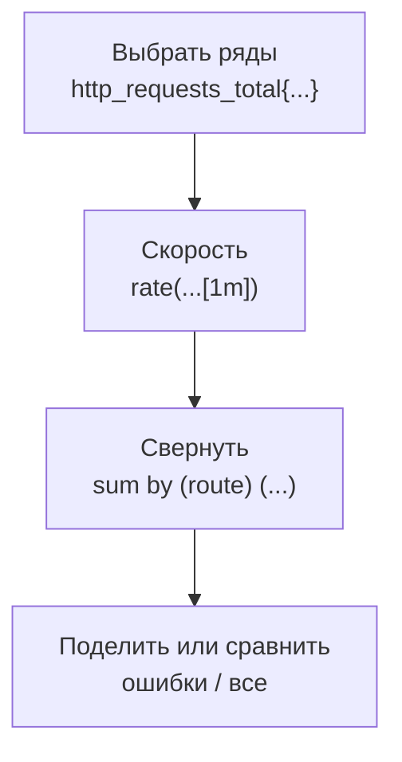

## Зачем это нужно

В прошлом уроке ты увидел, как числа магазина попадают в Prometheus и ложатся в тетрадь наблюдений. Теперь у тебя есть тетрадь, но в ней тысячи строк, а нужен ответ на человеческий вопрос: «сколько ошибок прямо сейчас?». Для таких вопросов у Prometheus есть язык запросов **PromQL** (Prometheus Query Language). Он похож на формулы в таблице: берёшь столбцы, считаешь разницу, складываешь по группам, делишь одно на другое.

История из жизни. Дежурный ночью открывает график запросов, видит ровную линию и пишет в чат: «трафик в норме». Утром выясняется, что с полуночи половина покупателей получала ошибки. На графике было `sum(http_requests_total)`, то есть общее число запросов, и ошибки лишь добавляли в него свои запросы.

Число росло, как и всегда. Нужен был запрос `доля ошибок`, и написать его надо было за минуту. Этому мы сегодня и учимся: четыре запроса, которые отвечают на вопросы RED из [урока 1.1](../01-basics/01-signals.md) и считают SLI из [урока 1.2](../01-basics/02-sli-slo.md).

Шаг проекта: ты кладёшь в `~/monitoring-lab/02-metrics/` два скрипта (`promq.sh` для запросов из терминала и `traffic.sh` для живого трафика) и два файла. В `red.promql` будут четыре запроса RED, а в `rules.yml` готовые запросы, которые Prometheus будет считать сам. Это основа графиков и алертов следующей темы.

## Что нужно знать

- [Урок 2.1](01-prometheus.md): ряд, метка, counter, gauge, histogram и его корзины. Без них запросы выглядят как заклинания.
- [Урок 1.1](../01-basics/01-signals.md): RED (запросы, ошибки, время) и USE.
- [Урок 1.2](../01-basics/02-sli-slo.md): SLI как доля хороших запросов и порог 300 мс.
- Терминал, `curl`, `jq`: [load-tester, урок 1.4](../../load-tester/01-linux/04-network-cli.md), [DevOps, урок 1.2](../../devops/01-linux/02-text-pipes.md).
- Работающий стенд «Магазин» с профилем `monitoring`: [load-tester, урок 5.3](../../load-tester/05-docker/03-compose-shop.md).

## Картина целиком

PromQL работает как конвейер на фабрике: сырьё идёт слева направо, и на каждом шаге с ним что-то делают. Сначала **выбрать** ряды по имени и меткам. Потом **посчитать скорость** (из счётчика сделать «сколько в секунду»).

Потом **свернуть** по группам (сложить ряды разных копий сервиса, оставить только нужные метки). В конце **сравнить или поделить**, чтобы получить долю.



Запрос читают изнутри наружу: сначала самая внутренняя часть (выбор рядов с квадратными скобками), потом функция вокруг, потом сворачивание, потом арифметика. Почти все запросы, которые тебе понадобятся, это вариации этой цепочки из четырёх шагов.

## Теория

### Типы значений: мгновенный вектор, диапазон и число

Запрос `rate(http_requests_total)` падает с ошибкой, а `rate(http_requests_total[1m])` работает. Разница в трёх символах, но за ней стоит главное устройство PromQL: у каждой части запроса свой тип значения. Их три, и начнём с самого простого.

Самый простой тип это **снимок**. Представь табло в магазине, на котором у каждой кассы одно число: сколько человек стоит в очереди. Запрос `shop_db_pool_waiting` даёт такой снимок: по одному числу на каждый ряд, например `shop-1: 0`, `shop-2: 3`. В PromQL это называют мгновенным вектором (по-английски instant vector): «вектор» тут просто набор рядов, «мгновенный» значит одно значение на момент запроса.

Второй тип это **плёнка**: у каждого ряда не одно число, а кусок истории. Записывается с квадратными скобками: `http_requests_total{route="/api/products"}[1m]` вернёт всё, что записано за последнюю минуту. Скрейп идёт раз в 5 секунд, а в минуте 60 секунд: 60 / 5 = 12, поэтому на каждый ряд придётся 12 пар, например `3000, 3010, 3021, ...` и до `3120`.

Официально это вектор диапазона (range vector). График из плёнки не нарисуешь, зато из неё можно посчитать, как быстро число росло.

Третий тип это просто **число**, например `0.05` или `24`. По-английски скаляр (scalar). Им задают пороги и множители.

Теперь правило, ради которого всё это. Функции, которые смотрят в историю (`rate`, `increase`, `avg_over_time`), берут плёнку и возвращают снимок: по одному числу на ряд. Для ряда выше `rate(http_requests_total{route="/api/products"}[1m])` возьмёт плёнку от 3000 до 3120 и вернёт одно число: (3120 − 3000) / 60 = 2 запроса в секунду.

Без скобок `[1m]` функции нечего считать: ей дали снимок, а она ждёт плёнку. И наоборот, `sum(http_requests_total[1m])` тоже не заработает: `sum` умеет складывать снимки, а ему дали плёнку. Между ними должна встать функция вроде `rate`: она превращает плёнку в снимок.

> **Прикинь сам:** какой тип у `shop_db_pool_waiting`, у `shop_db_pool_waiting[1m]` и у `0.05`?
{: .predict}

Снимок, плёнка и число. Если в ответ на запрос видишь «expected type instant vector in aggregation expression, got range vector», значит, на вход подана плёнка там, где ждали снимок.

Осторожно: график в Prometheus и Grafana рисует именно снимки, посчитанные в каждой точке оси времени. Поэтому запрос с `[1m]` без функции в окне Graph не отрисуется: рисовать нечего, плёнка это не одно число.

> **Главное:** у выражения три типа: снимок (мгновенный вектор), плёнка (вектор диапазона) и число (скаляр); функции над историей превращают плёнку в снимок.
{: .key}

Типы разобрали. Теперь научимся выбирать из тысячи рядов нужные.

### Селекторы и метки: как выбрать нужные ряды

В поиске по таблице ты пишешь «все строки, где маршрут такой-то и статус начинается на пять». В PromQL то же самое называется селектор: имя метрики и условия на метки в фигурных скобках. Начать можно без условий: `http_requests_total` вернёт все ряды метрики.

Чтобы сузить выбор, добавь метку: `http_requests_total{route="/api/products"}`. Знак `=` значит «равно», а `!=` «не равно»: `{route!="other"}` отбросит ряды с маршрутом `other`.

Бывает, что надо выбрать не одно значение, а целую группу. Тогда вместо `=` пишут `=~`, и справа шаблон, регулярное выражение. В шаблоне точка значит «любой символ», звёздочка «любое число повторов», а `|` значит «или».

Для ошибок магазина берём ответы с кодом 5xx: `http_requests_total{status=~"5.."}` выберет ряды `status="500"`, `status="502"` и `status="504"`. Обратная пара `!~` значит «не подходит под шаблон»: `{route!~"/api/.*"}` оставит всё, кроме маршрутов API.

Шаблон сравнивается со значением **целиком**. `5..` подойдёт к `502`, но не к `2500`: лишнего «до» и «после» быть не должно. В других языках для этого ставят `^` и `$`, здесь они подразумеваются.

А вот `{status="5xx"}` ничего не найдёт: в базе нет ряда со значением «5xx», есть только настоящие коды ответа. Эту ошибку ты воспроизведёшь на практике. Остальные условия тоже проверь руками, а не по памяти: в уроке нет смысла заучивать таблицу операторов.

> **Прикинь сам:** как выбрать только запросы каталога и категорий, то есть маршруты `/api/products`, `/api/products/{id}` и `/api/categories`?
{: .predict}

Подходит `http_requests_total{route=~"/api/(products|categories).*"}`: скобки группируют варианты, `.*` разрешает любое продолжение. Именно такой фильтр использует стенд для SLI каталога.

Осторожно: имя метрики на самом деле тоже метка (`__name__`), поэтому `{__name__="up"}` и просто `up` одно и то же. А `{job="shop"}` без имени выберет все ряды задачи. И не бери `=~` там, где хватает `=`: шаблон медленнее и легче ошибиться.

> **Главное:** селектор `имя{метка="значение"}` выбирает ряды; `=~` и `!~` принимают шаблон, который сравнивается со значением целиком.
{: .key}

Ряды выбрали. Теперь посчитаем, как быстро они растут.

### rate, irate и increase: скорость из счётчика

Помнишь одометр из прошлого урока? Число «всего запросов» мало что говорит. Нужна **скорость**: сколько запросов в секунду прямо сейчас.

Принцип школьный: путь делим на время. Если за последнюю минуту счётчик вырос с 1000 до 1720, скорость равна (1720 − 1000) / 60 = 12 запросов в секунду. Это и делает `rate()`.

`rate(http_requests_total[1m])` считает так для каждого ряда. Квадратные скобки задают **окно**: за какое время берём историю.

Окно должно вмещать не меньше четырёх сэмплов (напомню, сэмпл это одна запись в ряду): две нужны минимум, остальное запас на пропущенный скрейп. При скрейпе раз в 5 секунд четыре сэмпла набираются за 4 × 5 = 20 секунд: это самое короткое разумное окно. Запрос `rate(...[5s])` попадёт в окно с одним сэмплом и вернёт пустоту: для скорости нужны две точки. Поэтому на стенде берут `[1m]`: 12 точек хватает, и график не слишком дёрганый.

Окно это компромисс. Узкое (20 секунд) быстро реагирует, но график зубчатый. Широкое (5 минут) гладкое, но всплеск в три секунды в нём почти растворится. Для графиков берут от 1 до 5 минут, для алертов обычно 5.

<div class="viz" data-viz="obs-rate" data-window="30"></div>

На виджете видно, что при узком окне скорость успевает измениться между точками, а при широком кривая сглаживается и запаздывает за реальностью.

Рядом с `rate` живут ещё две функции. `increase(x[5m])` возвращает не скорость, а **прирост за окно**: сколько запросов было за 5 минут. Это та же `rate`, умноженная на длину окна в секундах, удобно для итогов («сколько заказов за час»).

`irate(x[1m])` берёт только **две последние точки** окна, поэтому реагирует мгновенно, но рвано. Для графиков и алертов бери `rate`, а `irate` оставь для поиска коротких всплесков.

Разберём пример магазина. За окно `[1m]` в ряду `http_requests_total{route="/api/products",status="200"}` значения шли от 3000 до 3600. `rate` вернёт (3600 − 3000) / 60 = 10 запросов в секунду, а `increase(...[1m])` вернёт 600: столько запросов за минуту.

А если процесс перезапустился и счётчик упал с 1720 до 15, `rate` поймёт, что это сброс, и посчитает рост с нуля. Минусовых скоростей не бывает.

> **Прикинь сам:** `increase(shop_orders_created_total[1h])` вернул 180. Сколько это заказов в минуту?
{: .predict}

180 заказов за 60 минут, значит 3 в минуту. Тот же результат даст `rate(shop_orders_created_total[1h]) * 60`.

Осторожно: `rate` применяют только к счётчикам. Возьми датчик `shop_db_pool_waiting`: он был 2, потом 5, потом 1. Для счётчика падение значит сброс, и `rate` честно сочтёт: «процесс перезапустился, потом набралась единица».

Скорость «роста очереди» из этого не получится, получится бессмыслица. Для датчиков ниже есть свои функции.

> **Главное:** `rate(счётчик[окно])` даёт скорость в секунду, окно должно вмещать не меньше четырёх скрейпов, `increase` даёт прирост за окно, а `irate` скорость по двум последним точкам.
{: .key}

Скорость по отдельным рядам у нас есть. Теперь сложим их в общую картину.

### Агрегации: sum, avg, count, topk и by, without

Магазин отдаёт десятки рядов `http_requests_total`: по маршрутам, методам, статусам. Вопрос «сколько запросов в секунду всего?» требует сложить их. Для этого есть **агрегации**: `sum` (сумма), `avg` (среднее), `min` и `max`, `count` (сколько рядов), `topk(3, ...)` (три самых больших). Агрегация это про то, чтобы схлопнуть много рядов в меньше.

Образ: чеки из магазина. «Всего потратил» это `sum`, «потратил по отделам» это `sum by (отдел)`. Метки после `by` это то, что останется после сложения, остальные исчезнут: их значения слились.

Посчитаем на числах магазина. Пусть `rate` по рядам дал: каталог 10, карточки товаров 8, категории 4, заказы 2 запроса в секунду. Запрос `sum(rate(http_requests_total[1m]))` сложит всё и вернёт один ряд без меток: 24. Запрос `sum by (route) (rate(http_requests_total[1m]))` оставит метку `route` и вернёт четыре ряда: 10, 8, 4 и 2 (в сумме всё те же 24).

Если сгруппировать по `status`, получишь, сколько в секунду отдаётся кодов 200, 404 и 502. Есть и обратная запись: `sum without (status) (...)` значит «сложи, убрав метку `status`, остальные оставь». Что выбрать, решает длина: `by` перечисляет, что оставить, `without` перечисляет, что убрать.

Теперь порядок вложения: **сначала `rate`, потом `sum`**. Посмотрим, почему, на двух копиях магазина. В начале минуты счётчики такие: `shop-1` равен 1000, `shop-2` равен 5000. Через минуту `shop-1` перезапустился и успел набрать 30, а `shop-2` дорос до 5060.

Если сначала сложить, получится 6000 в начале и 5090 в конце. Сумма «упала», `rate` решит, что был сброс, и насчитает рост с нуля, около 85 запросов в секунду. Это ложь.

Если сначала `rate` по каждой копии, то `shop-1` покажет 0.5 (сброс `rate` распознает, после него набралось 30 за минуту). `shop-2` покажет 1, а `sum` даст честные 1.5. Поэтому `sum(rate(x[1m]))` верно, а `rate(sum(x)[1m])` PromQL и не примет без особого синтаксиса.

> **Прикинь сам:** в магазине две копии `shop` (`instance="shop-1"` и `shop-2`), каждая отдаёт `http_requests_total`. Как получить общую скорость по обеим, а как по каждой?
{: .predict}

Общую даст `sum(rate(http_requests_total[1m]))`: `rate` посчитает скорость каждой копии отдельно, `sum` сложит. Скорость каждой копии отдельно даст `sum by (instance) (rate(http_requests_total[1m]))`.

> **Главное:** `sum by (метка)` складывает ряды и оставляет перечисленные метки; сначала `rate`, потом `sum`.
{: .key}

Теперь посчитаем главное: долю ошибок.

### Арифметика и доля ошибок

В PromQL ряды можно складывать, вычитать, умножать и делить, как числа в таблице. Начнём с самого простого, с чисел. Ошибок магазина 0.6 в секунду, всех запросов 24 в секунду.

Доля ошибок: 0.6 / 24 = 0.025, то есть 2.5%. Запишем это запросом:

```promql
sum(rate(http_requests_total{status=~"5.."}[1m]))
/
sum(rate(http_requests_total[1m]))
```

Читаем изнутри: в числителе скорость 5xx, свёрнутая в одно число, в знаменателе скорость всех запросов, тоже одно число, и они делятся. Для SLO из урока 1.2 это уже готовый SLI: единица минус эта доля.

Почему обе стороны завёрнуты в `sum`? Когда делят два набора рядов, Prometheus ищет каждому ряду слева пару справа, у которой **все метки совпадают**. Без пары ряд выпадает из результата. У двух `sum` без меток набор меток пустой с обеих сторон, поэтому пара находится и деление проходит.

А вот запрос `http_requests_total{status=~"5.."} / http_requests_total` даст странности: ряд с `status="502"` слева найдёт справа ряд с теми же метками, то есть самого себя. Частное будет ровно 1. Эту ловушку ты воспроизведёшь на практике.

Правило: прежде чем делить, схлопни метки до одинакового набора через `sum`. Для долей по маршрутам сворачивают одинаково обе стороны: `sum by (route) (rate(...5..[1m])) / sum by (route) (rate(...[1m]))`, метки `route` совпадают, пары находятся.

Теперь два случая с пустотой. Если за минуту 5xx не было вообще, числитель пуст, и всё деление пусто. Хотя на деле ошибок ноль, на графике «нет данных».

Оператор `or vector(0)` говорит: «если слева пусто, подставь ноль». Так сделан SLI на стенде:

```promql
(sum(rate(http_requests_total{status=~"5.."}[5m])) or vector(0))
/
sum(rate(http_requests_total[5m]))
```

Обратный случай: трафика нет совсем, знаменатель равен нулю, и результат пуст или `NaN`. Такой запрос не должен будить дежурного ночью, поэтому для него есть отдельное правило `ShopNoTraffic`. Чтобы не делить на ноль, можно поставить нижнюю границу: `clamp_min(x, 1)`.

Сравнения тоже работают на рядах: `shop_db_pool_waiting > 0` оставит только ряды, где значение больше нуля. А если нужен ответ 0 или 1, а не фильтр, добавь `bool`: `shop_db_pool_waiting > bool 0`. На этом строят условия алертов в теме 3.

> **Проверь понимание:** доля ошибок 0.025. Это 2.5% или 25%? И уложился ли магазин в SLO «99% успешных»?

<details markdown="1">
<summary>Ответ</summary>

Это 2.5%. Успешных 97.5%, SLO в 99% не выполнено, потому что допустимы только 1% ошибок.

</details>

<details markdown="1">
<summary>Для любопытных: on и ignoring</summary>

Если метки двух сторон не совпадают, а связать их нужно, помогают `on(метки)` («сопоставляй только по этим») и `ignoring(метки)` («сопоставляй по всем, кроме этих»). Например `a / on(route) b`. Для основ достаточно сначала свернуть обе стороны одинаково.

</details>

Осторожно: деление двух счётчиков без `rate` даёт долю за всю историю с момента запуска, а не за последнюю минуту. Свежая авария в ней растворится, как капля в бочке.

> **Главное:** доля это `sum(rate(плохие)) / sum(rate(все))`; метки по обе стороны должны совпадать, а `or vector(0)` заменяет пустоту нулём.
{: .key}

Теперь о втором показателе RED: времени ответа. Тут запрос длиннее, и мы соберём его по шагам.

### histogram_quantile: p95 из корзин

Из прошлого урока ты помнишь гистограмму: корзины `le`, накопительные, с `+Inf` в конце. Из неё получают **процентили**: p95 это время, быстрее которого отвечают 95% запросов. Если p95 равно 0.8 секунды, то 95 покупателей из 100 получили ответ быстрее 0.8, а 5 ждали дольше.

Среднее такого не расскажет. Считает его функция `histogram_quantile`: слово quantile (квантиль) значит то же, что процентиль, только долей от единицы, поэтому 95% пишут как `0.95`.

Весь запрос выглядит так:

```promql
histogram_quantile(0.95,
  sum by (le) (rate(http_request_duration_seconds_bucket[1m])))
```

Страшно только на первый взгляд. Соберём его изнутри наружу, шаг за шагом.

<div class="viz" data-viz="flow" data-steps='[{"title":"Выбрать корзины","text":"`http_request_duration_seconds_bucket`: по ряду на каждую корзину каждого маршрута, это счётчики с начала жизни."},{"title":"Скорость каждой корзины","text":"`rate(...[1m])`: сколько запросов в секунду попадает в корзину прямо сейчас, а не за всю историю."},{"title":"Сложить копии, сохранив le","text":"`sum by (le) (...)`: все маршруты и копии слились в одну лестницу из корзин."},{"title":"Найти отметку 95%","text":"`histogram_quantile(0.95, ...)`: ищет ступень, где набралось 95 из 100, и отдаёт её время."}]'></div>

Шаг 1: `http_request_duration_seconds_bucket`. Это ряды корзин: на каждую границу времени и каждый маршрут по одному. Но они накопительные счётчики с самого запуска, а нас интересует «как сейчас».

Шаг 2: `rate(..._bucket[1m])`. Скорость каждой корзины за последнюю минуту, в запросах в секунду. Окно `1m` выбрано по тем же правилам, что выше.

Допустим, всего пришло 100 запросов в секунду. По корзинам вышло так: до 0.1 с 60, до 0.3 с 90, до 0.5 с 98, а в `+Inf` все 100.

Шаг 3: `sum by (le)`. Рядов у нас много (маршруты, копии), а нужна одна общая лестница. `sum` складывает их, а метку `le` мы **сохраняем** через `by`.

Это как ступеньки: без `le` мы не знаем, на какой высоте каждая ступень, и функции нечего искать. Это самая важная деталь запроса.

Шаг 4: `histogram_quantile(0.95, ...)`. Число `0.95` значит «95 из 100». Нам нужна отметка 95 запросов.

По лестнице она лежит между 0.3 (там набрано 90) и 0.5 (набрано 98). Prometheus считает, что внутри корзины запросы лежат равномерно, и достраивает отметку пропорцией.

Счёт такой: 0.3 + (95 − 90) / (98 − 90) × (0.5 − 0.3) = 0.3 + 0.625 × 0.2 = 0.425. Значит, p95 около 0.425 секунды.

Отсюда важный вывод: **результат не точнее ширины корзины**. Если все запросы лежат в одной корзине от 0.3 до 0.5, p95 будет «где-то между». Поэтому корзины выбирают вокруг важных порогов: у магазина есть корзина 0.3 под SLO из урока 1.2.

<div class="viz" data-viz="obs-quantile" data-slow="5" data-q="95"></div>

На виджете видно, как несколько медленных запросов тянут p95 вверх, хотя среднее почти не двигается.

Для разреза по маршрутам в `by` добавляют вторую метку: `histogram_quantile(0.95, sum by (le, route) (rate(http_request_duration_seconds_bucket[1m])))`. Теперь `le` обязательно, `route` для разреза. Рядом лежат ещё два запроса.

**Среднее** время: `sum(rate(..._sum[1m])) / sum(rate(..._count[1m]))`, это сумма времён, делённая на число запросов. **Доля быстрых** запросов, то есть SLI по задержке: `sum(rate(..._bucket{le="0.3"}[5m])) / sum(rate(..._count[5m]))`: корзина `le="0.3"` считает ответы не дольше 0.3 секунды, делим на все.

> **Прикинь сам:** в запросе p95 забыли `sum by (le)` и написали `histogram_quantile(0.95, rate(http_request_duration_seconds_bucket[1m]))`. Что вернётся?
{: .predict}

Процентиль посчитается отдельно для каждого маршрута и метода (у каждой пары свой набор корзин), и вместо одного числа получишь много. А если поставить `sum` без `le`, метка границы исчезнет, и результат будет `NaN` или пустым.

Осторожно: нельзя усреднять процентили. «p95 первой копии 0.4, второй 0.6, значит общий 0.5» неверно: процентиль не складывается. Правильно сложить корзины (`sum by (le)`), а потом считать процентиль. По этой же причине в гистограммах хранят корзины, а не готовые процентили.

> **Главное:** `histogram_quantile(0.95, sum by (le) (rate(..._bucket[1m])))` даёт p95; метка `le` в `by` обязательна; точность не лучше ширины корзины.
{: .key}

Для датчиков (gauge) нужны другие функции.

### Функции для gauge: avg_over_time, max_over_time, predict_linear

У датчика скорости роста нет, зато есть вопросы вроде «как менялось значение за время». Для них есть группа функций `*_over_time`: они берут плёнку и сворачивают её в число. `avg_over_time(x[5m])` даст среднее за 5 минут, `max_over_time(x[5m])` максимум, `min_over_time` минимум.

Зачем они нужны: датчик между двумя скрейпами меняется незаметно. Если пул соединений был полностью занят две секунды, а скрейп раз в 5 секунд, мгновенное значение может этого не поймать. Максимум за 5 минут `max_over_time(shop_db_pool_waiting[5m])` покажет, что очередь за это время **хотя бы раз** была. А `avg_over_time(shop_db_pool_available[5m])` скажет, сколько в среднем соединений оставалось свободными.

Две функции смотрят в будущее. `deriv(x[10m])` даёт скорость изменения датчика. А `predict_linear(x[1h], 4 * 3600)` проводит прямую по часовой истории и говорит, какое значение будет через 4 часа.

На ней строят алерты «диск закончится через четыре часа». Если свободно 20 ГБ и убывает по 10 ГБ в час, прогноз через 4 часа будет отрицательным, и пора реагировать. Это прогноз по прямой, а не пророчество: если рост скачками, он ошибётся.

Ещё одна полезная приставка: `offset 1h` сдвигает запрос в прошлое. `rate(http_requests_total[5m]) offset 1h` покажет скорость час назад, а `rate(...[5m]) / rate(...[5m] offset 1d)` сравнит сегодня со вчера.

> **Проверь понимание:** какая функция скажет, что очередь за доступ в базу хотя бы раз появлялась за последние 10 минут, даже если сейчас её нет?

<details markdown="1">
<summary>Ответ</summary>

`max_over_time(shop_db_pool_waiting[10m])`: если результат больше нуля, очередь хоть раз была.

</details>

> **Главное:** для датчиков используй `avg_over_time`, `max_over_time`, `deriv` и `predict_linear`; `rate` только для счётчиков.
{: .key}

Когда запросы становятся длинными и ими пользуются часто, их сохраняют.

### Recording rules: сохранённые запросы

Запрос p95 с вложенными `sum by`, `rate` и `histogram_quantile` считать на каждом обновлении графика дорого. Если открыто десять вкладок, Prometheus выполняет его десять раз в минуту, а алерты считают его ещё и каждые 5 секунд. Решение: посчитать один раз и сохранить результат как новую метрику.

Это называется **правило записи** (по-английски recording rule, так оно и называется в конфиге). Образ из кухни: заготовка. Нарезал заранее, а при сборке блюда просто берёшь готовое.

Правило записывают в YAML-файле:

```yaml
groups:
  - name: lab_sli
    rules:
      - record: lab:http_error_ratio:rate5m
        expr: |
          (sum(rate(http_requests_total{status=~"5.."}[5m])) or vector(0))
          / sum(rate(http_requests_total[5m]))
```

У правила есть имя (`record`) и выражение (`expr`). Каждые `evaluation_interval` (на стенде 5 секунд) Prometheus считает выражение и записывает результат как обычный ряд. Дальше его можно читать как `lab:http_error_ratio:rate5m`, рисовать и использовать в алертах.

Имя по договорённости состоит из трёх частей через двоеточие: `область:метрика:операция`, например `sli:http_error_ratio:rate5m`. По такому имени видно, что это результат правила, а не сырая метрика.

На стенде правила уже лежат в `monitoring/prometheus/rules/slo.yml`: `sli:http_error_ratio:rate5m` и версии для окон 30 минут, 1 час и 6 часов, а также `sli:catalog_slow_ratio:rate5m` с версиями. Ты откроешь их на странице `/rules`. Эти же ряды потом питают алерты по burn rate из темы 3.

Осторожно: правило замораживает запрос. Если в метриках поменялись метки, оно перестанет что-то возвращать, а ты заметишь это не сразу. Поэтому файл правил проверяют командой `promtool check rules` до подключения.

> **Главное:** recording rule один раз считает сложный запрос и сохраняет его как новый ряд; имя пишут как `область:метрика:операция`.
{: .key}

Осталось понять, что делать, когда запрос возвращает пустоту.

### Пустой результат: порядок диагностики

Самое частое состояние новичка: запрос вернул «Empty query result». Это не ошибка, это ответ: «подходящих рядов нет». Причин мало, и их проверяют по порядку, от простого к сложному, как у врача: сначала измерить температуру, потом делать анализы.

1. Метрика существует? Запрос `имя_метрики` без условий. Если пусто, опечатка в имени или цель не скрейпится: посмотри `up`.
2. Метки верны? Убирай условия одно за другим. `status="5xx"` вместо `status=~"5.."` типичная причина.
3. Есть ли трафик? Метрика с метками появляется после первого события: ошибок не было, значит рядов нет. По той же причине `sum` над отсутствующими рядами вернёт пустоту, а не ноль.
4. Окно подходит? `rate(...[5s])` при скрейпе 5 секунд пуст: в окне меньше двух точек.
5. Время справа верно? Окно Prometheus по умолчанию показывает «сейчас», но ты мог выставить прошлое.

Разберём пример. Запрос `rate(shop_payment_requests_total{result="failed"}[1m])` пуст. Смотрим метки: у метрики три значения `ok`, `error` и `timeout`, значения `failed` нет вообще. Проверить это можно запросом `shop_payment_requests_total`: он покажет реальные значения меток.

Есть и особая пустота: метрика пропала целиком, например упал сервис оплаты. Сравнение вроде `x > 5` в этом случае молчит, потому что сравнивать нечего. Для такого случая есть функция `absent(up{job="payment"})`: она вернёт 1, когда ряда нет вообще. Именно её ставят в алерты вместе со сравнениями.

Осторожно: пустой результат и нулевой результат разные вещи. «Ноль ошибок» и «нет данных» нельзя путать в алертах: первое хорошо, второе повод проверить сбор метрик.

> **Главное:** при пустом результате иди от простого: имя, метки, трафик, окно, время; пропажу метрики ловит `absent()`.
{: .key}

Теперь всё то же руками.

## Практика

Работаем в `~/monitoring-lab/02-metrics/`. Стенд из урока 2.1 должен работать.

### 1. Скрипты: запросы из терминала и живой трафик

Чтобы не копировать запросы в браузер, сделаем короткий помощник. Создай `~/monitoring-lab/02-metrics/promq.sh`:

```bash
#!/usr/bin/env bash
# Выполнить запрос PromQL и вывести ряды: метки и значение
curl -sG "${PROM:-localhost:9090}/api/v1/query" --data-urlencode "query=$1" \
  | jq -r '.data.result[] | "\(.metric | to_entries | map("\(.key)=\(.value)") | join(",")) \(.value[1])"'
```

Адрес Prometheus берётся из переменной `PROM`, а если её нет, то это `localhost:9090`. `curl -G` отправляет данные в адресной строке, а `--data-urlencode` экранирует скобки и кавычки запроса. `jq` печатает метки и значение каждого ряда. Теперь трафик: `traffic.sh` создаёт смешанную нагрузку, чтобы метрики шевелились.

```bash
#!/usr/bin/env bash
# Смешанный трафик к магазину: Ctrl+C останавливает
TOKEN=$(curl -s localhost:8000/api/login -H 'Content-Type: application/json' \
  -d '{"email":"user0001@shop.lab","password":"password"}' | jq -r .token)
i=0
while true; do
  i=$((i + 1))
  curl -s -o /dev/null localhost:8000/api/products
  curl -s -o /dev/null localhost:8000/api/products/$((i % 20 + 1))
  curl -s -o /dev/null localhost:8000/api/categories
  if [ $((i % 10)) -eq 0 ]; then
    curl -s -o /dev/null -H "Authorization: Bearer $TOKEN" -H 'Content-Type: application/json' \
      localhost:8000/api/cart/items -d '{"product_id":1,"qty":1}'
    curl -s -o /dev/null -X POST -H "Authorization: Bearer $TOKEN" localhost:8000/api/orders
    curl -s -o /dev/null localhost:8000/api/no-such-path
  fi
  sleep 0.2
done
```

Цикл `while true` крутится, пока его не остановишь. `$((i % 20 + 1))` перебирает карточки товаров. Раз в 10 итераций добавляется корзина, заказ и несуществующий адрес, чтобы появились ошибки 4xx. Запусти трафик в отдельной вкладке терминала и оставь работать до конца урока:

```bash
chmod +x ~/monitoring-lab/02-metrics/*.sh
~/monitoring-lab/02-metrics/traffic.sh
```

Проверь помощник, пока трафик идёт:

```bash
~/monitoring-lab/02-metrics/promq.sh 'up'
```

**Что должно получиться** (порядок строк и метки instance примерные):

```text
instance=shop:8000,job=shop 1
instance=payment:8001,job=payment 1
instance=node-exporter:9100,job=node 1
```

**Как читать вывод:** по строке на ряд, в конце значение. Все `1` значит, что цели отвечают. Если ты видишь `0`, вернись к разделу 4 урока 2.1.

**Типичные ошибки:**

- `jq: error (at <stdin>:0): Cannot iterate over null`: Prometheus ответил ошибкой в запросе, посмотри ответ без `jq`: `curl -sG "${PROM:-localhost:9090}/api/v1/query" --data-urlencode 'query=...'`.
- `Permission denied`: забыл `chmod +x`.

> Скрипт из нейросети проверяй так же, как чужой код: прочитай, что он делает, прежде чем запускать, особенно если там есть `rm` или `docker compose down`.
{: .ai}

### 2. RED четырьмя запросами

Выполняй запросы через помощник (или вставляй в `http://localhost:9090/query`). Подожди минуту после запуска трафика, чтобы в окне `[1m]` набралось точек.

```bash
cd ~/monitoring-lab/02-metrics
./promq.sh 'sum(rate(http_requests_total[1m]))'
./promq.sh 'sum by (route) (rate(http_requests_total[1m]))'
./promq.sh '(sum(rate(http_requests_total{status=~"5.."}[1m])) or vector(0)) / sum(rate(http_requests_total[1m]))'
./promq.sh 'histogram_quantile(0.95, sum by (le) (rate(http_request_duration_seconds_bucket[1m])))'
```

Первый запрос это R (сколько запросов в секунду), второй разрез по маршрутам, третий E (доля 5xx), четвёртый D (p95). Третий обёрнут в `or vector(0)`, чтобы без ошибок он показывал ноль, а не пустоту.

**Что должно получиться** (числа пример, у тебя будут другие):

```text
 4.9
route=/api/products 1.6
route=/api/products/{id} 1.6
route=/api/categories 1.6
route=/api/cart/items 0.16
route=/api/orders 0.16
route=other 0.16
 0
 0.0475
```

**Как читать вывод:** четыре блока по порядку. Первый `4.9` запроса в секунду. Дальше разрез: три маршрута каталога по 1.6, а корзина, заказы и «other» по 0.16 (в 10 раз реже, как задано скриптом). Затем `0`: ошибок 5xx нет (404 это не 5xx). И `0.0475`: p95 около 47 мс. Сумма разреза равна общей скорости, это быстрая проверка.

> **Прикинь сам:** трафик гоняет `/api/no-such-path`. В какую строку разреза попадёт эта скорость и почему не появится отдельная строка для него?
{: .predict}

В `route=other`: код магазина не заводит ряд на неизвестный адрес, а складывает все в одну метку `other`. Статус там 404.

**Типичные ошибки:**

- В ответе пусто: трафик не запущен или прошло меньше минуты.
- `error ... parse error: unexpected ...`: не закрыта скобка; проверь парность `(` и `)`.

Теперь оплата и ошибки. Добавим сломанную оплату (сервис оплаты умеет менять поведение на лету) и посмотрим, как разойдутся метрики:

```bash
curl -fsS localhost:8001/admin/config -H 'Content-Type: application/json' -d '{"delay_ms":300,"fail_rate":0.7}'
sleep 60
cd ~/monitoring-lab/02-metrics
./promq.sh 'sum by (result) (rate(shop_payment_requests_total[1m]))'
./promq.sh 'sum by (status) (rate(http_requests_total{route="/api/orders"}[1m]))'
```

Первая команда меняет оплату: задержка 300 мс и 70% отказов. Через минуту запросы покажут результат оплаты у магазина и коды ответа на заказы.

**Что должно получиться** (числа пример):

```text
result=ok 0.012
result=error 0.034
status=201 0.012
status=502 0.034
```

**Как читать вывод:** оплата отказывает, магазин повторяет попытки, и покупатель получает 502 на заказ. Часть заказов успешна (201). Заметь, что доля 502 здесь 0.034 / (0.012 + 0.034) ≈ 74% от заказов, но запросов `/api/orders` мало: на общей доле ошибок 5xx это скажется слабо. Хороший случай, чтобы понять разницу между «ошибка в маршруте» и «ошибка во всём магазине».

Верни оплату в норму, пока ты не забыл:

```bash
curl -fsS localhost:8001/admin/config -H 'Content-Type: application/json' -d '{"delay_ms":0,"fail_rate":0}'
```

Сохрани все четыре запроса RED в файл `~/monitoring-lab/02-metrics/red.promql`, по запросу в строке с комментарием `# R`, `# разрез`, `# E`, `# D` над каждым.

> Если нейросеть предлагает запрос, который «должен работать», выполни его и сверь с формулой из теории: типичные ошибки вроде пропущенного `le` в `sum by` она делает чаще, чем кажется.
{: .ai}

### 3. Recording rule и проверка

Создай `~/monitoring-lab/02-metrics/rules.yml` с правилом из теории. Нужно придумать имя `lab:http_error_ratio:rate5m` и записать правила для RPS и p95:

```yaml
groups:
  - name: lab_red
    rules:
      - record: lab:http_requests:rate1m
        expr: sum(rate(http_requests_total[1m]))
      - record: lab:http_error_ratio:rate1m
        expr: |
          (sum(rate(http_requests_total{status=~"5.."}[1m])) or vector(0))
          / sum(rate(http_requests_total[1m]))
      - record: lab:http_latency_p95:rate1m
        expr: |
          histogram_quantile(0.95,
            sum by (le) (rate(http_request_duration_seconds_bucket[1m])))
```

Проверим файл программой `promtool`, которая лежит в образе Prometheus. Запускаем её отдельным контейнером с подключённой папкой:

```bash
docker run --rm -v ~/monitoring-lab/02-metrics:/work --entrypoint promtool \
  prom/prometheus:v3.15.0 check rules /work/rules.yml
```

`--rm` удалит контейнер после работы, `-v` подключит твою папку как `/work`, `--entrypoint promtool` запускает не Prometheus, а проверку.

**Что должно получиться:**

```text
Checking /work/rules.yml
  SUCCESS: 3 rules found
```

**Как читать вывод:** `SUCCESS` значит, что файл разобрался и выражения правильные по синтаксису. Это не значит, что запрос что-то вернёт, но опечатку в YAML и скобках ловит.

**Типичные ошибки:**

- `yaml: line 8: mapping values are not allowed in this context`: сбились отступы; в YAML отступы пробелами и таб недопустим.
- `Unable to find image ...`: Docker скачивает образ в первый раз, подожди.

Стенд твой файл не загрузит (конфиг смонтирован только для чтения), поэтому посмотри на готовые правила стенда: страница `http://localhost:9090/rules`. Там `sli:http_error_ratio:rate5m` и другие. Выполни запрос:

```bash
./promq.sh 'sli:http_error_ratio:rate5m'
```

**Что должно получиться** (пример):

```text
 0
```

**Как читать вывод:** результат правила стенда читается как обычный ряд. Он равен нулю, пока 5xx нет. А ещё ты увидел, как `rules.yml` отличается от просто запроса: готовое значение читается мгновенно.

## Сломай и почини

Пять запросов, и все сломаны. Для каждого сначала скажи, что не так, потом открывай разбор. Трафик из `traffic.sh` должен идти.

### Симптом

Пять запросов, результат неверный или пустой:

```promql
rate(http_requests_total[5s])
http_requests_total{status="5xx"}
sum(http_requests_total)
rate(shop_db_pool_waiting[1m])
http_requests_total{status=~"5.."} / http_requests_total
```

Прогони каждый через `./promq.sh '...'` и запиши, что вернулось. Для первого запроса ответ пустой, для второго пустой, третий возвращает растущее число, четвёртый ничего осмысленного, пятый единицы (или ничего).

### Гипотезы

1. Первый: окно слишком короткое.
2. Второй: нет значения «5xx».
3. Третий: нет `rate`.
4. Четвёртый: `rate` для датчика.
5. Пятый: в числителе и знаменателе одинаковые метки.

### Проверки

Для каждого проверь гипотезу: расширь окно до `[1m]`; выполни `http_requests_total` и посмотри значения метки `status`; сравни с `sum(rate(http_requests_total[1m]))`; запроси `shop_db_pool_waiting` напрямую; запроси `sum(rate(...5..[1m])) / sum(rate(...[1m]))`.

### Исправление

<details markdown="1">
<summary>Разбор</summary>

1. `rate(http_requests_total[5s])`: в окне 5 секунд при скрейпе раз в 5 секунд одна точка, а для скорости нужны две. Исправление: `rate(http_requests_total[1m])`.
2. `status="5xx"`: такого значения нет, коды настоящие. Исправление: `http_requests_total{status=~"5.."}`.
3. `sum(http_requests_total)`: это общее число запросов с запуска, оно только растёт. Исправление: `sum(rate(http_requests_total[1m]))`.
4. `rate(shop_db_pool_waiting[1m])`: `shop_db_pool_waiting` gauge, скорость от него бессмысленна. Исправление: `shop_db_pool_waiting` или `max_over_time(shop_db_pool_waiting[5m])`.
5. Деление ряд на ряд с теми же метками даёт 1. Исправление: `sum(rate(http_requests_total{status=~"5.."}[1m])) / sum(rate(http_requests_total[1m]))`, при необходимости с `or vector(0)`.

Бонус: шестой сломанный запрос, `histogram_quantile(0.95, rate(http_request_duration_seconds_bucket[1m]))`, без `sum by (le)`. Результат окажется разрезан по маршрутам и методам; нужен `sum by (le)`, как в теории.

</details>

## ИИ в помощь

Нейросеть быстро пишет запросы PromQL, но часто делает три ошибки: забывает `rate`, теряет `le` в `sum by` и придумывает метрики, которых у тебя нет. Общие правила: [ИИ-помощник](../../load-tester/ai.md).

**Задача:** написать запрос на доли.

```text
Метрики сервиса: http_requests_total{method,route,status} (counter) и http_request_duration_seconds_bucket{le,method,route} (histogram, корзины 0.05, 0.1, 0.3, 0.5, 1, +Inf). Напиши PromQL: 1) долю ответов 5xx за 5 минут; 2) p95 по каждому route. Объясни каждую часть запроса. Используй только эти метрики и метки.
```
{: .wrap}

**Проверь ответ:** в обоих запросах должен быть `rate`; в p95 `sum by (le, route)`; доля ошибок считает `sum` с обеих сторон. Выполни и убедись, что сумма долей и значения правдоподобны.

**Задача:** объяснить чужой запрос.

```text
Объясни по шагам этот запрос PromQL и скажи, что он считает и в каких единицах результат: (вставь запрос из red.promql)
```
{: .wrap}

**Проверь ответ:** сверь единицы: `rate` даёт «в секунду», `histogram_quantile` секунды, доля безразмерна. Если нейросеть назвала p95 «средним», она ошиблась.

> Нейросеть не видит твои метрики: всегда проверяй имена меток запросом `имя_метрики` без условий.
{: .ai}

## Словарик урока

| Термин | Простыми словами |
|---|---|
| PromQL | Язык запросов Prometheus |
| Мгновенный вектор | Набор рядов, у каждого одно значение на момент времени |
| Вектор диапазона | Набор рядов, у каждого отрезок истории (`[1m]`) |
| Селектор | Выбор рядов по имени и меткам |
| `rate` | Скорость роста счётчика в секунду за окно |
| `increase` | Прирост счётчика за окно |
| Агрегация | Сложение или сворачивание рядов (`sum`, `avg`, `count`, `topk`) |
| `by`, `without` | Какие метки оставить после агрегации или какие убрать |
| `histogram_quantile` | Функция процентиля из корзин гистограммы |
| `le` | Метка верхней границы корзины |
| Recording rule | Сохранённый запрос: результат пишется как новый ряд |
| `offset` | Сдвиг запроса в прошлое |

## Вопросы с собеседований

Раздел для повторения: ответь вслух, потом открой ответ. Короткие вопросы с пометкой `[на скорость]` тренируй на время: ответ за 30 секунд.



## Проверено на версиях

Стенд «Магазин» из `load-tester/project/shop`: Prometheus 3.15, `promtool` из образа `prom/prometheus:v3.15.0`, `jq` 1.7. Октябрь 2026. Запросы сверены с исходниками стенда (`metrics.py`, `slo.yml`), на живом стенде не запускались: числа в выводе примерные. Команда `promtool check rules` не запускалась.

## Итог урока: ты умеешь

- [ ] Назвать тип выражения: мгновенный вектор, вектор диапазона, скаляр.
- [ ] Выбрать ряды селектором с `=`, `!=`, `=~`, `!~`.
- [ ] Посчитать скорость через `rate` с правильным окном и объяснить `increase` и `irate`.
- [ ] Сложить ряды через `sum by` и помнить порядок: сначала `rate`, потом `sum`.
- [ ] Посчитать долю ошибок и обработать пустоту через `or vector(0)`.
- [ ] Получить p95 через `histogram_quantile` и `sum by (le)`.
- [ ] Выбрать функцию для gauge: `avg_over_time`, `max_over_time`, `predict_linear`.
- [ ] Записать recording rule и проверить файл через `promtool`.
- [ ] Идти по порядку диагностики пустого результата.

## Где это применить

- [DevOps, урок 8.3: PromQL на «Заметках»](../../devops/08-observability/03-promql.md): те же запросы для сервиса «Заметки», с разбором ошибок на реальных данных.
- [load-tester, урок 7.2: PromQL под нагрузкой](../../load-tester/07-observability/02-promql.md): запросы для оценки результата нагрузочного теста и поиска узкого места.

Дальше: [урок 2.3. Экспортёры и проверки снаружи](03-exporters.md), где в Prometheus появятся хост, контейнеры, база и проверки «снаружи».
