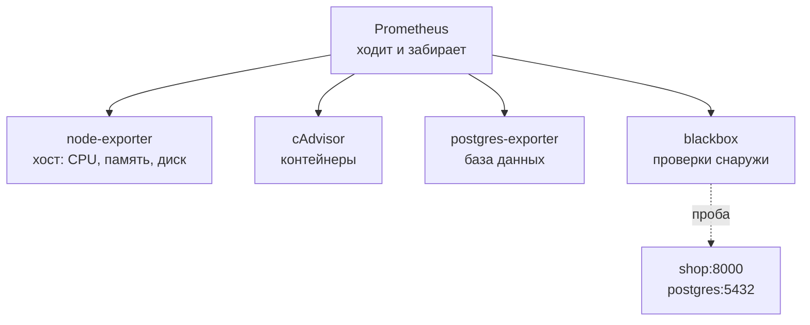
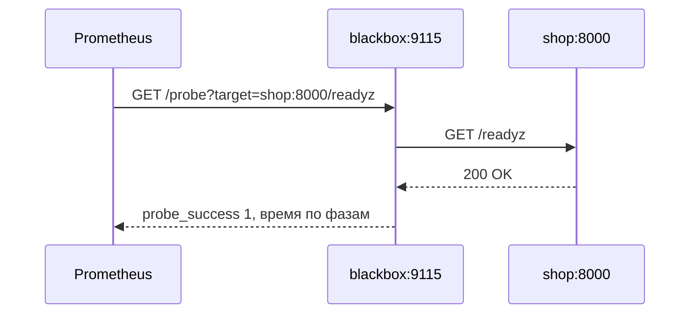
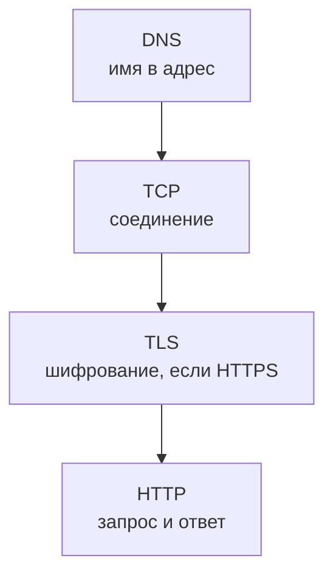

## Зачем это нужно

До сих пор мы смотрели на метрики, которые магазин рассказывает про себя: сколько запросов принял, сколько ошибок отдал. Но у магазина есть то, о чём он сам рассказать не может. Он не знает, что у машины кончилась память: к тому моменту его просто убьют.

Не знает, что его контейнер упёрся в потолок процессора. Не знает, что база тормозит из-за запроса без индекса. А если магазин сломан настолько, что вообще не отвечает, он не расскажет ничего.

Из практики: приложение рапортует «всё хорошо», графики зелёные, а покупатели пишут, что сайт недоступен. Оказалось, что сломался сертификат или DNS: до самого приложения запросы просто не доходили, и изнутри этого не видно. Нужен второй взгляд, снаружи, глазами покупателя.

Этим занимаются две группы инструментов. **Экспортёры** (exporters) это переводчики: они спрашивают у хоста, контейнера или базы данных их внутренние показатели и выдают на `/metrics` в понятном Prometheus формате. А **blackbox-проверки** это покупатель-робот: он пробует открыть сайт снаружи и отмечает, получилось ли.

Шаг проекта: ты заводишь свои проверки снаружи. В `~/monitoring-lab/02-metrics/` появятся `blackbox.yml` и `prometheus.yml`, а на стенде запустятся два контейнера: blackbox-экспортёр и твой собственный Prometheus. Этот набор станет основой алертов на недоступность в теме 3.

## Что нужно знать

- [Урок 2.1](01-prometheus.md): цели, `up`, `/targets`, метки и counter с gauge.
- [Урок 2.2](02-promql.md): `rate`, `sum by`, деление, `avg_over_time`. Без них не прочитать ни одного графика сегодня.
- [Урок 1.1](../01-basics/01-signals.md): USE (использование, очереди, ошибки) для ресурсов.
- Запуск контейнеров, сеть Compose: [load-tester, урок 5.3](../../load-tester/05-docker/03-compose-shop.md) или [DevOps, тема 4](../../devops/04-docker/index.md).
- Запуск `docker run` и `curl`: [load-tester, урок 1.4](../../load-tester/01-linux/04-network-cli.md).

## Картина целиком

Представь поликлинику. У каждого кабинета свой прибор, и у каждого разный интерфейс: один выдаёт ленту, другой цифры на дисплее, третий звуковой сигнал. Регистратор не понимает их все, поэтому у каждого прибора стоит санитар-переводчик, который записывает показания на стандартный бланк.

Prometheus в этой картине регистратор, а экспортёры санитары. Есть ещё «тайный покупатель»: человек, который приходит без предупреждения, проверяет, открыта ли дверь и отвечает ли регистратура, и записывает результат на тот же бланк. Это blackbox.



Первые три экспортёра смотрят «изнутри» на ресурсы, четвёртый «снаружи» на доступность сервисов. Пунктир показывает отличие: Prometheus спрашивает blackbox, а уже blackbox идёт на проверяемый адрес и приносит результат. Ниже разберём каждого.

## Теория

### Экспортёр: переводчик между системой и Prometheus

Когда у программы нет `/metrics` (у Linux, у PostgreSQL, у Docker), её нельзя научить отдавать метрики. Но можно поставить рядом маленькую программу, которая сама ходит за показателями и выдаёт на своём `/metrics`. Так устроен экспортёр.

Он не хранит историю: это делает Prometheus. Экспортёр отвечает только в момент запроса и показывает «как есть сейчас».

Поэтому экспортёры не требуют много ресурсов и безопасно дублируются. Представь переводчика на конференции: он не записывает речь, а переводит ровно то, что слышит в данный момент. А записью занимается стенографист (Prometheus).

На стенде четыре экспортёра: `node-exporter` (хост), `cadvisor` (контейнеры), `postgres-exporter` (база данных), а ещё Alertmanager и Alloy (о них позже, в темах 3 и 4), которые отдают собственные метрики сами. Все они перечислены в `prometheus.yml` и видны на странице Targets. В отличие от магазина и оплаты, порты экспортёров наружу, на твой хост, не опубликованы: смотреть их можно только изнутри сети Compose.

Поэтому для просмотра `/metrics` экспортёров мы заходим через контейнер Prometheus, у которого есть и сеть, и `wget`. Об этом в практике.

Осторожно: экспортёр это ещё один процесс со своими ошибками. «Нет метрик от node-exporter» может значить поломку не хоста, а самого экспортёра. Поэтому алерт «цель недоступна» нужен и для экспортёров тоже: у стенда он называется `ExporterDown`.

> **Главное:** экспортёр это переводчик: отвечает только в момент запроса, историю хранит Prometheus; сам экспортёр тоже может сломаться, и за ним тоже нужен присмотр.
{: .key}

Начнём с самого нижнего слоя: с хоста.

### node-exporter: хост, процессор, память, диск

Первое, что хочется знать о машине: хватает ли ей процессора, памяти и диска. Ответ даёт `node-exporter`. Метрики названы `node_*`. Мы будем читать их по методу USE из [урока 1.1](../01-basics/01-signals.md): для каждого ресурса смотрим использование (занято ли), очередь (ждёт ли кто-то) и ошибки.

**Процессор.** Метрика `node_cpu_seconds_total{mode, cpu}` это счётчик секунд, которые каждое ядро провело в каждом режиме: `idle` (простой), `user` (работа программ), `system` (работа ядра), `iowait` (ожидание диска) и других. Счётчик секунд. Значит, `rate` по нему даёт «долю времени в секунду», то есть число от 0 до 1 на ядро. Занятость процессора это единица минус доля простоя: `1 - avg(rate(node_cpu_seconds_total{mode="idle"}[1m]))`. Так же написано в правиле `HostHighCpu` стенда: оно срабатывает при значении больше 0.9. Разберём числа: если ядро за минуту 6 секунд простаивало, `rate` покажет 6 / 60 = 0.1, занятость 1 − 0.1 = 0.9, то есть 90%.

**Очередь процессора** показывает `node_load1`: средняя длина очереди на выполнение за минуту. Само число бессмысленно без числа ядер: load 4 на четырёх ядрах нормально, а на одном это очередь из четырёх. Поэтому делят: `node_load1 / count(node_cpu_seconds_total{mode="idle"})`. Если результат устойчиво больше 1, процессам тесно.

**Память.** Метрики `node_memory_MemTotal_bytes` и `node_memory_MemAvailable_bytes`. Важно не путать «свободно» и «доступно»: Linux использует свободную память под кеш файлов и отдаёт его, когда нужно. Поэтому смотрят `MemAvailable`: сколько реально можно получить. Занятость памяти: `1 - node_memory_MemAvailable_bytes / node_memory_MemTotal_bytes`. Для очереди смотрят своп: если `node_memory_SwapTotal_bytes - node_memory_SwapFree_bytes` растёт, системе не хватает оперативной памяти.

**Диск.** Свободное место: `node_filesystem_avail_bytes / node_filesystem_size_bytes`. Нагрузку на диск показывает `rate(node_disk_io_time_seconds_total[1m])`: доля времени, когда диск был занят. Значение около 1 означает, что диск упёрт в предел.

> **Прикинь сам:** `node_load1` равен 6, ядер 4, а занятость процессора 40%. Всё ли в порядке?
{: .predict}

Нет, это подозрительно. Очередь больше числа ядер (6 / 4 = 1.5), а процессор при этом простаивает: значит, процессы ждут не процессор, а что-то другое, чаще всего диск. Смотри `iowait` и `node_disk_io_time_seconds_total`.

Для справки: на Mac с Docker Desktop контейнеры работают в виртуальной машине, и node-exporter показывает метрики этой машины, а не твоего Mac. Для учёбы этого достаточно, для выводов про железо нет.

> **Главное:** node-exporter даёт процессор, память, диск и сеть хоста; занятость процессора это `1 - avg(rate(idle))`, память смотрят по `MemAvailable`, а очередь по `node_load1` на число ядер.
{: .key}

Хост мы осмотрели, но дом целиком не показывает, кто из жильцов съел весь свет. У каждого контейнера своя комната и свой потолок. Его видит cAdvisor.

### cAdvisor: контейнеры и их лимиты

На одной машине живёт много контейнеров, и у каждого ограничения: магазину выдан один процессор и 512 МБ памяти (в `compose.yaml`: `cpus: 1.0`, `mem_limit: 512m`). Хост может быть свободен, а контейнер упёрся в свой потолок. node-exporter видит только машину целиком, а cAdvisor считает каждый контейнер отдельно. Его метрики называются `container_*`, а контейнер определяется меткой `name`, например `name="shop-shop-1"`.

**Процессор.** `container_cpu_usage_seconds_total` это счётчик секунд работы. Скорость `rate(container_cpu_usage_seconds_total{name="shop-shop-1"}[1m])` это «сколько ядер использует контейнер»: 0.8 значит 80% одного ядра. Потолок задан в `container_spec_cpu_quota` и `container_spec_cpu_period`, их отношение это число ядер лимита (для магазина 1.0). Значит, занятость относительно лимита это использование, делённое на лимит.

**Троттлинг** (от английского throttling, «придушить»). Представь водителя, которому разрешили ехать 8 минут из каждых 10. Так и тут: когда контейнер хочет больше процессора, чем ему положено, ядро притормаживает его на остаток каждого короткого периода. Контейнер при этом выглядит «в полке»: занятость на лимите, а запросы медленнее. Доля притормозивших периодов: `rate(container_cpu_cfs_throttled_periods_total[1m]) / rate(container_cpu_cfs_periods_total[1m])`. Если она заметно больше нуля, контейнеру тесно, и это частая скрытая причина медленных ответов.

**Память.** `container_memory_working_set_bytes` это память «в работе» (то, что система не может отобрать без последствий). Её делят на лимит `container_spec_memory_limit_bytes`: `container_memory_working_set_bytes{name="shop-shop-1"} / container_spec_memory_limit_bytes{name="shop-shop-1"}`. Когда доля подбирается к 1, контейнер убивает OOM (нехватка памяти), а счётчик `container_oom_events_total` это зафиксирует.

Разберём числа. Магазину выдан 1 ядро, и за минуту он работал 48 секунд: 48 / 60 = 0.8 ядра, 80% от лимита. Память: `working_set` равен 410 МБ, лимит 512 МБ, доля 410 / 512 = 0.8. Оба ресурса на 80%: запас есть, но небольшой.

> **Проверь понимание:** занятость процессора контейнера 0.98 ядра при лимите 1.0, а хост свободен на 70%. Где искать причину медленных ответов?

<details markdown="1">
<summary>Ответ</summary>

В лимите контейнера: он упёрся в свой процессор, хотя у хоста запас. Проверь троттлинг (`cfs_throttled_periods` к `cfs_periods`) и подумай, не поднять ли лимит.

</details>

Осторожно: набор меток у cAdvisor зависит от системы. На Linux в метке `name` стоит имя контейнера, а на Docker Desktop (Mac, Windows) часть меток может быть пустой. Если запрос с `name="shop-shop-1"` ничего не вернул, посмотри, какие метки есть на самом деле: запрос `container_cpu_usage_seconds_total` без условий.

> **Главное:** cAdvisor показывает процессор, память и троттлинг каждого контейнера относительно его лимита; хост свободен ещё не значит, что контейнеру хватает.
{: .key}

Третий внутренний слой: база данных.

### postgres-exporter: что делает база

База данных это обычно самое узкое место магазина. Метрики `pg_*` собирает `postgres-exporter`, он подключается к PostgreSQL как обычный клиент и читает его служебные таблицы.

**Соединения.** `pg_stat_database_numbackends{datname="shop"}` показывает, сколько соединений сейчас открыто к базе `shop`. Потолок задан `max_connections` (на стенде 100), а магазин держит пул до 5 соединений на процесс. Если число подбирается к потолку, новые соединения начнут отказывать.

**Кеш.** База читает данные из памяти (быстро) или с диска (медленно). Доля чтений из памяти: `pg_stat_database_blks_hit / (pg_stat_database_blks_hit + pg_stat_database_blks_read)`, норма больше 0.99. Если число падает, данные перестают помещаться в память.

**Полное чтение таблицы.** Когда нужной строки нет в индексе, база читает таблицу целиком, это называется seq scan. Счётчик `pg_stat_user_tables_seq_scan{relname="orders"}` растёт на каждое такое чтение. Для маленькой таблицы это нормально, для большой это красный флаг: запрос стоило бы ускорить индексом. Рост этого счётчика под нагрузкой на `GET /api/orders` ты проверишь на практике.

**Какие запросы тяжёлые.** Для этого есть расширение `pg_stat_statements`, оно включено на стенде. Оно хранит статистику по каждому запросу: сколько раз вызван и сколько в среднем длился. Читается обычным SQL из `psql`, а не через метрики.

> **Прикинь сам:** `numbackends` вырос с 8 до 95 за минуту при `max_connections = 100`. Что делать в первую очередь?
{: .predict}

Выяснить, кто открывает соединения: вырос ли трафик, не утекают ли соединения в приложении (пул не возвращает), не зависли ли запросы. Поднимать `max_connections` как первую меру неправильно: это лечит симптом, а лишние соединения тратят память базы.

Осторожно: postgres-exporter показывает базу со стороны базы. Если приложение жалуется на «ожидание соединения», смотри и со стороны приложения: `shop_db_pool_waiting`. Сочетание «база не загружена, а очередь в пуле есть» значит, что узкое место в размере пула, а не в базе.

> **Главное:** postgres-exporter даёт соединения, попадание в кеш и seq scan; тяжёлые запросы смотрят через `pg_stat_statements` в SQL.
{: .key}

Сведём всё в одну таблицу.

### USE для ресурсов: сводная таблица

Три экспортёра покрывают ресурсы хоста, контейнеров и базы. По методу USE для каждого достаточно трёх вопросов: сколько занято, ждёт ли очередь, есть ли ошибки.

| Ресурс | Использование | Очередь | Ошибки |
|---|---|---|---|
| Процессор хоста | `1 - avg(rate(node_cpu_seconds_total{mode="idle"}[1m]))` | `node_load1 / число ядер` | нет |
| Память хоста | `1 - MemAvailable / MemTotal` | рост свопа | OOM-события |
| Диск | `rate(node_disk_io_time_seconds_total[1m])` | `node_disk_io_now` | ошибки ввода-вывода |
| Процессор контейнера | `rate(container_cpu_usage_seconds_total[1m]) / лимит` | доля троттлинга | нет |
| Память контейнера | `working_set / spec_memory_limit` | нет | `container_oom_events_total` |
| База | `numbackends / max_connections` | ожидание в пуле приложения | откаты транзакций |

<div class="viz" data-viz="obs-use-board" data-scenario="bcrypt"></div>

На табло видно, что при высокой нагрузке на процессор растёт и очередь: именно по такой связке поймали виновника, а не по одному числу.

Таблица пригодится как шпаргалка в дежурстве: прежде чем гадать, пройди по строкам и найди ту, где использование высокое, а очередь уже растёт.

Одна оговорка: высокое использование само по себе не авария. Процессор на 90% может быть нормой для пакетной задачи. Тревожный признак: использование высокое **и** очередь растёт, или есть ошибки.

> **Главное:** по USE для каждого ресурса проверяют использование, очередь и ошибки; опасна связка высокого использования с растущей очередью.
{: .key}

Все эти экспортёры и метрики магазина рассказывают, что творится внутри. А если до магазина запрос вообще не дошёл, изнутри этого не увидеть. Нужен взгляд снаружи.

### Whitebox и blackbox: изнутри и снаружи

Есть два способа мониторить сервис. Первый: смотреть внутрь, когда сервис сам рассказывает о себе через метрики. Всё, что мы делали в 2.1 и 2.2, это он. Второй: не заглядывать внутрь, а обратиться к сервису так, как это сделал бы пользователь, и посмотреть, получилось ли.

Аналогия: автомобиль. Бортовой компьютер показывает температуру двигателя и давление в шинах: это взгляд изнутри. А проверка «заводится ли машина утром и едет ли» это взгляд снаружи. Компьютер может показывать, что всё прекрасно, а машина стоит со спущенным колесом, которое он не отслеживает.

По-английски первый способ зовут whitebox («прозрачный ящик», внутри всё видно), второй blackbox («чёрный ящик»). Эти слова встретятся в документации и на собеседованиях.

У каждого способа слепые зоны. Whitebox не увидит то, что случилось до сервиса: DNS не отвечает, сертификат истёк, файрвол закрыл порт, балансировщик отдаёт ошибку. Blackbox не объяснит причину: он скажет «не открывается», но не «почему». Поэтому нужны оба: blackbox поднимает тревогу, whitebox помогает найти причину.

> **Проверь понимание:** сервис отдаёт метрики и показывает «ошибок 0%», но покупатели жалуются, что сайт недоступен. Какой вид мониторинга это поймает?

<details markdown="1">
<summary>Ответ</summary>

Blackbox: проба снаружи попадёт в то место, где запросы теряются до приложения (DNS, сертификат, балансировщик). Приложение не видит эти запросы, поэтому и «ошибок 0%».

</details>

> **Главное:** whitebox смотрит изнутри и объясняет причину, blackbox смотрит снаружи и ловит недоступность; нужны оба.
{: .key}

Как устроен инструмент для проверок снаружи?

### blackbox_exporter: как он проверяет

`blackbox_exporter` это программа с необычным способом работы. Обычный экспортёр отдаёт одни и те же метрики, а blackbox делает проверку **по запросу**. Prometheus обращается к нему по адресу `/probe` и передаёт два параметра: `target` (что проверять) и `module` (как проверять). Экспортёр идёт на цель, проверяет и возвращает результат в формате метрик.



Prometheus сам на магазин не ходит: он просит blackbox, тот делает пробу, замеряет время и отдаёт числа как обычные метрики.

Пример: `http://blackbox:9115/probe?target=http://shop:8000/readyz&module=http_2xx`. «Сходи на `shop:8000/readyz` и проверь как HTTP-запрос, ждущий ответ 2xx». Модули описаны в конфиге `blackbox.yml`, там их пара: `http_2xx` (HTTP-запрос, успех при коде 2xx) и `tcp_connect` (только установить TCP-соединение).

Проверка проходит по шагам, как путь покупателя: найти адрес по имени (DNS), установить соединение (TCP), при HTTPS договориться о шифровании (TLS), отправить запрос и получить ответ (HTTP). Если на каком-то шаге не удалось, проба считается проваленной, а по метрикам видно, на каком.



Каждый шаг можно сломать независимо, и каждый занимает время: на графике видно, какой стал медленнее.

Разберём результат пробы:

```text
probe_success 1
probe_duration_seconds 0.012
probe_http_status_code 200
probe_http_duration_seconds{phase="resolve"} 0.001
probe_http_duration_seconds{phase="connect"} 0.001
probe_http_duration_seconds{phase="processing"} 0.009
```

`probe_success` главное: 1 проба прошла, 0 нет. `probe_duration_seconds` общее время. `probe_http_status_code` код ответа. А `probe_http_duration_seconds` по фазам: `resolve` (поиск адреса), `connect` (соединение), `tls` (шифрование), `processing` (сервер думает), `transfer` (передача ответа). В примере 12 мс, из них 9 мс «думает» сервер, и поиск адреса с соединением по 1 мс. Если «connect» вырос до секунды, проблема в сети, если «processing», то в самом сервере.

Для HTTPS добавляются `probe_http_ssl` (1, если соединение шло по TLS) и `probe_ssl_earliest_cert_expiry`: момент, когда истекает самый ранний сертификат в цепочке. Из него считают, сколько дней осталось: `(probe_ssl_earliest_cert_expiry - time()) / 86400`. Если осталось 14 дней, пора обновлять, при 3 днях это уже авария на подходе. На нашем стенде TLS нет, поэтому реальных значений ты не увидишь, но знать это надо.

> **Прикинь сам:** `probe_success 0`, `probe_http_status_code 404`. Это отказ сети или приложения?
{: .predict}

Приложения: сеть и соединение работают, сервер ответил, но такого адреса у него нет (404). Для модуля `http_2xx` это провал, потому что код не 2xx. Проверяй, правильный ли адрес в `target`.

Осторожно: проба сама создаёт запрос на цели. Поэтому проверяй только безопасные адреса: `GET` без побочных эффектов. Не отправляй пробой `POST /api/orders`: создашь заказы. Кроме того, не проверяй слишком часто: проба раз в 5-15 секунд достаточна.

<details markdown="1">
<summary>Для любопытных: сертификат на числах</summary>

Допустим, `probe_ssl_earliest_cert_expiry` равно 1 800 000 000 (момент в секундах с 1970 года), а `time()` сейчас 1 796 000 000. Разность 4 000 000 секунд, делим на 86 400 и получаем около 46 дней. Алерт на срок обычно ставят на 14 и на 7 дней, чтобы успеть обновить.

</details>

> **Главное:** blackbox проверяет цель по запросу `/probe?target=...&module=...`; главный результат `probe_success`, а время по фазам показывает, где проблема.
{: .key}

Как подключить такую проверку к Prometheus, если цель задаётся параметром?

### Relabeling: как Prometheus ходит на blackbox

Тут начинается самое непривычное. Обычно `targets` в конфиге это адреса, куда ходит Prometheus. Но в случае blackbox Prometheus должен ходить на **один** адрес (`blackbox:9115`), а то, что проверять, передавать параметром. Нужно разделить «куда стучаться» и «что проверять».

Для этого есть переписывание меток, по-английски relabeling (слово встретится в конфиге). Перед скрейпом Prometheus умеет менять служебные метки цели. Работает это как почтовый конверт: в списке целей ты пишешь «что проверять», а правила переписывают её так, чтобы адрес конверта стал `blackbox:9115`, а проверяемый адрес переехал в параметр. Вот полный пример (это `prometheus.yml`, который ты создашь):

```yaml
scrape_configs:
  - job_name: blackbox-http
    metrics_path: /probe
    params:
      module: [http_2xx]
    static_configs:
      - targets:
          - http://shop:8000/readyz
          - http://shop:8000/api/products
          - http://payment:8001/healthz
          - http://shop:8000/nope
    relabel_configs:
      - source_labels: [__address__]
        target_label: __param_target
      - source_labels: [__param_target]
        target_label: instance
      - target_label: __address__
        replacement: blackbox:9115
```

Разберём по строкам. `metrics_path: /probe` и `params` заставляют ходить на `/probe` с `module=http_2xx`. Дальше три правила. Первое: адрес цели (`__address__`, служебная метка с тем, что написано в `targets`) копируется в параметр `__param_target`: он и уйдёт в запрос как `target=...`.

Второе: то же значение копируется в обычную метку `instance`, чтобы на графике было видно, что проверялось, а не адрес blackbox. Третье: настоящий адрес для скрейпа заменяется на `blackbox:9115`. Метки с двойным подчёркиванием служебные и после обработки в базу не попадают.

Пройдём одну цель по правилам по очереди:

| Шаг | `__address__` | `__param_target` | `instance` |
|---|---|---|---|
| Как в `targets` | `http://shop:8000/nope` | нет | нет |
| Правило 1 | `http://shop:8000/nope` | `http://shop:8000/nope` | нет |
| Правило 2 | `http://shop:8000/nope` | `http://shop:8000/nope` | `http://shop:8000/nope` |
| Правило 3 | `blackbox:9115` | `http://shop:8000/nope` | `http://shop:8000/nope` |

К концу адрес для похода стал `blackbox:9115`, а проверяемый адрес живёт и в параметре, и в метке `instance`.

Результат: Prometheus для цели `http://shop:8000/nope` делает запрос `http://blackbox:9115/probe?module=http_2xx&target=http://shop:8000/nope`, а в базу пишет ряды с `instance="http://shop:8000/nope"`. Для TCP-проверок баз данных заводят второй `job` с `module: [tcp_connect]` и целями `postgres:5432`, `redis:6379`.

> **Прикинь сам:** без третьего правила (`replacement: blackbox:9115`) куда пойдёт Prometheus?
{: .predict}

Прямо на `http://shop:8000/readyz` с путём `/probe`, то есть в обход blackbox, и получит 404. Адрес «куда ходить» остался бы прежним.

Осторожно: больше всего ошибок в relabeling из-за порядка правил и опечаток в метках. Если все пробы по `instance` схлопнулись в один blackbox-адрес, значит, второе правило пропущено.

> **Главное:** relabeling переписывает цель: проверяемый адрес уходит в параметр `target`, а ходить Prometheus будет на адрес blackbox.
{: .key}

Что стоит проверять и чем отличаются проверки живости и готовности?

### Что проверять: /healthz, /readyz и пользовательский путь

Пробу можно направить на разные адреса, и результат будет значить разное. У магазина три адреса: `/healthz` (процесс жив), `/readyz` (процесс готов принимать запросы, проверил базу) и настоящий пользовательский путь вроде `/api/products`. Это три разных вопроса.

Аналогия: ресторан. `/healthz` это «свет в окнах горит», повар на месте. `/readyz` это «повар на месте и плита работает», можно принимать заказы.

`/api/products` это «пробный заказ: подали ли блюдо». Чем ближе проба к пользователю, тем честнее картина: свет в окнах может гореть, пока плита сломана.

`/healthz` ловит зависший процесс и годится для автоматического перезапуска. `/readyz` годится для балансировщика: пока не готов, трафик не получает. Для оповещения дежурного нужен пользовательский путь: именно он показывает, что покупатель видит, как у него.

Ограничения те же, что и выше: безопасный `GET`, без побочных эффектов, без авторизации по реальному паролю. И ещё: проба проверяет доступность, а не качество. Если страница открылась, а каталог пустой, `probe_success` будет 1. Для содержимого у blackbox есть проверка текста ответа, но чаще эту задачу решают метриками приложения.

И последнее: что считать провалом. Один неудачный скрейп может быть случайностью. Поэтому смотрят долю за окно: `avg_over_time(probe_success[5m])` это доля успешных проб за 5 минут.

Значение 1 всё хорошо, 0.8 каждая пятая проба провалилась, 0 недоступно полностью. На такой доле строят алерты, чтобы случайный сбой не будил людей.

> **Проверь понимание:** `avg_over_time(probe_success[5m])` равно 0.9, скрейп раз в 5 секунд. Сколько проб из 60 провалилось?

<details markdown="1">
<summary>Ответ</summary>

В окне 5 минут / 5 секунд = 60 проб, успешных 90%, то есть 54, провалилось 6.

</details>

> **Главное:** чем ближе проба к пути покупателя, тем честнее картина; проверяй безопасные `GET` и смотри долю успешных проб за окно, а не одну пробу.
{: .key}

Теория закончилась: теперь поднимем всё это на стенде.

## Практика

Работаем в `~/monitoring-lab/02-metrics/`. Стенд «Магазин» с профилем `monitoring` должен работать.

### 1. Экспортёры изнутри

Порты экспортёров наружу не опубликованы, поэтому заходим через контейнер Prometheus, у которого есть сеть и `wget`:

```bash
cd ~/learning/load-tester/project/shop
docker compose --profile monitoring exec prometheus wget -qO- http://node-exporter:9100/metrics | grep -E '^node_(load1|memory_MemAvailable_bytes) '
docker compose --profile monitoring exec prometheus wget -qO- http://cadvisor:8080/metrics | grep -E '^container_spec_memory_limit_bytes.*shop-shop-1'
docker compose --profile monitoring exec prometheus wget -qO- http://postgres-exporter:9187/metrics | grep -E '^pg_stat_database_numbackends.*shop'
```

`exec prometheus` выполняет команду внутри контейнера Prometheus, `wget -qO-` скачивает страницу и печатает её в вывод, `grep -E` оставляет нужные строки.

**Что должно получиться** (числа пример):

```text
node_load1 0.42
node_memory_MemAvailable_bytes 5.1e+09
container_spec_memory_limit_bytes{id="/docker/…",image="…",name="shop-shop-1"} 5.36870912e+08
pg_stat_database_numbackends{datid="16384",datname="shop"} 3
```

**Как читать вывод:** `5.36870912e+08` это 536 870 912 байт, то есть 512 МБ: лимит памяти магазина из `compose.yaml`. Три соединения с базой `shop` при потолке 100 это комфортно. Если вторая строка пустая, посмотри, какие метки есть на самом деле: так бывает на Docker Desktop.

**Типичные ошибки:**

- `service "prometheus" is not running`: стенд запущен без профиля `monitoring`; добавь `--profile monitoring`.
- `wget: bad address 'node-exporter:9100'`: опечатка в имени сервиса; имена: `node-exporter`, `cadvisor`, `postgres-exporter`.

### 2. USE под нагрузкой

Запусти трафик из урока 2.2 (`~/monitoring-lab/02-metrics/traffic.sh`) в соседней вкладке. Добавим нагрузку на `GET /api/orders`, чтобы увидеть полное чтение таблицы:

```bash
TOKEN=$(curl -s localhost:8000/api/login -H 'Content-Type: application/json' \
  -d '{"email":"user0001@shop.lab","password":"password"}' | jq -r .token)
for i in $(seq 1 200); do curl -s -o /dev/null -H "Authorization: Bearer $TOKEN" localhost:8000/api/orders; done
```

Теперь запросы USE через `promq.sh` из прошлого урока:

```bash
cd ~/monitoring-lab/02-metrics
./promq.sh '1 - avg(rate(node_cpu_seconds_total{mode="idle"}[1m]))'
./promq.sh 'rate(container_cpu_usage_seconds_total{name="shop-shop-1"}[1m])'
./promq.sh 'container_memory_working_set_bytes{name="shop-shop-1"} / container_spec_memory_limit_bytes{name="shop-shop-1"}'
./promq.sh 'pg_stat_user_tables_seq_scan{relname="orders"}'
```

Запросы по порядку: занятость процессора хоста, ядра, занятые магазином, доля памяти от лимита и счётчик полных чтений таблицы заказов.

**Что должно получиться** (числа пример):

```text
 0.18
name=shop-shop-1 0.34
name=shop-shop-1 0.41
datname=shop,relname=orders,schemaname=public 312
```

**Как читать вывод:** хост загружен на 18%, магазин использует треть ядра при лимите 1.0, память на 41% от лимита: запас есть. Счётчик `seq_scan` по `orders` растёт с каждым запросом списка заказов (повтори запрос после цикла и сравни). Строка метрик будет другой на Docker Desktop: подбери метки по `container_cpu_usage_seconds_total` без условий.

Теперь самый тяжёлый запрос базы:

```bash
cd ~/learning/load-tester/project/shop
docker compose --profile monitoring exec postgres psql -U shop -d shop -c "select calls, round(mean_exec_time::numeric,1) as mean_ms, left(query,50) from pg_stat_statements order by total_exec_time desc limit 3;"
```

`psql -c` выполняет один SQL-запрос, `pg_stat_statements` хранит статистику, а `order by total_exec_time desc` ставит наверх запросы, съевшие больше всего времени.

**Что должно получиться** (пример):

```text
 calls | mean_ms |                       left
-------+---------+--------------------------------------------------
   200 |     1.8 | SELECT o.id, o.total FROM orders o WHERE o.user_id
   ...
```

**Как читать вывод:** запросов 200, как и в цикле, среднее время 1.8 мс. Вызовов много, но каждый быстрый: на малой таблице полное чтение незаметно. Смысл упражнения в том, чтобы увидеть связь: рост `seq_scan` в метриках и конкретный запрос в статистике.

**Типичные ошибки:**

- `relation "pg_stat_statements" does not exist`: расширение не включено; на стенде оно включено, проверь, что ты в базе `shop` (`-d shop`).
- `jq: error` при получении токена: магазин не готов, проверь `curl localhost:8000/readyz`.

> Если не понимаешь, какую строку метрик искать, опиши нейросети, что хочешь узнать, но имя метрики всё равно найди у себя в `/metrics`: нейросеть охотно выдумывает имена.
{: .ai}

### 3. blackbox отдельным контейнером

Blackbox на стенде нет, запустим его отдельным контейнером в сети стенда. Сначала конфиг `~/monitoring-lab/02-metrics/blackbox.yml`:

```yaml
modules:
  http_2xx:
    prober: http
    timeout: 5s
    http:
      method: GET
      valid_status_codes: []     # пусто значит любой 2xx
      preferred_ip_protocol: ip4
  tcp_connect:
    prober: tcp
    timeout: 5s
```

Два модуля: HTTP-проверка с ожиданием 2xx и просто соединение по TCP. Теперь узнай имя сети стенда и запусти контейнер:

```bash
docker network ls --filter name=shop
docker run -d --name blackbox --network shop_default -p 127.0.0.1:9115:9115 \
  -v ~/monitoring-lab/02-metrics/blackbox.yml:/config/blackbox.yml:ro \
  prom/blackbox-exporter:v0.28.0 --config.file=/config/blackbox.yml
```

Сеть Compose называется `<проект>_default`, у стенда проект `shop`, поэтому `shop_default`; если `docker network ls` показал другое имя, подставь его. `--network` подключает контейнер к сети, где видны имена `shop`, `payment`, `postgres`. `-p 127.0.0.1:9115:9115` публикует порт только на твой компьютер. `-v ...:ro` монтирует конфиг для чтения, а всё после имени образа это аргументы blackbox.

Теперь проба. Адрес цели резолвится **внутри** сети, поэтому `shop:8000` понятен blackbox, а твой `curl` лишь обращается к нему на 9115:

```bash
curl -s 'localhost:9115/probe?target=http://shop:8000/readyz&module=http_2xx' | grep -E '^probe_(success|duration_seconds|http_status_code)'
curl -s 'localhost:9115/probe?target=postgres:5432&module=tcp_connect' | grep -E '^probe_success'
curl -s 'localhost:9115/probe?target=http://shop:8000/nope&module=http_2xx' | grep -E '^probe_(success|http_status_code)'
```

Первая проба: готовность магазина, вторая: открыт ли порт базы, третья заведомо красная: адреса `/nope` у магазина нет.

**Что должно получиться** (пример):

```text
probe_duration_seconds 0.011
probe_http_status_code 200
probe_success 1
probe_success 1
probe_http_status_code 404
probe_success 0
```

**Как читать вывод:** первая проба зелёная (`success 1`, код 200, 11 мс), вторая зелёная: порт базы открыт. Третья красная: сервер ответил `404`, а модуль `http_2xx` ждал 2xx. Обрати внимание: это не сетевая проблема, сеть работает. Если проба упала не на HTTP, а раньше, кода ответа не будет вовсе.

Чтобы увидеть шаги пробы, добавь `&debug=true` в адрес: blackbox выведет журнал: поиск адреса, соединение, запрос и ответ.

**Типичные ошибки:**

- `docker: Error response from daemon: network shop_default not found`: стенд не запущен или сеть названа иначе; смотри `docker network ls`.
- `Conflict. The container name "/blackbox" is already in use`: контейнер остался с прошлого раза; `docker rm -f blackbox` и запусти заново.
- Все пробы дают `probe_success 0`: перепутано имя цели; `shop:8000` работает только внутри сети, а `localhost:8000` внутри контейнера blackbox указывает на него самого.

### 4. Свой Prometheus и relabeling

Prometheus стенда нельзя заставить ходить на blackbox без правки стенда: его конфиг смонтирован только для чтения, а перезагрузка по сети выключена. Поэтому поднимем **собственный** Prometheus в той же сети, с твоим конфигом. Файл `~/monitoring-lab/02-metrics/prometheus.yml`:

```yaml
global:
  scrape_interval: 5s
scrape_configs:
  - job_name: shop
    static_configs:
      - targets: ["shop:8000"]
  - job_name: blackbox-http
    metrics_path: /probe
    params:
      module: [http_2xx]
    static_configs:
      - targets:
          - http://shop:8000/readyz
          - http://shop:8000/api/products
          - http://payment:8001/healthz
          - http://shop:8000/nope
    relabel_configs:
      - source_labels: [__address__]
        target_label: __param_target
      - source_labels: [__param_target]
        target_label: instance
      - target_label: __address__
        replacement: blackbox:9115
  - job_name: blackbox-tcp
    metrics_path: /probe
    params:
      module: [tcp_connect]
    static_configs:
      - targets: ["postgres:5432", "redis:6379"]
    relabel_configs:
      - source_labels: [__address__]
        target_label: __param_target
      - source_labels: [__param_target]
        target_label: instance
      - target_label: __address__
        replacement: blackbox:9115
```

Задача `shop` скрейпит магазин напрямую, для сравнения с «настоящим» Prometheus. Две задачи `blackbox-*` это проверки через relabeling. Запусти и проверь файл:

```bash
docker run --rm -v ~/monitoring-lab/02-metrics:/work --entrypoint promtool \
  prom/prometheus:v3.15.0 check config /work/prometheus.yml
docker run -d --name lab-prometheus --network shop_default -p 127.0.0.1:9091:9090 \
  -v ~/monitoring-lab/02-metrics/prometheus.yml:/etc/prometheus/prometheus.yml:ro \
  prom/prometheus:v3.15.0
sleep 20
PROM=localhost:9091 ~/monitoring-lab/02-metrics/promq.sh 'probe_success'
```

Порт 9091 выбран, чтобы не конфликтовать с Prometheus стенда на 9090. Хранилище у этого контейнера временное: при удалении контейнера данные исчезнут. Скрипт `promq.sh` из урока 2.2 по умолчанию ходит на 9090, а адрес берёт из `PROM`, поэтому для 9091 её пишут перед командой (или открой `http://localhost:9091/query`).

**Что должно получиться** (пример):

```text
instance=http://shop:8000/readyz,job=blackbox-http 1
instance=http://shop:8000/api/products,job=blackbox-http 1
instance=http://payment:8001/healthz,job=blackbox-http 1
instance=http://shop:8000/nope,job=blackbox-http 0
instance=postgres:5432,job=blackbox-tcp 1
instance=redis:6379,job=blackbox-tcp 1
```

**Как читать вывод:** в `instance` стоит проверяемый адрес, а не `blackbox:9115`: сработало второе правило relabeling. Пять проб зелёные, красная одна, заведомая `/nope`. Теперь доля за окно:

```promql
avg_over_time(probe_success[5m])
probe_http_duration_seconds{instance="http://shop:8000/readyz"}
```

Первый запрос даёт долю успешных проб, второй время по фазам пробы `/readyz`: `resolve`, `connect`, `processing`, `transfer`. Это именно то, что рисует «где потерялось время».

**Типичные ошибки:**

- `promtool` сообщает `yaml: unmarshal errors`: ошибка в отступах конфига.
- Все цели `blackbox` в состоянии `down` на странице `http://localhost:9091/targets`: Prometheus не нашёл `blackbox`; проверь, что контейнер запущен (`docker ps`) и подключён к `shop_default`.
- Пустой ответ сразу после запуска: подожди ещё один скрейп.

В конце убери то, что запускал, чтобы не занимать порты:

```bash
docker rm -f lab-prometheus blackbox
```

Конфиги остаются в `~/monitoring-lab/02-metrics/`, зафиксируй их: `cd ~/monitoring-lab && git add 02-metrics && git commit -m "Тема 2: blackbox и prometheus.yml"`.

> Конфиг, выданный нейросетью, проверь `promtool check config` до запуска: она часто путает порядок правил relabeling.
{: .ai}

## Сломай и почини

Остановим контейнеры стенда и посмотрим, как это выглядит в метриках.

### Симптом

На графике памяти контейнеров пропали линии, а ты хочешь понять, это «нули» или «нет данных». Остановим cAdvisor:

```bash
cd ~/learning/load-tester/project/shop
docker compose --profile monitoring stop cadvisor
sleep 20
~/monitoring-lab/02-metrics/promq.sh 'up{job="cadvisor"}'
~/monitoring-lab/02-metrics/promq.sh 'container_memory_working_set_bytes{name="shop-shop-1"}'
```

**Что получится:** `up{job="cadvisor"}` вернёт `0`, а метрика памяти контейнера пуста: ни нуля, ни числа.

**Как читать вывод:** «нет данных» и «ноль» разные вещи. Ряды пропали, потому что цель не отвечает. График зияет дырой, а не падает в ноль.

### Гипотезы

1. Контейнеры перестали использовать память.
2. Метрики пропали из-за экспортёра.
3. Сломался Prometheus.

### Проверки

Проверь `up` по всем целям: `up == 0`. Если лишь у `cadvisor` ноль, а остальные 1, Prometheus жив. Проверь, что магазин при этом работает: `curl localhost:8000/readyz` отвечает. Значит, память контейнеров на самом деле существует, а не видна нам.

Затем покажи, что blackbox ловит то, что не ловят метрики: проба по `/nope` красная, а магазин при этом исправен. Проба умеет сообщать про «ошибку, которую нужно починить», а умеет и про «ошибку в настройках проверки».

### Исправление

<details markdown="1">
<summary>Разбор</summary>

Верна гипотеза 2: остановился cAdvisor, и ряды `container_*` пропали. Через минуту после остановки на странице `http://localhost:9090/alerts` сработает `ExporterDown` для `cadvisor`: именно алерт на `up == 0` ловит исчезновение метрик, которое никакое сравнение с порогом не заметит. Значит, пустой график это не «всё спокойно», а повод проверить, жив ли сбор.

Красная проба по `/nope` это проверка самого мониторинга: проба сработала правильно, а проблема в адресе. Для рабочих проб в списке остаются только реальные адреса.

Верни cAdvisor и проверь, что цель снова `up`:

```bash
docker compose --profile monitoring start cadvisor
sleep 20
~/monitoring-lab/02-metrics/promq.sh 'up{job="cadvisor"}'
```

Должно вернуться значение `1`.

</details>

## ИИ в помощь

Нейросеть хорошо объясняет чужой конфиг и проверяет relabeling, но не знает твоих имён сервисов и сети. Общие правила: [ИИ-помощник](../../load-tester/ai.md).

**Задача:** разобрать relabeling.

```text
Вот фрагмент prometheus.yml для blackbox_exporter (вставь свой relabel_configs). Объясни по шагам, что делает каждое правило и какой запрос в итоге получит blackbox_exporter для цели http://shop:8000/readyz.
```
{: .wrap}

**Проверь ответ:** итоговый запрос должен быть `/probe?module=http_2xx&target=http://shop:8000/readyz` на адрес `blackbox:9115`. Если нейросеть пишет, что Prometheus ходит на `shop:8000`, она ошиблась.

**Задача:** выбрать алерт по пробам.

```text
Метрика probe_success пишется каждые 5 секунд для 6 целей. Предложи условие алерта на недоступность одной цели, чтобы не будить людей из-за одного сбоя. Объясни выбор окна.
```
{: .wrap}

**Проверь ответ:** условие должно смотреть долю за окно (например `avg_over_time(probe_success[5m]) < 0.8`), а не один скрейп `probe_success == 0`.

> Не принимай готовое: сначала назови порог сам, потом сравни.
{: .ai}

## Словарик урока

| Термин | Простыми словами |
|---|---|
| Экспортёр | Программа-переводчик: отдаёт метрики системы в формате Prometheus |
| node-exporter | Экспортёр хоста: процессор, память, диск, сеть |
| cAdvisor | Экспортёр контейнеров: процессор, память и лимиты |
| postgres-exporter | Экспортёр базы PostgreSQL |
| Троттлинг | Принудительное замедление контейнера, который упёрся в лимит процессора |
| Whitebox | Мониторинг изнутри: сервис сам отдаёт метрики |
| Blackbox | Мониторинг снаружи: проба обращается к сервису как пользователь |
| Проба (probe) | Одна проверка цели |
| `probe_success` | 1 проба прошла, 0 не прошла |
| Relabeling | Переписывание меток цели перед скрейпом |
| Модуль | Описание в `blackbox.yml`, как именно проверять |

## Вопросы с собеседований

Раздел для повторения: ответь вслух, потом открой ответ. Короткие вопросы с пометкой `[на скорость]` тренируй на время: ответ за 30 секунд.



## Проверено на версиях

Стенд «Магазин» из `load-tester/project/shop`: node-exporter v1.12.1, cAdvisor v0.60.6, postgres-exporter v0.20.1, PostgreSQL 18.6, Prometheus 3.15, blackbox_exporter v0.28.0, `jq` 1.7. Октябрь 2026. Команды сверены с исходниками стенда и документацией, на живом стенде не запускались; `promtool check config`, `blackbox.yml` и запросы к `/probe` не проверялись. Числа и набор меток cAdvisor в выводах примерные.

## Итог урока: ты умеешь

- [ ] Объяснить, что такое экспортёр и чем он отличается от метрик самого приложения.
- [ ] Посчитать занятость процессора и памяти хоста по метрикам `node_*`.
- [ ] Прочитать лимиты, троттлинг и память контейнера по `container_*`.
- [ ] Найти соединения, попадание в кеш и полные чтения таблицы по `pg_*` и `pg_stat_statements`.
- [ ] Пройти по таблице USE и найти ресурс, где растёт очередь.
- [ ] Отличить whitebox от blackbox и сказать, что ловит каждый.
- [ ] Запустить blackbox_exporter отдельным контейнером и вызвать `/probe` через `curl`.
- [ ] Прочитать `probe_success` и время по фазам и посчитать долю за окно.
- [ ] Написать relabeling для цели `blackbox` и объяснить каждое правило.

## Где это применить

- [DevOps, урок 8.4: экспортёры и blackbox на «Заметках»](../../devops/08-observability/04-blackbox-exporters.md): те же экспортёры и пробы в Kubernetes, с проверкой снаружи для реального адреса.
- [load-tester, урок 7.4: экспортёры под нагрузкой](../../load-tester/07-observability/04-exporters.md): те же метрики хоста, контейнеров и базы во время нагрузочного теста.

Дальше: [урок 3.1. Grafana](../03-dashboards-alerts/01-grafana.md), где эти ряды станут панелями на экране.
