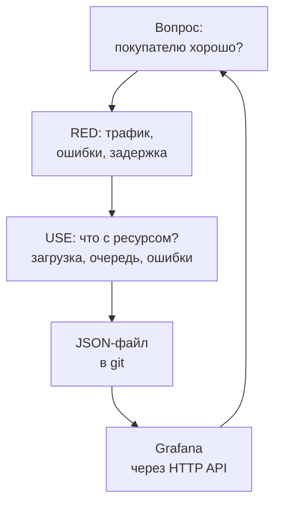
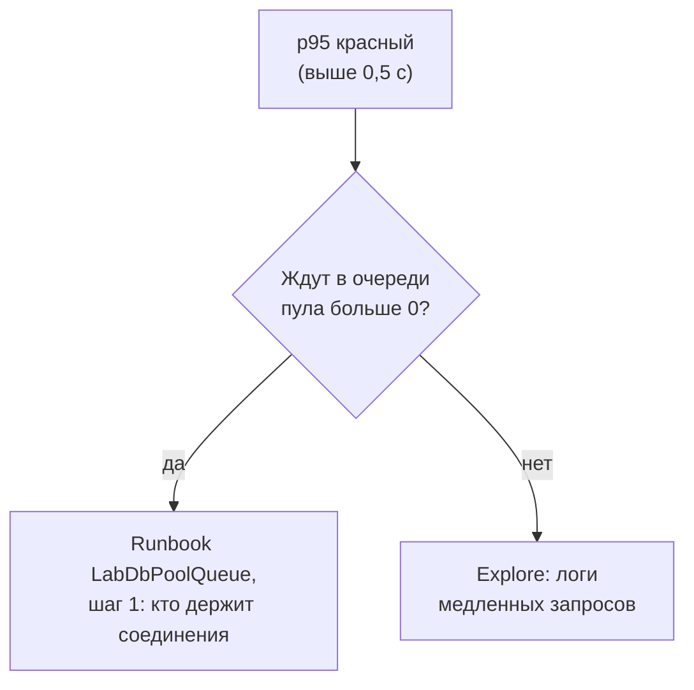

## Зачем это нужно

Середина первой недели в магазине. Метрики уже собираются, запросы к ним ты писать умеешь, но числа лежат в консоли Prometheus, и показать их менеджеру нельзя. Он просит одно: «Повесим экран на стену перед распродажей. Хочу глянуть и понять, всё ли хорошо». Я сижу рядом как опытный коллега и скажу честно: за фразой «глянуть и понять» прячется полдня работы.

Расскажу, как я сам однажды собрал дашборд (dashboard: страница с графиками, на которой всё о сервисе видно сразу). Сорок панелей (панель: один график или число на странице), красиво, у каждой своя палитра. На разборе меня спросили: «Покажи, где тут видно, что оплата тормозит». Я искал минуту и сорок секунд. За это время покупатель, у которого висел платёж, закрыл вкладку. Дашборд был полон правды, но не отвечал ни на один вопрос быстро. С тех пор я проверяю свои страницы так: человек, которого разбудили среди ночи, за десять секунд должен сказать, горит или нет, а потом за минуту понять, где.

Сегодня ты научишься делать такие страницы в Grafana. Сначала поймёшь, что на первом экране должно быть, а чего нет. Потом соберёшь два дашборда: RED (что чувствует покупатель) и USE (что творится с ресурсами). И главное, сохранишь их файлами, а не мышиными кликами: дашборд, которого нет в git, пропадёт вместе со стендом.

Шаг проекта: в `~/monitoring-lab/03-dashboards-alerts/dashboards` лежат два файла, `lab-red.json` и `lab-use.json`, и скрипты, которые загружают их в Grafana и выгружают обратно. Всё это лежит в git.

## Что нужно знать

- Три сигнала, RED и USE: [урок 1.1](../01-basics/01-signals.md). Цели по качеству и p95: [урок 1.2](../01-basics/02-sli-slo.md).
- Метрики и Prometheus, метки, типы метрик: [урок 2.1](../02-metrics/01-prometheus.md). `rate`, `sum by`, `histogram_quantile`: [урок 2.2](../02-metrics/02-promql.md). Откуда берутся метрики CPU, памяти и базы: [урок 2.3](../02-metrics/03-exporters.md).
- Стенд с профилем `monitoring` запущен, Grafana открывается на `http://localhost:3000`. Скрипт трафика `traffic.sh` из [урока 1.2](../01-basics/02-sli-slo.md), практика 1.
- `curl`, `jq`, `git`: [load-tester, урок 1.1](../../load-tester/01-linux/01-workstation-terminal.md) и [урок 3.1](../../load-tester/03-git/01-git-basics.md).

## Картина целиком

Представь приборную панель самолёта. Пилот не читает все датчики подряд. Сверху главные приборы: высота, скорость, курс. Взгляд скользнул, и ясно, что полёт идёт нормально. Ниже вспомогательные, на которые смотрят, когда главные что-то сказали. Дашборд устроен так же. Сверху то, что чувствует покупатель (RED), ниже то, что происходит с ресурсами (USE). А сама «панель» собирается по чертежу: чертёж это файл, и по нему приборную панель можно собрать заново.



Схема замкнута. Дашборд отвечает на вопрос, на него смотрят, правят, выгружают в файл и снова загружают. Ниже мы пройдём по каждому шагу: что класть на экран, как устроена панель, как не писать один и тот же дашборд на каждый маршрут и как не потерять результат.

## Теория

### Дашборд отвечает на вопрос, а не показывает всё

Открываешь незнакомый дашборд: сорок графиков, у каждого своя шкала. Что с магазином? Непонятно. Проблема не в цифрах, а в том, что страница не ответила на вопрос.

У нормального дашборда есть первый экран, и он отвечает на три вопроса подряд. «Горит или нет?» Это видно за десять секунд: ошибки, нагрузка и задержка покупателя. «Где именно?» Это за минуту: по маршрутам, по ресурсам. «Почему?» Это уже ниже, в панелях с ресурсами. Если после десяти секунд ты не знаешь, горит ли, страница плохая, как бы красиво она ни выглядела.

Простое правило: на первом экране пять-восемь панелей. Откуда число? За десять секунд глаз окидывает примерно столько блоков: ты читаешь заголовок, смотришь на график и идёшь дальше. Двенадцатая панель уже не успеет попасть в этот взгляд, а сорок превращаются в стену. Порядок сверху вниз повторяет ход мысли дежурного: сначала симптомы, потом ресурсы. Каждая панель с названием, в котором есть единица или смысл: «Доля 5xx», а не «Панель 7».

> **Прикинь сам:** на дашборде двенадцать графиков, и каждый вечер дежурный находит на нём проблему только через две-три минуты. Что ты сделаешь: добавишь ещё графиков или уберёшь лишние?
{: .predict}

Уберёшь. Двенадцать панелей оставь, но сгруппируй: четыре главные наверху (трафик, ошибки, p95, запросы в работе), остальные ниже под заголовком «Ресурсы». Минуты уйдут не на поиск, а на чтение. Добавление новых графиков только удлиняет страницу.

Осторожно: путают дашборд и расследование. Дашборд показывает, что нужно знать всегда. Когда нужен редкий запрос «а что с этим пользователем», его делают в Explore (режим свободных запросов в Grafana, мы к нему вернёмся), а не добавляют панель «на всякий случай».

> **Главное:** дашборд отвечает за десять секунд, горит ли, и за минуту, где; для этого на первом экране пять-восемь панелей в порядке «симптомы, потом ресурсы».
{: .key}

Чтобы собрать такую страницу, нужно понимать, из чего она состоит.

### Grafana: источник данных, запрос и панель

Grafana сама ничего не измеряет и не хранит. Это окно, через которое ты смотришь в чужое хранилище. Как телевизор: показывает то, что ему передали по кабелю.

Кабель называется **источником данных** (data source): настроенное подключение, в котором записано, куда Grafana ходит за числами. На стенде их четыре, и они подключены заранее:

- Prometheus хранит метрики;
- Loki хранит логи;
- Tempo хранит трейсы, то есть пути запросов через сервисы (подробно в теме 4);
- Alertmanager рассылает тревоги (подробно в уроке 3.2).

Сегодня нужен только Prometheus. У каждого источника есть `uid`, уникальное имя: у Prometheus оно равно `prometheus`, и панели ссылаются на источник именно по нему.

Теперь панель (panel): это один график или число на странице. Устроена она просто: запрос к источнику плюс вид (линия, столбцы, число, таблица). Запрос на PromQL, который ты писал в теме 2, вставляется в панель без изменений.

Теперь пример на «Магазине». Возьми запрос `sum by (route) (rate(http_requests_total[1m]))`. В консоли Prometheus он нарисует график, но без подписей осей и единиц. Если вставить тот же запрос в панель типа «Time series» с единицей `requests/sec`, получится «RPS по маршрутам»: по линии на каждый маршрут, подписи справа, значения при наведении мыши. Запрос тот же, а читать стало легче.

<div class="viz" data-viz="mon-panel" data-title='RPS по маршруту' data-query='sum by (route) (rate(http_requests_total[$__rate_interval]))' data-x='["14:00","14:01","14:02","14:03","14:04","14:05","14:06","14:07","14:08","14:09","14:10","14:11","14:12","14:13","14:14","14:15","14:16","14:17","14:18","14:19"]' data-series='[{"name":"/api/products","values":[1.54,1.52,1.63,1.62,1.63,1.57,1.59,1.67,1.66,1.55,1.56,1.52,1.64,1.51,1.63,1.69,1.67,1.58,1.66,1.53]},{"name":"/api/products/{id}","values":[1.52,1.54,1.64,1.53,1.69,1.67,1.65,1.59,1.66,1.55,1.62,1.58,1.6,1.69,1.55,1.65,1.65,1.52,1.69,1.59]},{"name":"/api/categories","values":[1.58,1.61,1.61,1.62,1.66,1.69,1.63,1.66,1.61,1.59,1.66,1.7,1.61,1.63,1.52,1.67,1.63,1.63,1.54,1.62]},{"name":"/api/cart/items","values":[0.17,0.16,0.16,0.16,0.15,0.16,0.15,0.15,0.15,0.15,0.16,0.15,0.16,0.16,0.17,0.16,0.17,0.16,0.16,0.17]},{"name":"/api/orders","values":[0.16,0.15,0.16,0.16,0.15,0.16,0.17,0.16,0.17,0.17,0.15,0.15,0.16,0.17,0.16,0.17,0.16,0.15,0.16,0.16]},{"name":"other","values":[0.16,0.16,0.17,0.16,0.17,0.15,0.16,0.15,0.15,0.15,0.16,0.15,0.16,0.16,0.15,0.16,0.16,0.16,0.16,0.15]}]' data-unit='req/s' data-stack='true' data-explain='Тот же запрос из консоли Prometheus, но в панели Time series с единицей req/s: линии по маршрутам, сложенные друг на друга.'></div>

Подписи, единицы и сложенные линии делают из ответа Prometheus картину. Сначала смотри на единицу в углу и на легенду: без них число на оси ничего не значит.


Чтобы пробовать запросы, у Grafana есть режим **Explore**: пустая страница с одним запросом, без дашборда. Здесь ищут ошибку в запросе, пока не готова панель. Хороший порядок такой: сначала запрос в Explore, убедился, что цифры верные, потом переносишь его в панель.

> **Главное:** Grafana только рисует, а числа берёт из источника данных; панель это запрос плюс вид, а запрос отлаживают в Explore.
{: .key}

Какие именно запросы класть на панели? Начнём с покупателя.

### RED на дашборде: ошибки, трафик, задержка

Вспомни из урока 1.1: RED это три вопроса о сервисе глазами покупателя. **R**ate: сколько запросов в секунду. **E**rrors: какая доля из них плохая. **D**uration: сколько они длятся. Каждому вопросу соответствует одна панель, и вместе они закрывают почти все жалобы покупателей.

Rate показывает, живёт ли магазин и идёт ли трафик: `sum by (route) (rate(http_requests_total[$__rate_interval]))`. Падение до нуля при обычном дне тоже сигнал, а не «всё чисто». Errors это доля, а не штуки: `(sum(rate(http_requests_total{status=~"5.."}[$__rate_interval])) or vector(0)) / clamp_min(sum(rate(http_requests_total[$__rate_interval])), 0.001)`. Почему доля? Двадцать ошибок в минуту при ста запросах это катастрофа, а при ста тысячах пустяк. Часть `or vector(0)` подставляет ноль, когда пятисотых нет совсем, иначе на графике «No data» вместо ровной линии. `clamp_min(..., 0.001)` не даёт делить на ноль, когда трафика нет.

Duration это квантили: `histogram_quantile(0.95, sum by (le) (rate(http_request_duration_seconds_bucket[$__rate_interval])))`. Рисуй минимум p50 и p95 на одной панели: p50 показывает типичного покупателя, p95 тех, кому хуже всего. Среднее на этой панели не нужно по причине, которую ты уже знаешь из 1.2: оно прячет хвост.

Один график запросов по маршрутам даёт ещё одну полезную картинку. Разброс задержек можно показать **heatmap** (тепловой картой): по горизонтали время, по вертикали корзины гистограммы, цвет это число запросов. Если p95 подозрительно скачет, на heatmap видно, выросли все запросы или у части появился «второй горб» медленных. Для первого экрана хватает линий.

Ниже живая модель дашборда RED/USE во время нагрузки. Наведи мышь на любой график: вертикальная линия появится на всех панелях в один момент, и причина свяжется со следствием.

<div class="viz" data-viz="obs-dashboard" data-scenario="payment"></div>

На картинке сценарий «медленная оплата». Сначала p95 прыгает ступенькой, а число запросов в работе растёт: запросы стоят и ждут оплату. Позже заполняется пул, появляются очередь и ошибки. Ошибки приходят последними, поэтому читать панели надо вместе, а не по одной.

> **Прикинь сам:** за минуту 600 запросов, из них 30 ответили `503`. Какая доля на панели Errors? Что покажет панель, если в минуту был один запрос и он упал?
{: .predict}

Тридцать на шестьсот: 5%. Один упавший из одного: 100%. Цифра честная, но на таком трафике бессмысленная. Поэтому у алертов, о которых мы поговорим в следующем уроке, всегда есть минимальный трафик, а на дашборде рядом стоит панель Rate: она подсказывает, что трафика почти нет и верить доле не стоит.

<div class="viz" data-viz="mon-stat" data-title='600 запросов в минуту' data-stats='[{"title":"Rate","value":10,"unit":"req/s","color":"green","spark":[9.9,10.3,9.9,9.8,10.3,10.2,10.2,9.6,9.9,9.9,9.8,9.9,9.8,10.0]},{"title":"Errors","value":5,"unit":"%","color":"orange","spark":[4.7,5.3,4.9,5.3,5.3,5.1,5.1,4.5,5.4,5.3,4.9,4.6,4.9,5.2],"sub":"30 из 600"}]' data-explain='Доля ошибок при нормальном трафике: цифра на что-то опирается.'></div>

<div class="viz" data-viz="mon-stat" data-title='Один запрос в минуту' data-stats='[{"title":"Rate","value":0.017,"unit":"req/s","color":"red","spark":[0.1,0.05,0.02,0.017,0.017,0.0,0.017,0.017],"sub":"почти нет трафика"},{"title":"Errors","value":100,"unit":"%","color":"red","spark":[0,0,0,0,100,100,100,100],"sub":"1 из 1"}]' data-explain='Тот же расчёт на одном запросе: доля стала стопроцентной, а за ней стоит единственный запрос.'></div>

Первая пара карточек говорит «5% из шестисот», вторая «100% из одного»: на второй Errors красный, но Rate подсказывает, что за ним почти ничего нет. Всегда смотри на Rate рядом с долей.


Осторожно: `status=~"5.."` это регулярное выражение «код из трёх символов, первый 5». Опечатка `status="5.."` (с равно вместо `=~`) молча вернёт пустоту: такого кода нет. График будет ровным нулём, и тебе покажется, что ошибок нет.

<div class="viz" data-viz="mon-panel" data-title='Доля 5xx: правильный и ошибочный селектор' data-query='{status=~"5.."} против {status="5.."}' data-x='["14:00","14:01","14:02","14:03","14:04","14:05","14:06","14:07","14:08","14:09","14:10","14:11","14:12","14:13","14:14","14:15","14:16","14:17","14:18","14:19"]' data-series='[{"name":"status=~\"5..\" (верно)","values":[0,0,0,0,0,0,0,0,0.84,0.76,0.91,0.77,0.89,0.65,0.76,0.65,0.61,0.64,0.69,0.67],"color":"orange"},{"name":"status=\"5..\" (опечатка)","values":[0,0,0,0,0,0,0,0,0,0,0,0,0,0,0,0,0,0,0,0],"color":"blue"}]' data-unit='%' data-annotations='[{"at":"14:08","text":"оплата: fail_rate 0.7"}]' data-explain='Сбой оплаты в магазине идёт, но линия с опечаткой в операторе лежит на нуле.'></div>

Оранжевая линия видит сбой, синяя считает тот же трафик и показывает ровный ноль. Если бы ты открыл только синюю, ты бы решил, что ошибок нет: сначала сверь оператор `=~` в запросе панели.


> **Главное:** RED это три панели: Rate (запросов в секунду), Errors (доля, а не штуки), Duration (p50 и p95, не среднее); читать их надо вместе.
{: .key}

RED описывает покупателя, но не объясняет причину. Для причины смотрят на ресурсы.

### USE на дашборде: загрузка, насыщение, ошибки ресурса

Сервис отвечает по пять секунд, а процессор показывает 12%. Где проблема? Не в процессоре. Значит, где-то очередь, а мы её не смотрим.

Представь кассу в магазине. Касса занята 100% времени, и очереди нет: покупатели подходят ровно как закончил предыдущий. Другая касса занята тоже на 100%, но у неё стоит очередь из десяти человек. Занятость одинаковая, а положение разное. Первое называют **загрузкой** (utilization): какую долю времени ресурс занят. Второе **насыщением** (saturation): сколько работы ждёт своей очереди. Третье: **ошибки** (errors) самого ресурса, например отказ выдать соединение. Метод USE (Utilization, Saturation, Errors) в том, чтобы для каждого ресурса посмотреть эти три вещи. Касса в этом сравнении перестаёт быть точной в одном: у кассы очередь видна глазами, а у ресурсов сервиса её приходится искать в метриках.

В «Магазине» ресурсы такие. Процессор хоста: загрузка `1 - avg(rate(node_cpu_seconds_total{mode="idle"}[$__rate_interval]))`. Процессор контейнера `shop`: `sum(rate(container_cpu_usage_seconds_total{container_label_com_docker_compose_service="shop"}[$__rate_interval]))`, число ядер в работе. Память: `sum(container_memory_working_set_bytes{container_label_com_docker_compose_service="shop"})`. А вот **пул соединений с базой**: набор из пяти заранее открытых «линий» в PostgreSQL, и главный ресурс всего стенда. Загрузка пула это сколько линий занято: `shop_db_pool_size - shop_db_pool_available`. Насыщение это `shop_db_pool_waiting`: сколько запросов ждут свободную линию. Ошибки пула это ответы `503` с причиной «database pool timeout», и их видно на панели Errors из RED.

Теперь разберём на цифрах. Пул из пяти соединений, все пять заняты: загрузка 5 из 5, 100%. Ждут двое: насыщение 2. Загрузка 100% сама по себе ещё не беда (касса без очереди). Беда, когда `waiting` больше нуля: именно тогда запросы замедляются и в конце концов падают с `503`. Поэтому для USE в первую очередь смотрят на насыщение: оно честнее загрузки.

<div class="viz" data-viz="obs-use-board" data-scenario="payment"></div>

Сценарий «медленная оплата» показывает самое неприятное: процессор и память в порядке, а пул забит. Если бы ты смотрел только на CPU, ты бы сказал «всё хорошо».

<div class="viz" data-viz="mon-panel" data-title='Пул БД' data-query='shop_db_pool_size, shop_db_pool_available, shop_db_pool_waiting' data-x='["14:00","14:01","14:02","14:03","14:04","14:05","14:06","14:07","14:08","14:09","14:10","14:11","14:12","14:13","14:14","14:15","14:16","14:17","14:18","14:19"]' data-series='[{"name":"shop_db_pool_size","values":[5,5,5,5,5,5,5,5,5,5,5,5,5,5,5,5,5,5,5,5],"color":"blue"},{"name":"shop_db_pool_available","values":[5,5,5,5,5,5,1,0,0,0,0,0,0,0,0,0,0,0,0,0],"color":"green"},{"name":"shop_db_pool_waiting","values":[0,0,0,0,0,0,1,3,3,3,3,3,3,3,3,3,3,3,3,3],"color":"red"}]' data-unit='' data-annotations='[{"at":"14:06","text":"8 покупателей, delay_ms 5000"}]' data-explain='Панель «Пул БД» стенда: размер пула, свободные соединения и очередь. Оплата стала медленной, и свободные кончились.'></div>

<div class="viz" data-viz="mon-panel" data-title='Ожидание соединения БД (p95)' data-query='histogram_quantile(0.95, sum by (le) (rate(shop_db_connection_wait_seconds_bucket[$__rate_interval])))' data-x='["14:00","14:01","14:02","14:03","14:04","14:05","14:06","14:07","14:08","14:09","14:10","14:11","14:12","14:13","14:14","14:15","14:16","14:17","14:18","14:19"]' data-series='[{"name":"p95 ожидания","values":[0.0019,0.0023,0.0019,0.0016,0.002,0.0022,0.4,4.88,4.85,4.85,4.86,4.94,4.86,4.88,4.93,4.91,4.97,4.9,4.89,4.92],"color":"red"}]' data-unit='s' data-thresholds='[{"value":5,"color":"red","label":"таймаут пула 5 с"}]' data-annotations='[{"at":"14:06","text":"8 покупателей, delay_ms 5000"}]' data-explain='Сколько запрос ждёт свободного соединения: в норме миллисекунды, в беде упирается в таймаут пула.'></div>

Зелёная линия упала в ноль, красная поднялась до трёх, а ожидание выросло с долей миллисекунды до пяти секунд, то есть до таймаута пула. Процессор при этом никуда не делся: беда видна только на панелях пула.


> **Прикинь сам:** пул 5 соединений, занято 5, ждут 0. Процессор 12%, p95 нормальный. Нужно ли будить дежурного?
{: .predict}

Нет. Пул загружен полностью, но очереди нет, а покупатели ничего не замечают. Это загрузка без насыщения. Если же `waiting` держится выше нуля минуту, будить пора: очередь значит, что запросы уже стоят.

Осторожно: «процессор загружен» не значит «процессор насыщен». Сто процентов без очереди задач ещё не беда, насыщение это очередь, а не проценты. На стенде очередь процессора отдельной метрикой не смотрим, поэтому для него хватит загрузки и задержки покупателя.

> **Главное:** для каждого ресурса смотри загрузку, насыщение (очередь) и ошибки; очередь честнее процентов, а пул соединений тоже ресурс.
{: .key}

У нас два набора панелей, RED и USE. Теперь надо сделать так, чтобы дашборд не дублировался на каждый маршрут.

### Переменные и окно rate: один дашборд на все маршруты

Менеджер просит: «А покажи только каталог». Копировать дашборд ради этого не надо. В Grafana есть **переменная** (variable): выпадающий список вверху страницы, значение которого подставляется в запросы. Переменная `route` берёт значения из метрик командой `label_values(http_requests_total, route)`: Grafana сама спросит у Prometheus, какие бывают значения метки `route`. В запросе она записывается как `$route`.

<div class="viz" data-viz="mon-table" data-title='Grafana: значения переменной route' data-query='label_values(http_requests_total, route)' data-columns='["route"]' data-rows='[["/api/cart/items"],["/api/categories"],["/api/orders"],["/api/products"],["/api/products/{id}"],["other"]]' data-highlight-col='0' data-highlight-row='3' data-explain='Список, который Grafana получает от Prometheus для выпадающего меню: по строке на каждое значение метки route.'></div>

Это и есть содержимое выпадающего списка «Маршрут»: Grafana спросила у Prometheus значения метки и ничего не придумывала. Выбранное значение попадает в запрос как есть.

Теперь самое тонкое. Если выбрано «All» или два маршрута, Grafana подставляет не слово, а регулярное выражение вроде `(/api/products|/api/orders)`. Поэтому селектор должен быть `route=~"$route"`: оператор `=~` понимает регулярное выражение. С обычным `=` панель покажет «No data», потому что значения метки «/api/products» и текста «(/api/products|/api/orders)» не совпадают буква в букву.

Вторая встроенная подстановка это `$__rate_interval`: окно для `rate`, которое Grafana подбирает сама. Зачем? Фиксированное `[1m]` ломается при увеличении масштаба. Если смотришь график за неделю, шаг точек вырастает до нескольких минут, а окно в минуту охватывает кусочек между точками, и график дырявый. Нужно окно, которое растёт вместе с шагом. Поэтому правило такое: `$__rate_interval` равен шагу точек плюс интервал опроса, но не меньше четырёх интервалов опроса. На стенде опрос раз в 5 секунд, значит окно не короче 20 секунд, и на любом масштабе в окне найдётся не меньше двух замеров.

> **Прикинь сам:** опрос раз в 5 секунд, ты смотришь график за час, шаг точек 15 секунд. Какое примерно окно подставит `$__rate_interval`?
{: .predict}

Шаг 15 секунд плюс интервал опроса 5 секунд: 20 секунд. Четыре интервала опроса тоже 20 секунд. Берётся большее, то есть 20 секунд (цифра приблизительная, как Grafana посчитает на твоём экране, смотри в панели Query inspector).

Осторожно: в переменной «All» по умолчанию подставляются все значения, которые были на момент загрузки. Если появится новый маршрут, а список старый, `refresh` у переменной должен быть «On time range change» или «On dashboard load», иначе новый маршрут не появится.

> **Главное:** переменная заменяет копии дашборда, но с ней в селекторе пиши `=~`, а окно для `rate` бери `$__rate_interval`.
{: .key}

### Ссылки и аннотации: дашборд внутри расследования

Дашборд редко живёт сам по себе. Человека к нему приводит тревога, а от него он идёт дальше: в логи, в трейсы, к инструкции. Если эти переходы нужно искать руками, десять секунд на ответ превращаются в десять минут. Поэтому хорошая панель знает, куда вести дальше.

Первое средство: **ссылка на панели** (data link). Ты задаёшь адрес, в который подставляется значение выбранной линии или переменная. Например, клик по линии маршрута `/api/orders` открывает дашборд логов уже с этим маршрутом. Второе средство: **ссылки дашборда** (dashboard links) в шапке: на runbook (инструкцию дежурному, подробно в уроке 3.2), на соседний дашборд, на карточку сервиса. Дежурный видит их сразу, без поиска по закладкам.

Третье средство: **аннотации** (annotations). Это вертикальные метки на всех графиках сразу: «в 14:05 выкатили версию 2.3», «в 14:32 сработал алерт». Они отвечают на самый частый вопрос разбора: «А что менялось перед тем, как стало плохо?» Без меток ты гадаешь по памяти, с метками видишь, что p95 вырос через минуту после выкатки.

Пример на цифрах. p95 оплаты подскочил с 0,2 до 1,8 с в 14:07. Метка выкатки стоит на 14:05. Два пункта на оси, две минуты разницы: подозреваем выкатку и проверяем её первой. Без метки то же самое занимает минут пятнадцать: опрос в чате и поиск в журнале деплоев.

Метки не обязательно ставить руками. Скрипт выкатки сам отправляет метку в Grafana запросом `POST /api/annotations` (текст, время, теги), а метки из алертов Grafana рисует сама. Договорись о тегах заранее: `deploy` для выкаток, `incident` для начала и конца инцидента, `config` для правок настроек вроде `delay_ms`. Тогда по тегу можно показать на дашборде только выкатки или только инциденты. Для разбора это самый дешёвый способ оставить след: через месяц по меткам видно, что и когда менялось, без поиска в чатах.

Осторожно: метка показывает совпадение во времени, а не причину. Выкатка и сбой могли совпасть случайно, и вывод надо проверить по логам и трейсам.

Ещё одна деталь, которая выручает ночью: **обновление и окно времени**. На дежурстве ставь окно «последние 3 часа» и автообновление раз в 30 секунд. Окно в 30 дней сглаживает минутную беду до незаметной точки, а окно в пять минут не показывает, как всё начиналось. Три часа обычно хватает, чтобы увидеть и начало беды, и текущее состояние. Для разбора задним числом окно растягивают вручную.

> **Главное:** ссылки ведут от симптома к деталям, аннотации отмечают события на всех графиках; вместе они сокращают путь от «плохо» к «почему».
{: .key}

### Красная панель должна подсказывать действие

Ночью дежурный открывает дашборд и видит красную панель «p95 задержки». Красная, и что дальше? Если ответ знает только автор дашборда, а он спит, панель громко сообщает о беде и ничем не помогает. Это как табло «Авария» в машине без инструкции: тревожно, но руки не знают, что делать.

Поэтому у дашборда есть ещё одно требование: **дашборд ведёт к действию** (actionable dashboard). У каждой панели, которая может покраснеть, есть ответ на вопрос «что делать первым». Для этого хватает трёх средств. Первое: **описание панели** (description в настройках): текст, который всплывает по значку «i» в углу, например «p95 выше 0,5 с: открой на lab-use панель "Ждут в очереди"; если там больше нуля, это runbook LabDbPoolQueue». Второе: **ссылка** на runbook или в Explore (мы разобрали её выше). Третье: порядок панелей: симптом стоит рядом с панелью, которая объясняет его причину, а не на другом конце страницы.



Схема это то, что дежурный должен прочитать с красной панели, не думая: одно условие и два пути. На ней нет ни одного «посмотри, что там», каждая ветка заканчивается конкретным местом.

<div class="viz" data-viz="mon-stat" data-title='Верх lab-red на 14:08: каждая красная карточка знает следующий шаг' data-stats='[{"title":"p95 задержки","value":9.3,"unit":"s","color":"red","sub":"→ очередь пула на lab-use","spark":[0.09,0.09,2.6,8.95,9.28]},{"title":"Ошибки 5xx","value":6.5,"unit":"%","color":"red","sub":"→ логи с status 503","spark":[0,0,0,1.2,6.5]},{"title":"Пул занят","value":5,"unit":"из 5","color":"red","sub":"→ runbook LabDbPoolQueue","spark":[1,1,5,5,5]},{"title":"Ждут в очереди","value":3,"unit":"запроса","color":"orange","sub":"→ кто держит соединения","spark":[0,0,2,3,3]}]' data-explain='Четыре карточки при медленной оплате: у каждой в подписи указано, куда идти дальше.'></div>

Подписи со стрелками на карточках это те самые подсказки. Красные p95, ошибки и занятость пула говорят «горит», а оранжевая очередь (три запроса сверх пяти соединений) указывает, откуда начать.

Пример на цифрах. Восемь покупателей оформляют заказы, пул даёт пять соединений: три заказа всегда ждут. Если на панели «Ждут в очереди» стоит 3 и в её описании написано «больше нуля: оплата держит соединения, смотри runbook», дежурный идёт к инструкции за секунды. Без описания он тратит минуты на вопрос «а это вообще плохо?».

> **Прикинь сам:** на дашборде есть панель «Число потоков в сервисе» с красным порогом. Что делать с ней ночью?
{: .predict}

Ничего разумного: ни действия, ни понятной нормы. Такая панель не должна быть красной на общем дашборде. Либо ей пишут описание с нормой и шагом, либо переносят в «Ресурсы» без порога, либо убирают: смотреть её можно в Explore, когда понадобится. Правило проверки простое: для каждой панели с порогом спроси «что сделает человек, который видит её красной в три часа ночи и не знает систему?». Нет ответа, значит панель не готова.

Осторожно: описание не заменяет runbook. В нём одна-две строки: что значит и куда идти. Шесть вопросов инструкции мы разберём в уроке 3.2.

> **Главное:** у каждой панели, которая может стать красной, должен быть ответ «что делать первым»: описание, ссылка на runbook и соседство с панелью-причиной.
{: .key}

Если панель и ведёт к действию, её всё равно можно испортить. Как это происходит, посмотрим на пяти частых ошибках.

### Чем дашборд портят: пять частых ошибок

Я видел много дашбордов, которые выглядели старательно и не помогали. Причины повторяются, и их проще знать заранее, чем находить во время аварии.

**Слишком много панелей.** Сорок графиков равны отсутствию ответа: глаз не знает, куда идти. Держи на первом экране пять-восемь панелей, остальное убери в свёрнутые строки (row) ниже.

**Среднее вместо перцентиля.** Средняя задержка скрывает медленный хвост: девяносто девять быстрых запросов вытащат среднее, а один покупатель ждёт десять секунд. Рисуй p95 (урок 1.2).

**Штуки вместо долей.** «Двенадцать ошибок» при трёх запросах в минуту катастрофа, при трёх тысячах пустяк. Для ошибок рисуй долю и рядом трафик.

**Нет единиц и порогов.** Число «0,43» без подписи читатель понимает по-разному: секунды, доля, штуки.

**Разные оси без причины.** Если у двух похожих панелей разный верх оси, они визуально врут: одинаковые линии означают разные значения. Для сравнимых панелей задавай одинаковые границы или явно подписывай.

> **Прикинь сам:** на дашборде одна панель, «ошибок за минуту: 12», зелёная. Хорошо ли это?
{: .predict}

Без трафика не понять. Если запросов 3000 в минуту, ошибок 0,4%, и это обычный день. Если запросов три, 12 ошибок значат, что магазин почти не отвечает. Поэтому рядом с ошибками всегда стоит доля и Rate.

Хороший признак зрелого дашборда: его читает тот, кто его не делал. Дай экран коллеге без объяснений и спроси «горит ли?». Если он отвечает за десять секунд, дашборд удался. Если спрашивает, что значит третья панель, подпись и единица на ней неудачные.

> **Главное:** первый экран короткий, задержку рисуют перцентилем, ошибки долей, единицы подписаны, оси честные.
{: .key}

Линии и данные есть. Осталось сделать так, чтобы взгляд сам цеплялся за плохое.

### Единицы, пороги и общее перекрестие

Смотреть на дашборд приходится боковым зрением. Если число «0,43» не отличается от «0,12», нужно думать, а на это нет времени. Три настройки делают панель читаемой.

**Единицы** (unit). Метрика отдаёт секунды, а ты привык читать «430 мс». Укажи для панели единицу `seconds (s)`, и Grafana сама покажет «430 ms». Для доли выбери `Percent (0.0-1.0)` (в файле это `percentunit`, 0,05 станет «5%»), для запросов в секунду `requests/sec (rps)`, для байтов `bytes (IEC)`. Без единицы на панели просто «0,43», и читатель не знает, секунды это или процент.

**Пороги** (thresholds) красят график или число, когда оно переходит границу: базовый цвет зелёный, жёлтый от 0,3 с, красный от 0,5 с. Пунктирная линия на графике показывает, где граница. Порог ничего не отправляет и никого не будит: он только краска. Оповещения это отдельная тема следующего урока.

**Общее перекрестие** (shared crosshair). В настройках дашборда поле Graph tooltip, значение Shared crosshair. Когда наводишь мышь на одну панель, вертикальная линия появляется на всех, в одно и то же время. Эту настройку ты видел в виджете выше. Цепочка «в 14:32:10 вырос p95, в ту же секунду очередь пула стала шесть» связывается сама.

Пример на цифрах. Цель из урока 1.2: p95 каталога не выше 300 мс. Ставим жёлтый порог 0,3 с и красный 0,5 с. Ступенчатый тест даёт p95 по ступеням: 0,08, 0,12, 0,25, 0,48, 0,95. Четвёртая точка уже жёлтая, последняя красная, и ответ на вопрос «на какой ступени мы нарушили цель» виден глазами.

<div class="viz" data-viz="mon-panel" data-title='p95 по ступеням теста' data-query='histogram_quantile(0.95, sum by (le) (rate(http_request_duration_seconds_bucket[$__rate_interval])))' data-x='["ступень 1","ступень 2","ступень 3","ступень 4","ступень 5"]' data-series='[{"name":"p95 каталога","values":[0.08,0.12,0.25,0.48,0.95],"color":"blue"}]' data-unit='s' data-thresholds='[{"value":0.3,"color":"yellow","label":"жёлтый от 0,3 с"},{"value":0.5,"color":"red","label":"красный от 0,5 с"}]' data-explain='Пять ступеней нагрузки и две границы: линия пересекает жёлтую на четвёртой ступени, красную на пятой.'></div>

Пунктиры показывают границы, и ответ виден глазом: цель нарушена на четвёртой ступени, где линия впервые выше жёлтого.


Отдельно о цветах. Красный нужен для одного: «так нельзя». Если на экране красного много, глаз перестаёт его замечать, как и звонок, который звонит каждый час. Поэтому пороги ставят по цели из урока 1.2, а не «чтобы было красиво», и красным красят только то, на что человек должен среагировать. Остальное остаётся спокойным: синий, серый, зелёный. Тогда красная панель среди спокойных читается без подписи, и дежурный находит её боковым зрением.

Проверить цвета можно просто: распечатай экран в чёрно-белом или попроси коллегу с нарушенным цветовым зрением взглянуть на него. Если пороги читаются только по цвету, добавь пунктирную линию границы и подпись. Тогда дашборд понятен всем, а не только тем, кто видит красный и зелёный одинаково.

> **Главное:** единицы делают числа читаемыми, пороги красят границу без оповещений, общее перекрестие связывает причину и следствие в одну секунду.
{: .key}

### Честные метрики: зелёный экран при сломанном пути покупателя

Представь охранника на проходной магазина. Он проверяет одно: дверь открыта, свет горит. Ставит зелёную галочку и идёт пить чай. А в зале не работает касса, и покупатели уходят с полными корзинами. По его журналу день прошёл идеально.

Так же ведут себя метрики, которые измеряют «живость» процесса, а не результат для покупателя. Такие метрики называют **нечестными**: они не врут по цифрам, но создают ложное чувство безопасности. На стенде это видно сразу. Метрика `up` равна 1, пока Prometheus получает ответ от `/metrics`. Адрес `/healthz` магазина отвечает `{"status":"ok"}`, пока жив процесс: в базу и в оплату он не заглядывает. Включи замедление оплаты на пять секунд, и обе проверки останутся зелёными, а заказы начнут падать с 503.

<div class="viz" data-viz="mon-panel" data-title='Два взгляда на один магазин: процесс жив и покупатель доволен' data-query='avg(up{job="shop"}) * 100 и 100 * (1 - 5xx / все запросы)' data-x='["14:00","14:01","14:02","14:03","14:04","14:05","14:06","14:07","14:08","14:09","14:10","14:11","14:12","14:13","14:14","14:15","14:16","14:17","14:18","14:19"]' data-series='[{"name":"up: цель отвечает (%)","values":[100,100,100,100,100,100,100,100,100,100,100,100,100,100,100,100,100,100,100,100],"color":"green"},{"name":"доля ответов без 5xx (%)","values":[100,100,100,100,100,100,100,98.8,93.5,94.5,94.0,94.0,94.9,95.2,94.2,95.1,94.6,93.7,93.7,95.1],"color":"red"}]' data-unit='%' data-thresholds='[{"value":99,"color":"red","label":"SLO 99%"}]' data-annotations='[{"at":"14:06","text":"8 покупателей, delay_ms 5000"}]' data-explain='Та же поломка оплаты: линия up ровная и зелёная, а доля ответов без ошибок упала ниже цели.'></div>

Зелёная линия `up` лежит на ста процентах всю дорогу, а красная после 14:06 опускается к 94 и ниже цели в 99. Дашборд, на котором была бы только первая, показал бы «всё хорошо» ровно тогда, когда покупателям плохо.

Честный дашборд подчиняется трём правилам. **Первое: измеряй путь покупателя, а не процесс.** Доля успешных ответов на `/api/orders`, p95 заказа и проба, которая раз в минуту проходит путь «вошёл, положил в корзину, оформил» целиком (синтетическая проверка, blackbox из урока 2.3), честнее, чем «процесс жив». Проверка живости нужна, но как причина для расследования, а не как итог. **Второе: считай все ошибки, которые видит покупатель.** Не только 5xx: отказы входа 401 и 403 из-за сбоя провайдера авторизации, таймауты и пустые ответы тоже поломка с его точки зрения (подробнее про SLI в уроке 1.2). **Третье: «нет данных» не значит «зелёный».** Если метрика пропала, панель молчит, и это легко принять за тишину. Подпиши такое состояние явно (у панели Stat есть поле No value), а пропажу ловят правилом на `absent()` и `up == 0`.

> **Прикинь сам:** все панели зелёные: `up` равен 1, `/healthz` отвечает 200, процессор 12%. А поддержка пишет, что заказ не оформляется. Чего на дашборде не хватает?
{: .predict}

Не хватает панелей результата: доли успешных ответов на заказах, задержки заказа и, лучше всего, пробы, которая проходит путь покупателя. Всё, что есть на дашборде, измеряет здоровье серверов, а жалоба про заказ. Эти две вещи расходятся именно в самые плохие минуты.

Осторожно: честность стоит дорого. Проба ходит в боевой путь, и ей нужен тестовый покупатель, чтобы не плодить настоящие заказы. Начни с доли успешных ответов по ключевому маршруту: она бесплатна, метрика уже есть.

> **Главное:** зелёная проверка живости не доказывает, что покупателю хорошо; меряй результат (доля успешных заказов, p95), считай все ошибки покупателя и не путай «нет данных» с «всё хорошо».
{: .key}

Дашборд готов и работает. Но час работы мышью исчезнет с первым `docker compose down -v`.

### Дашборд как код: JSON в git

Ты час собирал дашборд мышью, а потом пересоздал стенд. Том с данными Grafana удалился, и страница пропала. Хранить результат надо там, где он переживёт стенд: в файле и в git. Это называют «дашборд как код» (dashboards as code): файл можно проверить глазами, сравнить с прошлой версией, откатить и перенести на другой компьютер.

Внутри Grafana дашборд это один документ в формате JSON (текст из пар «ключ: значение» с вложенностью). В нём заголовок, переменные и список панелей. У каждой панели есть запросы и место на странице: `gridPos` (положение на сетке, grid position), сетка шириной 24 колонки, с полями `x`, `y`, `w`, `h`. Панель шириной 12 занимает половину экрана, две подряд дают строку.

У Grafana есть HTTP API (запросы по сети вместо кликов). На стенде анонимный вход получает роль Admin, поэтому токен не нужен (так безопасно только на локальном стенде). Две операции хватает на всё: `GET /api/dashboards/uid/<uid>` возвращает дашборд, `POST /api/dashboards/db` создаёт или обновляет его.

Эталонный дашборд стенда `shop-overview` приходит другим путём: Grafana читает его из каталога на диске (это называют **provisioning**, настройки раздаются файлами: Grafana берёт их из файлов при старте, а не из кликов в интерфейсе). Файл остаётся источником правды, и при его изменении Grafana загружает версию из файла. Поэтому свой дашборд ты делаешь под другим `uid`, например `lab-red`. `uid` это имя, по которому дашборд находят в адресе и API. Есть ещё числовой `id`: он принадлежит конкретной базе Grafana, и при загрузке в другую его нужно обнулить (`id: null`).

Правильный цикл такой: правишь мышью, выгружаешь в файл, коммитишь. Файл обновился, история сохранилась. Если Grafana потеряла дашборд, ты загружаешь его скриптом за секунду.

Осторожно: путают «Save dashboard» в интерфейсе и git. Кнопка сохраняет дашборд только в базу Grafana. В git ничего не попадает, пока ты не выгрузил и не закоммитил.

> **Главное:** дашборд это JSON; храни его в git, загружай и выгружай через API, свой делай под другим `uid`, чем у эталона.
{: .key}

Теперь соберём всё это руками. Прежде вернёмся к менеджеру: после практики у тебя будет экран, глядя на который за десять секунд видно, горит магазин или нет.

## Практика

Файлы кладём в `~/monitoring-lab/03-dashboards-alerts`. Нагрузку и поломки делаем только на своём локальном стенде. Стенд запущен с профилем `monitoring` (урок 1.1). Все числа в блоках «Что должно получиться» это пример: у тебя они будут другими.

### 1. Открой эталонный дашборд и найди в нём RED и USE

Подготовим папку и запустим фоновый трафик:

```bash
mkdir -p ~/monitoring-lab/03-dashboards-alerts/{dashboards,scripts}
cd ~/monitoring-lab/01-basics && ./traffic.sh 600 > /dev/null 2>&1 &
```

Второй командой `traffic.sh` из урока 1.2 уходит в фон (`&`): он будет крутить каталог, карточки и заказы несколько минут. Открой `http://localhost:3000/d/shop-overview`. Это эталонный дашборд «Магазин: обзор (эталон)». Вход не нужен: на стенде включён анонимный доступ с правами администратора, и это допустимо только на локальном стенде.

Проверь источник данных: в меню Connections открой Data sources, выбери Prometheus и внизу нажми Save & test. Должно появиться зелёное сообщение, что запрос к API Prometheus прошёл.

Теперь запиши в `~/monitoring-lab/03-dashboards-alerts/dashboard-notes.md`: какая из двенадцати панелей отвечает за R, какая за E, какая за D, какие панели относятся к USE и чем «Пул БД» отличается от «Ожидания соединения БД». Подсказка: меню панели (три точки), пункт Edit, внизу виден запрос.

**Что должно получиться:** на «RPS по маршруту» несколько линий, у каждой от долей до пары запросов в секунду, «Доля HTTP 5xx» около нуля, на «Пул БД» три линии: размер пула, свободные и ожидающие. Ожидающих почти всегда ноль.

**Как читать вывод:** по картинке видно, что стенд живой: трафик идёт, ошибок нет, пул не ждёт. Это и есть «норма» (базовая линия), с которой ты будешь сравнивать поломку в практике 5.

**Типичные ошибки:**

- «No data» на всех панелях: Prometheus недоступен или пуст. Проверь `curl -s localhost:9090/-/ready`, затем Status, Targets в интерфейсе Prometheus.
- Пустая только панель «CPU контейнера shop»: на Docker Desktop у cAdvisor метки контейнеров бывают другими. Для урока это допустимо.

### 2. Скрипты загрузки и выгрузки

Два маленьких скрипта обслуживают весь цикл «правишь мышью, выгружаешь в файл»:

```bash
cd ~/monitoring-lab/03-dashboards-alerts/scripts
cat > dash-import.sh <<'EOF'
#!/usr/bin/env bash
# dash-import.sh файл.json: создать или обновить дашборд в локальной Grafana
set -euo pipefail
jq '{dashboard: (.id = null), overwrite: true}' "$1" \
  | curl -s -X POST localhost:3000/api/dashboards/db \
      -H 'Content-Type: application/json' -d @- \
  | jq -r '"\(.status // .message)  http://localhost:3000\(.url // "")"'
EOF
cat > dash-export.sh <<'EOF'
#!/usr/bin/env bash
# dash-export.sh uid > файл.json: выгрузить дашборд из локальной Grafana
set -euo pipefail
curl -fsS "localhost:3000/api/dashboards/uid/$1" | jq -e '.dashboard | .id = null | del(.version)'
EOF
chmod +x dash-*.sh
```

Разберём. `cat > файл <<'EOF' ... EOF` записывает всё между метками в файл, одинарные кавычки вокруг `EOF` запрещают оболочке подставлять переменные заранее. В `dash-import.sh` фильтр `jq` упаковывает файл в тело запроса: `{"dashboard": <файл с id=null>, "overwrite": true}`. Труба `|` отдаёт его в `curl`, где `-d @-` значит «тело прочитай из стандартного ввода». Последний `jq` печатает статус и адрес. В `dash-export.sh` из ответа API берётся только поле `dashboard`, обнуляется `id` и убирается `version`: эти поля принадлежат конкретной базе. Ключ `-f` у `curl` заставляет его завершиться с ошибкой на ответе 404 или 401, а `-e` у `jq` даёт ненулевой код, если результат `null`: тогда `&& mv` ниже не выполнится и рабочий файл не затрётся.

**Что должно получиться:** команда ничего не печатает. Проверь, что файлы на месте: `ls ~/monitoring-lab/03-dashboards-alerts/scripts` покажет `dash-export.sh dash-import.sh`.

**Типичные ошибки:**

- `Permission denied` при запуске: не сделал `chmod +x`.
- `curl: (7) Failed to connect to localhost port 3000`: Grafana не запущена, проверь `docker compose --profile monitoring ps` в `~/learning/load-tester/project/shop`.

### 3. Дашборд lab-red как файл

Создай файл. Это RED: переменная маршрута и четыре панели (трафик, ошибки, задержка, запросы в работе), пороги на p95 и общее перекрестие.


```bash
cat > ~/monitoring-lab/03-dashboards-alerts/dashboards/lab-red.json <<'EOF'
{
  "uid": "lab-red",
  "title": "Моя лаборатория: RED",
  "tags": ["lab"],
  "schemaVersion": 39,
  "refresh": "5s",
  "graphTooltip": 1,
  "time": { "from": "now-15m", "to": "now" },
  "templating": {
    "list": [
      {
        "name": "route",
        "label": "Маршрут",
        "type": "query",
        "datasource": { "type": "prometheus", "uid": "prometheus" },
        "query": { "query": "label_values(http_requests_total, route)", "refId": "route" },
        "refresh": 2,
        "multi": true,
        "includeAll": true,
        "current": { "text": "All", "value": "$__all" }
      }
    ]
  },
  "panels": [
    {
      "id": 1, "type": "timeseries", "title": "Rate: запросов в секунду",
      "gridPos": { "x": 0, "y": 0, "w": 12, "h": 8 },
      "datasource": { "type": "prometheus", "uid": "prometheus" },
      "fieldConfig": { "defaults": { "unit": "reqps" }, "overrides": [] },
      "targets": [
        { "refId": "A", "legendFormat": "{{route}}",
          "expr": "sum by (route) (rate(http_requests_total{route=~\"$route\"}[$__rate_interval]))" }
      ]
    },
    {
      "id": 2, "type": "timeseries", "title": "Errors: доля 5xx",
      "gridPos": { "x": 12, "y": 0, "w": 12, "h": 8 },
      "datasource": { "type": "prometheus", "uid": "prometheus" },
      "fieldConfig": { "defaults": { "unit": "percentunit", "min": 0 }, "overrides": [] },
      "targets": [
        { "refId": "A", "legendFormat": "5xx",
          "expr": "(sum(rate(http_requests_total{route=~\"$route\",status=~\"5..\"}[$__rate_interval])) or vector(0)) / clamp_min(sum(rate(http_requests_total{route=~\"$route\"}[$__rate_interval])), 0.001)" }
      ]
    },
    {
      "id": 3, "type": "timeseries", "title": "Duration: p50 и p95",
      "gridPos": { "x": 0, "y": 8, "w": 12, "h": 8 },
      "datasource": { "type": "prometheus", "uid": "prometheus" },
      "fieldConfig": {
        "defaults": {
          "unit": "s", "min": 0,
          "thresholds": { "mode": "absolute", "steps": [
            { "color": "green", "value": null },
            { "color": "yellow", "value": 0.3 },
            { "color": "red", "value": 0.5 } ] },
          "custom": { "thresholdsStyle": { "mode": "line" } }
        },
        "overrides": []
      },
      "targets": [
        { "refId": "A", "legendFormat": "p50",
          "expr": "histogram_quantile(0.5, sum by (le) (rate(http_request_duration_seconds_bucket{route=~\"$route\"}[$__rate_interval])))" },
        { "refId": "B", "legendFormat": "p95",
          "expr": "histogram_quantile(0.95, sum by (le) (rate(http_request_duration_seconds_bucket{route=~\"$route\"}[$__rate_interval])))" }
      ]
    },
    {
      "id": 4, "type": "timeseries", "title": "Запросы в работе",
      "gridPos": { "x": 12, "y": 8, "w": 12, "h": 8 },
      "datasource": { "type": "prometheus", "uid": "prometheus" },
      "fieldConfig": { "defaults": { "unit": "short", "min": 0 }, "overrides": [] },
      "targets": [
        { "refId": "A", "legendFormat": "в работе", "expr": "sum(http_requests_in_progress)" }
      ]
    }
  ]
}
EOF
```


Проверь, что JSON корректный, и загрузи дашборд:

```bash
jq -e '.panels | length' ~/monitoring-lab/03-dashboards-alerts/dashboards/lab-red.json
~/monitoring-lab/03-dashboards-alerts/scripts/dash-import.sh ~/monitoring-lab/03-dashboards-alerts/dashboards/lab-red.json
```

Устройство файла. `uid` это имя дашборда, у эталона оно другое. `graphTooltip: 1` включает общее перекрестие. `templating.list` описывает переменную `route`. У каждой панели есть `datasource` с `uid: prometheus`, единица в `fieldConfig.defaults.unit`, запросы в `targets[].expr`, подписи линий в `legendFormat` (формат легенды: что написать рядом с линией, чтобы отличить её от других). Порог в панели Duration задан двумя ступенями поверх зелёного. Фигурные скобки `{{route}}` в `legendFormat` это шаблон Grafana: он подставит имя маршрута.

**Что должно получиться** (адрес пример):

```text
4
success  http://localhost:3000/d/lab-red/moya-laboratoriya-red
```

**Как читать вывод:** `4` это число панелей, `jq -e` падает, если JSON сломан. `success` значит, что Grafana приняла дашборд. Открой адрес: четыре панели с живыми данными, вверху список «Маршрут».

**Типичные ошибки:**

- `parse error: Expected separator between values at line 12, column 9`: пропущена запятая или кавычка около названной строки.
- Панели пусты, в углу красный треугольник: наведи мышь, там текст ошибки. Чаще всего опечатка в запросе или другой `datasource`.
- Нет ответа `success`, а есть сообщение вроде `invalid dashboard UID`: в файле лишняя обёртка `dashboard/meta` от ручной выгрузки. `jq` на такой файл не упадёт, а Grafana откажет. Достань содержимое: `jq .dashboard`.

### 4. Дашборд lab-use: ресурсы

Теперь второй дашборд, USE. Здесь нет переменных, зато пул соединений получает две линии: занято и очередь.

```bash
cat > ~/monitoring-lab/03-dashboards-alerts/dashboards/lab-use.json <<'EOF'
{
  "uid": "lab-use",
  "title": "Моя лаборатория: USE",
  "tags": ["lab"],
  "schemaVersion": 39,
  "refresh": "5s",
  "graphTooltip": 1,
  "time": { "from": "now-15m", "to": "now" },
  "panels": [
    {
      "id": 1, "type": "timeseries", "title": "Пул БД: занято и очередь",
      "gridPos": { "x": 0, "y": 0, "w": 12, "h": 8 },
      "datasource": { "type": "prometheus", "uid": "prometheus" },
      "fieldConfig": { "defaults": { "unit": "short", "min": 0 }, "overrides": [] },
      "targets": [
        { "refId": "A", "legendFormat": "занято", "expr": "shop_db_pool_size - shop_db_pool_available" },
        { "refId": "B", "legendFormat": "ждут (очередь)", "expr": "shop_db_pool_waiting" }
      ]
    },
    {
      "id": 2, "type": "timeseries", "title": "Ожидание соединения БД: p95",
      "gridPos": { "x": 12, "y": 0, "w": 12, "h": 8 },
      "datasource": { "type": "prometheus", "uid": "prometheus" },
      "fieldConfig": { "defaults": { "unit": "s", "min": 0 }, "overrides": [] },
      "targets": [
        { "refId": "A", "legendFormat": "p95",
          "expr": "histogram_quantile(0.95, sum by (le) (rate(shop_db_connection_wait_seconds_bucket[$__rate_interval])))" }
      ]
    },
    {
      "id": 3, "type": "timeseries", "title": "CPU хоста: загрузка",
      "gridPos": { "x": 0, "y": 8, "w": 8, "h": 8 },
      "datasource": { "type": "prometheus", "uid": "prometheus" },
      "fieldConfig": { "defaults": { "unit": "percentunit", "min": 0, "max": 1 }, "overrides": [] },
      "targets": [
        { "refId": "A", "legendFormat": "хост",
          "expr": "1 - avg(rate(node_cpu_seconds_total{mode=\"idle\"}[$__rate_interval]))" }
      ]
    },
    {
      "id": 4, "type": "timeseries", "title": "CPU контейнера shop, ядра",
      "gridPos": { "x": 8, "y": 8, "w": 8, "h": 8 },
      "datasource": { "type": "prometheus", "uid": "prometheus" },
      "fieldConfig": { "defaults": { "unit": "short", "min": 0 }, "overrides": [] },
      "targets": [
        { "refId": "A", "legendFormat": "shop",
          "expr": "sum(rate(container_cpu_usage_seconds_total{container_label_com_docker_compose_service=\"shop\"}[$__rate_interval]))" }
      ]
    },
    {
      "id": 5, "type": "timeseries", "title": "Память контейнера shop",
      "gridPos": { "x": 16, "y": 8, "w": 8, "h": 8 },
      "datasource": { "type": "prometheus", "uid": "prometheus" },
      "fieldConfig": { "defaults": { "unit": "bytes", "min": 0 }, "overrides": [] },
      "targets": [
        { "refId": "A", "legendFormat": "shop",
          "expr": "sum(container_memory_working_set_bytes{container_label_com_docker_compose_service=\"shop\"})" }
      ]
    },
    {
      "id": 6, "type": "timeseries", "title": "Соединения PostgreSQL",
      "gridPos": { "x": 0, "y": 16, "w": 12, "h": 8 },
      "datasource": { "type": "prometheus", "uid": "prometheus" },
      "fieldConfig": { "defaults": { "unit": "short", "min": 0 }, "overrides": [] },
      "targets": [
        { "refId": "A", "legendFormat": "numbackends",
          "expr": "sum(pg_stat_database_numbackends{datname=\"shop\"})" }
      ]
    },
    {
      "id": 7, "type": "timeseries", "title": "Ошибки: 5xx по кодам",
      "gridPos": { "x": 12, "y": 16, "w": 12, "h": 8 },
      "datasource": { "type": "prometheus", "uid": "prometheus" },
      "fieldConfig": { "defaults": { "unit": "reqps", "min": 0 }, "overrides": [] },
      "targets": [
        { "refId": "A", "legendFormat": "5xx",
          "expr": "sum(rate(http_requests_total{status=~\"5..\"}[$__rate_interval])) or vector(0)" }
      ]
    }
  ]
}
EOF
jq -e '.panels | length' ~/monitoring-lab/03-dashboards-alerts/dashboards/lab-use.json
~/monitoring-lab/03-dashboards-alerts/scripts/dash-import.sh ~/monitoring-lab/03-dashboards-alerts/dashboards/lab-use.json
```

В `legendFormat` нет шаблонов с двойными скобками: подписи заданы обычным текстом, поэтому оборачивать его в защиту от шаблонов не нужно. Раскладка по строкам такая. Верхняя строка про главный ресурс стенда, пул: загрузка и очередь рядом с ожиданием. Средняя про процессор и память. Нижняя про базу и ошибки.

**Что должно получиться** (пример):

```text
7
success  http://localhost:3000/d/lab-use/moya-laboratoriya-use
```

**Как читать вывод:** семь панелей. На открытой странице «занято» колеблется между нулём и парой единиц, «ждут» держится на нуле, p95 ожидания в миллисекундах, CPU хоста небольшой.

**Типичные ошибки:**

- «Память контейнера shop» и CPU контейнера пусты: метка cAdvisor `container_label_com_docker_compose_service` на твоей машине называется иначе. Открой Explore и введи `container_memory_working_set_bytes`, посмотри метки у реальных рядов.
- Все панели пустые, но вверху нет ошибок: период слишком короткий для окна `rate`. Выбери «Last 15 minutes».

### 5. Поломка оплаты: читаем дашборд глазами

Теперь главное: проверим, что за десять секунд ты видишь, что магазин горит. Для нагрузки нужен скрипт, который оформляет заказы подряд. Заведи его:

```bash
cat > ~/monitoring-lab/03-dashboards-alerts/orders.sh <<'EOF'
#!/usr/bin/env bash
# orders.sh НОМЕР СЕКУНДЫ: один «покупатель» user000N оформляет заказы подряд
set -u
BASE=${BASE:-http://localhost:8000}
N=$(printf '%04d' "$1"); END=$((SECONDS + ${2:-120}))
TOKEN=$(curl -fsS "$BASE/api/login" -H 'Content-Type: application/json' \
  -d "{\"email\":\"user${N}@shop.lab\",\"password\":\"password\"}" | jq -er .token)
[ -n "$TOKEN" ] || { echo "не удалось войти: запущен ли стенд?"; exit 1; }
while (( SECONDS < END )); do
  curl -s -o /dev/null "$BASE/api/cart/items" -H "Authorization: Bearer $TOKEN" \
    -H 'Content-Type: application/json' -d "{\"product_id\":$((RANDOM % 10000 + 1)),\"qty\":1}"
  curl -s -o /dev/null -X POST "$BASE/api/orders" -H "Authorization: Bearer $TOKEN"
done
EOF
chmod +x ~/monitoring-lab/03-dashboards-alerts/orders.sh
```

Открой оба дашборда (`lab-red` и `lab-use`) в двух вкладках, запиши в заметки базовую линию (Rate, p95, очередь). Затем запусти восемь «покупателей» и замедли оплату:

```bash
cd ~/monitoring-lab/03-dashboards-alerts
for i in 1 2 3 4 5 6 7 8; do ./orders.sh "$i" 180 & done
curl -s -X POST localhost:8001/admin/config -H 'Content-Type: application/json' -d '{"delay_ms": 5000}'
curl -s localhost:3000/api/annotations -H 'Content-Type: application/json' \
  -d '{"dashboardUID":"lab-red","tags":["incident"],"text":"оплата: delay_ms 5000"}'
```

Первая строка запускает восемь копий скрипта в фоне, каждая под своим пользователем. Вторая (`POST /admin/config`) делает оплату медленной на лету: каждая оплата ждёт 5 секунд. Заказ держит соединение с базой, пока ждёт оплату, а в пуле их только пять. Третья команда ставит на `lab-red` аннотацию с тегом `incident` в текущий момент (поле `time` не задано, берётся «сейчас»), как это сделал бы скрипт выкатки.

**Что должно получиться** (ответ оплаты и картина на экране, цифры пример):

```text
{"delay_ms":5000.0,"fail_rate":0.0}
{"id":1,"message":"Annotation added"}
```

На обоих дашбордах видна вертикальная метка «оплата: delay_ms 5000» (если нет, проверь в настройках дашборда, раздел Annotations: должен стоять встроенный запрос «Annotations & Alerts»). На `lab-use` через 10-20 секунд «занято» упрётся в пять, «ждут (очередь)» станет больше нуля. На `lab-red` p95 уйдёт вверх к пяти секундам и выше (гистограмма округляет вверх внутри корзины от 5 до 10 с). Позже, через 20-40 секунд, на Errors появится доля `5xx`. CPU хоста и памяти контейнера почти не изменятся.

**Как читать вывод:** примерно в таком порядке: очередь (причина), задержка (боль), ошибки (отказ). Процессор в норме: без панели пула ты бы не нашёл причину. Запиши в `dashboard-notes.md` три строки: что выросло первым, что вторым, что не изменилось. Затем верни оплату и подожди минуту:

<div class="viz" data-viz="mon-panel" data-title='Duration: p95 всего магазина' data-query='histogram_quantile(0.95, sum by (le) (rate(http_request_duration_seconds_bucket[$__rate_interval])))' data-x='["14:00","14:01","14:02","14:03","14:04","14:05","14:06","14:07","14:08","14:09","14:10","14:11","14:12","14:13","14:14","14:15","14:16","14:17","14:18","14:19"]' data-series='[{"name":"p95","values":[0.092,0.084,0.099,0.098,0.089,0.093,2.6,8.95,9.28,8.97,9.35,9.28,9.12,9.28,9.25,8.88,9.22,9.28,9.21,9.47],"color":"red"}]' data-unit='s' data-annotations='[{"at":"14:06","text":"8 покупателей, delay_ms 5000"}]' data-thresholds='[{"value":0.3,"color":"orange","label":"цель 300 мс"}]' data-explain='Экран lab-red: задержка уходит от долей секунды к верху корзины гистограммы (5-10 с), потому что заказы ждут оплату.'></div>

<div class="viz" data-viz="mon-panel" data-title='Errors: доля 5xx' data-query='(sum(rate(http_requests_total{status=~"5.."}[$__rate_interval])) or vector(0)) / clamp_min(sum(rate(http_requests_total[$__rate_interval])), 0.001)' data-x='["14:00","14:01","14:02","14:03","14:04","14:05","14:06","14:07","14:08","14:09","14:10","14:11","14:12","14:13","14:14","14:15","14:16","14:17","14:18","14:19"]' data-series='[{"name":"5xx / все запросы","values":[0,0,0,0,0,0,0,1.2,6.5,5.5,6.0,6.0,5.1,4.8,5.8,4.9,5.4,6.3,6.3,4.9],"color":"orange"}]' data-unit='%' data-annotations='[{"at":"14:06","text":"8 покупателей, delay_ms 5000"}]' data-thresholds='[{"value":5,"color":"red","label":"порог ShopHighErrorRate"}]' data-explain='Ошибки приходят последними: сначала очередь и задержка, потом первые 503 из-за таймаута пула.'></div>

Порядок событий виден по флажку: очередь и задержка поднялись сразу, ошибки позже, когда запросы начали упираться в таймаут пула. Ошибки на дашборде появились последними, а причина (пул) уже стояла на экране раньше всех.

Теперь откроем лог и посмотрим на тех, кто пострадал:

<div class="viz" data-viz="mon-logs" data-title='Explore: Loki' data-query='{service="shop"} |= "/api/orders"' data-lines='[{"ts":"2026-10-04 14:09:12.604","level":"error","labels":{"service":"shop","container":"shop-shop-1","level":"ERROR"},"line":"{\"ts\": \"2026-10-04T14:09:12.604000+00:00\", \"level\": \"ERROR\", \"msg\": \"Запрос завершён\", \"method\": \"POST\", \"route\": \"/api/orders\", \"path\": \"/api/orders\", \"status\": 503, \"duration_ms\": 5004.8, \"request_id\": \"613ecf01beb67fa8c77e1c7012cb68f2\", \"trace_id\": \"cf9558c93895ee97fbab40909ea1c8ac\", \"user_id\": 3, \"error\": \"couldn\u0027t get a connection after 5.00 sec\"}"},{"ts":"2026-10-04 14:09:11.230","level":"warning","labels":{"service":"shop","container":"shop-shop-1","level":"WARNING"},"line":"{\"ts\": \"2026-10-04T14:09:11.230000+00:00\", \"level\": \"WARNING\", \"msg\": \"Запрос завершён\", \"method\": \"POST\", \"route\": \"/api/orders\", \"path\": \"/api/orders\", \"status\": 201, \"duration_ms\": 5143.2, \"request_id\": \"c5a9efc31bee6a74441f75c2144bc361\", \"trace_id\": \"89f71cdaa6b8caae84f931946bc9fc09\", \"user_id\": 5}"},{"ts":"2026-10-04 14:09:09.918","level":"error","labels":{"service":"shop","container":"shop-shop-1","level":"ERROR"},"line":"{\"ts\": \"2026-10-04T14:09:09.918000+00:00\", \"level\": \"ERROR\", \"msg\": \"Запрос завершён\", \"method\": \"POST\", \"route\": \"/api/orders\", \"path\": \"/api/orders\", \"status\": 503, \"duration_ms\": 5003.1, \"request_id\": \"5ae012e1e4d5a275f3002559e9910a78\", \"trace_id\": \"1d0a64b4418d29167dc3bf8cabbc8230\", \"user_id\": 7, \"error\": \"couldn\u0027t get a connection after 5.00 sec\"}"},{"ts":"2026-10-04 14:09:08.071","level":"warning","labels":{"service":"shop","container":"shop-shop-1","level":"WARNING"},"line":"{\"ts\": \"2026-10-04T14:09:08.071000+00:00\", \"level\": \"WARNING\", \"msg\": \"Запрос завершён\", \"method\": \"POST\", \"route\": \"/api/orders\", \"path\": \"/api/orders\", \"status\": 201, \"duration_ms\": 5128.9, \"request_id\": \"26cbbce963bfb9ac11f6edea1f2a140f\", \"trace_id\": \"08ea69ebd68679173d876573f8292a7c\", \"user_id\": 1}"},{"ts":"2026-10-04 14:05:41.337","level":"info","labels":{"service":"shop","container":"shop-shop-1","level":"INFO"},"line":"{\"ts\": \"2026-10-04T14:05:41.337000+00:00\", \"level\": \"INFO\", \"msg\": \"Запрос завершён\", \"method\": \"POST\", \"route\": \"/api/orders\", \"path\": \"/api/orders\", \"status\": 201, \"duration_ms\": 92.4, \"request_id\": \"5df31b7f4d21f21ef5adf964418d7606\", \"trace_id\": \"42d737e99afafdfb7066f73ac2448d08\", \"user_id\": 3}"}]' data-highlight='pool' data-explain='Заказы до и после поломки оплаты: красные это 503 с текстом про соединение, жёлтые это успешные, но дольше пяти секунд.'></div>

Нижняя строка это заказ до поломки, 92 мс. Выше успешные заказы по пять секунд (ждут оплату) и красные 503 с текстом `couldn't get a connection after 5.00 sec`: они не дождались соединения. Ошибки и медленные успехи одной причины: оплата держит соединения.

Номер `trace_id` из красной строки ведёт в трейс, а там причина видна по полоскам:

<div class="viz" data-viz="mon-trace" data-title='Tempo: заказ, который дошёл до оплаты' data-trace-id='8f3377f19534c1adba893852de7c6d60' data-spans='[{"id":"s1","parent":null,"service":"shop","name":"POST /api/orders","start":0,"dur":5143,"status":"ok","attrs":{"http.route":"/api/orders","http.status_code":201}},{"id":"s2","parent":"s1","service":"shop","name":"GET","start":1,"dur":2,"status":"ok","attrs":{"db.system":"redis"}},{"id":"s3","parent":"s1","service":"shop","name":"HGETALL","start":3,"dur":2,"status":"ok","attrs":{"db.system":"redis"}},{"id":"s4","parent":"s1","service":"shop","name":"db.pool.getconn","start":5,"dur":1,"status":"ok"},{"id":"s5","parent":"s1","service":"shop","name":"SELECT","start":7,"dur":4,"status":"ok","attrs":{"db.system":"postgresql"}},{"id":"s6","parent":"s1","service":"shop","name":"INSERT","start":11,"dur":2,"status":"ok","attrs":{"db.system":"postgresql"}},{"id":"s7","parent":"s1","service":"shop","name":"UPDATE","start":13,"dur":2,"status":"ok","attrs":{"db.system":"postgresql"}},{"id":"a1","parent":"s1","service":"shop","name":"POST","start":16,"dur":5038,"status":"ok","attrs":{"http.status_code":200}},{"id":"a1p","parent":"a1","service":"payment","name":"POST /pay","start":18,"dur":5030,"status":"ok","attrs":{"http.status_code":200}},{"id":"s8","parent":"s1","service":"shop","name":"DEL","start":5100,"dur":2,"status":"ok","attrs":{"db.system":"redis"}}]' data-focus='a1p' data-explain='Успешный заказ при delay_ms 5000: всё быстро, кроме оплаты, и вместе с ней соединение держится пять секунд.'></div>

Всё время заказа занимает один отрезок, оплата `POST /pay` на пять секунд: соединение с базой всё это время занято. Это и есть причина очереди в пуле.

<div class="viz" data-viz="mon-trace" data-title='Tempo: заказ, который не дождался соединения' data-trace-id='340869ed2875f42dcd02762be3e7b13e' data-spans='[{"id":"s1","parent":null,"service":"shop","name":"POST /api/orders","start":0,"dur":5009,"status":"error","attrs":{"http.route":"/api/orders","http.status_code":503}},{"id":"s2","parent":"s1","service":"shop","name":"GET","start":1,"dur":2,"status":"ok","attrs":{"db.system":"redis"}},{"id":"s3","parent":"s1","service":"shop","name":"db.pool.getconn","start":4,"dur":5004,"status":"error","attrs":{"exception.type":"PoolTimeout"}}]' data-focus='s3' data-explain='Тот же маршрут, но покупатель попал в очередь: весь запрос это ожидание свободного соединения и ошибка.'></div>

До базы и оплаты запрос так и не дошёл: красный `db.pool.getconn` на пять секунд и сразу 503. Эти два трейса вместе объясняют дашборд: одни заказы держат соединения, другие ждут их и падают.


```bash
curl -s -X POST localhost:8001/admin/config -H 'Content-Type: application/json' -d '{"delay_ms": 50}'
```

**Типичные ошибки:**

- Очередь не появилась: слишком мало копий `orders.sh` или оплата не замедлилась. Проверь ответ `curl` и что запущено восемь копий (`jobs`).
- `не удалось войти: запущен ли стенд?`: магазин не отвечает, проверь `curl -s localhost:8000/readyz`.
- Скрипты закончатся сами через 180 секунд. Остановить раньше: `kill $(jobs -p)`.

### 6. Правка мышью и выгрузка обратно: шаг проекта

Добавь панель мышью. На `lab-red` нажми Edit, затем Add, Visualization. Выбери Prometheus, вставь запрос `topk(3, sum by (route) (rate(http_requests_total[$__rate_interval])))`, единицу `requests/sec (rps)`, заголовок «Топ-3 маршрута» и сохрани дашборд (Save dashboard). Названия кнопок в Grafana 13 могут отличаться, ищи похожие. Заполни у панели «Топ-3 маршрута» поле Description (раздел Panel options), например: «Какой маршрут больше всех нагружен: первый шаг при росте p95». Теперь выгрузи результат в файл и закоммить:

```bash
cd ~/monitoring-lab/03-dashboards-alerts
./scripts/dash-export.sh lab-red > dashboards/lab-red.new.json && mv dashboards/lab-red.new.json dashboards/lab-red.json
jq '.panels | length' dashboards/lab-red.json
cd ~/monitoring-lab && git add 03-dashboards-alerts && git commit -m "3.1: дашборды lab-red и lab-use и скрипты загрузки"
```

Выгрузка идёт во временный файл и потом переименовывается: рабочий JSON не потеряется, если выгрузка упадёт посередине.

**Что должно получиться** (пример):

```text
5
[main 4f2a9c1] 3.1: дашборды lab-red и lab-use и скрипты загрузки
 6 files changed, 410 insertions(+)
```

**Как читать вывод:** пять панелей: четыре из файла и одна твоя. Проверь описание командой `jq -r '.panels[] | select(.description) | .title' dashboards/lab-red.json`: в ответе должно быть «Топ-3 маршрута». Коммит записал дашборды в историю. Имя ветки и хеш у тебя другие.

**Типичные ошибки:**

- `curl: (22) The requested URL returned error: 404`: нет дашборда с таким `uid` (или Grafana не тот адрес). Файл `lab-red.json` остался прежним, потому что `mv` не запустился. Проверь `uid` в адресе дашборда.
- `jq '.panels | length'` печатает `0` или `null`, а в файле всего `{"id":null}`: выгрузка перезаписала рабочий JSON ответом без дашборда (так бывает со старой версией скрипта без `-f`). Восстанови из git: `git checkout -- dashboards/lab-red.json`.
- `nothing added to commit`: ты не в репозитории `~/monitoring-lab`, проверь `git status`.

## Сломай и почини

В этом разделе сломаем дашборд, который только что работал. Прочитай симптом, запиши гипотезы и только потом смотри проверки.

### Симптом

Ты открыл `lab-red` и в панели Rate поменял в запросе `route=~"$route"` на `route="$route"`. В списке «Маршрут» выбрано «All». Панель Rate пустая, «No data». Остальные панели не изменились. Магазин жив, трафик идёт.

### Гипотезы

1. Prometheus лёг, и данных нет.
2. Переменная `route` не загрузила значения.
3. Операция в селекторе не подходит под то, что подставляет переменная.

### Проверки

Сначала проверь гипотезу 1: если бы Prometheus лёг, пустыми были бы все панели, а не одна. Проверь гипотезу 2: выбери в списке один маршрут, например `/api/products`.

```bash
curl -s localhost:9090/-/ready
```

**Что должно получиться** (пример):

```text
Prometheus Server is Ready.
```

**Как читать вывод:** Prometheus готов, значит гипотеза 1 отпадает. С одним выбранным маршрутом панель оживает: переменная работает. Остаётся третья. Открой в панели меню Inspect и пункт Query: он покажет запрос, который реально ушёл в Prometheus. Там вместо `$route` стоит `(/api/products|/api/orders|...)`: регулярное выражение с вертикальными чертами, а оператор `=` ищет метку, равную этому тексту целиком.

Вот как это выглядит в Query inspector (две версии запроса при выбранном «All»):

```text
route="$route"   ->  http_requests_total{route="(/api/cart/items|/api/categories|/api/orders|/api/products|/api/products/{id}|other)"}
                     result: []
route=~"$route"  ->  http_requests_total{route=~"(/api/cart/items|/api/categories|/api/orders|/api/products|/api/products/{id}|other)"}
                     result: 6 series
```

**Как читать вывод:** в обоих запросах подставился один и тот же текст со скобками и вертикальными чертами. Оператор `=` ищет метку, равную этому тексту целиком, и не находит (пусто), а `=~` разбирает его как шаблон и находит все шесть маршрутов. Сначала смотри на подставленный текст, а не на запрос из редактора.


### Исправление

<details markdown="1">
<summary>Разбор</summary>

Верна гипотеза 3. При выборе «All» (или нескольких значений) Grafana подставляет регулярное выражение. Оператор `=` сравнивает буква в букву, совпадения нет, рядов нет, панель пуста. При одном значении текст совпадает, поэтому одиночный выбор «работает» и вводит в заблуждение. Чинится возвратом `=~`.

Правило: с переменными в селекторах Grafana всегда `=~` и `!~`. Отдельно запомни диагностику «No data»: сначала запрос в Explore или Query inspector (что реально ушло в Prometheus), потом источник данных, потом период. Пустые все панели сразу значат, что не отвечает источник, а не запрос.

</details>

## ИИ в помощь

Нейросеть быстро набросает запрос панели и подберёт единицу, но названия кнопок Grafana 13 у неё часто устарели. Общие правила: [ИИ-помощник](../../load-tester/ai.md).

**Задача:** подобрать запрос и вид панели.

```text
Grafana 13, источник Prometheus. Нужна панель «Задержка p95 по маршрутам» для сервиса магазина.
Метрика: http_request_duration_seconds, гистограмма с метками method и route.
Предложи запрос PromQL, тип панели, единицу и пороги. Объясни, зачем $__rate_interval вместо [1m].
```
{: .wrap}

**Проверь ответ:** вставь запрос в Explore и сравни с `lab-red`. Типичные ошибки: единицы миллисекунды вместо секунд (график «в тысячу раз выше»), `rate` без `sum by (le)` внутри `histogram_quantile` и меню, которых нет в твоей версии.

**Задача:** найти лишнее на дашборде.

```text
Вот список панелей моего дашборда магазина: <вставь названия и запросы>. Первый экран вмещает 6 панелей.
Какие поставить наверх, какие убрать вниз, что лишнее? Проверь на правило «горит или нет за 10 секунд».
```
{: .wrap}

**Проверь ответ:** наверху должны стоять трафик, ошибки (доля), p95 и очередь пула. Если нейросеть оставила наверху CPU и память, а не ошибки покупателя, она перепутала симптом и причину. Типичная ошибка нейросетей: добавлять графики, а не убирать их.

> Сначала прикинь порядок панелей сам, потом спрашивай нейросеть: если ответы разошлись, правильный тот, который ты можешь объяснить.
{: .ai}

## Словарик урока

| Термин | Простыми словами |
|---|---|
| Дашборд (dashboard) | Страница Grafana с панелями: графиками и числами о сервисе |
| Панель (panel) | Один график или число: запрос к источнику плюс вид |
| Источник данных (data source) | Настроенное подключение Grafana к хранилищу: Prometheus, Loki, Tempo |
| Explore | Режим Grafana для свободных запросов без дашборда |
| Загрузка (utilization) | Доля времени, когда ресурс занят |
| Насыщение (saturation) | Сколько работы ждёт в очереди к ресурсу |
| Переменная (variable) | Выпадающий список вверху дашборда; её значение подставляется в запросы как `$имя` |
| `$__rate_interval` | Окно для `rate`, которое Grafana подбирает по шагу графика и интервалу опроса |
| Порог (threshold) | Значение, после которого панель меняет цвет; ничего не отправляет |
| Общее перекрестие (shared crosshair) | Вертикальная линия, которая движется по всем панелям одновременно |
| `uid` | Уникальное имя дашборда в адресе и API; числовой `id` принадлежит базе Grafana |
| Provisioning | Загрузка настроек и дашбордов в Grafana из файлов на диске |
| Аннотация (annotation) | Вертикальная метка события (выкатка, инцидент) на всех графиках дашборда |
| Нечестная метрика | Метрика, которая остаётся зелёной, когда покупателю плохо: например, «процесс жив» вместо «заказ оформился» |
| Heatmap | Тепловая карта распределения задержек: время по горизонтали, корзины по вертикали |

## Вопросы с собеседований

Раздел для повторения: ответь вслух, потом открой ответ. Короткие вопросы с пометкой `[на скорость]` тренируй на время: ответ за 30 секунд.



## Проверено на версиях

Стенд «Магазин» из `load-tester/project/shop`: Grafana 13.2 (`grafana/grafana:13.2.3`), Prometheus 3.15, Docker Compose v2, `jq` 1.7, `curl`. Октябрь 2026.

## Итог урока: ты умеешь

- [ ] Объяснить, что должно быть на первом экране дашборда и почему на нём пять-восемь панелей.
- [ ] Собрать панели RED: трафик, долю ошибок, p50 и p95, и объяснить, почему не среднее.
- [ ] Разложить ресурс по USE: найти загрузку, насыщение и ошибки, в том числе у пула соединений.
- [ ] Использовать переменную в селекторе (`=~`) и `$__rate_interval`.
- [ ] Выбрать единицы и пороги и включить общее перекрестие.
- [ ] Загрузить и выгрузить дашборд через API и хранить его JSON в git.
- [ ] Сделать так, чтобы красная панель подсказывала действие: описание, ссылка на runbook, соседство с причиной.
- [ ] Отличить честную метрику (результат покупателя) от нечестной (процесс жив) и поставить аннотацию выкатки или инцидента.
- [ ] Найти причину «No data» по порядку: запрос, источник, период.

## Где это применить

- [DevOps, урок 8.6: дашборды Grafana](../../devops/08-observability/06-grafana-dashboards.md): те же панели на сервисе «Заметки» с provisioning из репозитория.
- [load-tester, урок 7.3: Grafana, RED и USE](../../load-tester/07-observability/03-grafana.md): как читать дашборд во время нагрузочного теста.
- [load-tester, урок 11.1: метод поиска узкого места](../../load-tester/11-bottlenecks/01-method.md): как по USE найти ресурс, который упёрся в предел.

Дальше: урок 3.2. Алерты и Alertmanager: дашборд работает, пока на него смотрят, а ночью экран никто не читает. Ты научишься писать правила, которые сами зовут человека и приходят с инструкцией.
