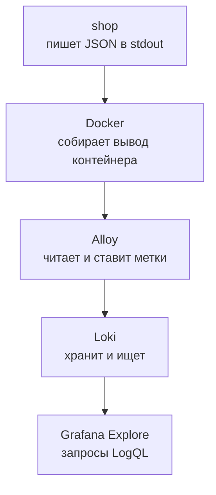
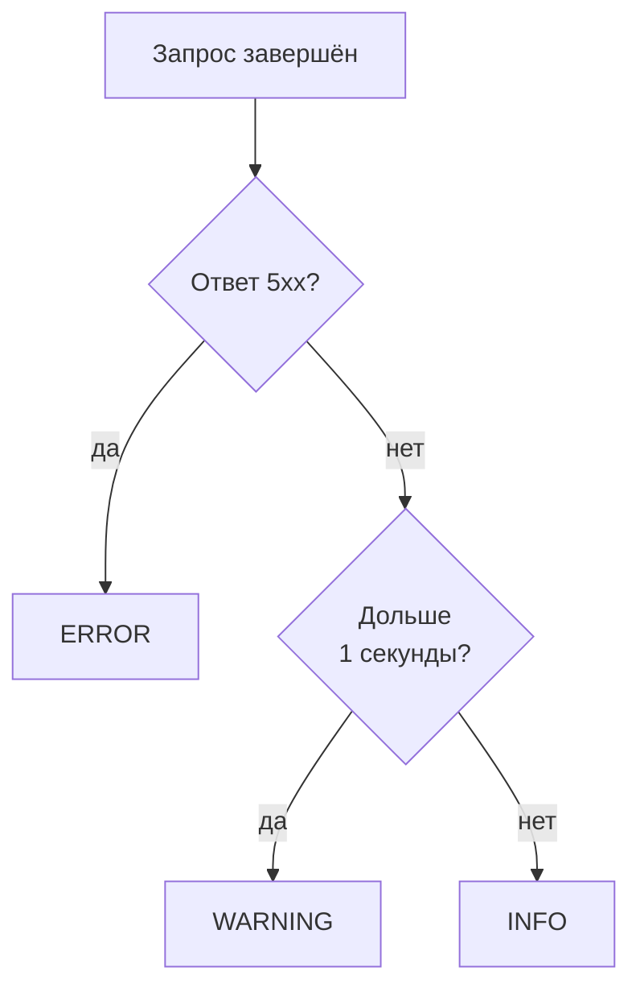
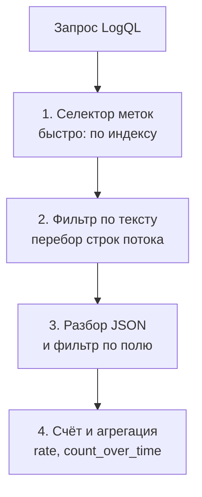
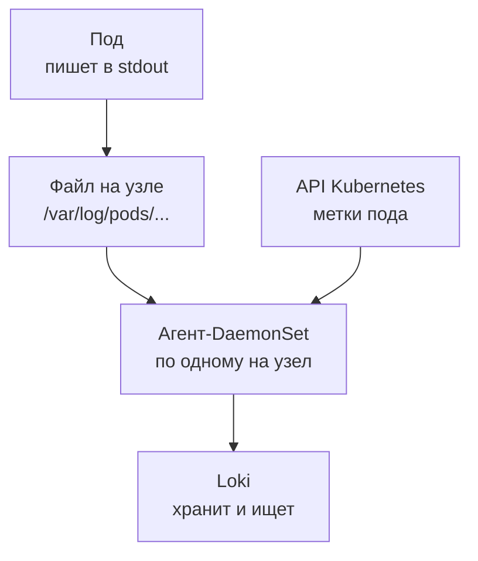
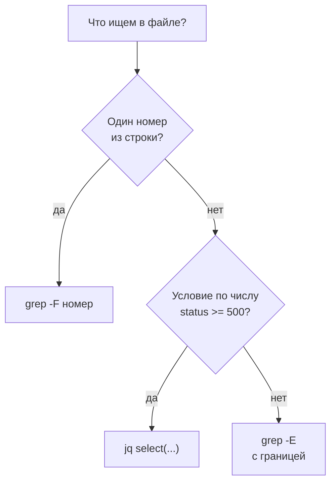

## Зачем это нужно

Тревога сработала, как мы и учили в теме 3: доля `5xx` у «Магазина» выросла. Ты открываешь график и видишь, что все ошибки идут с `/api/orders`. Дальше тупик: число ничего не знает про причину. Покупатель пишет в поддержку: «заказ не прошёл, вот номер запроса». И этот номер сейчас важнее любого графика.

Я помню, как в первый год дежурств потратил час на то, чтобы найти один такой запрос. Логи лежали на трёх машинах в текстовых файлах, и я заходил на каждую по очереди и искал глазами. Когда сервис пишет подробную строку на каждый запрос, а эти строки собраны в одном месте и ищутся за секунды, час превращается в минуту. Этому и посвящён урок.

Сегодня ты проследишь путь строки лога от «Магазина» до Grafana и научишься искать в ней по языку запросов LogQL. А в конце свяжешь график ошибок со строкой, которая называет причину.

Шаг проекта: ты создаёшь в `~/monitoring-lab` файл `04-logs-traces/logql.md` с запросами «найти запрос по номеру», «ошибки по маршрутам», «медленные запросы» и «p95 по логам»: у каждого цель, текст запроса и что на нём видно.

## Что нужно знать

- Метрики и PromQL: [урок 2.1](../02-metrics/01-prometheus.md) про `/metrics` и метки, [урок 2.2](../02-metrics/02-promql.md) про `rate` и `sum by`. Запросы LogQL похожи на PromQL, и это сильно сэкономит время.
- Grafana и Explore (страница свободных запросов к источнику данных): [урок 3.1](../03-dashboards-alerts/01-grafana.md). Алерты, которые приведут тебя к логам: [урок 3.2](../03-dashboards-alerts/02-alerts.md).
- Запись по SLI из логов (доля ошибок и p95 из JSON-строк), которую ты делал руками: [урок 1.2](../01-basics/02-sli-slo.md).
- Docker: у контейнера есть стандартный вывод, `docker compose logs` его читает. Для этого достаточно [load-tester, урока 5.3](../../load-tester/05-docker/03-compose-shop.md).

## Картина целиком

Представь почтовое отделение большого города. Каждый дом выбрасывает письма в свой ящик у подъезда, и они копятся там без порядка. Курьер ходит по подъездам и забирает всё, что накопилось, ставя на конверты адрес дома. Письма везут на центральный склад, где их раскладывают по стеллажам с ярлыками «район» и «улица». Когда нужно найти письмо, сначала идёшь на нужный стеллаж по ярлыку, а потом перебираешь конверты на нём. Аналогия ломается в одном: склад не читает письма заранее и не строит по ним каталог. Весь поиск внутри конвертов делается в момент запроса.

В «Магазине» дом это контейнер `shop`, ящик это его стандартный вывод, курьер это Alloy, склад это Loki, а читальный зал это Grafana.



На схеме четыре шага от строки до экрана. Программа ничего не отправляет по сети сама: она просто печатает строки, а доставка это чужая работа. В теории пройдём по схеме слева направо, потом научимся искать и считать и, наконец, свяжем логи с графиками.

## Теория

### Зачем логи, если есть метрики

Алерт говорит «5% заказов с ошибкой». Допустим, ты хочешь узнать, у какого именно пользователя и по какой причине упал заказ. Метрика на это не ответит, и вот почему: она хранит число, а не события. Чтобы число могло различать пользователей, пришлось бы добавить `user_id` в метки, и по [уроку 1.1](../01-basics/01-signals.md) хранилище задохнётся от миллиона рядов.

**Лог** (log, журнал) это запись о событии: что случилось, когда, с кем и чем кончилось. Представь бортовой журнал: капитан пишет «14:05, пробоина в трюме, заделали за 20 минут». Метрика бортового журнала это табло «воды в трюме 40 литров»: оно показывает состояние, а журнал хранит историю событий. Для расследования нужны оба, и у каждого своя цена: строк в логе столько же, сколько запросов, а метрика остаётся одним числом.

В «Магазине» на каждый запрос приходится ровно одна строка: метод, путь, код ответа, длительность и номер запроса. Для запроса «Магазин» пишет её после ответа, поэтому строка называет итог, а не намерение. Поэтому метрику используют, чтобы узнать, что случилось и где, а лог, чтобы узнать, почему и с кем.

Вот как один и тот же сбой выглядит в метрике. Это табло на дашборде в 12:05:

<div class="viz" data-viz="mon-stat" data-title="Метрика: табло" data-explain="Три числа верха дашборда. Они говорят, что плохо, но не говорят, кому и почему." data-stats='[{"title":"Доля 5xx","value":5.4,"unit":"%","color":"red","spark":[0.1,0.1,0.2,1.1,5.2,5.6,5.5,5.4],"sub":"за минуту"},{"title":"Запросов","value":46,"unit":"req/s","color":"green"},{"title":"p95 заказов","value":240,"unit":"ms","color":"yellow","sub":"обычно 110 мс"}]'></div>

Числа отвечают «сколько» и «когда»: ошибок 5,4%, началось минуты назад. Кто пострадал и из-за чего, табло не знает. Это знает лог, вот те же секунды в нём:

<div class="viz" data-viz="mon-logs" data-title="Explore: Loki" data-query="{service=&quot;shop&quot;}" data-highlight="9c1d5a7e3b2f4c8d9e0a1b2c3d4e5f60" data-explain="Пять свежих строк магазина. Каждая строка это одно событие со всеми подробностями." data-lines='[{"ts":"2026-10-04 15:03:41.482","level":"error","labels":{"service":"shop","container":"shop-shop-1","level":"ERROR"},"line":"{\"ts\": \"2026-10-04T12:03:41.482913+00:00\", \"level\": \"ERROR\", \"msg\": \"Запрос завершён\", \"method\": \"POST\", \"route\": \"/api/orders\", \"path\": \"/api/orders\", \"status\": 502, \"duration_ms\": 212.4, \"request_id\": \"e1b4c0a95f3d4a2b8c6e7f1a2b3c4d5e\", \"trace_id\": \"9c1d5a7e3b2f4c8d9e0a1b2c3d4e5f60\", \"user_id\": 17, \"error\": \"payment failed\"}"},{"ts":"2026-10-04 15:03:41.390","level":"info","labels":{"service":"shop","container":"shop-shop-1","level":"INFO"},"line":"{\"ts\": \"2026-10-04T12:03:41.390117+00:00\", \"level\": \"INFO\", \"msg\": \"Запрос завершён\", \"method\": \"GET\", \"route\": \"/api/products/{id}\", \"path\": \"/api/products/42\", \"status\": 200, \"duration_ms\": 6.8, \"request_id\": \"8a1cee436cbac1489a1883c9d886fcfc\", \"trace_id\": \"c44474038d459e40e4714afefa7bf8da\"}"},{"ts":"2026-10-04 15:03:41.201","level":"info","labels":{"service":"shop","container":"shop-shop-1","level":"INFO"},"line":"{\"ts\": \"2026-10-04T12:03:41.201560+00:00\", \"level\": \"INFO\", \"msg\": \"Запрос завершён\", \"method\": \"POST\", \"route\": \"/api/cart/items\", \"path\": \"/api/cart/items\", \"status\": 201, \"duration_ms\": 4.9, \"request_id\": \"10dacdccfe877dc064d57442e6fa7a4e\", \"trace_id\": \"cece8a9cecfb6c7e7ee4f3346d5e2544\", \"user_id\": 17}"},{"ts":"2026-10-04 15:03:40.977","level":"info","labels":{"service":"shop","container":"shop-shop-1","level":"INFO"},"line":"{\"ts\": \"2026-10-04T12:03:40.977034+00:00\", \"level\": \"INFO\", \"msg\": \"Запрос завершён\", \"method\": \"POST\", \"route\": \"/api/login\", \"path\": \"/api/login\", \"status\": 401, \"duration_ms\": 98.3, \"request_id\": \"9f102fe3a7d618f9960701e25169aff6\", \"trace_id\": \"a2f1a68a3cf7bab14245ba34e6a348b6\"}"},{"ts":"2026-10-04 15:03:40.512","level":"info","labels":{"service":"shop","container":"shop-shop-1","level":"INFO"},"line":"{\"ts\": \"2026-10-04T12:03:40.512689+00:00\", \"level\": \"INFO\", \"msg\": \"Запрос завершён\", \"method\": \"GET\", \"route\": \"/api/products\", \"path\": \"/api/products\", \"status\": 200, \"duration_ms\": 11.2, \"request_id\": \"a99e27f8d40e114ff48dc9c44b04cd74\", \"trace_id\": \"f413e43d74f8178745c1acb48b274143\"}"}]'></div>

Найди подсвеченный `trace_id` в верхней строке и раскрой её кликом: появится `user_id` 17 и причина `payment failed`. Время на экране московское, а `ts` внутри строки в UTC, поэтому 15:03 против 12:03. Остальные строки спокойные `INFO`: так выглядит норма рядом со сбоем.

> **Прикинь сам:** сервис отвечает 200 запросов в секунду, одна строка лога занимает 300 байт. Сколько данных набирается в сутки?
{: .predict}

Считаем, сколько места это займёт на диске. Берём 200 строк в секунду (трафик сервиса) и 300 байт на строку (средний размер, как в условии): 200 × 300 = 60 000 байт в секунду. В сутках 86 400 секунд (24 часа × 60 минут × 60 секунд), поэтому за сутки набегает 60 000 × 86 400 = 5 184 000 000 байт, то есть около 5 ГБ на один сервис. Метрика на тот же трафик весит килобайты. Такой расчёт нужен, чтобы заранее знать, сколько диска закладывать под логи, и поэтому их пишут экономно, о чём дальше.

Осторожно: «логи заменяют метрики, ведь в них всё есть». Из логов можно посчитать любое число, но дорого: нужно перебрать все строки за период. Для общей картины и алертов остаются метрики.

> **Главное:** метрика отвечает «сколько и где», лог отвечает «что именно и почему», и платить за подробность приходится объёмом.
{: .key}

Если лог так подробен, важно, чтобы его легко было разбирать программой. Это нас приводит к формату строки.

### Структурный лог: одна строка, один JSON

Раньше сервисы писали логи для людей: `2026-10-04 12:03:41 ERROR payment failed for order 1042 (user 17)`. Человек поймёт, а вот программа нет. Чтобы найти ошибки пользователя 17, придётся писать регулярное выражение под эту формулировку. Завтра разработчик поменяет «for order» на «order=», и поиск сломается.

Решение такое же, как у квитанции: вместо свободного текста поля с названиями. **Структурный лог** (structured log) это запись, где каждый факт лежит в именованном поле. Самый частый формат это **JSON** (JavaScript Object Notation): текст из пар «ключ: значение» в фигурных скобках. Строка остаётся строкой, но теперь `status` всегда `status`, и достать его можно без угадывания.

Вот одна настоящая строка «Магазина» (формат задаёт `shop/app/main.py`). Время, длительность и номера у тебя будут другими. В журнале она идёт одной строкой, а здесь для чтения разложена по полю на строчку:

```json
{
  "ts": "2026-10-04T12:03:41.482913+00:00",
  "level": "ERROR",
  "msg": "Запрос завершён",
  "method": "POST",
  "route": "/api/orders",
  "path": "/api/orders",
  "status": 502,
  "duration_ms": 212.4,
  "request_id": "e1b4c0a95f3d4a2b8c6e7f1a2b3c4d5e",
  "trace_id": "9c1d5a7e3b2f4c8d9e0a1b2c3d4e5f60",
  "user_id": 17,
  "error": "payment failed"
}
```

Полей двенадцать, но прямо сейчас нужны шесть, остальные пригодятся позже:

| Поле | Что значит | Когда нужно |
|---|---|---|
| `level` | важность записи | сейчас |
| `route` | шаблон пути: все карточки товаров собираются в `/api/products/{id}`, как и в метриках | сейчас |
| `status` | код ответа | сейчас |
| `duration_ms` | длительность в миллисекундах | сейчас |
| `request_id` | номер запроса | сейчас |
| `error` | причина, только у ответов `5xx`: `payment failed` (502), `payment timeout` (504) или `couldn't get a connection after 5.00 sec` (503) | сейчас |
| `ts` | время события в UTC (всемирное время без часового пояса) | позже, в разделе про время |
| `msg`, `method`, `path` | сообщение, метод и реальный адрес запроса | позже |
| `user_id` | номер покупателя, только у вошедших | позже |
| `trace_id` | номер трейса | следующий урок |

Два поля связывают строку с остальным миром. `request_id` это номер запроса. Его можно задать самому заголовком `X-Request-ID`, иначе сервис придумает 32 шестнадцатеричных символа и вернёт в заголовке ответа. Идея работает как номер заказа в службе доставки: покупатель называет его, а поддержка находит всё, что с заказом происходило. `trace_id` это номер трейса, о нём в следующем уроке: он появляется, когда у запроса есть трейс, а у проверок `/healthz`, `/readyz` и страницы `/metrics` его нет, их не трассируют.

> **Прикинь сам:** в строке выше `status` равен 502, а `user_id` 17. Какое значение `error` у ответа 200 того же пользователя?
{: .predict}

Такого поля нет вовсе: `error` добавляется только к ответам `5xx`. Поэтому фильтр «есть `error`» годится как быстрый признак сбоя. Вывод для себя: набор полей это договорённость, и запросы пишут под неё.

Осторожно: не меняй имена полей «для красоты». Запросы, алерты и дашборды привязаны к `status` и `route`, и переименование молча ломает их все.

> **Проверь понимание:** зачем в строке есть и `route`, и `path`?

<details markdown="1">
<summary>Ответ</summary>

`path` это реальный адрес запроса (`/api/products/42`): с ним находят одну конкретную карточку. `route` это шаблон (`/api/products/{id}`): по нему группируют запросы и считают статистику по маршруту. Тот же приём стоит и на метках метрик, чтобы число рядов не росло с числом товаров.

</details>

> **Главное:** структурный лог это одна строка JSON на событие с постоянными именами полей: по ним ищут и считают, не гадая по тексту.
{: .key}

Формат задан. Остаётся договориться об именах полей, общих для всех сервисов, и о том, с чего начинать чтение строки.

### Зачем договариваться о полях и что смотреть первым

Представь, что в магазине три сервиса и каждый пишет по-своему. Один выводит JSON с полем `status`, второй текст «ответ 502 за 212 мс», третий JSON, но с полем `code` и временем в секундах. Ночью тебе нужно найти все ошибки за пять минут: придётся писать три разных запроса и держать в голове три словаря. А потом такой же разнобой ждёт дашборд и алерт: у каждого сервиса свой.

Поэтому логи **стандартизируют** (standardize): вся компания называет одни и те же вещи одинаково. Время всегда `ts` в UTC, уровень `level`, номер запроса `request_id`, длительность `duration_ms` в миллисекундах. Тогда один запрос `| json | status >= 500` работает по всем сервисам, дашборд берётся готовым, а новичок в команде читает любую строку без переводчика. Это дёшево в начале и очень дорого исправлять позже: переименование поля молча ломает все запросы, как мы уже видели.

Когда строка открыта, глаз идёт по ней в одном порядке. Вот он на полях «Магазина»:

<div class="viz" data-viz="mon-table" data-title="Как SRE читает строку лога" data-query="{service=&quot;shop&quot;, level=&quot;ERROR&quot;} | json" data-explain="Восемь вопросов к строке в том порядке, в котором их задают. Первые четыре отвечают, о чём строка, остальные что именно случилось." data-columns='["Шаг","Поле","Что решает"]' data-rows='[["1","ts","Когда: совпадает ли с алертом и с выкаткой"],["2","level","Сбой это или рядовое событие"],["3","service (метка)","Чей это лог"],["4","trace_id, request_id","Ниточка к трейсу и к жалобе покупателя"],["5","route, path","Какая операция сломалась"],["6","status, error","Чем закончилось и почему"],["7","duration_ms","Было ли медленно"],["8","user_id","Один пользователь или все"]]' data-highlight-col="1" data-highlight-row="3"></div>

Выделено поле четвёртого шага: номер запроса. Он нужен рано, потому что через него строку связывают с жалобой и с трейсом, и от него зависит, куда идти дальше.

> **Прикинь сам:** в строке `status` равен 200, `duration_ms` 4800, `level` `WARNING`. На каком шаге таблицы ты поймёшь, что это не сбой, а медленный запрос?
{: .predict}

На шаге 2 увидишь `WARNING`, а на шаге 7 подтвердишь: статус успешный, значит ошибок нет, а проблема во времени. Порядок помогает не прыгать глазами по строке и быстро отсеивать «не то».

Осторожно: стандарт не спасает, если его не проверяют. Один сервис с полем `time` вместо `ts` оставляет «дыру» в запросах, и её находят в разгар инцидента.

> **Главное:** единые имена полей делают запросы, дашборды и алерты общими для всех сервисов, а при чтении строки идут в одном порядке: время, уровень, сервис, номер запроса, маршрут, статус, длительность, пользователь.
{: .key}

Строк много, и важно, чтобы по ним можно было сразу отличить важное от рядового. Для этого есть уровни.

### Уровни логов и сколько писать

Если писать в лог каждый шаг программы, то через неделю он разрастётся до сотен гигабайт, а нужную строку не найти в шуме. Если писать слишком мало, то в момент аварии в логе будет пусто. Чтобы договориться, что важно, придумали **уровни** (levels): метки важности записи.

Представь бортовой журнал, где разными чернилами пишут «вышли из порта» (обычное), «видели шторм вдали» (заметное) и «пробоина» (аварийное). Порядок по возрастанию важности: `DEBUG` (отладочные подробности), `INFO` (обычная работа), `WARNING` (подозрительно, но работает), `ERROR` (сбой). Программа настроена на минимальный уровень: всё, что ниже, она отбрасывает до записи. «Магазин» читает его из переменной `LOG_LEVEL`, по умолчанию `INFO`.

Сам уровень строки о запросе «Магазин» выбирает по простому правилу: ответ `5xx` получает `ERROR`, запрос дольше секунды получает `WARNING`, остальное `INFO`. Ответы `4xx` остаются на `INFO`: неверный пароль это ошибка клиента, а не сбой сервиса.



Схема показывает, что на `ERROR` попадает только то, ради чего стоит разбираться. Если же в сервисе поставить `LOG_LEVEL=ERROR`, то пропадут и успешные запросы: журнал станет почти пустым, и вычислить по нему трафик уже нельзя. Этот сбой мы устроим в разделе «Сломай и почини».

> **Прикинь сам:** запрос `POST /api/login` занял 1,3 секунды и вернул 401. Какой у строки уровень?
{: .predict}

`WARNING`: ответ не `5xx`, но запрос дольше секунды. Сам код 401 уровень не повышает. Если бы запрос занял 0,2 секунды, был бы `INFO`.

Вот выборка важных строк за время сбоя из практики 4:

<div class="viz" data-viz="mon-logs" data-title="Explore: Loki, только важное" data-query="{service=&quot;shop&quot;, level=~&quot;WARNING|ERROR&quot;}" data-highlight="level" data-explain="Выбраны только строки уровней WARNING и ERROR: так отсеивают рядовой шум." data-lines='[{"ts":"2026-10-04 15:07:14.250","level":"error","labels":{"service":"shop","container":"shop-shop-1","level":"ERROR"},"line":"{\"ts\": \"2026-10-04T12:07:14.250311+00:00\", \"level\": \"ERROR\", \"msg\": \"Запрос завершён\", \"method\": \"POST\", \"route\": \"/api/orders\", \"path\": \"/api/orders\", \"status\": 503, \"duration_ms\": 5011.4, \"request_id\": \"7dc96f776c8423e57a2785489a3f9c43\", \"trace_id\": \"dc6566f1a5647c0437a0be3efa37a7ab\", \"user_id\": 4, \"error\": \"couldn&#39;t get a connection after 5.00 sec\"}"},{"ts":"2026-10-04 15:06:58.904","level":"warn","labels":{"service":"shop","container":"shop-shop-1","level":"WARNING"},"line":"{\"ts\": \"2026-10-04T12:06:58.904127+00:00\", \"level\": \"WARNING\", \"msg\": \"Запрос завершён\", \"method\": \"GET\", \"route\": \"/api/products\", \"path\": \"/api/products\", \"status\": 200, \"duration_ms\": 1342.7, \"request_id\": \"4814d92093ac8a0f4a2163ab87dee509\", \"trace_id\": \"1c3d08cb25f1c66eaaf742e9ca718d92\"}"},{"ts":"2026-10-04 15:06:21.118","level":"warn","labels":{"service":"shop","container":"shop-shop-1","level":"WARNING"},"line":"{\"ts\": \"2026-10-04T12:06:21.118850+00:00\", \"level\": \"WARNING\", \"msg\": \"Запрос завершён\", \"method\": \"POST\", \"route\": \"/api/login\", \"path\": \"/api/login\", \"status\": 401, \"duration_ms\": 1304.2, \"request_id\": \"76a8277347f52530e1cf979175a17898\", \"trace_id\": \"ed94eaa578f5f4a04f5cd29f07604da1\"}"},{"ts":"2026-10-04 15:03:41.482","level":"error","labels":{"service":"shop","container":"shop-shop-1","level":"ERROR"},"line":"{\"ts\": \"2026-10-04T12:03:41.482913+00:00\", \"level\": \"ERROR\", \"msg\": \"Запрос завершён\", \"method\": \"POST\", \"route\": \"/api/orders\", \"path\": \"/api/orders\", \"status\": 502, \"duration_ms\": 212.4, \"request_id\": \"e1b4c0a95f3d4a2b8c6e7f1a2b3c4d5e\", \"trace_id\": \"9c1d5a7e3b2f4c8d9e0a1b2c3d4e5f60\", \"user_id\": 17, \"error\": \"payment failed\"}"}]'></div>

Заметь строку входа: код `401`, но уровень `WARNING`, потому что запрос занял 1,3 секунды. Уровень выбирает время и `5xx`, а не код ответа, и так же работает правило из схемы выше.

Отдельный вопрос это `DEBUG` в проде. Он пишет подробности внутренних шагов, и строк становится на порядок больше. Допустим, в нашем расчёте выше на каждый запрос добавилось ещё девять отладочных строк: вместо 5 ГБ в сутки набегает около 50 ГБ, а нужную строку ищут среди десятикратного шума. К тому же отладочные строки чаще содержат то, чего в логе быть не должно (тела запросов, значения полей). Поэтому в проде по умолчанию стоит `INFO`, а `DEBUG` включают временно и узко: на одном сервисе или одном экземпляре, на заданное время, с задачей «выключить» в тот же момент. Выше уровня `INFO` без причины тоже не поднимают, иначе пропадёт трафик из логов.

Осторожно: красные строки на штатные ситуации (неверный пароль, пустой поиск) приучают не смотреть на красное. Правило наставника: `ERROR` только там, где готов разбудить человека. И обратно: уровень строки это не HTTP-код, а решение программы о важности события.

> **Главное:** уровень отделяет сбой от рядовых событий, а `LOG_LEVEL` решает, что вообще попадёт в журнал: проверяй его первым, когда логов «не хватает».
{: .key}

С форматом и уровнем строки ясно. Теперь о том, где такие строки хранить и как в них искать.

### Loki: индексируем только метки

Логов много, и хранить их надо так, чтобы поиск работал без миллионов рублей на диски. Обычные системы поиска по тексту (например, Elasticsearch) строят индекс каждого слова в каждой строке: поиск быстрый, а индекс весит как сами данные. **Loki** (хранилище логов от Grafana Labs) выбрал другой путь: он индексирует только небольшой набор **меток** (labels) вроде `service` и `level`, а сами строки хранит сжатыми кусками без индекса.

Это как библиотека, где книги стоят на полках с ярлыками «история, 1990 год». По ярлыку находишь нужную полку мгновенно, а чтобы узнать, где упомянут «Иван Грозный», листаешь все книги на этой полке. Loki тоже перебирает текст выбранной полки, но делает это параллельно и быстро. Аналогия ломается в одном: ярлыки в Loki придумываешь ты, а не издатель, и от этого выбора зависит, быстро ли всё будет работать.

Как это выглядит на строках магазина. Вот две из них (поля сокращены):

```text
{"level": "INFO",  "route": "/api/orders", "status": 201, ...}
{"level": "ERROR", "route": "/api/orders", "status": 502, ...}
```

Когда строки попадают в Loki, Alloy приклеивает к каждой метки, как ярлыки на книги. Обе строки пришли из `shop`, поэтому у обеих `service="shop"`. А вот `level` у них разный: `INFO` у первой и `ERROR` у второй. Строки с одним и тем же набором меток Loki складывает вместе, и такая кучка называется **потоком** (stream). Здесь потока два: `{service="shop", level="INFO"}` и `{service="shop", level="ERROR"}`. Новая успешная строка из `shop` ляжет в первый, новая ошибка во второй. Поток это та самая полка с ярлыками из аналогии.

Запись из меток в фигурных скобках, например `{service="shop", level="ERROR"}`, называется **селектором** (selector). Она говорит Loki, какие полки открыть. На стенде своих меток три: `service` (имя сервиса из Compose), `container` и `level` (только у `shop`: его вытаскивает из JSON сам Alloy). Loki 3 сам добавляет ещё `service_name` (копию `service`), её ты можешь увидеть в списке меток Explore: в своих запросах пиши `service`. Остальные поля, `route`, `status`, `request_id`, меток не получают: их достают в запросе уже внутри открытой полки.

Как это выглядит у живого магазина. Посчитаем строки по уровню за 15 минут:

<div class="viz" data-viz="mon-table" data-title="Loki: вкладка Table" data-query="sum by (level) (count_over_time({service=&quot;shop&quot;}[15m]))" data-explain="Каждая строка таблицы это один поток Loki с постоянным набором меток." data-highlight-col="1" data-highlight-row="2" data-columns='["level","Значение"]' data-rows='[["INFO","1214"],["WARNING","7"],["ERROR","38"]]'></div>

Три строки это три потока `shop` с разным `level`. `INFO` вмещает почти всё, `ERROR` встречается редко, и поэтому выбор `{level="ERROR"}` сразу сужает перебор до тридцати с небольшим строк.

Осторожно: метку путают с полем JSON. `level` у нас и то и другое: он и метка потока (по ней выбирают полку), и поле в строке (по нему можно фильтровать внутри полки). А `route` и `status` только поля, и доступны лишь после `| json`. Для Loki они часть текста строки, пока ты не попросишь разобрать JSON.

Запрос к Loki идёт по четырём шагам:



Индекс это оглавление: список «какая метка в каких потоках». Loki хранит по одной записи на поток, и первый шаг идёт только по ней. Чем уже селектор на первом шаге, тем меньше строк придётся перебирать дальше. Отсюда главное правило: точные метки, потом дешёвый текстовый фильтр, потом разбор JSON.

Теперь число потоков. В [уроке 2.1](../02-metrics/01-prometheus.md) мы считали ряды метрик: каждая новая комбинация значений меток означала новый ряд, а их общее число называется кардинальностью. В Loki то же самое, только вместо рядов потоки. Каждая новая комбинация значений меток создаёт новый поток и новую запись в индексе. Метка `level` с тремя значениями безопасна, `request_id` с миллионом значений раздует индекс до размера самих логов.

> **Прикинь сам:** вместо `route` кто-то сделал меткой `path`. В магазине 10 000 разных `path` и 3 уровня. Сколько потоков получится?
{: .predict}

До 30 000: каждый путь на каждом уровне даёт свой поток. С метками `service` и `level` их было бы три. В реальности запросы начинают тормозить, а память Loki растёт: хранилище тратит силы на индекс вместо данных.

Чтобы выбрать метку, задай себе три вопроса. Много ли у неё значений (десятки подходят, тысячи нет)? Нужна ли она почти в каждом запросе (по ней ты каждый раз сужаешь выбор)? Не бесконечно ли растёт набор значений (идентификаторы запросов, адреса клиентов растут без предела)? Метка нужна, если ответы «мало», «да», «нет». Всё прочее остаётся в тексте строки.

> **Проверь понимание:** разработчик предлагает сделать `user_id` меткой, «чтобы быстрее искать по пользователю». Что ответишь?

<details markdown="1">
<summary>Ответ</summary>

Тысячи значений дадут тысячи потоков на каждый уровень, а при росте магазина миллионы: индекс раздуется, запросы замедлятся, Loki может отклонить запись из-за лимита потоков. Метка выбирает полку, а не книгу. Для поиска по пользователю достаточно запроса `{service="shop"} | json | user_id="17"`: полку выберет `service`, остальное сделает фильтр по полю.

</details>

> **Главное:** Loki индексирует только метки, поэтому метки должны иметь мало значений, а идентификаторы остаются в тексте строки.
{: .key}

Осталось понять, как строки попадают из контейнера в Loki и на что обратить внимание, если не попадают.

### Alloy: курьер от контейнера до Loki

Приложение пишет в стандартный вывод (`stdout`), а Docker сохраняет его в своих файлах. Дальше нужен посредник, который читает эти строки, добавляет метки и отправляет в Loki. На стенде это **Alloy** (агент сбора телеметрии от Grafana Labs). Раньше такую работу делал Promtail, но его поддержку закончили в марте 2026 года, и Alloy его заменил. Почему не писать из приложения прямо в Loki? Тогда у каждого сервиса были бы адрес хранилища, повторные отправки и очереди. Агент снимает это с приложения: оно просто печатает.

Alloy устроен как конвейер из блоков: каждый блок что-то делает и передаёт результат следующему. Вот кусок его конфигурации (`monitoring/alloy/config.alloy`) с моими пояснениями:

```text
discovery.docker "containers"      # находит контейнеры через сокет Docker
discovery.relabel "containers"     # оставляет проект shop, ставит метки service и container
loki.source.docker "containers"    # читает вывод найденных контейнеров
loki.process "shop"                # у shop вытаскивает level из JSON и делает его меткой
loki.write "local"                 # отправляет в http://loki:3100/loki/api/v1/push
```

Читать это надо сверху вниз: «найди контейнеры, оставь свои, прочитай, дообработай, отправь». Метка `service` берётся из имени сервиса в Compose, поэтому в Loki у логов `shop` метка `service="shop"`. Блок `loki.process` разбирает JSON только у `shop` и поднимает `level` в метку: так в селекторе можно писать `{service="shop", level="ERROR"}`.

На экране Alloy (`http://localhost:12345`) каждый блок виден как карточка со статусом: красная карточка означает, что звено сломано, и в ней текст ошибки. Это первое место, куда смотришь, если логов нет.

Осторожно: Alloy читает сокет Docker (`/var/run/docker.sock`) и на стенде он смонтирован с пометкой `:ro` («только чтение»). Пометка защищает файл сокета от изменения, но не ограничивает команды, которые через него идут: по сокету можно и запускать контейнеры. Доступ к сокету по сути равен правам администратора хоста. На учебном стенде это приемлемо, на проде сокет не отдают непроверенным программам, а в Kubernetes агент читает файлы логов узла и без сокета обходится.

> **Главное:** приложение просто печатает строки, а Alloy находит контейнеры, ставит метки и отправляет логи в Loki: если логов нет, начни со статуса его блоков.
{: .key}

На стенде Alloy берёт логи через Docker. В кластере Kubernetes путь другой, хотя идея та же.

### Логи в Kubernetes: тот же курьер, другая дорога

В **Kubernetes** (система, которая запускает контейнеры на многих серверах, `kubectl` это её командная строка) приложение по-прежнему просто печатает в `stdout`. Дальше стандартный вывод каждого контейнера превращается в файл на узле (сервере кластера), обычно в `/var/log/pods/<пространство>_<под>_<номер>/<контейнер>/0.log`. Эти же файлы читает `kubectl logs`. Kubelet (служба на узле) ротирует их: по умолчанию файл до 10 МиБ и пять штук на контейнер, остальное удаляется. Поэтому у старого пода логов нет, и без отправки в Loki они пропадают вместе с подом.

Отправку делает агент, и в Kubernetes его запускают как **DaemonSet**: объект, который держит ровно по одному такому поду на каждом узле ([DevOps, урок 5.8](../../devops/05-kubernetes/08-jobs-cronjob-daemonset.md)). Агент монтирует каталог `/var/log` с узла, читает файлы своего узла, ставит метки по данным пода из API Kubernetes (`namespace`, `pod`, `container`) и отправляет в Loki. Вместо сокета Docker он использует файлы и API: права на запуск контейнеров ему не нужны. Агентом может быть Alloy, как на стенде, или Fluent Bit.



Схема повторяет стендовую картину: печатает приложение, а доставляет агент. Меняются только начало (файл узла вместо сокета Docker) и источник меток (API Kubernetes вместо меток Compose).

> **Прикинь сам:** под удалили в 12:00, а агент отставал на 30 секунд. Что станет с последними строками?
{: .predict}

Если файл удалён раньше, чем агент его дочитал, хвост пропадёт: гарантий доставки нет. Поэтому ключевые события лучше видеть и в метриках, а за агентом наблюдают так же, как за приложением.

Осторожно: имя пода меняется при каждой выкатке. Метка `pod` в Loki даёт новый поток на каждый новый под, так что для долгих запросов пользуйся стабильными метками вроде `app`.

> **Главное:** в Kubernetes логи контейнера лежат файлами на узле, а агент-DaemonSet читает их, ставит метки из данных пода и отправляет в Loki.
{: .key}

Агент старается доставить всё, но гарантий не даёт. Посмотрим, что бывает, когда звено ломается.

### Когда доставка ломается и как долго живут логи

Пятница, вечер. Ты открываешь Explore и видишь, что свежих строк из `shop` нет уже десять минут, хотя заказы идут. Что случилось: сломался Loki, Alloy или сам магазин замолчал? Проверка идёт от конца пути к началу. Сначала `docker compose ps loki`: жив ли контейнер. Потом экран Alloy на `http://localhost:12345`: красная карточка `loki.write` значит, что отправить не получается, и в ней текст ошибки. Если Loki перезапускался, Alloy повторит отправку с нарастающими паузами и доставит накопленное: логи придут с опозданием, но целыми. Держит он их в памяти ограниченное время, поэтому при долгом простое буфер переполнится и часть записей пропадёт.

Бывает и обратное: Loki жив, карточки красные, а часть строк всё равно не доходит. Тогда в логах Alloy (`docker compose logs alloy`) ищи ответ Loki вроде `entry too far behind` (запись слишком старая) или `entry out of order` (запись идёт не по порядку времени). Повторять такую отправку бессмысленно, и Loki отбрасывает запись навсегда. Причина обычно в часах источника или в том, что агент после простоя отдал накопленное слишком поздно.

Если Alloy остановился, логи перестают ехать, а ты узнаёшь об этом по метрикам: Prometheus опрашивает его на порту 12345.

<div class="viz" data-viz="mon-targets" data-title="Status → Targets: Alloy остановлен" data-explain="Страница целей Prometheus: у alloy состояние DOWN и текст ошибки последнего опроса." data-targets='[{"job":"alloy","endpoint":"http://alloy:12345/metrics","state":"down","labels":{"instance":"alloy:12345","job":"alloy"},"last":"2.6s ago","duration":"0ms","error":"Get \"http://alloy:12345/metrics\": dial tcp: lookup alloy on 127.0.0.11:53: no such host"},{"job":"shop","endpoint":"http://shop:8000/metrics","state":"up","labels":{"instance":"shop:8000","job":"shop"},"last":"1.9s ago","duration":"8ms","error":""}]'></div>

Смотри на красный текст ошибки: имя `alloy` не находится в сети, значит, контейнера нет. Магазин при этом `UP` и работает: пропали только свежие логи, поэтому в таких случаях алерт `ExporterDown` полезнее, чем взгляд в Explore.

> **Прикинь сам:** Loki был недоступен 30 секунд. Потеряются ли логи?
{: .predict}

Скорее всего, нет: Alloy повторит отправку и доставит накопленное. Потери возможны при долгом простое или при отказе по существу.

Теперь о времени. Логи ищут по времени, поэтому метка времени записи решает всё. У записи два времени: когда событие случилось (его ставит приложение в `ts`) и когда запись приняли (его ставит Loki). Обычно они почти равны. Все поля времени в логах хранят в UTC, а Grafana показывает в твоём поясе: `10:00:00+00:00` в логе это 13:00 по Москве. Поэтому «логов нет» часто значит «ты смотришь не тот отрезок времени».

Остался вопрос, как долго логи живут. Срок хранения задаёт настройка Loki `retention_period`, но сама она ничего не чистит: старое удаляет фоновый процесс compactor, если ему включено удаление. На нашем стенде срок не настроен: логи лежат в томе `loki`, пока ты не выполнишь `docker compose down -v`. На проде сроки задают обязательно, иначе диск заполнится.

Осторожно: «Alloy гарантирует доставку». Он сглаживает короткие сбои, но долгую аварию хранилища не лечит, поэтому за Loki и Alloy наблюдают так же, как за приложениями.

> **Проверь понимание:** в конфиге Loki стоит `retention_period: 168h`, а диск растёт. Что забыли?

<details markdown="1">
<summary>Ответ</summary>

Включить удаление в compactor: `compactor.retention_enabled: true`. Срок объявлен, но без включённого удаления его никто не исполняет. 168 часов это 7 суток.

</details>

> **Главное:** при коротком сбое логи придут с опозданием, а отклонённые «по существу» записи (слишком старые, не по порядку, сверх лимита потоков) пропадают насовсем.
{: .key}

Строки доставлены и лежат в Loki. Теперь научимся их выбирать.

### LogQL: выбрать и отфильтровать строки

**LogQL** (Log Query Language) намеренно похож на PromQL из [урока 2.2](../02-metrics/02-promql.md): тот же селектор в фигурных скобках, те же `rate` и `sum by`. Запрос состоит из селектора потоков (какие потоки взять) и конвейера (что делать со строками, шаги через `|`). Писать запросы будем в Explore: источник Loki, режим Code, время «Last 15 minutes».

Самый простой запрос выбирает все логи сервиса:

```logql
{service="shop"}
```

Операторы те же, что в PromQL: `=`, `!=`, `=~`, `!~`. Условия через запятую это «и»: `{service="shop", level="ERROR"}`. Нужно хотя бы одно точное условие: запрос `{service=~".*"}` Loki отклонит как слишком широкий.

Дальше идут фильтры по тексту. Оператор `|=` оставляет строки с подстрокой, `!=` выбрасывает их, `|~` и `!~` работают с регулярными выражениями:

```logql
{service="shop"} |= "payment" != "login"
```

Выбрали потоки, оставили строки со словом `payment`, выбросили те, где есть `login`. Регистр важен: чтобы его не учитывать, пиши `|~ "(?i)payment"`. Фильтр по тексту дешёвый, он просто ищет подстроку.

Есть тонкость. Запрос `{service="shop"} |= "502"` найдёт и строку, где `status` равен 200: «502» бывает в `"duration_ms": 1502.3` и в `request_id`. Для точности строку разбирают на поля:

```logql
{service="shop"} | json | status >= 500
```

`| json` разбирает строку и делает каждое поле временной меткой. Не путай её с обычной: метки потока (`service`, `level`) постоянные и лежат в индексе Loki, а временная живёт только внутри запроса. Для чисел работают `=`, `!=`, `>`, `>=`, `<`, `<=`, для строк `=` и `=~`:

```logql
{service="shop"} | json | route="/api/orders" | duration_ms > 1000
```

Вот ответ на этот запрос, когда оплата замедлена до двух секунд:

<div class="viz" data-viz="mon-logs" data-title="Explore: Loki" data-query="{service=&quot;shop&quot;} | json | route=&quot;/api/orders&quot; | duration_ms > 1000" data-highlight="duration_ms" data-explain="Только заказы дольше секунды. У всех уровень WARNING и нет поля error: запросы успешны, но медленны." data-lines='[{"ts":"2026-10-04 15:31:52.640","level":"warn","labels":{"service":"shop","container":"shop-shop-1","level":"WARNING"},"line":"{\"ts\": \"2026-10-04T12:31:52.640218+00:00\", \"level\": \"WARNING\", \"msg\": \"Запрос завершён\", \"method\": \"POST\", \"route\": \"/api/orders\", \"path\": \"/api/orders\", \"status\": 201, \"duration_ms\": 2094.6, \"request_id\": \"ec18eac8d758b1eba52d3c10d39adc6d\", \"trace_id\": \"84fe9cda6c848774a2438f408bc77d91\", \"user_id\": 9}"},{"ts":"2026-10-04 15:31:49.508","level":"warn","labels":{"service":"shop","container":"shop-shop-1","level":"WARNING"},"line":"{\"ts\": \"2026-10-04T12:31:49.508341+00:00\", \"level\": \"WARNING\", \"msg\": \"Запрос завершён\", \"method\": \"POST\", \"route\": \"/api/orders\", \"path\": \"/api/orders\", \"status\": 201, \"duration_ms\": 2087.3, \"request_id\": \"e8bc163c82eee18733288c7d4ac636db\", \"trace_id\": \"68f1c007e6178d3457a5b3d7f4699686\", \"user_id\": 3}"},{"ts":"2026-10-04 15:31:46.390","level":"warn","labels":{"service":"shop","container":"shop-shop-1","level":"WARNING"},"line":"{\"ts\": \"2026-10-04T12:31:46.390772+00:00\", \"level\": \"WARNING\", \"msg\": \"Запрос завершён\", \"method\": \"POST\", \"route\": \"/api/orders\", \"path\": \"/api/orders\", \"status\": 201, \"duration_ms\": 2101.9, \"request_id\": \"ad328846aa18b32a335816374511cac1\", \"trace_id\": \"62673a604d240d8ca3978ebc52dd9743\", \"user_id\": 12}"},{"ts":"2026-10-04 15:31:43.261","level":"warn","labels":{"service":"shop","container":"shop-shop-1","level":"WARNING"},"line":"{\"ts\": \"2026-10-04T12:31:43.261905+00:00\", \"level\": \"WARNING\", \"msg\": \"Запрос завершён\", \"method\": \"POST\", \"route\": \"/api/orders\", \"path\": \"/api/orders\", \"status\": 201, \"duration_ms\": 2096.8, \"request_id\": \"41242b9fae56fad4e6e77dfe33cb18d1\", \"trace_id\": \"60484cc708f00500dbdee651a8a73563\", \"user_id\": 5}"}]'></div>

Все четыре заказа ответили `201`: ошибок нет, но каждый шёл около двух секунд. Такое видно только в логе по `duration_ms`, счётчик `5xx` тут молчал бы.

Это «заказы дольше секунды». Такой запрос медленнее текстового, потому что JSON разбирается у каждой строки. Поэтому дешёвые шаги ставят перед `| json`:

```logql
{service="shop", level="ERROR"} |= "payment" | json | route="/api/orders"
```

Метка и текстовый фильтр отсекают почти всё до разбора JSON. Чтобы строку было удобно читать, `line_format` переписывает её по шаблону:


```logql
{service="shop", level="ERROR"} | json | line_format "{{.route}} {{.status}} {{.error}} {{.duration_ms}}мс"
```


В итоге получится `/api/orders 502 payment failed 212.4мс`. Двойные скобки здесь часть шаблона, а не опечатка.

Если `| json` встретит строку, которая не JSON (например, стартовое сообщение сервера), он добавит ошибку `JSONParserErr`. Фильтр `| __error__ = ""` такие строки уберёт.

Попробуй собрать запрос из частей:

<div class="viz" data-viz="obs-log-query" data-preset="errors"></div>

Фильтры справа складываются в текст запроса, а график считает подошедшие строки по окнам. Добавляй условия по одному и смотри, как сужается выборка и что получается в тексте запроса.

> **Проверь понимание:** почему в запросе `{service="shop"} |= "payment" | json | route="/api/orders"` текстовый фильтр стоит до `| json`?

<details markdown="1">
<summary>Ответ</summary>

Текстовый фильтр дешёвый: он просто ищет подстроку и отсекает почти все строки. Разбор JSON дороже и делается для каждой оставшейся строки. Чем меньше строк дойдёт до `| json`, тем быстрее запрос.

</details>

> **Главное:** порядок запроса: точные метки, дешёвый фильтр по тексту, `| json`, фильтр по полю.
{: .key}

На инциденте нужны и числа: сколько ошибок и где.

### LogQL: из строк в числа

Допустим, нужной метки в метриках нет, а ошибки надо посчитать по маршрутам. Оберни селектор в функцию по окну, и строки превратятся в график, как метрики:

```logql
sum(count_over_time({service="shop"} | json | status >= 500 [1m]))
```

Читаем изнутри наружу. Селектор с фильтром выбирает строки с `5xx`, `[1m]` задаёт окно в минуту, `count_over_time` считает строки в каждом окне, `sum` складывает по потокам. Получается график «ошибок за минуту». Со скоростью в секунду и по маршрутам:

```logql
sum by (route) (rate({service="shop"} | json | status >= 500 [1m]))
```

`rate` делит число строк на длину окна: 12 ошибок за минуту это 12 / 60 = 0,2 в секунду. `by (route)` строит по линии на маршрут. Для числовых полей есть `unwrap`: он берёт значение поля как число, и по нему считают статистику. Процентиль за окно даёт `quantile_over_time`:

```logql
quantile_over_time(0.95, {service="shop"} | json | route="/api/orders" | unwrap duration_ms [1m]) by (route)
```

Это p95 времени ответа заказов по логам. Помнишь, как в [уроке 1.2](../01-basics/02-sli-slo.md) ты считал его `jq` по файлу? Тот же расчёт, только Loki делает его на лету.

Вот как эти два запроса выглядят, когда у оплаты начались отказы (сценарий из практики 4):

<div class="viz" data-viz="mon-panel" data-title="Ошибки 5xx по логам" data-query="sum by (route) (rate({service=&quot;shop&quot;} | json | status >= 500 [1m]))" data-unit="req/s" data-explain="Скорость строк-ошибок по маршрутам, посчитанная прямо из логов." data-x='["12:00","12:01","12:02","12:03","12:04","12:05","12:06","12:07","12:08","12:09","12:10"]' data-series='[{"name":"{route=\"/api/orders\"}","values":[0,0,0,1.2,9.1,11.2,10.6,10.2,9.8,0.4,0],"color":"red"}]' data-annotations='[{"at":"12:03","text":"оплата отказывает"}]'></div>

Линия одна: ошибки идут только с `/api/orders`, и до 12:03 их нет. Окно с 12:04 по 12:08 совпадает с тем, что показывала метрика.

<div class="viz" data-viz="mon-panel" data-title="p95 заказов по логам" data-query="quantile_over_time(0.95, {service=&quot;shop&quot;} | json | route=&quot;/api/orders&quot; | unwrap duration_ms [1m]) by (route)" data-unit="ms" data-explain="Медленный хвост заказов, посчитанный по полю duration_ms." data-x='["12:00","12:01","12:02","12:03","12:04","12:05","12:06","12:07","12:08","12:09","12:10"]' data-series='[{"name":"{route=\"/api/orders\"}","values":[102,98,105,110,212,235,228,219,224,118,104],"color":"yellow"}]' data-annotations='[{"at":"12:03","text":"оплата отказывает"}]'></div>

В норме p95 около 100 мс, во время сбоя около 220: ответ с отказом идёт дольше, потому что магазин пробует оплату до четырёх раз подряд. Спад к 12:09 это момент, когда оплату вернули в норму.

> **Прикинь сам:** по логам насчитали 30 строк с `status >= 500` в окне `[5m]`. Чему равен `rate` в секунду?
{: .predict}

30 / 300 = 0,1 ошибки в секунду. Окно в пять минут это 300 секунд.

Осторожно: считать долгие графики и алерты по логам дорого. Каждый пересчёт перебирает строки за окно. Для постоянных дашбордов и алертов используй метрики из Prometheus, а запросы по логам оставь для расследования.

> **Главное:** `count_over_time` и `rate` превращают строки в график, `unwrap` берёт числа из полей, а для долгих графиков и алертов метрики дешевле.
{: .key}

Искать и считать строки мы умеем. Остаётся самое ценное: соединить логи с метриками.

### От метрики к логу и обратно

На графике виден всплеск, а причина в логе. Метрика и лог живут в разных системах, и связывают их три общих признака: время, метки и номер запроса. Время: всплеск между 12:03 и 12:07, значит то же окно ставишь на логах (пояс везде один). Метки: у метрики есть `route`, у лога поле `route` после `| json`. Номер запроса `request_id` находит ровно одну строку.

Вернёмся к распродаже. Алерт `ShopHighErrorRate` сработал в 12:05, и ты открываешь график `sum by (route) (rate(http_requests_total{status=~"5.."}[1m]))`. Все `5xx` идут с `/api/orders`. Переходишь в логи на 12:03-12:08: `{service="shop", level="ERROR"} | json | route="/api/orders"`. В каждой строке `error: "payment failed"`. Столбик, на который команда смотрела полчаса, объяснился за пять минут. В Explore это удобно на одном экране: режим Split делит окно на два, слева Prometheus, справа Loki, время общее.

<div class="viz" data-viz="chart" data-type="line" data-x="12:00,12:02,12:04,12:06,12:08,12:10" data-series='[{"name":"5xx по метрике, 1/с","values":[0,0,9,11,10,0],"unit":" /с"},{"name":"ERROR-строк в логах, 1/с","values":[0,0,9,11,10,0],"unit":" /с"}]' data-x-label="Время (UTC)" data-y-label="Запросов в секунду" data-unit=" /с" data-explain="Две независимые системы показывают одно и то же: окно с 12:04 по 12:08. Метрика даёт число, лог даёт ту же цифру и текст причины каждой ошибки. Совпадение графиков значит, что ты смотришь на одну и ту же поломку."></div>

Линии совпадают: сколько `5xx` насчитала метрика, столько `ERROR` записал лог. Это число проверки: если линии расходятся, часть строк `ERROR` не дошла до Loki (вспомни отказы доставки выше) или запрос по логам выбирает не то окно и не тот маршрут. Уровень `INFO` тут ни при чём: его отсутствие убрало бы из логов только успешные запросы, и доля ошибок по логам, наоборот, выросла бы.

Теперь обратный путь. У покупателя номер запроса из заголовка `x-request-id`, а у тебя нет ни времени, ни маршрута. Достаточно `{service="shop"} |= "<номер>"`: Loki перебирает строки выбранного потока и находит единственную. Это самый короткий путь от жалобы к причине.

> **Проверь понимание:** метрика показывает 5% ошибок, а логи по тому же окну дают 0,5%. Назови две вероятные причины.

<details markdown="1">
<summary>Ответ</summary>

Первая: часть логов не дошла до Loki (долгий простой, отказ приёма, лимит потоков). Вторая: запрос по логам смотрит не то окно или не тот маршрут. Уровень `LOG_LEVEL` выше `INFO` объяснить такое расхождение не может: пропали бы успешные запросы, и доля ошибок по логам выросла бы. Начни с проверки Alloy на `http://localhost:12345` и с окна и фильтров запроса.

</details>

> **Главное:** метрику с логом связывают по времени, по меткам вроде `route` и по `request_id`: метрика отвечает, где и когда, лог отвечает, почему.
{: .key}

Loki под рукой есть не всегда. Иногда тебе присылают файл, а иногда логи лежат на узле и до Loki не доехали. Что делать тогда, разберём дальше.

### Лог в файле: найти пользователя за секунды

Коллега прислал выгрузку `shop.log` на гигабайт, а нужны все строки пользователя 17. Открывать такой файл в редакторе бессмысленно: он зависнет. Выручают команды Linux, которые читают файл потоком, строка за строкой, и не грузят его в память целиком. На стенде такой файл получаешь так:

```bash
cd ~/learning/load-tester/project/shop
docker compose logs shop --no-log-prefix --since 1h > shop.log
```

Теперь все строки пользователя 17 разными способами:

```bash
grep -E '"user_id": 17[,}]' shop.log
rg '"user_id": 17[,}]' shop.log
zgrep -E '"user_id": 17[,}]' shop.log.1.gz
grep -E '"user_id": 17[,}]' shop.log | jq -c '{ts, status, request_id}'
```

Разбор. `grep` печатает строки, где нашёлся шаблон, а ключ `-E` включает расширенные регулярные выражения. Шаблон `17[,}]` значит «17, а за ним запятая или закрывающая скобка». Граница нужна, потому что простой поиск `17` найдёт и пользователя 170, и 1700. А скобка нужна, потому что у успешного запроса `user_id` стоит в строке последним полем, после него идёт `}`, а не запятая. `rg` (ripgrep) делает то же быстрее, он ставится отдельно и ищет в папках рекурсивно. `zgrep` читает сжатые архивы `.gz` без распаковки, так лежат старые ротированные логи. Последняя команда передаёт найденное в `jq`, который уже разбирает JSON: `-c` печатает по объекту в строку, `{ts, status, request_id}` оставляет три поля.

**Что получится** (пример, значения у тебя другие):

```text
{"ts":"2026-10-04T12:03:41.482913+00:00","status":502,"request_id":"e1b4c0a95f3d4a2b8c6e7f1a2b3c4d5e"}
```

**Как читать вывод:** по строке на запрос, в порядке записи. Отсюда видно, когда пользователь 17 получил `502` и каким номером запроса это пометить для дальнейшего поиска.

Для уникального номера точнее и быстрее другой ключ: `grep -F e1b4c0a95f3d4a2b8c6e7f1a2b3c4d5e shop.log`. `-F` ищет подстроку как есть, без регулярного выражения, поэтому работает быстрее и не путает спецсимволы. Если нужен условный отбор по числу (`status >= 500`), регулярные выражения неудобны, и тут уже работает `jq`: `jq -cR 'fromjson? | select(.status >= 500)' shop.log`. Ключ `-R` читает строки как текст, `fromjson?` разбирает их и тихо пропускает битые.



Схема показывает выбор инструмента: уникальный номер ищут через `grep -F`, условия по полям через `jq`, остальное через `grep -E` с границей. Для архивов вместо `grep` берут `zgrep`, для большой папки `rg`.

> **Прикинь сам:** ты ищешь `grep '"user_id": 17' shop.log` и получаешь строки пользователей 17 и 170. Что поправить?
{: .predict}

Добавить границу: `grep -E '"user_id": 17[,}]'`. Или разобрать JSON через `jq` и сравнить число `.user_id == 17` точно.

Осторожно: `grep` по JSON ненадёжен для чисел и вложенных полей. Если строка может содержать то же число в другом поле, найди ту, что нужна, через `jq`, а `grep` оставь для быстрого сужения.

> **Главное:** большой файл читают потоком: `grep -F` для уникального номера, `grep -E` с границей для числа, `zgrep` для архивов и `jq` для условий по полям.
{: .key}

Последнее, о чём нужно знать до практики: чего в лог писать нельзя.

### Что нельзя класть в лог

Лог читают многие, а хранится он неделями. Всё, что в него попало, видно каждому, у кого есть доступ к Loki. Журнал охраны лежит на проходной: запишешь в него пароль от сейфа и раздашь его всем.

Секретами считаются пароли, токены, ключи API, номера карт, персональные данные. Защита строится в трёх местах. Во-первых, не писать: не логировать заголовки и тела запросов целиком. Во-вторых, маскировать у источника: заменять значение на `***` в самом приложении. В-третьих, при необходимости вырезать на стороне агента стадией `stage.replace` в Alloy. Доступ к Loki ограничивают так же строго, как к базе данных.

Пример беды. Разработчик написал `logger.info("login", extra={"fields": {"token": token}})`. Через минуту токен лежит в Loki, через неделю в выгрузке для отчёта. Исправление не сводится к удалению строки: токен считают скомпрометированным и перевыпускают, поле убирают из кода.

Осторожно: «удалил строку, значит проблема решена». Секрет уже мог быть прочитан, его нужно перевыпустить.

> **Главное:** в лог пишут то, что не страшно показать всем, а секреты не пишут вовсе: удаление строки задним числом их не спасает.
{: .key}

Теория закончилась. Теперь пройдём путь от строки до ответа на живом стенде.

## Практика

Стенд «Магазин» поднят с профилем `monitoring` ([урок 1.1](../01-basics/01-signals.md)), Grafana открыта на `http://localhost:3000`. Нагрузку и поломки делай только на своём локальном стенде. Файлы кладёшь в `~/monitoring-lab/04-logs-traces`.

### 1. Убедись, что логи дошли до Loki

Сначала немного движения, чтобы в логах было что смотреть, потом вопрос к API Loki:

```bash
cd ~/learning/load-tester/project/shop
for i in $(seq 1 30); do curl -s -o /dev/null localhost:8000/api/products; curl -s -o /dev/null localhost:8000/api/products/$i; done
sleep 10
curl -s 'localhost:3100/loki/api/v1/label/service/values' | jq -c .
```

Цикл `for` тридцать раз запрашивает каталог и карточку товара. `sleep 10` даёт логам время доехать. Порт 3100 это Loki, а `label/service/values` значит «какие значения у метки `service`». `jq -c .` печатает ответ в одну строку.

**Что должно получиться** (пример, состав списка у тебя может отличаться):

```text
{"status":"success","data":["alloy","grafana","loki","payment","postgres","prometheus","redis","shop"]}
```

**Как читать вывод:** `status: success` значит, что API отвечает. В списке должен быть `shop`: без него следующие запросы вернут пустоту.

**Типичные ошибки:**

- `curl: (7) Failed to connect to localhost port 3100`: Loki не запущен, стенд поднят без профиля. Выполни `docker compose --profile monitoring up -d --wait loki alloy`.
- В `data` нет `shop`: Alloy ещё не дошёл до контейнеров. Подожди полминуты и загляни на `http://localhost:12345`: красная карточка покажет причину.

### 2. Пять запросов в Explore

Открой `http://localhost:3000/explore`, источник **Loki**, переключатель Builder/Code поставь на **Code**, диапазон **Last 15 minutes**. По очереди выполни запросы и сохрани их в `~/monitoring-lab/04-logs-traces/logql.md`:

```logql
{service="shop"}
```


```logql
{service="shop"} | json | route="/api/products/{id}" | line_format `{{.method}} {{.path}} {{.status}} {{.duration_ms}}мс`
```


```logql
{service="shop"} | json | duration_ms > 20
```

```logql
sum by (route) (count_over_time({service="shop"} | json [1m]))
```

```logql
quantile_over_time(0.95, {service="shop"} | json | route="/api/products/{id}" | unwrap duration_ms [1m]) by (route)
```

Во втором запросе `line_format` переписывает строку в читаемый вид (в Explore шаблон можно писать и в обратных кавычках).

**Что должно получиться** (пример; время и числа у тебя будут другими). Для второго запроса:

```text
GET /api/products/7 200 6.41мс
GET /api/products/12 200 5.87мс
```

**Как читать вывод:**

- Первый запрос возвращает все строки подряд, свежие сверху. Раскрой строку щелчком: Grafana покажет метки (`service`, `container`, `level`) и разобранные поля.
- Второй оставляет только карточки товаров и показывает их короткими строками.
- Третий оставляет всё, что дольше 20 мс: поиск по товарам и записи, пришедшие с холодным кэшем.
- Четвёртый и пятый возвращают **график**: у четвёртого по линии на маршрут, у пятого p95 времени ответа по карточкам в миллисекундах.

Вот как выглядят результаты у тебя на экране. Четвёртый запрос в режиме Table:

<div class="viz" data-viz="mon-table" data-title="Loki: вкладка Table" data-query="sum by (route) (count_over_time({service=&quot;shop&quot;} | json [1m]))" data-explain="Сколько строк-запросов пришло за минуту по каждому маршруту." data-highlight-col="1" data-highlight-row="0" data-columns='["route","Значение"]' data-rows='[["/api/products/{id}","1320"],["/api/products","640"],["/api/cart/items","380"],["/api/orders","190"],["/api/categories","170"],["/api/login","60"]]'></div>

Так четвёртый запрос выглядит в режиме Table: шесть маршрутов, по строке на каждый. Самый частый это карточки товаров. Сумма 2760 строк за минуту это 46 запросов в секунду.

И второй запрос с `line_format`:


<div class="viz" data-viz="mon-logs" data-title="Explore: Loki, второй запрос" data-query="{service=&quot;shop&quot;} | json | route=&quot;/api/products/{id}&quot; | line_format `{{.method}} {{.path}} {{.status}} {{.duration_ms}}мс`" data-explain="После line_format в каждой строке только четыре нужных значения." data-lines='[{"ts":"2026-10-04 15:21:07.884","level":"info","labels":{"service":"shop","container":"shop-shop-1","level":"INFO"},"line":"GET /api/products/7 200 6.41мс"},{"ts":"2026-10-04 15:21:07.612","level":"info","labels":{"service":"shop","container":"shop-shop-1","level":"INFO"},"line":"GET /api/products/12 200 5.87мс"},{"ts":"2026-10-04 15:21:07.340","level":"info","labels":{"service":"shop","container":"shop-shop-1","level":"INFO"},"line":"GET /api/products/31 200 7.02мс"},{"ts":"2026-10-04 15:21:06.981","level":"info","labels":{"service":"shop","container":"shop-shop-1","level":"INFO"},"line":"GET /api/products/7 200 6.15мс"}]'></div>


Сравни с сырой строкой выше: был JSON из двенадцати полей, остался короткий текст. Метки и уровень остались, поэтому цвет полоски слева не пропал.

**Типичные ошибки:**

- `parse error ... unexpected IDENTIFIER`: забыл `|` между шагами или не закрыл кавычки в `line_format`.
- `queries require at least one regexp or equality matcher that does not have an empty-compatible value`: селектор без непустого условия. Начни с `{service="shop"}`.
- Пустой результат при правильном запросе: проверь диапазон времени (справа сверху) и что запросы к магазину недавно шли.
- `JSONParserErr` в результатах: в потоке `shop` попалась не-JSON строка. Добавь `| __error__ = ""`.

### 3. Найди запрос по `request_id`

Сделаем запрос с номером, который ты придумал сам:

```bash
curl -s -o /dev/null -w '%{http_code}\n' -H 'X-Request-ID: lab-0401' localhost:8000/api/categories
```

`-o /dev/null` выбрасывает тело, `-w '%{http_code}\n'` печатает только код ответа, `-H` добавляет заголовок с номером. Ответ `200`. Теперь найди запрос в Explore. Сначала дешёвым фильтром:

```logql
{service="shop"} |= "lab-0401"
```

**Что должно получиться** (пример):

```text
{"ts": "2026-10-04T12:44:52.117201+00:00", "level": "INFO", "msg": "Запрос завершён", "method": "GET", "route": "/api/categories", "path": "/api/categories", "status": 200, "duration_ms": 6.84, "request_id": "lab-0401", "trace_id": "d2f0a8c4b1e94f3a8c7b6a5d4e3f2a1b"}
```

**Как читать вывод:** ровно одна строка с твоим номером. Даже при миллионе строк текстовый поиск по уникальному слову находит её быстро, ведь селектор уже сузил выбор до одного сервиса. Точный вариант: `{service="shop"} | json | request_id="lab-0401"`.

Так эта строка выглядит в Explore:

<div class="viz" data-viz="mon-logs" data-title="Explore: Loki, поиск по номеру" data-query="{service=&quot;shop&quot;} |= &quot;lab-0401&quot;" data-highlight="lab-0401" data-explain="Одна строка с твоим номером запроса среди всех строк магазина." data-lines='[{"ts":"2026-10-04 15:44:52.117","level":"info","labels":{"service":"shop","container":"shop-shop-1","level":"INFO"},"line":"{\"ts\": \"2026-10-04T12:44:52.117201+00:00\", \"level\": \"INFO\", \"msg\": \"Запрос завершён\", \"method\": \"GET\", \"route\": \"/api/categories\", \"path\": \"/api/categories\", \"status\": 200, \"duration_ms\": 6.84, \"request_id\": \"lab-0401\", \"trace_id\": \"d2f0a8c4b1e94f3a8c7b6a5d4e3f2a1b\"}"}]'></div>

Одна строка из тысяч: подсвеченный `request_id` это тот номер, что ты передал заголовком. Раскрой её и найди `trace_id`: он понадобится в следующем уроке.

Теперь настоящий сценарий: покупатель получил номер в ответе и пришёл с жалобой.

```bash
curl -si -X POST localhost:8000/api/login -H 'Content-Type: application/json' \
  -d '{"email":"user0001@shop.lab","password":"wrong"}' | grep -iE '^(HTTP|x-request-id)'
```

```text
HTTP/1.1 401 Unauthorized
x-request-id: 7c0e5b1d9a3f48e2b6d1a4c8f0e92b35
```

Скопируй свой `x-request-id` и найди запрос: `{service="shop"} |= "<номер>"`. В строке будут `status: 401`, `route: /api/login`, уровень `INFO`: для сервиса 401 не сбой.

### 4. График ошибок и строка с причиной

Включим сбои оплаты и сделаем десяток заказов:

```bash
curl -fsS localhost:8001/admin/config -H 'Content-Type: application/json' -d '{"delay_ms":50,"fail_rate":0.7}'
TOKEN=$(curl -fsS localhost:8000/api/login -H 'Content-Type: application/json' -d '{"email":"user0001@shop.lab","password":"password"}' | jq -r .token)
for i in $(seq 1 20); do
  curl -s -o /dev/null -H "Authorization: Bearer $TOKEN" -H 'Content-Type: application/json' localhost:8000/api/cart/items -d '{"product_id":1,"qty":1}'
  curl -s -o /dev/null -w '%{http_code} ' -X POST -H "Authorization: Bearer $TOKEN" localhost:8000/api/orders
done; echo
```

Порт 8001 это сервис оплаты, `/admin/config` меняет его поведение на лету. Цикл двадцать раз кладёт товар в корзину и оформляет заказ, `-w` печатает код ответа.

В Explore нажми **Split**: слева источник Prometheus, справа Loki. Слева:

```promql
sum by (route) (rate(http_requests_total{status=~"5.."}[1m]))
```

Справа:

```logql
sum by (route) (rate({service="shop"} | json | status >= 500 [1m]))
```

**Что должно получиться** (пример): на обоих графиках одна линия `{route="/api/orders"}`, значения около 0,1-0,3 в секунду и совпадающие почти до сотых.

Вот как выглядит режим Split у тебя на экране:

<div class="viz" data-viz="mon-panel" data-title="Prometheus: метрика" data-query="sum by (route) (rate(http_requests_total{status=~&quot;5..&quot;}[1m]))" data-unit="req/s" data-explain="Слева метрика Prometheus: скорость ответов 5xx по маршруту." data-x='["12:44:45","12:45:00","12:45:15","12:45:30","12:45:45","12:46:00","12:46:15","12:46:30","12:46:45"]' data-series='[{"name":"{route=\"/api/orders\"}","values":[0,0,0.09,0.09,0.09,0.09,0,0,0],"color":"red"}]' data-annotations='[{"at":"12:45:00","text":"20 заказов"}]'></div>

<div class="viz" data-viz="mon-panel" data-title="Loki: те же ошибки по логам" data-query="sum by (route) (rate({service=&quot;shop&quot;} | json | status >= 500 [1m]))" data-unit="req/s" data-explain="Справа тот же вопрос, но ответ посчитан из строк лога." data-x='["12:44:45","12:45:00","12:45:15","12:45:30","12:45:45","12:46:00","12:46:15","12:46:30","12:46:45"]' data-series='[{"name":"{route=\"/api/orders\"}","values":[0,0,0.08,0.08,0.08,0.08,0,0,0],"color":"red"}]' data-annotations='[{"at":"12:45:00","text":"20 заказов"}]'></div>

Форма и высота графиков совпадают: оба видят около 0,09 ошибки в секунду, пять ошибок за минуту. Разница в сотых возникает из-за разной арифметики окна, а не потому, что одна из систем врёт.

**Как читать вывод:** обе системы видят один маршрут и почти равную скорость. Разница в сотых допустима: окна и момент скрейпа не совпадают до секунды. Теперь выбери в логах строки ошибок:


```logql
{service="shop", level="ERROR"} | json | line_format `{{.status}} {{.error}} {{.duration_ms}}мс user={{.user_id}}`
```


```text
502 payment failed 212.4мс user=1
502 payment failed 187.9мс user=1
```

Вот те же ошибки в Explore:


<div class="viz" data-viz="mon-logs" data-title="Explore: Loki, ошибки с причиной" data-query="{service=&quot;shop&quot;, level=&quot;ERROR&quot;} | json | line_format `{{.status}} {{.error}} {{.duration_ms}}мс user={{.user_id}}`" data-highlight="payment failed" data-explain="Тот же поток ошибок, но каждая строка переписана в читаемый вид." data-lines='[{"ts":"2026-10-04 15:45:08.240","level":"error","labels":{"service":"shop","container":"shop-shop-1","level":"ERROR"},"line":"502 payment failed 212.4мс user=1"},{"ts":"2026-10-04 15:45:06.871","level":"error","labels":{"service":"shop","container":"shop-shop-1","level":"ERROR"},"line":"502 payment failed 187.9мс user=1"},{"ts":"2026-10-04 15:45:04.112","level":"error","labels":{"service":"shop","container":"shop-shop-1","level":"ERROR"},"line":"502 payment failed 203.6мс user=1"},{"ts":"2026-10-04 15:45:02.605","level":"error","labels":{"service":"shop","container":"shop-shop-1","level":"ERROR"},"line":"502 payment failed 219.0мс user=1"},{"ts":"2026-10-04 15:45:01.337","level":"error","labels":{"service":"shop","container":"shop-shop-1","level":"ERROR"},"line":"502 payment failed 195.2мс user=1"}]'></div>


Пять строк это пять ошибок за ту минуту, как и на графиках выше. Причина одинакова во всех: оплата отказывает, а время около 200 мс это четыре попытки по 50 мс. Номер трейса остался в исходной строке, и по кнопке «Открыть трейс» ты увидишь эти попытки:

<div class="viz" data-viz="mon-trace" data-title="Tempo: заказ с отказом оплаты" data-trace-id="9c1d5a7e3b2f4c8d9e0a1b2c3d4e5f60" data-focus="r1" data-explain="Тот же заказ из строки лога, разложенный на шаги: четыре попытки оплаты подряд." data-spans='[{"id":"r0","parent":null,"service":"shop","name":"POST /api/orders","start":0,"dur":212,"status":"error","attrs":{"http.method":"POST","http.route":"/api/orders","http.status_code":502}},{"id":"g1","parent":"r0","service":"shop","name":"GET","start":0,"dur":1,"status":"ok","attrs":{"db.system":"redis"}},{"id":"g2","parent":"r0","service":"shop","name":"HGETALL","start":2,"dur":1,"status":"ok","attrs":{"db.system":"redis"}},{"id":"g3","parent":"r0","service":"shop","name":"db.pool.getconn","start":4,"dur":2,"status":"ok"},{"id":"g4","parent":"r0","service":"shop","name":"SELECT","start":7,"dur":3,"status":"ok","attrs":{"db.system":"postgresql","db.name":"shop"}},{"id":"g5","parent":"r0","service":"shop","name":"INSERT","start":11,"dur":2,"status":"ok","attrs":{"db.system":"postgresql","db.name":"shop"}},{"id":"g6","parent":"r0","service":"shop","name":"UPDATE","start":14,"dur":1,"status":"ok","attrs":{"db.system":"postgresql","db.name":"shop"}},{"id":"r1","parent":"r0","service":"shop","name":"POST","start":16,"dur":46,"status":"error","attrs":{"http.method":"POST","http.url":"http://payment:8001/pay","http.status_code":500}},{"id":"p1","parent":"r1","service":"payment","name":"POST /pay","start":19,"dur":40,"status":"error","attrs":{"http.route":"/pay","http.status_code":500}},{"id":"r2","parent":"r0","service":"shop","name":"POST","start":62,"dur":46,"status":"error","attrs":{"http.method":"POST","http.url":"http://payment:8001/pay","http.status_code":500}},{"id":"p2","parent":"r2","service":"payment","name":"POST /pay","start":65,"dur":40,"status":"error","attrs":{"http.route":"/pay","http.status_code":500}},{"id":"r3","parent":"r0","service":"shop","name":"POST","start":108,"dur":46,"status":"error","attrs":{"http.method":"POST","http.url":"http://payment:8001/pay","http.status_code":500}},{"id":"p3","parent":"r3","service":"payment","name":"POST /pay","start":111,"dur":40,"status":"error","attrs":{"http.route":"/pay","http.status_code":500}},{"id":"r4","parent":"r0","service":"shop","name":"POST","start":154,"dur":46,"status":"error","attrs":{"http.method":"POST","http.url":"http://payment:8001/pay","http.status_code":500}},{"id":"p4","parent":"r4","service":"payment","name":"POST /pay","start":157,"dur":40,"status":"error","attrs":{"http.route":"/pay","http.status_code":500}},{"id":"g7","parent":"r0","service":"shop","name":"HINCRBY","start":204,"dur":6,"status":"ok","attrs":{"db.system":"redis"}}]'></div>

Четыре красные попытки оплаты идут одна за другой без пауз: сначала `POST` из `shop`, внутри него `POST /pay` из `payment`. Лог назвал причину, а трейс показал, как именно ушло время. Подробно читать водопад мы научимся в следующем уроке.

Причина названа в каждой строке: `payment failed`. Верни оплату в норму:

```bash
curl -fsS localhost:8001/admin/config -H 'Content-Type: application/json' -d '{"delay_ms":50,"fail_rate":0}'
```

**Типичные ошибки:**

- Метрика есть, а ошибок в логах нет: проверь `LOG_LEVEL` у `shop` (раздел ниже) и что Alloy работает.
- Логи есть, а у метрики нет линии: окно запроса короче окна скрейпа или маршрут выбран не тот.

### 5. Сохрани запросы

В `~/monitoring-lab/04-logs-traces/logql.md` оформи каждый запрос так: **цель**, **запрос**, **что видно**. Минимум: поиск по `request_id`, ошибки по маршрутам, медленные запросы, p95 по логам. Сохрани в историю:

```bash
cd ~/monitoring-lab
git add 04-logs-traces/logql.md
git commit -m "docs: запросы LogQL для Магазина"
```

## Сломай и почини

Сломаем так, что метрики живы, а логов будто нет. Сначала прочитай симптом, выпиши гипотезы и только потом открывай проверки.

### Симптом

Ты пересоздаёшь `shop` с уровнем логов `ERROR`, и покупатели ходят в каталог как раньше. Запросы отвечают `200`, но в Loki запросы каталога не находятся.

```bash
cd ~/learning/load-tester/project/shop
LOG_LEVEL=ERROR docker compose --profile monitoring up -d --wait shop
for i in $(seq 1 20); do curl -s -o /dev/null localhost:8000/api/products; done
curl -s localhost:8000/metrics | grep '^http_requests_total{method="GET",route="/api/products"'
```

`LOG_LEVEL=ERROR` перед командой действует только на неё и передаётся контейнеру. Метрика покажет, что запросы шли.

**Что получится** (пример): строка `http_requests_total{method="GET",route="/api/products",status="200"} 20.0` (у тебя может быть больше, если ты уже ходил в каталог).

Если бы покупатели ходили в каталог непрерывно, поломка выглядела бы вот так:

<div class="viz" data-viz="mon-panel" data-title="Метрика и логи по каталогу" data-query="sum(rate(http_requests_total{route=&quot;/api/products&quot;}[1m])) и sum(rate({service=&quot;shop&quot;} | json | route=&quot;/api/products&quot; [1m]))" data-unit="req/s" data-explain="Две линии должны лежать друг на друге: сколько запросов насчитала метрика, столько строк записал лог." data-x='["12:34","12:35","12:36","12:37","12:38","12:39","12:40","12:41","12:42","12:43","12:44","12:45","12:46","12:47","12:48"]' data-series='[{"name":"метрика","values":[21.6,22.3,21.9,22.4,22.0,21.8,22.2,22.1,21.9,22.3,22.0,21.7,22.1,22.4,21.8],"color":"blue"},{"name":"строки лога","values":[21.6,22.3,21.9,22.4,22.0,21.8,22.2,0.0,0.0,0.0,0.0,0.0,0.0,22.4,21.8],"color":"orange"}]' data-annotations='[{"at":"12:41","text":"LOG_LEVEL=ERROR"},{"at":"12:47","text":"вернули INFO"}]'></div>

Синяя линия метрики не дрогнула: магазин отвечает. Оранжевая линия строк лога упала до нуля после первой отметки и вернулась после второй. Расхождение двух линий и есть признак того, что сервис не пишет строки, а не то, что запросы пропали.

### Гипотезы

1. Alloy не доставляет логи.
2. Loki недоступен или переполнен.
3. Сервис не пишет строки об успешных запросах.
4. Я смотрю не тот отрезок времени.

### Проверки

Иди от источника к хранилищу, по одному звену:

```bash
docker compose logs shop --no-log-prefix --since 2m | grep -c '/api/products'
docker compose exec shop printenv LOG_LEVEL
curl -s localhost:3100/ready
```

`grep -c` считает строки с подстрокой, `printenv LOG_LEVEL` печатает значение переменной внутри контейнера, `ready` спрашивает у Loki, готов ли он.

**Что получится** (пример):

```text
0
ERROR
ready
```

**Как читать вывод:** нуль строк про каталог уже в самом контейнере: значит, виноваты не Alloy и не Loki (гипотезы 1 и 2 отпали, Loki ответил `ready`). Окно в две минуты свежее, гипотеза 4 тоже не подходит. Остаётся 3: сервис не пишет успешные запросы. `LOG_LEVEL=ERROR` подтверждает это.

### Исправление

<details markdown="1">
<summary>Разбор</summary>

Верна гипотеза 3. При `LOG_LEVEL=ERROR` сервис отбрасывает всё ниже `ERROR`, а строки об успешных запросах идут на `INFO`. Метрики это не затронуло (они считаются отдельно), поэтому картина «метрика есть, логов нет» и есть признак фильтрации на стороне сервиса. Алерты по `5xx` продолжили бы работать, а вот расследования по обычным запросам и доля ошибок «по логам» стали бы враньём.

Верни значение по умолчанию (оно задано в `.env`) и убедись, что строки вернулись:

```bash
docker compose --profile monitoring up -d --wait shop
curl -s -o /dev/null -H 'X-Request-ID: lab-fixed' localhost:8000/api/products
docker compose logs shop --no-log-prefix --since 1m | grep -c lab-fixed
```

Последняя команда должна напечатать `1`. Закрепи вывод: перед тем как искать поломку в доставке логов, проверь, пишет ли их сам сервис.

</details>

## ИИ в помощь

Нейросеть быстро пишет запросы LogQL, но путает метки и поля, и в итоге выдаёт запрос, который не находит ничего. Общие правила: [ИИ-помощник](../../load-tester/ai.md).

**Задача:** написать запрос LogQL.

```text
Есть логи интернет-магазина в Loki. Метки потока: service, container, level. Каждая строка это JSON с полями: ts, level, msg, method, route, status, duration_ms, request_id, user_id, error. Напиши запрос LogQL, который строит график числа ответов 5xx в секунду по маршрутам за окно в одну минуту. Объясни каждый шаг.
```
{: .wrap}

**Проверь ответ:** сначала в запросе должен быть селектор `{service="shop"}`, затем `| json`, затем фильтр `status >= 500`. Типичная ошибка: нейросеть пишет `{route="/api/orders"}` или `{status="502"}`, делая меткой то, что на самом деле поле JSON. Такой запрос Loki отклонит или вернёт пустоту. Вторая ошибка: тянет синтаксис PromQL, например `http_requests_total`.

**Задача:** выбрать метки.

```text
Мы собираем логи сервиса интернет-магазина в Loki. Какие из полей route, status, request_id, user_id, level, service стоит сделать метками потока, а какие оставить в тексте строки? Для каждого поля назови число возможных значений и объясни, что случится с индексом.
```
{: .wrap}

**Проверь ответ:** метками годятся `service` и `level`, максимум `route`, если маршрутов десятки. `request_id` и `user_id` метками быть не должны: тысячи и миллионы значений раздувают индекс. Проверь, что нейросеть назвала это кардинальностью.

> Не принимай готовый запрос на веру: сначала запусти его в Explore на своём стенде и посмотри, находит ли он строки.
{: .ai}

## Словарик урока

| Термин | Простыми словами |
|---|---|
| Лог (log) | Запись о событии: что случилось, когда и чем кончилось |
| Структурный лог | Строка JSON с постоянными именами полей, а не свободный текст |
| Уровень (level) | Важность записи: DEBUG, INFO, WARNING, ERROR |
| `request_id` | Номер запроса: по нему находят одну строку из миллионов |
| Loki | Хранилище логов, которое индексирует только метки |
| Метка (label) | Пара «имя=значение», по которой Loki выбирает поток; значений должно быть мало |
| Поток (stream) | Все строки с одним и тем же набором меток |
| Alloy | Агент, который читает логи контейнеров, ставит метки и отправляет в Loki |
| LogQL | Язык запросов к Loki: селектор потоков и конвейер через `|` |
| `unwrap` | Берёт числовое поле строки как значение для `quantile_over_time` и других функций |
| Compactor | Фоновый процесс Loki, который удаляет старые данные по сроку хранения |
| Стандарт логов | Единые имена и форматы полей во всех сервисах: один запрос и один дашборд работают везде |
| DaemonSet | Объект Kubernetes: по одному поду на каждом узле, так запускают агент сбора логов |
| `grep`, `zgrep`, `rg` | Поиск строк в файле, в архиве `.gz` и быстрый поиск ripgrep |

## Вопросы с собеседований

Раздел для повторения: ответь вслух, потом открой ответ. Короткие вопросы с пометкой `[на скорость]` тренируй на время: ответ за 30 секунд.



## Проверено на версиях

Стенд «Магазин» из `load-tester/project/shop`: Docker Compose v2, Prometheus 3.15, Grafana 13.2, Loki 3.7, Tempo 2.10, Alloy 1.20, `jq` 1.7. Октябрь 2026.

## Итог урока: ты умеешь

- [ ] Объяснить, чем лог отличается от метрики и когда нужен каждый.
- [ ] Прочитать JSON-строку «Магазина» и назвать роль каждого поля.
- [ ] Выбрать уровень строки и объяснить, как `LOG_LEVEL` влияет на журнал.
- [ ] Объяснить, что индексирует Loki и почему `request_id` нельзя делать меткой.
- [ ] Описать путь строки от контейнера до Grafana и найти сломанное звено.
- [ ] Написать запросы LogQL: фильтр, `| json`, `rate`, `quantile_over_time`.
- [ ] Найти запрос по `request_id` и связать график ошибок с причиной в логе.
- [ ] Объяснить, зачем стандартизируют поля логов, и назвать порядок чтения строки.
- [ ] Найти в большом файле все строки пользователя через `grep -E`, `zgrep` и `jq`.
- [ ] Описать, как логи контейнера попадают в Loki в Kubernetes, и объяснить, когда включают `DEBUG`.

## Где это применить

- [DevOps, урок 8.7: логи, Loki и Alloy](../../devops/08-observability/07-logs-loki-alloy.md): те же приёмы на сервисе «Заметки», JSON-логи в приложении, настройка Loki и Alloy в Compose и дашборд для расследования.
- [load-tester, урок 7.5: логи и Loki под нагрузкой](../../load-tester/07-observability/05-logs-loki.md): как читать логи во время нагрузочного теста и сводить их с метриками.
- [load-tester, урок 7.6: алерты и разбор инцидента](../../load-tester/07-observability/06-alerts-incidents.md): как от алерта дойти до причины по метрикам и логам на одном окне времени.

Дальше: [урок 4.2. Трейсы: спаны, OpenTelemetry, Tempo и связь сигналов](02-traces.md), где `trace_id` из строки лога приведёт к пути запроса по частям системы.
