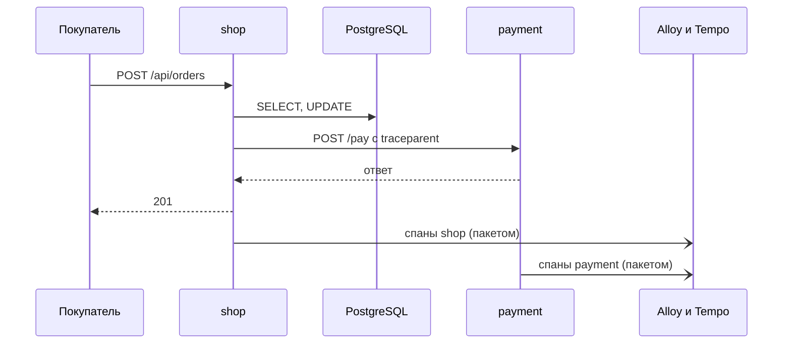
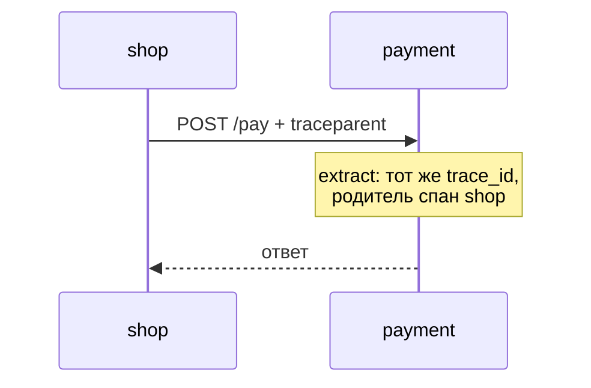
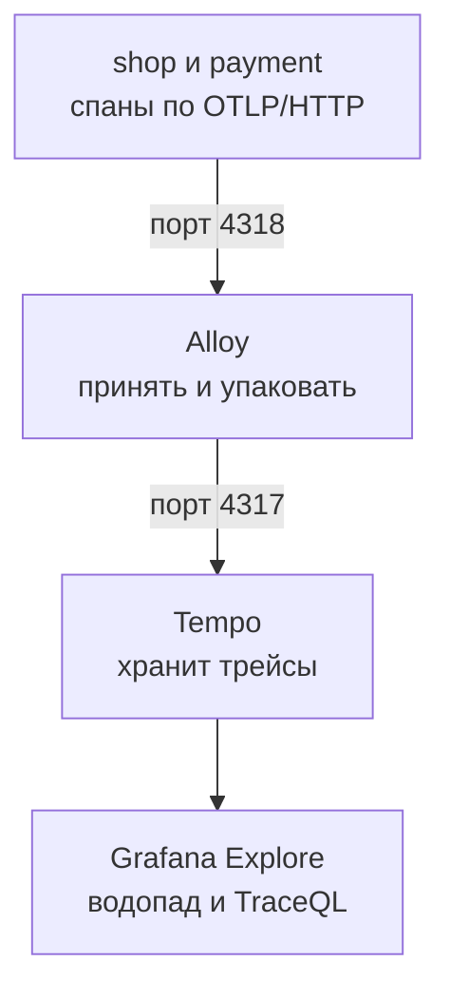

## Зачем это нужно

Тревога сработала, график показал `/api/orders`, лог назвал ошибку: `payment failed`. Хорошо, но у другого заказа лог пишет просто «запрос шёл 2 секунды» и никакой ошибки нет. Где ушли эти две секунды? Заказ сходил в Redis, четыре раза в PostgreSQL, потом вызвал сервис оплаты, который сам сходил куда-то ещё. Строка лога знает только итог: «всё заняло 2 секунды». Метрика знает ещё меньше.

Я столкнулся с этим на первой же распродаже. Два сервиса ссылались друг на друга: «я ждал оплату» и «я думал две секунды». Было непонятно, одно это событие или два, ведь у каждого сервиса свои часы и свои записи. Помог общий номер, который сервисы передавали друг другу вместе с запросом. С ним картина складывалась в одну линию, и виновник нашёлся за пять минут.

Сегодня ты прочитаешь путь одного запроса «Магазина» через все его части, найдёшь медленный шаг и пройдёшь по всей цепочке «метрика, лог, трейс». Это последний урок курса.

Шаг проекта: ты создаёшь в `~/monitoring-lab` файл `04-logs-traces/three-signals.md` с разбором одного медленного заказа: график, строка лога, `trace_id`, спан-виновник и что чинить.

## Что нужно знать

- Логи и `trace_id` в строке: [урок 4.1](01-logs.md). Из него ты помнишь `request_id` и то, что метрика отвечает «где», а лог «почему».
- Метрики и PromQL, `histogram_quantile`: [урок 2.2](../02-metrics/02-promql.md). Алерты, с которых начинается расследование: [урок 3.2](../03-dashboards-alerts/02-alerts.md).
- Три сигнала и «Магазин» на стенде: [урок 1.1](../01-basics/01-signals.md). Запросы по HTTP и заголовки: [load-tester, урок 1.4](../../load-tester/01-linux/04-network-cli.md).

## Картина целиком

Представь накладную, которая едет вместе с посылкой. На каждой остановке (склад, сортировка, курьер) в накладной ставят штамп: «пришла в 10:02, ушла в 10:09». В конце по накладной видно, где посылка пролежала дольше всего. Номер накладной один на весь путь, поэтому штампы разных складов собираются вместе. Аналогия ломается в одном: на почте накладную пишут люди, а в сервисе штампы ставит программа и делает это тысячи раз в секунду, поэтому записи сложно хранить целиком.

В «Магазине» накладная это трейс, штамп это спан (отрезок времени), а склады это `shop`, PostgreSQL, Redis и сервис оплаты `payment`.



На схеме сплошные стрелки это сам запрос, а пунктирные отправка спанов в сторону: сервисы отдают их в фоне, чтобы не тормозить покупателя. Номер трейса `shop` передаёт в `payment` вместе с вызовом, поэтому спаны двух сервисов потом складываются в один трейс. Ниже разберём устройство по шагам и закончим связкой всех трёх сигналов.

## Теория

### Трейс и спан: маршрутный лист запроса

Ты видишь в логе, что заказ шёл 94 миллисекунды. Это число ничего не говорит о том, на что ушло время. Нужна раскладка: сколько заняла база, сколько оплата, сколько сам код `shop`. Для этого запрос делят на шаги и записывают время каждого.

**Спан** (span) это один отрезок работы со временем начала и конца: «SQL-запрос», «вызов оплаты», «обработка запроса». **Трейс** (trace, трассировка) это набор спанов одного запроса, собранных в дерево. Верхний спан называется **корневым** (root): он охватывает весь запрос глазами покупателя. У остальных есть **родитель**: спан, внутри которого они выполнялись. Как маршрутный лист: «весь день» это корень, внутри него «утро» и «вечер», а внутри «утра» отдельные встречи.

Картина по заказу «Магазина» (числа примерные):

```text
POST /api/orders                      94 мс  (корень, shop)
├─ SELECT / UPDATE (корзина, склад)   30 мс  (shop, PostgreSQL)
└─ POST /pay                          58 мс  (shop -> payment)
   └─ POST /pay                       55 мс  (payment, сам сервис)
```

Прочитай строки сверху вниз: вложенность показывает, кто внутри кого. Корень шёл 94 мс. Из них 30 мс ушло на базу и 58 мс на вызов оплаты. Остаток 94 - 30 - 58 = 6 мс это время самого кода `shop` между вызовами. Его называют **собственным временем** (self time): спан минус то, что внутри детей. Начинать поиск нужно с шага, где собственное время и время детей самые большие.

> **Прикинь сам:** корневой спан занял 200 мс, его единственный ребёнок «вызов оплаты» 190 мс. Где причина медленного ответа?
{: .predict}

В оплате, а не в корне. Корень всегда самый длинный: внутри него ждут дети. Осторожно: не обвиняй самый длинный спан, смотри на самый глубокий длинный, то есть на тот, где время тратится само, а не в вызовах дочерних.

Идентификаторы спанов и трейсов выглядят так же, как номера запросов, но устроены строже. Об этом дальше.

> **Главное:** трейс это дерево спанов одного запроса, а виновника ищут в спане, у которого много собственного времени.
{: .key}

### Идентификаторы и атрибуты спана

Как Tempo узнаёт, что три спана заказа это один запрос, а не три чужих? Каждому спану нужны номера, и работают они как в доставке: номер заказа общий, номера позиций свои, а у позиции записано, к какой она относится. Возьмём трейс из прошлого раздела с реальными номерами (покороче не получится, формат фиксированный):

```text
trace_id 9c1d5a7e3b2f4c8d9e0a1b2c3d4e5f60

POST /api/orders   span_id 3f9a1c07d2e84b56   parent: нет (корень)
└─ POST /pay       span_id b7ad6b7169203331   parent: 3f9a1c07d2e84b56
   └─ POST /pay    span_id 5e2c8a90f14d7b13   parent: b7ad6b7169203331
```

**`trace_id`** общий для всех трёх спанов: по нему Tempo понимает, что это один запрос, и по нему же ты потом открываешь трейс. Это 32 шестнадцатеричных символа (цифры и буквы a-f, вместе 128 бит). **`span_id`** свой у каждого спана: 16 символов (64 бита). **`parent_span_id`** это `span_id` родителя: у корня его нет, а у остальных он указывает на спан, внутри которого шёл этот. Tempo сопоставляет номера и строит дерево, как ты только что его прочитал. Заметь, что `span_id` среднего спана `b7ad…` стоит в `parent` у нижнего: так оплата узнаёт, чей она ребёнок.

Теперь о том, что ещё записано в спане. У каждого есть имя (`POST /api/orders`), время начала и длительность. Кроме них у спана есть **тип** (kind): роль спана в разговоре двух сервисов. Верхний спан принял запрос снаружи: это `SERVER`. Средний спан `shop` отправил запрос дальше: это `CLIENT`. Нижний спан `payment` принял его: снова `SERVER`. Работа внутри одного сервиса без обращений наружу, например ожидание соединения из пула, называется `INTERNAL`. Тип нужен, чтобы по картинке видеть, где граница между сервисами.

Ещё у спана есть **статус**: `UNSET` (ничего не сказано), `OK` и `ERROR`. Ответ `5xx` инструментация обычно помечает как `ERROR`, а запрос, где всё хорошо, остаётся `UNSET`. Поэтому поиск «ошибочных спанов» это `status = error`, а не `status = ok`.

Ещё к спану цепляют **атрибуты** (attributes): пары «ключ=значение» с подробностями. У SQL-спана это `db.system="postgresql"`, у HTTP-спана это метод и адрес. Они бывают двух видов. Атрибуты спана относятся к одному шагу. Атрибуты ресурса (resource attributes) описывают того, кто создал спан: имя сервиса `service.name`, версию, хост. Имя сервиса «Магазин» берёт из переменной `OTEL_SERVICE_NAME` (`shop` или `payment`). Если её не задать, имя станет `unknown_service`: трейс будет, а понять, чей он, уже нельзя.

> **Прикинь сам:** в Tempo ты видишь спаны без имени сервиса, подписанные `unknown_service`. Что не настроено?
{: .predict}

Переменная `OTEL_SERVICE_NAME` у процесса. Исправляется в `compose.yaml` сервиса, после чего его пересоздают.

Осторожно: `trace_id` и `request_id` не одно и то же. `request_id` это номер одного обращения к `shop`, а `trace_id` номер всего пути через `shop` и `payment`. В строке лога лежат оба, и каждый нужен для своего: по `request_id` находят строку по жалобе клиента, по `trace_id` открывают трейс.

> **Проверь понимание:** где в трейсе лежит имя сервиса: в атрибутах спана или ресурса?

<details markdown="1">
<summary>Ответ</summary>

В атрибутах ресурса: `resource.service.name`. Оно описывает процесс, который создал спан, и общее для всех его спанов. Поэтому в TraceQL оно пишется с приставкой `resource.`, а, скажем, `db.system` с приставкой `span.`.

</details>

> **Главное:** `trace_id` один на весь трейс (32 символа), `span_id` у каждого спана свой (16 символов), а имя сервиса живёт в атрибутах ресурса.
{: .key}

Номер у спана есть. Но как он попадёт из `shop` в `payment`, ведь это два разных процесса?

### traceparent: как номер едет между сервисами

`shop` и `payment` не делят память. Если `shop` просто вызовет `payment`, тот начнёт новый трейс с новым номером, и связь потеряется. Значит, номер нужно передать вместе с запросом, как накладную кладут в посылку. Эту роль играет HTTP-заголовок **`traceparent`** из стандарта W3C Trace Context.

```text
traceparent: 00-9c1d5a7e3b2f4c8d9e0a1b2c3d4e5f60-b7ad6b7169203331-01
```

Четыре части через дефис: версия формата (`00`), `trace_id`, `span_id` вызывающего спана (он станет родителем у спана на той стороне) и флаги (`01` значит «трейс сохраняем»). Библиотека вызывающей стороны кладёт заголовок в запрос (**inject**, вставка), а библиотека принимающей стороны достаёт его (**extract**, извлечение) и создаёт спан с тем же `trace_id`. На стенде это делают готовые инструментации: `httpx` в `shop` ставит заголовок, `fastapi` в `payment` читает.



Схема показывает мостик между процессами: один заголовок. Именно он делает два сервиса одним трейсом.

> **Прикинь сам:** самописный клиент вызывает `payment` и не кладёт `traceparent`. Что увидишь в Tempo?
{: .predict}

Два отдельных трейса вместо одного: `payment` не знает родителя и начинает свой. Поэтому первый вопрос при «трейс обрывается» звучит так: кто не передал заголовок? Типичный виновник это прокси или шлюз, который режет неизвестные заголовки.

Осторожно: `traceparent` доезжает не сам по себе. Каждый сервис на пути обязан его принять и передать дальше. Один пропущенный сервис разрывает цепочку.

> **Главное:** `traceparent` несёт `trace_id` и родителя от сервиса к сервису, и без него вместо одного трейса получится несколько обрывков.
{: .key}

Кто создаёт спаны и отправляет их? Это делает стандарт, о котором дальше.

### OpenTelemetry и OTLP

Кто всё это записывает? Представь, что на каждом шаге маршрута стоит контролёр с секундомером. Он отмечает, когда запрос вошёл и вышел, и отдаёт записи курьеру, а тот возит их в архив. Если у каждого архива свой бланк, менять архив приходится вместе со всеми контролёрами. Поэтому бланк сделали единым. Аналогия ломается в одном: контролёры не стоят снаружи, их код встроен в сам сервис.

Единый бланк называется **OpenTelemetry** (сокращённо OTel): открытый стандарт того, как сервис создаёт и отправляет спаны. Код пишет в OTel, а куда уйдут данные, решают настройки, как у розетки стандартной формы: прибору всё равно, чья электростанция на другой стороне.

Начнём с контролёров. В коде магазина их почти не видно. Готовая **инструментация** (instrumentation) это библиотека, которая сама оборачивает HTTP, SQL или Redis и создаёт спаны вокруг каждого вызова. В `payment` она подключена одной строкой:

```python
FastAPIInstrumentor.instrument_app(app, excluded_urls="healthz,metrics")
```

С ней каждый запрос к `payment` получает спан без единой дополнительной строки в обработчиках. В `shop` стоят инструментации `fastapi`, `httpx`, `psycopg` и `redis`. Ещё один спан, `db.pool.getconn` (ожидание соединения из пула), добавлен вручную, и это тоже коротко:

```python
with span("db.pool.getconn"):
    conn = pool.getconn()
```

Здесь `span` это обёртка над вызовом OTel «начни спан», она лежит в `shop/app/telemetry.py`. Такой вызов (в стандарте он называется API) просто сообщает: «здесь начался шаг». Что делать со спаном дальше, API не знает.

Дальше работает курьер. **SDK** (набор готового кода, который подключают к программе) принимает спаны, хранит их в памяти и решает, какие брать. **Экспортёр** (exporter) отправляет их наружу. В `shop` они собираются так:

```python
provider = TracerProvider(resource=Resource.create())
provider.add_span_processor(BatchSpanProcessor(OTLPSpanExporter()))
```

`TracerProvider` это сам SDK, а `BatchSpanProcessor` складывает спаны в очередь и отправляет пакетами раз в секунду из отдельного потока. Поэтому запрос не ждёт отправки. Имя сервиса, адрес сборщика и сэмплирование берутся из переменных `OTEL_*` в `compose.yaml`, в коде их нет.

Последнее слово: **OTLP** (OpenTelemetry Protocol) это формат, в котором экспортёр отправляет спаны. Он ходит двумя путями: по HTTP (порт 4318) или по gRPC (порт 4317, быстрый двоичный способ вызова между программами). Как называются порты и зачем их два, мы разберём в следующем разделе.

Если сборщик недоступен, экспорт молча падает по таймауту, а запросы идут как обычно: ошибки экспорта в лог на стенде не пишутся. Цена вопроса: при долгой недоступности часть спанов пропадёт.

> **Прикинь сам:** Alloy остановили на минуту. Замедлятся ли заказы?
{: .predict}

Нет: экспорт идёт в фоне и падает по таймауту, а запросы не ждут. Пострадают трейсы за эту минуту: они не дойдут.

> **Главное:** OpenTelemetry создаёт спаны, OTLP возвращает их в одном формате, а работает это в фоне и не должно ломать то, что наблюдает.
{: .key}

Спаны отправлены. Куда они приходят?

### Alloy и Tempo: путь спанов

Alloy уже знаком по логам из урока 4.1. Для трейсов он собирает цепочку из трёх блоков: приёмник OTLP на порту 4318 (`otelcol.receiver.otlp`), упаковщик (`otelcol.processor.batch`) и отправка на `tempo:4317` (`otelcol.exporter.otlp`). Выход одного блока подключён ко входу другого.

Почему порта два? Потому что в цепочке две передачи, и каждая использует свой вариант OTLP. `shop` и `payment` шлют по HTTP на `http://alloy:4318` (адрес из `OTEL_EXPORTER_OTLP_ENDPOINT`): стенд использует Python-экспортёр для HTTP, и приёмник Alloy настроен только на HTTP. А Tempo принимает по gRPC на `4317`, поэтому Alloy переводит данные из одного варианта в другой. Порты не взаимозаменяемы: gRPC и HTTP говорят на разных «языках».

Что будет, если перепутать, например указать сервисам `http://alloy:4317`? Заказы пойдут как обычно, но трейсов в Tempo не появится: сервис не достучится до приёмника, а его ошибки экспорта на стенде не пишутся в лог. Поэтому ищи не в `shop`, а ниже по цепочке: красные карточки на экране Alloy (`http://localhost:12345`), строки с ошибкой в `docker compose logs alloy` и пустой результат в Explore по Tempo. Для проверки порта изнутри сети достаточно `docker compose exec shop python -c "import socket; socket.create_connection(('alloy', 4318), 3)"`: без ошибки значит, порт слушают.



На схеме добавляется ещё одно звено по сравнению с логами. Сервисам не нужно знать адрес хранилища, а в Alloy позже можно добавить фильтры или копию трейсов в другую систему без правки кода.

**Tempo** это хранилище трейсов от Grafana Labs. Как и Loki, он дёшев: не строит указатель по каждому значению атрибута. Принятые спаны сначала держатся в памяти и журнале на диске (WAL), потом сбрасываются в блоки. Следствие в том, что быстро Tempo находит трейс только по `trace_id`: прямое обращение к номеру. Поиск по другим условиям (имя сервиса, длительность, атрибуты) перебирает блоки, поэтому медленнее. Данные на стенде лежат в томе `tempo` 24 часа: срок хранения (`block_retention`) задан в `monitoring/tempo/tempo.yaml`. Порт 3200 это адрес Tempo для Grafana и для тебя.

Версию Tempo бери из `compose.yaml` стенда: там закреплена `grafana/tempo:2.10.8`. Тот же `2.10` указан и в `CLAUDE.md` курса load-tester, расхождения по смыслу нет.

Осторожно: сразу после заказа трейса в Tempo может ещё не быть: спаны уходят раз в секунду-две, а хранилище отдаёт их с задержкой. Подожди 10-15 секунд, прежде чем решить, что трейсов нет.

> **Главное:** сервисы шлют спаны в Alloy, Alloy в Tempo, а искать быстро можно только по `trace_id`.
{: .key}

Трейс найден и открыт. Как читать его на экране?

### Водопад: как читать трейс

Дерево спанов рисуют **водопадом** (waterfall): строка на спан, горизонтальная ось это время от начала запроса, длина полосы это длительность, отступ показывает вложенность. Попробуй сам.

<div class="viz" data-viz="trace-waterfall" data-scenario="order"></div>

Начни со сценария «Заказ: всё хорошо»: корневая полоса охватывает остальные, SQL идёт друг за другом, оплата стоит одним блоком. Затем переключись на «Медленную оплату»: одна полоса занимает почти всю ширину, и виновник виден сразу.

Три типичные формы водопада стоит узнавать с одного взгляда. **Одна длинная полоса**: один спан занимает почти всё время, например `POST /pay` две секунды. Чинить нужно именно его. **Лесенка одинаковых коротких спанов**: десятки `SELECT` подряд это N+1 (запрос в цикле: один запрос за списком и по одному на каждый элемент). Каждый запрос быстр и в списке медленных запросов базы его нет, а в трейсе лесенка видна сразу. **Повторы подряд**: несколько одинаковых красных вызовов оплаты это ретраи (повторные попытки) без паузы. Метрики показали бы это как «запросов к оплате втрое больше, чем заказов», а трейс одного заказа показывает все попытки.

<div class="viz" data-viz="trace-waterfall" data-scenario="retries"></div>

Здесь четыре красные попытки оплаты друг за другом. Переключись на «N+1: список заказов» и нажми «Свернуть повторы»: двадцать полос сложатся в одну с подписью `SELECT x20`.

> **Проверь понимание:** в трейсе заказа десять одинаковых коротких `SELECT` подряд, каждый по 2 мс. В списке медленных запросов базы ничего нет. Это ошибка мониторинга?

<details markdown="1">
<summary>Ответ</summary>

Нет, это N+1. Каждый запрос быстрый, поэтому медленных в базе нет, а вместе они дают заметное время и лишние обращения (и ещё нагрузку на пул соединений). Лесенка одинаковых спанов видна только в трейсе. Исправление: заменить запросы в цикле одним общим запросом.

</details>

> **Главное:** форма водопада подсказывает причину: длинная полоса значит медленный шаг, лесенка значит N+1, повторы значат ретраи.
{: .key}

Водопад открывают по номеру. А если номера нет?

### TraceQL: найти трейс без номера

Номера у тебя нет, а есть только описание: «заказ дольше секунды». Для этого есть **TraceQL**, язык запросов к трейсам. Он похож на LogQL и PromQL: в фигурных скобках условия на спан, справа от `|` функции.

```text
{ resource.service.name = "payment" }
```

Все спаны сервиса `payment`. Ещё три примера:

```text
{ name = "POST /api/orders" && duration > 1s }
{ resource.service.name = "shop" && status = error }
{ span.db.system = "postgresql" } | count() > 10
```

Первый находит заказы дольше секунды. Второй спаны с ошибкой в `shop`. Третий трейсы, где больше десяти SQL-спанов: так ловят лесенку N+1. Читай их по частям: `resource.` это атрибуты процесса, `span.` атрибуты шага, `name` имя спана, `duration` длительность, `&&` значит «и».

На выходе получаешь список трейсов с корневым именем и временем. Выбираешь самый длинный и сравниваешь с типичным: куда ушла разница?

> **Прикинь сам:** запрос `{ duration > 1s }` вернул 400 трейсов, а ты ищешь один заказ. Как сузить?
{: .predict}

Добавь имя и сервис: `{ resource.service.name = "shop" && name = "POST /api/orders" && duration > 1s }`. Чем больше точных условий, тем меньше блоков придётся перебирать. Лучше всего сработает связка по номеру из лога.

Осторожно: имена атрибутов бери из реального трейса, а не из головы. Ошибка в `span.db.system` даёт пустой список без подсказки. Открой любой трейс и посмотри, как атрибут записан в карточке спана.

> **Главное:** TraceQL ищет трейсы по условиям на спаны, а точнее всего поиск по `trace_id` из лога.
{: .key}

Хранить все трейсы дорого. Что с этим делают?

### Сэмплирование и цена трейсинга

Прикинем, сколько данных дают трейсы. Берём 1000 запросов в секунду, на каждый по 15 спанов (так выглядит заказ с базой, Redis и оплатой): 1000 × 15 = 15 000 спанов в секунду. Спан весит около 500 байт (имя, время, номера, атрибуты), значит, 15 000 × 500 = 7 500 000 байт, то есть 7,5 МБ в секунду. В сутках 86 400 секунд, поэтому 7,5 МБ × 86 400 ≈ 648 000 МБ, около 650 ГБ в сутки. Столько диска никто не хочет отдавать под трейсы, и поэтому на проде хранят долю трейсов. Выбор доли называется **сэмплированием** (sampling): это как проверять на фабрике каждую сотую упаковку. Дёшево, но редкую поломку можно пропустить.

Есть два подхода. При **head-сэмплировании** (решение в начале) трейс берут или нет вслепую, в момент старта, например каждый десятый. При **tail-сэмплировании** (решение в конце) решают, когда трейс закончился, и сохраняют все с ошибками или длиннее секунды: в Alloy это отдельная настройка. Режим `parentbased` делает так: первый сервис на пути решает, остальные следуют его флагу из `traceparent` (последняя цифра `01`). Иначе `shop` сохранил бы свой кусок, а `payment` нет, и трейс вышел бы рваным.

На стенде хранится всё: `OTEL_TRACES_SAMPLER=parentbased_always_on` и `OTEL_TRACES_SAMPLER_ARG=1.0`. Для высокой нагрузки ставят `parentbased_traceidratio` с `0.1`: 10% трейсов.

> **Прикинь сам:** в метриках p95 заказов 1,2 с, а в Tempo при 10% видно всего три медленных трейса. Метрики врут?
{: .predict}

Нет. Счётчики Prometheus считают все запросы, а трейсы это выборка. Метрика отвечает «сколько», трейс «где».

Осторожно: трейсы стоят процессора и сети самого сервиса и могут чуть искажать замеры. При поиске предела нагрузки отмечай в отчёте, были ли они включены.

> **Главное:** сэмплирование уменьшает число трейсов, но не метрик, а tail-режим сохраняет редкое: ошибки и медленное.
{: .key}

Теперь у нас есть все три сигнала. Остаётся связать их в одну цепочку.

### Связь трёх сигналов

Три сигнала хранятся в трёх системах и сами по себе не связаны. Связывает их Grafana, и делает это тремя приёмами. Первый это **производное поле** (derived field) в источнике Loki: регулярное выражение `"trace_id":\s*"(\w+)"` вытаскивает номер из строки лога и рисует кнопку «Открыть трейс», которая открывает Tempo. Второй это обратная связь в источнике Tempo (`tracesToLogs`): из спана переходишь к логам `{service="shop"} |= "<trace_id>"` в окне минута до и минута после спана. Третий это общее время и метки, как в уроке 4.1: график метрики и панель логов делят интервал.

Есть и четвёртый приём, **экземпляры** (exemplars): метрика может хранить рядом с числом пример `trace_id` запроса, который попал в корзину гистограммы, и на графике появляются точки со ссылкой на трейс. На нашем стенде они не включены, но в боевых системах встречаются: знай, что так бывает.

Вот цепочка целиком на нашем магазине:

<div class="viz" data-viz="flow" data-steps='[{"title":"Алерт и график","text":"Сработал `ShopHighLatencyP95`; на графике p95 `/api/orders` вырос с 0,1 до 2 секунд."},{"title":"Метрика сужает","text":"`shop_payment_duration_seconds` выросла так же: время уходит в оплату, а не в базу."},{"title":"Лог называет запрос","text":"`{service=\"shop\"} | json | route=\"/api/orders\" | duration_ms > 1000` даёт строки с `request_id` и `trace_id`."},{"title":"Трейс показывает шаг","text":"Кнопка «Открыть трейс» из строки лога: одна длинная полоса `POST /pay` в сервисе `payment`."},{"title":"Решение","text":"Чинить оплату (таймаут, ретраи, внешний сервис), а не базу и не процессор магазина."}]'></div>

Схема показывает порядок: метрика отвечает «где и когда», лог «какой запрос и какой номер», трейс «на каком шаге потеряно время». Каждый следующий сигнал уточняет предыдущий, а общие «ниточки» это время, метка `route` и `trace_id`.

> **Прикинь сам:** почему `trace_id` кладут в лог полем, а не меткой Loki?
{: .predict}

Это идентификатор с миллионами значений: по правилу кардинальности из урока 4.1 метка раздула бы индекс. Поле в строке находится фильтром, а в Grafana из него делают кнопку.

Осторожно: ссылка из лога в трейс работает, только если у запроса есть трейс. Строки `/healthz`, `/readyz` и `/metrics` трейсов не имеют, и поля `trace_id` в них нет: кнопки на них не будет.

> **Главное:** метрика показывает, где и когда, лог называет запрос, трейс показывает шаг, а `trace_id` в строке лога склеивает их.
{: .key}

Теория закончилась. Давай пройдём цепочку руками.

## Практика

Стенд «Магазин» поднят с профилем `monitoring`, Grafana открыта на `http://localhost:3000`. Нагрузку и поломки делай только на своём локальном стенде.

### 1. Убедись, что трейсы текут

```bash
cd ~/learning/load-tester/project/shop
docker compose --profile monitoring ps tempo alloy
curl -s localhost:3200/ready
```

`ps tempo alloy` показывает состояние двух сервисов, `/ready` спрашивает у Tempo порт 3200 «готов принимать данные».

**Что должно получиться** (пример):

```text
NAME             IMAGE                    COMMAND   SERVICE   STATUS          PORTS
shop-alloy-1     grafana/alloy:v1.20.1    ...       alloy     Up 2 minutes    127.0.0.1:12345->12345/tcp
shop-tempo-1     grafana/tempo:2.10.8     ...       tempo     Up 2 minutes    127.0.0.1:3200->3200/tcp
ready
```

**Как читать вывод:** оба сервиса в статусе `Up`, Tempo отвечает `ready`. Сразу после запуска Tempo может ответить `Ingester not ready: waiting for 15s after being ready`: подожди 15 секунд.

**Типичные ошибки:**

- `curl: (7) Failed to connect to localhost port 3200`: стенд поднят без профиля `monitoring`. Выполни `docker compose --profile monitoring up -d --wait`.

### 2. Сделай заказ и найди его `trace_id`

```bash
TOKEN=$(curl -fsS localhost:8000/api/login -H 'Content-Type: application/json' \
  -d '{"email":"user0001@shop.lab","password":"password"}' | jq -r .token)
curl -s -o /dev/null -H "Authorization: Bearer $TOKEN" -H 'Content-Type: application/json' \
  localhost:8000/api/cart/items -d '{"product_id":7,"qty":1}'
curl -s -o /dev/null -w '%{http_code}\n' -X POST -H "Authorization: Bearer $TOKEN" localhost:8000/api/orders
docker compose logs shop --no-log-prefix | grep '"/api/orders"' | tail -n 1 | jq '{status, duration_ms, request_id, trace_id}'
```

Первая команда входит и сохраняет токен в переменную, вторая кладёт товар 7 в корзину, третья оформляет заказ и печатает код. Последняя берёт из логов `shop` свежую строку про `/api/orders` и показывает четыре поля.

**Что должно получиться** (пример; номера и время будут другими):

```json
{
  "status": 201,
  "duration_ms": 92.41,
  "request_id": "8d2f61c0a59e4b73a1f0c4e2b6d37a15",
  "trace_id": "0e7b3c9a4d1f4a2b8c5e6f7a8b9c0d1e"
}
```

**Как читать вывод:** `201` значит, что заказ создан. `trace_id` это 32 символа: скопируй его, он нужен дальше. Время около 90 мс похоже на «здоровый» заказ.

**Типичные ошибки:**

- `jq: error ... Cannot index string`: токен не получен (`echo $TOKEN` пуст). Проверь, что стенд работает и email верный.
- Пустой вывод последней команды: строка ещё не появилась, подожди секунду и повтори.
- Код `400` вместо `201`: корзина пуста, повтори вторую команду.

### 3. Открой трейс в Grafana

Открой `http://localhost:3000/explore`, источник **Tempo**, режим запроса по номеру трейса, вставь `trace_id` из шага 2 и выполни. Если трейс «не найден», подожди 10-15 секунд.

**Что должно получиться:** водопад: корневой `POST /api/orders` около 90 мс, под ним команды Redis (`GET`, `HGETALL`), `db.pool.getconn`, несколько `SELECT`/`INSERT`/`UPDATE`, затем `POST` к оплате и вложенный `POST /pay` из сервиса `payment`, в конце `DEL`. Точный набор у тебя может отличаться.

Ответь письменно, в `traces.md` (шаг 7): сколько спанов и в скольких сервисах; какой спан самый длинный и какую долю корня он занимает; сколько заказ ждал соединения (`db.pool.getconn`); какой атрибут у `POST /pay` показывает адрес вызова.

**Как читать вывод:** корень длиннее суммы детей: в нём ещё время самого кода. Оплата около 50 мс это норма: заглушка отвечает за 50 мс.

### 4. Из лога в трейс и обратно

В Explore выбери источник **Loki** и выполни запрос из урока 4.1:

```logql
{service="shop"} | json | route="/api/orders"
```

Раскрой любую строку: у поля `trace_id` будет кнопка **Открыть трейс**. Нажми её: откроется водопад. В водопаде раскрой любой спан и нажми кнопку перехода к логам: вернёшься к строкам лога этого запроса.

**Типичные ошибки:**

- У `trace_id` нет кнопки: строка старая (до включения трейсов) или у запроса нет трейса. Возьми свежую строку.
- Кнопка ведёт на пустую страницу: Tempo ещё не получил спаны, подожди 10-15 секунд.

### 5. Найди запрос TraceQL

Переключи Tempo на запрос TraceQL и выполни:

```text
{ resource.service.name = "payment" }
```

Теперь немного движения. Двадцать заказов подряд (в корзину кладём товар перед каждым):

```bash
for i in $(seq 1 20); do
  curl -s -o /dev/null -H "Authorization: Bearer $TOKEN" -H 'Content-Type: application/json' localhost:8000/api/cart/items -d '{"product_id":7,"qty":1}'
  curl -s -o /dev/null -X POST -H "Authorization: Bearer $TOKEN" localhost:8000/api/orders
done
```

Выполни `{ name = "POST /api/orders" && duration > 100ms }` и выбери самый длинный трейс. Сравни с типичным: куда ушла разница?

**Как читать вывод:** список отсортирован по времени, у каждого трейса видны корневое имя и длительность. Если список пуст, снизь порог до `duration > 50ms`: на здоровом стенде медленных заказов мало.

### 6. Лесенка N+1

На стенде по умолчанию включён заложенный баг `BUG_N_PLUS_ONE=1`: список заказов делает отдельный запрос на каждый заказ.

```bash
curl -s -o /dev/null localhost:8000/api/orders -H "Authorization: Bearer $TOKEN"
```

В Tempo найди трейс запросом:

```text
{ span.db.system = "postgresql" } | count() > 10
```

**Что должно получиться:** трейс `GET /api/orders` с лесенкой одинаковых `SELECT`. При 20 заказах у пользователя их 21: один за списком и по одному на каждый заказ (сколько их будет у тебя, зависит от числа твоих заказов).

**Как читать вывод:** каждый `SELECT` быстрый, но их много. Это та форма водопада, которую метрики не показывают.

### 7. Собери всю цепочку и сохрани

Запиши в `~/monitoring-lab/04-logs-traces/traces.md` ответы шага 3 и два запроса TraceQL, а полную цепочку ниже в `three-signals.md` после раздела «Сломай и почини». Сохрани файлы в историю:

```bash
cd ~/monitoring-lab
git add 04-logs-traces/traces.md
git commit -m "docs: трейсы Магазина и запросы TraceQL"
```

## Сломай и почини

Сломаем оплату и пройдём путь расследования целиком: график, лог, трейс. Сначала прочитай симптом и выпиши гипотезы, а проверки открывай потом.

### Симптом

Покупатели жалуются, что заказ оформляется очень долго. Ошибок нет, всё отвечает `201`. Ты делаешь оплату медленной:

```bash
curl -fsS localhost:8001/admin/config -H 'Content-Type: application/json' -d '{"delay_ms":2000,"fail_rate":0}'
for i in $(seq 1 6); do
  curl -s -o /dev/null -H "Authorization: Bearer $TOKEN" -H 'Content-Type: application/json' localhost:8000/api/cart/items -d '{"product_id":7,"qty":1}'
  curl -s -o /dev/null -w '%{http_code} %{time_total}\n' -X POST -H "Authorization: Bearer $TOKEN" localhost:8000/api/orders
done
```

Порт 8001 это сервис оплаты, `delay_ms` задерживает каждый ответ. Цикл шесть раз кладёт товар в корзину и оформляет заказ.

**Что получится** (пример): шесть строк вида `201 2.09`: коды успешные, время около двух секунд.

### Гипотезы

1. База данных тормозит.
2. Нехватка процессора у `shop`.
3. Внешняя часть пути, оплата, отвечает долго.
4. Закончились соединения в пуле базы.

### Проверки

Иди по цепочке сигналов, по одному шагу:

1. **Метрика.** В Prometheus (`http://localhost:9090`) выполни `histogram_quantile(0.95, sum by (le) (rate(http_request_duration_seconds_bucket{route="/api/orders"}[1m])))` и `rate(shop_payment_duration_seconds_sum[1m]) / rate(shop_payment_duration_seconds_count[1m])`: p95 заказов около двух секунд и среднее время оплаты такое же. Значит, время уходит в оплату.
2. **Лог.** В Explore (Loki): `{service="shop"} | json | route="/api/orders" | duration_ms > 1000`. Строки идут с уровнем `WARNING` (запрос дольше секунды), без поля `error`. Возьми из любой `trace_id`.
3. **Трейс.** Нажми «Открыть трейс» или вставь `trace_id` в Tempo. Или найди без номера: `{ name = "POST /pay" && duration > 1s }`.

**Что получится** (пример): в водопаде одна длинная полоса `POST /pay` около 2 с в сервисе `payment`, а базовые `SELECT` и Redis короткие.

**Как читать вывод:** сначала метрика сузила виновного (оплата), потом лог дал конкретный запрос и номер, и наконец трейс показал шаг. Гипотезы 1, 2 и 4 отпали: SQL-спаны короткие, `db.pool.getconn` почти нулевой.

### Исправление

<details markdown="1">
<summary>Разбор</summary>

Верна гипотеза 3. Задержка целиком на стороне оплаты: один спан занимает почти всё время. База, процессор и пул соединений в порядке. Если бы метрика показала рост ожидания пула, а в трейсе был бы длинный `db.pool.getconn`, правдой была бы гипотеза 4. Так выглядит разница между «ждём чужой сервис» и «ждём соединение».

Верни оплату в норму и проверь, что трейс снова «здоровый»:

```bash
curl -fsS localhost:8001/admin/config -H 'Content-Type: application/json' -d '{"delay_ms":50,"fail_rate":0}'
```

Запиши в `three-signals.md`: график, строку лога (`request_id` и `trace_id`), спан-виновник `POST /pay` и вывод «чинить оплату: таймаут и ретраи, а не базу».

Отдельная поломка в запасе: `TRACING_ENABLED=0` для `shop` и `payment` (пересоздание командой `docker compose --profile monitoring up -d shop payment` с этой переменной). Заказы работают, а в логе нет поля `trace_id`, и поиск трейсов ничего не находит. Вернуть: пересоздать сервисы без переменной. Урок: трейсы включаются снаружи и не меняют логику, а если трейсов нет, проверяй по звеньям: включены ли они у сервиса, доходит ли порт 4318 до Alloy, принимает ли Tempo (`/ready`).

</details>

## ИИ в помощь

Нейросеть быстро объясняет водопад и пишет TraceQL, но обвиняет самый длинный спан и придумывает названия атрибутов. Общие правила: [ИИ-помощник](../../load-tester/ai.md).

**Задача:** прочитать трейс.

```text
Вот спаны одного заказа интернет-магазина (имя, сервис, длительность, родитель): POST /api/orders (shop, 2100 мс, корень); SELECT cart (shop, 3 мс, родитель корень); db.pool.getconn (shop, 1 мс, родитель корень); POST (shop, 2050 мс, родитель корень); POST /pay (payment, 2040 мс, родитель POST shop). Где потеряно время и что стоит проверить в первую очередь? Объясни, как ты считал собственное время каждого спана.
```
{: .wrap}

**Проверь ответ:** виновник должен быть назван `POST /pay` в `payment` (собственное время около 2040 мс), а не корень и не внешний `POST`: внутри них ждут дети. Типичная ошибка нейросети: считать виновником самый длинный спан, то есть корень.

**Задача:** написать TraceQL.

```text
Напиши запрос TraceQL: найти трейсы, где у спанов сервиса payment длительность больше 500 мс. Объясни каждое условие в фигурных скобках и скажи, чем resource.service.name отличается от span.http.method.
```
{: .wrap}

**Проверь ответ:** сверь с примерами в теории: `{ resource.service.name = "payment" && duration > 500ms }`. Проверь, что нейросеть различает атрибуты ресурса и спана, и открой реальный трейс: имена атрибутов бери из карточки спана, а не из ответа.

> Запрос TraceQL не находит трейсы? Скопируй запрос и список имён и атрибутов спанов из реального трейса, спроси нейросеть, где расхождение, и проверь по карточке спана в Grafana.
{: .ai}

## Словарик урока

| Термин | Простыми словами |
|---|---|
| Трейс (trace) | Все спаны одного запроса, собранные в дерево |
| Спан (span) | Один отрезок работы со временем начала и конца |
| Корневой спан | Верхний спан: весь запрос глазами покупателя |
| Собственное время (self time) | Время спана без времени его детей |
| `trace_id` и `span_id` | Номер трейса (32 символа) и номер спана (16 символов) |
| `traceparent` | HTTP-заголовок, который несёт `trace_id` и родителя между сервисами |
| OpenTelemetry (OTel) | Открытый стандарт библиотек и формата для спанов |
| OTLP | Формат передачи телеметрии: gRPC на 4317 и HTTP на 4318 |
| Инструментация | Готовая обёртка, которая сама создаёт спаны вокруг HTTP, SQL и Redis |
| Tempo | Хранилище трейсов, быстрое по `trace_id` |
| TraceQL | Язык запросов к трейсам: условия на спаны в `{}` |
| Сэмплирование | Выбор, какую долю трейсов хранить (head или tail) |
| N+1 | Один запрос за списком и по одному на каждый элемент: лесенка в водопаде |

## Вопросы с собеседований

Раздел для повторения: ответь вслух, потом открой ответ. Короткие вопросы с пометкой `[на скорость]` тренируй на время: ответ за 30 секунд.



## Проверено на версиях

Стенд «Магазин» из `load-tester/project/shop`: Docker Compose v2, Prometheus 3.15, Grafana 13.2, Loki 3.7, Tempo 2.10, Alloy 1.20, OpenTelemetry Python SDK 1.45, `jq` 1.7. Октябрь 2026.

## Итог урока: ты умеешь

- [ ] Объяснить, что такое трейс и спан, и найти корень и собственное время спана.
- [ ] Прочитать `trace_id` и `span_id` и объяснить, как `traceparent` связывает `shop` и `payment`.
- [ ] Описать путь спана от сервиса через Alloy до Tempo и назвать порты 4317 и 4318.
- [ ] Узнать по форме водопада медленный шаг, N+1 и ретраи.
- [ ] Найти трейс запросом TraceQL и по `trace_id` из лога.
- [ ] Объяснить сэмплирование и почему при нём метрики не врут.
- [ ] Пройти цепочку «график, строка лога, трейс» и назвать шаг, который нужно чинить.

## Где это применить

- [DevOps, урок 8.8: трейсинг](../../devops/08-observability/08-tracing.md): трейсы в приложении «Заметки», ручной спан через OTLP и `trace_id` в логах.
- [load-tester, урок 7.7: трейсы](../../load-tester/07-observability/07-traces.md): как читать водопад «Магазина» под нагрузкой и находить в нём медленную оплату.
- [load-tester, урок 11.5: кэш и внешние зависимости](../../load-tester/11-bottlenecks/05-cache-dependencies.md): ретраи и медленная оплата как узкое место, которое ты теперь узнаёшь в трейсе.
- [DevOps, тема 8 целиком](../../devops/08-observability/index.md): Kubernetes, service mesh и паттерны надёжности с burn rate.

Дальше: курс «Мониторинг: основы» закончен. Применяй его в прикладных курсах: [DevOps, тема 8](../../devops/08-observability/index.md) строит мониторинг проекта «Заметки», а [load-tester, тема 7](../../load-tester/07-observability/index.md) учит находить узкие места под нагрузкой.
