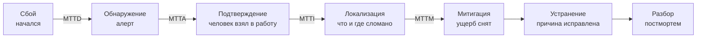
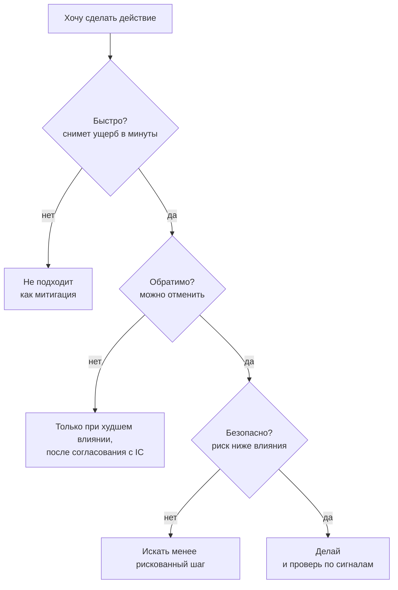

## Зачем это нужно

Четверг, вечер. На экране дежурного красный алерт: магазин отдаёт ошибки. Опытный инженер сначала спрашивает себя, насколько всё плохо и становится ли хуже. Неопытный бросается чинить: перезапускает сервис, откатывает релиз, правит конфиг. Три действия подряд, и уже никто не знает, что из них помогло, а что добавило проблем.

Эта картина знакома каждому, кто дежурил, и кончается она обычно одинаково: беда была в одном месте, а вторую поломку человек устроил сам, потому что спешил. Поэтому у инцидента есть порядок, как у посадки самолёта: сначала оценить, потом снять ущерб, потом искать причину. Не наоборот.

Этот урок о том, что происходит между «сработал алерт» и «покупатели снова покупают». Ты разберёшь жизненный цикл инцидента, роли, оценку влияния по золотым сигналам и правило «риск действия не выше влияния». Потом проведёшь настоящий учебный инцидент на «Магазине» и посчитаешь, сколько минут ушло на каждый этап.

Шаг проекта: в `~/monitoring-lab/incidents/` лежат хронология учебного инцидента (`incident-01.log`), скрипт `mttx.py`, шаблон статус-обновлений и итоговая запись `incident-01.md`. На них опирается урок 5.2: постмортем ты напишешь именно по ним.

## Что нужно знать

- Золотые сигналы, RED и USE, симптом против причины: [урок 1.1](../01-basics/01-signals.md). SLO и бюджет ошибок: [урок 1.2](../01-basics/02-sli-slo.md).
- Запросы PromQL (`rate`, `histogram_quantile`, `offset`): [урок 2.2](../02-metrics/02-promql.md).
- Дашборды, скрипт `orders.sh` и поломка оплаты: [урок 3.1](../03-dashboards-alerts/01-grafana.md). Алерты и severity: [урок 3.2](../03-dashboards-alerts/02-alerts.md).
- Логи и трейсы с `trace_id`: [урок 4.1](../04-logs-traces/01-logs.md) и [урок 4.2](../04-logs-traces/02-traces.md).
- Стенд с профилем `monitoring` запущен. `docker compose`, `curl`, `jq`: [load-tester, урок 5.3](../../load-tester/05-docker/03-compose-shop.md).

## Картина целиком

Представь скорую помощь. Звонок поступил (обнаружение), диспетчер принял вызов (подтверждение), бригада на месте определила, что случилось (локализация), остановила кровотечение (митигация), довезла в больницу и вылечила (устранение). А потом врачи разбирают случай на планёрке (разбор). Стабилизация идёт раньше лечения: сначала остановить кровь, потом выяснять, откуда она текла.

Инцидент в нашем деле проходит те же шесть этапов, и у каждого есть свой счётчик времени.



Читай схему слева направо. Подпись на стрелке это счётчик времени, который идёт до следующего этапа: от сбоя до алерта MTTD, до подтверждения MTTA, и так далее. Расшифровка: MTTD это среднее время до обнаружения, MTTA до подтверждения, MTTI до локализации, MTTM до митигации, MTTR до полного восстановления. Подробно они разобраны ниже, в разделе «MTTD, MTTA, MTTI, MTTM, MTTR на одной хронологии». После митигации пользователям уже хорошо, но работа не кончена: причину ещё нужно исправить, а потом разобрать.

## Теория

### Что такое инцидент и состояние опасности

Диск в базе растёт. Сегодня занято 70%, завтра 73, послезавтра 76. Пока место есть, все довольны, а сервис по определению «работает». Но если расти так и дальше, через несколько дней запись в базу остановится. Это уже беда, хотя покупатель её ещё не заметил.

**Инцидент** (incident) для SRE это ситуация, в которой сервис вышел из нормального, стабильного состояния. Не только «всё лежит»: задержка выросла в два раза, доля ошибок поднялась с 0,06% до 0,4%, диск заполняется в десять раз быстрее обычного. А **состояние опасности** (hazardous state) это условия, которые вместе с неудачным стечением обстоятельств приведут к инциденту. Диск на 90% с быстрым ростом это состояние опасности: сбоя нет, но он назначен на ближайшие сутки.

Разберём пример на бумаге, он будет сквозным для всего урока (это расчёт, а не замер со стенда, но метрики в запросе настоящие, их отдаёт `node-exporter` стенда). Диск базы за трое суток вырос с 70% до 100%: это 10% в сутки при обычных 0,5%, то есть в 20 раз быстрее. На 48-м часу `predict_linear` (функция PromQL, прогноз по прямой) уже показывает «полон через 24 часа».

<div class="viz" data-viz="mon-panel" data-title="Диск базы: 72 часа до сбоя" data-query="100 - node_filesystem_avail_bytes{mountpoint=&quot;/&quot;} / node_filesystem_size_bytes{mountpoint=&quot;/&quot;} * 100" data-unit="%" data-explain="Диск растёт по 2,5% за шесть часов, это 10% в сутки. Обычный рост 0,5% в сутки лежит почти горизонтально. Пока это не сбой, а состояние опасности." data-x='["0 ч","6 ч","12 ч","18 ч","24 ч","30 ч","36 ч","42 ч","48 ч","54 ч","60 ч","66 ч","72 ч"]' data-series='[{"name":"диск базы","values":[70.0,72.5,75.0,77.5,80.0,82.5,85.0,87.5,90.0,92.5,95.0,97.5,100.0],"color":"red"},{"name":"обычный рост","values":[70.0,70.12,70.25,70.38,70.5,70.62,70.75,70.88,71.0,71.12,71.25,71.38,71.5],"color":"blue"}]' data-thresholds='[{"value":100,"color":"red","label":"диск полон"}]' data-annotations='[{"at":"48 ч","text":"predict_linear: полон через 24 ч"}]' data-try="наведи на точку 48 ч: диск 90%, до полного заполнения ещё сутки. Это и есть время на спокойное решение."></div>

Красная линия идёт в потолок, синяя почти лежит. Наведи на точку в 48 часов: диск 90%, и у дежурного ещё сутки на спокойное решение. Через 72 часа сутки кончатся, и состояние опасности превратится в инцидент.

> **Прикинь сам:** за сутки диск вырос на 0,5%, а сегодня на 10%. Это инцидент или состояние опасности?
{: .predict}

Состояние опасности. Покупатели пока ничего не замечают, но система уже вне нормы, и время на исправление ограничено. Хороший алерт на предсказание (запись в тикет с `severity: warning`) превращает будущий ночной инцидент в рабочую задачу на день.

Осторожно: «нет ошибок» не значит «нет проблемы». Если смотреть только на ошибки, состояние опасности пропустишь до самого сбоя.

> **Главное:** инцидент это выход сервиса из нормы, а состояние опасности это условия, при которых он случится; чем раньше поймал, тем спокойнее решение.
{: .key}

Допустим, диск всё же заполнился. Насколько всё серьёзно и кого будить?

### Серьёзность: severity

Один алерт говорит «диск на 80%», другой «оплата падает у трети покупателей». Относиться к ним одинаково нельзя. Поэтому у инцидента есть уровень, **severity** (серьёзность): он решает, насколько срочно реагировать.

В курсе три уровня, те же, что на алертах в [уроке 3.2](../03-dashboards-alerts/02-alerts.md) и в [DevOps, уроке 10.1](../../devops/10-capstone/01-oncall-drill.md):

| Уровень | Что значит | Что делаем |
|---|---|---|
| `critical` | пользователи получают ошибки прямо сейчас | реагируем немедленно, хоть ночью |
| `warning` | проблема назревает, но пока не бьёт по людям | разбираемся в рабочее время |
| `info` | к сведению | читаем на досуге |

Уровень определяется текущим вредом, а не важностью сервиса. Упавший тестовый стенд это `warning` или даже `info`, а 30% ошибок в оплате `critical`. Уровень не высечен в камне: если за час `warning` превратился в ошибки у покупателей, его поднимают. И наоборот, после митигации снижают.

В нашем примере с диском сначала это `warning`, пока диск на 90% и растёт. В 11:30 диск полон, запись невозможна, заказы падают: это `critical`.

> **Прикинь сам:** база падает на ночной выгрузке отчётов, покупателей в это время нет. Какой уровень?
{: .predict}

Скорее `warning`: вред для пользователей пока нулевой, а будить человека ради отчёта не нужно. Если выгрузка идёт и днём, картина другая. Оценку делает человек, а не метка в названии алерта.

Осторожно: severity не говорит, кто виноват и как чинить. Это про срочность, и всё.

> **Главное:** severity отвечает на вопрос «страдают ли пользователи прямо сейчас» и задаёт срочность реакции.
{: .key}

Теперь посмотрим, из каких этапов состоит сам инцидент.

### Жизненный цикл: шесть этапов

Диск полон, в 11:30 запись остановилась. Что делает команда? В любом инциденте происходит одно и то же, в одном и том же порядке, и у каждого этапа свой вопрос.

| Этап | Вопрос | Результат |
|---|---|---|
| Обнаружение | Что-то сломалось? | сработал алерт или позвонил пользователь |
| Подтверждение | Это настоящая беда, и кто ею занимается? | человек взял инцидент в работу |
| Локализация | Что и где сломано? | назван компонент или причина в одну фразу |
| Митигация | Как снять ущерб прямо сейчас? | пользователям снова хорошо, причина может остаться |
| Устранение | Как исправить причину? | система работает штатно |
| Разбор | Что изменим, чтобы не повторилось? | постмортем с планом действий |

Первый этап зависит от мониторинга: чем лучше алерты, тем короче путь от сбоя до дежурного. Вот так это выглядит на учебном инциденте, который мы проведём в практике. Оплата замедлилась до пяти секунд, очередь за соединением появилась в 14:00:30, а алерт `ShopDbPoolExhausted` горит через минуту.

<div class="viz" data-viz="mon-alert" data-title="ShopDbPoolExhausted на учебном инциденте" data-name="ShopDbPoolExhausted" data-threshold="0" data-for="2" data-unit="" data-explain="Очередь за соединением появилась в 14:00:30. Правило ждёт минуту (две точки по 30 секунд), потом алерт горит и уходит в Alertmanager." data-x='["13:59:00","13:59:30","14:00:00","14:00:30","14:01:00","14:01:30","14:02:00","14:02:30","14:03:00","14:03:30","14:04:00","14:04:30","14:05:00","14:05:30","14:06:00","14:06:30","14:07:00","14:07:30","14:08:00"]' data-values='[0,0,0,3,3,3,3,3,3,3,0,0,0,0,0,0,0,0,0]'></div>

Серая полоса это Inactive, жёлтая Pending (условие выполнено, идёт выдержка `for`), красная Firing. Алерт загорается не мгновенно: минута выдержки, плюс десять секунд `group_wait` Alertmanager на стенде. Это и есть львиная доля времени обнаружения, и она закладывается в правило сознательно, чтобы не будить по одному плохому замеру.

> **Прикинь сам:** алерт `ShopDbPoolExhausted` имеет `for: 1m`. Какое самое быстрое обнаружение он может дать?
{: .predict}

Около минуты плюс десять секунд группировки: быстрее правило не сработает, как бы быстро ни росла беда. Если нужно быстрее, снижают `for` (и платят ложными срабатываниями) или добавляют алерт на симптом, который реагирует резче.

Осторожно: этапы идут не всегда строго по очереди. Иногда причину видно сразу при подтверждении, иногда митигацию пробуют до того, как локализация закончена. Модель нужна, чтобы считать время и не терять шаги.

> **Главное:** шесть этапов (обнаружение, подтверждение, локализация, митигация, устранение, разбор) идут в этом порядке, и у каждого есть вопрос и результат.
{: .key}

Кто же всё это делает? Одному человеку сразу и чинить, и объяснять, и вести записи слишком много.

### Роли в инциденте

Пожар в офисе. Если каждый бежит со своим огнетушителем и никто не командует, эвакуация превращается в толкотню. В инциденте та же логика: когда людей больше одного, нужно разделить обязанности.

- **Дежурный** (on-call) первым получает алерт, подтверждает его и начинает разбираться. На маленьком инциденте он единственный.
- **Руководитель инцидента** (incident commander, IC) не чинит сам. Он держит общую картину, решает, что пробуем дальше, кого подключить и когда это закончилось. Это решение, а не рукоделие.
- **Связной** (communications lead) пишет статус-обновления для остальных: начальства, поддержки, соседних команд. Инженеры в это время не отрываются от клавиатуры.

На маленьком стенде и в небольших командах роли совмещают: дежурный сначала сам и IC, и связной. Но когда инцидент растёт или тянется, роли стоит разделить явно: «Я беру роль IC, ты связной, ты чинишь». Это снимает хаос.

> **Прикинь сам:** ты дежурный, нашёл причину, но кроме тебя в чате ещё пять человек, и каждый предлагает своё. Что делать?
{: .predict}

Позвать руководителя инцидента (или самому его назначить) и договориться: чинит один человек, остальные дают информацию ему, а решения принимает IC. Пять параллельных проб на боевой системе это пять возможных новых поломок.

Осторожно: руководитель инцидента не обязательно самый старший или самый опытный. Ему нужна ясная голова и умение не лезть в консоль.

> **Главное:** роли дежурный, руководитель инцидента и связной разделяют чинить, решать и сообщать; на малом инциденте их совмещают, на большом разделяют.
{: .key}

Роли расставлены. С чего начинает руководитель?

### Оценка влияния: четыре золотых сигнала

Сработал алерт. Первый вопрос не «что сломалось», а «насколько плохо». Ответ определяет, будить ли ещё людей и что можно рисковать. Для этого смотрят **золотые сигналы** ([урок 1.1](../01-basics/01-signals.md)): задержку, ошибки, трафик и насыщение.

- **Ошибки:** какая доля запросов падает, а не сколько в штуках.
- **Задержка:** как отвечает самый медленный десятый процент (p95 и выше, не среднее).
- **Трафик:** сколько запросов идёт. Растёт он или падает, и по каким кодам ответа.
- **Насыщение:** что кончается: соединения пула, память, диск.

Ещё нужен масштаб для людей: сколько покупателей затронуто и какая функция сломана. Не всё, а то, что важно для бизнеса: «не проходят заказы» важнее, чем «не грузится картинка в карточке».

Вот верх дашборда на второй минуте нашего учебного инцидента (оплата замедлена до пяти секунд, восемь покупателей оформляют заказы):

<div class="viz" data-viz="mon-stat" data-title="Четыре золотых сигнала на 14:02:00" data-stats='[{"title":"Ошибки: доля 5xx","value":48,"unit":"%","color":"red","spark":[0,0,0,20,40,47,48],"sub":"норма около 0%"},{"title":"Задержка p95","value":9.6,"unit":"s","color":"red","spark":[0.12,0.12,0.13,4.8,9.5,9.6,9.6],"sub":"норма около 0,12 s"},{"title":"Трафик","value":2.8,"unit":"req/s","color":"yellow","spark":[56,57,55,12,4,3,2.8],"sub":"было 56 req/s"},{"title":"Насыщение: очередь пула","value":3,"unit":"","color":"orange","spark":[0,0,0,3,3,3,3],"sub":"доступных соединений 0 из 5"}]' data-explain="Верх дашборда на второй минуте учебного инцидента: ошибки и задержка красные, трафик упал, очередь за соединением растёт." data-try="сравни трафик с ошибками. Запросов не стало больше, значит дело не в наплыве покупателей."></div>

Ошибки и задержка красные, насыщение оранжевое: в очереди три запроса, свободных соединений нет. А вот трафик упал в двадцать раз. При перегрузке трафик вырос бы. Здесь он падает, и это говорит: люди застряли, а не нахлынули.

Теперь посмотри на график ошибок и на график трафика. Флажки отмечают этапы инцидента, чтобы ты видел, где мы были, когда что менялось.

<div class="viz" data-viz="mon-panel" data-title="Доля ошибок 5xx: учебный инцидент" data-query="sum(rate(http_requests_total{status=~&quot;5..&quot;}[1m])) / sum(rate(http_requests_total[1m])) * 100" data-unit="%" data-explain="Ошибки поднимаются за полторы минуты и ложатся на плато около 48%. После отката оплаты возвращаются к нулю." data-x='["13:59:00","13:59:30","14:00:00","14:00:30","14:01:00","14:01:30","14:02:00","14:02:30","14:03:00","14:03:30","14:04:00","14:04:30","14:05:00","14:05:30","14:06:00","14:06:30","14:07:00","14:07:30","14:08:00"]' data-series='[{"name":"доля 5xx","values":[0,0,0,20,40,47,48,48,48,47,24,2,0,0,0,0,0,0,0],"color":"red"}]' data-thresholds='[{"value":5,"color":"yellow","label":"порог алерта 5%"}]' data-annotations='[{"at":"14:00:00","text":"старт: оплата 5 с"},{"at":"14:01:30","text":"алерт очереди"},{"at":"14:03:30","text":"откат оплаты"},{"at":"14:04:30","text":"ущерб снят"}]' data-try="наведи на точки между флажками «алерт очереди» и «откат оплаты»: значения почти не меняются. Так выглядит «стабильно»."></div>

Доля 5xx поднимается примерно за полторы минуты и ложится на плато около 48%, а после отката оплаты возвращается к нулю. Здесь два предупреждения. График считается по окну `[1m]`, поэтому отстаёт от жизни на полминуты и более. И отдельная точка на графике не повод для вывода: нужен ряд.

<div class="viz" data-viz="mon-panel" data-title="Трафик магазина: падает, а не растёт" data-query="sum(rate(http_requests_total[1m]))" data-unit="req/s" data-explain="Поток запросов упал с 56 до 3 в секунду. Покупатели застряли в оплате и новых заказов почти нет. Это отличает нашу беду от перегрузки, где трафик растёт." data-x='["13:59:00","13:59:30","14:00:00","14:00:30","14:01:00","14:01:30","14:02:00","14:02:30","14:03:00","14:03:30","14:04:00","14:04:30","14:05:00","14:05:30","14:06:00","14:06:30","14:07:00","14:07:30","14:08:00"]' data-series='[{"name":"запросов в секунду","values":[56,57,55,12,4,3,2.8,2.7,2.7,2.9,25,50,55,56,56,56,56,56,56],"color":"blue"}]' data-annotations='[{"at":"14:00:00","text":"старт: оплата 5 с"},{"at":"14:01:30","text":"алерт очереди"},{"at":"14:03:30","text":"откат оплаты"},{"at":"14:04:30","text":"ущерб снят"}]'></div>

Трафик падает вместе с ростом ошибок и возвращается после починки. Если бы причиной было «слишком много покупателей», картина была бы зеркальной.

Остаётся проверить, из чего состоят эти цифры. Вкладка Table в Prometheus показывает, сколько запросов в секунду получает каждый код ответа:

<div class="viz" data-viz="mon-table" data-title="Prometheus: вкладка Table на 14:02:00" data-query="sum by (status) (rate(http_requests_total[1m]))" data-explain="Две строки: успешные заказы (201) и отказы пула (503). Вместе 2,7 запроса в секунду, и почти половина из них отказы." data-columns='["Время","status","Значение"]' data-rows='[["14:02:00","201",1.4],["14:02:00","503",1.3]]' data-highlight-col="2" data-highlight-row="1"></div>

Успешных заказов (201) 1,4 в секунду, отказов (503) 1,3: итого 2,7, и 1,3 из 2,7 это 48%. Совпало с плато на графике, значит, цифры согласованы.

> **Прикинь сам:** на графике доля 5xx упала с 48% до 24%, но в логах последние десять секунд сплошь успешные заказы. Какой график врёт?
{: .predict}

Никто не врёт: график считает окно `[1m]`, и в нём ещё полминуты «хвоста» плохого времени. Поэтому подтверждение, что стало лучше, берут из логов или из короткого окна, а график догоняет позже.

Осторожно: среднее значение скрывает половину картины. В нашем инциденте p95 около 9,6 секунды, а среднее по смеси быстрых ответов и таймаутов выглядело бы мягче. Смотри процентили и долю, а не среднее.

> **Главное:** оценка влияния это четыре сигнала плюс масштаб для людей; трафик, который падает, говорит о застрявших пользователях, а не о перегрузке.
{: .key}

Оценили масштаб. Теперь вопрос, который отличает спокойного инженера от суетливого.

### Стабильно или ухудшается

Две беды с одинаковой цифрой «ошибок 48%» могут требовать совсем разной скорости. В одной ошибки стоят на месте уже полчаса, в другой растут. Первую можно спокойно разбирать, вторую надо останавливать прямо сейчас.

Ситуация **стабильна**, если ключевые сигналы не меняются: доля ошибок держится на одном уровне, p99 выше цели, но p95 не растёт. Ситуация **ухудшается**, если сигнал едет в одну сторону и конца не видно. Проверка простая: сравнить значение сейчас и несколько минут назад (`offset 5m`) или посмотреть наклон (`deriv`).

Ошибки учебного инцидента лежат на плато около 48% (график выше): плохо, но стабильно. А вот утечка памяти из [урока 11.4 load-tester](../../load-tester/11-bottlenecks/04-memory-soak.md) выглядит иначе:

<div class="viz" data-viz="mon-panel" data-title="Память shop при утечке: ухудшается" data-query="container_memory_working_set_bytes{name=&quot;shop-shop-1&quot;} / 1024 / 1024" data-unit="MB" data-explain="Память растёт по прямой на 24,5 МБ в минуту и упрётся в лимит контейнера 512 МБ. Это ухудшение: чем дольше ждёшь, тем хуже." data-x='["14:00","14:02","14:04","14:06","14:08","14:10","14:12","14:14","14:16"]' data-series='[{"name":"память shop","values":[118,167,216,265,314,363,412,461,510],"color":"orange"}]' data-thresholds='[{"value":512,"color":"red","label":"лимит 512 МБ"}]' data-try="сравни с плато ошибок выше: там значение стоит на месте, здесь растёт на каждом шаге. Какую из двух бед нельзя оставить до утра?"></div>

Память растёт по прямой на 24,5 МБ в минуту и пересечёт лимит 512 МБ в районе шестнадцатой минуты: контейнер убьёт OOM-killer. Здесь ошибок пока нет, но каждая минута делает хуже. Такую беду нельзя оставить до утра, даже если сегодня она «ещё зелёная».

> **Прикинь сам:** ошибки держатся на 10% полчаса, p95 выше SLO, но не растёт. Ночью это будить или нет?
{: .predict}

Скорее будить по `critical`, если 10% покупателей получают ошибки (это серьёзный вред). Но спешить с рискованными действиями незачем: ситуация стабильна, и времени подумать у тебя больше, чем при ухудшении. Стабильность влияет на допустимый риск, и об этом следующий раздел.

Осторожно: стабильность не значит «можно не торопиться». Каждая минута стабильной беды продолжает расходовать бюджет ошибок.

> **Главное:** «стабильно» значит, что сигналы стоят на месте, «ухудшается» значит, что они едут в одну сторону; от этого зависит, как быстро и насколько рискованно действовать.
{: .key}

Мы поняли, как плохо и в какую сторону. Что можно предпринимать?

### Риск действия не выше влияния инцидента

Магазин возит товары, и вдруг одна машина сломалась. Руководитель склада может отправить на ремонт одну машину или остановить весь автопарк, чтобы «проверить всё». Второй вариант страшнее самой поломки.

Главное правило инцидента: **степень риска действия по устранению не должна быть выше степени влияния самого инцидента**. Если у тебя 5% ошибок на одной функции, нельзя рискованным шагом положить весь магазин. Чем хуже ситуация, тем рискованнее шаги можно себе позволить. Под стрессом люди хватаются за первое, что пришло в голову, и поэтому правило нужно знать заранее.

Классический пример. Запускается новая копия приложения, и она падает при старте: ошибка в сервисе-зависимости, который нужен только на запуске. Уже работающие копии (реплики) живут нормально. Инженер решает «перезапустить все остальные, вдруг поможет». Теперь каждая из них при старте тоже упрётся в ту же зависимость. Была одна больная реплика, стали все: **каскадный сбой**. Правильный шаг тут совсем другой: не трогать здоровые реплики, откатить изменение, которое привело к запуску новой копии, и чинить зависимость.

Перед любым действием полезно задать три вопроса (те же, что в [DevOps, уроке 10.1](../../devops/10-capstone/01-oncall-drill.md)).



Иди по схеме сверху вниз. Три «да» подряд значат: делаем. Любое «нет» значит: ищем другой шаг или сначала поднимаем решение выше. Откат релиза обычно отвечает «да» трижды: он быстрый (одна команда, минуты), обратимый (откат можно отменить, снова выкатив версию) и безопасный (возвращает версию, которая уже работала). Перезапуск всех реплик при ошибке в зависимости сразу упирается в «безопасно».

> **Прикинь сам:** в магазине ошибки у 2% заказов, трафик стабилен. Можно ли ради этого остановить оплату на пять минут, чтобы проверить гипотезу?
{: .predict}

Нет. Остановка оплаты это 100% отказов против 2% текущих: риск действия выше влияния инцидента. Подожди, соберись и выбери шаг мягче: например, включи диагностику на одной реплике или собери трейсы.

Осторожно: правило не запрещает рисковать совсем. Когда магазин лежит целиком, перезапуск становится разумным: хуже уже некуда. Но решение должно быть осознанным, а не «авось».

> **Главное:** риск действия не выше влияния инцидента; перед шагом спроси «быстро, обратимо, безопасно» и не трогай здоровое.
{: .key}

Как выбрать сам шаг? Об этом следующий раздел.

### Митигация раньше поиска причины

Протекла труба. Сантехник придёт через два часа. Правильно ли ждать его, пока вода заливает соседей? Нет: перекрой воду. Это не ремонт, это остановка ущерба. Ремонт придёт потом.

**Митигация** (mitigation) это действие, которое снимает ущерб у пользователей, не обязательно устраняя причину. Откат релиза, переключение трафика, отключение сломанной функции, включение запасного пути. Поиск корня беды отложен: он нужен, но сначала люди перестают страдать. Это и есть принцип «митигация раньше причины».

Покажу на нашем инциденте. Алерт `ShopDbPoolExhausted` сообщил про очередь за соединением. Это симптом, и мы сначала смотрим, как именно он проявляется. Вот лог ошибок магазина на 14:02:

<div class="viz" data-viz="mon-logs" data-title="Explore: Loki, ошибки 5xx на 14:02" data-query="{service=&quot;shop&quot;} | json | status >= 500" data-highlight="couldn't get a connection" data-explain="Ошибки магазина, новые сверху. Во всех строках маршрут заказов, длительность около пяти секунд и одна причина: не нашлось соединения с базой." data-lines='[{"ts":"2026-10-04 14:02:18.640","level":"error","labels":{"service":"shop","container":"shop-shop-1","level":"ERROR"},"line":"{\"ts\": \"2026-10-04T11:02:18.640210+00:00\", \"level\": \"ERROR\", \"msg\": \"Запрос завершён\", \"method\": \"POST\", \"route\": \"/api/orders\", \"path\": \"/api/orders\", \"status\": 503, \"duration_ms\": 5011.2, \"request_id\": \"1c7e0b4aa9d3552f8e01b6c4d7a39e50\", \"trace_id\": \"6a02f4d1b8c3470e95a1d2c8f03b7e14\", \"user_id\": 4, \"error\": \"couldn&#39;t get a connection after 5.00 sec\"}"},{"ts":"2026-10-04 14:02:14.093","level":"error","labels":{"service":"shop","container":"shop-shop-1","level":"ERROR"},"line":"{\"ts\": \"2026-10-04T11:02:14.093877+00:00\", \"level\": \"ERROR\", \"msg\": \"Запрос завершён\", \"method\": \"POST\", \"route\": \"/api/orders\", \"path\": \"/api/orders\", \"status\": 503, \"duration_ms\": 5006.8, \"request_id\": \"b53d9e20c71f4a68a4e03d5f19c82b07\", \"trace_id\": \"e9b7c15a30d84f62b1a07c3e5d94f820\", \"user_id\": 7, \"error\": \"couldn&#39;t get a connection after 5.00 sec\"}"},{"ts":"2026-10-04 14:02:09.771","level":"error","labels":{"service":"shop","container":"shop-shop-1","level":"ERROR"},"line":"{\"ts\": \"2026-10-04T11:02:09.771402+00:00\", \"level\": \"ERROR\", \"msg\": \"Запрос завершён\", \"method\": \"POST\", \"route\": \"/api/orders\", \"path\": \"/api/orders\", \"status\": 503, \"duration_ms\": 5013.5, \"request_id\": \"47d1a8e6f20b3c95d8a14e70b2c63f19\", \"trace_id\": \"0f3c82d7a51b4e69c8d02a7f14e5b936\", \"user_id\": 2, \"error\": \"couldn&#39;t get a connection after 5.00 sec\"}"},{"ts":"2026-10-04 14:02:04.512","level":"error","labels":{"service":"shop","container":"shop-shop-1","level":"ERROR"},"line":"{\"ts\": \"2026-10-04T11:02:04.512093+00:00\", \"level\": \"ERROR\", \"msg\": \"Запрос завершён\", \"method\": \"POST\", \"route\": \"/api/orders\", \"path\": \"/api/orders\", \"status\": 503, \"duration_ms\": 5004.3, \"request_id\": \"9a0e7c13d54b82f6a1c30e85d7b24f61\", \"trace_id\": \"b1d4e70c92a35f8b6e01c47d3a925f08\", \"user_id\": 8, \"error\": \"couldn&#39;t get a connection after 5.00 sec\"}"}]' data-try="нажми на строку: раскроются поля. Скопируй trace_id и считай, что открываешь трейс этого заказа."></div>

Все строки с кодом 503, маршрутом `/api/orders` и длительностью около пяти секунд (`duration_ms`): запрос ждал соединение ровно пять секунд (`DB_POOL_TIMEOUT`) и сдался. Поле `error` называет причину: `couldn't get a connection after 5.00 sec`. Если взять `trace_id` из строки, водопад покажет, где ушло время:

<div class="viz" data-viz="mon-trace" data-title="Tempo: заказ, не дождавшийся соединения" data-trace-id="6a02f4d1b8c3470e95a1d2c8f03b7e14" data-focus="c4" data-explain="Заказ пять секунд простоял в ожидании соединения пула и получил 503. Ни SQL, ни оплаты в нём нет: до них дело не дошло." data-spans='[{"id":"c1","parent":null,"service":"shop","name":"POST /api/orders","start":0,"dur":5011,"status":"error","attrs":{"http.method":"POST","http.route":"/api/orders","http.status_code":503}},{"id":"c2","parent":"c1","service":"shop","name":"GET","start":0,"dur":1,"status":"ok","attrs":{"db.system":"redis"}},{"id":"c3","parent":"c1","service":"shop","name":"HGETALL","start":2,"dur":1,"status":"ok","attrs":{"db.system":"redis"}},{"id":"c4","parent":"c1","service":"shop","name":"db.pool.getconn","start":4,"dur":5004,"status":"error"},{"id":"c5","parent":"c1","service":"shop","name":"HINCRBY","start":5010,"dur":1,"status":"ok","attrs":{"db.system":"redis"}}]'></div>

Тот же заказ в трейсе: корень пять секунд, из них пять почти целиком `db.pool.getconn`. До SQL и оплаты запрос не дошёл. Пул не может выдать соединение, потому что остальные пять соединений заняты заказами, застрявшими в оплате (оплата внутри транзакции держит соединение, это пример из [урока 11.3 load-tester](../../load-tester/11-bottlenecks/03-database.md)).

Локализация закончена: «оплата отвечает по пять секунд, заказы держат соединения пула». Дальше два пути. Исправить корень (вынести оплату из транзакции) это правка кода и релиз, на часы. Откатить поломку оплаты (вернуть `delay_ms: 50`) это одна команда на секунды. Выбираем второе: оно быстрое, обратимое и безопасное.

> **Прикинь сам:** ты нашёл «настоящую» причину, но исправление займёт два часа. Подождать и починить правильно или сначала сделать что-то быстрое?
{: .predict}

Сначала быстрое, если оно безопасно. Два часа ошибок это огромный расход бюджета. Временная мера (откат, отключение функции, перекидывание трафика) закрывает беду за минуты, а правильное исправление уходит в план действий.

Осторожно: митигация не равна исправлению. Если ограничиться ею, причина останется, и всё случится снова. Поэтому настоящее исправление обязательно записывается в постмортем как пункт плана.

> **Главное:** сначала снять ущерб быстрым обратимым шагом, потом искать и исправлять причину; митигация это не ремонт.
{: .key}

А если быстрого шага нет или он не помог? Тогда нужна помощь.

### Когда эскалировать

Сложный вопрос по незнакомой части системы. Можно час сидеть в одиночку, а можно за пять минут позвать того, кто в ней разбирается. Второе почти всегда лучше. **Эскалация** (escalation) это привлечение более подходящего человека или более высокого уровня. Она не признание слабости и не передача вины: ты продолжаешь помогать, просто людей становится больше.

Эскалируй в этих случаях:
- нет прогресса за разумный срок: для `critical` около пяти минут, для `warning` 15-30 минут (точные сроки команда записывает в свою политику);
- ущерб большой, а ты не владеешь затронутой системой или у тебя не хватает прав: звать сразу, не дожидаясь срока;
- ситуация ухудшается быстрее, чем ты работаешь;
- ты не уверен, безопасен ли шаг, а риск высок.

В сообщении эскалации пишут три вещи: что видишь, что уже проверил, что предпринял. Тогда человек сразу в курсе и не переспрашивает.

> **Прикинь сам:** прошло семь минут с `critical`, причину ты не нашёл. Ждать ещё или звать?
{: .predict}

Звать: пять минут для `critical` уже вышли. Лучше позвать зря, чем промолчать, пока растут потери.

Осторожно: поздняя эскалация обходится дороже ранней. Люди откладывают её из гордости, а платят покупатели.

> **Главное:** эскалируй по сроку или по масштабу, коротко пиши «что вижу, что проверил, что пробовал» и продолжай помогать.
{: .key}

Люди подключены. Остальные тоже хотят знать, что происходит.

### Статус-обновления

Самолёт задерживается. Пассажиры спокойно терпят, пока слышат от пилота «ждём разрешения, обновление через двадцать минут». Тишина пугает хуже плохой новости. В инциденте то же: начальство, поддержка и соседние команды без вестей начинают писать в чат и отвлекать тех, кто чинит.

Поэтому связной (или дежурный, если он один) публикует **статус-обновления** по одному короткому шаблону каждые 15-30 минут и в любой момент, когда что-то существенно меняется. Шаблон такой же, как в [DevOps, уроке 10.1](../../devops/10-capstone/01-oncall-drill.md):

```text
ЧЧ:ММ [сервис]
Влияние: кого и как затронуло (доля, функция).
Что известно и что делаем: причина или гипотеза, текущее действие.
Следующее обновление: ЧЧ:ММ.
```
{: .wrap}

Пример для нашего диска (поле «Следующее обновление» ставит время, которое ты точно выдержишь):

```text
11:36 [shop]
Влияние: заказы не проходят, около 20% запросов получают ошибку, чтение каталога работает.
Что известно и что делаем: диск базы заполнен, запись остановлена. Готовим переключение на реплику.
Следующее обновление: 11:51.
```
{: .wrap}

> **Прикинь сам:** ты ещё ничего не нашёл. Писать «пока ничего нет» или молчать до результата?
{: .predict}

Писать, и вовремя. «Влияние такое-то, причину ищем, следующее обновление в 11:51» лучше пустоты. Честное «не знаю» с назначенным временем следующего обновления успокаивает больше, чем красивое молчание.

Осторожно: в статусе нет догадок под видом фактов. «Это точно диск» можно писать, когда это проверено; до тех пор «предположительно диск».

> **Главное:** статус-обновление это влияние, что известно и что делаем, и время следующего; писать по таймеру, даже когда новостей нет.
{: .key}

Но что если связь, по которой всё это отправляется, сама сломалась?

### Резервные каналы связи

Во время аварии связи в здании свет всё равно нужно как-то включить. У инцидента похожая беда: чат компании лежит, а ты координируешь команду именно через него. Или у дежурного пропала мобильная сеть. Если запасного пути нет, роли, шаблоны и эскалация перестают работать.

Поэтому заранее заводят **резервные каналы**: второй мессенджер в другой инфраструктуре и несколько способов связаться с человеком, помимо мобильного телефона (звонок, SMS, личная почта). Но запасной канал, который никто не проверял, не работает: его проверяют раз в квартал и иногда намеренно используют один из них для экстренных оповещений. Так же, как учения по эвакуации.

> **Прикинь сам:** запасной канал заведён год назад, ни разу не использовался. Он сработает в аварии?
{: .predict}

Скорее нет: за год могли смениться люди, номера, права и сами приложения. Без проверки это надежда, а не канал.

Осторожно: не кладите запасной канал туда же, где основной. Если оба живут на одной инфраструктуре, упадут вместе.

> **Главное:** запасной канал связи должен быть независимым и проверяться раз в квартал; не проверенный канал не считается.
{: .key}

Инцидент закончился. Как измерить, насколько хорошо мы его провели?

### MTTD, MTTA, MTTI, MTTM, MTTR на одной хронологии

Вернёмся к диску. Соберём весь инцидент в одну линейку, и у каждого отрезка появится имя и счётчик. В **MTT-метриках** (mean time to ...) слово «mean» значит «в среднем по многим инцидентам». Для одного инцидента это просто длительность этапа, и ты сегодня считаешь именно её.

Хронология:

| Время | Что произошло | Метрика |
|---|---|---|
| 11:30 | диск полон, запись невозможна, чтение работает | начало |
| 11:34 | сработал алерт на долю ошибок | MTTD: 4 мин |
| 11:36 | дежурный подтвердил и открыл инцидент | MTTA: 2 мин |
| 11:41 | найдено: диск базы 100% | MTTI: 5 мин |
| 11:51 | запись переключена на реплику (failover) | MTTM: 10 мин |
| 12:30 | диск расчищен, мастер возвращён в строй | MTTR: 60 мин |

Все отрезки идут друг за другом и не накладываются: 4 + 2 + 5 + 10 = 21 минута от начала до снятия ущерба (11:51). MTTR это другое число: от начала до полного устранения, 60 минут. Оно включает и 21 минуту с ущербом, и ещё 39 минут уборки, когда покупателям уже хорошо.

Определения в литературе расходятся. MTTI часто считают от обнаружения, а не от подтверждения, а «R» в MTTR читают то как restore (восстановить для пользователей), то как repair или resolve (довести до конца). В [DevOps, уроке 10.1](../../devops/10-capstone/01-oncall-drill.md) MTTR считается до восстановления для пользователей. У нас этот момент называется MTTM (митигация), а MTTR идёт до полного закрытия. Главное, чтобы в твоей команде значения были записаны и совпадали.

Что в этом инциденте происходит с сигналами. В 11:30 запись остановилась, но заказы это около 20% трафика, а чтение работает. Доля успешных ответов упала с 99,9% до 80%. Задержка почти не выросла: отказ приходит быстро, а не после ожидания. Значит, SLI (доля успешных ответов) среагировал сразу, а график задержки мог остаться ровным. Алерт на ошибки в этой истории обязателен: алерт только на задержку промолчал бы.

Теперь цена в бюджете ошибок ([урок 1.2](../01-basics/02-sli-slo.md)). При SLO 99,9% за 30 дней он равен 43 200 мин × 0,1% = 43,2 минуты. Ущерб шёл 21 минуту, но не полным отказом: падала пятая часть запросов. Это 21 × 0,2 = 4,2 минуты «полного отказа», то есть 4,2 / 43,2 ≈ 9,7% месячного бюджета. Темп расхода (burn rate): 20% ошибок против допустимых 0,1%, то есть в 200 раз быстрее нормы. Сдвинь ползунки и посмотри, как это пересчитывается:

<div class="viz" data-viz="mon5-timeline" data-title="Хронология инцидента с диском: где уходит время"></div>

Сократи MTTD с 4 до 1 минуты: расход бюджета падает на 14%, с 9,7% до 8,3%. Сократи «Устранение» с 39 минут до нуля: MTTR падает, а бюджет не меняется, потому что ущерб уже был снят. Это главный вывод хронологии: на пользователей влияет сумма четырёх первых этапов, а не MTTR.

Рядом лежат три похожих термина, и их постоянно путают. **RTO** (recovery time objective) это цель по времени восстановления сервиса, например 30 минут. Мы уложились: пользователям стало хорошо через 21. **RPO** (recovery point objective) это допустимая потеря данных во времени, например 5 минут. У нас потерялось до 30 секунд записей из-за отставания реплики, и их потом дозалили со старого мастера. **SLA** это договор с клиентом и штрафы: например, 99,5% в месяц допускают 216 минут простоя. RTO и RPO это цели восстановления, SLO внутренняя цель надёжности, SLA юридическое обязательство. Числа в примере выдуманы для расчёта: у твоей системы они свои, в плане восстановления их ставят заранее (подробнее в уроке 5.4).

> **Прикинь сам:** команда сократила MTTR с 60 до 30 минут за счёт быстрой уборки после митигации. Расход бюджета ошибок изменился?
{: .predict}

Нет. Бюджет считается по времени, когда пользователям было плохо, то есть по сумме четырёх этапов до снятия ущерба. Уборка после митигации на пользователей не влияет. Чтобы сэкономить бюджет, нужно сокращать MTTD, MTTA, MTTI и MTTM.

Осторожно: MTT-метрики показывают скорость, а не качество работы. Низкое среднее может прятать редкий очень долгий инцидент, а одна цифра на нескольких разных поломках почти ничего не говорит. Как использовать их честно, разберём в уроке 5.2.

> **Главное:** на пользователей влияет сумма MTTD, MTTA, MTTI и MTTM; MTTR длиннее, потому что включает уборку, а RTO, RPO и SLA это три разные цели.
{: .key}

Теория закончилась. Проведём инцидент руками.

## Практика

Стенд «Магазин» поднят с профилем `monitoring`, Prometheus на `http://localhost:9090`, Grafana на `http://localhost:3000`, Alertmanager на `http://localhost:9093`. Нагрузку и поломки делай только на своём локальном стенде. Скрипт `orders.sh` из [урока 3.1](../03-dashboards-alerts/01-grafana.md) лежит в `~/monitoring-lab/03-dashboards-alerts/`.

Договоримся о ролях: ты и дежурный, и руководитель инцидента, и связной. Времена в хронологии пиши в UTC (`date -u`): так они совпадут с `activeAt` в Prometheus.

### 1. Подготовка: хронология и шаблон

Сначала заведём папку, функцию, которая ставит метки времени, и шаблон статуса.

```bash
cd ~/learning/load-tester/project/shop
docker compose --profile monitoring up -d --wait --wait-timeout 300
curl -s localhost:8001/admin/config
mkdir -p ~/monitoring-lab/incidents && cd ~/monitoring-lab/incidents
cat > ev.sh <<'EOF'
# source ev.sh; затем ev МЕТКА [текст]: добавляет в incident-01.log время UTC и метку
ev() { echo "$(date -u +%H:%M:%S) $*" >> ~/monitoring-lab/incidents/incident-01.log; }
EOF
cat > status-template.md <<'EOF'
ЧЧ:ММ [сервис]
Влияние: кого и как затронуло (доля, функция).
Что известно и что делаем: причина или гипотеза, текущее действие.
Следующее обновление: ЧЧ:ММ.
EOF
source ev.sh
rm -f incident-01.log
```

Последний `curl` показывает текущий конфиг оплаты, остальное создаёт файлы. Метки в логе берутся из шести слов: `start`, `alert`, `ack`, `found`, `mitigated`, `resolved`. После метки можно писать пояснение.

**Что должно получиться:**

```text
{"delay_ms":50.0,"fail_rate":0.0}
```

**Как читать вывод:** `delay_ms` это задержка оплаты в миллисекундах, сейчас 50. `fail_rate` доля запросов, которые оплата будет проваливать, сейчас 0. Если `curl` отвечает `Failed to connect`, стенд не запущен: `docker compose --profile monitoring ps`.

### 2. Спокойная работа и старт инцидента

Запустим восемь «покупателей» на десять минут и подождём минуту, чтобы графики показали норму. Потом ломаем оплату и тут же ставим метку.

```bash
cd ~/monitoring-lab/incidents
for i in 1 2 3 4 5 6 7 8; do ~/monitoring-lab/03-dashboards-alerts/orders.sh "$i" 600 & done
sleep 60
ev start "оплата 5000 мс"; curl -s -X POST localhost:8001/admin/config -H 'Content-Type: application/json' -d '{"delay_ms": 5000}'
```

Метка `start` ставится в момент команды. Реальное влияние на покупателей начинается секунд через двадцать, когда первые заказы застрянут в оплате. В жизни момент «начало» ищут задним числом по графику, а не по команде, поэтому в учебном инциденте у тебя будет небольшая погрешность.

**Что должно получиться:** ответ `{"delay_ms":5000.0,"fail_rate":0.0}` и первая строка в `incident-01.log`.

### 3. Обнаружение: ждём алерт

Пока ничего не делай, только смотри. Опрашивай алерты каждые десять секунд:

```bash
while true; do date -u +%T; curl -s localhost:9090/api/v1/alerts | jq -r '.data.alerts[] | "\(.labels.alertname) \(.state)"'; sleep 10; done
```

Цикл останавливается через `Ctrl+C`. Как только увидишь `ShopDbPoolExhausted firing`, остановись и поставь метку: `ev alert "ShopDbPoolExhausted firing"`.

**Что должно получиться** (пример):

```text
14:00:50
ShopDbPoolExhausted pending
14:01:40
ShopDbPoolExhausted firing
```

**Как читать вывод:** сначала `pending` (очередь есть, идёт выдержка `for: 1m`), потом `firing`. Ещё через минуту добавится `ShopHighErrorRate`: `critical`, `for: 2m`, поэтому он приходит позже предупреждения. Твоё время будет другим, картина та же.

### 4. Подтверждение и оценка влияния

Как только ты видишь алерт и открываешь дашборд, ты его подтвердил: ставь `ev ack`. Теперь оцени влияние по золотым сигналам. Заведи функцию-помощник и задай четыре вопроса:

```bash
q() { curl -s localhost:9090/api/v1/query --data-urlencode "query=$1" | jq -r '.data.result[0].value[1] // "нет данных"'; }
q 'sum(rate(http_requests_total{status=~"5.."}[1m])) / sum(rate(http_requests_total[1m])) * 100'
q 'histogram_quantile(0.95, sum by (le) (rate(http_request_duration_seconds_bucket[1m])))'
q 'sum(rate(http_requests_total[1m]))'
q 'shop_db_pool_waiting'
```

**Что должно получиться** (пример):

```text
47.8
9.6
2.8
3
```

**Как читать вывод:** доля ошибок около 48%, p95 около 9,6 секунды, трафик 2,8 запроса в секунду (раньше около 56), в очереди пула три запроса. Трафик не вырос, а упал, значит, это не перегрузка. Влияние высокое: `critical`, заказы почти не проходят. Запиши в `incident-01.md` оценку масштаба одной фразой.

Теперь ответь на вопрос «стабильно или ухудшается». Сравни долю ошибок сейчас и минуту назад:

```bash
q 'sum(rate(http_requests_total{status=~"5.."}[1m])) / sum(rate(http_requests_total[1m])) * 100 offset 1m'
```

**Как читать вывод:** если число примерно равно текущему (на плато так и будет, 47-48%), ситуация стабильна, и время подумать у тебя есть. Если минуту назад было заметно меньше, ситуация ухудшается.

### 5. Локализация: где ломается

Иди по цепочке из урока 4.2: метрика сузила, лог назвал запрос, трейс показал шаг. Метрика оплаты:

```bash
q 'histogram_quantile(0.95, sum by (le) (rate(shop_payment_duration_seconds_bucket[1m])))'
```

Затем лог в Grafana: Explore, источник Loki, запрос `{service="shop"} | json | status >= 500`. Возьми любой `trace_id` и открой трейс кнопкой «Открыть трейс».

**Что должно получиться** (пример): p95 оплаты около 5 секунд (у тебя 4,8-5,2). В логе строки со статусом 503, `duration_ms` около 5000 и `error: couldn't get a connection after 5.00 sec`. В трейсе одна длинная красная полоса `db.pool.getconn`.

**Как читать вывод:** оплата отвечает по пять секунд, а заказ держит соединение пула, пока ждёт оплату. Соединений пять, заказов одновременно восемь, остальные ждут и падают по таймауту. Это локализация: «оплата замедлилась, пул базы забит заказами». Ставь `ev found "оплата 5 с, пул занят заказами"`.

### 6. Митигация: три вопроса и откат

Перед действием задай себе вопросы из теории. Откат оплаты к `delay_ms: 50` быстрый (секунды), обратимый (можно снова поставить) и безопасный (возвращает штатное значение и не трогает остальное). Риск ниже влияния: ошибок почти половина. Делаем:

```bash
ev action "delay_ms 50"; curl -s -X POST localhost:8001/admin/config -H 'Content-Type: application/json' -d '{"delay_ms": 50}'
```

Проверять, что стало лучше, нужно по логам: график отстаёт на 30-60 секунд из-за окна `[1m]`. Через 20-30 секунд посчитай ошибки за последние 20 секунд:

```bash
cd ~/learning/load-tester/project/shop
docker compose logs --since 20s shop | grep -c '"status": 503'
```

Если число упало до нуля или почти до нуля, ущерб снят: ставь `ev mitigated "ошибки ушли"`. Строку с меткой `action` скрипт подсчёта пропустит: она нужна только для записи.

**Что должно получиться** (пример):

```text
0
```

**Как читать вывод:** за последние двадцать секунд ни одной строки с 503. Через минуту-две график доли ошибок тоже опустится до нуля, и алерты уйдут в `resolved`.

### 7. Статус-обновления

Пока идёт инцидент, напиши три обновления по шаблону в `~/monitoring-lab/incidents/incident-01.md`: после подтверждения (влияние высокое, причину ищем), после локализации (оплата 5 секунд, откатываем) и после митигации (ущерб снят, наблюдаем). Первое обновление выглядит так (числа возьми свои):

```text
14:02 [shop]
Влияние: заказы почти не проходят, ошибки около 48% запросов, чтение каталога работает.
Что известно и что делаем: очередь за соединением базы, ищем причину по логам и трейсам.
Следующее обновление: 14:07.
```
{: .wrap}

**Как читать результат:** в каждом обновлении есть влияние в долях, что известно и время следующего. Никаких «возможно всё из-за базы» без проверки.

### 8. Закрытие и подсчёт

Подожди ещё две-три минуты и убедись, что оба алерта (`ShopDbPoolExhausted`, `ShopHighErrorRate`) ушли в `resolved`: `curl -s localhost:9090/api/v1/alerts | jq '.data.alerts | length'` должен вернуть `0`. Ставь `ev resolved "алерты ушли, трафик 56 запросов в секунду"`. Теперь скрипт подсчёта:

```bash
cat > ~/monitoring-lab/incidents/mttx.py <<'EOF'
#!/usr/bin/env python3
"""mttx.py ФАЙЛ: считает MTTD, MTTA, MTTI, MTTM и MTTR по хронологии incident-01.log."""
import sys
from datetime import datetime

ORDER = ["start", "alert", "ack", "found", "mitigated", "resolved"]
ROWS = [
    ("MTTD", "обнаружение", "start", "alert"),
    ("MTTA", "подтверждение", "alert", "ack"),
    ("MTTI", "локализация", "ack", "found"),
    ("MTTM", "митигация", "found", "mitigated"),
    ("MTTR", "от начала до закрытия", "start", "resolved"),
]


def read(path):
    marks = {}
    for line in open(path, encoding="utf-8"):
        parts = line.split(None, 2)
        if len(parts) >= 2 and parts[1] in ORDER and parts[1] not in marks:
            marks[parts[1]] = datetime.strptime(parts[0], "%H:%M:%S")
    return marks


def mmss(seconds):
    return "%d:%02d" % divmod(int(seconds), 60)


def main():
    if len(sys.argv) != 2:
        sys.exit("использование: mttx.py incident-01.log")
    marks = read(sys.argv[1])
    missing = [m for m in ORDER if m not in marks]
    if missing:
        sys.exit("нет меток: " + ", ".join(missing))
    times = [marks[m] for m in ORDER]
    if times != sorted(times):
        sys.exit("метки идут не по порядку времени")
    for name, title, a, b in ROWS:
        print("%-5s %-22s %s" % (name, title, mmss((marks[b] - marks[a]).total_seconds())))
    print("С ущербом (до митигации): " + mmss((marks["mitigated"] - marks["start"]).total_seconds()))


main()
EOF
python3 ~/monitoring-lab/incidents/mttx.py ~/monitoring-lab/incidents/incident-01.log
```

Скрипт читает метки и вычитает время соседних. Он сам проверяет, что все метки есть и стоят по порядку. Переход через полночь он не учитывает: учебный инцидент короткий.

**Что должно получиться** (пример на хронологии `14:00:00 start`, `14:01:30 alert`, `14:02:00 ack`, `14:03:00 found`, `14:04:30 mitigated`, `14:07:00 resolved`):

```text
MTTD  обнаружение            1:30
MTTA  подтверждение          0:30
MTTI  локализация            1:00
MTTM  митигация              1:30
MTTR  от начала до закрытия  7:00
С ущербом (до митигации): 4:30
```

**Как читать вывод:** 1:30 + 0:30 + 1:00 + 1:30 = 4:30. Четыре этапа дают время до снятия ущерба, а MTTR (7:00) длиннее на две с половиной минуты наблюдения. Твои числа будут другими. Самый длинный этап показывает, что сокращать: у нас это обнаружение и митигация.

Честно про этот инцидент: митигация и устранение здесь совпадают, потому что поломку мы устроили сами одной командой и её же отменили. В настоящем инциденте так не бывает. Настоящее исправление (вынести оплату из транзакции, тема 11 load-tester) становится пунктом плана действий, который ты оформишь в уроке 5.2.

Допиши в `incident-01.md` итог: хронологию из `incident-01.log`, вывод `mttx.py`, три статус-обновления и пару фраз о том, что можно было сделать быстрее.

**Типичные ошибки:**

- `mttx.py` пишет «нет меток»: пропустил `ev` на каком-то этапе. Допиши недостающую строку в `incident-01.log` вручную в формате `ЧЧ:ММ:СС метка`, время возьми из `curl -s localhost:9090/api/v1/alerts` (поле `activeAt`) или из истории терминала.
- Алерты не загораются: проверь, что `orders.sh` запущены (`jobs`) и что оплата действительно 5000 мс (`curl -s localhost:8001/admin/config`). Без нагрузки очереди не будет.
- На `localhost:9090` пусто или `curl: (7)`: профиль `monitoring` не запущен, `docker compose --profile monitoring ps`.
- Остались «покупатели» после теста: `kill $(jobs -p)`.
- Метки идут не по порядку: хронологию писал не в том порядке. Поправь время в `incident-01.log` вручную.

## Сломай и почини

Теперь ошибка не в мониторинге, а в самом инциденте: ты применишь шаг, который кажется очевидным, и посмотришь, чем он кончается.

### Симптом

Повтори старт из практики (оплата 5000 мс, восемь покупателей, алерты горят). Дежурный решает: «магазин тормозит, перезапущу его» и делает `docker compose restart shop`. Ошибки на дашборде пропадают секунд на пятнадцать, потом возвращаются и держатся на тех же 48%. Если покупатели вылетели с ошибкой входа, пока магазин поднимался, запусти их заново.

### Гипотезы

1. Перезапуск не прошёл, магазин не обновился.
2. Причина в самом магазине, и починить её можно только релизом.
3. Причина в другом месте (оплата): перезапуск магазина убрал симптом на минуту, но не причину, и заодно оборвал заказы в полёте.

### Проверки

```bash
cd ~/learning/load-tester/project/shop
docker compose ps shop
curl -s localhost:8001/admin/config
```

**Что должно получиться** (пример):

```text
NAME           IMAGE       COMMAND   SERVICE   CREATED         STATUS                   PORTS
shop-shop-1    shop-shop   ...       shop      3 minutes ago   Up 2 minutes (healthy)   0.0.0.0:8000->8000/tcp
{"delay_ms":5000.0,"fail_rate":0.0}
```

**Как читать вывод:** магазин поднят две минуты назад: перезапуск прошёл (гипотеза 1 отпала). Оплата всё ещё отвечает по 5000 мс: причина осталась на месте. Значит, перезапуск лишь опустошил очередь, а новые заказы снова заняли соединения и упёрлись в оплату. Трейс из практики уже показывал, что вина не на магазине (гипотеза 2 отпала).

### Исправление

<details markdown="1">
<summary>Разбор</summary>

Верна гипотеза 3. Перезапуск был быстрым и обратимым, но не безопасным: он оборвал заказы, которые шли в оплате, и не убрал причину. Это нарушение правила «риск действия не выше влияния»: цена перезапуска (обрыв в полёте у всех покупателей) выше выигрыша. К тому же шаг сделан без локализации: по логу и трейсу видно, что магазин не виноват.

Правильно: вернуть оплату (`delay_ms: 50`), проверить по логам, что ошибки ушли, записать в постмортем действие «вынести оплату из транзакции». Правило на будущее: перед любым действием задай «быстро, обратимо, безопасно» и убедись, что действие бьёт в причину, а не в ближайший симптом. Если не уверен, позови того, кто знает затронутую часть.

</details>

## ИИ в помощь

Нейросеть хорошо делает черновик статус-обновления и разбирает хронологию, но не знает твоей системы. Она может выдумать причину или время, которых не было. Общие правила: [ИИ-помощник](../../load-tester/ai.md).

**Задача:** составить статус-обновление.

```text
Составь статус-обновление по шаблону: «ЧЧ:ММ [сервис]; Влияние; Что известно и что делаем; Следующее обновление».
Факты: 14:02, сервис shop, ошибки 5xx около 48% запросов, трафик упал с 56 до 3 запросов в секунду,
очередь за соединением базы, причина ищется, следующее обновление в 14:07.
Не добавляй причин и сроков, которых нет в фактах. До 5 строк.
```
{: .wrap}

**Проверь ответ:** сверь каждое число с дашбордом. Нейросеть любит дописывать «причина: сбой базы данных» и обещать «будет исправлено в течение 10 минут». Если факта нет в твоей хронологии, вычёркивай.

**Задача:** найти слабое место в хронологии.

```text
Вот хронология учебного инцидента (метки start, alert, ack, found, mitigated, resolved и время).
Укажи, какой этап самый длинный и что можно сделать, чтобы сократить его. Не выдумывай причин, которых нет в данных.
```
{: .wrap}

**Проверь ответ:** посчитай отрезки сам и сравни. Совет «настроить более чувствительные алерты» проверь: чувствительный алерт сокращает MTTD, но добавляет ложные тревоги.

> Сначала посчитай MTTx и определи самый долгий этап сам, потом сравни с нейросетью: если она назвала другой этап, найди, в чём разница в данных, а не принимай её вариант на веру.
{: .ai}

## Словарик урока

| Термин | Простыми словами |
|---|---|
| Инцидент | Ситуация, в которой сервис вышел из нормального, стабильного состояния |
| Состояние опасности | Условия, которые вместе с неудачным стечением обстоятельств приведут к инциденту |
| Severity | Серьёзность: насколько срочно реагировать (critical, warning, info) |
| Дежурный (on-call) | Человек, который первым получает алерт и берёт его в работу |
| Руководитель инцидента (IC) | Тот, кто держит общую картину и принимает решения, не чиня сам |
| Связной | Тот, кто пишет статус-обновления остальным |
| Митигация | Действие, снимающее ущерб у пользователей, без обязательного устранения причины |
| Каскадный сбой | Беда, которая растёт, потому что одна поломка тянет за собой другие |
| Эскалация | Привлечение более подходящего человека или более высокого уровня |
| Статус-обновление | Короткое сообщение: влияние, что известно и что делаем, когда следующее |
| MTTD | Время от начала сбоя до обнаружения |
| MTTA | Время от алерта до подтверждения человеком |
| MTTI | Время от подтверждения до локализации (часто считают от обнаружения) |
| MTTM | Время от локализации до снятия ущерба |
| MTTR | Время от начала до полного устранения (трактовки «R» разные) |
| RTO | Цель по времени восстановления сервиса |
| RPO | Допустимая потеря данных, выраженная временем |
| SLA | Договор с клиентом: обязательства и штрафы за нарушение |

## Вопросы с собеседований

Раздел для повторения: ответь вслух, потом открой ответ. Короткие вопросы с пометкой `[на скорость]` тренируй на время: ответ за 30 секунд.



## Проверено на версиях

Стенд «Магазин» из `load-tester/project/shop`: Prometheus 3.15 (`prom/prometheus:v3.15.0`), Alertmanager 0.34 (`prom/alertmanager:v0.34.1`), Grafana 13.2 (`grafana/grafana:13.2.3`), Loki 3.7 (`grafana/loki:3.7.8`), Tempo 2.10 (`grafana/tempo:2.10.8`), Python 3.14 (`python:3.14.8-slim`), Docker Compose v2, `jq` 1.7. Октябрь 2026.

## Итог урока: ты умеешь

- [ ] Отличить инцидент от состояния опасности и назвать шесть этапов жизненного цикла.
- [ ] Назначить severity по текущему вреду пользователям и объяснить, чем она отличается от важности сервиса.
- [ ] Назвать роли (дежурный, руководитель инцидента, связной) и объяснить, когда их разделяют.
- [ ] Оценить влияние по четырём золотым сигналам и ответить, ситуация стабильна или ухудшается.
- [ ] Применить правило «риск действия не выше влияния» и три вопроса «быстро, обратимо, безопасно» перед шагом.
- [ ] Объяснить, почему митигация идёт раньше поиска причины и чем она отличается от исправления.
- [ ] Знать, когда эскалировать, и писать статус-обновления по шаблону.
- [ ] Посчитать MTTD, MTTA, MTTI, MTTM и MTTR по хронологии и объяснить, почему на пользователей влияет сумма первых четырёх, а не MTTR.
- [ ] Развести RTO, RPO и SLA.

## Где это применить

- [DevOps, урок 10.1: дежурство и учебная тревога](../../devops/10-capstone/01-oncall-drill.md): тот же жизненный цикл на сервисе «Заметки» в Kubernetes, со сменой дежурств и эскалацией.
- [DevOps, урок 10.2: постмортем и runbook](../../devops/10-capstone/02-postmortem-runbook.md): как оформить такой инцидент в документ с планом действий.
- [DevOps, урок 8.11: паттерны надёжности и burn rate](../../devops/08-observability/11-reliability-patterns-burn-rate.md): алерты по сгоранию бюджета на нескольких окнах.
- [load-tester, урок 7.6: алерты и инцидент](../../load-tester/07-observability/06-alerts-incidents.md): та же медленная оплата на стенде, разобранная как первый инцидент.

Дальше: урок 5.2. Мы провели инцидент и посчитали время, но ничего не изменили. В следующем уроке ты разберёшь его без поиска виноватых и превратишь «что можно было сделать лучше» в пункты плана, которые действительно уменьшат шанс повтора.
