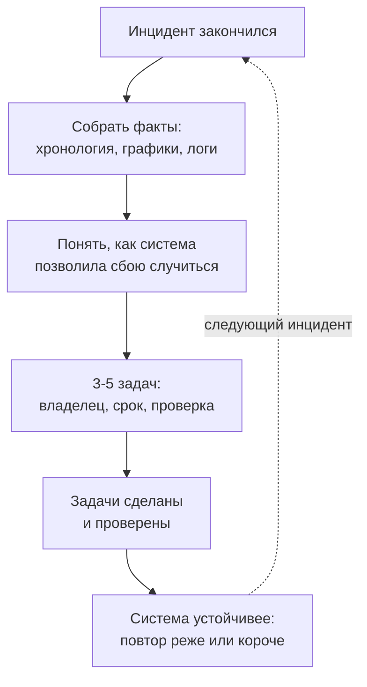

## Зачем это нужно

Магазин починили за четыре с половиной минуты, дежурный получил благодарность, и все вернулись к задачам. В понедельник менеджер задаёт один вопрос: «А это повторится?» Если честно, ответа нет. Оплата снова может замедлиться, пул соединений снова встанет, и всё пойдёт по тому же сценарию. Починка закрыла этот раз, но ничего не изменила в магазине.

Я видел такое не раз. Команда героически тушит сбой, записывает в чат «причина: оплата тормозила» и забывает. Через два месяца приходит тот же сбой, и дежурный заново проходит тот же путь, потому что ни алертов, ни инструкций, ни самого магазина никто не поправил. Разбор после сбоя (по-английски postmortem, «после смерти»: врач так называет заключение о вскрытии) нужен, чтобы второго раза не было или чтобы он закончился быстрее.

Из урока ты узнаешь, как разбирать сбой без поиска виноватых, из чего состоит разбор, чем плохие задачи после него отличаются от хороших и почему по одним только MTTR и MTTD нельзя судить о качестве работы с инцидентами. Потом посмотришь на сбой глазами инженеров, которые изучают аварии как сложные системы, и разберёшь несколько настоящих публичных разборов. На практике напишешь постмортем своего учебного инцидента из [урока 5.1](01-incidents.md) и проверишь его задачи скриптом.

Шаг проекта: в `~/monitoring-lab/postmortems/` лежит твой постмортем учебного инцидента: хронология (что и во сколько происходило), влияние в цифрах, причины и таблица задач, которую проверил `check-actions.py`.

## Что нужно знать

- Инцидент, хронология и MTTD, MTTA, MTTI, MTTM, MTTR, роли и статус-обновления: [урок 5.1](01-incidents.md). У тебя должны остаться файлы учебного инцидента в `~/monitoring-lab/incidents/`: `incident-01.log` (хронология), `mttx.py` и `incident-01.md` (статусы и итог).
- SLI, SLO и бюджет ошибок: [урок 1.2](../01-basics/02-sli-slo.md). Золотые сигналы: [урок 1.1](../01-basics/01-signals.md).
- Алерты и runbook, поломка оплаты: [урок 3.2](../03-dashboards-alerts/02-alerts.md).
- Логи и трейсы «Магазина»: [урок 4.1](../04-logs-traces/01-logs.md) и [урок 4.2](../04-logs-traces/02-traces.md).
- Стенд с профилем `monitoring` запущен, `curl` и `jq`: [load-tester, урок 5.3](../../load-tester/05-docker/03-compose-shop.md).

## Картина целиком

Авиакатастрофы случаются редко, а самолёты с каждым десятилетием безопаснее. Каждое происшествие разбирают до винтика, публикуют выводы и меняют правила для всех. Никто не пишет «пилот виноват, пусть будет внимательнее»: пишут, что в кабине, в процедурах или в приборах позволило ошибке случиться. Урок про то же самое для сервиса.



Схема показывает цикл: инцидент превращается в факты, из фактов выходят задачи, задачи меняют систему. Если разорвать цикл на любом шаге, повторять будет нечему учиться.

## Теория

### Постмортем: разбор, после которого что-то меняется

После сбоя хочется поскорее забыть. Так и делают, пока не повторится. Самое дешёвое обучение сервису дают его собственные сбои: они уже случились, ты за них заплатил, остаётся забрать пользу.

**Постмортем** (postmortem) это письменный разбор сбоя: что случилось, какой был ущерб, почему система позволила этому случиться и что мы меняем. Как заключение врача после болезни: не только «выздоровел», но и «вот что ослабило организм, вот что делаем, чтобы не вернулось». Аналогия ломается в одном: врач пишет для себя, а постмортем читают команды, которых там не было, и читают через год.

Писать его нужно не после каждой мелочи. Обычно разбор нужен, когда сбой заметили покупатели, когда ушёл заметный кусок бюджета ошибок, когда пришлось будить людей или когда команда сама поняла, что ей повезло. Критерии записывают заранее, чтобы не спорить в момент.

> **Прикинь сам:** алерт «очередь за соединением с базой» сработал, сам прошёл за минуту, покупатели ничего не заметили. Нужен ли постмортем?
{: .predict}

Скорее нет: хватит строки в журнале и, если очередь повторяется, задачи. Полный разбор стоит времени нескольких людей, и тратить его на каждую мелочь значит научить всех ненавидеть процесс.

> **Главное:** постмортем превращает случившийся сбой в проверяемые изменения системы, а пишут его по заранее оговорённым критериям, не после каждого шороха.
{: .key}

Но если разбор будет искать виноватого, правды в нём не останется. Поэтому первое правило касается тона.

### Без обвинений: как говорить об ошибке

Представь школу, где за вопрос «объясните ещё раз» ставят в угол. Дети перестанут спрашивать, но понимать не начнут. С инженерами так же: если после сбоя наказывают, они прячут то, что случилось, и разбор превращается в защиту.

Поэтому постмортем пишут **без обвинений** (blameless). Вопрос не «кто ошибся», а «как система позволила этой ошибке дойти до покупателей». Человек в момент решения действовал по той информации, что у него была, и ему это казалось разумным. Если разумное действие приводит к сбою, чинить надо систему вокруг него.

```text
С обвинением:    «Дежурный перезапустил не тот сервис, поэтому сбой затянулся».
Без обвинения:   «Руководство по оплате не говорило, какой сервис перезапускать первым,
                  а на дашборде не было видно, какой из двух тормозит».
```

Вторая запись сразу даёт действие: дописать инструкцию и вынести на дашборд нужный график. Из первой следует только «пусть будет внимательнее», а проверить это нечем. В тексте нет имён в роли виноватых: есть роли и системы («дежурный», «оплата», «CI»).

Осторожно: «без обвинений» не значит «без ответственности». У каждой задачи есть владелец, и он отвечает за исправление системы. А разговор о том, что человек системно не справляется с работой, ведёт его руководитель отдельно, не в общем документе.

> **Главное:** blameless разбор спрашивает «как система это позволила», а не «кто виноват», потому что только так люди рассказывают правду, а из правды получаются задачи.
{: .key}

Теперь посмотрим, из чего состоит сам документ.

### Из чего состоит постмортем

Через год ты открываешь чужой разбор и не можешь понять, сколько это длилось и кого задело. Чтобы так не было, у документа есть скелет, и мы разберём его на нашем учебном инциденте: оплата отвечала по пять секунд, и заказы получали ошибки.

1. **Резюме** на 2–3 предложения: что случилось и чем кончилось. Многие читают только его, поэтому оно первое.
2. **Влияние**: сколько минут, какая доля запросов, сколько бюджета ошибок ушло. Без цифр непонятно, насколько было плохо.
3. **Хронология** (timeline): что и во сколько происходило, в одной таймзоне.
4. **Причины**: что запустило сбой и почему система была уязвима.
5. **Что помогло и что помешало** в самой работе с инцидентом.
6. **Задачи** (action items): что меняем, кто и к какому сроку.

В шапке пишут ещё severity (серьёзность, как в [уроке 5.1](01-incidents.md)) и дату. Вот резюме нашего учебного инцидента:

```text
Резюме: 14:00:00-14:04:30 заказы в магазине получали ошибки 503 из-за того, что
оплата стала отвечать по 5 секунд и заняла все 5 соединений пула базы. На плато
ошибки получали 48% запросов, трафик упал с 56 до 3 запросов в секунду. Ущерб
сняли откатом оплаты к норме, инцидент закрыт в 14:07:00.
Повторится при любом замедлении оплаты, пока вызов оплаты держит соединение с базой.
```

Заметь, что последняя фраза говорит о будущем: хороший разбор называет не только что было, но и что осталось в системе.

> **Главное:** постмортем состоит из резюме, влияния, хронологии, причин, «что помогло и помешало» и задач, и по резюме с цифрами его должен понять человек, которого там не было.
{: .key}

С цифрами влияния и хронологией работают так.

### Хронология и влияние в цифрах

«Сервис плохо работал четыре с половиной минуты» ничего не говорит, пока нет цели, с которой это сравнить. У нас она есть: SLO из [урока 1.2](../01-basics/02-sli-slo.md), 99% запросов без `5xx` за 30 дней. Бюджет ошибок при такой цели 1%, то есть 432 минуты полного отказа на 30 дней. (В примерах урока 5.1 бюджет считался и при 99,9%, здесь берём 99%, чтобы числа не были микроскопическими.)

Сначала возьмём из хронологии моменты. Это тот самый учебный инцидент из [урока 5.1](01-incidents.md), метки из `incident-01.log` (время стенда):

| Время | Метка | Что произошло |
|---|---|---|
| 14:00:00 | `start` | Оплата стала отвечать по 5 секунд |
| 14:00:30 | | В пуле соединений появилась очередь |
| 14:01:30 | `alert` | Горит `ShopDbPoolExhausted` (очередь за соединением) |
| 14:02:00 | `ack` | Дежурный подтвердил, стал руководителем, отправил первое обновление |
| 14:03:00 | `found` | Локализовано: оплата отвечает 5 секунд, заказы ждут соединение |
| 14:03:30 | `action` | Откат оплаты: `delay_ms` 50 |
| 14:04:30 | `mitigated` | Ошибки ушли, ущерб снят |
| 14:07:00 | `resolved` | Алерты погасли, инцидент закрыт |

Определения те же, что в [уроке 5.1](01-incidents.md): этапы идут друг за другом без наложения. MTTD от начала до алерта: 1:30. MTTA от алерта до подтверждения: 0:30. MTTI от подтверждения до локализации: 1:00. MTTM от локализации до снятия ущерба: 1:30. MTTR от начала до закрытия: 7:00. Проверка: 1:30 + 0:30 + 1:00 + 1:30 = 4:30, это время ущерба, а MTTR длиннее на 2:30 наблюдения после снятия. В литературе эти определения расходятся, поэтому в разборе всегда пиши, как считал. Скрипт `mttx.py` из урока 5.1 посчитает то же самое по `incident-01.log`.

Теперь влияние. На плато, с 14:02 до 14:03:30, ошибки получала почти половина запросов, а трафик упал с 56 до 3 запросов в секунду. Вот минута плато в Prometheus:

<div class="viz" data-viz="mon-table" data-title="Table: запросы по кодам ответа за минуту до 14:03:00" data-query="sum by (status) (increase(http_requests_total[1m]))" data-explain="Запрос смотрит на минуту до 14:03:00, середину плато. Две строки в сумме дают все запросы этой минуты." data-columns='["Время","status","Значение"]' data-rows='[["14:03:00","201",84],["14:03:00","503",78]]' data-highlight-col="2" data-highlight-row="1"></div>

В таблице 84 + 78 = 162 запроса, и 78 из них с кодом 503: 78 / 162 = 48%. Это число плато, а не всего инцидента: в первые и последние секунды трафик был почти нормальным.

Чтобы получить цифры за весь ущерб, сложим точки графиков с шагом 30 секунд с 14:00:00 до 14:04:00 (девять точек, каждая отвечает за 30 секунд). Запросы: сумма «запросов в секунду × 30», примерно 3300. Ошибки: сумма «запросов в секунду × доля 5xx × 30», примерно 500. Доля за весь отрезок 500 / 3300 = 15%. Расчёт приближённый, по точкам графика, а не по счётчику.

Для бюджета нужна другая цифра: средняя по времени доля ошибок, как в уроке 5.1 (время × доля). Складываем доли в девяти точках: 0 + 0,20 + 0,40 + 0,47 + 0,48 + 0,48 + 0,48 + 0,47 + 0,24 = 3,22. Каждая точка это 30 секунд, поэтому 3,22 × 30 с = 96,6 с, это около 1,6 минуты эквивалента полного отказа. Делим на бюджет: 1,6 / 432 = 0,37%, около 0,4%. Совсем немного бюджета, хотя покупатели этих минут не забудут.

<div class="viz" data-viz="mon-panel" data-title="Доля ответов 5xx во время учебного инцидента" data-query="sum(rate(http_requests_total{status=~&quot;5..&quot;}[1m])) / sum(rate(http_requests_total[1m])) * 100" data-x='["13:59:00","13:59:30","14:00:00","14:00:30","14:01:00","14:01:30","14:02:00","14:02:30","14:03:00","14:03:30","14:04:00","14:04:30","14:05:00","14:05:30","14:06:00","14:06:30","14:07:00","14:07:30","14:08:00"]' data-series='[{"name":"доля 5xx","values":[0,0,0,20,40,47,48,48,48,47,24,2,0,0,0,0,0,0,0],"color":"red"}]' data-unit="%" data-thresholds='[{"value":5,"color":"yellow","label":"порог алерта 5%"}]' data-annotations='[{"at":"14:00:00","text":"старт: оплата 5 с"},{"at":"14:01:30","text":"алерт очереди"},{"at":"14:03:30","text":"откат оплаты"},{"at":"14:04:30","text":"ущерб снят"}]' data-explain="Четыре флажка это начало, алерт, откат и снятие ущерба. Расстояние от первого до второго флажка и есть время обнаружения."></div>

На графике ошибки растут сразу после старта, а человек узнаёт о проблеме только в 14:01:30. Эти полторы минуты и есть то, что обычно хочется сократить.

<div class="viz" data-viz="mon-alert" data-title="ShopDbPoolExhausted в инциденте" data-name="ShopDbPoolExhausted" data-threshold="0" data-for="2" data-unit="" data-explain="Очередь появилась в 14:00:30, через полминуты после старта. Правило ждёт минуту (две точки по 30 секунд), и только потом алерт горит и уходит в Alertmanager." data-x='["13:59:00","13:59:30","14:00:00","14:00:30","14:01:00","14:01:30","14:02:00","14:02:30","14:03:00","14:03:30","14:04:00","14:04:30","14:05:00","14:05:30","14:06:00","14:06:30","14:07:00","14:07:30","14:08:00"]' data-values='[0,0,0,3,3,3,3,3,3,3,0,0,0,0,0,0,0,0,0]'></div>

Видно, откуда взялись 1:30 обнаружения: полминуты до появления очереди и минута выдержки алерта. Сократить MTTD можно, убрав выдержку, но тогда алерт будет будить из-за коротких всплесков.

<div class="viz" data-viz="mon-logs" data-title="Explore: заказы во время инцидента" data-query='{service="shop"} | json | route="/api/orders"' data-highlight="503" data-explain="Строки магазина про заказы, от новых к старым. Две ошибки 503 приходят ровно через пять секунд ожидания, а заказ со статусом 201 всё равно занял 5,2 секунды." data-lines='[{"ts":"2026-10-04 14:02:36.884","level":"error","labels":{"service":"shop","container":"shop-shop-1","level":"ERROR"},"line":"{\"ts\": \"2026-10-04T14:02:36.884Z\", \"level\": \"ERROR\", \"msg\": \"Запрос завершён\", \"method\": \"POST\", \"route\": \"/api/orders\", \"path\": \"/api/orders\", \"status\": 503, \"duration_ms\": 5004.2, \"request_id\": \"c3f1a9d2e4b84701\", \"trace_id\": \"b2a47d10c9e84f35a1d60e7f3c58b9d4\", \"user_id\": 17, \"error\": \"couldn&#39;t get a connection after 5.00 sec\"}"},{"ts":"2026-10-04 14:02:31.402","level":"error","labels":{"service":"shop","container":"shop-shop-1","level":"ERROR"},"line":"{\"ts\": \"2026-10-04T14:02:31.402Z\", \"level\": \"ERROR\", \"msg\": \"Запрос завершён\", \"method\": \"POST\", \"route\": \"/api/orders\", \"path\": \"/api/orders\", \"status\": 503, \"duration_ms\": 5003.1, \"request_id\": \"9e07b5c8a1d24f63\", \"trace_id\": \"e5c90a2b7d134f86b0a8c1d94e3f7a52\", \"user_id\": 4, \"error\": \"couldn&#39;t get a connection after 5.00 sec\"}"},{"ts":"2026-10-04 14:02:20.402","level":"warning","labels":{"service":"shop","container":"shop-shop-1","level":"WARNING"},"line":"{\"ts\": \"2026-10-04T14:02:20.402Z\", \"level\": \"WARNING\", \"msg\": \"Запрос завершён\", \"method\": \"POST\", \"route\": \"/api/orders\", \"path\": \"/api/orders\", \"status\": 201, \"duration_ms\": 5240.6, \"request_id\": \"5a8d3c71f9e04b2a\", \"trace_id\": \"7c1e9a4f2b8d4036a5e1d7c93b0f6a28\", \"user_id\": 9}"},{"ts":"2026-10-04 13:59:58.120","level":"info","labels":{"service":"shop","container":"shop-shop-1","level":"INFO"},"line":"{\"ts\": \"2026-10-04T13:59:58.120Z\", \"level\": \"INFO\", \"msg\": \"Запрос завершён\", \"method\": \"POST\", \"route\": \"/api/orders\", \"path\": \"/api/orders\", \"status\": 201, \"duration_ms\": 94.3, \"request_id\": \"d41b6e08a3c74f95\", \"trace_id\": \"3f9d7a20b6c84e1d9a5f0c2e8b17d463\", \"user_id\": 12}"}]'></div>

В логах те же цифры: ошибка `couldn't get a connection after 5.00 sec` приходит через 5 секунд, это `DB_POOL_TIMEOUT`. А успешный заказ был медленным, но дошёл до конца: ему достался свободный слот в пуле.

<div class="viz" data-viz="mon-stat" data-title="Влияние инцидента в цифрах" data-stats='[{"title":"Пик ошибок 5xx","value":48,"unit":"%","color":"red","spark":[0,0,0,20,40,47,48],"sub":"плато 14:02-14:03:30"},{"title":"Запросов с ошибкой","value":500,"unit":"","color":"orange","sub":"из примерно 3300 за 4:30"},{"title":"Ущерб","value":4.5,"unit":"мин","color":"orange","sub":"14:00:00-14:04:30"},{"title":"Трафик, минимум","value":2.7,"unit":"req/s","color":"yellow","spark":[56,57,55,12,4,3,2.7],"sub":"было 56 req/s"},{"title":"Бюджет ошибок","value":0.4,"unit":"%","color":"green","sub":"от месячного при SLO 99%"}]' data-explain="Первая карточка про пик, вторая про объём, третья про время, четвёртая про трафик, пятая про цену для бюджета. В постмортем идут все пять."></div>

Карточки отвечают на вопрос менеджера «насколько всё было плохо». Одна цифра отвечает плохо: «четыре с половиной минуты» звучит мягко, «каждый второй заказ на плато» по-другому.

> **Проверь понимание:** сбой длился 20 минут, доля ошибок все 20 минут была 10%, SLO 99% за 30 дней. Сколько бюджета ушло?
{: .predict}

20 минут × 0,10 = 2 минуты полного отказа. Бюджет 432 минуты, значит ушло 2 / 432 = 0,46%, меньше половины процента.

Осторожно: путают время сбоя и время влияния. Метрики могли подскочить раньше, а покупатели начали получать ошибки позже, когда кончился запас прочности. Считай от момента, когда плохо стало пользователю, и пиши источник цифры (график, лог), чтобы её можно было перепроверить.

> **Главное:** влияние это минуты, доля запросов и расход бюджета ошибок: число, которое можно сравнить с целью, а не «долго лежали».
{: .key}

### Причина, триггер и состояние опасности

Обычно говорят «причина сбоя: оплата тормозила». Это на самом деле только то, что запустило событие. А почему от медленной оплаты упали заказы, а не просто стали медленнее? Тут и лежит разговор.

**Триггер** (trigger) запускает сбой сегодня: здесь это замедление оплаты. Его не всегда можно предотвратить, оплатой управляет другая компания. **Причины** (contributing factors, то, что сделало систему уязвимой) это условия, которые превратили неприятность в беду. Спичка и лужа бензина в гараже: убрать спичку нельзя, убрать бензин можно. Аналогия ломается тем, что причин бывает несколько, и в разборе перечисляют все значимые.

Для нашего магазина причины видны в коде и в трейсе. Открой трейс медленного, но успешного заказа:

<div class="viz" data-viz="mon-trace" data-title="Один заказ во время инцидента" data-trace-id="7c1e9a4f2b8d4036a5e1d7c93b0f6a28" data-spans='[{"id":"a1","parent":null,"service":"shop","name":"POST /api/orders","start":0,"dur":5240,"status":"ok","attrs":{"http.status_code":201}},{"id":"a2","parent":"a1","service":"shop","name":"HGETALL","start":3,"dur":2,"status":"ok","attrs":{"db.system":"redis"}},{"id":"a3","parent":"a1","service":"shop","name":"db.pool.getconn","start":6,"dur":1,"status":"ok","attrs":{}},{"id":"a4","parent":"a1","service":"shop","name":"SELECT shop","start":8,"dur":12,"status":"ok","attrs":{"db.system":"postgresql"}},{"id":"a5","parent":"a1","service":"shop","name":"INSERT shop","start":22,"dur":4,"status":"ok","attrs":{"db.system":"postgresql"}},{"id":"a6","parent":"a1","service":"shop","name":"POST","start":36,"dur":5190,"status":"ok","attrs":{"http.url":"http://payment:8001/pay"}},{"id":"a7","parent":"a6","service":"payment","name":"POST /pay","start":42,"dur":5170,"status":"ok","attrs":{"http.status_code":200}}]' data-focus="a7" data-explain="Почти всё время заказа это один вызов оплаты. Пока он идёт, запросы к базе уже сделаны, но соединение с базой остаётся занятым."></div>

Весь заказ занял 5,2 секунды, из них 5,17 это ответ оплаты. Соединение с базой этот заказ взял в самом начале (спан `db.pool.getconn` в первую миллисекунду) и держит до конца, потому что вызов оплаты в коде стоит внутри транзакции (комментарий в `shop/app/main.py` так и называет его намеренным антипаттерном).

Теперь можно записать причины нашего инцидента:

- вызов оплаты держит соединение с базой, а в пуле их всего пять: пять медленных оплат блокируют всех;
- ждущий соединения запрос получает ответ 503 через 5 секунд (`DB_POOL_TIMEOUT`);
- таймаут оплаты 10 секунд и три повтора: один заказ может держать соединение до 40 секунд;
- алерта на сам p95 оплаты нет, дежурный узнал о причине позже, чем о симптоме.

**Состояние опасности** (hazard state, [урок 5.1](01-incidents.md)) здесь существовало задолго до сбоя: пока оплата отвечала за 50 мс, система работала, но любое замедление мгновенно выбивало пул. Хороший разбор отмечает, что система жила в опасном состоянии, и это отдельная находка: её можно увидеть на графиках заранее.

> **Прикинь сам:** после инцидента кто-то предлагает записать причину так: «дежурный слишком долго искал, где ломается». Что здесь причина, а что нет?
{: .predict}

Это не причина сбоя, это оценка работы человека. Правильный вопрос: что мешало найти быстро? Если на дашборде не было графика p95 оплаты, то это причина, и её можно исправить.

Осторожно: путают причину с последним, что случилось перед сбоем. Последнее чаще оказывается триггером, а причина лежит глубже: почему система позволила триггеру навредить.

> **Главное:** триггер запускает сбой, причины делают систему уязвимой, и разбор ищет именно причины, потому что триггер часто неуправляем.
{: .key}

Причины названы. Из них вырастают задачи, и от их качества зависит, повторится ли сбой.

### Action items: какие задачи не умрут в трекере

Самая частая последняя строка постмортема: «улучшить мониторинг». Её закрывают через месяц словами «улучшили», и ничего не меняется, потому что никто не мог проверить, улучшено ли. Задача из разбора (action item) похожа на заявку в управляющую компанию после протечки: кто, что, к какому числу сделает и как мы убедимся, что больше не течёт.

В хорошей задаче четыре части:

1. **Конкретное действие**: глагол и то, что можно потрогать («добавить алерт», «вынести вызов из транзакции»). Не «улучшить», не «обсудить», не «быть внимательнее».
2. **Один владелец**: человек или роль. «Команда» и «все» не подходят: значит, никто.
3. **Срок датой**, а не «скоро».
4. **Критерий готовности**: чем проверим. Запрос, тест, прогон на стенде.

И ещё тип задачи: **prevent** (не допустить повтора), **detect** (заметить быстрее), **mitigate** (смягчить последствия). Если все пункты detect, мы научились замечать тот же сбой и ничего не сделали с причиной.

Вот три задачи по нашему инциденту, одна в каждом типе:

```text
prevent   Вынести вызов оплаты из транзакции заказа. Владелец: разработчик заказов.
          Срок: 2026-10-18. Готово: при delay_ms=5000 и 8 покупателях
          shop_db_pool_waiting остаётся 0.
detect    Добавить алерт LabPaymentSlow (p95 оплаты больше 1 с, for 2m). Владелец:
          SRE на дежурстве. Срок: 2026-10-11. Готово: promtool test rules зелёный,
          в прогоне алерт горит через 3 минуты после поломки.
mitigate  Дописать в runbook-payment.md шаг «вернуть оплату к норме» с командой.
          Владелец: SRE на дежурстве. Срок: 2026-10-11. Готово: коллега, не знающий
          стенда, выполнил шаг по инструкции за 3 минуты.
```

Попробуй сам оценить несколько задач в виджете. Выбери задачу и посмотри, какие из пяти проверок она проходит:

<div class="viz" data-viz="mon52-actions"></div>

Нажми «Улучшить мониторинг оплаты» и «Увеличить пул до 50». Первая не проходит почти ничего. Вторая выглядит конкретной, но критерия у неё нет, а ещё в `max_connections=100` у PostgreSQL стенда она съедает соседей. Конкретная задача может быть плохой.

> **Прикинь сам:** сколько задач оставить после разбора: пять или двадцать?
{: .predict}

Пять или меньше. Двадцать задач никто не сделает, и самые важные потеряются среди мелких. Остальное идёт в отдельный список идей, а не в обязательства.

Осторожно: считать разбор успешным, когда все задачи закрыты. Закрытая задача не значит проверенная. Критерий готовности нужен именно поэтому: сделано это когда видно по метрике или тесту, а не когда кто-то нажал «Закрыть».

> **Главное:** хорошая задача это действие, один владелец, срок датой и проверяемый критерий; их три-пять, и среди них есть prevent.
{: .key}

Теперь вернёмся к цифрам времени, которые мы считали в [уроке 5.1](01-incidents.md): что они говорят о самой работе с инцидентом?

### Что показывают MTTx и чего они не показывают

Семь минут от начала до закрытия это быстро или медленно? Хочется сказать «быстро» и повесить MTTR на стену. Но здесь есть подвох.

**MTTx** (MTTD, MTTA, MTTI, MTTM, MTTR) это средние времена этапов инцидента. Их легко считать, поэтому они стали стандартом. Однако у них три слабости.

**Среднее лжёт на малом числе.** Если за квартал три инцидента, их средний MTTR случаен: один длинный затмит остальное. Лучше смотреть на каждый инцидент отдельно, а на много инцидентов смотреть медиану (значение посередине, если выстроить по порядку) и худшие случаи.

**Скорость не равна качеству.** Дежурный может быстро «закрыть» инцидент перезапуском и ничего не записать. MTTR улучшится, а причина останется, и сбой повторится. Метрика одобрит как раз самое вредное поведение.

**Средние смешивают разное.** Инцидент на пять минут ночью и на пять минут днём, с сорока людьми в чате и с одним дежурным, дают одно число.

<div class="viz" data-viz="chart" data-type="bar" data-title="Быстрее закрываем, но чаще повторяется (учебный пример)" data-x="неделя 1,неделя 2,неделя 3,неделя 4" data-x-label="неделя" data-y-label="значение" data-series='[{"name":"MTTR, мин","values":[7,4,4,4],"unit":" мин"},{"name":"Сколько раз повторился сбой","values":[1,2,2,3],"unit":" раз"}]' data-explain="Числа выдуманы для наглядности. MTTR после первой недели почти вдвое меньше, потому что дежурный научился быстро возвращать оплату. А причину никто не чинил, поэтому сбой повторяется чаще."></div>

Если смотреть только на MTTR, команда молодец: время упало почти вдвое. Если смотреть на повторы, видно, что она просто привыкла к тому же сбою. Это не значит, что MTTx бесполезны. Они показывают скорость, а дальше нужны другие числа.

> **Главное:** MTTx показывают скорость этапов, но не качество разбора и не здоровье процесса; на малом числе инцидентов среднее случайно.
{: .key}

Какие числа добавить?

### Метрики качества работы с инцидентом

Если время не показывает качество, что показывает? Ответ в том, как команда работает во время сбоя, и это тоже можно измерять.

- **Время мобилизации**: сколько проходит от алерта до того, как человек взялся за инцидент (это MTTA из [урока 5.1](01-incidents.md): у нас 0:30), и до того, как собрались те, кто нужен. Если ночью подтверждение занимает полчаса, а днём минуту, алерт будит не того человека. Лечат автоматической эскалацией: если первый дежурный молчит, звонок уходит второму.
- **Время назначения руководителя**: сколько прошло, пока появился человек, который ведёт инцидент. Без него все смотрят в разные графики и никто не пишет статусы. В нашем инциденте это 30 секунд: алерт в 14:01:30, подтверждение и руководитель в 14:02:00.
- **Частота статус-обновлений**: как часто в чат попадает «что известно, что делаем, когда следующее сообщение». Договорись заранее об интервале. В нашем инциденте первое обновление ушло в 14:02, а следующее было обещано на 14:07: так никто не гадает, когда ждать новостей.
- **Доля инцидентов вне рабочего времени**: сколько будят ночью и в выходные. Если растёт, страдает не сервис, а люди, и пора чинить пороги или причины.
- **Повторы**: доля инцидентов, причина которых уже была в прошлых разборах. Это самая честная проверка постмортемов.
- **Задачи в срок**: доля задач из разборов, сделанных к обещанному числу. Показывает, живёт ли процесс или разборы лежат в архиве.

Эти метрики дешёвые: большую часть можно собрать из хронологий и трекера задач. Заведи простую таблицу по каждому инциденту и смотри на неё раз в квартал.

> **Прикинь сам:** за квартал дежурные получили восемь ночных инцидентов, шесть из них от одного шумного алерта. Что чинить: людей или алерт?
{: .predict}

Алерт. Метрика «ночные инциденты» показывает нагрузку на людей, и если она вся из одного источника, достаточно поправить его порог или причину.

Осторожно: метрики качества легко превратить в цель, и тогда их начнут подгонять. Они нужны для разговора о процессе, а не для оценки людей.

> **Главное:** рядом с MTTx считают время мобилизации, назначение руководителя, частоту обновлений, ночные инциденты, повторы и задачи в срок: так видно, как команда работает, а не только как быстро.
{: .key}

До сих пор мы искали в сбое причины. Есть взгляд, который задаёт другой вопрос.

### Системный взгляд: STAMP

Ты чинишь потекший кран, а через неделю течёт соседний. Можно менять краны бесконечно, а можно спросить: почему давление в трубах позволяет им течь? Это переход от «что сломалось» к «как устроена система».

Такой подход есть у инженеров по безопасности, и называется он STAMP (Systems-Theoretic Accident Model and Processes, системно-теоретическая модель аварий). Его придумала Нэнси Левесон из MIT. Идея: авария не цепочка поломок, а результат плохо управляемых взаимодействий между частями системы, людьми и автоматикой. У подхода есть два инструмента: CAST разбирает уже случившуюся аварию, STPA ищет опасные места заранее.

В основе лежит схема управления. **Контроллер** (кто или что принимает решения) отдаёт управляющее воздействие. **Процесс** (то, чем управляют) меняется. **Обратная связь** (метрики, алерты) возвращается к контроллеру.


Схема показывает петлю. Беда случается, когда воздействие неправильное, пришло не вовремя или обратная связь врёт, запаздывает или её нет. На нашем магазине дежурный видит ошибки 5xx (связь есть), но не видит p95 оплаты (связи нет), и поэтому не знает, что воздействовать надо на оплату.

STAMP предлагает три вопроса вместо «что сломалось»:

1. В каком **состоянии опасности** система жила до сбоя и почему мы этого не видели?
2. Какие **воздействия** были небезопасными (правильные по отдельности, но вместе дали беду)?
3. Какие **обратные связи** отсутствовали, запаздывали или искажали картину?

Google описал такой разбор публично (Тим Фалзон и Бен Трейнор Слосс, статья в USENIX ;login: в декабре 2024 года). В их примере система автоматически урезала квоты ресурсов сервисам, которые, судя по данным, использовали меньше выделенного. Данные об использовании важного сервиса оказались заниженными из-за сложного сбора и агрегации, и урезание было отложено на проверку. Несколько недель система жила в состоянии опасности: неправильное решение уже принято, но ещё не применено, и никто не получал уведомления об отложенном изменении. Потом урезание применилось, и случился серьёзный сбой. Вывод авторов: обратная связь (данные об использовании) была сложнее и хуже изучена, чем само управление.

Тот же взгляд на магазине: не «оплата тормозила», а «пул из пяти соединений управляет всеми заказами, а обратной связи про занятость пула на дашборде нет, пока не придёт алерт на ошибки». Метрики `shop_db_pool_available` и `shop_db_pool_waiting` существуют, и в состоянии опасности они уже показывали бы мало запаса.

> **Прикинь сам:** пул из пяти соединений почти всегда занят на 4 из 5, но ошибок нет. Это состояние опасности? Как это увидеть заранее?
{: .predict}

Да: запаса нет, любой всплеск приведёт к очереди. Увидеть можно по `shop_db_pool_available`: если он часто близок к нулю, пора разбираться, не дожидаясь сбоя.

Осторожно: STAMP не отменяет разбора причин и хронологии. Он добавляет вопросы, которые обычный разбор пропускает, особенно про автоматику и про качество обратной связи.

> **Главное:** STAMP смотрит на сбой как на плохо управляемое взаимодействие и спрашивает про состояния опасности, воздействия и обратные связи, а не только «что сломалось».
{: .key}

Подход подтверждают и разборы, которые компании публикуют сами. Посмотрим на несколько.

### Чему учат публичные постмортемы

Лучшие уроки про мониторинг и инциденты лежат в открытом доступе: крупные компании публикуют свои разборы. Я возьму четыре с проверенными фактами и свяжу каждый с тем, что ты уже знаешь.

**Facebook (Meta), 4 октября 2021.** Во время плановых работ на магистральной сети инженеры запустили команду для оценки ёмкости. Она отключила все соединения магистрали между дата-центрами, а система проверки, которая должна была остановить такую команду, из-за ошибки не сработала. Пропал не только трафик пользователей: рухнули DNS и внутренние инструменты, с помощью которых обычно разбираются со сбоями, а запасной канал доступа к сети лежал на той же магистрали. Инженерам пришлось ехать в дата-центры, а физическая защита затрудняла работу. Урок для мониторинга: инструменты диагностики и связь не должны зависеть от того, что ломается. Это то самое «резервные каналы связи» из [урока 5.1](01-incidents.md).

**Amazon S3, 28 февраля 2017.** Сотрудник выполнил обычную команду удаления части серверов и ошибся во входном параметре, удалилось гораздо больше, чем нужно. Пострадали две подсистемы хранилища в регионе us-east-1, а вместе с ними и сервисы, которые на них опираются. Простой длился около четырёх часов. Любопытная деталь: страница статуса AWS сама зависела от S3 и некоторое время не могла показывать состояние. Исправления: инструмент удаляет мощность медленнее и не позволяет опустить подсистему ниже минимума, а панель статуса теперь работает в нескольких регионах. Урок: опасная команда должна упираться в защиту, а мониторинг и страница статуса не должны жить на том, что мониторят.

**GitLab, 31 января 2017.** Инженер при починке репликации базы удалил около 300 ГБ данных не на той машине: на основной, а не на вторичной. Дальше выяснилось, что с резервными копиями плохо: ежедневный дамп падал молча, потому что на сервере стояла версия PostgreSQL 9.2, а база была 9.6; письма с сообщением об ошибке отклонялись из-за отсутствия подписи DMARC; снимки дисков для баз не включали; корзина с копиями оказалась пустой. Потеряли около шести часов данных: примерно 5000 проектов, 5000 комментариев и 700 учётных записей. Восстановление шло около 18 часов. Урок: копия, которую ни разу не восстанавливали, пока не копия, и сам алерт о сбое копии тоже нужно проверять.

**GitHub, 21–22 октября 2018.** При замене оборудования связь между восточным узлом сети и главным дата-центром пропала на 43 секунды. Автоматика (Orchestrator) успела перевести основную базу MySQL на западное побережье. Когда связь вернулась, на востоке остались записи, которых не было на западе, и вернуться назад безопасно было нельзя. GitHub сознательно выбрал целостность данных вместо скорости: деградация продлилась больше суток (24 часа 11 минут), накопилось свыше пяти миллионов событий вебхуков, около 200 тысяч из них пришлось отбросить по истечении срока. Урок про STAMP: автоматика поступила по своим правилам правильно, а система оказалась в состоянии, которого никто не планировал. Последствия: ограничили переключение между регионами и усилили испытания отказов.

Что общего? Ни в одном случае не было злодея. В Meta и S3 была ошибка человека, но разбор говорит о том, почему проверка не остановила команду. В GitLab и GitHub сыграла автоматика и резервные механизмы, о которых мало кто знал. Везде мониторинг и вспомогательные инструменты либо молчали, либо лежали вместе с основной системой.

Осторожно: в интернете много пересказов громких сбоев с красивыми, но выдуманными деталями. Бери только официальные разборы самой компании и сверяй даты. Если не нашёл первоисточника, не пересказывай.

> **Главное:** публичные разборы учат на чужих сбоях: инструменты диагностики не должны падать вместе с системой, копия без проверки восстановлением не копия, а автоматика тоже управляет и может завести систему в опасное состояние.
{: .key}

Все понятия на месте. Пора написать свой постмортем.

## Практика

Идёт на твоём учебном инциденте из [урока 5.1](01-incidents.md). Исходные файлы лежат в `~/monitoring-lab/incidents/`: `incident-01.log` с метками времени, `mttx.py` и `incident-01.md` со статусами. Нет файлов: возьми таблицу из теории, её хватит для всех заданий. Числа у тебя будут другими, это нормально: считай свои.

### 1. Подготовь рабочее место

Создай папку и два файла, которые понадобятся: скрипт для цифр влияния и шаблон.

```bash
mkdir -p ~/monitoring-lab/postmortems && cd ~/monitoring-lab/postmortems
ls ~/monitoring-lab/incidents/
```

`mkdir -p` создаёт папку, а `-p` не ругается, если она уже есть. `cd` переходит в неё, `ls` показывает файлы из прошлого урока.

**Что должно получиться** (пример):

```text
ev.sh
incident-01.log
incident-01.md
mttx.py
status-template.md
```

**Как читать вывод:** в папке есть `incident-01.log`. Если папка пуста или её нет, возьми таблицу из теории и сохрани её в `~/monitoring-lab/incidents/incident-01.log` в виде строк `14:00:00 start`, `14:01:30 alert`, `14:04:30 mitigated` и так далее.

**Типичные ошибки:**

- `ls: .../incidents/: No such file or directory`: ты пропустил урок 5.1 или назвал папку иначе. Создай её и положи туда таблицу.

### 2. Собери влияние в цифрах

Скрипт читает из `incident-01.log` метки `start` и `mitigated` и спрашивает у Prometheus стенда, сколько всего запросов и сколько ответов 5xx было между ними. Метки в логе стоят по времени UTC, а дату скрипт берёт сегодняшнюю: если разбираешь вчерашний запуск, передай дату вторым аргументом.

```bash
cat > impact.py <<'EOF'
#!/usr/bin/env python3
"""impact.py ЛОГ [ГГГГ-ММ-ДД]: ошибки 5xx и расход бюджета между метками start и mitigated из incident-01.log."""
import json
import sys
import urllib.parse
import urllib.request
from datetime import datetime, timezone

SLO_BUDGET_MIN = 432  # SLO 99% за 30 дней: 1% от 43 200 минут


def mark(path, name):
    for line in open(path, encoding="utf-8"):
        parts = line.split(None, 2)
        if len(parts) >= 2 and parts[1] == name:
            return parts[0]
    sys.exit("нет метки " + name)


if len(sys.argv) not in (2, 3):
    sys.exit("использование: impact.py incident-01.log [ГГГГ-ММ-ДД]")
day = sys.argv[2] if len(sys.argv) == 3 else datetime.now(timezone.utc).strftime("%Y-%m-%d")


def moment(name):
    text = day + " " + mark(sys.argv[1], name)
    return datetime.strptime(text, "%Y-%m-%d %H:%M:%S").replace(tzinfo=timezone.utc)


start, end = moment("start"), moment("mitigated")
window = int((end - start).total_seconds())


def query(expr):
    args = urllib.parse.urlencode({"query": expr, "time": end.timestamp()})
    result = json.load(urllib.request.urlopen("http://localhost:9090/api/v1/query?" + args))["data"]["result"]
    return float(result[0]["value"][1]) if result else 0.0


bad = query('sum(increase(http_requests_total{status=~"5.."}[%ds]))' % window)
total = query("sum(increase(http_requests_total[%ds]))" % window)
share = query('avg_over_time((sum(rate(http_requests_total{status=~"5.."}[1m])) / sum(rate(http_requests_total[1m])))[%ds:30s])' % window)
minutes = window / 60
print("ущерб %d:%02d, ошибок 5xx %.0f из %.0f запросов" % (window // 60, window % 60, bad, total))
print("средняя доля 5xx по времени %.1f%%" % (100 * share))
print("эквивалент полного отказа %.1f мин, бюджет (SLO 99%%) %.2f%%" % (minutes * share, 100 * minutes * share / SLO_BUDGET_MIN))
EOF
python3 impact.py ~/monitoring-lab/incidents/incident-01.log
```

Разбор. `mark` ищет в логе строку с нужной меткой и берёт её время. `query` шлёт PromQL в Prometheus на момент `mitigated`, а окно `increase(...[Ns])` равно длине ущерба, поэтому до `start` скрипт не заглядывает. Первая строка вывода это счётчики за весь ущерб, вторая средняя по времени доля 5xx (подзапрос с шагом 30 секунд), третья расчёт бюджета: минуты ущерба × средняя доля / 432.

**Что должно получиться** (пример на инциденте из урока 5.1, твои числа будут близки, но не равны):

```text
ущерб 4:30, ошибок 5xx 501 из 3303 запросов
средняя доля 5xx по времени 35.8%
эквивалент полного отказа 1.6 мин, бюджет (SLO 99%) 0.37%
```

**Как читать вывод:** ошибок около 500 из 3300 запросов, это 15% за весь ущерб, а не 48%: 48% была только на плато. Для бюджета важна средняя доля по времени, около 36%: 4,5 минуты × 0,36 = 1,6 минуты полного отказа, 1,6 / 432 = 0,37%. Это тот же расчёт, что в теории выше. `increase` немного экстраполирует, поэтому числа дробные до округления.

Запиши в будущий постмортем: сколько минут длилось влияние (из хронологии), долю запросов с ошибкой и расход бюджета.

**Типичные ошибки:**

- `5xx: 0 из 0 запросов`: неверная дата (метки в UTC, а запуск был не сегодня) или стенд перезапускали и счётчики обнулились. Передай дату вторым аргументом.
- `URLError: Connection refused`: стенд не запущен, `docker compose --profile monitoring up -d --wait`.

### 3. Напиши постмортем по шаблону

Создай файл и заполни каждое `____` своими данными. Хронологию бери из своего файла, влияние из `impact.py`, причины из теории или из своих наблюдений в трейсе.

```bash
cat > 2026-10-04-payment-slow.md <<'EOF'
# Постмортем: оплата отвечает по 5 секунд, заказы получают 503

**Дата:** ____ **Severity:** ____ **Автор:** ____

## Резюме
____ (2-3 предложения: что случилось, чем кончилось, что осталось в системе)

## Влияние
- Длительность: ____ минут
- Доля запросов с ошибкой: ____ % (источник: impact.py)
- Расход бюджета ошибок: ____ % (минуты × средняя доля / 432)

## Хронология

| Время | Что произошло |
|---|---|
| ____ | начало влияния |
| ____ | обнаружение (алерт) |
| ____ | подтвердил, назначен руководитель |
| ____ | локализовано |
| ____ | митигация: ущерб снят |
| ____ | инцидент закрыт |

## Причины
- Триггер: ____
- Причина 1: ____
- Причина 2: ____

## Что помогло и что помешало
- Помогло: ____
- Помешало: ____

## Задачи

| Действие | Тип | Владелец | Срок | Критерий готовности |
|---|---|---|---|---|
| ____ | prevent | ____ | ____ | ____ |
| ____ | detect | ____ | ____ | ____ |
| ____ | mitigate | ____ | ____ | ____ |
EOF
```

Строка `<<'EOF'` в кавычках нужна, чтобы оболочка не пыталась подставлять `$` и обратные кавычки из текста. Названия разделов не меняй: скрипт следующего задания ищет заголовок `## Задачи`.

Проверь себя тремя вопросами: нет ли в тексте имён в роли виноватых? Подписана ли каждая цифра источником? Можно ли по резюме понять, что осталось в системе?

### 4. Проверь задачи скриптом

Скрипт читает таблицу в разделе «Задачи» и по чек-листу из теории ищет плохие строки: расплывчатое действие, неверный тип, общий владелец, срок не датой, нет критерия, нет ни одной задачи `prevent`, больше пяти задач.

```bash
cat > check-actions.py <<'EOF'
#!/usr/bin/env python3
"""check-actions.py ФАЙЛ: проверяет таблицу задач в постмортеме по чек-листу."""
import re
import sys

VAGUE_WORDS = ("улучш", "повысить", "обсудить", "внимательн", "усилить", "рассмотреть")
VAGUE_OWNER = ("все", "команда", "команде", "кто-то", "разработчики", "дежурные", "")
TYPES = {"prevent", "detect", "mitigate"}

text = open(sys.argv[1], encoding="utf-8").read()
section = re.search(r"^## Задачи\s*\n(.*?)(?=^## |\Z)", text, re.S | re.M)
if not section:
    sys.exit("Нет раздела '## Задачи'")
rows = [[c.strip() for c in line.strip().strip("|").split("|")]
        for line in section.group(1).splitlines() if line.strip().startswith("|")]
rows = [r for r in rows[2:] if len(r) >= 5 and not set("".join(r)) <= set("-: ")]  # без шапки и разделителя
if not rows:
    sys.exit("В таблице нет задач")

bad = 0
for n, (action, kind, owner, due, done) in enumerate(r[:5] for r in rows):
    problems = []
    if any(w in action.lower() for w in VAGUE_WORDS) or len(action) < 15:
        problems.append("действие расплывчатое: нужен глагол и объект, который можно потрогать")
    if kind.lower() not in TYPES:
        problems.append("тип должен быть prevent, detect или mitigate")
    if owner.lower() in VAGUE_OWNER or " и " in owner or "," in owner:
        problems.append("владелец один: человек или роль, не «все» и не список")
    if not re.fullmatch(r"\d{4}-\d{2}-\d{2}", due):
        problems.append("срок датой ГГГГ-ММ-ДД")
    if len(done) < 15:
        problems.append("нет критерия готовности: чем проверим, что сделано")
    bad += bool(problems)
    print(f"{'ПЛОХО' if problems else 'ок   '} {n + 1}. {action[:60]}")
    for p in problems:
        print(f"       - {p}")
kinds = {r[1].lower() for r in rows}
if "prevent" not in kinds:
    print("ПЛОХО: нет ни одной задачи prevent: причину никто не трогает")
    bad += 1
if len(rows) > 5:
    print(f"ПЛОХО: задач {len(rows)}, оставь 3-5 самых полезных")
    bad += 1
print(f"Итого замечаний: {bad}")
sys.exit(1 if bad else 0)
EOF
python3 check-actions.py 2026-10-04-payment-slow.md
```

Скрипт проверяет форму, а не смысл: «сделать хорошо» он не пропустит, но и не поймёт, что задача бессмысленна. Смысл проверяешь ты.

**Что должно получиться**, пока шаблон не заполнен (пример):

```text
ПЛОХО 1. ____
       - действие расплывчатое: нужен глагол и объект, который можно потрогать
       - владелец один: человек или роль, не «все» и не список
       - срок датой ГГГГ-ММ-ДД
       - нет критерия готовности: чем проверим, что сделано
ПЛОХО 2. ____
...
Итого замечаний: 3
```

**Как читать вывод:** каждая строка `ПЛОХО` называет номер задачи и список проблем под ней. Заполняй таблицу, пока вывод не станет `Итого замечаний: 0`. Код выхода 1 значит, что замечания есть: так скрипт можно поставить в CI.

**Типичные ошибки:**

- `Нет раздела '## Задачи'`: ты переименовал заголовок. Верни `## Задачи`.
- Скрипт «ругается» на правильный критерий: он короче 15 символов. Распиши, чем проверишь.
- Владелец «SRE и разработчик» не проходит: выбери одного.

### 5. Посчитай метрики качества

Возьми хронологию своего инцидента и посчитай:

```text
MTTD  = алерт - начало
MTTA  = подтверждение - алерт
MTTI  = локализация - подтверждение
MTTM  = снятие ущерба - локализация
MTTR  = закрытие - начало
Проверка: MTTD + MTTA + MTTI + MTTM = время ущерба (MTTR длиннее на наблюдение)
Мобилизация       = назначение руководителя - обнаружение
Самая длинная пауза между статусами, пока шло влияние
```

Скрипт `mttx.py` из урока 5.1 посчитает первые пять чисел за тебя: `python3 ~/monitoring-lab/incidents/mttx.py ~/monitoring-lab/incidents/incident-01.log`. Для инцидента из теории получится: MTTD 1:30, MTTA 0:30, MTTI 1:00, MTTM 1:30, MTTR 7:00, время ущерба 4:30, мобилизация 30 секунд. Паузу между статусами возьми из `incident-01.md`: в первом обновлении 14:02 следующее обещано на 14:07, а ущерб снят в 14:04:30, то есть пока шло влияние, пауза не превысила обещанных пяти минут. Если проверочная сумма не сошлась, значит в хронологии перепутаны моменты: исправь и запиши в раздел «Что помогло и что помешало», что было непонятно.

Добавь в постмортем отдельную строку: что эти числа говорят и чего не говорят. Например: «MTTR 7 минут хорош, но он скрывает, что причина осталась: оплата повторит сбой».

### 6. Посмотри глазами STAMP

Добавь в конец файла раздел и ответь письменно на три вопроса. Это короткая работа на 10 минут.

```bash
cat >> 2026-10-04-payment-slow.md <<'EOF'

## Взгляд STAMP
- Состояние опасности до сбоя: ____
- Небезопасные воздействия (правильные по отдельности, вместе дали беду): ____
- Отсутствующая или запаздывающая обратная связь: ____
EOF
```

Подсказка: открой на дашборде график `shop_db_pool_available`. Если он часто падал близко к нулю до инцидента, это и есть состояние опасности. Обрати внимание, что скрипт из задания 4 раздел `## Взгляд STAMP` не трогает: он читает только «Задачи».

Если задача по состоянию опасности ещё не вошла в таблицу, добавь её (тип detect: алерт на `shop_db_pool_available`, который близок к нулю дольше пяти минут).

### 7. Сохрани

```bash
python3 check-actions.py 2026-10-04-payment-slow.md
cd ~/monitoring-lab && git add postmortems && git commit -m "5.2: постмортем учебного инцидента" && git push
```

Коммит делай только когда скрипт вернул `Итого замечаний: 0`.

## Сломай и почини

Проверим, что плохой постмортем выглядит прилично и не помогает.

### Симптом

В файле `~/monitoring-lab/postmortems/bad-payment-slow.md` постмортем с резюме «оплата тормозила, дежурный не сразу заметил». Задачи в нём: «улучшить мониторинг оплаты» и «дежурным быть внимательнее». Документ прошёл «ревью» и лежит в папке. Через неделю ты включаешь ту же поломку, и всё повторяется: те же ошибки, та же очередь, дежурный снова идёт к графикам вслепую.

Создай файл:

```bash
cd ~/monitoring-lab/postmortems
cat > bad-payment-slow.md <<'EOF'
# Постмортем: оплата тормозила

## Резюме
Оплата тормозила, дежурный не сразу заметил. Заказы падали.

## Задачи

| Действие | Тип | Владелец | Срок | Критерий готовности |
|---|---|---|---|---|
| Улучшить мониторинг оплаты | detect | команда | скоро | |
| Дежурным быть внимательнее | mitigate | все | | |
EOF
```

### Гипотезы

1. Плохо настроен алерт: слишком поздно.
2. Дежурный действительно невнимателен.
3. Разбор не создал ни одного проверяемого изменения, поэтому система осталась прежней.

### Проверки

```bash
python3 check-actions.py bad-payment-slow.md
```

**Что должно получиться** (пример):

```text
ПЛОХО 1. Улучшить мониторинг оплаты
       - действие расплывчатое: нужен глагол и объект, который можно потрогать
       - владелец один: человек или роль, не «все» и не список
       - срок датой ГГГГ-ММ-ДД
       - нет критерия готовности: чем проверим, что сделано
ПЛОХО 2. Дежурным быть внимательнее
       - действие расплывчатое: нужен глагол и объект, который можно потрогать
       - владелец один: человек или роль, не «все» и не список
       - срок датой ГГГГ-ММ-ДД
       - нет критерия готовности: чем проверим, что сделано
ПЛОХО: нет ни одной задачи prevent: причину никто не трогает
Итого замечаний: 3
```

**Как читать вывод:** обе задачи не проходят ни одной проверки, а задачи типа prevent нет совсем. Гипотеза 2 не проверяется: «быть внимательнее» нельзя ни измерить, ни закрыть. Гипотеза 1 не доказана: в документе не написано, когда начался сбой и когда сработал алерт, значит и «поздно ли» неизвестно. Остаётся гипотеза 3.

### Исправление

<details markdown="1">
<summary>Разбор</summary>

Верна гипотеза 3: документ ничего не меняет. Перепиши его так:

1. Резюме без оценки человека: «14:00:00-14:04:30 заказы получали 503: оплата отвечала по 5 секунд и заняла пул соединений; осталось: любое замедление оплаты повторит сбой».
2. В хронологии добавь моменты начала, алерта и митигации, тогда станет видно, сколько заняло обнаружение.
3. Три задачи по образцу из теории: prevent (вынести оплату из транзакции), detect (алерт на p95 оплаты) и mitigate (шаг в runbook).
4. Запусти `check-actions.py` и добейся нуля замечаний.

Правило на будущее: если по тексту постмортема нельзя написать тест или запрос, который докажет изменение, постмортем не закончен.

</details>

## ИИ в помощь

Нейросеть быстро соберёт хронологию из логов и набросает структуру документа, но склонна к обвинительным формулировкам, к выдуманным причинам и к «хорошим» на вид, но непроверяемым задачам. Общие правила: [ИИ-помощник](../../load-tester/ai.md).

**Задача:** составить черновик постмортема по хронологии.

```text
Вот хронология инцидента магазина и цифры влияния (вставь свои):
14:00:00 оплата отвечает по 5 с, 14:01:30 алерт, 14:02:00 подтвердил, 14:03:00 локализация, 14:04:30 ущерб снят, 14:07:00 закрыт.
Около 500 из 3300 запросов с ошибкой, на плато 48%. Пул соединений 5, вызов оплаты внутри транзакции.
Составь черновик постмортема по разделам: резюме, влияние, хронология, причины,
что помогло и помешало. Без обвинений: только роли и системы. Ничего не выдумывай:
если данных не хватает, напиши «неизвестно» и что проверить.
```
{: .wrap}

**Проверь ответ:** найди в тексте любые имена и слова вроде «забыл», «не заметил»: переформулируй как «система позволила». Проверь каждую цифру и время по своей хронологии. Типичные ошибки: добавленные «причины», которых нет в данных, и сглаженная хронология, где ночное «через 40 минут» превратилось в «быстро».

**Задача:** оценить задачи разбора.

```text
Оцени каждую задачу из таблицы по четырём признакам: конкретное действие, один владелец,
срок датой, проверяемый критерий готовности. Для каждой, которая не проходит,
перепиши так, чтобы проходила, но не придумывай владельцев и даты: оставь ____.
Вот таблица: (вставь свою).
```
{: .wrap}

**Проверь ответ:** убедись, что нейросеть не заполнила критерий словами вроде «убедиться, что работает»: это не проверка. Хороший критерий называет команду, запрос или тест. Ещё одна ошибка: она предлагает больше пяти задач, срежь до трёх-пяти.

> Сначала напиши задачи сам, потом сравни с ответом нейросети: если ты не можешь объяснить, почему её задача полезнее твоей, оставь свою.
{: .ai}

## Словарик урока

| Термин | Простыми словами |
|---|---|
| Постмортем (postmortem) | Письменный разбор сбоя: что случилось, какой ущерб, почему и что меняем |
| Blameless | Разбор без поиска виноватых: вопрос «как система это позволила», а не «кто» |
| Хронология (timeline) | События инцидента по времени в одной таймзоне |
| Триггер | То, что запустило сбой сегодня |
| Причины (contributing factors) | Условия, из-за которых система была уязвима к триггеру |
| Состояние опасности | Состояние, в котором система живёт до сбоя и в котором любой толчок приводит к беде |
| Action item | Задача из постмортема: действие, владелец, срок, критерий готовности |
| prevent, detect, mitigate | Типы задач: не допустить, заметить быстрее, смягчить последствия |
| MTTx | Общее название средних времён этапов инцидента: MTTD, MTTA, MTTI, MTTM, MTTR |
| Время мобилизации | Сколько проходит от алерта до того, как человек взялся за инцидент |
| Обратная связь | Данные (метрики, алерты), по которым контроллер узнаёт, что сделало его воздействие |
| STAMP | Подход к анализу аварий: смотрит на плохо управляемые взаимодействия, а не на сломанную деталь |
| CAST и STPA | Инструменты STAMP: разбор случившейся аварии и поиск опасных мест заранее |

## Вопросы с собеседований

Раздел для повторения: ответь вслух, потом открой ответ. Короткие вопросы с пометкой `[на скорость]` тренируй на время: ответ за 30 секунд.



## Проверено на версиях

Стенд «Магазин» из `load-tester/project/shop`: Prometheus 3.15 (`prom/prometheus:v3.15.0`), Alertmanager 0.34, Grafana 13.2, Loki 3.7, Tempo 2.10, PostgreSQL 18, Python 3.14, Docker Compose v2, `jq` 1.7. Факты о публичных инцидентах сверены с разборами самих компаний в октябре 2026.

## Итог урока: ты умеешь

- [ ] Объяснить, чем постмортем без обвинений отличается от поиска виноватого, и переписать обвинительную фразу.
- [ ] Назвать разделы постмортема и написать резюме, по которому понятно, что осталось в системе.
- [ ] Посчитать влияние в минутах, доле запросов и расходе бюджета ошибок.
- [ ] Отличить триггер от причин и найти состояние опасности до сбоя.
- [ ] Написать задачи с действием, владельцем, сроком и критерием и проверить их скриптом.
- [ ] Объяснить, чего не показывают MTTx, и назвать метрики качества работы с инцидентами.
- [ ] Задать сбою три вопроса STAMP: про состояния опасности, воздействия и обратные связи.
- [ ] Рассказать, чему учат разборы Meta 2021, S3 2017, GitLab 2017 и GitHub 2018.

## Где это применить

- [DevOps, урок 10.2: постмортем и runbook](../../devops/10-capstone/02-postmortem-runbook.md): тот же разбор на «Заметках», с 5 why, runbook по шаблону и политикой бюджета ошибок (правилом, что команда делает, когда бюджет кончился).
- [DevOps, урок 10.1: дежурство и учения](../../devops/10-capstone/01-oncall-drill.md): живой учебный инцидент по алертам и журнал дежурного, из которого пишется разбор.
- [load-tester, урок 7.6: алерты и инцидент](../../load-tester/07-observability/06-alerts-incidents.md): разбор первого инцидента на стенде с хронологией.
- [DevOps, урок 10.3: резервные копии и восстановление](../../devops/10-capstone/03-backup-dr-capacity.md): проверка копий восстановлением, урок GitLab на практике.

Дальше: урок 5.3. Задачи из постмортема часто сводятся к приёмам надёжности: таймаутам, повторам, ограничению нагрузки. Ты узнаешь, как каждый из них выглядит на графиках, в логах и трейсах.
