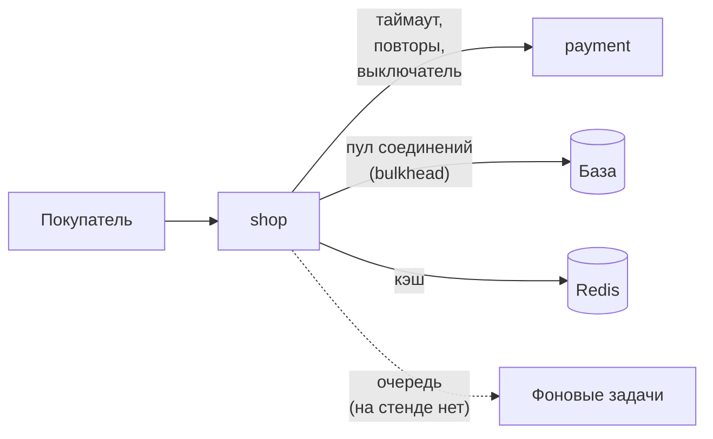
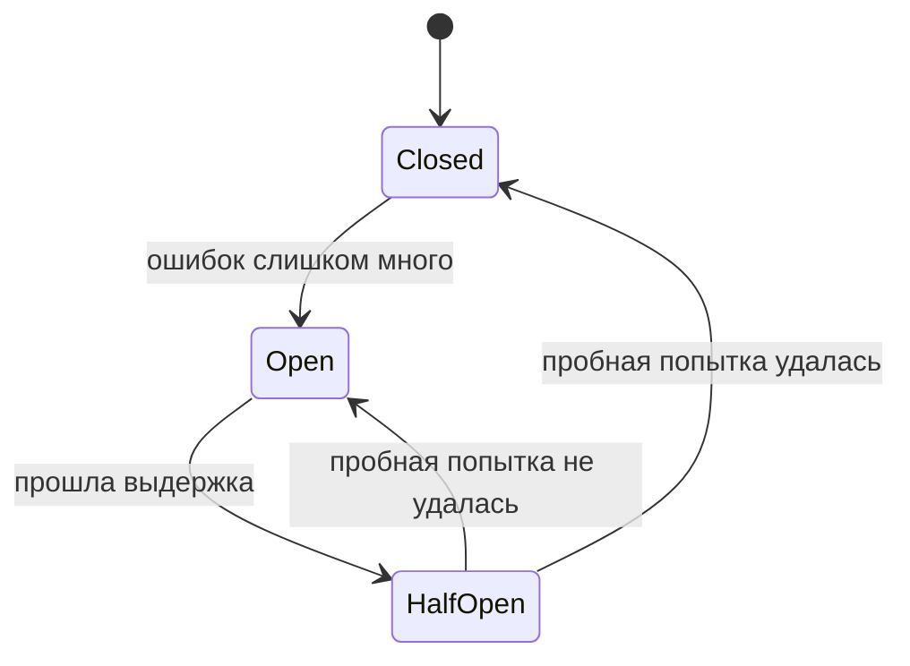
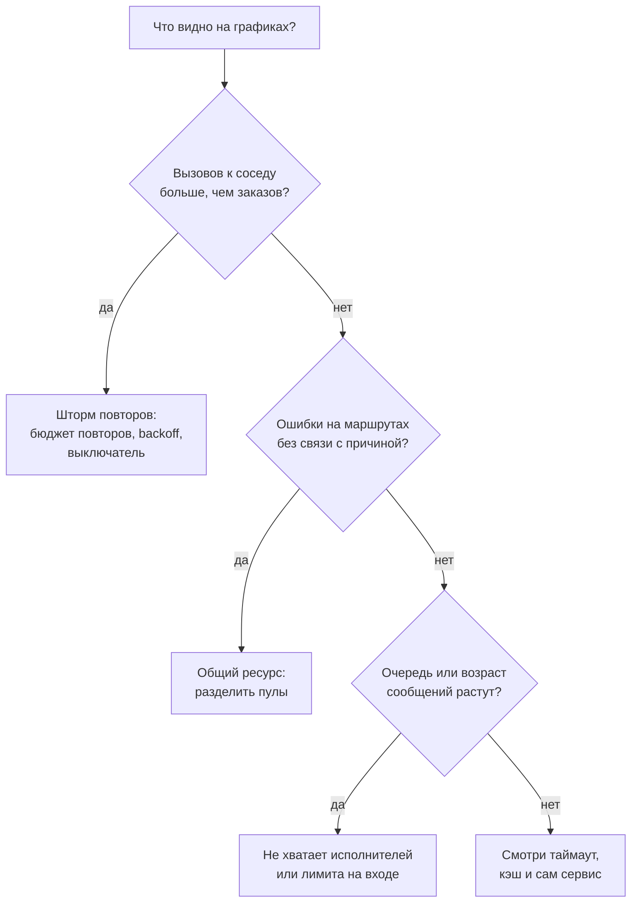

## Зачем это нужно

Репетиция распродажи. Команда магазина гонит нагрузку, оплата начинает отвечать медленно, и через минуту ложится весь сайт, даже каталог, который с оплатой никак не связан. Никто ничего не сломал руками: каждая часть вела себя разумно. Покупатель ждал ответа, магазин повторял неудачный вызов, база держала соединение, пока оплата думала. А вместе получился обвал.

Против такого обвала придумали набор приёмов. Их называют **паттернами надёжности** (reliability patterns, повторяющиеся решения, которые не дают одному сбою стать общей аварией). Код с ними обычно пишут разработчики. Тебе как человеку из мониторинга нужно другое: видеть, какой приём в системе есть, какого нет и как каждый выглядит на графике, в логе и в трейсе, когда сработал или когда его не хватило.

Из урока ты выйдешь с умением по картинке сказать «это шторм повторов», «это сработал выключатель», «тут нет разделения ресурсов». Ты воспроизведёшь такой шторм на стенде и увидишь его во всех трёх сигналах.

Шаг проекта: в `~/monitoring-lab/05-reliability/patterns` лежат скрипты `order.sh` и `counters.sh`, а в `notes.md` таблица «было и стало» по сбою оплаты и список паттернов, которых на стенде нет, с признаками, по которым ты бы их узнал.

## Что нужно знать

- Метрики, `rate`, `sum by`, `histogram_quantile`: [урок 2.2](../02-metrics/02-promql.md). Дашборды и RED: [урок 3.1](../03-dashboards-alerts/01-grafana.md). Алерты: [урок 3.2](../03-dashboards-alerts/02-alerts.md).
- Логи и трейсы, поле `trace_id`: [урок 4.1](../04-logs-traces/01-logs.md) и [урок 4.2](../04-logs-traces/02-traces.md).
- Ошибки покупателя и SLO: [урок 1.2](../01-basics/02-sli-slo.md).
- Стенд с профилем `monitoring` запущен. `docker compose`, `curl`, `jq`: [load-tester, урок 5.3](../../load-tester/05-docker/03-compose-shop.md).
- Сами приёмы подробно, с кодом и формулами, разобраны в [DevOps, уроке 8.11](../../devops/08-observability/11-reliability-patterns-burn-rate.md). Здесь мы смотрим на них глазами мониторинга и не пересказываем формулы.

## Картина целиком

Представь ресторан. Официант несёт заказ на кухню, а повар завис. Что делает разумный официант? Ждёт не бесконечно, а пару минут (таймаут). Пробует снова, но с паузой, а не стучит в дверь каждую секунду (повторы с задержкой). Если кухня явно не работает, перестаёт ходить и говорит гостям «горячего сегодня нет» (выключатель и деградация). У каждого официанта свой зал, чтобы один сорванный стол не занял всех (разделение ресурсов). А у входа стоит администратор и пускает гостей порциями (очередь).

В магазине то же самое, только официант это сервис `shop`, а кухня это `payment`. На стенде из этих приёмов есть только два, и оба «сырые»: таймаут (10 секунд по умолчанию) и три повтора без паузы. Остальные мы будем узнавать по признакам и честно говорить, когда их нет.



Читай схему слева направо. Покупатель стучится в `shop`, а `shop` ходит к соседям. У каждой стрелки может стоять приём, который защищает от сбоя соседа. Пунктирная стрелка к очереди нарисована ради полноты: на стенде оплата синхронная, в этом и корень каскада. Каждую стрелку разберём ниже.

## Теория

### Почему один медленный сосед кладёт всех

Оплата вместо 50 мс отвечает три секунды. При чём тут каталог? Представь кассу с пятью окошками. Кассир берёт у покупателя документы и уходит проверять их на склад. Пока он ходит, окошко занято. Если покупателей приходит больше, чем окошек освобождается, очередь растёт, а встать в неё вынужден и тот, кому нужно только спросить цену.

У этого есть простое правило, **закон Литтла** (Little's law, среднее число занятых мест равно скорости прихода, умноженной на время занятости). Он держится почти везде, где есть очередь. На стенде занятые места это соединения пула базы, скорость прихода это заказы в секунду, а время занятости это время ответа оплаты. Всё вместе: `занято = заказов в секунду × время ожидания`.

Теперь числа. Оплата отвечает за 0,05 с, заказов 2 в секунду: занято 0,1 соединения, пул скучает. Оплата отвечает за 3 с: занято 6 соединений при пуле из 5. И это не случайность дизайна: `pay()` в `shop` вызывается внутри транзакции и держит соединение с базой на всё время вызова. Оплата ест соединения базы.

> **Прикинь сам:** пул из 5 соединений, 2 заказа в секунду, оплата отвечает за 3 с. Что увидит покупатель, который просто открыл каталог?
{: .predict}

Нужно 6 соединений, а есть 5, значит, очередь за соединением растёт. Ждать соединение магазин будет `DB_POOL_TIMEOUT`, пять секунд, потом ответит 503 «database pool timeout». Каталог тоже ходит в базу, и он получит ту же очередь. Покупатель увидит либо долгую загрузку, либо ошибку на странице, которая с оплатой не связана.

Осторожно: на графиках это выглядит странно. Растёт `shop_db_pool_waiting`, ошибки идут с маршрутов, не имеющих отношения к оплате, а сама оплата «просто медленная». Если смотреть только на ошибки, причину не найти.

> **Главное:** занятость общего ресурса равна потоку, умноженному на время ожидания; медленный сосед занимает ресурс надолго и заставляет страдать тех, кто его не вызывал.
{: .key}

Из формулы видно, на что можно влиять: на время (таймаут), на поток (повторы, ограничения, очереди) и на общий ресурс (разделение). Начнём со времени.

### Таймаут: сколько ждать

Ждать бесплатно, пока не посмотришь на закон Литтла. Время ожидания входит в формулу напрямую: чем дольше ждёшь, тем дольше занят ресурс. Поэтому первый приём самый простой: назначить предел. **Таймаут** (timeout) это максимальное время, которое сервис готов ждать ответа. Вышло время, и вызов обрывается ошибкой.

Жизненный пример: ты звонишь в службу доставки и готов слушать гудки полминуты. Потом кладёшь трубку, потому что у тебя дела. Без правила «полминуты» ты бы висел на линии часами.

Как подбирать число, в уроке 8.11 разобрано: в два-три раза выше обычного p99 здоровой зависимости, а таймаут вложенного вызова меньше таймаута внешнего. На стенде таймаут одной попытки задан переменной `PAYMENT_TIMEOUT`, по умолчанию 10 секунд. Это очень щедро: попытка может занять соединение на десять секунд.

Посмотрим, что будет, если поставить `PAYMENT_TIMEOUT=1`, а оплату замедлить до трёх секунд (`delay_ms=3000`). Каждая попытка оборвётся на первой секунде. Попыток четыре (первая и три повтора), и заказ ответит `504 payment timeout` примерно через четыре секунды. Вот трейс такого заказа.

<div class="viz" data-viz="mon-trace" data-title='Трейс заказа при таймауте 1 с и оплате 3 с' data-trace-id='c41e0d7a93b2486fa5d0e6b17c82f93a' data-spans='[{"id":"a1","parent":null,"service":"shop","name":"POST /api/orders","start":0,"dur":4032,"status":"error","attrs":{"http.method":"POST","http.route":"/api/orders","http.status_code":504}},{"id":"a2","parent":"a1","service":"shop","name":"GET","start":1,"dur":1.5,"status":"ok","attrs":{"db.system":"redis"}},{"id":"a3","parent":"a1","service":"shop","name":"HGETALL","start":3,"dur":1.2,"status":"ok","attrs":{"db.system":"redis"}},{"id":"a4","parent":"a1","service":"shop","name":"DEL","start":4.5,"dur":0.9,"status":"ok","attrs":{"db.system":"redis"}},{"id":"a5","parent":"a1","service":"shop","name":"db.pool.getconn","start":6,"dur":0.4,"status":"ok","attrs":{}},{"id":"a6","parent":"a1","service":"shop","name":"SELECT","start":6.8,"dur":4.1,"status":"ok","attrs":{"db.system":"postgresql"}},{"id":"a7","parent":"a1","service":"shop","name":"INSERT","start":11,"dur":2.2,"status":"ok","attrs":{"db.system":"postgresql"}},{"id":"a8","parent":"a1","service":"shop","name":"UPDATE","start":14.6,"dur":1.4,"status":"ok","attrs":{"db.system":"postgresql"}},{"id":"c1","parent":"a1","service":"shop","name":"POST","start":16.5,"dur":1000,"status":"error","attrs":{"http.url":"http://payment:8001/pay","error":"timeout","попытка":1}},{"id":"p1","parent":"c1","service":"payment","name":"POST /pay","start":18.0,"dur":3000,"status":"ok","attrs":{"http.status_code":200}},{"id":"c2","parent":"a1","service":"shop","name":"POST","start":1017.0,"dur":1000,"status":"error","attrs":{"http.url":"http://payment:8001/pay","error":"timeout","попытка":2}},{"id":"p2","parent":"c2","service":"payment","name":"POST /pay","start":1018.5,"dur":3000,"status":"ok","attrs":{"http.status_code":200}},{"id":"c3","parent":"a1","service":"shop","name":"POST","start":2017.5,"dur":1000,"status":"error","attrs":{"http.url":"http://payment:8001/pay","error":"timeout","попытка":3}},{"id":"p3","parent":"c3","service":"payment","name":"POST /pay","start":2019.0,"dur":3000,"status":"ok","attrs":{"http.status_code":200}},{"id":"c4","parent":"a1","service":"shop","name":"POST","start":3018.0,"dur":1000,"status":"error","attrs":{"http.url":"http://payment:8001/pay","error":"timeout","попытка":4}},{"id":"p4","parent":"c4","service":"payment","name":"POST /pay","start":3019.5,"dur":3000,"status":"ok","attrs":{"http.status_code":200}},{"id":"a9","parent":"a1","service":"shop","name":"HINCRBY","start":4020,"dur":1.5,"status":"ok","attrs":{"db.system":"redis"}}]' data-focus='c2' data-explain='Магазин четыре раза подряд ждёт секунду и обрывает вызов, а оплата в это время продолжает работать три секунды и выходит за границу родителя. В конце возврат корзины в Redis.' data-try='Наведи на третий красный POST и на его дочерний POST /pay: у вызова магазина 1000 мс, у работы оплаты 3000 мс.'></div>

Смотри на четыре красные полосы `POST` по 1000 мс: магазин ждёт секунду, обрывает вызов и пробует снова, и так четыре раза подряд. Под каждой лежит полоса `POST /pay` из сервиса `payment` длиной три секунды, и она выходит за границу родителя: оплата ещё работает, когда магазин от неё уже отказался. Последним идёт `HINCRBY`, возврат корзины в Redis.

В метрике этот же заказ даёт `shop_payment_requests_total{result="timeout"}` плюс четыре. Гистограмма `shop_payment_duration_seconds` при таймауте не показывает «настоящую» медлительность оплаты: все попытки заканчиваются на одной секунде, и p95 упирается в потолок. А в логе заказ выглядит так.

<div class="viz" data-viz="mon-logs" data-title='Лог магазина: заказы при сбое оплаты' data-query='{service="shop"} | json | route="/api/orders"' data-lines='[{"ts":"2026-10-04 14:21:07.402","level":"error","labels":{"service":"shop","container":"shop-shop-1","level":"ERROR"},"line":"{\"ts\": \"2026-10-04T14:21:07.402123+00:00\", \"level\": \"ERROR\", \"msg\": \"Запрос завершён\", \"method\": \"POST\", \"route\": \"/api/orders\", \"path\": \"/api/orders\", \"status\": 504, \"duration_ms\": 4021.33, \"request_id\": \"5b0e8f3a1c7d4e29a6f0b2d8c9e1a374\", \"trace_id\": \"c41e0d7a93b2486fa5d0e6b17c82f93a\", \"user_id\": 3, \"error\": \"payment timeout\"}"},{"ts":"2026-10-04 14:20:52.118","level":"error","labels":{"service":"shop","container":"shop-shop-1","level":"ERROR"},"line":"{\"ts\": \"2026-10-04T14:20:52.118123+00:00\", \"level\": \"ERROR\", \"msg\": \"Запрос завершён\", \"method\": \"POST\", \"route\": \"/api/orders\", \"path\": \"/api/orders\", \"status\": 502, \"duration_ms\": 268.41, \"request_id\": \"91d2c7e4b0a53f68e1d4a9c27b6f0e35\", \"trace_id\": \"8a6f2d19c3e74b05a1d8e7c4f9b02a63\", \"user_id\": 17, \"error\": \"payment failed\"}"},{"ts":"2026-10-04 14:19:30.771","level":"info","labels":{"service":"shop","container":"shop-shop-1","level":"INFO"},"line":"{\"ts\": \"2026-10-04T14:19:30.771123+00:00\", \"level\": \"INFO\", \"msg\": \"Запрос завершён\", \"method\": \"POST\", \"route\": \"/api/orders\", \"path\": \"/api/orders\", \"status\": 201, \"duration_ms\": 96.52, \"request_id\": \"e47a1b9d5c3f4802b6e9d1a7c0f38b52\", \"trace_id\": \"2f9d6a4e8b1c4d73a0e5c9b1f7d84e06\", \"user_id\": 402}"}]' data-highlight='payment' data-explain='Две красные строки это два разных сбоя оплаты: 504 после четырёх секунд ожидания и 502 после четверти секунды. Нижняя строка здоровый заказ.' data-try='Сравни duration_ms и поле error у красных строк: по ним отличается «оплата молчит» от «оплата отказывает».'></div>

Две красные строки: `504` с `error: payment timeout` пришла через 4021 мс, а `502` с `payment failed` через 268 мс: это другой заказ, где оплата ответила ошибкой быстро. Разница в `duration_ms` и в тексте `error` сразу отделяет «оплата молчит» от «оплата отказывает». По `trace_id` из любой строки ты попадёшь в трейс.

> **Прикинь сам:** магазин оборвал вызов на первой секунде, но `payment` через три секунды всё равно отработал. Что может случиться со счётом покупателя?
{: .predict}

Оплата завершилась успешно, деньги списаны, а магазин уже вернул покупателю ошибку и откатил заказ. Покупатель нажмёт «оплатить» снова, и платёж пройдёт второй раз. Это «зомби-работа». Лекарство называется идемпотентный ключ (запрос с одним и тем же ключом выполняется один раз), оно разобрано в 8.11, а на стенде его нет. В мониторинге зомби виден как расхождение: `payment_requests_total{status="200"}` растёт, а `shop_orders_created_total` нет.

Осторожно: если на графике время вызова «упирается» ровно в одно круглое число (одна секунда, три, десять), это обычно таймаут, а не настоящая скорость системы. Ищи полку на гистограмме.

> **Главное:** таймаут ограничивает время занятости ресурса; на графике он виден как полка на p95 и серия `result="timeout"`, а у соседа в трейсе остаётся зомби-работа.
{: .key}

Один таймаут отрезал ожидание. Но магазин после него ещё и стучится снова, и это уже отдельная история.

<details markdown="1">
<summary>Проверь понимание</summary>

Таймаут одной попытки 1 с, повторов 3, оплата зависла. Сколько секунд проведёт покупатель в ожидании и сколько соединений пула займёт один такой заказ? Если заказов 2 в секунду, сколько соединений нужно в среднем?

Ответ: 4 секунды (4 попытки по секунде), всё это время заказ держит одно соединение. При 2 заказах в секунду нужно 2 × 4 = 8 соединений при пуле из 5.

</details>

### Повторы, backoff и jitter

Один вызов не прошёл, и первая мысль «попробую ещё раз». Часто это правильно: сеть мигнула, под перезапустился, и вторая попытка проходит. **Повтор** (retry) это новая попытка того же вызова после ошибки. Жизненный пример: в лифте не загорелась кнопка, ты нажал ещё раз.

Опасность в частоте. Если нажимать кнопку каждые 10 мс, а нажимающих сто человек, лифт точно не поедет. Поэтому повторы делают с паузой, которая растёт: 0,2 с, потом 0,4 с, потом 0,8 с. Так каждая следующая попытка даёт зависимости больше времени прийти в себя и не бьёт её толпой. Это **экспоненциальная задержка** (exponential backoff, пауза удваивается после каждой неудачи). К ней добавляют **jitter** (случайный разброс паузы), чтобы тысяча клиентов, у которых сбой случился одновременно, не пришла за второй попыткой тоже одновременно. Формулу с `min(cap, base * 2**attempt)` и вариантами jitter ты найдёшь в 8.11, там же бюджет повторов: не больше 10% лишних запросов. Повторять можно только идемпотентные вызовы и коды 408, 429, 502, 503, 504, а не 4xx.

На стенде `payment_client.py` делает `PAYMENT_RETRIES=3` повторов, то есть до четырёх попыток на заказ, и пауз между ними нет. Так задумано: стенд умышленно показывает худший вариант. Посчитаем. Заказов 2 в секунду, оплата отвечает ошибкой мгновенно. Каждый заказ делает четыре попытки, и оплата получает 8 вызовов в секунду вместо 2. Входящая нагрузка не изменилась, а нагрузка на зависимость выросла вчетверо. Это называется **retry storm** (шторм повторов).

Цифры «попыток на заказ» удобно держать перед глазами. Вот ряд Stat для сбоя оплаты с таймаутом 1 с.

<div class="viz" data-viz="mon-stat" data-stats='[{"title":"Попыток на заказ","value":4,"unit":"","color":"red","spark":[1,1,1,1,1,2,4,4,4,4,4,4,4,4,4,4],"sub":"в норме 1"},{"title":"Заказов в секунду","value":2,"unit":"/с","color":"green","spark":[2,2,2,2,2,2,2,2,2,2,2,2,2,2,2,2],"sub":"не изменилось"},{"title":"Ждёт покупатель","value":4.0,"unit":"с","color":"red","spark":[0.1,0.1,0.1,0.1,0.1,1,2,4,4,4,4,4,4,4,4,4],"sub":"4 попытки по 1 с"},{"title":"Занято соединений","value":5,"unit":"из 5","color":"orange","spark":[0,0,0,0,0,2,3,5,5,5,5,5,5,5,5,5],"sub":"нужно 8"}]' data-explain='Четыре числа одного сбоя оплаты с таймаутом в одну секунду: поток заказов прежний, а попыток вчетверо больше, ожидание четыре секунды, пул упёрся в пять.' data-try='Сравни «Попыток на заказ» и «Заказов в секунду»: входящий поток не вырос, а нагрузка на оплату выросла вчетверо.'></div>

Красная «4» это главное число: на один заказ приходится четыре попытки. В норме там была бы единица. Рядом занятость пула: все пять соединений заняты, и очередь за ними уже растёт.

> **Прикинь сам:** оплата начала отвечать ошибкой 500 за 50 мс, заказов 2 в секунду, повторов 3. Сколько запросов получит оплата за минуту и что станет с её сбоем?
{: .predict}

Заказов за минуту 120, попыток 480. Оплата, которая и так болеет, получает вчетверо больше работы, поэтому выздороветь ей труднее: повторы превращают короткий сбой в долгий.

Осторожно: повторы без бюджета самый частый способ усилить аварию. Спроси себя: если зависимость недоступна, сколько лишней работы я ей создам? Если ответ «в разы», повторы надо ограничить.

> **Главное:** повтор хорош против редких сбоев и вреден при долгих; backoff с jitter размазывает попытки по времени, бюджет повторов ограничивает усиление.
{: .key}

Теперь посмотрим, как усиление выглядит на графике и как поймать его алертом.

### Retry storm на графике: нагрузка растёт, а заказов не больше

Шторм повторов удобно узнавать по одному признаку: запросы к зависимости растут, а входящих запросов столько же. Если открыть дашборд с двумя линиями, получится характерная картинка. Красная линия это попытки к оплате (`shop_payment_requests_total`), синяя это заказы (`http_requests_total` по маршруту `/api/orders`). С 14:03 по 14:06 оплата отвечает ошибкой на каждый вызов (`fail_rate=1`).

<div class="viz" data-viz="mon-panel" data-title='Шторм повторов: попытки к оплате и заказы' data-query='sum(rate(shop_payment_requests_total[1m]))' data-x='["14:00","14:01","14:02","14:03","14:04","14:05","14:06","14:07","14:08","14:09"]' data-unit='req/s' data-series='[{"name":"попытки к оплате","values":[2,2,2,8,8,8,8,2,2,2],"color":"red"},{"name":"заказы POST /api/orders","values":[2,2,2,2,2,2,2,2,2,2],"color":"blue"}]' data-annotations='[{"at":"14:03","text":"оплата падает (fail_rate=1)"},{"at":"14:07","text":"вернули оплату"}]' data-explain='Заказов столько же, сколько и раньше, а попыток к оплате в четыре раза больше: повторы без пауз усиливают сбой. Значения примерные.' data-try='Наведи на 14:05: в подсказке видно 8 попыток против 2 заказов.'></div>

Синяя линия лежит на двух заказах в секунду всё время, а красная с 14:03 взлетает до восьми и возвращается, когда оплату вернули. Значения примерные, но форма настоящая: «вилка» между входящим потоком и вызовами зависимости. Ту же картину даёт запрос по метке результата.

<div class="viz" data-viz="mon-table" data-title='Prometheus: Table' data-query='sum by (result) (increase(shop_payment_requests_total[1m]))' data-columns='["result","Значение"]' data-rows='[["error",480],["ok",0]]' data-highlight-col='1' data-highlight-row='0' data-explain='За минуту шторма оплата получила 480 неудачных попыток при 120 заказах: 120 умножить на 4.'></div>

Одна строка с 480 неудачными попытками за минуту: 120 заказов, умноженные на четыре. Если в такой строке рядом нет заказов, а попыток много, ищи усиление.

В логе шторм виден как серии строк с одной и той же ошибкой за доли секунды, а в трейсе как четыре красных `POST` подряд под одним корнем. Но срабатывать будить человека должно не на лог, а на отношение попыток к заказам:


```yaml
- alert: PaymentRetryStorm
  expr: |
    sum(rate(shop_payment_requests_total[1m]))
      / sum(rate(http_requests_total{route="/api/orders",method="POST"}[1m])) > 2
    and sum(rate(http_requests_total{route="/api/orders",method="POST"}[1m])) > 0.2
  for: 2m
  labels: {severity: warning}
```


Так выглядит жизнь такого алерта на тех же данных: в норме на заказ приходится одна попытка, при шторме четыре.

<div class="viz" data-viz="mon-alert" data-title='PaymentRetryStorm' data-name='попыток на заказ' data-unit='' data-threshold='2' data-for='2' data-group-wait='1' data-x='["14:00","14:01","14:02","14:03","14:04","14:05","14:06","14:07","14:08","14:09"]' data-values='[1,1,1,4,4,4,4,1,1,1]' data-explain='Условие выполнено с четвёртой точки, но алерт сначала ждёт выдержку for, потом горит, а когда оплату вернули, возвращается в норму.'></div>

Условие впервые выполнено на четвёртой точке, но алерт ещё ждёт `for`. Горит он чуть позже, а когда оплату вернули, возвращается в норму. Порог 2 стоит вдвое выше нормы (1), а минимум трафика защищает от ночных шумов, как в уроке 3.2.

> **Прикинь сам:** отношение «попыток на заказ» держится на 1,0, а ошибки оплаты растут. Значит ли это, что повторов нет?
{: .predict}

Да, повторы не усиливают нагрузку: каждый заказ делает по одной попытке. Либо повторов в коде нет, либо все заказы успевают пройти с первого раза. Ошибки при этом всё равно идут, но их причина в самой оплате.

Осторожно: отношение попыток к заказам не заменяет алерт на ошибки покупателя. Оно говорит только об усилении, а не о том, что покупателям плохо.

> **Главное:** шторм повторов выглядит как «вилка» между входящим потоком и вызовами зависимости; ловить его надо отношением «попыток на заказ», а не абсолютным числом запросов.
{: .key}

Если сбой долгий, повторы только вредят. Нужен приём, который перестаёт стучаться, когда видно, что бесполезно.

### Circuit breaker: не стучаться туда, где не откроют

Дома в щитке стоит автомат: если в проводке короткое замыкание, он выбивает и размыкает цепь, чтобы не сгорело всё. **Circuit breaker** (выключатель, предохранитель вызова) делает то же для вызовов: когда зависимость явно не отвечает, он размыкается, и вызовы к ней какое-то время даже не отправляются, а сразу получают отказ.

У него три состояния. В **closed** (замкнут) вызовы идут как обычно, а выключатель считает ошибки. Когда ошибок слишком много, он переходит в **open** (разомкнут): вызовы не уходят вовсе, ответ отказа приходит за миллисекунды. Через выдержку выключатель переходит в **half-open** (полуоткрыт) и пропускает одну пробную попытку. Прошла, и он снова замыкается. Не прошла, и он размыкается ещё на выдержку.



Читай схему так: в нормальной жизни выключатель сидит в `Closed`. Беда переводит его в `Open`, и там он держится, пока не наберётся уверенность, что зависимость ожила.

**На стенде выключателя нет.** Поэтому показать его вживую нельзя, и ниже иллюстрация модели, а не измерение стенда. Вот как менялось бы ожидание покупателя при том же зависании оплаты на секундах 30-70, без выключателя и с ним.

<div class="viz" data-viz="mon-panel" data-title='Модель: сколько ждёт покупатель при зависшей оплате (выключателя на стенде нет)' data-query='модель виджета урока, не измерение стенда' data-x='["0:00","0:10","0:20","0:30","0:40","0:50","1:00","1:10","1:20","1:30","1:40","1:50","2:00"]' data-unit='с' data-series='[{"name":"без выключателя","values":[0.05,0.05,0.05,4,4,4,4,0.05,0.05,0.05,0.05,0.05,0.05],"color":"red"},{"name":"с выключателем","values":[0.05,0.05,0.05,4,0.02,0.02,0.02,0.02,0.05,0.05,0.05,0.05,0.05],"color":"green"}]' data-annotations='[{"at":"0:30","text":"оплата зависла"},{"at":"1:10","text":"оплата восстановлена"}]' data-explain='Это иллюстрация модели, а не измерение стенда. Выключатель срезает ожидание с четырёх секунд до миллисекунд, но первые секунды покупатель ждёт всё равно.' data-try='Сравни линии в момент 0:40: с выключателем отказ приходит почти мгновенно.'></div>

Без выключателя покупатель ждёт четыре секунды весь сбой. С выключателем эти четыре секунды видны только в начале, пока он не понял, что что-то не так, а потом ожидание падает до миллисекунд: заказы отказывают, но быстро. Именно это и значит «мгновенные 503 вместо таймаутов».

Как узнать открытый выключатель по сигналам. На графике попыток к зависимости: падение почти до нуля при том же входящем потоке, и раз в выдержку одна пробная попытка. На графике p95: резкий спад задержки при росте ошибок. В логах: отказ за единицы миллисекунд с текстом вроде «circuit open» (в приложении с выключателем он обычно отдельный). В трейсе: корневой спан короткий, а вызова к зависимости в нём нет совсем.

> **Прикинь сам:** вдруг на графике ошибки выросли, а p95 задержки заказов упал. Это улучшение?
{: .predict}

Скорее нет. Если вместе с падением p95 исчезли и вызовы к зависимости, перед тобой открытый выключатель или иной fail fast: покупатели получают быстрые отказы. Улучшением было бы падение p95 при падающих ошибках. Всегда смотри на оба графика вместе.

Осторожно: у выключателя есть цена. Пока он разомкнут, оплата уже может ожить, а заказы ещё отказывают, пока не придёт пробная попытка. Ты увидишь «хвост» ошибок после ремонта, и это нормально, если он короткий. Слишком чувствительный выключатель размыкается от случайного всплеска и сам создаёт аварию.

> **Главное:** выключатель на время перестаёт обращаться к больной зависимости; снаружи это «попытки к ней почти нуль, отказы быстрые, p95 упал при растущих ошибках».
{: .key}

Теперь соберём таймаут, повторы и выключатель на одной сцене.

### Таймаут, повторы и выключатель на одной сцене

Ниже модель стенда: два заказа в секунду, оплата ломается на секундах 30-70 из двух минут. Четыре панели: попытки к оплате, ожидание покупателя, нужное число соединений (линия пула стоит на пяти) и заказы с отказами. Нажми «Оплата зависла» и «Оплата отвечает 500 сразу», подвигай повторы и таймаут, потом включи выключатель и сравни.

<div class="viz" data-viz="mon5-resilience" data-orders="2" data-retries="3" data-timeout="1" data-kind="hang" data-breaker="0"></div>

Модель считает по секундам: зависание держит каждую попытку до таймаута, ошибка отдаётся за доли секунды, соединений нужно «заказов в секунду × ожидание». Для выключателя в ней задано пятнадцать секунд выдержки.

> **Прикинь сам:** повторов 0, таймаут 1 с, оплата зависла, 2 заказа в секунду. Выйдет ли потребность в соединениях за линию пула?
{: .predict}

Нет. Ожидание одна секунда, нужно 2 × 1 = 2 соединения при пуле из 5. Без повторов зависание не кладёт магазин. Верни повторы 3 и таймаут 5 с: нужно 2 × 4 × 5 = 40 соединений, и пул кончится почти сразу.

Осторожно: настройки не складываются «по отдельности». Таймаут 10 с и 3 повтора на стенде означают до 40 секунд ожидания одного заказа, пока покупатель давно закрыл вкладку. Считай произведение.

> **Главное:** ожидание равно попыткам, умноженным на таймаут, а нужное число соединений ещё и на поток; выключатель обрубает это произведение, но платит хвостом ошибок после ремонта.
{: .key}

Выключатель защищает от плохого соседа по сети. А от соседа внутри самого сервиса защищает другой приём.

Таймаут, повторы и выключатель ограничивают ожидание одного вызова к зависимости. Дальше идут приёмы другого рода: они делят общие ресурсы и нагрузку между разными потоками запросов.

<details markdown="1">
<summary>Для любопытных: что такое half-open на практике</summary>

В half-open выключатель обычно пропускает ограниченное число пробных вызовов. Если оставить одну попытку, ремонт зависимости будет замечен с задержкой до выдержки. Если пропускать много, можно положить недоваренную зависимость. Поэтому число пробных обычно мало, а выдержка растёт после каждой неудачи, как backoff. В виджете выше ты видишь это как короткие синие полоски: выключатель то размыкается, то пробует.

</details>

### Bulkhead и шардирование: чтобы дыра не затопила весь корабль

В корабле между отсеками стоят переборки. Пробоина в одном отсеке заливает его, а остальные остаются сухими. **Bulkhead** (переборка, разделение ресурсов) переносит идею в сервис: на каждую зависимость свой пул соединений, свои потоки или свой лимит одновременных вызовов. Тогда медленная оплата занимает только свой пул.

На стенде переборки нет, и это хороший учебный пример отсутствия. Один пул из пяти соединений общий: заказы держат его, пока ждут оплату, а каталог и корзина стоят за ним же. Поэтому оплата и валит каталог. Если бы пулы были раздельными, у оплаты кончился бы её пул, заказы отвечали бы быстрыми отказами, а каталог работал.

Как узнать по графикам, что переборки нет. Растёт очередь за общим ресурсом (`shop_db_pool_waiting`), а ошибки и задержка расползаются по маршрутам, никак не связанным с больной зависимостью. Если переборка есть, картина другая: очередь растёт в одном пуле, у соседних маршрутов p95 остаётся ровным.

Родственный приём из статей SRE это **шардирование** (partitioning, разделение данных или пользователей на независимые части). Если у магазина четыре шарда и один лёг, плохо только четверти покупателей. На графике это видно по метке: ошибки сидят в одном шарде, остальные чисты. Пока у тебя всё в одном экземпляре, такой метки нет, и сбой задевает всех.

> **Прикинь сам:** ты разделил общий пул на два: 3 соединения для заказов и 2 для остального. Оплата снова зависает на 3 секунды при 2 заказах в секунду. Что случится с каталогом?
{: .predict}

Заказам нужно 6 соединений, а у них 3: их очередь растёт и они отдают 503. Каталог живёт на своих двух соединениях, и сбой оплаты его не трогает. Заказы всё равно страдают: переборка не лечит оплату, а ограничивает ущерб.

Осторожно: переборка стоит ресурсов. Раздельные пулы означают, что в обычный день часть соединений простаивает, пока соседний пул захлёбывается. Размер каждого отсека надо подбирать по наблюдаемой нагрузке.

> **Главное:** bulkhead делит общий ресурс, чтобы сбой не распространялся; признак его отсутствия в мониторинге это ошибки и очередь на маршрутах, не связанных с причиной.
{: .key}

Переборки ограничивают ущерб, а следующие приёмы решают, что делать с запросами, которые уже не обслужить.

### Fail fast, load shedding и throttling: отказать честно и быстро

«Мест нет» лучше трёхчасовой очереди, после которой всё равно скажут «мест нет». **Fail fast** (отказать быстро) значит: если шансов нет, ответить сразу, а не ждать таймаута. Открытый выключатель это частный случай. **Load shedding** (сброс нагрузки) значит: перегруженный сервис сам отбрасывает часть запросов, начиная с наименее важных, чтобы остальные прошли. Оплата важнее каталога, поэтому каталог можно отбросить первым. **Throttling** или **rate limit** (ограничение частоты) значит: заранее решить, сколько запросов от клиента вы готовы принимать, и лишнее отвергать ответом `429` с подсказкой `Retry-After`.

Чем они различаются? Throttling защищает от одного шумного клиента и работает «по метке» клиента. Load shedding защищает сервис от общей перегрузки. Fail fast защищает вызывающего от зря потраченного времени.

На стенде этих приёмов нет. Самое близкое: ответ `503 database pool timeout`. Это отказ, но поздний: он приходит через пять секунд ожидания, а настоящий fail fast пришёл бы за миллисекунды. На графике разница заметна. Поздний отказ даёт рост p95 до пяти секунд вместе с ошибками, а быстрый даёт рост ошибок при ровном p95.

Как узнать по сигналам. Throttling: `429` у одного клиента или ключа, остальные в порядке. Load shedding: доля `503` вырастает при пике нагрузки, а p95 остаётся низким, пока запросы, которые приняли, обрабатываются нормально. В логах это строки с коротким `duration_ms` и текстом о превышении лимита, в трейсах корень без вложенных вызовов.

> **Прикинь сам:** сервис отвечает `429` на 30% запросов, p95 при этом не вырос. Хорошо это или плохо?
{: .predict}

Зависит от меток. Если `429` получает один шумный клиент, лимит делает свою работу. Если `429` получают все покупатели при обычной нагрузке, лимит слишком мал, и вы режете выручку сами. Поэтому на графике отказов нужна метка клиента или маршрута, одна общая цифра ничего не скажет.

Осторожно: для покупателя отказ остаётся отказом. В SLO из урока 1.2 решай заранее, считается ли `429` ошибкой: для клиента, который превысил лимит, нет, для обычного покупателя да.

> **Главное:** fail fast, shedding и throttling отказывают быстро и осознанно; их след в мониторинге это рост доли `429` или `503` при ровном p95.
{: .key}

Отказ можно смягчить: не «ничего нет», а «есть меньше, чем обычно».

### Деградация и кэш: работать хуже, но работать

Ресторан остался без горячего, но суп и салаты есть. Это **деградация с минимальной функциональностью** (graceful degradation, режим, в котором сервис отдаёт меньше, но не падает целиком). В магазине это каталог из кэша при больной базе или заказ без рекомендаций. Для SRE это принцип: при ухудшении лучше потерять второстепенное и сохранить главное.

Самый частый исполнитель деградации это **кэш** (cache, быстрое хранилище копий данных, которое отвечает вместо медленного источника). На стенде карточка товара `/api/products/{id}` кэшируется в Redis, если задать `CACHE_ENABLED=1`. По умолчанию кэш выключен, а время жизни записи `CACHE_TTL` равно 60 секундам. Подробнее про пользу и ловушки кэша читай в [load-tester, уроке 11.5](../../load-tester/11-bottlenecks/05-cache-dependencies.md), здесь только то, как он виден.

Метрика `shop_cache_requests_total{result="hit|miss"}` считает попадания и промахи. Вот как выглядит прогрев: сначала почти все запросы промахи и идут в базу, потом доля попаданий растёт.

<div class="viz" data-viz="mon-panel" data-title='Кэш карточек: попадания и промахи' data-query='sum by (result) (rate(shop_cache_requests_total[1m]))' data-x='["14:00","14:01","14:02","14:03","14:04","14:05","14:06","14:07","14:08","14:09"]' data-unit='req/s' data-stack='true' data-series='[{"name":"hit","values":[0,6,9,9.5,9.6,9.6,9.7,9.7,9.7,9.8],"color":"green"},{"name":"miss","values":[10,4,1,0.5,0.4,0.4,0.3,0.3,0.3,0.2],"color":"yellow"}]' data-annotations='[{"at":"14:00","text":"кэш включён (CACHE_ENABLED=1)"}]' data-explain='Сразу после включения почти все запросы промахи и идут в базу, потом их место занимают попадания. Значения примерные.' data-try='Наведи на 14:00 и на 14:05 и сравни, сколько запросов в секунду доходит до базы.'></div>

Жёлтая часть (промахи) тает с 10 запросов в секунду до долей, а попадания занимают почти всю высоту. Каждое попадание это запрос, не дошедший до базы, и соединение пула, которое он не занял. Поэтому кэш защищает и базу, и соседние маршруты.

В сигналах кэш и деградация видны так. Доля попаданий `hit / (hit + miss)` на графике. Во время сбоя базы карточки (`/api/products/{id}`) продолжают отвечать `200`, а список и заказы отказывают: такая «дыра на одном маршруте» и есть деградация. В логах ответ с коротким `duration_ms`, в трейсе нет спанов базы, только Redis `GET`.

> **Прикинь сам:** кэш отдаёт 90% карточек, поток карточек 20 в секунду. Сколько обращений в базу создают карточки?
{: .predict}

Промахи составляют 10%, то есть 2 запроса в секунду. Без кэша было бы 20. Если кэш выключить или потерять, нагрузка на базу вырастет в десять раз за секунду, поэтому после перезапуска Redis пустой кэш («холодный старт») сам способен уронить базу.

Осторожно: кэш скрывает сбой источника. Пока записи живы, всё выглядит нормально, а когда TTL выйдет, сбой «проявится» сразу у всех. Смотри не только на hit ratio, но и на возраст данных и на нагрузку на источник.

> **Главное:** деградация оставляет главное и жертвует второстепенным, а кэш чаще всего её исполняет; в мониторинге это доля попаданий и маршрут, который жив, пока соседний отказывает.
{: .key}

Деградация работает, пока запрос синхронный. Если часть работы можно отложить, есть более мощный приём.

### Очереди, события и виртуальная очередь

«Принимаем заказ и позвоним, когда он будет готов». Так работает любая курьерская служба: она не стоит у вас в дверях, пока курьер ищет посылку. **Очередь** (queue, сообщения, которые кладут в хранилище и разбирают по одному) разделяет работу во времени: приложение принимает задачу, быстро отвечает «принято», а исполнитель разбирает её, как успеет. Пики сглаживаются. Развитие идеи это **событийная архитектура** (event-driven, сервисы общаются сообщениями о том, что произошло, а не прямыми вызовами): оплата, склад и уведомления подписаны на событие «заказ создан» и не ждут друг друга.

На магазине оплата синхронная, и из-за этого сбой оплаты немедленно становится сбоем заказа. Если бы заказ ставился в очередь, покупатель получил бы «заказ принят», а оплату довели бы в фоне.

На входе используют ещё один приём, **waiting room** (виртуальная очередь, «зал ожидания»): на распродаже пускают на сайт по сто человек в минуту, остальные ждут на отдельной странице. Нагрузка на сам магазин остаётся ровной, а у покупателей есть честная очередь.

Как узнать очередь по сигналам. Главный график это глубина очереди и возраст самого старого сообщения: они растут в пик и спадают после. Ошибок при этом может не быть совсем, растёт задержка. В логах появляются повторные доставки, одно сообщение обработано дважды, поэтому исполнитель обязан быть идемпотентным. В трейсе путь рвётся: между отправкой и обработкой проходит время, и обычно их связывает ссылка на контекст, а не родитель. У waiting room свой признак: число ожидающих растёт, а поток внутрь ровный, как стена.

> **Прикинь сам:** глубина очереди растёт десять минут, исполнители здоровы и не падают. Что это значит и на что ставить алерт?
{: .predict}

Приход сообщений выше скорости обработки: исполнители справляются, но не успевают. Растёт не число ошибок, а ожидание. Алерт нужен на возраст самого старого сообщения (он прямо измеряет, сколько клиент ждёт), а не на ошибки.

Осторожно: очередь без предела это отложенная авария. Она прячет перегрузку, пока не кончится память или диск, а хвост задач становится таким длинным, что обработка теряет смысл. Лимит и политика сброса нужны и ей.

> **Главное:** очередь разделяет приём и обработку во времени; её здоровье измеряется глубиной и возрастом старейшего сообщения, а не ошибками.
{: .key}

Если работу разделили, возникает вопрос: что делать, когда один из шагов не удался, а предыдущие уже сделаны.

### Компенсирующая транзакция: как откатить то, что откатить нельзя

В базе транзакцию можно откатить одной командой. Но когда шаги разбросаны по сервисам, общего «отката» нет. Ты забронировал билет и отель, а оплата не прошла. Билет надо отменить отдельным действием. Такое действие называется **компенсирующей транзакцией** (compensating transaction, отдельный шаг, который отменяет результат предыдущего). Цепочку шагов с компенсациями называют сагой.

На стенде есть одна компенсация, и ты уже видел её в трейсе. Когда оплата не прошла, SQL заказа откатывается, а товары из корзины возвращаются обратно в Redis командой `HINCRBY`. Корзину покупателя, которую `DEL` очистил в начале заказа, нужно восстановить: иначе он потерял бы выбранное. Другой компенсации на стенде нет: отмены платежа (refund) нет, а мы только что видели, что оплата может пройти уже после таймаута.

Как увидеть компенсацию в сигналах. В трейсе после красных вызовов идёт спан компенсации (`HINCRBY`). В логах строка с ошибкой, после которой пользователь снова видит товары в корзине. В метриках главный признак это расхождение: платежей успешных больше, чем созданных заказов.

> **Прикинь сам:** за минуту `payment_requests_total{status="200"}` вырос на 4, а `shop_orders_created_total` не вырос совсем. Что это значит?
{: .predict}

Оплата четырежды прошла успешно, а заказ не создан. Это зомби-платежи: магазин оборвал ожидание по таймауту, откатил заказ, а оплата завершилась. Нужна компенсация «вернуть деньги» или идемпотентный ключ, чтобы платёж не повторился. На стенде в практике 3 ты получишь ровно такую картину.

Осторожно: компенсация сама может не сработать. Тогда нужен контроль расхождений: регулярная сверка «деньги против заказов» ловит то, что не поймал ни один алерт.

> **Главное:** там, где общего отката нет, шаги отменяют вручную написанными компенсациями; расхождение между счётчиками соседних сервисов показывает, где компенсации не хватило.
{: .key}

<details markdown="1">
<summary>Проверь понимание</summary>

Заказ оборвался по таймауту, но `payment` через три секунды успешно списал деньги. Какие два числа на дашборде разойдутся и какой приём лечит причину?

Ответ: `payment_requests_total{status="200"}` вырастет, а `shop_orders_created_total` нет. Лечит идемпотентный ключ (повторный запрос с тем же ключом не списывает второй раз) плюс отмена платежа как компенсация.

</details>

### Sidecar, service mesh и API gateway: приёмы вне кода

Не все приёмы пишут в коде приложения. Иногда их выносят «рядом». **Sidecar** (прицеп) это прокси-процесс в соседнем контейнере, который перехватывает входящие и исходящие вызовы сервиса. **Service mesh** (сервисная сетка) это сеть таких прокси плюс центр управления: таймауты, повторы, выключатели и лимиты задаются конфигом для всех сервисов сразу, без правки кода (примеры Istio и Linkerd). **API gateway** (шлюз) стоит на входе: проверяет аутентификацию, ограничивает частоту, ставит таймаут на всю цепочку.

Что даёт мониторингу. Прокси отдают свои метрики: сколько запросов ушло, сколько повторов, сколько отказов выключателя. Благодаря этому поведение сети видно отдельно от приложения. Ещё в трейсе появляются спаны прокси, и по ним видно, где время съела сеть, а где код.

Подвох: повторы теперь живут в двух местах. Если приложение делает 3 повтора и mesh делает ещё 2, одна ошибка превратится в (3 + 1) × (2 + 1) = 12 попыток. Из метрик приложения этого не увидеть, разница видна только в метриках прокси.

На стенде нет ни sidecar, ни mesh, ни gateway: Prometheus ходит к сервисам напрямую. Поэтому для этих приёмов у нас теоретическая картинка.

> **Прикинь сам:** приложение делает 2 повтора, mesh тоже 2. Сколько попыток получит зависимость при одной ошибке?
{: .predict}

(2 + 1) × (2 + 1) = 9, а не 3. Повторы перемножаются. Решение: повторы делают на одном уровне, обычно на самом внешнем, и это записано в договорённости команд.

Осторожно: mesh и gateway добавляют новое место для сбоев. Они сами могут стать причиной задержки и должны быть под наблюдением, как любой другой сервис.

> **Главное:** sidecar, mesh и gateway переносят таймауты, повторы и лимиты из кода в инфраструктуру; в мониторинге ищи их в метриках прокси и следи, чтобы повторы не жили сразу на двух уровнях.
{: .key}

Приёмов много. Как не запутаться и быстро понять, с каким из них ты имеешь дело?

### Как узнать паттерн по графику: сводка

Все приёмы оставляют разные следы. Таблица помогает идти от картинки к названию. Последняя колонка говорит, есть ли приём на твоём стенде: таймаут и повторы есть, кэш есть, но выключен, компенсация есть частично, остальных нет, их ты узнаёшь только по признакам из других колонок.

| Приём | На графике | В логе | В трейсе | На стенде |
|---|---|---|---|---|
| Таймаут | Полка на p95, `result="timeout"` | `504`, время ровно по таймауту | Полосы вызова равной длины | Есть |
| Повторы | Вызовов к зависимости в разы больше заказов | Серии одинаковых ошибок | Несколько `POST` подряд | Есть, без пауз |
| Выключатель | Вызовы почти нуль, быстрые отказы | Отказ за миллисекунды | Нет вызова к зависимости | Нет |
| Bulkhead | Очередь в одном пуле, соседи ровные | Отказы только на одном маршруте | Ожидание пула в одном маршруте | Нет |
| Shedding, throttling | `429` или `503` при ровном p95 | Короткие отказы | Корень без вложенных | Нет |
| Кэш, деградация | Доля попаданий, живой маршрут рядом с мёртвым | Короткий `duration_ms` | Только `GET` Redis | Есть, кэш выключен |
| Очередь | Глубина и возраст растут | Повторные доставки | Разрыв между отправкой и обработкой | Нет |
| Компенсация | Платежей больше заказов | Ошибка и возврат | `HINCRBY` после красных вызовов | Частично |

Теперь сравним по одной цифре: сколько попыток к оплате приходится на один заказ в разных ситуациях.

<div class="viz" data-viz="chart" data-type='bar' data-title='Попыток к оплате на один заказ' data-x='норма,ретраи 3 и оплата 500,ретраи 3 и таймаут,ретраи 0,выключатель открыт' data-series='[{"name":"попыток на заказ","values":[1,4,4,1,0]}]' data-x-label='ситуация' data-y-label='попыток' data-unit='' data-explain='Первая попытка тоже считается: в норме единица, при сбое с тремя повторами четыре, с нулём повторов снова единица, а при открытом выключателе ноль.'></div>

Столбцы «ретраи 3» вчетверо выше нормы: именно столько зависимость получает при сбое. С нулём повторов получаем единицу, а при открытом выключателе ноль, и ноль здесь хорошая новость.

А чтобы выбрать приём под симптом, пройди схему.



Идти надо сверху вниз. Первый вопрос про усиление, второй про расползание сбоя, третий про накопление работы. Если ни на один ответ «да», причина, скорее всего, в самой зависимости.

> **Прикинь сам:** вызовов к оплате вчетверо больше, чем заказов, а ошибок у покупателей нет. Что делать?
{: .predict}

Скорее всего, повторы маскируют нестабильную оплату: заказы проходят со второй-третьей попытки. Ошибок покупатель не видит, но оплата работает на износ. Реакция: найти, почему первая попытка часто не проходит, пока усиление не превратилось в шторм.

Осторожно: таблица подсказывает, но не доказывает. Подтверждай догадку вторым сигналом: график попыток против заказов, потом трейс с четырьмя `POST`.

> **Главное:** у каждого приёма свой след; идти надо от симптома на графике к названию приёма и подтверждать вторым сигналом.
{: .key}

## Практика

Файлы кладём в `~/monitoring-lab/05-reliability/patterns`. Поломки включаем только на своём локальном стенде, который запущен с профилем `monitoring`. Все числа в блоках «Что должно получиться» это пример: у тебя они будут другими. Настройки `shop` мы меняем переменными перед командой `docker compose` в папке стенда `~/learning/load-tester/project/shop`, файл `.env` не трогаем. В конце практики стенд возвращается к исходному состоянию. Счётчики `shop` при пересоздании контейнера обнуляются, поэтому прирост считает скрипт.

### 1. Скрипты и базовая линия

Нужны два скрипта. Первый оформляет заказы и печатает код и время каждого. Второй показывает, насколько выросли счётчики оплаты с прошлого запуска.

```bash
mkdir -p ~/monitoring-lab/05-reliability/patterns && cd ~/monitoring-lab/05-reliability/patterns
cat > order.sh <<'EOF'
#!/usr/bin/env bash
# order.sh НОМЕР ЧИСЛО: покупатель user000N оформляет ЧИСЛО заказов и печатает код и время каждого
set -u
BASE=${BASE:-http://localhost:8000}
N=$(printf '%04d' "$1")
TOKEN=$(curl -fsS "$BASE/api/login" -H 'Content-Type: application/json' \
  -d "{\"email\":\"user${N}@shop.lab\",\"password\":\"password\"}" | jq -er .token) \
  || { echo "не удалось войти: запущен ли стенд?"; exit 1; }
for i in $(seq 1 "${2:-1}"); do
  curl -s -o /dev/null "$BASE/api/cart/items" -H "Authorization: Bearer $TOKEN" \
    -H 'Content-Type: application/json' -d "{\"product_id\":$((RANDOM % 10000 + 1)),\"qty\":1}"
  curl -s -o /dev/null -w "заказ $i: %{http_code} за %{time_total} с\n" -X POST "$BASE/api/orders" \
    -H "Authorization: Bearer $TOKEN"
done
EOF
cat > counters.sh <<'EOF'
#!/usr/bin/env bash
# counters.sh: сырые счётчики оплаты у магазина и у самой оплаты; печатает прирост с прошлого запуска
cd "$(dirname "$0")" || exit 1
{ curl -s localhost:8000/metrics | grep -E '^(shop_payment_requests_total|shop_orders_created_total)'
  curl -s localhost:8001/metrics | grep -E '^payment_requests_total'; } | sort > now.txt
[ -f last.txt ] || : > last.txt
awk 'FILENAME == ARGV[1] { old[$1] = $2; next }
     { d = $2 - old[$1]; if (d < 0) d = $2; if (d != 0) printf "%-52s +%d\n", $1, d }' last.txt now.txt
mv now.txt last.txt
EOF
chmod +x order.sh counters.sh
curl -s -X POST localhost:8001/admin/config -H 'Content-Type: application/json' -d '{"delay_ms":50,"fail_rate":0}'
./counters.sh > /dev/null
./order.sh 1 10
./counters.sh
```

Разбор. `order.sh 1 10` это десять заказов покупателя `user0001`, перед каждым в корзину кладётся случайный товар. Ключ `-w` у `curl` печатает код ответа и время. `counters.sh` берёт сырые счётчики из `/metrics` обоих сервисов: у `shop` это `shop_payment_requests_total` с меткой `result` и `shop_orders_created_total`, у оплаты `payment_requests_total` с меткой `status`. Первый запуск `counters.sh` без вывода запоминает точку отсчёта, второй показывает разницу.

**Что должно получиться** (пример):

```text
заказ 1: 201 за 0.103 с
заказ 2: 201 за 0.091 с
...
заказ 10: 201 за 0.095 с
payment_requests_total{status="200"}                 +10
shop_orders_created_total                            +10
shop_payment_requests_total{result="ok"}             +10
```

**Как читать вывод:** на десять заказов ровно десять успешных попыток оплаты и десять созданных заказов, по одной попытке на заказ. Это норма: «попыток на заказ» равно 1. Запиши в `notes.md` строку «норма: 1 попытка на заказ, около 0,1 с на заказ».

**Типичные ошибки:**

- `не удалось войти`: стенд не запущен. Проверь `curl -s localhost:8000/health` и `docker compose --profile monitoring ps` в папке стенда.
- `counters.sh` ничего не печатает на втором запуске: между запусками не было заказов, прирост нулевой.
- Коды `404` у заказов: пользователя с таким номером нет. Возьми номер от 1 до 100.

### 2. Шторм повторов: оплата отвечает ошибкой

Сделаем оплату больной: каждый вызов возвращает ошибку. Повторов у магазина три, пауз нет.

```bash
curl -s -X POST localhost:8001/admin/config -H 'Content-Type: application/json' -d '{"delay_ms":50,"fail_rate":1}'
./counters.sh > /dev/null
./order.sh 1 5
./counters.sh
```

**Что должно получиться** (пример):

```text
заказ 1: 502 за 0.271 с
заказ 2: 502 за 0.264 с
...
payment_requests_total{status="500"}                 +20
shop_payment_requests_total{result="error"}          +20
```

**Как читать вывод:** пять заказов, и все ответили `502 payment failed` примерно за четверть секунды. Но оплата получила не пять вызовов, а двадцать: четыре попытки на каждый заказ. Двадцать ошибочных попыток против пяти заказов это и есть усиление. Заказов создано ноль, поэтому строки `shop_orders_created_total` в выводе нет.

Теперь посмотри то же самое на графике. Запусти фоновую нагрузку, пока оплата больна:

```bash
for i in 1 2; do ./order.sh "$i" 60 > /dev/null & done
```

В Grafana открой Explore, источник Prometheus, и введи `sum(rate(shop_payment_requests_total[1m]))`. Нажми «Add query» и добавь `sum(rate(http_requests_total{route="/api/orders",method="POST"}[1m]))`, чтобы видеть обе линии рядом.

**Как читать вывод:** линия попыток идёт примерно вчетверо выше линии заказов, пока нагрузка работает. Это та самая «вилка» из теории. Посмотри ещё лог: в Explore, источник Loki, запрос `{service="shop"} | json | status="502"`. В строках видно `error: payment failed`.

**Типичные ошибки:**

- В `counters.sh` вместо `+20` видны `+5`: в твоей версии стенда `PAYMENT_RETRIES` другое. Проверь `docker compose exec shop env | grep PAYMENT`.
- Графики пустые: окно `rate` длиннее периода. Выбери в Grafana «Last 15 minutes».

### 3. Таймаут: оплата молчит, а вызов обрывается

Теперь оплата здорова, но очень медленна, а таймаут жёсткий. Пересоздаём `shop` с таймаутом одна секунда.

```bash
curl -s -X POST localhost:8001/admin/config -H 'Content-Type: application/json' -d '{"delay_ms":3000,"fail_rate":0}'
cd ~/learning/load-tester/project/shop
PAYMENT_TIMEOUT=1 docker compose --profile monitoring up -d --wait shop
cd ~/monitoring-lab/05-reliability/patterns
./counters.sh > /dev/null
./order.sh 1 1
./counters.sh
sleep 7
./counters.sh
```

Разбор. `delay_ms=3000` делает оплату трёхсекундной. `PAYMENT_TIMEOUT=1` перед командой `docker compose` действует только на этот запуск: `shop` пересоздаётся с таймаутом в одну секунду. После пересоздания счётчики `shop` начинаются с нуля, а `counters.sh` это учитывает. `sleep 7` даёт оплате дойти до конца.

**Что должно получиться** (пример):

```text
заказ 1: 504 за 4.087 с
shop_payment_requests_total{result="timeout"}        +4
payment_requests_total{status="200"}                 +4
```

**Как читать вывод:** одна строка про заказ, и это `504 payment timeout` за четыре секунды: четыре попытки по секунде. Первый вызов `counters.sh` сразу после заказа показывает четыре таймаута `shop` и ещё ничего от оплаты. Через семь секунд оплата дорабатывает все четыре вызова и показывает `status="200"` плюс четыре. Это и есть зомби-работа: оплата считает, что всё прошло успешно, а заказа нет (`shop_orders_created_total` не вырос).

Найди этот заказ в трейсе. В Grafana, Explore, источник Loki, запрос `{service="shop"} | json | status="504"`: возьми `trace_id` из строки. Затем источник Tempo, вставь номер. Ты увидишь четыре красных `POST` по тысяче миллисекунд, под каждым `POST /pay` из `payment` длиной около трёх секунд, и `HINCRBY` в конце.

**Типичные ошибки:**

- `504` не появился, а заказ прошёл за 3 с: `PAYMENT_TIMEOUT` не применился. Убедись, что переменная стоит в той же строке, что и `docker compose`, и контейнер пересоздан.
- Трейс не находится: подожди 10-15 секунд, Tempo принимает данные с задержкой.

### 4. Соседи страдают, кэш спасает

Покажем каскад: медленная оплата занимает общий пул, и страдает каталог. Оплата всё ещё трёхсекундная, таймаут секунда.

```bash
for i in 1 2 3 4 5 6; do ./order.sh "$i" 3 > /dev/null & done
sleep 2
for i in 1 2 3; do curl -s -o /dev/null -w "каталог: %{http_code} за %{time_total} с\n" 'localhost:8000/api/products?size=5'; done
wait
```

Шесть покупателей оформляют заказы одновременно. Каждый заказ держит соединение базы четыре секунды, а нужно их шесть при пуле из пяти.

**Что должно получиться** (пример):

```text
каталог: 200 за 3.215 с
каталог: 503 за 5.018 с
каталог: 200 за 2.870 с
```

**Как читать вывод:** каталог не имеет отношения к оплате, но отвечает по несколько секунд или вовсе `503`. Причина в общем пуле. Посмотри `shop_db_pool_waiting`: `curl -s localhost:8000/metrics | grep shop_db_pool_waiting`. Пока нагрузка идёт, значение больше нуля. Это тот самый случай, когда ошибки сидят на маршруте, не связанном с причиной.

Теперь включим кэш карточек и повторим. Прогреем одну карточку, потом запустим нагрузку и снова спросим каталог и карточку.

```bash
cd ~/learning/load-tester/project/shop
PAYMENT_TIMEOUT=1 CACHE_ENABLED=1 CACHE_TTL=300 docker compose --profile monitoring up -d --wait shop
cd ~/monitoring-lab/05-reliability/patterns
curl -s -o /dev/null localhost:8000/api/products/42
for i in 1 2 3 4 5 6; do ./order.sh "$i" 3 > /dev/null & done
sleep 2
curl -s -o /dev/null -w "карточка 42: %{http_code} за %{time_total} с\n" localhost:8000/api/products/42
curl -s -o /dev/null -w "список: %{http_code} за %{time_total} с\n" 'localhost:8000/api/products?size=5'
wait
curl -s localhost:8000/metrics | grep shop_cache_requests_total
```

**Что должно получиться** (пример):

```text
карточка 42: 200 за 0.006 с
список: 503 за 5.021 с
shop_cache_requests_total{result="hit"} 1.0
shop_cache_requests_total{result="miss"} 1.0
```

**Как читать вывод:** карточка из кэша отвечает за миллисекунды, потому что не обращается к базе. Список не закэширован и страдает. Прогревающий запрос стал промахом (`miss`) и положил карточку в кэш, следующий попаданием (`hit`). Это деградация вживую: часть магазина работает, пока соседняя часть лежит.

**Типичные ошибки:**

- Карточка тоже медленная: она не была прогрета, а первый запрос в пуле ждёт соединение. Прогрей её до запуска нагрузки.
- `hit` равен нулю: `CACHE_ENABLED` не применился. Проверь, что переменная стоит перед `docker compose` и контейнер пересоздан.

### 5. Лечение настройками и шаг проекта

На стенде нет выключателя и переборки, но два рычага у нас есть: число повторов и таймаут. Попробуем уменьшить ущерб при том же сбое (оплата три секунды) и сравним.

```bash
cd ~/learning/load-tester/project/shop
PAYMENT_RETRIES=0 PAYMENT_TIMEOUT=2 docker compose --profile monitoring up -d --wait shop
cd ~/monitoring-lab/05-reliability/patterns
./counters.sh > /dev/null
./order.sh 1 1
./counters.sh
```

**Что должно получиться** (пример):

```text
заказ 1: 504 за 2.043 с
shop_payment_requests_total{result="timeout"}        +1
```

**Как читать вывод:** одна попытка вместо четырёх и две секунды вместо четырёх. Соединение пула занято вдвое короче, и при двух заказах в секунду нужно не 8 соединений, а 4. Оплату это не лечит, и заказ всё равно отказывает, зато ущерб соседям меньше. Зомби-платёж остался: оплата отработала в фоне.

Заполни таблицу «было и стало» в `notes.md`. Значения можно взять из выводов практик 3 и 5:

```markdown
| Настройка | Попыток на заказ | Ответ покупателю | Занято соединений (2 заказа/с) |
|---|---|---|---|
| повторов 3, таймаут 1 с | 4 | 504 за 4 с | 8 |
| повторов 0, таймаут 2 с | 1 | 504 за 2 с | 4 |
```

Затем запроси в Prometheus отношение «попыток на заказ», пока идёт нагрузка, и запиши его:

```bash
curl -s localhost:9090/api/v1/query --data-urlencode 'query=sum(rate(shop_payment_requests_total[1m])) / sum(rate(http_requests_total{route="/api/orders",method="POST"}[1m]))' | jq -r '.data.result[0].value[1]'
```

После этого допиши в `notes.md` раздел «Чего нет на стенде»: для выключателя, переборки, ограничения нагрузки, очереди и идемпотентного ключа напиши, что ты увидел бы на графиках, если бы он был, и какой из них добавил бы первым и почему.

Верни стенд в исходное состояние и сохрани результат:

```bash
curl -s -X POST localhost:8001/admin/config -H 'Content-Type: application/json' -d '{"delay_ms":50,"fail_rate":0}'
cd ~/learning/load-tester/project/shop && docker compose --profile monitoring up -d --wait shop
cd ~/monitoring-lab && git add 05-reliability && git commit -m "5.3: паттерны надёжности" && git push
```

**Как читать вывод:** первая команда возвращает оплату в норму, вторая пересоздаёт `shop` без переменных, то есть с таймаутом десять секунд, тремя повторами и выключенным кэшем.

## Сломай и почини

Сделаем «надёжнее» и посмотрим, что получится.

### Симптом

Оплата начала часто отказывать. Команда решила, что магазин «недостаточно настойчивый», и подняла число повторов до пяти. Через час оплата отказывает так же часто, но нагрузка на неё выросла в полтора раза, а покупатели ждут дольше. Проверим на стенде: оплата отвечает ошибкой за 300 мс.

### Гипотезы

1. Повторы не помогают, потому что оплата отказывает на каждый вызов, а не случайно.
2. Повторы перегружают оплату сами.
3. Покупатели ждут дольше из-за самих повторов.

### Проверки

```bash
curl -s -X POST localhost:8001/admin/config -H 'Content-Type: application/json' -d '{"delay_ms":300,"fail_rate":1}'
cd ~/learning/load-tester/project/shop
PAYMENT_RETRIES=5 docker compose --profile monitoring up -d --wait shop
cd ~/monitoring-lab/05-reliability/patterns
./counters.sh > /dev/null
./order.sh 1 3
./counters.sh
```

**Что должно получиться** (пример):

```text
заказ 1: 502 за 1.842 с
заказ 2: 502 за 1.835 с
заказ 3: 502 за 1.851 с
payment_requests_total{status="500"}                 +18
shop_payment_requests_total{result="error"}          +18
```

**Как читать вывод:** на три заказа 18 попыток, по шесть на заказ, а не по четыре, и покупатель ждёт 1,8 секунды вместо 1,2. Результат тот же `502`. Все три гипотезы подтверждаются: если оплата отказывает всегда, лишние повторы только добавляют нагрузку и ожидание.

### Исправление

<details markdown="1">
<summary>Разбор</summary>

Повторы лечат случайные сбои, а не постоянные. Верни разумные значения: `PAYMENT_RETRIES=1`, а паузу с jitter добавь в код, когда будешь его править (приёмы разобраны в 8.11). Поставь отношение «попыток на заказ» на дашборд и в алерт: если оно выше двух, повторы усиливают беду.

Правило на будущее: прежде чем увеличить повторы, посчитай `попыток × таймаут` и ответь, что случится с зависимостью, если она недоступна. Верни стенд, как в конце практики 5.

</details>

## ИИ в помощь

Нейросеть быстро объяснит приём и накидает конфиг, но легко придумывает метрики, которых нет, и советует «просто увеличить таймаут». Общие правила: [ИИ-помощник](../../load-tester/ai.md).

**Задача:** посчитать усиление и ожидание.

```text
Сервис A вызывает сервис B. Таймаут одной попытки 2 с, повторов 3, пауз между ними нет.
Заказов 5 в секунду, B отвечает ошибкой сразу. Сколько запросов в секунду получит B
и сколько секунд максимум ждёт покупатель, если B зависает? Покажи формулы.
```
{: .wrap}

**Проверь ответ:** пересчитай сам: попыток 4, нагрузка на B 20 в секунду при ошибке, ожидание 4 × 2 = 8 секунд при зависании. Нейросеть иногда забывает, что первая попытка тоже попытка, и считает 15 в секунду.

**Задача:** придумать алерт на шторм повторов.

```text
Prometheus 3.15. Метрики: shop_payment_requests_total{result} (попытки к оплате) и
http_requests_total{route,method,status}. Напиши PromQL и правило алерта, которое срабатывает,
когда на один заказ приходится больше двух попыток к оплате. Нужны for и минимум трафика.
```
{: .wrap}

**Проверь ответ:** выполни выражение в Prometheus, результат не должен быть пустым. Типичные ошибки: счёт по `http_requests_total` целиком, а не по маршруту заказов, выдуманные метрики вроде `circuit_breaker_state` и отсутствие минимума трафика.

> Не принимай «увеличь таймаут и повторы» как универсальный совет: сначала посчитай, сколько соединений и сколько нагрузки это добавит.
{: .ai}

## Словарик урока

| Термин | Простыми словами |
|---|---|
| Паттерн надёжности | Повторяющийся приём, который не даёт одному сбою стать общей аварией |
| Закон Литтла | Занято мест равно скорости прихода, умноженной на время занятости |
| Таймаут | Предел ожидания ответа; после него вызов обрывается ошибкой |
| Retry | Повторная попытка того же вызова после ошибки |
| Exponential backoff | Пауза между повторами, которая растёт вдвое после каждой неудачи |
| Jitter | Случайный разброс паузы, чтобы клиенты не повторяли одновременно |
| Retry storm | Шторм повторов: нагрузка на зависимость растёт в разы при той же входящей |
| Circuit breaker | Выключатель: при сбое зависимости вызовы к ней на время не отправляются |
| Half-open | Состояние выключателя, в котором пропускается пробная попытка |
| Bulkhead | Переборка: раздельные ресурсы, чтобы сбой не расползался |
| Fail fast | Отказ сразу, а не после долгого ожидания |
| Load shedding | Сброс части запросов при перегрузке, чтобы остальные прошли |
| Throttling, rate limit | Заранее заданный лимит запросов; лишнее получает `429` |
| Деградация | Режим с минимальной функциональностью вместо полного отказа |
| Кэш | Быстрое хранилище копий; защищает источник и даёт деградацию |
| Очередь | Хранилище задач: приём отделён от обработки во времени |
| Waiting room | Виртуальная очередь на входе: пускает посетителей порциями |
| Компенсирующая транзакция | Отдельный шаг, отменяющий результат предыдущего |
| Идемпотентный ключ | Метка запроса, по которой повтор не выполняется второй раз |
| Sidecar, mesh, gateway | Прокси рядом с сервисом, сеть прокси и шлюз на входе: приёмы вне кода |

## Вопросы с собеседований

Раздел для повторения: ответь вслух, потом открой ответ. Короткие вопросы с пометкой `[на скорость]` тренируй на время: ответ за 30 секунд.



## Проверено на версиях

Стенд «Магазин» из `load-tester/project/shop`: Prometheus 3.15 (`prom/prometheus:v3.15.0`), Grafana 13.2 (`grafana/grafana:13.2.3`), Loki 3.7 (`grafana/loki:3.7.8`), Tempo 2.10 (`grafana/tempo:2.10.8`), Redis 8.10 (`redis:8.10.2`), PostgreSQL 18.6, Docker Compose v2, `jq` 1.7. Октябрь 2026. Числа в примерах выведены из кода `payment_client.py` и настроек стенда.

## Итог урока: ты умеешь

- [ ] Объяснить закон Литтла и почему медленный сосед занимает общий ресурс и валит несвязанные маршруты.
- [ ] Назвать приёмы: таймаут, повторы с backoff и jitter, выключатель, bulkhead, fail fast, shedding, throttling, кэш и деградацию, очередь, компенсацию, sidecar, mesh и gateway.
- [ ] Узнать шторм повторов по «вилке» между входящим потоком и вызовами зависимости и поймать его отношением «попыток на заказ».
- [ ] Прочитать таймаут по полке на p95, серии `result="timeout"` и четырём полосам `POST` в трейсе.
- [ ] Отличить открытый выключатель от улучшения: вызовы к зависимости пропали, отказы быстрые.
- [ ] Увидеть зомби-работу по расхождению платежей и заказов.
- [ ] Посчитать ожидание и число соединений для заданных повторов и таймаута и найти повторы, которые перемножаются на двух уровнях.
- [ ] Воспроизвести шторм и таймаут на стенде, вернуть стенд в исходное состояние и записать «было и стало».

## Где это применить

- [DevOps, урок 8.11: паттерны надёжности и burn rate](../../devops/08-observability/11-reliability-patterns-burn-rate.md): те же приёмы с кодом: backoff, jitter, бюджет повторов, circuit breaker и алерты по сгоранию бюджета.
- [load-tester, урок 11.5: кэш и внешние зависимости](../../load-tester/11-bottlenecks/05-cache-dependencies.md): кэш, таймауты и шторм повторов под нагрузкой, с замерами.
- [load-tester, урок 7.7: трейсы](../../load-tester/07-observability/07-traces.md): разбор трейса с несколькими попытками вызова.
- [DevOps, урок 10.1: учебное дежурство](../../devops/10-capstone/01-oncall-drill.md): как защитные приёмы выглядят в дежурстве и инциденте.

Дальше: урок 5.4. Приёмы защищают от сбоев зависимости, но большая часть аварий приходит с выкладкой. Ты научишься выкатывать изменения без аварий, откатывать их по признакам и готовиться к восстановлению после катастрофы.
