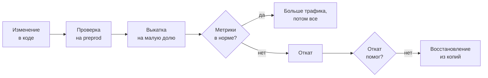
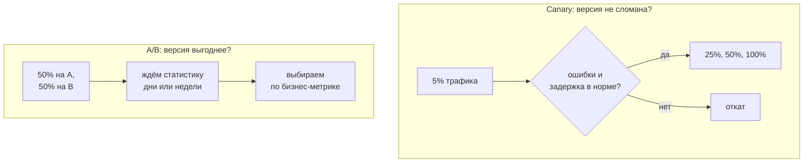
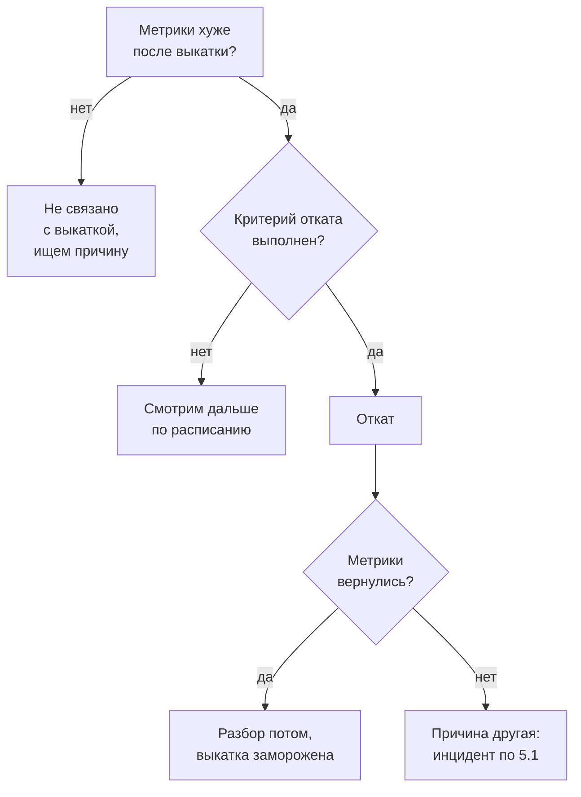

## Зачем это нужно

Пятница, за три дня до распродажи. В очереди на выкатку накопилось много правок: новая оплата, исправления корзины, обновление библиотеки. Менеджер спрашивает: «Можно всё это выкатить сегодня?» Правильный ответ состоит не из слова «да» или «нет», а из вопросов: сколько у нас осталось бюджета ошибок, как быстро мы заметим плохую версию и как быстро вернём старую.

Большинство серьёзных сбоев начинается с изменения: выкатка, правка конфига, миграция. Сам код пишут быстро, а вот уверенность, что изменение безопасно, и умение отыграть его назад берутся из заранее продуманных приёмов. Урок про эти приёмы: как выкатывать небольшими кусками, как решать об откате по цифрам, а не по настроению, и что делать, если сломалось так, что откат не помогает и нужно восстанавливаться из копий.

Шаг проекта: в `~/monitoring-lab/05-reliability/04-release` лежат скрипты «плохой выкатки» и отката с отметками на графиках Grafana, `check-release.sh` с критерием отката, `budget.sh` с расчётом расхода бюджета ошибок и `dr.md`, где для каждого компонента «Магазина» записаны цели RPO и RTO.

## Что нужно знать

- SLI, SLO и бюджет ошибок: [урок 1.2](../01-basics/02-sli-slo.md). Золотые сигналы: [урок 1.1](../01-basics/01-signals.md).
- Дашборды, аннотации и скрипт `orders.sh`: [урок 3.1](../03-dashboards-alerts/01-grafana.md). Алерты на сгорание бюджета: [урок 3.2](../03-dashboards-alerts/02-alerts.md).
- Логи и трейсы с общим `trace_id`: [тема 4](../04-logs-traces/index.md).
- Инцидент и его участники: [урок 5.1](01-incidents.md). Паттерны надёжности, в том числе повторы оплаты и таймауты: [урок 5.3](03-patterns.md).
- Стенд с профилем `monitoring` запущен, `docker compose`, `curl`, `jq`: [load-tester, урок 5.3](../../load-tester/05-docker/03-compose-shop.md).

## Картина целиком

Представь, что ты меняешь колесо на ходу автобуса. Можно остановить автобус, сделать работу и ехать дальше, а можно придумать способ, при котором пассажиры ничего не заметят. SRE выбирает второе, но не из геройства: любое изменение это шанс сломать, и этот шанс нужно делать маленьким, заметным и обратимым.

Поэтому у каждого изменения есть точки остановки: проверка до выкатки, небольшая доля трафика, наблюдение по метрикам, кнопка «назад». Если вся цепочка не помогла и данные потеряны, остаётся запасной план: копии и восстановление.



Читай схему слева направо: до продакшена изменение проходит проверку (тесты и preprod, подробно ниже), потом его пускают на малую долю трафика и сверяют метрики. Плохое отправляется на откат, а если откат не лечит (например, испорчены данные), включается аварийное восстановление.

## Теория

### Частые маленькие релизы безопаснее больших

Допустим, в пятницу выкатываешь сразу сорок изменений, и покупатели начинают получать ошибки. Какое из сорока виновато? Ты не знаешь. Можно откатить все, но тогда пропадут и хорошие. Можно искать делением пополам: откатить половину, проверить, откатить половину оставшегося. Для сорока изменений это около шести заходов (два в шестой степени уже больше сорока), и каждый заход занимает выкатку, ожидание и просмотр графиков. Если выкатывать каждое изменение отдельно, виновный известен сразу: это то, что поехало последним.

В этом и смысл правила «выкатывай часто и понемногу» (small batch). Маленькое изменение проще понять, проще проверить, проще откатить, а вред от него ограничен. Большой релиз накапливает риск, как накопившиеся долги: чем дольше копишь, тем больнее платить.

> **Прикинь сам:** релиз раз в месяц ломается в одном случае из пяти. Релиз каждый день ломается раз в тридцать. Что полезнее для бюджета ошибок: реже, но большими, или чаще, но маленькими?
{: .predict}

Обычно второе: каждая поломка маленькой выкатки короче и дешевле. Но это работает только при двух условиях: выкатка автоматизирована (иначе люди устают) и откат быстрый (иначе частота не помогает).

Осторожно: «частые релизы» не значит «выкатывать без проверки». Частота хороша ровно настолько, насколько надёжны проверка и откат.

> **Главное:** малое изменение легко найти и отменить, поэтому частые маленькие выкатки в сумме надёжнее редких больших.
{: .key}

Откуда берётся уверенность, что выкатывать вообще можно? Из бюджета ошибок.

### Бюджет ошибок и политика: что делать, когда он кончился

Бюджет ошибок ты уже считал в [уроке 1.2](../01-basics/02-sli-slo.md): при SLO 99% за 30 дней можно «потратить» 1% времени, это 43 200 минут на 1%, то есть 432 минуты полной недоступности. Бюджет это разрешение на риск, а не наказание. Пока он есть, команда выкатывает смело. Когда он тает, нужно договорённое заранее правило, что делать. Такое правило называют **политикой бюджета ошибок** (error budget policy).

Хорошая политика короткая и записана до того, как бюджет кончился, потому что в момент кризиса спорить поздно. Пример ступеней (canary в таблице это выкатка сначала на малую долю покупателей, подробно она разобрана ниже):

| Израсходовано | Что делаем |
|---|---|
| меньше 50% | выкатываем как обычно |
| 50-90% | выкатываем только небольшие изменения, каждое с canary, новые фичи ждут |
| 90-100% | замораживаем всё, кроме исправлений надёжности и безопасности |
| больше 100% | заморозка, разбор причин, возвращаемся к релизам, когда бюджет снова есть |

Цифры в таблице пример: свои ступени команда выбирает сама и записывает вместе с владельцем продукта. Пороги зависят от того, как быстро у сервиса тратится бюджет: у быстро горящего сервиса ступени ставят раньше. Важно, что решение принято заранее и одинаково для всех: SRE не «запрещает», а ссылается на правило, которое подписали обе стороны. Burn rate (темп сгорания) и алерты на него разобраны в [уроке 3.2](../03-dashboards-alerts/02-alerts.md) и в [DevOps, уроке 8.11](../../devops/08-observability/11-reliability-patterns-burn-rate.md).

SRE в релизном цикле нужен не как привратник, который говорит «нет», а как человек, который делает безопасный путь простым: помогает с метриками выкатки, критерием отката, автоматикой и разбором, если изменение всё же сломало.

> **Главное:** политика бюджета это заранее согласованное правило «что меняется, когда бюджета мало»; она превращает спор о рисках в договор.
{: .key}

Бюджет можно тратить на разные риски. Посмотрим, как не потратить его весь на одну выкатку.

### Canary и A/B: похожи на вид, разные по цели

**Canary** (канарейка) это выкатка новой версии на малую долю пользователей, с наблюдением. Название пришло от шахтёров: канарейка в клетке первой чувствовала газ. Если метрики новой версии хуже, выкатка останавливается и возвращается назад, пока пострадали единицы. Если лучше или такие же, доля растёт: 5%, 25%, 50%, 100%.

**A/B-тест** (A/B test) тоже делит пользователей на две группы, но цель другая: узнать, какая версия лучше **для бизнеса** (конверсия, средний чек, клики). Тест идёт дни и недели, пока не накопится статистика, а обе версии считаются рабочими. Для SRE разница такая: canary проверяет, что версия **не сломана**, и заканчивается за минуты, A/B проверяет, какая версия **выгоднее**, и это вопрос продукта. Технически в обоих случаях трафик разделяется весами (например, в балансировщике или в service mesh), но смотрят на разные метрики.



Доли 5%, 25%, 50% тоже примерные: долю берут такой, чтобы ошибку новой версии было видно на графике, а задело как можно меньше людей.

Читай обе схемы как две разные истории. Canary заканчивается быстро и отвечает «да, дальше» или «нет, назад». A/B длится долго и отвечает на вопрос не про надёжность.

Есть тонкость, которая часто выручает на собеседовании. На 5% трафика общий график ошибок почти не изменится: сто плохих ответов растворятся в общем потоке. Поэтому метрики канарейки смотрят **отдельно**: ошибки и задержку именно новой версии, а не всего сервиса. Автоматизируют это инструменты вроде Argo Rollouts и Flagger: они сами двигают долю и сами откатывают по метрикам, подробности в [DevOps, уроке 9.6](../../devops/09-secrets-gitops/06-progressive-delivery.md).

А вот что бывает, когда канарейки нет. 19 июля 2024 года компания CrowdStrike выпустила обновление конфигурации для своего агента на Windows сразу на все машины, а в нём была ошибка. Миллионы компьютеров по всему миру зависли с синим экраном. После этого компания сообщила, что вводит постепенную раздачу таких обновлений. Плохая версия на малой доле задела бы единицы, а не всех.

Поиграй с ползунками: посмотри, сколько бюджета съедает плохая версия при выкатке сразу всем и по ступеням.

<div class="viz" data-viz="rel-rollout" data-error="20" data-detect="4" data-title="Плохая выкатка: сразу всем или canary"></div>

На картинке две линии: красная показывает расход бюджета при выкатке сразу всем, синяя при ступенях canary. Пока ты замечаешь беду быстро, ступени экономят бюджет в разы, а при долгом обнаружении линии сближаются: canary дошёл до 100%.

> **Главное:** canary проверяет надёжность и длится минуты, A/B проверяет пользу для бизнеса и длится недели; метрики канарейки смотри отдельно от общих.
{: .key}

Канарейка нашла проблему. Теперь нужна кнопка, которая быстро возвращает всё назад.

### Большая красная кнопка: откат

В хорошей системе у каждого изменения есть **откат** (rollback): заранее проверенное действие, которое возвращает прежнее состояние. SRE называют такую возможность «большая красная кнопка»: нажал и вернулся. Кнопка работает, только если её нажимали до аварии. Откат, который ни разу не пробовали, при пожаре почти наверняка не сработает.

Пример для Kubernetes и Helm (на стенде «Магазин» Kubernetes нет, поэтому эти команды справочные, запускать их не нужно). Helm это менеджер пакетов для Kubernetes: он ставит приложение как «релиз» с номером ревизии. Kubernetes и Helm подробно разобраны в курсе DevOps.

```bash
# выкатка, которая откатится сама, если не станет здоровой за 5 минут
helm upgrade --install shop ./chart --namespace shop --atomic --timeout 5m
# история ревизий релиза
helm history shop --namespace shop
# вернуть предыдущую ревизию (0 значит «предыдущая»)
helm rollback shop 0 --namespace shop --wait
```

Первая команда ставит новую версию. Флаг `--atomic` говорит Helm: если за `--timeout` приложение не стало готовым, откати само (в Helm 4 тот же смысл у флага `--rollback-on-failure`, подробнее в [DevOps, уроке 5.9](../../devops/05-kubernetes/09-helm.md)). Вторая показывает ревизии, третья возвращает прошлую. Откат вручную обычно оформляют кнопкой в CI, чтобы не вспоминать команды ночью:

```yaml
rollback:
  stage: deploy
  when: manual
  script:
    - helm rollback shop 0 --namespace shop --wait
```

Слово `when: manual` в GitLab CI превращает шаг в кнопку, которую нажимает человек. Её не должно быть сложно найти: ссылка на неё лежит в runbook.

Как Kubernetes понимает, что новая версия «здоровая»? По **пробам** (probe). Проба `readiness` отвечает на вопрос «готов ли под принимать трафик»: если нет, Kubernetes убирает под из балансировки, и запросы идут на остальные. Проба `liveness` отвечает «жив ли процесс»: если нет, под перезапускают. Не путай их: перезапуск по `liveness` не лечит перегрузку, а убирание по `readiness` как раз её смягчает. При выкатке `readiness` ещё и не пускает трафик на новую версию, пока она не запустилась. Подробности и YAML: [DevOps, урок 5.7](../../devops/05-kubernetes/07-probes-resources-rollouts.md).

> **Главное:** откат должен быть заранее придуман и проверен; `--atomic` откатывает неудачный запуск, `helm rollback` возвращает любую прошлую ревизию, а `readiness` не пускает трафик на неготовую версию.
{: .key}

Кнопка есть. Но когда её нажимать?

### Решение об откате: по каким признакам

Решение об откате принимают по заранее записанному критерию. Без него в момент проблемы начинается спор: «может, само пройдёт», «давайте ещё пять минут». Пока спорят, идёт расход бюджета. Хороший критерий короткий, измеримый и привязан к симптомам покупателя: «доля 5xx выше 2% три минуты подряд или p95 оформления заказа выше 1 секунды». Признаки, которые стоит учитывать:

- метрики **после** выкатки хуже, чем **до** (сравниваем с тем, что было минуты назад, а не с абстрактной нормой);
- ухудшение началось сразу после отметки выкатки на графике, а не раньше;
- ошибки в логах содержат то, что менялось (новый путь кода, новая зависимость);
- проблема растёт или стоит на месте: ухудшающийся сбой требует решения раньше, чем стабильный.

Когда откат не нужен? Если проблема не связана с выкаткой (на графике видно, что она началась до неё) или ты знаешь исправление и оно быстрее отката. Но по умолчанию, если сомневаешься и изменение свежее, откатывай: откат дёшев, расследование потом.

Есть и обратная сторона: откат тоже изменение. 1 августа 2012 года брокер Knight Capital выкатил новую версию торгового ПО, но на одном из восьми серверов старый код остался. Этот сервер начал отправлять лишние заказы, и компания потеряла около 440 миллионов долларов за 45 минут. Инженеры, пытаясь остановить, откатили новый код на остальных серверах, и это только ухудшило положение: старое поведение теперь работало на всех. Урок: откат должен быть проверен так же, как выкатка, а полное состояние всех машин нужно знать до того, как нажимаешь.



Схему читай сверху вниз как вопросы дежурному. Если критерий выполнен, откатываем без споров, а если откат не помог, значит, дело не в выкатке и дальше идёт обычный инцидент из [урока 5.1](01-incidents.md).

> **Главное:** критерий отката пишут заранее и по симптомам покупателя; сомневаешься и изменение свежее: откатывай, разбираться будешь после.
{: .key}

Часть таких решений можно доверить машине.

### Автоматизируем то, что предсказуемо

Человек в три часа ночи медленнее и ошибается чаще. Поэтому всё, что случается регулярно и лечится одинаково, отдают автоматике:

- упавший процесс перезапускает Kubernetes или systemd;
- неготовый под убирается из балансировки по `readiness`;
- нагрузку подхватывает автомасштабирование: HPA добавляет копии приложения, VPA подбирает ему CPU и память (разбор в [DevOps, уроке 5.11](../../devops/05-kubernetes/11-scaling-hpa.md));
- неудачная выкатка откатывается сама по `--atomic` или по метрикам канарейки;
- при алерте автоматически создаётся задача, канал в мессенджере и приходит ссылка на runbook.

Последний пункт часто забывают: автоматика инцидент-менеджмента (завести канал, позвать дежурного, подставить шаблон статуса) экономит первые минуты, когда они дороже всего. Разумеется, автоматику ограничивают: она должна иметь предохранитель, например, не перезапускать сервис чаще раза в несколько минут, иначе при неправильной причине она устроит шторм сама. И автоматику нужно мониторить: её срабатывания это тоже события, которые видны на графике.

> **Главное:** автоматизируй предсказуемое и повторяющееся, ставь предохранители и следи за самой автоматикой.
{: .key}

Ещё лучше поймать проблему до продакшена.

### Проверка до продакшена: preprod, хаос и game day

**Preprod** (предпродакшен) это окружение, похожее на боевое, где изменение проходит интеграционные проверки: сервисы работают вместе, как у покупателей. Польза от preprod настоящая, только если он похож на продакшен: те же версии, сопоставимый объём данных и **похожий трафик**. Проверка на пустой базе с одним запросом в минуту не покажет ни пул соединений, ни медленный запрос, ни шторм повторов. Нагрузку на preprod проигрывают, например, повторяя записанный боевой трафик или генератором ([load-tester](../../load-tester/index.md)).

**Хаос-тестирование** (chaos engineering) идёт дальше: ты намеренно ломаешь части системы и смотришь, держится ли она так, как ты предполагал. Убиваешь под, добавляешь задержку в сеть, отключаешь зависимость. Для Kubernetes такие эксперименты описывают и запускают специальные инструменты, например Litmus и Chaos Mesh. Начинают на preprod с маленьким радиусом поражения и записанной гипотезой «если убить один под оплаты, доля ошибок не превысит 1%».

**Game day** (игровой день) это учения: команда собирается, ей заранее готовят сбой (или включают его неожиданно, но в безопасных рамках), и она отрабатывает реакцию: алерт, дежурный, откат, связь, статус. Цель не в оценке людей, а в поиске дыр: алерт молчит, runbook устарел, у дежурного нет доступа. Типичные виды проверяемых сбоев: отказ компонента, отказ зависимости, перегрузка и потеря связи между площадками.

> **Главное:** preprod работает, только если похож на продакшен; хаос-тесты проверяют гипотезы об устойчивости; game day проверяет людей и инструкции.
{: .key}

Всё это сокращает риск, но не убирает. Остаётся сценарий, когда ломается сама основа, и данные нужно вернуть.

### Аварийное восстановление: RTO и RPO

**Аварийное восстановление** (disaster recovery, DR) это план, как вернуть сервис, если потеряно то, что откатом не лечится: база, площадка, весь кластер. У плана две цели.

**RPO** (recovery point objective) отвечает на вопрос «сколько данных мы готовы потерять», измеряется во времени: RPO 15 минут значит, что можно потерять записи последних 15 минут. Если копии делаются раз в час, то в худшем случае (авария прямо перед следующей копией) потеряется почти час.

**RTO** (recovery time objective) отвечает «сколько мы готовы быть недоступными»: RTO 45 минут значит, что сервис должен вернуться не позже, чем через 45 минут после начала аварии. В RTO входит всё: заметить, собрать людей, найти копию, восстановить, проверить, переключить трафик, а не только команда восстановления.

Не путай RPO и RTO с SLA и SLO: SLO это цель доступности в целом, а RPO и RTO это цели для конкретной аварии.

<div class="viz" data-viz="rel-dr" data-interval="60" data-restore="8" data-rpo="15" data-rto="45" data-title="RPO и RTO на одной линии времени"></div>

На линии слева данные между последней копией и аварией, они потеряны, и это RPO. Справа этапы простоя, и это RTO. Видно, что сама команда восстановления занимает малую часть, а остальное это обнаружение, сбор людей и проверка.

Полный разбор копий, WAL (журнала изменений базы) и проверки восстановлением ты найдёшь в [DevOps, уроке 10.3](../../devops/10-capstone/03-backup-dr-capacity.md).

> **Главное:** RPO это сколько данных можно потерять, RTO сколько времени можно не работать; оба считаются по худшему случаю и включают всё, а не одну команду.
{: .key}

Осталось понять, из чего складывается план.

### Копии, запасные пулы и запасные каналы

Хороший план опирается на то, что лежит **отдельно** от основной системы:

- **Копии данных**: дампы и физические копии базы вне того сервера, который копируют. 31 января 2017 года у GitLab при ручной работе удалили данные на основной базе. По их разбору, из нескольких способов копирования ни один не оказался рабочим, и восстанавливались с копии, которой было около шести часов. Копия, из которой ни разу не восстанавливались, это не копия, а надежда.
- **Копии кода и документации**: репозиторий, инфраструктура как код, runbook и схемы должны быть доступны, даже если недоступна ваша площадка. Если инструкция по восстановлению лежит на самом упавшем сервисе, она бесполезна.
- **Несколько пулов узлов**: приложение работает на нескольких группах серверов (в Kubernetes это пулы узлов, в разных зонах), чтобы потеря одной группы не останавливала сервис.
- **Резервные каналы связи**: если основной мессенджер или почта лежат вместе с аварией, команде нужен запасной способ связаться (другой мессенджер, телефонный список).

И главное: **план проверяют**. Восстановление из копий и переключение на запасной канал связи полезно репетировать хотя бы раз в квартал: такие учения находят сломанные копии, устаревшие инструкции и недоступные пароли, пока нет настоящей аварии. Отличие плана аварийного восстановления (DRP) от обычной инструкции: DRP описывает самые тяжёлые сценарии (потеряна площадка, данные), у него есть цели RPO и RTO, роли и проверки, а инструкция на одно действие отвечает на узкий сбой.

> **Проверь понимание:** у «Магазина» заказы лежат в Postgres, корзины в Redis без тома, дашборды Grafana в git. Для какого из компонентов вы бы назначили самый жёсткий RPO?
{: .predict}

Для Postgres: потерянные заказы это деньги покупателей. Корзину в Redis можно потерять, покупатель соберёт её заново, а дашборды восстановятся из git. Именно так появляется таблица целей: у каждого компонента свои RPO и RTO.

> **Главное:** копии и инструкции хранят отдельно от основной системы, а план проверяют регулярно, иначе он не план.
{: .key}

<details markdown="1">
<summary>Для любопытных: чем частые копии дороже</summary>

Чем меньше RPO, тем чаще копии и тем больше нагрузка и места. RPO минуты требует не периодических дампов, а потока журнала изменений (WAL) в другое место: это сложнее и дороже. Поэтому цель RPO ставят по цене потери для бизнеса, а не по принципу «чем меньше, тем лучше». Подробности про физические копии и восстановление на момент времени: [DevOps, урок 9.5](../../devops/09-secrets-gitops/05-cnpg.md).

</details>

## Практика

Всё идёт на стенде «Магазин» с профилем `monitoring`. Числа в выводе ниже пример: у тебя они будут другими, важна форма картины. «Плохая выкатка» на стенде это новая версия оплаты, которая отвечает медленнее и с отказами: на лету это включается через `/admin/config` ([урок 3.1](../03-dashboards-alerts/01-grafana.md)).

### 1. Папка, скрипты выката и отката

Заведи папку и два скрипта. Каждый делает две вещи: меняет поведение оплаты и ставит на дашборд Grafana аннотацию (отметку на графиках, что здесь произошло изменение).

```bash
mkdir -p ~/monitoring-lab/05-reliability/04-release && cd ~/monitoring-lab/05-reliability/04-release
cat > release.sh <<'EOF'
#!/usr/bin/env bash
# release.sh: «выкатка payment v2»: оплата медленнее и с отказами, плюс отметка в Grafana
set -eu
curl -fsS -X POST localhost:8001/admin/config -H 'Content-Type: application/json' \
  -d '{"delay_ms":300,"fail_rate":0.6}'
echo
curl -fsS -X POST localhost:3000/api/annotations -H 'Content-Type: application/json' \
  -d "{\"dashboardUID\":\"shop-overview\",\"time\":$(date +%s)000,\"tags\":[\"deploy\"],\"text\":\"выкатка payment v2\"}"
echo
date +%s > .release-at
EOF
cat > rollback.sh <<'EOF'
#!/usr/bin/env bash
# rollback.sh: откат на payment v1: прежние задержка и доля отказов, плюс отметка в Grafana
set -eu
curl -fsS -X POST localhost:8001/admin/config -H 'Content-Type: application/json' \
  -d '{"delay_ms":50,"fail_rate":0}'
echo
curl -fsS -X POST localhost:3000/api/annotations -H 'Content-Type: application/json' \
  -d "{\"dashboardUID\":\"shop-overview\",\"time\":$(date +%s)000,\"tags\":[\"deploy\"],\"text\":\"откат payment v2\"}"
echo
date +%s > .rollback-at
EOF
chmod +x release.sh rollback.sh
```

Скрипты пишутся через `cat > файл <<'EOF'`: всё до строки `EOF` попадает в файл без подстановок, поэтому `$(date +%s)000` вычислится при запуске, а не сейчас. `date +%s` это текущее время в секундах, добавленные `000` делают из него миллисекунды, которые ждёт Grafana. `-fsS` заставляет `curl` вернуть ошибку при ответе 4xx и 5xx и показать её. Запись в `.release-at` понадобится для расчёта бюджета.

**Что должно получиться:** скрипты лежат в папке и исполняемые.

```text
release.sh  rollback.sh
```

**Типичные ошибки:**
- `curl: (22) The requested URL returned error: 401` при вызове Grafana: Grafana на стенде открыта без пароля, поэтому проверь, что отвечает именно она: `curl -s localhost:3000/api/health`.
- Отметка не видна на графиках: в настройках дашборда (Settings, Annotations) должен быть включён встроенный запрос «Annotations & Alerts», он показывает отметки этого дашборда. Скрипт ставит `dashboardUID:"shop-overview"`, поэтому отметки видно только на дашборде «Магазин: обзор (эталон)».

### 2. Базовая линия: покупатели и спокойные графики

Открой дашборд «Магазин: обзор (эталон)» на `http://localhost:3000`, период Last 15 minutes, обновление 5 секунд. Запусти восьмёрых «покупателей» из [урока 3.1](../03-dashboards-alerts/01-grafana.md) на 12 минут и убедись, что оплата в норме:

```bash
ORD=~/monitoring-lab/03-dashboards-alerts/orders.sh
for i in 1 2 3 4 5 6 7 8; do $ORD "$i" 720 & done
curl -s -X POST localhost:8001/admin/config -H 'Content-Type: application/json' -d '{"delay_ms":50,"fail_rate":0}'
```

Первая строка запоминает путь к скрипту, вторая запускает восемь копий в фоне, третья выставляет «нормальную» оплату (50 мс, без отказов), чтобы начать с чистого листа. Подожди три минуты и запиши в заметки базовую линию: долю 5xx, p95 заказа, число запросов в секунду.

**Что должно получиться** (пример):

```text
{"delay_ms":50.0,"fail_rate":0.0}
```

Дашборд: 5xx около нуля, p95 заказов в десятках или сотнях миллисекунд, запросов в секунду много (в моём примере около 60).

### 3. Плохая выкатка: читаем графики до и после

Через три минуты после старта покупателей «выкати» новую версию оплаты:

```bash
cd ~/monitoring-lab/05-reliability/04-release
./release.sh
```

Скрипт включает медленную и отказывающую оплату (300 мс и 60% отказов выбраны с запасом, чтобы критерий отката ниже точно сработал) и ставит на графики отметку «выкатка payment v2». Смотри дашборд: линия отметки пересекает все графики, и по обе стороны от неё видно «до» и «после». Это главный приём разбора выкатки: не «что-то стало плохо», а «ровно после отметки стало плохо».

Вот как выглядит такая выкатка на панелях (пример, данные подобраны под расчёт ниже). Сначала доля ответов 5xx:

<div class="viz" data-viz="mon-panel" data-title="Доля ответов 5xx" data-query="100 * sum(rate(http_requests_total{status=~&quot;5..&quot;}[1m])) / sum(rate(http_requests_total[1m]))" data-x='["14:00","14:01","14:02","14:03","14:04","14:05","14:06","14:07","14:08","14:09","14:10","14:11","14:12","14:13","14:14","14:15"]' data-series='[{"name":"5xx, %","values":[0.1,0.2,0.1,0.1,0.2,0.1,0.1,6.2,6.8,6.4,6.6,6.5,1.8,0.2,0.1,0.1],"color":"red"}]' data-unit="%" data-thresholds='[{"value":2,"color":"red","label":"порог отката 2%"}]' data-annotations='[{"at":"14:06","text":"выкатка payment v2"},{"at":"14:11","text":"откат"}]' data-explain="Доля 5xx была около нуля и скачком выросла после отметки выкатки. После отката она за минуту-две вернулась в норму." data-try="Наведи курсор на 14:08 и сравни со значением на 14:05."></div>

График показывает чёткую границу: до отметки ошибок почти нет, сразу после неё доля 5xx около 6,5%. Выше порога 2% она держится с 14:07 до отката. Такой скачок сразу за отметкой выкатки почти всегда виновата сама выкатка.

Теперь задержка заказа:

<div class="viz" data-viz="mon-panel" data-title="p95 POST /api/orders" data-query="histogram_quantile(0.95, sum by (le) (rate(http_request_duration_seconds_bucket{route=&quot;/api/orders&quot;,method=&quot;POST&quot;}[1m])))" data-x='["14:00","14:01","14:02","14:03","14:04","14:05","14:06","14:07","14:08","14:09","14:10","14:11","14:12","14:13","14:14","14:15"]' data-series='[{"name":"p95, с","values":[0.12,0.13,0.12,0.12,0.13,0.12,0.12,1.5,1.7,1.6,1.7,1.6,0.6,0.14,0.12,0.12],"color":"orange"}]' data-unit="s" data-thresholds='[{"value":1,"color":"red","label":"порог отката 1 с"}]' data-annotations='[{"at":"14:06","text":"выкатка payment v2"},{"at":"14:11","text":"откат"}]' data-explain="Медленная оплата с повторами растягивает заказ: он держит соединение с базой и ждёт ответа оплаты." data-try="Найди момент, где p95 впервые выше красной линии."></div>

Заказ стал дольше секунды: оплата отвечает по 300 мс, при отказе магазин повторяет её до четырёх раз без паузы, а заказ в это время держит соединение пула. Покупатели занимают пять соединений, и остальные ждут. Это ровно то, что ты видел в уроке 3.1, только теперь вызвано выкаткой, а не вручную включённой поломкой.

Сводка до и после на панелях Stat:

<div class="viz" data-viz="mon-stat" data-title="Магазин во время выкатки v2" data-stats='[{"title":"Ответы 5xx","value":6.5,"unit":"%","color":"red","spark":[0.1,0.1,0.2,6.2,6.8,6.4,6.6,6.5],"sub":"до выкатки 0,1%"},{"title":"p95 заказа","value":1.6,"unit":"s","color":"red","spark":[0.12,0.12,0.13,1.5,1.7,1.6,1.7,1.6],"sub":"до выкатки 0,12 с"},{"title":"Запросов в секунду","value":16,"unit":"req/s","color":"orange","spark":[62,61,63,20,16,15,16,16],"sub":"до выкатки 62"},{"title":"Ждут соединение","value":3,"unit":"","color":"orange","spark":[0,0,0,2,3,3,3,3],"sub":"до выкатки 0"}]' data-explain="Четыре сигнала сразу: ошибки, задержка, пропускная способность и очередь за соединением." data-try="Сравни значение карточки с подписью под ним."></div>

Плохая выкатка видна сразу по всем золотым сигналам: растут ошибки и задержка, падает число запросов (пул занят ожиданием), появляется очередь. Если у тебя на дашборде меняется один из четырёх, а остальные нет, причина скорее в чём-то другом.

Теперь загляни в логи ошибок заказов. В Explore, источник Loki:

<div class="viz" data-viz="mon-logs" data-title="Explore: Loki" data-query="{service=&quot;shop&quot;} | json | route=&quot;/api/orders&quot; | status=&quot;502&quot;" data-highlight="payment failed" data-explain="Заказы, которые закончились ошибкой 502: магазин исчерпал повторы оплаты. У каждой строки есть trace_id." data-try="Раскрой строку кликом и найди поле trace_id: по нему открывается трейс." data-lines='[{"ts":"2026-10-04 14:09:41.903","level":"error","labels":{"service":"shop","container":"shop-shop-1","level":"ERROR"},"line":"{\"ts\": \"2026-10-04T11:09:41.903511+00:00\", \"level\": \"ERROR\", \"msg\": \"Запрос завершён\", \"method\": \"POST\", \"route\": \"/api/orders\", \"path\": \"/api/orders\", \"status\": 502, \"duration_ms\": 1632.4, \"request_id\": \"d0d332779f54ce74ff94965b3d0f5bf0\", \"trace_id\": \"d83a52f0e17b49c6a0b5c2e91f7d4a36\", \"user_id\": 3, \"error\": \"payment failed\"}"},{"ts":"2026-10-04 14:09:38.211","level":"error","labels":{"service":"shop","container":"shop-shop-1","level":"ERROR"},"line":"{\"ts\": \"2026-10-04T11:09:38.211087+00:00\", \"level\": \"ERROR\", \"msg\": \"Запрос завершён\", \"method\": \"POST\", \"route\": \"/api/orders\", \"path\": \"/api/orders\", \"status\": 502, \"duration_ms\": 1587.1, \"request_id\": \"3ade11b0fceb3e015bcf1e04622a74f3\", \"trace_id\": \"4be1f0a7c9d24e6b8a53d1c07e92f6a8\", \"user_id\": 6, \"error\": \"payment failed\"}"},{"ts":"2026-10-04 14:09:33.027","level":"error","labels":{"service":"shop","container":"shop-shop-1","level":"ERROR"},"line":"{\"ts\": \"2026-10-04T11:09:33.027930+00:00\", \"level\": \"ERROR\", \"msg\": \"Запрос завершён\", \"method\": \"POST\", \"route\": \"/api/orders\", \"path\": \"/api/orders\", \"status\": 502, \"duration_ms\": 1701.8, \"request_id\": \"ee2acae9b6dc8200058e4c5a8fbab292\", \"trace_id\": \"a2f1a68a3cf7bab14245ba34e6a348b6\", \"user_id\": 2, \"error\": \"payment failed\"}"}]'></div>

В логах одна и та же причина: «payment failed», то есть оплата отказала на всех повторах. Это подтверждает, что виновата выкатка оплаты, а не база или сеть. Трейс одного такого запроса показывает, куда ушло время:

<div class="viz" data-viz="mon-trace" data-title="Tempo: заказ с четырьмя попытками оплаты" data-trace-id="d83a52f0e17b49c6a0b5c2e91f7d4a36" data-focus="a1" data-explain="Заказ сделал четыре попытки оплаты подряд, каждая закончилась отказом payment, и вернул 502." data-try="Наведи курсор на попытки оплаты и сравни их длительность." data-spans='[{"id":"a1","parent":null,"service":"shop","name":"POST /api/orders","start":0,"dur":1630,"status":"error","attrs":{"http.status_code":502}},{"id":"a2","parent":"a1","service":"shop","name":"db.pool.getconn","start":5,"dur":350,"status":"ok","attrs":{}},{"id":"a3","parent":"a1","service":"shop","name":"SELECT cart_items","start":358,"dur":14,"status":"ok","attrs":{}},{"id":"p1","parent":"a1","service":"shop","name":"POST","start":380,"dur":310,"status":"error","attrs":{"попытка":1}},{"id":"c1","parent":"p1","service":"payment","name":"POST /pay","start":384,"dur":302,"status":"error","attrs":{"http.status_code":500}},{"id":"p2","parent":"a1","service":"shop","name":"POST","start":690,"dur":310,"status":"error","attrs":{"попытка":2}},{"id":"c2","parent":"p2","service":"payment","name":"POST /pay","start":694,"dur":302,"status":"error","attrs":{"http.status_code":500}},{"id":"p3","parent":"a1","service":"shop","name":"POST","start":1000,"dur":310,"status":"error","attrs":{"попытка":3}},{"id":"c3","parent":"p3","service":"payment","name":"POST /pay","start":1004,"dur":302,"status":"error","attrs":{"http.status_code":500}},{"id":"p4","parent":"a1","service":"shop","name":"POST","start":1310,"dur":310,"status":"error","attrs":{"попытка":4}},{"id":"c4","parent":"p4","service":"payment","name":"POST /pay","start":1314,"dur":302,"status":"error","attrs":{"http.status_code":500}}]'></div>

Четыре попытки по 300 мс дают более полутора секунд, и это почти весь заказ. Простая арифметика объясняет и долю ошибок: при отказе оплаты в 60% все четыре попытки провалятся с вероятностью 0,6 в четвёртой степени, это около 13% заказов. А заказы это примерно половина всех запросов, поэтому общая доля 5xx получается около 6,5%.

**Как читать вывод:** сначала смотри на отметку выкатки и сравнивай «до» и «после» по четырём сигналам, потом логи: одна ли причина, потом трейс: где время.

**Типичные ошибки:**
- Графики не изменились: оплата не переключилась. Проверь `curl -s localhost:8001/admin/config`: должно быть `{"delay_ms":300.0,"fail_rate":0.6}`.
- Ошибок меньше расчётных: слишком мало покупателей или период 1 минута шумит. Оставь 8 копий `orders.sh` и смотри окно в 5 минут.

### 4. Критерий отката: скрипт check-release.sh

Критерий из теории превратим в проверку, которая сама спрашивает Prometheus стенда (`localhost:9090`):

```bash
cat > check-release.sh <<'EOF'
#!/usr/bin/env bash
# check-release.sh: критерий отката: 5xx выше 2% три минуты подряд или p95 заказа выше 1 с
PROM=${PROM:-http://localhost:9090}
q() { curl -fsS "$PROM/api/v1/query" --data-urlencode "query=$1" | jq -r '.data.result[0].value[1] // "0"'; }
ERR='100 * sum(rate(http_requests_total{status=~"5.."}[1m])) / sum(rate(http_requests_total[1m]))'
P95='histogram_quantile(0.95, sum by (le) (rate(http_request_duration_seconds_bucket{route="/api/orders",method="POST"}[1m])))'
err=$(q "min_over_time(($ERR)[3m:15s])")
p95=$(q "min_over_time(($P95)[3m:15s])")
if awk -v e="$err" -v p="$p95" 'BEGIN { exit !(e > 2 || p > 1) }'; then
  echo "ОТКАТ: 5xx $err% (порог 2), p95 заказа $p95 с (порог 1)"
else
  echo "ЖДЁМ: 5xx $err%, p95 заказа $p95 с"
fi
EOF
chmod +x check-release.sh
while true; do ./check-release.sh; sleep 15; done
```

Скрипт разобран по частям. Функция `q` посылает запрос PromQL в API и достаёт число через `jq` (`// "0"` подставляет ноль, если ответ пуст). `min_over_time((...)[3m:15s])` берёт значение выражения каждые 15 секунд за последние три минуты и выбирает самое маленькое: если даже оно выше порога, значит условие держится все три минуты подряд. `awk` сравнивает числа, потому что `bash` дробные не сравнивает. Цикл в конце печатает вердикт каждые 15 секунд, остановить его можно `Ctrl+C`.

**Что должно получиться** (пример, вывод по ходу выкатки):

```text
ЖДЁМ: 5xx 0.12%, p95 заказа 0.13 с
ЖДЁМ: 5xx 0.12%, p95 заказа 0.13 с
ЖДЁМ: 5xx 2.4%, p95 заказа 0.9 с
ОТКАТ: 5xx 4.8%, p95 заказа 1.4 с
```

**Как читать вывод:** пока строка начинается с «ЖДЁМ», критерий не выполнен. Первая строка «ОТКАТ» это момент, когда по твоему правилу пора откатывать. Заметь задержку: из-за окна в три минуты скрипт срабатывает не сразу после выкатки, а на несколько минут позже. Это цена защиты от ложных тревог, и именно её видно на графике «жизни алерта».

<div class="viz" data-viz="mon-alert" data-title="Жизнь алерта ShopReleaseErrors" data-name="ShopReleaseErrors" data-x='["14:00","14:01","14:02","14:03","14:04","14:05","14:06","14:07","14:08","14:09","14:10","14:11","14:12","14:13","14:14","14:15"]' data-values='[0.1,0.2,0.1,0.1,0.2,0.1,0.1,6.2,6.8,6.4,6.6,6.5,1.8,0.2,0.1,0.1]' data-unit="%" data-threshold="2" data-for="3" data-explain="Условие выполнилось в 14:07, но алерт ждёт три точки подряд: сначала pending, потом firing. После отката условие перестаёт выполняться, и алерт гаснет." data-try="Сравни момент, когда началась беда, с моментом, когда алерт загорелся."></div>

Сначала алерт ждёт (pending), потому что одна плохая точка может быть случайной, и только после трёх подряд он загорается. Это три минуты, которые ты платишь за уверенность, поэтому для критических выкаток окно выбирают короче, а для шумных метрик длиннее.

**Типичные ошибки:**
- Всегда `ЖДЁМ` с нулями: нет трафика или в `route` другое значение. Проверь `curl -s localhost:9090/api/v1/label/route/values | jq`.
- `NaN` в выводе: за окно не было запросов, доля делит ноль на ноль. Запусти покупателей.

### 5. Откат и расход бюджета ошибок

Как только скрипт напечатает «ОТКАТ», откати:

```bash
./rollback.sh
```

Скрипт возвращает оплату в норму и ставит на графики отметку «откат payment v2». Через минуту-две доля 5xx и p95 на дашборде вернутся к базовой линии. Проверь, что оплата в норме: `curl -s localhost:8001/admin/config` покажет `{"delay_ms":50.0,"fail_rate":0.0}`.

Теперь посчитаем, сколько бюджета выкатка съела. Допустим SLO 99% за 30 дней, то есть 432 минуты. Формула: расход в процентах равен доле ошибок в процентах, умноженной на минуты и делённой на 432. Скрипт берёт отметки времени выкатки и отката, спрашивает у Prometheus число ошибок и запросов за это окно и считает:

```bash
cat > budget.sh <<'EOF'
#!/usr/bin/env bash
# budget.sh: сколько месячного бюджета ошибок (SLO 99%, 30 дней = 432 минуты) съела выкатка
set -eu
PROM=${PROM:-http://localhost:9090}
START=$(cat .release-at); END=$(cat .rollback-at); SECS=$((END - START))
q() { curl -fsS "$PROM/api/v1/query" --data-urlencode "query=$1" --data-urlencode "time=$END" | jq -r '.data.result[0].value[1] // "0"'; }
bad=$(q "sum(increase(http_requests_total{status=~\"5..\"}[${SECS}s]))")
all=$(q "sum(increase(http_requests_total[${SECS}s]))")
awk -v b="$bad" -v a="$all" -v s="$SECS" 'BEGIN { r = a > 0 ? b / a * 100 : 0; m = s / 60;
  printf "ошибок %.0f из %.0f запросов: %.2f%%, минут %.1f, бюджета %.3f%%\n", b, a, r, m, r * m / 432 }'
EOF
chmod +x budget.sh
./budget.sh
```

Скрипт читает моменты выкатки и отката из файлов, спрашивает Prometheus на момент отката (`time=$END`), сколько ошибок и запросов было за окно (`increase` считает прирост счётчика), и применяет формулу.

**Что должно получиться** (пример):

```text
ошибок 322 из 4960 запросов: 6.49%, минут 5.2, бюджета 0.078%
```

**Как читать вывод:** доля 6,49% при длительности 5,2 минуты дала 0,078% месячного бюджета, то есть мелочь. Но если бы выкатку заметили через 30 минут, было бы около 0,45%, а ночью без алерта за 8 часов около 7,2%. Тот же темп сгорания 6,5 раза быстрее нормы выедает весь месячный бюджет примерно за 4,6 суток. Вывод для SRE: короткий заметный сбой дёшев, дорог незамеченный долгий.

<div class="viz" data-viz="mon-table" data-title="Расход бюджета ошибок (SLO 99%, 30 дней)" data-query="доля ошибок × минуты / 432 × 100" data-columns='["Сценарий","Доля ошибок","Минут","Расход бюджета"]' data-rows='[["Откат по критерию","6,5%","5","0,075%"],["Заметили через 30 минут","6,5%","30","0,45%"],["Ночью, без алерта, 8 часов","6,5%","480","7,2%"]]' data-highlight-col="3" data-explain="Тот же сбой с той же долей ошибок стоит бюджета по-разному в зависимости от того, как быстро его заметили." data-try="Сравни первую и последнюю строки: во сколько раз они отличаются."></div>

Во сколько раз отличаются строки, видно сразу: время обнаружения важнее самой силы сбоя, поэтому и нужен критерий отката и алерт на симптом.

**Типичные ошибки:**
- `cat: .release-at: No such file or directory`: ты запускал `release.sh` из другой папки. Выполняй скрипты в `04-release`.
- Бюджет заметно отличается от примера: у тебя другой трафик. Сверь формулу на своих числах: `доля × минуты / 432`.

### 6. Мини-учения по восстановлению: шаг проекта

Проверим, что копия базы «Магазина» не просто есть, а восстанавливается, и замерим время. Восстанавливаем не поверх рабочей базы, а в отдельную `shop_drill`:

```bash
cd ~/learning/load-tester/project/shop
START=$(date +%s)
docker compose exec -T postgres pg_dump -U shop -Fc shop > ~/monitoring-lab/05-reliability/04-release/shop.dump
docker compose exec -T postgres psql -U shop -d postgres -c 'DROP DATABASE IF EXISTS shop_drill' -c 'CREATE DATABASE shop_drill'
docker compose exec -T postgres pg_restore -U shop -d shop_drill --no-owner < ~/monitoring-lab/05-reliability/04-release/shop.dump
docker compose exec -T postgres psql -U shop -d shop_drill -tAc 'SELECT count(*) FROM orders'
echo "прошло $(( $(date +%s) - START )) с"
```

Первая команда выгружает базу в сжатый файл (`-Fc` это формат custom, из него можно восстанавливать выборочно). Вторая создаёт пустую учебную базу. Третья восстанавливает дамп в неё. Четвёртая считает заказы в восстановленной базе, чтобы убедиться, что данные на месте, а не просто команда не упала. Последняя печатает время. Параметр `-T` нужен, чтобы `docker compose exec` работал с перенаправлением ввода и вывода.

**Что должно получиться** (пример, число заказов у тебя другое):

```text
DROP DATABASE
CREATE DATABASE
2318
прошло 4 с
```

**Как читать вывод:** число строк в `orders` должно совпасть с числом в рабочей базе на момент дампа (`SELECT count(*) FROM orders` в базе `shop`). Это и есть проверка «копия читается». Время на маленьком стенде мало, на настоящей базе оно будет часами: именно его измеряют, чтобы честно записать RTO.

Теперь запиши план в `dr.md` в той же папке: таблицу целей для компонентов «Магазина». Пример заполнения:

| Компонент | Что хранит | RPO | RTO | Откуда восстанавливаем |
|---|---|---|---|---|
| Postgres | заказы, товары, пользователи | 15 мин | 45 мин | дамп и журнал изменений |
| Redis | корзины, без тома | не гарантируем | 5 мин | запускаем пустой |
| Grafana | дашборды, алерты | 0 | 30 мин | файлы в git |
| Prometheus | метрики за 15 дней | сутки | 2 ч | пустая база, история потеряна |

Заполни цели сам и объясни каждую строку одной фразой: что потеряет покупатель, если ты потеряешь этот компонент. Допиши в `dr.md` три строки: где лежит этот файл вне стенда, кто проверяет план и когда следующая проверка (раз в квартал).

> Если пользуешься нейросетью для заполнения таблицы, проверь, что цели реалистичны: ИИ любит ставить RPO в ноль, не спрашивая о цене.
{: .ai}

**Типичные ошибки:**
- `service "postgres" is not running`: стенд не запущен или ты не в папке стенда. Перейди в `~/learning/load-tester/project/shop` и проверь `docker compose ps`.
- `pg_restore: error: ... already exists`: учебная база уже была и в ней остались объекты. Команда `DROP DATABASE IF EXISTS` перед восстановлением это решает.

Шаг проекта: в `~/monitoring-lab/05-reliability/04-release` лежат `release.sh`, `rollback.sh`, `check-release.sh`, `budget.sh`, `dr.md`. Загляни в `git status` своего `~/monitoring-lab` и сделай коммит с этой папкой.

## Сломай и почини

Сломаем откат так, чтобы он выглядел выполненным.

### Симптом

Ты выкатил v2, критерий сработал, и ты откатил оплату вручную, но поправил только задержку:

```bash
curl -s -X POST localhost:8001/admin/config -H 'Content-Type: application/json' -d '{"delay_ms":50}'
```

Команда вернула `200`, p95 заказа упал, но доля 5xx на дашборде всё ещё около 6% и алерт горит.

### Гипотезы

1. Откат не дошёл до payment.
2. Сбой не связан с выкаткой.
3. Откатилась только часть настроек.

### Проверки

```bash
curl -s localhost:8001/admin/config
```

**Что должно получиться** (пример):

```text
{"delay_ms":50.0,"fail_rate":0.6}
```

**Как читать вывод:** задержка уже нормальная, а доля отказов осталась 0,6. Значит откат дошёл (гипотеза 1 отпала), сбой связан с выкаткой (гипотеза 2 отпала), а откатилось только половина изменения.

### Исправление

<details markdown="1">
<summary>Разбор</summary>

Верна гипотеза 3. Эндпоинт `/admin/config` меняет только переданные поля, а непереданные оставляет как есть (в коде это `exclude_none`), поэтому откат одного поля оставил второе. Исправление: передать оба значения, `{"delay_ms":50,"fail_rate":0}`, или просто запустить `./rollback.sh`.

Урок общий: откат должен возвращать **полное** предыдущее состояние, а не набор отдельных правок по памяти. Поэтому выкатку и откат хранят как два скрипта, а не как «команды, которые помню». И после отката всегда проверяй метрики, а не только код ответа команды: `200` значит «принято», а не «вылечено».

</details>

## ИИ в помощь

Нейросеть быстро набросает критерий отката и чек-лист учений, но выдумывает пороги и предлагает откатывать то, что откату не поддаётся (например, миграцию данных). Общие правила: [ИИ-помощник](../../load-tester/ai.md).

**Задача:** составить критерий отката.

```text
Сервис «Магазин»: SLO 99% по доле успешных запросов за 30 дней.
Метрики Prometheus: http_requests_total{route,status}, http_request_duration_seconds_bucket.
Составь критерий автоматического отката для canary: три условия с порогами и окнами,
по каждому дай запрос PromQL. Ответ: таблица «условие, порог, окно, запрос», до 10 строк.
```
{: .wrap}

**Проверь ответ:** выполни каждый запрос в Prometheus стенда, результат не должен быть пустым. Типичные ошибки: пороги «с потолка» без связи с SLO, окно в одну минуту, которое шумит, метрики всего сервиса вместо метрик канарейки.

**Задача:** составить план учений (game day).

```text
Составь план game day на 1,5 часа для сервиса «Магазин» (shop, payment, postgres, redis).
Сценарий: оплата отвечает по 5 секунд. Нужны: цель учений, кто в какой роли, шаги ведущего,
что должен сделать дежурный, как понять, что учения прошли успешно. До 20 строк.
```
{: .wrap}

**Проверь ответ:** каждый шаг выполним на стенде (есть команда). Нейросеть любит добавлять сценарии, для которых на стенде нет средств (например, отказ зоны): вычеркни их.

**Задача:** проверить план восстановления.

```text
Вот таблица целей RPO и RTO для моего сервиса (вставь свою). Найди в ней слабые места:
цели, которые нечем подтвердить, и компоненты без восстановления. Ответ: список вопросов, до 10.
```
{: .wrap}

**Проверь ответ:** ответь на каждый вопрос данными: временем из своего учебного восстановления, а не предположением.

## Словарик урока

| Термин | Простыми словами |
|---|---|
| Политика бюджета ошибок | Заранее согласованное правило, что меняется в выкатках, когда бюджета мало |
| Canary (канарейка) | Выкатка новой версии на малую долю трафика с наблюдением |
| A/B-тест | Сравнение двух версий по бизнес-метрике, идёт дни и недели |
| Откат (rollback) | Возврат к предыдущей рабочей версии |
| `helm --atomic` | Выкатка, которая откатывается сама, если не стала здоровой за время ожидания |
| `helm rollback` | Команда возврата релиза на предыдущую ревизию |
| readiness, liveness | Пробы: готов ли принимать трафик, и жив ли процесс |
| Критерий отката | Заранее записанное условие по метрикам, при котором откатываем без споров |
| Preprod | Окружение, похожее на боевое, для проверки изменений |
| Хаос-тест | Намеренная поломка части системы, чтобы проверить устойчивость |
| Game day | Учения: команда отрабатывает заранее подготовленный сбой |
| DR | Аварийное восстановление: план возврата сервиса после тяжёлой потери |
| RPO | Сколько данных (во времени) готовы потерять |
| RTO | Сколько времени готовы быть недоступны |

## Вопросы с собеседований

Раздел для повторения: ответь вслух, потом открой ответ. Короткие вопросы с пометкой `[на скорость]` тренируй на время: ответ за 30 секунд.



## Проверено на версиях

Стенд «Магазин» из `load-tester/project/shop`: Prometheus 3.15 (`prom/prometheus:v3.15.0`), Grafana 13.2 (`grafana/grafana:13.2.3`), Loki 3.7 (`grafana/loki:3.7.8`), Tempo 2.10 (`grafana/tempo:2.10.8`), Alloy 1.20 (`grafana/alloy:v1.20.1`), Alertmanager 0.34 (`prom/alertmanager:v0.34.1`), PostgreSQL 18.6 (`postgres:18.6`), Redis 8.10 (`redis:8.10.2`), Python 3.14 (`python:3.14.8-slim`), Docker Compose v2, `jq` 1.7. Октябрь 2026.

## Итог урока: ты умеешь

- [ ] Объяснить, почему частые маленькие релизы безопаснее больших, и как искать виновного.
- [ ] Описать политику бюджета ошибок и что меняется, когда бюджет кончается.
- [ ] Отличить canary от A/B и сказать, почему метрики канарейки смотрят отдельно.
- [ ] Объяснить откат: `helm --atomic`, `helm rollback`, ручную кнопку в CI, проба `readiness`.
- [ ] Записать критерий отката по симптомам и принять решение по графикам до и после выкатки.
- [ ] Посчитать расход бюджета ошибок и показать, почему время обнаружения важнее силы сбоя.
- [ ] Назвать, что автоматизируют, а что нет, и зачем preprod, хаос-тесты и game day.
- [ ] Объяснить RPO и RTO, составить таблицу целей и проверить восстановление из копии.

## Где это применить

- [DevOps, урок 9.6: прогрессивная доставка](../../devops/09-secrets-gitops/06-progressive-delivery.md): canary и откат по метрикам инструментами Argo Rollouts и Flagger.
- [DevOps, урок 5.9: Helm](../../devops/05-kubernetes/09-helm.md): `helm upgrade --atomic`, история ревизий и `helm rollback` на настоящем кластере.
- [DevOps, урок 8.11: паттерны надёжности и burn rate](../../devops/08-observability/11-reliability-patterns-burn-rate.md): алерты по сгоранию бюджета и политика, привязанная к ним.
- [DevOps, урок 10.3: бэкап, DR и ёмкость](../../devops/10-capstone/03-backup-dr-capacity.md): RPO, RTO, учения по восстановлению и правило трёх копий.
- [load-tester, урок 7.6: алерты и инцидент](../../load-tester/07-observability/06-alerts-incidents.md): алерты стенда и первый инцидент по хронологии.

Дальше: тема 5 закончена, дальше ты применяешь её на курсах DevOps и нагрузочного тестирования. Возьми свой `dr.md` и критерий отката в проект «Заметки» из курса DevOps и проверь их там на настоящем Kubernetes.
